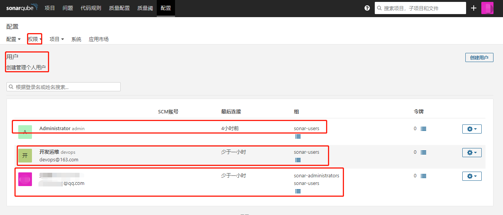

# 一、Context

### OpenLDAP的条目组织形式


#### Sonaeqube官方文档的操作步骤


# 二、操作

### 1、Sonarqube安装LDAP插件

配置--> 应用市场


### 2、修改配置文件/opt/sonarqube/conf/sonar.properties 

如果sonarqube的部署实例是使用Dockers的话，则可通过环境变量的方式注入以下配置

```properties
sonar.security.realm=LDAP
sonar.forceAuthentication=true
ldap.authentication=simple
ldap.url=ldap://openldap-service.openldap.svc:389
ldap.bindDn=cn=admin,dc=curiouser,dc=com
ldap.bindPassword=******
 
# User Configuration
ldap.user.baseDn=ou=employee,dc=curiouser,dc=com
ldap.user.request=(&(memberOf=cn=sonarqube,ou=applications,dc=curiouser,dc=com)(cn={0}))
ldap.user.realNameAttribute=sn
ldap.user.emailAttribute=mail
```

**相关配置**

| Property | Description | Default value | Required | Example |
| :-------------- | :------------------------------| :------- | :----- | :--------- |
| sonar.security.realm | Set this to LDAP authenticate first against the external sytem. If the external system is not reachable or if the user is not defined in the external system, authentication will be performed against SonarQube's internal database. |	none |	Yes |	LDAP (only possible value) |
| sonar.authenticator.downcase	| Set to true when connecting to a LDAP server using a case-insensitive setup.	| false	| No |  | 
| ldap.url	| URL of the LDAP server. If you are using ldaps, you should install the server certificate into the Java truststore.	| none	| Yes	| ldap://localhost:10389 |
| ldap.bindDn	| The username of an LDAP user to connect (or bind) with. Leave this blank for anonymous access to the LDAP directory.	| none	| No	| cn=sonar,ou=users,o=mycompany |
| ldap.bindPassword	| The password of the user to connect with. Leave this blank for anonymous access to the LDAP directory.	| none	| No	| secret |
| ldap.authentication	| Possible values: simple, CRAM-MD5, DIGEST-MD5, GSSAPI. See the tutorial on authentication mechanisms	| simple	| No | 
| ldap.realm	| See Digest-MD5 Authentication, CRAM-MD5 Authentication	| none	| No	| example.org |
| ldap.contextFactoryClass	| Context factory | class.	com.sun.jndi.ldap.LdapCtxFactory	| No | 
| ldap.StartTLS	| Enable use of StartTLS	| false	| No | 
| ldap.followReferrals	| Follow referrals or not. See Referrals in the JNDI	| true |

**用户配置**

| Property	| Description	| Default value	| Required	| Example |
| :-------- | :------------------------------| :------- | :----- | :--------- |
| ldap.user.baseDn	| Distinguished Name (DN) of the root node in LDAP from which to search for users.	| None	| Yes	| cn=users,dc=example,dc=org |
| ldap.user.request	| LDAP user request.	| (&(objectClass=inetOrgPerson)(uid={login}))	| No	| (&(objectClass=user)(sAMAccountName={login})) |
| ldap.user.realNameAttribute	| Attribute in LDAP defining the user’s real name.	| cn	| No | | 
| ldap.user.emailAttribute	| Attribute in LDAP defining the user’s email.	| mail	| No  | |

**Group Mapping Only groups are supported (not roles). Only static groups are supported (not dynamic groups).**

**For the delegation of authorization, groups must be first defined in SonarQube. Then, the following properties must be defined to allow SonarQube to automatically synchronize the relationships between users and groups.**

| Property	| Description	| Default value	| Required	| Example for Active Directory |
| :-------- | :------------------------------| :------- | :----- | :--------- |
| ldap.group.baseDn	| Distinguished Name (DN) of the root node in LDAP from which to search for groups.	| none	| No	| cn=groups,dc=example,dc=org |
| ldap.group.request	| LDAP group request.	| (&(objectClass=groupOfUniqueNames)(uniqueMember={dn}))	| No	| (&(objectClass=group)(member={dn})) |
| ldap.group.idAttribute	| Property used to specifiy the attribute to be used for returning the list of user groups in the compatibility mode.	| cn	| No	| sAMAccountName |

重启Sonarqube，启动过程中如果出现以下日志，则证明LDAP连接成功

```bash
INFO org.sonar.INFO Security realm: LDAP ...
INFO o.s.p.l.LdapContextFactory Test LDAP connection: OK
```

### 3、登录验证


### 4、权限控制

将admin用户的管理员权限删除，赋予另一个用户



 

# 参考链接

1. https://hub.docker.com/_/sonarqube?tab=description
2. https://docs.sonarqube.org/latest/instance-administration/delegated-auth/
