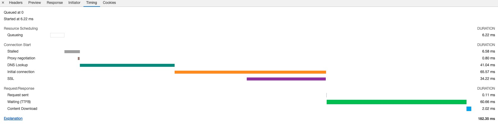
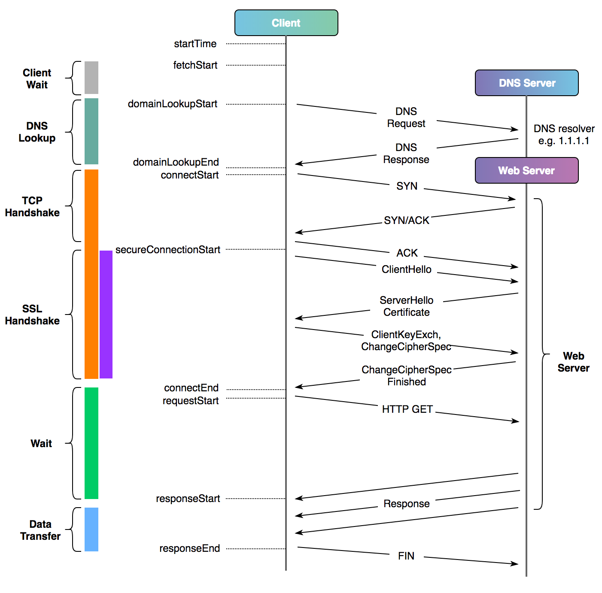

# 一、Curl命令详解

帮助文档：https://curl.se/docs/manpage.html


语法：`curl [options] [URL...]`

参数：
```bash
Options: (H) means HTTP/HTTPS only, (F) means FTP only
     --anyauth       可以使用“任何”身份验证方法
 -a, --append        FTP/SFTP上传文件时，curl将追加到目标文件，而非覆盖
     --basic         使用HTTP基本验证
     --cacert FILE   指定CA证书文件(SSL)
     --capath DIR    指定CA目录 (SSL)
 -E, --cert CERT[:PASSWD] Client certificate file and password (SSL)
     --cert-type     指定证书文件类型 (DER/PEM/ENG) (SSL)
     --ciphers LIST  指定SSL密码
     --compressed    响应压缩格式 (deflate/gzip)
 -K, --config FILE   后接参数文件，参数文件中可以定义HTTP请求的相关的内容（URL、HEAD、DATA）
     --connect-timeout SECONDS  设置最大请求时间
 -C, --continue-at OFFSET  断点续转
 -b, --cookie STRING/FILE  设置cookies
 -c, --cookie-jar FILE  操作结束后把cookie写入到文件中
     --create-dirs   建立本地目录层次结构
     --crlf          上传时把LF转变成CRLF
     --crlfile FILE  Get a CRL list in PEM format from the given file
 -d, --data DATA     HTTP POST data (H)
     --data-ascii DATA   以ascii的方式post数据
     --data-binary DATA  以二进制的方式post数据
     --data-urlencode DATA  HTTP POST data url encoded (H)
     --delegation STRING GSS-API delegation permission
     --digest        使用HTTP数字身份验证
     --disable-eprt  禁止使用EPRT或LPRT
     --disable-epsv  禁止使用EPSV
 -D, --dump-header FILE  把header信息写入到文件中
     --egd-file FILE  为随机数据(SSL)设置EGD socket路径
     --engine ENGINGE 指定加密引擎(SSL). "--engine list" for list
 -f, --fail           连接失败时不显示http错误
 -F, --form CONTENT  form表单提交
     --form-string STRING  模拟http表单提交数据
     --ftp-account DATA  Account data string (F)
     --ftp-alternative-to-user COMMAND  String to replace "USER [name]" (F)
     --ftp-create-dirs  如果远程目录不存在，创建远程目录
     --ftp-method [MULTICWD/NOCWD/SINGLECWD]  控制CWD的使用
     --ftp-pasv      使用 PASV/EPSV 代替端口
 -P, --ftp-port ADR  Use PORT with given address instead of PASV (F)
     --ftp-skip-pasv-ip Skip the IP address for PASV (F)
     --ftp-pret      Send PRET before PASV (for drftpd) (F)
     --ftp-ssl-ccc   Send CCC after authenticating (F)
     --ftp-ssl-ccc-mode ACTIVE/PASSIVE  Set CCC mode (F)
     --ftp-ssl-control Require SSL/TLS for ftp login, clear for transfer (F)
 -G, --get           使用get请求发送 -d参数指定的数据
 -g, --globoff       禁用网址序列和范围使用{}和[]
 -H, --header LINE   增加Head头
 -I, --head          只显示文档信息
 -h, --help          显示帮助信息
     --hostpubmd5 MD5  Hex encoded MD5 string of the host public key. (SSH)
 -0, --http1.0       强制使用HTTP 1.0协议
     --ignore-content-length  忽略的HTTP头信息的长度
 -i, --include       输出响应Head头
 -k, --insecure      允许curl使用非安全的ssl连接并且传输数据（证书不受信）
     --interface INTERFACE  使用指定网络接口/地址
 -4, --ipv4          解析域名为ipv4地址(域名有多个ip时)
 -6, --ipv6          解析域名为ipv6地址(域名有多个ip时)
 -j, --junk-session-cookies  读取文件时忽略session cookie (H)
     --keepalive-time SECONDS  设置连接的保活时间
     --key KEY       私钥文件名(SSL/SSH)
     --key-type TYPE 私钥文件类型 (DER/PEM/ENG) (SSL)
     --krb LEVEL     使用指定安全级别的krb (F)
     --libcurl FILE  Dump libcurl equivalent code of this command line
     --limit-rate RATE  指定最大的传输速率
 -l, --list-only     列出ftp目录下的文件名称(F)
     --local-port RANGE  强制使用本地端口号
 -L, --location      curl自动重定向（3xx）
     --location-trusted like --location and send auth to other hosts (H)
 -M, --manual        显示全手动
     --mail-from FROM  指定发信人邮箱(SMTP)
     --mail-rcpt TO  指定收信人邮箱(SMTP)
     --mail-auth AUTH  Originator address of the original email
     --max-filesize BYTES  允许下载文件的最大大小
     --max-redirs NUM  Maximum number of redirects allowed (H)
 -m, --max-time SECONDS  设置整个操作的允许消耗的最大时间，对于在延时网络下的批量操作有利
     --metalink      Process given URLs as metalink XML file
     --negotiate     使用HTTP Negotiate身份验证(H)
 -n, --netrc         从netrc文件中读取用户名和密码
     --netrc-optional 使用 .netrc 或者 URL来覆盖-n
     --netrc-file FILE  指定.netrc文件
 -N, --no-buffer     禁用输出流缓冲区
     --no-keepalive  连接不保活
     --no-sessionid  Disable SSL session-ID reusing (SSL)
     --noproxy       List of hosts which do not use proxy
     --ntlm          使用 HTTP NTLM 身份验证
 -o, --output FILE   将响应数据输出到指定文件，后接文件参数
     --pass PASS     私钥密码 (SSL/SSH)
     --post301       301重定向后不切换至GET请求 (H)
     --post302       302重定向后不切换至GET请求 (H)
     --post303       303重定向后不切换至GET请求 (H)
 -#, --progress-bar  对发送和接收进行简单的进度条展示
     --proto PROTOCOLS  Enable/disable specified protocols
     --proto-redir PROTOCOLS  Enable/disable specified protocols on redirect
 -x, --proxy [PROTOCOL://]HOST[:PORT] 设置代理
     --proxy-anyauth 选择任一代理身份验证方法 (H)
     --proxy-basic   在代理上使用基本身份验证 (H)
     --proxy-digest  在代理上使用数字身份验证 (H)
     --proxy-negotiate 在代理上使用Negotiate身份验证 (H)
     --proxy-ntlm    在代理上使用ntlm身份验证 (H)
 -U, --proxy-user USER[:PASSWORD]  设置代理用户名和密码
     --proxy1.0 HOST[:PORT]  使用HTTP/1.0的代理
 -p, --proxytunnel   Operate through a HTTP proxy tunnel (using CONNECT)
     --pubkey KEY    公钥文件 (SSH)
 -Q, --quote CMD     文件传输前，发送命令到服务器 (F/SFTP)
     --random-file FILE  File for reading random data from (SSL)
 -r, --range RANGE   检索来自HTTP/1.1或FTP服务器字节范围
     --raw           Do HTTP "raw", without any transfer decoding (H)
 -e, --referer       发送"Referer Page"到服务器
 -J, --remote-header-name Use the header-provided filename (H)
 -O, --remote-name   把输出写到文件中，保留远程文件的文件名
     --remote-name-all Use the remote file name for all URLs
 -R, --remote-time   在本地生成文件时，保留远程文件时间
 -X, --request COMMAND  指定HTTP请求方法
     --resolve HOST:PORT:ADDRESS  强制解析HOST:PORT到某个ADDRESS
     --retry NUM   传输出现问题时，重试的次数
     --retry-delay SECONDS 传输出现问题时，设置重试间隔时间
     --retry-max-time SECONDS  传输出现问题时，设置最大重试时间
 -S, --show-error     显示错误信息
 -s, --silent        静默模式。不输出任何东西
     --socks4 HOST[:PORT]  用socks4代理给定主机和端口
     --socks4a HOST[:PORT]  用socks4a代理给定主机和端口
     --socks5 HOST[:PORT]  用socks5代理给定主机和端口
     --socks5-basic  socks5代理开启username/password认证
     --socks5-gssapi socks5代理开启GSS-API认证
     --socks5-hostname HOST[:PORT] SOCKS5 proxy, pass host name to proxy
     --socks5-gssapi-service NAME  SOCKS5 proxy service name for gssapi
     --socks5-gssapi-nec  Compatibility with NEC SOCKS5 server
 -Y, --speed-limit RATE  如果在speed-time期间，下载比speed-limit这个更慢，则下载废止
 -y, --speed-time SECONDS  如果在speed-time期间，下载比speed-limit这个更慢，则下载废止。默认30s
     --ssl           Try SSL/TLS (FTP, IMAP, POP3, SMTP)
     --ssl-reqd      Require SSL/TLS (FTP, IMAP, POP3, SMTP)
 -2, --sslv2         使用SSLv2的（SSL）
 -3, --sslv3         使用SSLv3的（SSL）
     --ssl-allow-beast Allow security flaw to improve interop (SSL)
     --stderr FILE   指定错误信息输出文件
     --tcp-nodelay   使用TCP_NODELAY选项
 -t, --telnet-option OPT=VAL Telnet选项设置
     --tftp-blksize VALUE  设置TFTP BLKSIZE(必须大于512)
 -z, --time-cond TIME  传送时间设置
 -1, --tlsv1         强制使用TLS version 1.x
     --tlsv1.0       使用TLSv1.0 (SSL)
     --tlsv1.1       使用TLSv1.1 (SSL)
     --tlsv1.2       使用TLSv1.2 (SSL)
     --trace FILE    dump出输入输出数据至文件
     --trace-ascii FILE 跟'--trace'一样，但是没有hex输出
     --trace-time    跟踪/详细输出时，添加时间戳
     --tr-encoding   Request compressed transfer encoding (H)
 -T, --upload-file FILE  上传文件
     --url URL       URL to work with
 -B, --use-ascii     使用ASCII文本传输
 -u, --user USER[:PASSWORD]  设置服务端用户和密码
     --tlsuser USER  TLS用户名
     --tlspassword STRING TLS密码
     --tlsauthtype STRING  TLS认证类型(default SRP)
     --unix-socket FILE    Connect through this UNIX domain socket
 -A, --user-agent STRING  发送用户代理给服务器 (H)
 -v, --verbose       获取更多输入输出相关的内容，对于debug非常有用
 -V, --version       显示当前的curl版本
 -w, --write-out FORMAT  指定完成请求以后输出什么信息
     --xattr        Store metadata in extended file attributes
 -q                 If used as the first parameter disables .curlrc
```

# 二、实例详解

## 1、通过-o/-O选项保存下载的文件到指定的文件中

`-o`：将文件保存为命令行中指定的文件名的文件中

`-O`：使用URL中默认的文件名保存文件到本地

```bash
# 将文件下载到本地并命名为mygettext.html
curl -o mygettext.html http://www.gnu.org/software/gettext/manual/gettext.html

# 将文件保存到本地并命名为gettext.html
curl -O http://www.gnu.org/software/gettext/manual/gettext.html
```

## 2、显示response中的Headers或Body

`-i`：显示response header 和 body

`-I`：只显示response header

```bash
curl -i https://www.baidu.com
curl -I https://www.baidu.com
```

## 3、同时获取多个文件

```bash
curl -O URL1 -O URL2
```

## 4、代理的设置

`-x`：为CURL设置代理

```bash
curl -x 192.168.1.2:3128 http://google.com/
```

如果curl命令请求不想走系统代理

```bash
curl --noproxy http://www.baidu.com
```

## 5、允许重定向

`-L`：允许重定向

```bash
curl -L -x 192.168.1.2:3128 http://google.com/
```

## 6、限速

`--limit-rate`： 对CURL的最大网络使用进行限制

```bash
curl --limit-rate 1000B -O http://www.gnu.org/software/gettext/manual/gettext.html
```

## 7、添加认证信息

`-u`: 在访问需要认证的页面时，可通过-u选项提供用户名和密码进行授权


```bash
curl -u username:password URL
# 通常的做法是在命令行只输入用户名，之后会提示输入密码，这样可以保证在查看历史记录时不会将密码泄露
curl -u username URL
```

## 8、获取更多信息

`-v 和 -trace`：获取更多信息

```bash
curl -v -L -x 192.168.1.2:3128 http://google.com/
```

## 9、自定义HTTP请求: POST/PUT/DELETE

`-X`: 可以指定curl发送HTTP请求的方法，例如GET(默认),PUT,POST,DELETE等

`-H`：添加请求的Header信息

`-d/--data`: 添加请求的Body

```bash
curl -XPUT "http://127.0.0.1:9200/test/test/1" \
-H 'Content-Type: application/json' \
-d '
{
  "id": "191",
  "prd_id": "4",
  "mer_id": "1000005",
  "data_status": "0",
  "datachange_createtime": "1543915326",
  "datachange_lasttime": "1543915368"
}'
```


```bash
nc -l 8080 &
curl -X POST http://localhost:8080 \
  -H "Content-Type: application/json" \
  -H "Connection: close" \
  --data-binary @测试数据.json
```

```bash
nc -l 8080 &

curl "http://localhost:8080" \
	-H "Accept: application/json" \
	-H "Content-Type: application/json" \
	--data @- <<EOF
{
  "me": "$USER",
  "something": $(date +%s)
}
EOF
```


## 10、断点续传

`-C`: 可对大文件使用断点续传功能

```bash
curl -C -O http://www.gnu.org/software/gettext/manual/gettext.html
```

## 11、模仿浏览器

`-A`：指定浏览器去访问网站(有些网站需要使用特定的浏览器去访问他们，有些还需要使用某些特定的版本)

```bash
curl -A "Mozilla/4.0 (compatible; MSIE 8.0; Windows NT 5.0)" http://google.com/
```

## 12、显示下载进度条

`-#` ：显示下载进度条

```bash
curl -# -O http://www.linux.com/dodo1.JPG
```

## 13、伪造referer（盗链）

很多服务器会检查http访问的referer从而来控制访问。比如：你是先访问首页，然后再访问首页中的邮箱页面，这里访问邮箱的referer地址就是访问首页成功后的页面地址，如果服务器发现对邮箱页面访问的referer地址不是首页的地址，就断定那是个盗连了

`-e`: 设定referer

```bash
curl -e "www.linux.com" http://mail.linux.com
# 这样就会让服务器其以为你是从www.linux.com点击某个链接过来的
```

## 14、保存与使用Cookie

`-D`: 保存Cookie

`-b`: 使用Cookie

```bash
# 将网站的cookies信息保存到sugarcookies文件中
curl -D sugarcookies http://localhost/sugarcrm/index.php

# 使用上次保存的cookie信息
curl -b sugarcookies http://localhost/sugarcrm/index.php
```

## 15、忽略证书不受信问题

`-k`: 忽略HTTPS证书不受信问题

```bash
curl -k https://allinone.okd311.curiouser.com:8443
```

## 16、引用环境变量

Shell脚本中使用Curl命令，经常要通过变量替换变量中的值。使用`'"$var"'`进行应用

```bash
curl 'https://oapi.dingtalk.com/robot/send?access_token=******' \
-H 'Content-Type: application/json' \
-d '{"msgtype": "text",
     "text": {"content": "消息是: '"$message"'"}
}'
```

## 17、强制域名解析至指定IP地址

```bash
curl --resolve test.test.com:80:127.0.0.1 "http://test.test.com/"
```

## 18、显示请求的耗时情况

`curl` 命令提供了 `-w` 参数，能够帮助分析请求的哪一步耗时比较长，好进一步找到问题的原因。


`-w`后面指定要显示的内容，后面可通过curl的变量显示某一项耗时。以下为内置

- `time_namelookup`：DNS 域名解析耗时
- `time_connect`：TCP 连接建立的时间，就是三次握手的时间
- `time_appconnect`：SSL/SSH 等上层协议建立连接的时间，比如 connect/handshake 的时间
- `time_redirect`：从开始到最后一个请求事务的时间
- `time_pretransfer`：从请求开始到响应开始传输的时间
- `time_starttransfer`：从请求开始到第一个字节将要传输的时间，这包括time_pretransfer以及服务器计算结果所需的时间。
- `time_total`：这次请求花费的全部时间
- `url_effective`: 最终获取的url地址，尤其是当你指定给curl的地址存在301跳转，且通过-L继续追踪的情形。
- `time_redirect`:  重定向时间，包括到最后一次传输前的几次重定向的DNS解析，连接，预传输，传输时间
- `num_redirects`:  在请求中跳转的次数
- `ssl_verify_result`: ssl认证结果，返回0表示认证成功。
- `size_request`: 请求的大小

```bash
$ curl -kls \
-w "\n请求响应状态码 : %{http_code}\n----------\n请求信息：\n  客户端信息:     %{local_ip}:%{local_port} \n  服务器信息:     %{remote_ip}:%{remote_port}\n  发送请求个数:   %{num_connects}\n  请求大小:       %{size_request} bytes\n  重定向URL:      %{redirect_url}\n  响应Header大小: %{size_header} bytes\n请求耗时统计:\n  DNS解析完成时间:        第%{time_namelookup}秒\n  TCP握手完成时间:        第%{time_connect}秒\n  SSL握手完成时间:        第%{time_appconnect}秒\n  客户端发送请求开始时间: 第%{time_pretransfer}秒\n  请求收到第一个字节时间: 第%{time_starttransfer}秒\n  请求结束时间:           第%{time_total}秒\n----------\nTCP和SSL连接耗时: %{time_pretransfer} - %{time_namelookup}\n服务器处理耗时:   %{time_starttransfer} - %{time_pretransfer}\n响应数据传输耗时: %{time_total} - %{time_starttransfer}\n共计耗时:         %{time_total}秒\n" \
https://google.com

<HTML><HEAD><meta http-equiv="content-type" content="text/html;charset=utf-8">
<TITLE>301 Moved</TITLE></HEAD><BODY>
<H1>301 Moved</H1>
The document has moved
<A HREF="https://www.google.com/">here</A>.
</BODY></HTML>

请求响应状态码 : 301
----------
请求信息：
  客户端信息:     127.0.0.1:64073
  服务器信息:     127.0.0.1:8001
  发送请求个数:   1
  请求大小:       184 bytes
  重定向URL:      https://www.google.com/
  响应Header大小: 508 bytes
请求耗时统计:
  DNS解析完成时间:        第0.000114秒
  TCP握手完成时间:        第0.000358秒
  SSL握手完成时间:        第0.460882秒
  客户端发送请求开始时间: 第0.460956秒
  请求收到第一个字节时间: 第0.603045秒
  请求结束时间:           第0.603188秒
----------
TCP和SSL连接耗时: 0.460956 - 0.000114
服务器处理耗时:    0.603045 - 0.460956
响应数据传输耗时:  0.603188 - 0.603045
共计耗时:         0.603188秒
```

可将`-w`的输出格式配置写在curl的默认配置文件`~/.curlrc`中

```bash
-kls
-w "\n请求响应状态码 : %{http_code}\n----------\n请求信息：\n  客户端信息:     %{local_ip}:%{local_port} \n  服务器信息:     %{remote_ip}:%{remote_port}\n  发送请求个数:   %{num_connects}\n  请求大小:       %{size_request} bytes\n  重定向URL:      %{redirect_url}\n  响应Header大小: %{size_header} bytes\n请求耗时统计:\n  DNS解析完成时间:        第%{time_namelookup}秒\n  TCP握手完成时间:        第%{time_connect}秒\n  SSL握手完成时间:        第%{time_appconnect}秒\n  客户端发送请求开始时间: 第%{time_pretransfer}秒\n  请求收到第一个字节时间: 第%{time_starttransfer}秒\n  请求结束时间:           第%{time_total}秒\n----------\nTCP和SSL连接耗时: %{time_pretransfer} - %{time_namelookup}\n服务器处理耗时:   %{time_starttransfer} - %{time_pretransfer}\n响应数据传输耗时: %{time_total} - %{time_starttransfer}\n共计耗时:         %{time_total}秒\n"
```

Chrome控制台时间显示的耗时对应





参考：

1. https://curl.se/docs/manpage.html
2. https://blog.cloudflare.com/a-question-of-timing/
3. https://cizixs.com/2017/04/11/use-curl-to-analyze-request/
4. https://blog.csdn.net/weifangan/article/details/80741981

## 19、新版本Curl不支持旧的TLS版本

创建`~/.openssl_allow_tls1.0.cnf`

```bash
openssl_conf = openssl_init

[openssl_init]
ssl_conf = ssl_sect

[ssl_sect]
system_default = system_default_sect

[system_default_sect]
CipherString = DEFAULT@SECLEVEL=1
```

生效

```bash
OPENSSL_CONF=~/.openssl_allow_tls1.0.cnf curl -v https://*****

# 或者

export OPENSSL_CONF=~/.openssl_allow_tls1.0.cnf
curl -v https://*****
unset OPENSSL_CONF
```

或者直接设置全局的OpenSSL配置文件 `/etc/ssl/openssl.cnf`

```bash
openssl_conf = openssl_init

[openssl_init]
ssl_conf = ssl_sect

[ssl_sect]
system_default = system_default_sect

[system_default_sect]
CipherString = DEFAULT@SECLEVEL=1
```

参考： https://askubuntu.com/questions/1250787/when-i-try-to-curl-a-website-i-get-ssl-error

## 20、使用SSL证书文件

```bash
# 使用client.pem+key.pem
curl -k --cert client.pem --key key.pem https://www.xxxx.com
# 使用all.pem
curl -k --cert all.pem  https://www.xxxx.com
```

## 21、不显示进度但显示报错

```bash
curl -sS https://google.com
```

## 22、上传文件

```bash
curl --form upload=@localfilename --form press=OK https://google.com
```

## 23、显示trace等详细信息

```bash
curl --trace-ascii /dev/stdout https://google.com

curl --trace-ascii - https://google.com
```


# 参考：

- https://superuser.com/questions/291424/how-do-you-display-post-data-with-curl
