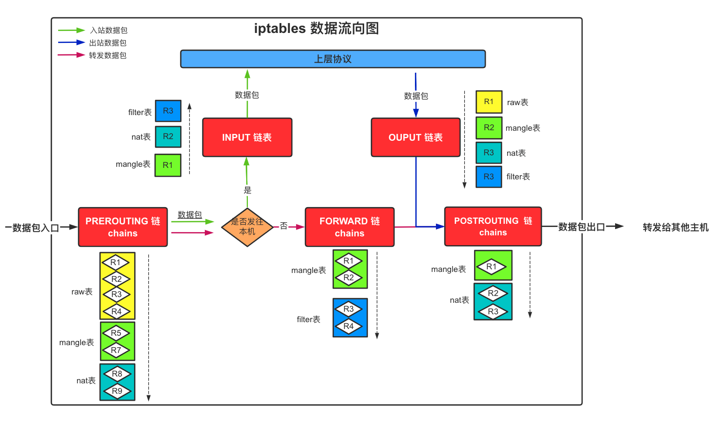
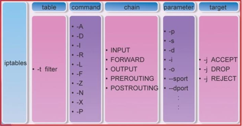
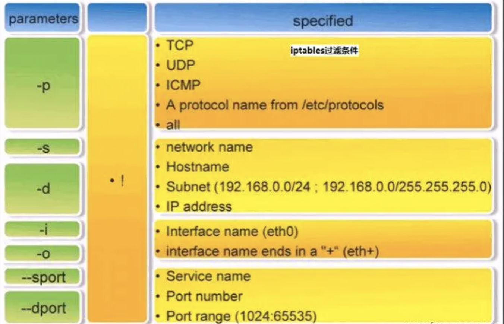

# iptables

# 一、简介

**iptables**其实不是真正的防火墙，我们可以把它理解成一个客户端代理，用户通过iptables这个代理，将用户的安全设定执行到对应的**netfilter**安全框架"中，**netfilter**位于内核空间。

自1995年ipfwadm开始进入1.2.1的核心，Linux的防火墙实现有很长的时间了。Ipfwadm实现了标准的tcp/ip包过滤功能，比如过滤源地址与目的地址以及端口过滤。早在1999年第一个稳定的2.2.0核心中防火墙的实现被ipchains替代了，ipchains的新功能包括支持规则链，碎片包控制，较好的网络地址翻译功能（NAT）以及其他一些有用的改进。我们需要明白Linux防火墙包括核心级代码（通常是可加载核心模块或者核心源程序的补丁）和用户级代码（一个配置的工具，比如/usr/bin/ipchains，这是用来插入包规则到核心空间的）因此无论如何，只要新的linux防火墙代码被引入，核心和用户空间的有关代码都要改写。

2001年2.4的核心完成了，iptables出现了。它引入了很多重要的改进，比如基于状态的防火墙，基于任何TCP标记和MAC地址的包过滤，更灵活的配置和记录功能，强大而且简单的NAT功能和透明代理功能，通过速度限制实现DoS的阻止。

然而，最重要变化是引入了模块化的架构方式。比如，ipchains和ipfwadm兼容模式是通过一个核心模块的设置实现的，该模块能够在运行的核心中插入，以便提供相应的通讯功能。在附加的变化中，用户自定义编码功能已经成为了可能，比如过滤一定范围的端口，根据TTL值和包的到达时间进行判断，对自定义的协议进行状态监视，对随机的数据包进行监视等，这些目前都还不是iptable的一部分，但是在未来将被实现。很多很有趣的新模块已经完成了。编写一个可加载的核心模块来创建核心级代码，通过用户级代码实现控制过滤器的行为。

# 二、基础知识

## 1、iptables和netfilter的关系

iptables其实是一个命令行工具，位于用户空间，我们用这个工具操作真正的框架netfilter。

 netfilter/iptables（下文中简称为iptables）组成Linux平台下的包过滤防火墙，与大多数的Linux软件一样，这个包过滤防火墙是免费的，它可以代替昂贵的商业防火墙解决方案，完成封包过滤、封包重定向和网络地址转换（NAT）等功能。

## 2、iptables传输数据包的过程

① 当一个数据包进入网卡时，它首先进入PREROUTING链，内核根据数据包目的IP判断是否是发往本机的<font color=red>（本机的任何一个接口IP地址）</font>，那么这个网络包将被认为是流向本机的。

② 如果数据包就是进入本机的，它就会沿着图向下移动，到达INPUT链。数据包到了INPUT链后，任何进程都会收到它。本机上运行的程序可以发送数据包，这些数据包会经过OUTPUT链，然后到达POSTROUTING链输出。

③ 如果数据包是要转发出去的，且内核允许转发，数据包就会流向FORWARD链进行处理（是否转发或拦截），然后到达POSTROUTING链（是否修改数据包的地 址等）进行处理。



**报文的链流向**：

- **到本机某进程的报文**：`PREROUTING --> INPUT`
- **由本机转发的报文**：`PREROUTING --> FORWARD --> POSTROUTING`
- **由本机的某进程发出报文（通常为响应报文）**：`OUTPUT --> POSTROUTING`

**报文到达链后匹配表的优先顺序：**

`raw ==>  mangle ==> nat ==> filter`

## 3、链chains

- 链的作用：容纳各种防火墙规则
- 链的分类依据：处理数据包的不同时机

**内置链**：

- **PREROUTING**：在进行路由选择前处理数据包（做目标地址转换）
- **INPUT**：处理入站数据包
- **FORWARD**：处理转发数据包
- **OUTPUT**：处理出站数据包
- **POSTROUTING**：在进行路由选择后处理数据包（对数据链进行源地址修改转换）

## 4、表tables

- **filter表**：负责过滤功能，防火墙；**内核模块**：iptables_filter
- **nat表**：网络地址转换功能；**内核模块**：iptable_nat
- **mangle表**：拆解报文，做出修改，并重新封装的功能；**内核模块**：iptable_mangle
- **raw表**：关闭nat表上启用的连接追踪机制；**内核模块**：iptable_raw

# 三、iptables规则

- 规则（rules）其实就是网络管理员预定义的条件

- 规则一般的定义为“**指定什么样的数据包头符合什么的条件，就怎么样处理这个数据包**”
- 规则的作用：对数据包进行过滤或处理
- 规则存储在内核空间的信息 
- 包过滤表中，这些规则分别指定了`源地址、目的地址、传输协议（如TCP、UDP、ICMP）和服务类型（如HTTP、FTP和SMTP）`等。当数据包与规 则匹配时，iptables就根据规则所定义的方法来处理这些数据包，如`放行（accept）、拒绝（reject）和丢弃（drop）`等。
- 配置iptables防火墙的主要工作就是添加、修改和删除这些规则。

## 1、规则定义

### ⓪语法格式

```bash
iptables  [ -t 表名 ] 命令选项 ［链名］［匹配规则］［-j 处理动作］

# 表名 必须是 raw， nat，filter，mangle 中的一个。默认指filter表
# 不指定链名时，默认指表内的所有链
# 除非设置链的默认策略，否则必须指定匹配条件
# 命令选项、链名、处理动作使用大写字母，其余均为小写
```

### ①命令选项

**规则管理命令选项**：

- **-A**：在指定链的末尾添加（append）一条新的规则
- **-D**：删除（delete）指定链中的某一条规则，可以按规则序号和内容删除
- **-I** ： 在指定链中插入（insert）一条新的规则，默认在第一行添加
- **-R**：修改、替换（replace）指定链中的某一条规则，可以按规则序号和内容替换

**查看命令选项**：

- **-L** ：列出（list）指定链中所有的规则进行查看
- **--line-numbers**：查看规则时，显示规则的序号
- **-n** ：使用数字形式（numeric）显示输出结果
- **-v**：以更详细的方式显示规则信息

**链管理命令（这都是立即生效的）**：

- **-E** ：重命名用户定义的链，不改变链本身
- **-F** ：清空（flush）
- **-N**：新建（new-chain）一条用户自己定义的规则链
- **-X** ：删除指定表中用户自定义的规则链（delete-chain）
- **-P** ：设置指定链的默认策略（policy）
- **-Z** ：将所有表的所有链的字节和数据包计数器清零

### ②匹配规则

#### 1)  **通用匹配**

- 协议匹配: `-p [协议名]`
- 地址匹配
  - `-s [源地址]`
  - `-d [目标地址]`
- 接口匹配
  - `-i [入站网卡]`
  - `-o [出站网卡]`

#### 2) **隐含匹配**

- 端口匹配
  - `-sport [源端口]`
  - `-dport [目标端口]`
  
- TCP连接标记匹配：`--tcp-flags [列表1：检查范围] [列表2：被设置的标记]`   

    - 有两个参数列表，列表内部用逗号为分隔符，两个列表之间用空格分开
    - LIST1用作参数检查，LIST2用作参数匹配。
    - 可用标志有：
      - SYN( 同步; 表示开始会话请求 ),
      -  ACK（应答）,
      - FIN（结束; 结束会话），
      - RST(复位;中断一个连接) 
      - PSH（推送; 数据包立即发送），
      - URG（紧急 ）， 
      - ALL（指选定所有的标记），
      - NONE（指未选定任何标记）

    ```bash
    iptables -A INPUT -p tcp –tcp-flags SYN,FIN,ACK SYN
      # 表示SYN、ACK、FIN的标志都检查，但是只有SYN匹配
    iptables -A FROWARD -p tcp –tcp-flags ALL SYN,ACK
      # 表示ALL（SYN，ACK，FIN，RST，URG，PSH）的标志都检查，但是只有设置了SYN和ACK的匹配。
    ```

- ICMP类型匹配：`--icmp-type [ICMP类型]`

#### 3) 显式匹配(-m): 

iptables可使用额外的扩展模块进行显示条件匹配，详情参考第四章节







### ③处理动作

动作也可以分为基本动作和扩展动作

- **ACCEPT**：允许数据包通过。
- **DROP**：直接丢弃数据包，不给任何回应信息，这时候客户端会感觉自己的请求泥牛入海了，过了超时时间才会有反应。
- **REJECT**：拒绝数据包通过，必要时会给数据发送端一个响应的信息，客户端刚请求就会收到拒绝的信息。
- **SNAT**：源地址转换，解决内网用户用同一个公网地址上网的问题。
- **MASQUERADE**：地址伪装。是SNAT的一种特殊形式，适用于动态的、临时会变的ip上。
- **DNAT**：目标地址转换。
- **REDIRECT**：在本机做端口映射
- **MASK** : 做防火墙标记
- **RETURN** : 返回调用链
- **LOG**：在/var/log/messages文件中记录日志信息，然后将数据包传递给下一条规则，也就是说除了记录以外不对数据包做任何其他操作，仍然让下一条规则去匹配。
  - `--log-level LEVEL` : 日志的等级
  - `--log-prefix FREFIX` : 日志的提示语句的前缀

## 2、规则管理

### ①查看规则

```bash
# 查看表中的规则
iptables -L -t filter
# 查看链中的规则
iptables -L INPUT
iptables -L FORWARD --line-numbers 
# 查看POSTROUTING链nat表中的规则
iptables -L POSTROUTING -t nat
iptables -L PREROUTING -t nat --line-numbers
```

### ②删除规则

```bash
# 删除所有的规则
iptables -F
# 删除链中指定的规则
iptables -D FORWARD 1
# 删除链中指定表的规则
iptables -D POSTROUTING -t nat 1
```

### ③添加规则

```bash
# 在指定链的末尾添加（append）一条新的规则
iptables -A FORWARD -s 10.8.0.10 -d 192.168.1.5 -j DROP
# 在指定链中插入（insert）一条新的规则，默认在第一行添加
iptables -I FORWARD -s 10.8.0.10 -d 192.168.1.5 -j DROP
```

## 3、规则的匹配顺序

**①按自上而下的顺序依次匹配，匹配即停止（LOG策略例外）**

**②若找不到相匹配的规则，则按该链的默认策略处理**

# 四、iptables的显示扩展模块

官方文档：https://ipset.netfilter.org/iptables-extensions.man.html

必须使用`-m`选项手动加载模块, 其扩展模块路径为:`/lib64/xtables,其中大写的为目标扩展,小写的为规则扩展`

## 1、模块管理

### ①查看Iptables已加载的模块

```bash
cat /proc/net/ip_tables_matches
# 查看内核已编译的模块
```

### ②查看内核支持的模块

```bash
ls /lib/modules/$(uname -r)/kernel/net/netfilter/*
#  或者
ls /lib/modules/nf_*
#  或者
ls /usr/lib/iptables/
```

### ③加载模块

```bash
modprobe 模块名
```

**CentOS/Redhat**

编辑`/etc/sysconfig/iptables-config`

```bash
IPTABLES_MODULES="模块1 模块2"
```

然后重启iptables

```bash
systemctl restart iptables
```

例如手动加载注释模块

```bash
OS=$(uname -r)
insmod /lib/modules/${OS}/kernel/net/netfilter/xt_comment.ko
iptables -D INPUT -p tcp -m multiport --dports 26721:26729,22313 -m comment --comment "bt_port" -j ACCEPT
```

## 2、模块语法

 `-m 扩展模块 --模块参数`

查看模块的支持的参数：

```bash
iptables -m <match/module name> --help
# 如果不显示模块的详细参数，则说明该模块没有加载，无法使用
```

## 3、常见条件匹配模块示例

### ①multiport：多端口匹配模块

`-m multiport --sport | --dport [端口列表]`

```bash
iptables -A INPUT -p tcp -m multiport --dport 22,25,80,443 -j ACCEPT
```

### ②iprange：IP范围匹配模块

`-m iprange --src-range [IP范围]`

```bash
iptables -A FORWARD -p tcp -m iprange --src-range 192.168.1.10-192.168.1.20 -j ACCEPT
```

`-m iprange --dst-range [IP范围]`

```bash
iptables -t nat -A POSTROUTING -s 10.11.2.2/32 -p tcp -m multiport --dport 22,4000 -m iprange --dst-range 192.168.10.1-192.168.10.9 -j SNAT --to 192.168.1.2
```

### ③mac：MAC地址匹配模块

`-m mac --mac-range [MAC地址]`

```bash
iptables -A INPUT -m mac --mac-source 00:01:02:03:04:cc -j DROP
```

将来自`macblock`集合中的源MAC地址、目的端口为`21033`的TCP流量拒绝掉

```bash
ipset create macblock hash:mac
ipset add macblock 00:11:22:33:44:55
iptables -I INPUT -p tcp --dport 12033 -m set --match-set macblock srcmac -j DROP
```

tcpdump监控流量是否生效

```bash
tcpdump -i enp0s5 ether src host 00:11:22:33:44:55 and port 12033
```

设置定时移除拒绝MAC地址

```bash
apt install -y at
echo "ipset del 00:11:22:33:44:55" |  at now + 5 minutes
```

### ④state：报文状态匹配模块

`--state [报文状态]`：多个state可以使用`,`号分隔

支持配置的报文状态：

- `ESTABLISHED`：第一个成功穿越防火墙的报文之后所有的报文；
- `NEW`：一个连接的第一个报文，例如TCP连接中的SYN报文；
- `RELATED`：伴随连接的报文，即某个已经处于`ESTABLISHED`的连接所产生的报文，这些报文不属于第一条连接，但是的确是由第一条连接产生的；
- `INVALID`：如果一个包没有办法被识别，或者这个包没有任何状态，那么这个包的状态就是INVALID，我们可以主动屏蔽状态为INVALID的报文
- `UNTRACKED`：报文的状态为untracked时，表示报文未被追踪，当报文的状态为Untracked时通常表示无法找到相关的连接。

```bash
iptables -A INPUT -d 172.168.100.67 -p tcp -m multiport --dport 22,80 -m state --state NEW,ESTABLISHED -j ACCEPT
```

### ⑤string：字符串匹配模块

` --algo {匹配算法: bm|kmp} ` 

`--string "字符串"`

```bash
iptables -I OUTPUT -s 192.168.1.0/24 -m string --algo kmp --string "qq" -j REJECT     
#使用kmp算法限制拒绝源地址192.168.1.0/24带有"qq"字符串的请求
iptables -I INPUT -m string --string "export/*" --algo bm -j DROP
```

### ⑥limit：连接数匹配模块

`—limit`:  平均速率，单位：个数/second ，个数/minute，个数/hour

`--limit-burst`:  峰值数量，默认5个

```bash
iptables -I INPUT -d 172.16.100.7 -p tcp --dport 22 -m limit --limit 25/minute --limit-burst 100 -j ACCEPT
# 当达到100个连接后，才启用上述25/minute限制
```

### ⑦connlimit：连接数匹配模块

`--connlimit-upto n` : 当现在的连接数量低于或等于这个数量(n),就匹配
`--connlimit-above n` : 当现有的连接数量大于这个数量, 就匹配

```bash
iptables -A INPUT -d 172.16.36.61 -p tcp --dport 22 -m connlimit --connlimit-above 2 -j REJECT
```

### ⑧time：时间限制匹配模块

`-m time --datestart --datestop --timestart --timestop`

```bash
iptables -A INPUT -p tcp --dport 21 -s 192.168.1.0/24 -m time ! --weekdays 6,7 -m time --timestart 8:30 --timestop 18:00 -m connlimit --connlimit-above 5 -j ACCET
# 在工作时间，即周一到周五的8:30-18:00，开放本机的ftp服务给 192.168.1.0网络中的主机访问；并且数据下载请求的次数每分钟不得超过 5 个；
```

### ⑨set: 地址集合模块

- 普通的iptables链是线性的存储和过滤，在进行规则匹配时，是从规则列表中从头到尾一条一条进行匹配。这像是在链表中搜索指定节点费力
- ipset 提供了把这个 O(n) 的操作变成 O(1) 的方法：就是把要处理的 IP 放进一个集合，对这个集合设置一条 iptables 规则。存储在带索引的数据结构中,这种结构即使集合比较大也可以进行高效的查找

- ipset是iptables的扩展，允许创建管理匹配整个地址集合的规则。命令详解参考附录第2章节

`-m set –match-set 地址集合名称  ` 

```bash
iptables -I INPUT -m set –match-set 集合名称 src -p tcp -j DROP
```

### ⑩Owner：用户模块

- **–uid-owner** 和 **–gid-owner** 这两个选项用来匹配数据包由哪个用户和哪个用户组所产生，它们的功能由 xt_owner.ko 模块提供，且仅适用在 OUTPUT 链 POSROUTING 链中。
  - **–uid-owner userid | username**
    该选项用来匹配数据包由哪个用户产生，因此可以利用这来限制该用户只能访问某些特定的网络服务，
  - **–gid-owner groupid | groupname**
    该选项和 –uid-owner 类似，它用来匹配某个用户组所产生的数据包。

```bash
groupadd no-internet
iptables -I OUTPUT 1 -m owner --gid-owner no-internet -j DROP
useradd -g no-internet username
```

参考：https://serverfault.com/questions/550276/how-to-block-internet-access-to-certain-programs-on-linux


# 五、iptables的内核调优

## 1、iptables的conntrack连接追踪优化

- conntrack是netfilter的核心。有许多增强的功能，例如，地址转换（NAT），基于内容的业务识别（l7， layer-7 module）都是基于连接跟踪。

- nf_conntrack模块在`kernel 2.6.15（2006-01-03发布）` 被引入，支持ipv4和ipv6，取代只支持ipv4的ip_connktrack，用于跟踪连接的状态，供其他模块使用。

- iptables的连接追踪表最大容量是`/proc/sys/ipv4/ip_conntrack_max`设置的, 链接达到各种状态的超时后,会从表中删除,当模板满载时, 后续的链接可能会超时

- 跟踪的连接用`哈希表`存储，每个桶（bucket）里都是1个链表，默认长度为4KB。netfilter的哈希表存储在内核空间，这部分内存不能swap

- 哈希表大小 ：64位的最大连接数/8； 32位的最大连接数/4

- 在64位下，当CONNTRACK_MAX为 `1048576`，HASHSIZE 为 `262144` 时，最多占350多MB

- **连接跟踪调优计算公式**

  - `CONNTRACK_MAX（最大几率的连接条数） = 内存个数*1024*1024*1024/16384/2 = ***`

  - `Buckets（哈希表大小） = CONNTRACK_MAX / 4 = ***（Byte字节）`
  - `跟踪数暂用最内存大小 = CONNTRACK_MAX * 300（Byte字节）= ***（Byte字节）`

- **异常现象**：

  - 丢包

- **可调优参数**

  - **哈希表桶大小**

    注：net.netfilter.nf_conntrack_buckets 不能直接改（报错）

    ```bash
    # 临时生效
    echo 262144 > /sys/module/nf_conntrack/parameters/hashsize
    
    # 重启永久生效
    新建文件：/etc/modprobe.d/iptables.conf
    options nf_conntrack hashsize = 32768 
    ```

  - **最大追踪连接数**

    注：加大max值, 也会加大内存的压力

    ```bash
    # 临时生效
    sysctl -w net.nf_conntrack_max = 393216
    sysctl -w net.netfilter.nf_conntrack_max = 393216
    
    # 永久生效
    echo "net.nf_conntrack_ma=393216" >> /etc/sysctl.conf
    echo "net.netfilter.nf_conntrack_max=393216" >> /etc/sysctl.conf
    sysctl -p
    ```

  - **响应时间**

    ```bash
    net.netfilter.nf_conntrack_tcp_timeout_close_wait: 
      # CLOSE_WAIT是被动方收到FIN发ACK，然后会转到LAST_ACK发FIN，除非程序写得有问题，正常来说这状态持续时间很短。默认 60 秒
    
    # 临时生效
    sysctl -w net.netfilter.nf_conntrack_tcp_timeout_established=300
    sysctl -w net.netfilter.nf_conntrack_tcp_timeout_time_wait=120
    sysctl -w net.netfilter.nf_conntrack_tcp_timeout_close_wait=60
    sysctl -w net.netfilter.nf_conntrack_tcp_timeout_fin_wait=120
    
    # 永久生效
    echo "net.netfilter.nf_conntrack_tcp_timeout_established=300" >> /etc/sysctl.conf
    echo "net.netfilter.nf_conntrack_tcp_timeout_time_wait=120" >> /etc/sysctl.conf
    echo "net.netfilter.nf_conntrack_tcp_timeout_close_wait=60" >> /etc/sysctl.conf
    echo "net.netfilter.nf_conntrack_tcp_timeout_fin_wait=120" >> /etc/sysctl.conf
    sysctl -p
    ```

# 六、iptables应用

- https://github.com/trimstray/iptables-essentials

## 1、防火墙

### ①防止ACK欺骗

拒绝TCP标记为SYN/ACK但连接状态为NEW的数据包，

```
iptables -A INPUT -p tcp --tcp-flags SYN,ACK SYN,ACK -m state --state NEW -j DROP
```

### ②防止TCP Null扫描

```
iptables -A INPUT -p tcp --tcp-flags ALL NONE -j DROP
```

### ③防止Xmas扫描

```
iptables -A INPUT -p tcp --tcp-flags ALL FIN,URG,PSH -j DROP
```

### ④限流/防止端口DoS攻击

```bash
iptables -A INPUT -p tcp --dport 80 -m limit --limit 25/minute --limit-burst 100 -j ACCEPT
# -m limit: 启用limit扩展，限制速度。
# --limit 25/minute: 允许最多每分钟25个连接
# --limit-burst 100: 当达到100个连接后，才启用上述25/minute限制
```

### ⑤限制主机服务时间

在工作时间，即周一到周五的8:30-18:00，开放本机的ftp服务给 192.168.1.0网络中的主机访问；并且数据下载请求的次数每分钟不得超过 5 个；

```bash
iptables -A INPUT -p tcp --dport 21 -s 192.168.1.0/24 -m time ! --weekdays 6,7 -m time --timestart 8:30 --timestop 18:00 -m connlimit --connlimit-above 5 -j ACCET
```

### ⑥**丢弃无效数据包**

```bash
iptables -A INPUT -m conntrack --ctstate INVALID -j DROP
```

### ⑦关键词屏蔽

```bash
iptables -I FORWARD -p udp --dport 53 -m string --string "tencent" -m time --timestart 8:15 --timestop 20:30 --days Mon,Tue,Wed,Thu,Fri,Sat -j DROP
iptables -I FORWARD -p udp --dport 53 -m string --string "TENCENT" -m time --timestart 8:15 --timestop 20:30 --days Mon,Tue,Wed,Thu,Fri,Sat -j DROP
iptables -I FORWARD -p udp --dport 53 -m string --string "qq.com" -m time --timestart 8:15 --timestop 20:30 --days Mon,Tue,Wed,Thu,Fri,Sat -j DROP

iptables -I FORWARD -s 10.113.0.0/24 -m string --string "ay2000.net" -j DROP    # 关键词屏蔽
iptables -I FORWARD -s 10.113.0.0/24 -m string --string "eroticism" -j DROP
```

### ⑧防止外网使用内网IP欺骗

```bash
iptables -t nat -A PREROUTING -i eth0 -s 10.0.0.0/8 -j DROP
iptables -t nat -A PREROUTING -i eth0 -s 172.16.0.0/12 -j DROP
iptables -t nat -A PREROUTING -i eth0 -s 192.168.0.0/16 -j DROP
```

### ⑨禁Ping

```bash
# 允许本机ping别的主机；但不开放别的主机ping本机；
iptables -A OUTPUT -p icmp --icmp-type 8 -j ACCEPT
iptables -A INPUT -p icmp --icmp-type 0 -j ACCEPT
```

## 2、NAT网络地址转换

iptable上中包含一个NAT表，其中有两条缺省的`PREROUTING`和 `POSTROUTING` 链，在这两条链上配置规则可以实现NAT功能。

### ①SNAT源地址目标转换

**概念**

**SNAT(Source Network Address Translation)**是指在数据包从网卡发送出去的时候，把数据包中的源地址部分替换为指定的IP。

适用于由局域网中的主机发起连接的情况。报文在经过NAT路由器时，将IP报文中的源IP地址转换为一个有效的广域网地址；在服务器给一个在私有网络中的主机返回响应报文时，目的IP地址就是这个局域网对外的广域网地址。报文到达NAT路由器的时候，路由器要将该报文分发给对应的主机，将IP报文的目的IP地址转换为私有网络地址

**涉及到iptables中的链表**

`POSTROUTING`链中的nat表

**应用场景**

局域网主机共享单个公网IP地址接入Internet

**做法**：

设置能上外网的那一台主机(192.168.1.2)的iptables，一旦接收到来自局域网(192.168.1.0/24)的数据，修改数据包的源IP地址为本机IP地址，然后就转发出去。

**前提**

- 有公网IP地址绑定

- 内核设置`net.ipv4.ip_forward=1`，开起路由转发功能

  ```bash
  # 查看内核是否启用路由转发功能
  sysctl -a | grep "ip_forward" 或者 sysctl net.ipv4.ip_forward 
  # “net.ipv4.ip_forward=1”即可表示成功开启
  
  # 临时设置内核启用路由转发功能。重启失效
  sysctl -w net.ipv4.ip_forward=1  或者 echo 1 >/proc/sys/net/ipv4/ip_forward
  # 永久设置内核启用路由转发功能。
  echo "net.ipv4.ip_forward = 1" >> /etc/sysctl.conf && sysctl -p
  ```

**Iptables 设置**

```bash
iptables -t nat -A POSTROUTING -s 192.168.1.0/24 -j SNAT --to 192.168.1.2

iptables -t nat -A POSTROUTING -s 192.168.1.26/32 -p tcp --dport 3306 -d 192.168.1.88/32 -j SNAT --to 192.168.1.2
```

局域网内想上外网的主机或者路由器想添加自定义路由策略

```bash
route add 0.0.0.0 gw 192.168.1.2
```

### ②DNAT目标网络地址转换

**DNAT(Destination Network Address Translation)**是又称为“端口转发”，适用于由广域网上的主机发起连接的情况。当广域网的主机访问NAT路由器的广域网端口时，可以将NAT路由器的广域网的端口映射到局域网内的某个IP地址的某个端口，这样就可以实现广域网主机访问局域网内的资源。

```bash
iptables -t nat -I PREROUTING -d 公网IP -p tcp -m tcp --dport 公网port -j DNAT --to-destination 10.10.223.12-10.10.223.20:8080（内网）

# 对于在云上绑定公网IP地址的ECS主机做DNAT，公网IP地址要写成ECS的内网地址。因为云厂商的公网IP也是使用SNAT实现的，通过公网IP访问ECS的所有流量请求，已经将目标地址改成ECS的内网地址啦。
# 例如阿里云上一台ECS绑定弹性公网IP地址123.11.12.13，内网地址为192.168.1.8，还有一台ECS，内网地址为192.168.1.9，上面部署了MYSQL。想通过弹性公网IP地址访问MySQL。则在192.168.1.8这台ECS中做DNAT的时候，可以这样配置

# iptables -t nat -I PREROUTING  -d 192.168.1.8 -p tcp --dport 33306  -j DNAT  --to-destination 192.168.1.9:3306
```

# 附录

## 1、TCP连接状态

https://blog.mimvp.com/article/44678.html

## 2、使用SystemD管理iptables规则

```bash
bash -c 'cat > /etc/systemd/system/iptables-nat.service << EOF
[Unit]
Before=network.target

[Service]
Type=oneshot

# DNAT iterms
ExecStart=/sbin/iptables -t nat -A PREROUTING -d 192.168.1.2 -p tcp --dport 3308  -j DNAT  --to-destination 192.168.1.6:3306
# SNAT iterms
ExecStart=/sbin/iptables -t nat -A POSTROUTING -s 192.168.1.0/24 -j SNAT --to 192.168.1.2

# Delete DNAT and SNAT iterms
ExecStop=/sbin/iptables -t nat -D PREROUTING -d 192.168.1.2 -p tcp --dport 3306  -j DNAT  --to-destination 192.168.1.6:3306
ExecStop=/sbin/iptables -t nat -D POSTROUTING -s 192.168.1.0/24 -j SNAT --to 192.168.1.2

[Install]
WantedBy=multi-user.target
EOF' && \
systemctl daemon-reload && \
systemctl start iptables-nat.service && \
iptables -L PREROUTING -t nat --line-numbers && \
iptables -L POSTROUTING -t nat --line-numbers && \
systemctl enable iptables-nat.service
```

## 3、ipset命令

- 官网：https://ipset.netfilter.org/
- 文档：https://ipset.netfilter.org/ipset.man.html#lbBF
- ipset默认可以存储65536个元素，使用maxelem指定数量
- 不支持0.0.0.0/0 ，可以替换为 `0.0.0.0/1，128.0.0.0/1`
- 需要内核版本高于2.6.32

### ①安装ipset命令

```bash
yum install -y ipset
apt install -y ipset
apk add -y ipset
```

### ②ipset语法规则

```bash
# 创建集合
ipset (create | -N) 集合名称 集合存储方法:记录类型1[,数据类型2[,数据类型3]] [ 集合存储方法:记录类型支持的参数 ]
    # 支持的集合储存方法
    - bitmap：仅支持ip、port、mac记录类型
    - hash：仅支持net、iface、mac、ip、port、mark记录类型
    - list: 仅支持集合间的继承关联关系

    # 支持的记录类型
    - ip：IP地址，例如1.2.3.4
    - net：IP地址网络段，例如1.2.3.0/24
    - mac：MAC地址，例如1A:2B:3C:4D:5E:6F
    - port：协议类型:端口，例如[udp/tcp]:23、[udp/tcp]:21-23
    - iface：网卡，例如eth0
    - mark: 例如0x63，值在0~4294967295之间
# 例如：ipset create whitelist hash:ip,port

# 查看集合存储方法:记录类型支持的参数
ipset help 集合存储方法:记录类型
# 例如：ipset help hash:ip,port

# 集合中添加记录
ipset (add | -A) 集合名称 记录 
# 例如：ipset add whitelist 192.168.1.7,tcp:21-22

# 查看集合。不加集合名称是查看所有的集合
ipset [list | -L) [集合名称]
# 例如：ipset -L whitelist

# 删除集合中的记录 
ipset (del | -D) 集合名称 记录 [ DEL-OPTIONS ]
# 例如：ipset del whitelist 192.168.1.7,tcp:21

# 删除集合，不能有任何下游依赖 。不加集合名称是删除所有集合
ipset (destroy | -X) [集合名称]
# 例如：ipset destroy whitelist

# 清空集合，不加集合名称是清空所有
ipset (flush | -F) [集合名称]
# 例如：ipset flush

# 将ipset规则保存到文件，不加集合名词是保存所有集合，不加-f是输出记录到标准输出
ipset (save | -S) [集合名称] [-f 文件名]
# 例如：ipset save whitelist -f iptbales-whitelist-ip.txt

# 导入ipset规则，不加-f是从标准输入读取规则
ipset (restore | -R) [-f 文件名]
# 例如：ipset restore -f iptbales-whitelist-ip.txt

# 重命名集合
ipset (rename | -E) 旧集合名称 新集合名称
# 例如：ipset rename whitelist blacklist

# 测试一个ip是不是在集合中（要是ip在集合中返回0，如果ip不在集合中则返回非0）
ipset (test | -T) 集合名称 ip地址
# 例如：ipset test blacklist 192.168.1.7,tcp
```

## 4、攻击处理脚本

https://github.com/ppabc/cc_iptables/tree/master

# 参考

1. https://github.com/ppabc/cc_iptables/tree/master
2. https://www.jianshu.com/p/ee4ee15d3658
3. http://www.zsythink.net/archives/1199/
4. https://www.linuxidc.com/Linux/2018-08/153378.htm
5. https://blog.csdn.net/u014721096/article/details/78626729
6. https://www.jianshu.com/p/586da7c8fd42
7. http://www.stearns.org/modwall/archives/tcpchk.v0.1.1
8. https://blog.51cto.com/woyaoxuelinux/1906316