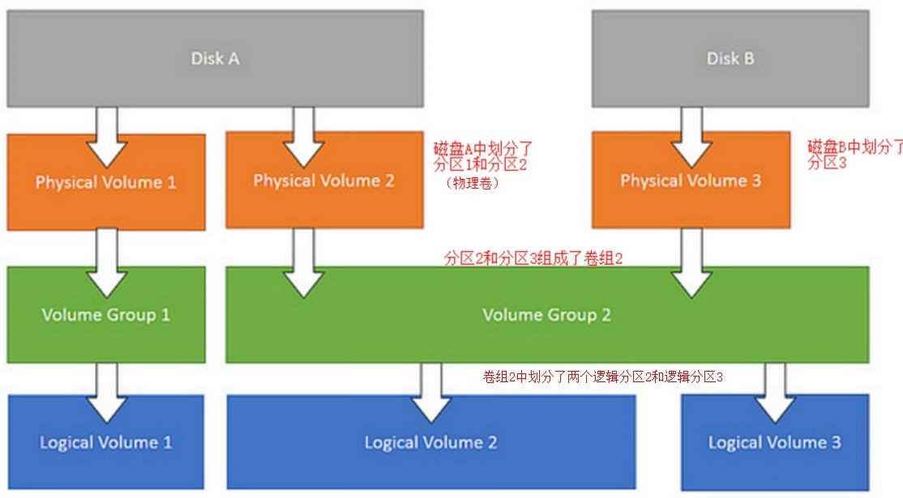

# LVM原理及使用

# 一、原理简介

1. LVM是 Logical Volume Manager(逻辑卷管理)的简写，它由Heinz Mauelshagen在Linux 2.4内核上实现。
2. LVM将一个或多个硬盘的分区在逻辑上集合，相当于一个大硬盘来使用，当硬盘的空间不够使用的时候，可以继续将其它的硬盘的分区加入其中，这样可以实现磁盘空间的动态管理，相对于普通的磁盘分区有很大的灵活性。
3. 与传统的磁盘与分区相比，LVM为计算机提供了更高层次的磁盘存储。它使系统管理员可以更方便的为应用与用户分配存储空间。在LVM管理下的存储卷可以按需要随时改变大小与移除(可能需对文件系统工具进行升级)。LVM也允许按用户组对存储卷进行管理，允许管理员用更直观的名称(如"sales'、'development')代替物理磁盘名(如'sda'、'sdb')来标识存储卷
4. LVM功能实际是通过内核中的dm模块（device mapper）实现，它将一个或多个底层块设备组织成一个逻辑设备的模块，在/dev/目录下以dm-#形式展现
5. 只要是块设备都可以用于创建LVM2。注意分区时ID号要是8e


- 物理存储介质（The physical media）：指系统的存储设备--硬盘，如：/dev/hda1、/dev/sda等等，是存储系统最低层的存储单元
- 物理卷PV（physical volume）：物理卷就是指硬盘分区或从逻辑上与磁盘分区具有同样功能的设备(如RAID)，是LVM的基本存储逻辑块，但和基本的物理存储介质（如分区、磁盘等）比较，却包含有与LVM相关的管理参数
- 卷组VG（volume group）：在较低的逻辑层从多个PV中抽象出来的卷组，由一个或多个物理卷组成
- PE（physical extend）：每一个物理卷被划分为称为PE(Physical Extents)的基本单元，具有唯一编号的PE是可以被LVM寻址的最小单元。PE的大小是可配置的，默认为4MB
- 逻辑卷LV（logical volume）：由多个LV“块”组成可供挂载使用的设备文件



# 二、使用步骤

## 1、安装相关软件包

```bash
yum install -y lvm2
```

## 2、创建PV

```bash
pvcreate /dev/sdc
pvdisplay 
  "/dev/sdc" is a new physical volume of "100.00 GiB"
  --- NEW Physical volume ---
  PV Name               /dev/sdc
  VG Name               
  PV Size               100.00 GiB
  Allocatable           NO
  PE Size               0   
  Total PE              0
  Free PE               0
  Allocated PE          0
  PV UUID               KiXHSv-PbKj-kOiM-yXhN-ntiw-ULpt-JhvgnB
```

## 3、创建VG

```bash
# vgcreate命令用法
vgcreate -s [N[mgt]] VG名称 PV名称
# -s 指定VG中的PE大小，单位：MB,GB,TB
vgcreate -s 16M docker  /dev/sdc 
```

## 4、查看VG

```bash
vgdisplay
  --- Volume group ---
  VG Name               docker
  System ID             
  Format                lvm2
  Metadata Areas        2
  Metadata Sequence No  4
  VG Access             read/write
  VG Status             resizable
  MAX LV                0
  Cur LV                1
  Open LV               1
  Max PV                0
  Cur PV                2
  Act PV                2
  VG Size               199.99 GiB
  PE Size               4.00 MiB
  Total PE              51198
  Alloc PE / Size       38399 / <150.00 GiB
  Free  PE / Size       12799 / <50.00 GiB
  VG UUID               v8aR2B-vSWS-1Edm-wmAz-63Hs-pQFX-RxxZOV
vgs  
  VG     #PV #LV #SN Attr   VSize   VFree  
  docker   2   1   0 wz--n- 199.99g <50.00g
```

## 5、创建LV

```bash
#lvcreate命令参数
lvcreate -l PE个数 -n LV名称 VG名称
​
lvcreate -l 6399 -n docker-lib docker
```

## 6、查看LV容量

```bash
lvdisplay
  --- Logical volume ---
  LV Path                /dev/docker/docker
  LV Name                docker
  VG Name                docker
  LV UUID                hlbSQl-RfGK-PpUZ-u7Vx-5t3X-WOX7-dxLomX
  LV Write Access        read/write
  LV Creation host, time node7.test.openshift.com, 2018-09-07 16:11:37 +0800
  LV Status              available
  # open                 1
  LV Size                <150.00 GiB
  Current LE             38399
  Segments               2
  Allocation             inherit
  Read ahead sectors     auto
  - currently set to     8192
  Block device           252:0
​
lvs
 LV     VG     Attr       LSize    Pool Origin Data%  Meta%  Move Log Cpy%Sync Convert
  docker docker -wi-ao---- <150.00g  
```

## 7、格式化LV

```bash
mkfs.ext3 LV_Name
mkfs.ext4 LV_Name
mkfs.xfs LV_Name
```

## 8、挂载LV

```bash
echo "LV_Name 挂载目录点 文件系统格式 defaults 0 0" >> /etc/fstab
mount -a
```

# 三、扩容VG和LV

- VG已无PE可用
- 新增硬盘
- 在线扩容（不卸载,不重启主机）

## 1、创建PV

```bash
pvcreate /dev/sdd
```

## 2、将PV添加到VG中。之后可看PE数量增加

```bash
vgextend VG_Name /dev/sdd
```


## 3、扩容LV(之后可看LV容量增加)

```bash
lvresize -l +6399 LV_Path
# 或者
lvresize -L +50G LV_Path
```


## 4、检查并修复文件系统

```bash
e2fsck -f LV_Name
```

## 5、将扩容后的LV完整地扩充到文件系统中

```bash
# LV文件系统是ext4时
resize2fs LV_Path
# LV文件系统是xfs时
xfs_growfs LV_Path
```

# 四、挂载已创建的LVM磁盘

```bash
# 查看已有硬盘
fdisk -l

# 查看lvm磁盘的lv
lvdisplay 

# 查看lv是否激活
lvscan
  ACTIVE            '/dev/data/data' [<111.72 GiB] inherit

# 激活卷组
vgchange -ay /dev/data/data

# 查看lv已安装的文件系统
file -sL /dev/data/data
	/dev/data/data: Linux rev 1.0 ext4 filesystem data, UUID=d6c28fac-fb04-423e-bf71-3271b808681c (extents) (64bit) (large files) (huge files)
```

# 参考

1. https://wiki.archlinux.org/index.php/LVM_(%E7%AE%80%E4%BD%93%E4%B8%AD%E6%96%87)