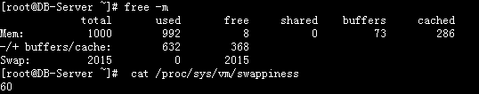
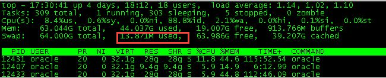

# 交换分区概念及管理

# 一、什么是交换分区呢？

`Linux divides its physical RAM (random access memory) into chucks of memory called pages. Swapping is the process whereby a page of memory is copied to the preconfigured space on the hard disk, called swap space, to free up that page of memory. The combined sizes of the physical memory and the swap space is the amount of virtual memory available.`

`Swap space in Linux is used when the amount of physical memory (RAM) is full. If the system needs more memory resources and the RAM is full, inactive pages in memory are moved to the swap space. While swap space can help machines with a small amount of RAM, it should not be considered a replacement for more RAM. Swap space is located on hard drives, which have a slower access time than physical memory.Swap space can be a dedicated swap partition (recommended), a swap file, or a combination of swap partitions and swap files.`

Linux内核为了提高读写效率与速度，会将文件在内存中进行缓存，这部分内存就是Cache Memory(缓存内存)。即使你的程序运行结束后，Cache Memory也不会自动释放。这就会导致你在Linux系统中程序频繁读写文件后，你会发现可用物理内存变少。当系统的物理内存不够用的时候，就需要将物理内存中的一部分空间释放出来，以供当前运行的程序使用。那些被释放的空间可能来自一些很长时间没有什么操作的程序，这些被释放的空间被临时保存到Swap空间中，等到那些程序要运行时，再从Swap分区中恢复保存的数据到内存中。这样，系统总是在物理内存不够时，才进行Swap交换。

# 二、Swap交换分区对性能的影响

我们知道Linux可以使用文件系统中的一个常规文件或独立分区作为Swap交换空间，相对而言，交换分区要快一些。但是和RAM比较而言，Swap交换分区的性能依然比不上物理内存，目前的服务器上RAM基本上都相当充足，那么是否可以考虑抛弃Swap交换分区，是否不需要保留Swap交换分区呢？这个其实是我的疑问之一。在这篇What Is a Linux SWAP Partition, And What Does It Do?博客中，作者给出了swap交换空间的优劣

Advantages:

1. Provides overflow space when your memory fills up completely
2. Can move rarely-needed items away from your high-speed memory
3. Allows you to hibernate

Disadvantages:

1. Takes up space on your hard drive as SWAP partitions do not resize dynamically
2. Can increase wear and tear to your hard drive
3. Does not necessarily improve performance (see below)

其实保留swap分区概括起来可以从下面来看：

首先，当物理内存不足以支撑系统和应用程序（进程）的运作时，这个Swap交换分区可以用作临时存放使用率不高的内存分页，把腾出的内存交给急需的应用程序（进程）使用。有点类似机房的UPS系统，虽然正常情况下不需要使用，但是异常情况下， Swap交换分区还是会发挥其关键作用。

其次，即使你的服务器拥有足够多的物理内存，也有一些程序会在它们初始化时残留的极少再用到的内存分页内容转移到 swap 空间，以此让出物理内存空间。对于有发生内存泄漏几率的应用程序（进程），Swap交换分区更是重要，因为谁也不想看到由于物理内存不足导致系统崩溃。

最后，现在很多个人用户在使用Linux，有些甚至是PC的虚拟机上跑Linux系统，此时可能常用到休眠（Hibernate），这种情况下也是推荐划分Swap交换分区的。

其实少量使用Swap交换空间是不会影响性能，只有当RAM资源出现瓶颈或者内存泄露，进程异常时导致频繁、大量使用交换分区才会导致严重性能问题。另外使用Swap交换分区频繁，还会引起kswapd0进程（虚拟内存管理中, 负责换页的）耗用大量CPU资源，导致CPU飙升。

关于Swap分区的优劣以及是否应该舍弃，我有点恶趣味的想到了这个事情：人身上的两个器官，阑尾和扁桃体。切除阑尾或扁桃体是否也是争论不休。另外，其实不要Swap交换分区，Linux也是可以正常运行的（有人提及过这个问题）

# 三、Swap分区大小设置建议

系统的Swap分区大小设置多大才是最优呢？ 关于这个问题，应该说只能有一个统一的参考标准，具体还应该根据系统实际情况和内存的负荷综合考虑，像ORACLE的官方文档就推荐如下设置，这个是根据物理内存来做参考的。

| **RAM**                         | **Swap Space**             |
| ------------------------------- | -------------------------- |
| **Up to 512 MB**                | 2 times the size of RAM    |
| **Between 1024 MB and 2048 MB** | 1.5 times the size of RAM  |
| **Between 2049 MB and 8192 MB** | Equal to the size of RAM   |
| **More than 8192 MB**           | 0.75 times the size of RAM |

另外在其它博客中看到下面一个推荐设置，当然我不清楚其怎么得到这个标准的。是否合理也无从考证。可以作为一个参考。

- 4G以内的物理内存，SWAP 设置为内存的2倍。
- 4-8G的物理内存，SWAP 等于内存大小。
- 8-64G 的物理内存，SWAP 设置为8G。
- 64-256G物理内存，SWAP 设置为16G。

# 四、什么时候使用Swap分区空间?

系统在什么情况或条件下才会使用Swap分区的空间呢？ 其实是Linux通过一个参数swappiness来控制的。当然还涉及到复杂的算法。

这个参数值可为 0-100，控制系统 swap 的使用程度。高数值可优先系统性能，在进程不活跃时主动将其转换出物理内存。低数值可优先互动性并尽量避免将进程转换处物理内存，并降低反应延迟。默认值为 60。注意：这个只是一个权值，不是一个百分比值，涉及到系统内核复杂的算法。关于该参数请参考这篇文章[转载]调整虚拟内存，在此不做过多赘述。下面是关于swappiness的相关资料

`The Linux 2.6 kernel added a new kernel parameter called swappiness to let administrators tweak the way Linux swaps. It is a number from 0 to 100. In essence, higher values lead to more pages being swapped, and lower values lead to more applications being kept in memory, even if they are idle. Kernel maintainer Andrew Morton has said that he runs his desktop machines with a swappiness of 100, stating that "My point is that decreasing the tendency of the kernel to swap stuff out is wrong. You really don't want hundreds of megabytes of BloatyApp's untouched memory floating about in the machine. Get it out on the disk, use the memory for something useful." Swappiness is a property of the Linux kernel that changes the balance between swapping out runtime memory, as opposed to dropping pages from the system page cache.`

有两种临时修改swappiness参数的方法，系统重启后失效

**方法1**：

    echo 10 > /proc/sys/vm/swappiness

**方法2:**

    sysctl vm.swappiness=10

永久修改swappiness参数的方法就是在配置文件/etc/sysctl.conf里面修改vm.swappiness的值，然后重启系统

    echo 'vm.swappiness=10' >>/etc/sysctl.conf

如果有人会问是否物理内存使用到某个百分比后才会使用Swap交换空间，可以明确的告诉你不是这样一个算法，如下截图所示，及时物理内存只剩下8M了，但是依然没有使用Swap交换空间，而另外一个例子，物理内存还剩下19G，居然用了一点点Swap交换空间。




# 五、交换分区管理

## 1、查看Swap分区大小

```bash
$ free -mh
              total        used        free      shared  buff/cache   available
Mem:            31G         21G        256M        8.4M        9.6G        9.4G
Swap:          4.0G          0B        4.0G

$ swapon -s 或者 cat /proc/swaps
Filename                                Type            Size    Used    Priority
/dev/vdb                                partition       4194300 0       -1
```

## 2、释放Swap分区空间

```bash
swapon -s
```

## 3、使用swapoff关闭交换分区

```bash
swapoff /dev/vdb
```

## 4、使用swapon启用交换分区

```bash
swapon /dev/vdb
```
