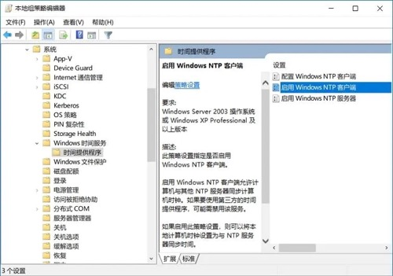
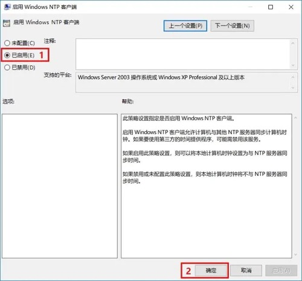
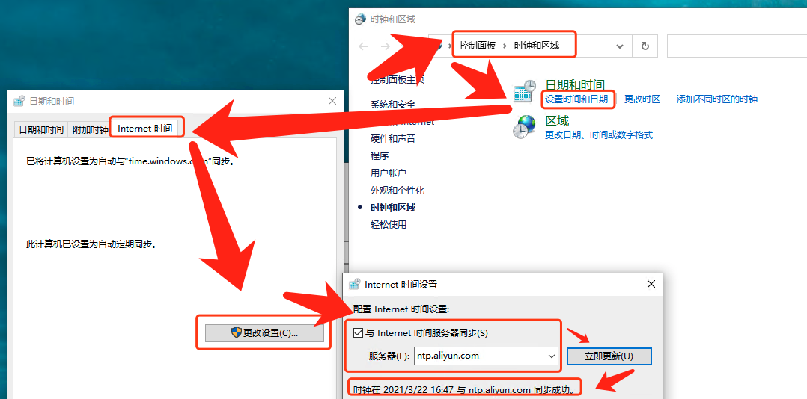

# 1、SSH key加密算法

`RSA，DSA，ECDSA，EdDSA和Ed25519`都用于数字签名，但只有RSA也可以用于加密。根据数学特性，这四种类型又可以分为两大类，dsa/rsa是一类，ecdsa/ed25519是一类，后者算法更先进。

- **RSA（Rivest–Shamir–Adleman）：**是最早的公钥密码系统之一，被广泛用于安全数据传输。它的安全性取决于整数分解，因此永远不需要安全的RNG（随机数生成器）。与DSA相比，RSA的签名验证速度更快，但生成速度较慢。

- **DSA（数字签名算法）：**是用于数字签名的联邦信息处理标准。它的安全性取决于离散的对数问题。与RSA相比，DSA的签名生成速度更快，但验证速度较慢。如果使用错误的数字生成器，可能会破坏安全性。从OpenSSH 7.0开始，默认情况下SSH不再支持DSA密钥（ssh-dss）。

- **ECDSA（椭圆曲线数字签名算法）：**是DSA（数字签名算法）的椭圆曲线实现。椭圆曲线密码术能够以较小的密钥提供与RSA相对相同的安全级别。它还具有DSA对不良RNG敏感的缺点。dsa因为安全问题，已不再使用了。ecdsa因为政治原因和技术原因，也不推荐使用

- **EdDSA（爱德华兹曲线数字签名算法）：**是一种使用基于扭曲爱德华兹曲线的Schnorr签名变体的数字签名方案。签名创建在EdDSA中是确定性的，其安全性是基于某些离散对数问题的难处理性，因此它比DSA和ECDSA更安全，后者要求每个签名都具有高质量的随机性。

- **Ed25519：**是EdDSA签名方案，但使用SHA-512 / 256和Curve25519；它是一条安全的椭圆形曲线，比DSA，ECDSA和EdDSA 提供更好的安全性，并且具有更好的性能（人为注意）。ed25519是目前最安全、加解密速度最快的key类型，由于其数学特性，它的key的长度比rsa小很多，优先推荐使用。它目前唯一的问题就是兼容性，即在旧版本的ssh工具集中可能无法使用。

  ```bash
  ssh-keygen -t ed25519 -C "curiouser@curiouser.com" -f ./id_ed25519 
  ```

**如果可以的话，优先选择ed25519，否则选择rsa。**

参考：

- https://security.stackexchange.com/questions/90077/ssh-key-ed25519-vs-rsa
- https://www.cnblogs.com/librarookie/p/15389876.html

# 2、bash不显示路径

命令行会变成-bash-3.2$主要原因可能是用户主目录下的配置文件丢失

```bash
# 方式一
cp -a /etc/skel/. ~

# 方式二
echo "export PS1='[\u@\h \W]\$'" >> ~/.bash_profile ;\
source ~/.bash_profile
```

# 3、同时监控多个文件

    tail -f file1 file2

# 4、查看网卡

```bash
# 方式一
ifconfig -a
    
# 方式二
cat /proc/net/dev
```

# 5、cp目录下的带隐藏文件的子目录

    cp -R /home/test/* /tmp/test

/home/test下的隐藏文件都不会被拷贝，子目录下的隐藏文件倒是会的

    cp -R /home/test/. /tmp/test

cp的时候有重复的文件需要覆盖时会让不停的输入yes来确认，可以使用yes|

    yes|cp -r /home/test/. /tmp/test


# 6、获取出口IP地址

```bash
curl http://members.3322.org/dyndns/getip
curl cip.cc
curl myip.ipip.net
curl ifconfig.me
curl ipinfo.io
curl ipinfo.io/ip
curl icanhazip.com
curl ifconfig.me/ip ; echo
```

# 7、ISO自动挂载

    echo "/mnt/iso/CentOS-7-x86_64-Minimal-1804.iso /mnt/cdrom iso9660 defaults,loop  0 0" >> /etc/fstab && \
    mount -a && \
    df -mh

# 8、查看系统版本号和内核信息

    cat /proc/version
    uname -a
    lsb_release -a
    cat /etc/redhat-release
    cat /etc/issue
    rpm -q redhat-release

# 9、查看物理CPU个数、核数、逻辑CPU个数

`CPU总核数 = 物理CPU个数 * 每颗物理CPU的核数`
`总逻辑CPU数 = 物理CPU个数 * 每颗物理CPU的核数 * 超线程数`

```bash
# 查看CPU信息（型号）
cat /proc/cpuinfo | grep name | cut -f2 -d: | uniq -c

# 查看物理CPU个数
cat /proc/cpuinfo| grep "physical id"| sort| uniq| wc -l

# 查看每个物理CPU中core的个数(即核数)
cat /proc/cpuinfo| grep "cpu cores"| uniq

# 查看逻辑CPU的个数
cat /proc/cpuinfo| grep "processor"| wc -l
```

# 10、Linux缓存

cached是cpu与内存间的，buffer是内存与磁盘间的，都是为了解决速度不对等的问题。buffer是即将要被写入磁盘的，而cache是被从磁盘中读出来的

- **buff**：作为buffer cache的内存，是块设备的读写缓冲区
- **cache**：作为page cache的内存，文件系统的cache。Buffer cache是针对磁盘块的缓存，也就是在没有文件系统的情况下，直接对磁盘进行操作的数据会缓存到buffer cache中。
- **pagecache**：页面缓存（pagecache）可以包含磁盘块的任何内存映射。这可以是缓冲I/O，内存映射文件，可执行文件的分页区域——操作系统可以从文件保存在内存中的任何内容。Page cache实际上是针对文件系统的，是文件的缓存，在文件层面上的数据会缓存到page cache。
- **dentries**：表示目录的数据结构
- **inodes**：表示文件的数据结构

```bash
#内核配置接口 /proc/sys/vm/drop_caches 可以允许用户手动清理cache来达到释放内存的作用，这个文件有三个值：1、2、3（默认值为0）

#释放pagecache
echo 1 > /proc/sys/vm/drop_caches

#释放dentries、inodes
echo 2 > /proc/sys/vm/drop_caches

#释放pagecache、dentries、inodes
echo 3 > /proc/sys/vm/drop_caches
```

# 11、设置代理

```bash
$> bash -c 'cat >> /etc/profile <<EOF
# HTTP协议使用代理服务器地址
export http_proxy=http://1.2.3.4:3128
# HTTPS协议使用代理服务器地址
export https_proxy=https://1.2.3.4:3128
# FTP协议使用代理服务器地址
export https_proxy=https://1.2.3.4:3128
# 不使用代理的IP或主机
export no_proxy=.abc.com,127.0.0.0/8,192.168.0.0/16,.local,localhost,127.0.0.1

export HTTP_PROXY="http://1.2.3.4:3128"
export HTTPS_PROXY="http://1.2.3.4:3128"
export NO_PROXY="192.168.0.0/16,.taobao.com,.okd311.curiouser.com"

export 
EOF' ;\
   sed -i '/^##/d' /etc/profile ;\
   source /etc/profile
```

**注意**：

- 当使用“**export http_proxy**”和“**export https_proxy**”设置代理时，curl默认所有的请求都是走的代理，请求域名不通过/etc/hosts解析。

- 所以当有需求curl命令不走代理，通过/etc/hosts解析时，代理设置要通过“**export HTTP_PROXY**”和“**export HTTPS_PROXY**”设置。（原因是url.c（版本7.39中的第4337行）处看先检查小写版本，如果找不到，则检查大写。链接：https://stackoverflow.com/questions/9445489/performing-http-requests-with-curl-using-proxy）
- **no_proxy不支持模糊匹配**。不支持`*.a.com`，支持`.a.com`

# 12、查看网卡UUID

    nmcli con | sed -n '1,2p'

# 13、时间戳与日期

## 日期与时间戳的相互转换

    #将日期转换为Unix时间戳
    date +%s
    
    #将Unix时间戳转换为指定格式化的日期时间
    date -d @1361542596 +"%Y-%m-%d %H:%M:%S"

## date日期操作

    date +%Y%m%d               #显示前天年月日
    date -d "+1 day" +%Y%m%d   #显示前一天的日期
    date -d "-1 day" +%Y%m%d   #显示后一天的日期
    date -d "-1 month" +%Y%m%d #显示上一月的日期
    date -d "+1 month" +%Y%m%d #显示下一月的日期
    date -d "-1 year" +%Y%m%d  #显示前一年的日期
    date -d "+1 year" +%Y%m%d  #显示下一年的日期

## 获得毫秒级的时间戳

在linux Shell中并没有毫秒级的时间单位，只有秒和纳秒。其实这样就足够了，因为纳秒的单位范围是（000000000..999999999），所以从纳秒也是可以的到毫秒的

    current=`date "+%Y-%m-%d %H:%M:%S"`     #获取当前时间，例：2015-03-11 12:33:41
    timeStamp=`date -d "$current" +%s`      #将current转换为时间戳，精确到秒
    currentTimeStamp=$((timeStamp*1000+`date "+%N"`/1000000)) #将current转换为时间戳，精确到毫秒
    echo $currentTimeStamp

# 14、nohup手动后台运行进程并记录进程号

```bash
nohup jar -jar jar包 </dev/null > /data/app/logs/app.log 2>&1 &
echo $! > /data/app/run.pid

# 2>&1是把标准错误2重定向到标准输出1中，而标准输出又导入文件里面，所以标准错误和标准输出都会输出到文件。
# 同时把启动的进程号pid输出到文件

注意：
	如果运行时的shell为zsh，将任务放置后台的命令由”&“变为”&!“。
	参考：https://stackoverflow.com/questions/19302913/exit-zsh-but-leave-running-jobs-open
```

# 15、生成文件的MD值

在网络传输、设备之间转存、复制大文件等时，可能会出现传输前后数据不一致的情况。这种情况在网络这种相对更不稳定的环境中，容易出现。那么校验文件的完整性，也是势在必行的。

在网络传输时，我们校验源文件获得其md5sum，传输完毕后，校验其目标文件，并对比如果源文件和目标文件md5 一致的话，则表示文件传输无异常。否则说明文件在传输过程中未正确传输。

md5值是一个128位的二进制数据，转换成16进制则是32（128/4）位的进制值。
md5校验，有很小的概率不同的文件生成的md5可能相同。比md5更安全的校验算法还有SHA*系列的。

## **Linux的md5sum命令**

md5sum命令用于生成和校验文件的md5值。它会逐位对文件的内容进行校验。是文件的内容，与文件名无关，也就是文件内容相同，其md5值相同。

```bash
#md5sum命令的详解
$> md5sum --h
Usage: md5sum [OPTION]... [FILE]
With no FILE, or when FILE is -, read standard input.
-b, --binary         二进制模式读取文件
-c, --check          从文件中读取、校验MD5值
      --tag          创建一个BSD-style风格的校验值
-t, --text           文本模式读取文件（默认）
#校验文件MD5值使用的参数
The following four options are useful only when verifying checksums:
      --quiet          don't print OK for each successfully verified file
      --status         don't output anything, status code shows success
      --strict         exit non-zero for improperly formatted checksum lines
  -w, --warn           warn about improperly formatted checksum lines

      --help     display this help and exit
      --version  output version information and exit


#生成的MD5值重定向到文件中
$>md5sum filename > filename.md5
#生成的MD5值重定向追加到文件中
$> md5sum filename >>filename.md5
#多个文件输出到一个md5文件中，这要使用通配符*
$> md5sum *.iso > iso.md5
#同时计算多个文件的MD5值
$> md5sum filetohashA.txt filetohashB.txt filetohashC.txt > hash.md5

#校验MD5:把下载的文件file和该文件的file.md5报文摘要文件放在同一个目录下
$> md5sum -c file.md5
#创建一个BSD风格的校验值
$> md5sum --tag file.md5
MD5 (file.md5) = 9192e127b087ed0ae24bb12070f3051a
```

## **Python生成MD5值**

```bash
# 方式一：使用md5包

import md5

src = 'this is a md5 test.'
m1 = md5.new()
m1.update(src)
print m1.hexdigest()

# 方式二：使用hashlib（推荐）

import hashlib   

m2 = hashlib.md5()   
m2.update(src)   
print m2.hexdigest()

# 加密常见的问题：

1：Unicode-objects must be encoded before hashing

　　解决方案：import hashlib
　　　　　　　m2 = hashlib.md5()
　　　　　　　m2.update(src．encode('utf-8'))
　　　　　　　print m2.hexdigest()
```

## **Java生成MD5值**

```java
import java.security.MessageDigest;
public static void main(String[] args) {  
        String password = "123456";  
        try {  
            MessageDigest instance = MessageDigest.getInstance("MD5");// 获取MD5算法对象  
            byte[] digest = instance.digest(password.getBytes());// 对字符串加密,返回字节数组  
  
            StringBuffer sb = new StringBuffer();  
            for (byte b : digest) {  
                int i = b & 0xff;// 获取字节的低八位有效值  
                String hexString = Integer.toHexString(i);// 将整数转为16进制  
                // System.out.println(hexString);  
  
                if (hexString.length() < 2) {  
                    hexString = "0" + hexString;// 如果是1位的话,补0  
                }  
  
                sb.append(hexString);  
            }  
  
            System.out.println("md5:" + sb.toString());  
            System.out.println("md5 length:" + sb.toString().length());//Md5都是32位  
  
        } catch (NoSuchAlgorithmException e) {  
            e.printStackTrace();  
            // 没有该算法时,抛出异常, 不会走到这里  
        }  
    }  
```

# 16、添加用户

    useradd (选项) （参数）
    
    #选项
    －c：加上备注文字，备注文字保存在passwd的备注栏中
    －d：指定用户登入时的启始目录
    －D：变更预设值
    －e：指定账号的有效期限，缺省表示永久有效
    －f：指定在密码过期后多少天即关闭该账号
    －g：指定用户所属的起始群组
    －G：指定用户所属的附加群组
    －m：自动建立用户的登入目录
    －M：不要自动建立用户的登入目录
    －n：取消建立以用户名称为名的群组
    －r：建立系统账号
    －s：指定用户登入后所使用的shell
    －u：指定用户ID号

# 17、su 与 sudo

**`su`** : switch to another user 切换用户

**`sudo`** : superuser do 允许用户使用superuser的身份执行命令

```bash
su username ：切换为username，需要输入username密码
su : 切换为root用户，需要输入root密码
su - : 切换为root用户，需要输入root密码，且环境变量也改变
su - -c "command" ：使用root身份执行命令，完成后即退出root身份
sudo command : 与su -c相似，需要输入当前用户（superuser，/etc/sudoers中指定）密码
sudo su -：使用当前用户密码实现root身份的切换
su - hdfs -c command    切换用户并以某用户的身份去执行一条命令
su - hdfs  test.sh  切换用户并以某用户的身份去执行一个shell文件
```

# 18、重新开启SELinux

如果在使用setenforce命令设置selinux状态的时候出现这个提示：`setenforce: SELinux is disabled`。那么说明selinux已经被彻底的关闭了,如果需要重新开启selinux

```bash
vi /etc/selinux/config

更改为：SELINUX=1

必须重启linux，不重启是没办法立刻开启selinux的
```

重启完以后，使用getenforce,setenforce等命令就不会报“setenforce: SELinux is disabled”了。这时，我们就可以用setenforce命令来动态的调整当前是否开启selinux。

# 19、检查软件是否已安装，没有就自动安装

```bash
rpm -qa |grep "jq"
if [ $? -eq 0 ] ;then
    echo "jq hava been installed "
else
    yum -y install epel-release && yum -y install jq
fi
```

# 20、使用privoxy代理http，https流量使用socket连接ShadowSocks服务器

```bash
echo "安装ShadowSocks" && \
yum -y install epel-release && yum -y install python-pip && \
pip install shadowsocks && \
bash -c 'cat > /etc/shadowsocks.json <<EOF
{
"server": "***.***.***.***",
"server_port": "443",
"local_address": "127.0.0.1",
"local_port":"1080",
"password": "******",
"timeout":300,
"method": "aes-256-cfb",
"fast_open": false
}
EOF' && \
bash -c 'cat > /etc/systemd/system/shadowsocks.service << EOF
[Unit]
Description=Shadowsocks
[Service]
TimeoutStartSec=0
ExecStart=/usr/bin/sslocal -c /etc/shadowsocks.json
[Install]
WantedBy=multi-user.target
EOF' && \
  systemctl daemon-reload  && \
  systemctl enable shadowsocks && \
  systemctl start shadowsocks

yum install -y privoxy && \
sed -i 's/#        forward-socks5t   \/               127.0.0.1:9050 ./        forward-socks5t   \/               127.0.0.1:1080 ./' /etc/privoxy/config && \
privoxy --user privoxy /etc/privoxy/config && \
echo "export http_proxy=http://127.0.0.1:8118" >> /etc/profile && \
echo "export https_proxy=http://127.0.0.1:8118" >> /etc/profile && \
source /etc/profile && \
curl www.google.com
```

# 21、批量打通指定主机SSH免密钥登录脚本

**CentOS**

```bash
$> bash -c 'cat > ./HitthroughSSH.sh <<EOF
#!/bin/bash

##
#===========================================================
echo "script    usage : ./HitthroughSSH.sh hosts.txt"
echo "hosts.txt format: host_ip:root_password"

#=========================================================
echo "==Setup1:Check if cmd expect exist,if no,install automatically"
rpm -qa | grep expect 
if [ \$? -ne 0 ];then
yum install -y expect
fi
#=====================================
echo "==Setup2:Check if have been generated ssh private and public key.if no ,generate automatically "

if [ ! -f ~/.ssh/id_rsa ];then
  ssh-keygen -t rsa  -P "" -f ~/.ssh/id_rsa
fi
#===========================================================
echo "Setup3:Read IP and root password from text"
echo "Setup4:Begin to hit root ssh login without password thorough hosts what defined in the hosts.txt"
for p in \$(cat \$1)    
do   
    ip=\$(echo "\$p"|cut -f1 -d":")         
    password=\$(echo "\$p"|cut -f2 -d":")  
    expect -c "   
            spawn ssh-copy-id -i /root/.ssh/id_rsa.pub root@\$ip  
            expect {   
                \"*yes/no*\" {send \"yes\r\"; exp_continue}   
                \"*password*\" {send \"\$password\r\"; exp_continue}   
                \"*Password*\" {send \"\$password\r\";}   
            }   
        "
    ssh root@\$ip "date"
done
EOF' ;\
  sed -i -c -e '/^$/d;/^##/d' ./HitthroughSSH.sh ;\
  chmod +x ./HitthroughSSH.sh ;\
  bash -c 'cat > ./hosts.txt <<EOF
172.16.0.3:Abc@1234
172.16.0.4:Abc@1234
172.16.0.5:Abc@1234
172.16.0.6:Abc@1234
172.16.0.7:Abc@1234
EOF' ;\
  ./HitthroughSSH.sh ./hosts.txt ;\
  rm -rf ./HitthroughSSH.sh ./hosts.txt
```

# 22、硬盘自动分区，格式化，开机自动挂载到/data

```bash
disk=/dev/sdc;\
bash -c "fdisk ${disk}<<End
n
p
1


wq
End" ;\
mkfs.ext4 ${disk}1 ;\
blkid | grep ${disk}1 | cut -d ' ' -f 2 >>/etc/fstab ;\
sed -i '$ s/$/ \/data ext4 defaults 0 0/' /etc/fstab ;\
mkdir /data ;\
mount -a ;\
df -h
```

# 23、在hosts文件中添加IP地址与主机名的域名映射

```bash
ipaddr=$(ip addr | awk '/^[0-9]+: / {}; /inet.*global/ {print gensub(/(.*)\/(.*)/, "\\1", "g", $2)}'| sed -n '1p') && \
echo $ipaddr $HOSTNAME >> /etc/hosts
```

# 24、Linux禁用透明大页

**Redhat**

```bash
sed -i '$a echo nerver > /sys/kernel/mm/redhat_transparent_hugepage/defrag\necho nerver > /sys/kernel/mm/redhat_transparent_hugepage/enabled'
```

**CentOS**

```bash
echo never > /sys/kernel/mm/transparent_hugepage/defrag ;\
echo never > /sys/kernel/mm/transparent_hugepage/enabled ;\
sed -i '/GRUB_CMDLINE_LINUX/ s/"$/ transparent_hugepage=never"/' /etc/default/grub ;\
grub2-mkconfig -o /boot/grub2/grub.cfg
```

# 25、基础服务软件安装

## ①JDK环境

**Prerequisite**：

1. JDK安装包已下载在内网HTTP服务器中

```bash
curl -# http://192.168.1.7:32770/repository/public-resources/jdk-8u241-linux-x64.tar.gz | tar -zxC /opt/ && \
ln -s `ls /opt |grep jdk1.8.0_241*| sed  "s:^:/opt: "` /opt/jdk && \
sed -i '$a export JAVA_HOME=/opt/jdk\nexport CLASSPATH=.:$JAVA_HOME/lib/dt.jar:$JAVA_HOME/lib/tools.jar\nexport PATH=$PATH:$JAVA_HOME/bin' /etc/profile && \
source /etc/profile && \
ln -s /opt/jdk/bin/java /usr/bin/java && \
java -version && \
javac -version
```

## ②安装Tomcat，并由systemctl托管

**Prerequisite**：

1. 已安装JDK
2. Tomcat安装包已下载在内网HTTP服务器中

```bash
wget http://192.168.1.2/tomcat/apache-tomcat-8.5.20.tar.gz;\
tar -zxvf apache-tomcat-8.5.20.tar.gz -C /opt;\
rm -rf apache-tomcat-8.5.20.tar.gz;\
ln -s /opt/apache-tomcat-8.5.20 /opt/tomcat;\
bash -c 'cat > /lib/systemd/system/tomcat.service <<EOF
[unit]
Description=Tomcat
After=network.target
[Service]
Type=forking
PIDFile=/opt/tomcat/tomcat.pid
ExecStart=/opt/tomcat/bin/catalina.sh start
ExecReload=/opt/tomcat/bin/catalina.sh restart
ExecStop=/opt/tomcat/bin/catalina.sh stop
[Install]
WantedBy=multi-user.target
EOF';\
ln -s /lib/systemd/system/tomcat.service /etc/systemd/system/multi-user.target.wants/tomcat.service;\
sed -i '1a CATALINA_PID=/opt/tomcat/tomcat.pid' /opt/tomcat/bin/catalina.sh;\
systemctl daemon-reload;\
systemctl start tomcat;\
systemctl status tomcat;\
systemctl stop tomcat;\
systemctl status tomcat;\
systemctl enable tomcat;\
systemctl status tomcat
```

## ③安装Nginx

```bash
bash -c 'cat > /etc/yum.repos.d/nginx.repo <<EOF
[nginx]
name=nginx repo
baseurl=http://nginx.org/packages/centos/7/\$basearch/
gpgcheck=0
enabled=1
EOF' ;\
  yum install nginx -y
```

## ④安装最新stable单机Zookeeper

**Prerequisite**：
1. 已安装JDK

```bash
download_url=`echo https://mirrors.tuna.tsinghua.edu.cn/apache/zookeeper/stable/``curl -s -L https://mirrors.tuna.tsinghua.edu.cn/apache/zookeeper/stable/ |grep apache-zookeeper | awk -F ">" '{print $2}'|awk -F "\"" '{print $2}' | head -n 1` && \
curl -# $download_url | tar -zxC /opt/ && \
ln -s `ls  /opt/ |grep apache-zookeeper-* | sed  "s:^:/opt/: "` /opt/zookeeper && \
sed -i '$a export ZOOKEEPER_HOME=/opt/zookeeper\nexport PATH=$PATH:$ZOOKEEPER_HOME/bin' /etc/profile && \
source /etc/profile && \
cp /opt/zookeeper/conf/zoo_sample.cfg /opt/zookeeper/conf/zoo.cfg  && \
sed -i -e '/dataDir/d' -e '/dataLogDir/d' /opt/zookeeper/conf/zoo.cfg && \
sed -i -e '$a dataDir=/data/zookeeper/data\ndataLogDir=/data/zookeeper/logs\nserver.1=127.0.0.1:2888:3888\nautopurge.purgeInterval=24\nautopurge.purgeInterval=5\nadmin.enableServer=true\nadmin.enableServer=true
admin.serverPort=9990'  /opt/zookeeper/conf/zoo.cfg && \
mkdir -p /data/zookeeper/{data,logs} && \
echo "1" > /data/zookeeper/data/myid && \
zkServer.sh start && \
zkServer.sh status && \
jps -l

# admin server 访问地址：http://主机IP地址:9990/commands
```

## ⑤安装最新stable单机的Kafka

**Prerequisite**：

1. 已安装Zookeeper

```bash
download_d=`echo https://mirrors.tuna.tsinghua.edu.cn/apache/kafka/``curl -sL https://mirrors.tuna.tsinghua.edu.cn/apache/kafka |grep \`date +%Y\` |grep "folder.gif" | tac | head -n 1 |awk -F ">" '{print $3}' |awk -F "/" '{print $1}'` && \
download_url=`echo $download_d/``curl -sL $download_d |grep kafka_ | tac | head -n 1 | awk -F ">" '{print $2}' | awk -F "\"" '{print $2}'` && \
curl -# $download_url | tar -zxC /opt/ && \
ln -s `ls /opt |grep kafka_*| sed  "s:^:/opt/: "` /opt/kafka && \
sed -i '$a export KAFKA_HOME=/opt/kafka\nexport PATH=$PATH:$KAFKA_HOME/bin' /etc/profile && \
source /etc/profile && \
cp /opt/kafka/config/server.properties /opt/kafka/config/server_bak.properties && \
sed -i '/\#\ Log\ directory\ to\ use/iLOG_DIR=\/data\/kafka\/logs' /opt/kafka/bin/kafka-run-class.sh && \
sed -i -e 's/log.dirs=\/tmp\/kafka-logs/log.dirs=\/data\/kafka\/data/g' -e 's/log.retention.hours=168/log.retention.hours=12/g' -e '$a auto.create.topics.enable=true\ndelete.topic.enable=true'  /opt/kafka/config/server.properties && \
mkdir -p /data/kafka/{logs,data} && \
kafka-server-start.sh -daemon /opt/kafka/config/server.properties && \
jps -l
```

## ⑥安装Hadoop客户端

以hadoop 2.8.3版本为例

```bash
wget https://archive.apache.org/dist/hadoop/common/hadoop-2.8.3/hadoop-2.8.3.tar.gz ;\
tar -xvf hadoop-2.8.3.tar.gz -C /opt ;\
rm -rf hadoop-2.8.3.tar.gz ;\
ln -s /opt/hadoop-2.8.3 /opt/hadoop ;\
sed -i '$a export HADOOP_HOME=/opt/hadoop\nexport PATH=$PATH:$HADOOP_HOME/bin' /etc/profile ;\
source /etc/profile
#然后在/opt/hadoop-2.8.3/etc/hadoop/core-site.xml配置文件<configuration>标签中填写HDFS NameNode节点的IP地址及端口号
<property>
   <name>fs.default.name</name>
   <value>hdfs://172.16.3.10:9000</value>
   <description> </description>
</property>


hdfs dfs -ls /
```

## ⑦安装Maven环境

```bash
curl https://mirrors.tuna.tsinghua.edu.cn/apache/maven/binaries/apache-maven-3.2.2-bin.tar.gz -o /opt/apache-maven-3.2.2-bin.tar.gz && \
tar -zxvf /opt/apache-maven-*.tar.gz -C /opt/ && \
rm -rf /opt/apache-maven-*.tar.gz && \
ln -s /opt/apache-maven-3.2.2 /opt/maven && \
sed -i '$a export M2_HOME=/opt/maven\nexport PATH=$PATH:$M2_HOME/bin' /etc/profile && \
source /etc/profile && \
mvn version
```

## ⑧安装NodeJS环境

```bash
wget https://nodejs.org/dist/v8.9.4/node-v8.9.4-linux-x64.tar.xz ;\
tar -xvf node-v8.9.4-linux-x64.tar.xz -C /opt/ ;\
rm -rf node-v8.9.4-linux-x64.tar.xz ;\
ln -s /opt/node-v8.9.4-linux-x64 /opt/nodejs ;\
sed -i '$a export NODEJS_HOME=/opt/nodejs\nexport PATH=$PATH:$NODEJS_HOME/bin' /etc/profile;\
source /etc/profile;\
yum install gcc-c++ make -y;\
npm config set registry https://registry.npm.taobao.org ;\
npm config set sass_binary_site https://npm.taobao.org/mirrors/node-sass/ ;\
npm version
```

# 26、安装docker/docker-compose

**脚本自动安装**

```bash
sudo curl -sSL https://get.docker.com | sh
```

**CentOS/Redhat**

> 设置新硬盘LVM成docker的数据目录

```bash
yum install -y yum-utils epel-rease lvm2 && \
yum-config-manager --add-repo https://download.docker.com/linux/centos/docker-ce.repo && \
yum list docker-ce --showduplicates | sort -r && \
yum install -y docker-ce docker-compose && \
mkdir /etc/docker && \
bash -c 'cat > /etc/docker/daemon.json <<EOF
{
  "registry-mirrors": [
    "https://dockerhub.azk8s.cn",
    "https://docker.mirrors.ustc.edu.cn",
    "http://hub-mirror.c.163.com"
  ],
  "max-concurrent-downloads": 10,
  "log-driver": "json-file",
  "log-level": "warn",
  "log-opts": {
    "max-size": "10m",
    "max-file": "3",
    "labels": "production_status",
    "env": "os,customer"
    },
  "data-root": "/var/lib/docker"
}
EOF' && \
disk=/dev/sdc && \
pvcreate ${disk} && \
vgcreate -s 4M docker ${disk} && \
PE_Number=`vgdisplay ${disk}|grep "Free  PE"|awk '{print $5}'` && \
lvcreate -l ${PE_Number} -n docker-lib docker && \
mkfs.xfs /dev/docker/docker-lib && \
mkdir /var/lib/docker && \
echo "/dev/docker/docker-lib /var/lib/docker/ xfs defaults 0 0" >> /etc/fstab && \
df -mh && \
systemctl daemon-reload && \
systemctl enable docker && \
systemctl start docker && \
docker info &&\
docker info |grep "Insecure Registries:" -A 4  && \
ls /var/lib/docker/
```

**Ubuntu**

```bash
apt-get remove docker docker-engine docker.io containerd runc && \
apt install -y software-properties-common && \
curl -fsSL https://download.docker.com/linux/ubuntu/gpg | apt-key add -

# X86_64
sudo add-apt-repository \
   "deb [arch=amd64] https://download.docker.com/linux/ubuntu \
   $(lsb_release -cs) \
   stable"

# arm64
sudo add-apt-repository \
   "deb [arch=arm64] https://download.docker.com/linux/ubuntu \
   $(lsb_release -cs) \
   stable"

apt-get update && \
apt-get install -y docker-ce && \
touch /etc/docker/daemon.json && \
bash -c ' tee  /etc/docker/daemon.json <<EOF
{
  "registry-mirrors": ["https://0gxg9a07.mirror.aliyuncs.com"],
  "insecure-registries": ["0.0.0.0/0"],
  "log-driver": "json-file",
  "log-opts": {
    "max-size": "100m",
    "max-file": "3",
    "labels": "production_status",
    "env": "os,customer"
  }
}
EOF' && \
systemctl daemon-reload && \
systemctl enable docker && \
systemctl start docker 
```

# 27、字符转换命令expand/unexpand

用于将文件的制表符（Tab）转换为空格符（Space），默认一个Tab对应8个空格符，并将结果输出到标准输出。若不指定任何文件名或所给文件名为”-“，则expand会从标准输入读取数据。

功能与之相反的命令是unexpand，是将空格符转成Tab符。

vi/vim在命令模式下通过设置":set list"可显示文件中的制表符“^I”

**expand命令参数**

```bash
-i, --initial       do not convert tabs after non blanks
-t, --tabs=NUMBER   have tabs NUMBER characters apart, not 8
-t, --tabs=LIST     use comma separated list of explicit tab positions
    --help     display this help and exit
    --version  output version information and exit
```

**unexpand命令参数**

```bash
-a, --all        convert all blanks, instead of just initial blanks
    --first-only  convert only leading sequences of blanks (overrides -a)
-t, --tabs=N     have tabs N characters apart instead of 8 (enables -a)
-t, --tabs=LIST  use comma separated LIST of tab positions (enables -a)
    --help     display this help and exit
    --version  output version information and exit
```

**实例**

将文件中每行第一个Tab符替换为4个空格符，非空白符后的制表符不作转换

```bash
#使用"----"或"--"代表一个制表符，使用":"代表一个空格
----abcd--e

$ expand -i -t 4 old-file > new-file

::::abcd--e
```

**注意**

不是所有的Tab都会转换为默认或指定数量的空格符，expand会以对齐为原则将Tab符替换为适当数量的空格符，替换的原则是使后面非Tab符处在一个物理Tab边界（即Tab size的整数倍。例如：

```bash
#使用"----"或"--"代表一个制表符，使用":"代表一个空格
abcd----efg--hi

$ expand -t 4 file

abcd::::efg::hi
```

# 28、修改时区

1. Docker容器中

   - 添加环境变量：TZ = Asia/Shanghai

2. Linux主机

   ```bash
   timedatectl set-timezone "Asia/Shanghai"
   # 设置时区
   timedatectl status 
   # 查看当前的时区状态
   date -R
   # 查看时区
   ```

   或者
   
   ```bash
   cp /usr/share/zoneinfo/Asia/Shanghai /etc/localtime
   ```
# 29、shell脚本的调试

  - 在脚本运行时添加`-x`参数    
  - 在脚本中开头添加`set -x`

# 30、删除“-”开头的文件或文件夹

当直接使用`rm -f`删除以`-`开头的文件与文件夹时，rm或其他命令报参数错误，会误认为`-`后面的内容是命令的参数

```bash
rm  -rf -- -XGET

cd -- -XGET
```

# 31、硬盘快速分区

## 方式一：使用parted命令

parted命令详解：https://www.cnblogs.com/Cherry-Linux/p/10103172.html

 ```bash
disk=/dev/vdb && \
parted -s -a optimal $disk mklabel gpt -- mkpart primary ext4 1 -1
 ```

## 方式二：使用fdisk

```bash
disk=/dev/vdb && \
bash -c "fdisk ${disk}<<End
n
p
1


wq
End"
```

# 32、别名传参

别名并不能直接传参，但是可以使用以下方式代替：

## 方式一：使用functions替代

```bash
$ test () { num=${1:-5} dmesg |grep -iw usb|tail -$num }
$ test 5

```

## 方式二：使用read读取输入，然后使用变量替换命令中的参数

```bash
$ alias taila='{ IFS= read -r line_num && tail -n $line_num /var/logs/message ;} <<<'
$ taila 50
```

参考：

1. https://askubuntu.com/questions/626458/can-i-pass-arguments-to-an-alias-command
2. https://www.kutu66.com//ubuntu/article_158110

# 33、Ubuntu/Debian的镜像源URL字段

Nexus设置apt proxy仓库，代理http://archive.ubuntu.com/ubuntu/

```bash
deb http://192.168.1.6:8080/repository/apt-ubuntu/ bionic main restricted
deb http://192.168.1.6:8080/repository/apt-ubuntu/ bionic-security main restricted
deb http://192.168.1.6:8080/repository/apt-ubuntu/ bionic-updates main restricted
deb http://192.168.1.6:8080/repository/apt-ubuntu/ bionic-proposed main restricted
deb http://192.168.1.6:8080/repository/apt-ubuntu/ bionic-backports main restricted
```

**第一字段，指示包类型。**

- **deb**：二进制包
- **deb-src**：源码包

**第二字段，指示镜像站点，即「源」！**
URL 定位到某个目录，该目录下必有「dists」「pool」两个子目录。如：

- http://ftp.cn.debian.org/debian/
- http://ftp.sjtu.edu.cn/ubuntu/

**第三字段，指示包的「版本类型」，姑且称为「仓库」。**
打开某源，进入「dists」子目录可见该源中有哪些仓库，即其下诸子目录。命名形式为「系统发行版名-仓库名」，如 Debian 的「jessie-backports」「stretch-updates」，Ubuntu 的「vivid-updates」「wily-proposed」。无仓库名的即为主仓库。

Debian 的 stable、testing 为链接，指向具体系统发行版，会随时间而变。比如，当前 stable 为 jessie，所以 stable-backports 与 jessie-backports 等效。但本人不建义使用 stable、testing，因为下一个 stable 发布后，你的源便自动指向了一个新版本，然而你并未阅读新版本的发行说明，并未做好升级的准备。

Debian 的仓库自 squeeze 起与 Ubuntu 基本相同。除主仓库外，有：

- **security**：Ubuntu 用于指安全性更新。即影响系统安全的 bug 修补。Debian 特殊一些，见下文。
- **updates**：非安全性更新。即不影响到系统安全的 bug 修补。
- **proposed-updates**：预更新。小 beta 版。过后会进入「updates」或「security」。Ubuntu 仅用proposed」，无后缀「updates」。
- **backports**：后备。Debian stable 发布后，Ubuntu 某版本正式发布后，其所有软件版本号便已被冻结，所有软件只修 bug，不增加任何特性。但有人可能需要新特性，甚至某些较新的软件原来根本就没有。该仓库正因此而设，但欠官方维护，且可能在系统正式发布之后过一段时间才有内容。此仓库处于第二优先顺序，而上述几个仓库处于第一优先顺序。安装第二优先顺序的包必须特别指明，见 apt-get(8) aptitude(8) 的 --target-release 选项。
  **提示：**并非所有版本都设有上述全部仓库，请打开源中 dists 目录查看。

**后续字段，指示包许可类型。**
后续字段排名不分先后，最终结果取其并集。按包本身的许可及所直接依赖的包的许可划分。打开某仓库，可见几个子目录。
Debian 最多有三种

- **main**：本身是自由软件，且所有依赖的包也都是自由软件，此类可称纯自由软件，见 https://www.debian.org/distrib/packages《Debian自由软件指导方针》。

- **contrib**：本身是自由软件，但依赖不纯，即依赖中至少有一例 contrib 或 non-free 者。

- **non-free**：本身并非自由软件，无论依赖如何。当然，该软件是可免费使用或试用的。免费一例 https://packages.debian.org/jessie/unrar，试用xx天一例 https://packages.debian.org/jessie/rar。

Ubuntu 最多有四种

- **main**：官方维护的自由软件。

- **universe**：社区维护的自由软件。

- **restricted**：设备专有驱动。

- **multiverse**：同 Debian 的「non-free」。

  某些另类的第三方源，未必遵循上述惯例。总之，打开仓库目录自己看。


特别之处：

**Debian 安全性更新**
不像 Ubuntu 放在「security」仓库，而是放在单独一个源中。各大镜像站通常都把一般的包放在根下来一级的「debian」目录中，而安全性更新则会放在「debian-security」目录中，如果有的话，如 http://ftp.cn.debian.org/debian-security/。
Debian 官方建议，所有安全性更新，只从官方主站更新，勿使用其它镜像站，除非你对镜像站非常有信心，见 https://www.debian.org/security/index.en.html。所以，很多镜像站并不提供安全更新源。
安全性更新的第三字段形式固定为「版本名/updates」，如「wheezy/updates」「jessie/updates」。

**Debian 多媒体源**
一些多媒体软件因牵涉到版权问题，包括硬件解码器，Debian 官方并未收录，有一网站专门填补该空缺，见 [http://www.deb-multimedia.org](https://www.deb-multimedia.org/)。


最后忠告：
不要同时启用多个源，同一仓库的源启用一个即可，否则容易引起混乱。以下实例便是列有多套而仅启用一套。

**参考**

1. https://forum.ubuntu.org.cn/viewtopic.php?t=366506

# 34、裸磁盘分区扩容

①停掉向挂载路径写文件的服务或进程

② 卸载挂载

```bash
umount /data
```

如果提示`umount:/data:target is bus`,使用`fuser`找出正在往挂载路径写文件的进程并kill掉，再次卸载挂载

```bash
yum install psmisc -y
fuser -mv /data
                     USER        PID ACCESS COMMAND
/data:                root     kernel mount /data
                     root      13830 ..c.. bash
```

③修复分区表

磁盘扩大容量后，分区表中记录的柱头等信息需要更新，否则创建新分区时会报`GPT PMBR size mismatch`

```bash
parted -l
在弹出Fix/Ignore?的提示时输入Fix后回车即可。
```

④删掉旧分区再重建新分区

```bash
fdisk /dev/sdb
	d			# 删除原来的分区/dev/sdb1
	n			#	创建新的分区		
	1			# 分区号与旧的保持一致
	w			# 写入分区表并生效
```

⑤调整分区

```bash
e2fsck -f /dev/sdb1 检查分区信息
resize2fs /dev/sdb1 调整分区大小
```

⑥重新挂载并验证数据是否丢失？容量是否扩容？

# 35、MacOS下`tar`归档文件时,排错`._*`文件

MacOS下的`tar`命令，在归档压缩文件或文件夹时，会产生`._*`的隐藏文件()也一并归档到压缩包中，增加压缩包体积。可以在归档时不包含这些文件

```bash
COPYFILE_DISABLE=1 tar czf test.tar /your/files
# 去除旧压缩包中的“._*”文件
tar -cf newTar --include='some/path/*' oldTar
```

参考：

1. https://stackoverflow.com/questions/30962501/how-do-i-delete-a-single-file-from-a-tar-gz-archive
2. https://superuser.com/questions/259703/get-mac-tar-to-stop-putting-filenames-in-tar-archives

# 36、echo 换行

```bash
echo -e "test\ndasdasd" > test
```

# 37、dd命令

> dd 可从标准输入或文件中读取数据，根据指定的格式来转换数据，再输出到文件、设备或标准输出。

参数说明:

```bash
if=文件名：输入文件名，默认为标准输入。即指定源文件。
of=文件名：输出文件名，默认为标准输出。即指定目的文件。
ibs=bytes：一次读入bytes个字节，即指定一个块大小为bytes个字节。
obs=bytes：一次输出bytes个字节，即指定一个块大小为bytes个字节。
bs=bytes：同时设置读入/输出的块大小为bytes个字节。
cbs=bytes：一次转换bytes个字节，即指定转换缓冲区大小。
skip=blocks：从输入文件开头跳过blocks个块后再开始复制。
seek=blocks：从输出文件开头跳过blocks个块后再开始复制。
count=blocks：仅拷贝blocks个块，块大小等于ibs指定的字节数。
conv=<关键字>，关键字可以有以下11种：
    conversion：用指定的参数转换文件。
    ascii：转换ebcdic为ascii
    ebcdic：转换ascii为ebcdic
    ibm：转换ascii为alternate ebcdic
    block：把每一行转换为长度为cbs，不足部分用空格填充
    unblock：使每一行的长度都为cbs，不足部分用空格填充
    lcase：把大写字符转换为小写字符
    ucase：把小写字符转换为大写字符
    swap：交换输入的每对字节
    noerror：出错时不停止
    notrunc：不截短输出文件
    sync：将每个输入块填充到ibs个字节，不足部分用空（NUL）字符补齐。
--help：显示帮助信息
--version：显示版本信息
```

**示例：**

- 刻录ISO镜像到硬盘(u盘)

  > sudo dd if=CentOS-7-x86_64-Minimal-2009.iso of=/dev/disk2 bs=1m
  >
  > ```
  > # 观察刻录进度
  > sudo watch kill -USR1 $(pgrep ^dd)  # -USR1是dd专用的信号，它接收到该信号，就会显示刻录的进度
  > # 检查刻录是否结束后
  > sync
  > # 弹出磁盘
  > umount /dev/disk2
  > ```

- 修复无法格式化的U盘

  > ```
  > dd if=/dev/zero of=/dev/sdc bs=512 count=1
  > ```

- 文件中英文大小写转换

  > dd if=testfile_2 of=testfile_1 conv=ucase 

- 将本地的/dev/hdb整盘备份到/dev/hdd

  >  dd if=/dev/hdb of=/dev/hdd

- 将备份文件恢复到指定盘

  >  dd if=/root/image of=/dev/hdb

- 将备份文件恢复到指定盘

  >  dd if=/root/image of=/dev/hdb

- 备份/dev/hdb全盘数据，并利用gzip工具进行压缩，保存到指定路径

  >   dd if=/dev/hdb | gzip > /root/image.gz

- 将压缩的备份文件恢复到指定盘

  > gzip -dc /root/image.gz | dd of=/dev/hdb

- 备份磁盘开始的512个字节大小的MBR信息到指定文件

   ```bash
  dd if=/dev/hda of=/root/image count=1 bs=512
  # count=1指仅拷贝一个块；bs=512指块大小为512个字节。
  # 恢复
  dd if=/root/image of=/dev/hda
  ```

- 备份软盘

  >  dd if=/dev/fd0 of=disk.img count=1 bs=1440k (即块大小为1.44M)

- 拷贝内存内容到硬盘

  >  dd if=/dev/mem of=/root/mem.bin bs=1024 (指定块大小为1k) 

- 拷贝光盘内容到指定文件夹，并保存为cd.iso文件

  > dd if=/dev/cdrom(hdc) of=/root/cd.iso

- 将/dev/hdb全盘数据备份到指定路径的image文件

  >  dd if=/dev/hdb of=/root/image
  
- 销毁磁盘数据

   利用随机数据填充硬盘来销毁数据

   >  dd if=/dev/urandom of=/dev/hda1

- 修复硬盘

   当硬盘较长时间(一年以上)放置不使用后，磁盘上会产生magnetic flux point，当磁头读到这些区域时会遇到困难，并可能导致I/O错误。当这种情况影响到硬盘的第一个扇区时，可能导致硬盘报废。

   > dd if=/dev/sda of=/dev/sda 或dd if=/dev/hda of=/dev/hda

# 38 、生成随机字符串

```bash
# 根据时间戳加随机数计算md5值并取前10位
echo $(date +%s)$RANDOM | md5sum | base64 | head -c 10

head -c 16 /dev/random | base64

openssl rand -hex 10

cat /proc/sys/kernel/random/uuid| cksum |cut -f1 -d" " | base64

head -n 5 /dev/urandom |sed 's/[^a-Z0-9]//g'|strings -n 4

tr -dc '_A-Z#\-+=a-z(0-9%^>)]{<|' </dev/urandom | head -c 15; echo
```

# 39、ssh目录的权限问题

- `home`目录的权限为**700**：`chmod 700 /home/用户`
- `.ssh目录`的权限应为**700**：`chmod 700 ~/.ssh`
- `.ssh目录下authorized_keys文件`的权限应为**600**：`chmod 600 ~/.ssh/authorized_keys`

# 40、常见包管理器的阿里云镜像源设置

**npm** 

```bash
npm config set registry https://registry.npm.taobao.org --global
npm config set disturl https://npm.taobao.org/dist --global
npm config get registry 
```

**Python**

```bash
mkdir ~/.pip
echo -e "[global]\nindex-url = https://mirrors.aliyun.com/pypi/simple/\n[install]\ntrusted-host=mirrors.aliyun.com\n" > ~/.pip/pip.conf
```

# 41、使用curl命令发送邮件

``` bash
curl -s --ssl-reqd --write-out %{http_code} --output /dev/null \
  --url "smtp://发件人SMTP服务器地址:发件人SMTP服务器端口" \
  --user "发件人SMTP服务器用户名:发件人SMTP服务器密码" \
  --mail-from 发件人邮箱地址 \
  --mail-rcpt 收件人邮箱地址 \
  --upload-file /tmp/emai-data.txt
  
# /tmp/emai-data.txt的内容

FROM: 发件人邮箱地址
To: 收件人邮箱地址
CC: 抄送人邮箱地址
Subject: 主题
MIME-Version: 1.0
Content-Type: multipart/alternative; boundary="DELIMETER"

--DELIMETER
Content-Type: text/html; charset="utf-8"

<html>
<body>
<h1>测试<h1>
</body>
</html>

--DELIMETER
Content-Type: text/plain; name=test.txt
Content-Transfer-Encoding: base64
Content-Disposition: attachment; filename=test.txt

[base64编码的附件内容]

--DELIMETER
```

参考：

1. https://stackoverflow.com/questions/66801073/sparkpost-sending-email-using-bash-curl-and-smtp-protocol

1. https://blog.edmdesigner.com/send-email-from-linux-command-line/

1. https://skeletonkey.com/filemaker-18-smtp-curl/

2. https://www.soliantconsulting.com/blog/html-email-filemaker/

3. https://stackoverflow.com/questions/44728855/curl-send-html-email-with-embedded-image-and-attachment

   

# 42、split按行或大小切割大文件

**split命令** 可以将一个大文件分割成很多个小文件，有时需要将文件分割成更小的片段，比如为提高可读性，生成日志等。

**选项**

```shell
-a, --suffix-length=N   指定后缀长度(默认为2)
    --additional-suffix=SUFFIX  append an additional SUFFIX to file names
-b, --bytes=SIZE        put SIZE bytes per output file
-C, --line-bytes=SIZE   put at most SIZE bytes of lines per output file
-d, --numeric-suffixes[=FROM]  使用数字作为后缀(默认起始值为0)
-e, --elide-empty-files  do not generate empty output files with '-n'
    --filter=COMMAND    write to shell COMMAND; file name is $FILE
-l, --lines=NUMBER      值为每一输出档的行数大小。
-n, --number=CHUNKS     generate CHUNKS output files; see explanation below
-u, --unbuffered        immediately copy input to output with '-n r/...'
      --verbose		在每个输出文件打开前输出文件特征
      --help		显示此帮助信息并退出
      --version		显示版本信息并退出

SIZE is an integer and optional unit (example: 10M is 10*1024*1024).  Units are K, M, G, T, P, E, Z, Y (powers of 1024) or KB, MB, ... (powers of 1000).

CHUNKS may be:
N       split into N files based on size of input
K/N     output Kth of N to stdout
l/N     split into N files without splitting lines
l/K/N   output Kth of N to stdout without splitting lines
r/N     like 'l' but use round robin distribution
r/K/N   likewise but only output Kth of N to stdout

```

**实例**

使用split命令将date.file文件分割成大小为10KB的小文件：

```shell
# split -b 10k date.file 
date.file  xaa  xab  xac  xad  xae  xaf  xag  xah  xai  xaj
```

文件被分割成多个带有字母的后缀文件，如果想用数字后缀可使用-d参数，同时可以使用-a length来指定后缀的长度：

```shell
# split -b 10k date.file -d -a 3
date.file  x000  x001  x002  x003  x004  x005  x006  x007  x008  x009
```

为分割后的文件指定文件名的前缀：

```shell
# split -b 10k date.file -d -a 3 split_file
date.file  split_file000  split_file001  split_file002  split_file003  split_file004  split_file005  split_file006  split_file007  split_file008  split_file009
```

使用-l选项根据文件的行数来分割文件，例如把文件分割成每个包含10行的小文件：

```shell
split -l 10 date.file
```

# 43、journalctl查看内核/应用日志

Systemd统一管理所有Unit的启动日志。带来的好处就是，可以只用journalctl一个命令，查看所有日志（内核日志和应用日志）。日志的配置文件是/etc/systemd/journald.conf。该工具是从message这个文件里读取信息。

## ①查看所有日志

```bash
journalctl
```

## ②查看内核日志（不显示应用日志）

```bash
journalctl -k
```

## ③查看系统本次启动的日志

```bash
# 查看系统本次启动的日志
journalctl -b
journalctl -b  -0
# 查看上一次启动的日志
需更改设置,如上次系统崩溃，需要查看日志时，就要看上一次的启动日志。
journalctl -b -1
```

## ④查看指定时间的日志

```bash
journalctl --since="2018-10-3018:17:16"

journalctl --since "20 minago"

journalctl --since yesterday

journalctl --since "2020-09-23 22:50:00" --until "2020-09-23 23:20:00"

journalctl --since 09:00 --until"1 hour ago"

journalctl --since"15:15" --until now
```

## ⑤日志显示设置

```bash
# 显示尾部的最新10行日志
journalctl -n
# 显示尾部指定行数的日志
journalctl -n 20
# 实时滚动显示最新日志
journalctl -f
# 在标准输出中显示日志（默认情况下，journalctl 会在 pager 内显示输出结果）
journalctl -b -0 --no-pager
```

## ⑥查看某个Unit的日志

```bash
journalctl -u nginx.service
# 只显示今天的
journalctl -u nginx.service  --since  today
# 实时滚动显示
journalctl -u nginx.service  -f
# 合并显示多个Unit的日志
journalctl -u nginx.service  -u php-fpm.service  --since today
```

## ⑦指定用户的日志

```bash
journalctl _UID=33  --since today
```

## ⑧显示/清理日志存储设置

```bash
# 显示日志当前占用的硬盘空间
journalctl --disk-usage

# 可以按照日期清理，或者按照允许保留的容量清理
journalctl --vacuum-size=1G
journalctl --vacuum-time=1years
```

## ⑨指定日志输出格式

journalctl 能够以多种格式进行显示，只须添加 -o 选项即可。-o 选项支持的类型如下：

- **short**：这是默认的格式，即经典的 syslog 输出格式。
- **short-iso**： 与 short 类似，强调 ISO 8601 时间戳。
- **short-precise**：与 short 类似，提供微秒级精度。
- **short-monotonic**：与 short 类似，强调普通时间戳。
- **verbose**：全部字段，包括通常被内部隐藏的字段。
- **export**：传输或备份的二进制格式。
-  **json**：json 格式，每行一条记录。
-  **json-pretty**：阅读的 json 格式。
-  **json-sse**：经过包装可以兼容 server-sent 事件的 json 格式。
- **cat**：只显示信息字段本身。

```bash
journalctl -u cron -n 1 --no-pager -o json-pretty
```

# 44、read命令常用操作

## ①提示字符中的换行

```bash
read -p $'第一行内容\n第二行内容:' 变量
```

## ②不显示敏感字符

```bash
read -s -p "请输入密码" passwd
```

# 45、nmcli命令行/numtui字符界面管理网络

- 参考：https://www.cnblogs.com/liuhedong/p/10695969.html

- 通常用 `con` 关键字替换 `connection`，并用 `mod` 关键字替换 `modify`
- `nmtui` 是一个基于文本用户界面的，用于控制网络的管理器，当我们执行 `nmtui` 时，它将打开一个基于文本的用户界面，通过它我们可以添加、修改和删除连接。除此之外，`nmtui` 还可以用来设置系统的主机名。

- 安装命令

  ```bash
  yum install NetworkManager NetworkManager-tui
  # 或者
  apt install network-manager
  ```


## ①显示网络管理器的整体状态

```bash
nmcli general status
```

## ②查看网卡设备

```bash
$ nmcli dev
DEVICE         TYPE      STATE      CONNECTION
wlan0          wifi      connected  ****
eth0           ethernet  unmanaged  --
lo             loopback  unmanaged  --
tun0           tun       unmanaged  --
p2p-dev-wlan0  wifi-p2p  unmanaged  --
```

## ③查看附近的WIFI网络

```bash
$ nmcli d wifi list

IN-USE  BSSID              SSID              MODE   CHAN  RATE        SIGNAL  BARS  SECURITY
*       CC:2D:21:4B:53:81  Stark-Industries  Infra  4     270 Mbit/s  100     ▂▄▆█  WPA1 WPA2
        E8:3F:67:FF:2A:42  HUAWEI-忆         Infra  6     130 Mbit/s  60      ▂▄▆_  WPA2
        90:47:3C:3E:32:D1  CMCC-VzjQ         Infra  7     130 Mbit/s  60      ▂▄▆_  WPA1 WPA2
        E8:3F:67:FF:2A:47  --                Infra  6     130 Mbit/s  57      ▂▄▆_  WPA2
        E8:3F:67:FF:2A:44  666666            Infra  6     130 Mbit/s  57      ▂▄▆_  WPA2
        8C:FD:18:4A:79:74  CMCC-GNTn         Infra  9     130 Mbit/s  55      ▂▄__  WPA1 WPA2
        8C:FD:18:4A:79:78  CMCC-GNTn-5G      Infra  36    270 Mbit/s  52      ▂▄__  WPA1 WPA2
```

## ④连接WIFI

```bash
$ nmcli d wifi connect <WIFI_SSID> password <WIFI_PASSWORD>
```

## ⑤连接隐藏WIFI

```bash
$ nmcli c add type wifi con-name <连接名> ifname wlan0 ssid <WIFI_SSID>
$ nmcli c modify <连接名> wifi-sec.key-mgmt wpa-psk wifi-sec.psk <WIFI_PASSWORD>
$ nmcli c up <连接名>
```

## ⑥查看网络设备连接状态

```bash
nmcli connection show
nmcli connection show --active
# 以活动的连接进行排序
nmcli connection show --order +active
# 将所有连接以名称排序
nmcli connection show --order +name
# 将所有连接以类型排序(倒序)
nmcli connection show --order -type
```

## ⑦固定IP地址

```bash
# 列出当前活动的连接
nmcli connection
# 固定IP地址
nmcli con mod <WIFI连接名> ipv4.addresses 192.168.1.4/24
# 设置网关
nmcli con mod <WIFI连接名> ipv4.gateway 192.168.1.1
# 设置手动获取IP，不使用DHCP
nmcli con mod <WIFI连接名> ipv4.method manual
# 设置DNS
nmcli con mod <WIFI连接名> ipv4.dns "8.8.8.8"
# 生效配置
nmcli con up <WIFI连接名>
```

# 46、对bash执行curl的脚本进行传参

```bash
curl http://test.com/test/test.sh | bash -s arg1 arg2

bash <(curl -s http://test.com/test/test.sh ) arg1 arg2
# 若参数中带有”-“，则可使用长选项”–”解决
curl -s http://test.com/test/test.sh | bash -s -- arg1 arg2
# 若参数为”-p arg -d arg”,则
curl -s http://test.com/test/test.sh | bash -s -- -p arg1 -d arg2
```

# 47、windows下编写的脚本文件，放到Linux中无法识别格式

在Linux中执行.sh脚本，异常`/bin/sh^M: bad interpreter: No such file or directory。`windows下编写的脚本文件，放到Linux中无法识别格式，在vi的时候,会在下面显示此文件的格式,比如 `"dos.txt" [dos] 120L, 2532C` 字样,表示是一个`[dos]`格式文件,如果是MAC系统的,会显示`[MAC]`。dos格式文件传输到unix系统时,会在每行的结尾多一个`^M`

用vi打开脚本文件，在命令模式下输入`set ff=unix` 用命令`:set ff?`可以看到dos或unix的字样

其他工具去除参考：[文本处理的第七章节](../origin/linux-文本处理.md)

# 48、文件编码格式

查看

```bash
brew/yum/apt install -y enca
enca 文件名

file 文件名

vim中:set fileencoding
```

转换

```bash
# 将GBK编码的文件转换成UTF-8编码
enconv -L zh_CN -x UTF-8 filename
# 将UTF-8 编码的文件转换成GBK编码
iconv -f UTF-8 -t GBK file1 -o file2

vim中:set fileencoding=utf-8
```

# 49、Linux安装使用SQLServer客户端sqlcmd

**安装**

```bash
# CentOS/RHEL
curl https://packages.microsoft.com/config/rhel/8/prod.repo > /etc/yum.repos.d/msprod.repo
sudo yum remove mssql-tools unixODBC-utf16-devel
sudo yum install mssql-tools unixODBC-devel

# Ubuntu/Debian
curl https://packages.microsoft.com/keys/microsoft.asc | sudo apt-key add -
curl https://packages.microsoft.com/config/ubuntu/16.04/prod.list | sudo tee /etc/apt/sources.list.d/msprod.list
apt-get update 
apt-get install mssql-tools unixodbc-dev
```

**使用**

```bash
sqlcmd -S SERVERNAME,49399 -U User -P pwd -d DatabaseName -Q "SELECT * FROM Test;"
# 如果执行出现“-bash: !”: event not found",终端shell设置set +H
```

参考：

1. https://serverfault.com/questions/208265/what-is-bash-event-not-found
2. https://docs.microsoft.com/en-us/sql/linux/sql-server-linux-setup-tools?view=sql-server-ver15#ubuntu

# 50、NTP同步时间

Windows系统上自带的两个：`time.windows.com` 和 `time.nist.gov`
 MacOS上自带的两个：`time.apple.com` 和 `time.asia.apple.com`
 NTP授时快速域名服务：`cn.ntp.org.cn`

http://www.ntp.org.cn/

```bash
yum install ntp -y  && \
cp /etc/ntp.conf /etc/ntp.conf.bak && \
ntpdate -u NTP服务器 && \
sed -i '/^server/d' /etc/ntp.conf && \
echo -e "server 内网NTP服务器IP地址\nserver 外网NTP服务器IP地址" >> /etc/ntp.conf && \
systemctl enable ntpd && \
systemctl start ntpd && \
systemctl status ntpd  && \
ntpstat
```

### **NTP服务端配置**

```bash
yum install ntp -y && \
mv /etc/ntp.conf /etc/ntp.conf.bak && \
bash -c 'cat > /etc/ntp.conf << EOF
driftfile /var/lib/ntp/drift
restrict default kod nomodify notrap nopeer noquery
restrict -6 default kod nomodify notrap nopeer noquery
restrict 127.0.0.1 
restrict -6 ::1
restrict 172.16.0.0 mask 255.255.255.0 nomodify   #指定允许的客户端网段
server  127.127.1.0
fudge   127.127.1.0 stratum 10
includefile /etc/ntp/crypto/pw
keys /etc/ntp/keys
EOF' && \
    systemctl enable ntpd && \
    systemctl start ntpd && \
    systemctl status ntpd && \
    ntpstat
```

### **NTP客户端配置**

```bash
yum install ntp -y && \               
mv /etc/ntp.conf /etc/ntp.conf.bak && \
bash -c 'cat > /etc/ntp.conf << EOF
driftfile /var/lib/ntp/drift
restrict default kod nomodify notrap nopeer noquery
restrict -6 default kod nomodify notrap nopeer noquery
restrict 127.0.0.1 
restrict -6 ::1
server 172.16.0.2                      
includefile /etc/ntp/crypto/pw
keys /etc/ntp/keys
EOF' && \
    systemctl enable ntpd && \
    systemctl start ntpd && \
    systemctl status ntpd && \
    ntpstat
```

### **NTP常用命令**

```bash
# 从时间服务器更新系统时间
ntpdate -u NTP服务器
# 查询不更新
ntpdate -q NTP服务器  
#查看时间同步状态
ntpstat
#列出所有作为时钟源校正过本地NTP服务器时钟的上层NTP服务器的列表
ntpq -p   
     remote           refid      st t when poll reach   delay   offset  jitter
==============================================================================
*172.16.0.2      LOCAL(0)        11 u   43   64  377    0.623   26.067   8.290

# remote： 远程NTP服务器的IP地址或域名，带 “*” 的表示本地NTP服务器与该服务器同步。
# refid： 远程NTP服务器的上层服务器的IP地址或域名。
# st： 远程NTP服务器所在的层数。
# t： 本地NTP服务器与远程NTP服务器的通信方式，u: 单播； b: 广播； l: 本地。
# when： 上一次校正时间与现在时间的差值。
# poll： 本地NTP服务器查询远程NTP服务器的时间间隔。
# reach： 是一种衡量前8次查询是否成功的位掩码值，377表示都成功，0表示不成功。
# delay： 网络延时，单位是10的-6次方秒。
# offset： 本地NTP服务器与远程NTP服务器的时间偏移。
# jitter： 查询偏差的分布值，用于表示远程NTP服务器的网络延时是否稳定，单位为10的-6次方秒。

ntpdate -d NTP服务器
```

### **常见NTP时间服务器**

```bash
pool.ntp.org
# 中国
cn.ntp.org.cn
# 中国香港
hk.ntp.org.cn
# 美国
us.ntp.org.cn
# 阿里云NTP服务器
ntp.aliyun.com             
ntp1.aliyun.com
ntp2.aliyun.com
ntp3.aliyun.com
ntp4.aliyun.com
ntp5.aliyun.com
ntp6.aliyun.com
ntp7.aliyun.com
# 阿里云Time服务器
time1.aliyun.com
time2.aliyun.com
time3.aliyun.com
time4.aliyun.com
time5.aliyun.com
time6.aliyun.com
time7.aliyun.com
# 北京大学 
s1c.time.edu.cn
s2m.time.edu.cn
# 清华大学
s1b.time.edu.cn
s1e.time.edu.cn
s2a.time.edu.cn
s2b.time.edu.cn
#苹果提供的授时服务器   
time1.apple.com
time2.apple.com
time3.apple.com
time4.apple.com
time5.apple.com
time6.apple.com
time7.apple.com
#Google提供的授时服务器   
time1.google.com
time2.google.com
time3.google.com
time4.google.com
```

### Windows下NTP客户端服务配置

- `运行`对话框输入`gpedit.msc`进入组策略

- 依次进入 `计算机配置 > 管理模板 > 系统 > Windows时间服务 > 时间提供程序`

  

  

- 然后进入 `控制面板 > 时钟、语言和区域 > 设置时间和日期 > Internet时间 > 更改设置`

  

# 51、Yum升级内核

内核下载地址：https://elrepo.org/linux/kernel/

- kernel-lt（lt=long-term）长期有效
- kernel-ml（ml=mainline）主流版本

### **安装最新内核**

```bash
rpm --import https://www.elrepo.org/RPM-GPG-KEY-elrepo.org && \
rpm -Uvh http://www.elrepo.org/elrepo-release-7.0-3.el7.elrepo.noarch.rpm && \
yum --enablerepo=elrepo-kernel install -y kernel-ml 
```

### **配置默认内核**

```bash
# 查看grube启动时当前默认设置的内核
grub2-editenv list

# 查看grub2当前支持可启动的内核
awk -F \' '$1=="menuentry " {print i++ " : " $2}' /etc/grub2.cfg 

0 : CentOS Linux (5.11.8-1.el7.elrepo.x86_64) 7 (Core)
1 : CentOS Linux (3.10.0-1160.el7.x86_64) 7 (Core)
2 : CentOS Linux (0-rescue-7acaacd4599a461f9540eece4c227d87) 7 (Core)

# 设置grube启动时使用最新的内核
grub2-set-default 'CentOS Linux (5.11.8-1.el7.elrepo.x86_64) 7 (Core)'

# 再次查看grube启动时当前默认设置的内核
grub2-editenv list

# 重启生效
reboot now
```

### **更新基础软件**

```bash
# 更新kernel-ml-devel、kernel-ml-headers、kernel-ml-doc、kernel-tools、perf、kernel-ml-headers
yum --enablerepo=elrepo-kernel install -y kernel-ml-devel kernel-ml-headers kernel-ml-doc kernel-tools perf python-perf
```

# 52、新增磁盘分区不显示设备

对一个磁盘创建了新分区后，`fdisk -l` 可以显示，但是不显示在`/dev/分区号`。使用`partprobe`重新扫描磁盘分区

```bash
partprobe
```

# 53、APT（Advanced Packaging Tools）

### 使用APT的操作系统：

- Ubuntu
- Debian

### 包查询

- Debian：https://www.debian.org/distrib/packages

### APT软件包的类型

- **Main**：自由软件及其源代码
- **Contrib**：本身是自由软件，但是需要依赖一些非自由软件运行
- **Non-Free**：收到许可条例限制的软件

### 说明文档：

- Debian：https://www.debian.org/doc/manuals/debian-reference/ch02.zh-cn.html
- Ubuntu:  http://manpages.ubuntu.com/manpages/xenial/man8/apt.8.html

### 常用软件镜像源

- 中科大
  - Ubuntu：https://mirrors.ustc.edu.cn/ubuntu/
  - Debian：https://mirrors.ustc.edu.cn/debian
- 清华
  - Ubuntu：https://mirrors.tuna.tsinghua.edu.cn/ubuntu/
  - Debian：https://mirrors.tuna.tsinghua.edu.cn/debian/

### ①查询软件版本

```bash
apt-cache madison 包
```

### ②列出软件的所有来源

```bash
apt-cache policy 包
# 或者
apt-cache showpkg 包 
```

### ③模拟安装软件

```bash
apt-get install -s 包
```

### ④安装testing类型仓库里的软件

```bash
echo "deb https://mirrors.tuna.tsinghua.edu.cn/debian testing main contrib non-free " >> /etc/apt/sources.list apt-get update
```

# 54、bash语法变更

从Bash 4.4以后，break关键词不允许出现 `for`, `while` ,`until` 循环中，如果出现将报一下错误：

```bash
line 0: break: only meaningful in a `for', `while', or `until' loop
```

**参考**

1. https://stackoverflow.com/questions/41532564/bash-function-that-breaks-loop

# 55、SSH跳板登录

```bash
ssh username@目标机器ip -o ProxyCommand=’ssh username@跳板机ip -W %h:%p’
```

也可以在配置文件 `~/.ssh/config` (若没有则创建)中配置

```bash
Host test-ssh-forward
  HostName 目标机器ip
  User root
  ProxyCommand ssh root@跳板机ip -W %h:%p
```

```bash
ssh test-ssh-forward
```

通过中间主机SSH连接

```bash
ssh -t reachable_host ssh unreachable_host
```

# 56、OpenSSH客户端配置

针对OpenSSH客户端ssh命令的配置有全局配置文件`/etc/ssh/ssh_config` ，用户级别配置文件`~/.ssh/config`。可在其中配置常用的SSH主机配置

```bash
Host 主机别名
    HostName 主机IP地址 
    User 登录用户
    Port 端口										 # 默认为22
    IdentityFile ssh私钥文件路径	# 默认为~/.ssh/identity 、~/.ssh/id_rsa 、~/.ssh/id_dsa
    Compression yes							# 是否进行压缩
    LogLevel INFO
```

可用参数：https://www.ssh.com/academy/ssh/config

参考：

- https://blog.csdn.net/MatrixGod/article/details/81905227

# 57、echo显示带颜色的内容

```bash
echo -e "\033[文字背景颜色;文字颜色m字符串\033[控制选项" 

echo -e "\e[41;36mHello \e[46;35mWorld"
```

- **文字背景颜色**

  
  
- **文字颜色** 

  
  
- **控制选项**

  ```bash
  [0m 关闭所有属性 
  [1m 设置高亮度 
  [4m 下划线 
  [5m 闪烁 
  [7m 反显 
  [8m 消隐 
  [30m — \33[37m 设置前景色 
  [40m — \33[47m 设置背景色 
  [nA 光标上移n行 
  [nB 光标下移n行 
  [nC 光标右移n行 
  [nD 光标左移n行 
  [y;xH设置光标位置 
  [2J 清屏 
  [K 清除从光标到行尾的内容 
  [s 保存光标位置 
  [u 恢复光标位置 
  [?25l 隐藏光标 
  [?25h 显示光标
  ```

参考：https://www.linuxshelltips.com/how-to-change-the-output-color-of-echo-in-linux/


# 58、sha256sum、文件内容自动添加隐形换行转义字节

计算文件中字符串的SHA256值时，发现和在在线计算网站中计算字符串的值不一样。是因为在向文件写入字符串时，会自动添加换行字符。如果直接使用sha256sum命令计算文件的hash时，换行字符也算进字符串的一部分。

```bash
$ echo "8" > test
$ hexdump test
0000000 38 0a
0000002
# 0a 为"\n"换行符

$ cat test # zsh下显示带有隐藏换行转义字符的文本内容时
8
$ cat test # zsh下显示不带有隐藏换行转义字符的文本内容时
8% 
```

所以有三种方法解决

- Vim 设置禁止自定换行

  ```bash
  echo -e 'set noeol\nset nofixendofline' >> ~/.vimrc
  # 只有新建文件时才有用，打开已有文件时仍然不能显示出多加的那个空行。
  ```

- echo显示字符串到文件时添加`-n`参数不自定添加换行字符

  ```bash
  echo -n "8" > test
  ```

- sha256sum直接计算字符串

  ```bash
  echo -n "8" | sha256sum
  ```

在线计算加密工具网站：https://crypot.51strive.com/sha256.html

# 59、wget常用操作

## ①使用SSL证书访问HTTPS网站

```bash
wget https://www.test.com --ca-certificate=mycertfile.pem
```

# 60、crontab下使用date和sudo命令

- crontab下使用date命令需要转义`%`，例如： `date +"\%Y\%m\%d_\%H:\%M"` 和 `$(date +"\%Y\%m\%d_\%H:\%M")`

- 直接在crontab里以sudo执行命令无效，会提示 `sudo: sorry, you must have a tty to run sudo` .需要修改`/etc/sudoers`，执行visudo或者`vim /etc/sudoers` 将`Defaults  requiretty`这一行注释掉。因为sudo默认需要tty终端，而crontab里的命令实际是以无tty形式执行的。注释掉"Defaults  requiretty"即允许以无终端方式执行sudo

  ```bash
  但是，这里关于安全性方面有一点需要注意。关于该配置项，说明如下Disable "`ssh hostname sudo <cmd>`", because it will show the password in clear.You have to run "ssh -t hostname sudo <cmd>".该配置的作用是禁止执行"ssh hostname sudo <cmd>"，因为这种方式会将sudo密码以明文显示，你可以运行"ssh -t hostname sudo <cmd>"来替代。开启的情况下，"ssh hostname sudo <cmd>"无法执行成功，关闭了之后，就没有这一层的检查了。
  ```

参考：https://blog.csdn.net/kai404/article/details/52169122

# 61、/etc/crontab文件和crontab -e命令区别

## ①格式不同

`/etc/crontab`

```
# .---------------- minute (0 - 59)
# |  .------------- hour (0 - 23)
# |  |  .---------- day of month (1 - 31)
# |  |  |  .------- month (1 - 12) OR jan,feb,mar,apr ...
# |  |  |  |  .---- day of week (0 - 6) (Sunday=0 or 7) OR sun,mon,tue,wed,thu,fri,sat
# |  |  |  |  |
# *  *  *  *  * user-name command to be executed 
```

`crontab -e`命令中

```bash
50 1 * * *  command
```

## ②使用范围

- 修改`/etc/crontab`只有root用户能用，可以直接给其他用户设置计划任务，而且还可以指定执行shell等等

- `crontab -e`所有用户都可以使用，普通用户也能设置计划任务，自动写入`/var/spool/cron/usename`

# 62、常用Cronjob

```bash
# 每五分钟执行  
*/5 * * * * CMD
# 每小时执行     
0 * * * * CMD
# 每2小时执行     
0 */2 * * * CMD
# 每天执行        
0 0 * * * CMD
# 每周执行       
0 0 * * 0 CMD
# 每月执行        
0 0 1 * * CMD
# 每年执行       
0 0 1 1 * CMD
# 每周六凌晨2点执行
0 2 * * 6 CMD
```

# 63、脚本加密shc

```bash
CFLAGS=-static sh -r -T -e 03/31/2027 -f tesh.sh
# CFLAGS=-static 设置进行静态编译链接
# -f 指定脚本文件
# -e 设置脚本在指定日期后失效，日期格式：dd/mm/yyyy
# -m 指定过期提示的信息
# -T 设置是否允许二进制可被工具(例如strace, ptrace, truss)调试
# -r 在不同操作系统执行

```

- 生成以下文件
  - `tesh.sh`
  - `tesh.sh.x`是加密后可执行的二进制文件
  - `tesh.sh.x.c` 是 `tesh.sh.x` 的源文件（注意是C语言版本的源文件）
- shc生成的二进制文件只能通过 `./xxx` 命令来执行，不能通过 `/bin/bash xxx` 来执行。
- shc加密的脚本在运行时`ps -ef`可以看到shell的源码
- 在执行加密脚本的时候，还是会在内存中解密全部的shell代码。解密的思路就是**从内存中获取解密后的代码**。
- shc加密脚本解密可参考：https://cloud.tencent.com/developer/article/1451796

参考：

1. https://linux.die.net/man/1/shc
2. https://www.linuxjournal.com/article/8256

# 64、节省tar解压大文件中指定文件的速度

```bash
tar -zxvf 压缩包 --occurrence 压缩包中的文件路径
# --occurrence参数默认会在解压到第一次匹配的文件后不再处理后续解压。极大节省了解压时间
```

参考：https://superuser.com/questions/655739/extract-single-file-from-huge-tgz-file

# 65、seq快速生成序列化数据

## ①seq命令格式与参数

```
seq [选项]... 尾数
seq [选项]... 首数 尾数
seq [选项]... 首数 增量 尾数
选项：
  -f, --format=格式   使用printf样式的浮点格式
  -s, --separator=字符串   使用指定字符串分隔数字(默认使用：\n)
  -w, --equal-width  在列前添加0 使得宽度相同【自动补位】
```

## ②生成IP地址

```bash
seq -f "10.1.2.%g" 2 254 > ip-pools
# 10.1.2.2
# 10.1.2.3
# ....
# 10.1.2.254
```

## ③指定分隔符 横着输出

```bash
seq -s '-' 5
# 1-2-3-4-5
```

## ④默认补位操作

```bash
seq -w 1 5
# 01
# 02
# 03
# 04
# 05
```

# 66、fuser查看哪些进程使用文件/目录

```bash
# 显示哪些进程使用文件/目录
fuser /var/log/daemon.log
fuser -v /home/supervisor

# 杀死锁定文件的进程
fuser -ki filename

# 终止使用特定信号锁定文件的进程
fuser -k -HUP filename

# 显示在特定端口上侦听的 PID
fuser -v 5601/tcp

# 显示使用命名文件系统或块设备的所有进程
fuser -mv /var/www
```

# 67、 特殊文件操作

## ①快速备份文件

```
cp filename{,.backup}
```

## ②删除文件夹中与特定文件扩展名不匹配的所有文件

```
rm !(*.foo|*.bar|*.baz)
```

## ③将多行字符串传递给文件

```bash
# cat  >filename ... - overwrite the file
# cat >>filename ... - append to a file
cat > filename << __EOF__
data data data
__EOF__
```

## ④使用 vim 编辑远程主机上的文件

```bash
vim scp://user@host//etc/fstab
```

# 68、lsof

```bash
# 显示当前使用互联网连接的进程
lsof -P -i -n

# 显示使用特定端口号的进程
lsof -i tcp:443

# 列出所有侦听端口以及关联进程的 PID
lsof -Pan -i tcp -i udp

# 列出所有打开的端口及其所属的可执行文件
lsof -i -P | grep -i "listen"

# 显示所有开放端口
lsof -Pnl -i

# 显示开放端口 (LISTEN)
lsof -Pni4 | grep LISTEN | column -t

# 列出由特定命令打开的所有文件
lsof -c "process"

# 查看每个目录的用户活动
lsof -u username -a +D /etc

# 显示 10 个最大的打开文件
lsof / | \
awk '{ if($7 > 1048576) print $7/1048576 "MB" " " $9 " " $1 }' | \
sort -n -u | tail | column -t

# 显示进程的当前工作目录
lsof -p <PID> | grep cwd
```

# 69、文件目录差异对比

## ① JSON 文件差异对比

```bash
vimdiff <(jq -S . A.json) <(jq -S . B.json)
```

## ②根据字符和单词突出显示确切的差异

```bash
vimdiff file1 file2
```

## ③比较两个目录树

```bash
diff <(cd directory1 && find | sort) <(cd directory2 && find | sort)
```

## ④比较两个命令的输出

```bash
diff <(cat a.json) <(cut -f2 b.json)
```

# 70、监控特定端口的打开连接，包括按 IP 侦听、计数和排序

```bash
watch -n 1 "netstat -plan | grep :443 | awk {'print \$5'} | cut -d: -f 1 | sort | uniq -c | sort -nk 1"
```

# 71、压缩包加密

- **加密**

  ```bash
  tar -czvf - test-files | openssl des3 -salt -k 加密密码 -out files.tar.gz
  
  zip -P 加密密码 -r 压缩文件名.zip 要压缩的文件夹
  ```

- **解密**

  ```bash
  openssl des3 -d -k password -salt -in files.tar.gz | tar xzvf -
  
  unzip -P 加密密码 压缩文件名.zip
  ```

# 72、tailf自动退出

tail 的`--pid`参数，监控某一个pid，当检测到pid停止的时候，停止tail

- **根据进程状态决定是否终止退出**

  ```bash
  tail -f --pid=$(ps -ef | grep java | grep -v "grep" | awk '{ print $2 } ' | sort -nr | head -1) ./nohup.log
  # MacOS下tail没有--pid参数，可使用 gtail 替代
  gtail -f --pid=$(ps -ef | grep java | grep -v "grep" | awk '{ print $2 } ' | sort -nr | head -1) ./nohup.log
  ```

- **根据输出日志关键字决定是否终止退出**

  ```bash
  
  ```
  

参考：https://cloud.tencent.com/developer/article/2019300

# 73、base64 编解码字符末尾“=”的特殊说明

**编码**

如果要编码的二进制数据不是3的倍数，就用`\x00`字节在末尾补足，然后再在编码的末尾加上1到2个等号（`=`），表示补了多少字节，这样解码的时候就可以自动去掉了。特别注意，Base64编码后的文本的长度总是4的倍数，但是如果再加上1到2个`=`不就不是4的倍数了吗？所以并不是先编码，再加上1到2个`=`，而是编码之后，把最后的1到2个字符（这个字符肯定是`A`）**替换**成`=`

**解码**

与编码相反，首先去除末尾的等号（`=`），然后比对初始的64字符的数组，把编码后的文本转成各字符在数组里的索引值，再然后转成6比特的二进制数，最后删除多余的`\x00`。

1. 标准Base64里是包含 `+` 和 `/` 的，在URL里不能直接作为参数，所以出现一种 “url safe” 的Base64编码，其实就是把 `+` 和 `/` 替换成 `-` 和 `_`  。
2. 同样的，`=`也会被误解，所以编码后干脆去掉`=`，解码时，自动添加一定数量的等号，使得其长度为4的倍数即可正常解码了。

**参考**：https://www.jianshu.com/p/ccdef9b179e7

# 74、find高级查找

①查找指定目录下所有符合以下条件的文件

- 文件名符合`"nginx*.log"`和`"laralog*.log"`规则的
- 文件大小超过 100M 的
- 文件修改时间为三天之前的

```bash
find /log/app \( -name "nginx*.log" -o -name "laralog*.log" \) -type f -size +100M -mtime +3 | xargs ls -sh


find /log/app \( -name "nginx*.log" -o -name "laralog*.log" \) -type f -size +100M -mtime +3 -empty -exec sh -c '> "{}"' \;

```

> `-size `表示文件大小大于或小于指定单位的文件。`+` 表示查找大于指定大小的文件，`M` 表示单位为兆字节。
>
> `-o` 表示逻辑 OR，即匹配两个条件之一的文件
