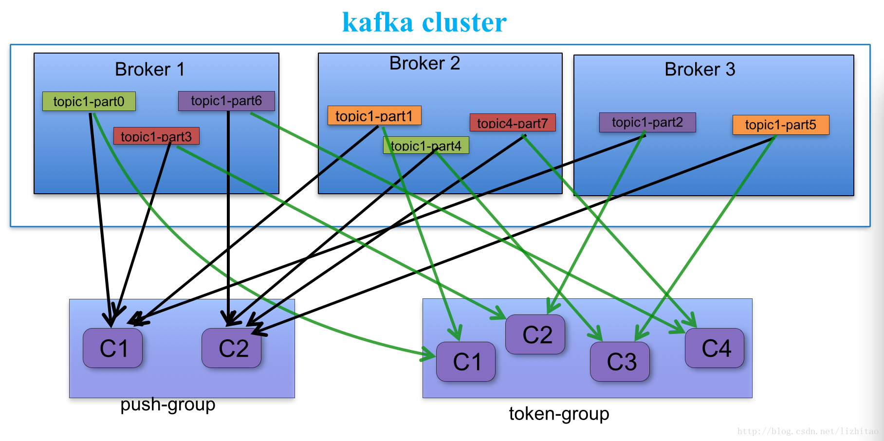

# 一、Kafka

- 整体架构分为producer、broker、consumer三部分，3.0版本之前依赖zookeeper做集群管理，3.0版本之后通过KRaft进行集群管理。

- consumer有消费者组概念，同一个组内不同消费者负责消费不同的partation，一个分区只能由一个组内消费者消费；消费者组之间互不影响

- 集群中的broker会选举出一个leader作为Controller负责管理整个集群中所有分区和副本的状态

- 每个topic由多个partation组成，`partation为真实存储数据的地方，每个partation以文件夹的形式存储在文件系统中。每个对应的partation数据目录下存储*.index，*log ，*timeindex三个文件`

- 每个partation都有对应的副本，分散在不同的broker中来实现分布式存储。

- 整体使用主写主读架构，通过partation分布不同的broker上，尽量保证每个broker既有replicas分区拉数据也有leader分区生产数据，实现负载

- kafka为了保证数据安全性，在producer写入数据时会通过副本机制对当前数据进行复制备份，其他分区副本通过拉取的方式进行数据同步，依赖多副本机制进行故障转移。

- **HW:** 高水位，标识consumer可见的offset，取所有ISR中最小的那个，只有所有的副本都同步完成HW才会增加，消费者只能消费到HW之后的数据

- **LEO:** 每个partation的log最后一条message位置

- **AR**: 所有的分区副本集合

- **ISR:** 同步的分区集合队列，属于AR的一个子集，ISR中如果同步慢了或挂起会被t出ISR队列。

- **OSR**：从同步队列中被提出的分区集合、

- **当partation leader挂掉后由Controller在ISR集合中顺序查找出第一个选举新leader**

- **对于一个 Topic 的并发量限制在于有多少个 Partition, 就能支撑多少的并发**

  
  

# 二、Kafka 与 Zookeeper

## 1、Zookeeper在Kafka集群分布式消息中的作用

### 1.1、选举Controller

Kafka是高可用的分布式消息系统，首先要解决的就是资源协调分配和多副本状态维护的问题。解决这些问题通常就是两种思路，一是依靠Zookeeper来协调，二是设定一个中心节点，让这个中心节点来协调。如果依靠Zookeeper来协调，会存在大量的竞争条件，对Zookeeper的访问压力增大，而且如果Zookeeper出现了问题（比如网络抖动），系统很容易出现紊乱。Kafka采用的是第二种思路，即选举一个中心节点来进行资源协调与多副本状态维护，这个中心节点被称作Controller（一个特殊的Broker），这个选举过程依靠Zookeeper来完成。
Broker启动时，会竞争创建临时"/controller"。如果创建成功，则成为Controller，并把Broker的id等信息写入这个节点。同时会全程监控"/controller"的数据变化，如果旧的Controller挂掉，则开启新一轮的竞争过程。

### 1.2、注册Broker

Kafka要进行资源协调，第一件需要知道的事情就是各个Broker的存活状态，这个问题利用Zookeeper可以很容易做到。
假设某个Broker，id为0，它启动时，会创建"/brokers/ids/0"临时节点，并把端口等信息写进去。Controller会监控"/brokers/ids"的节点变化，以实时感知各broker的状态，进行资源协调。

### 1.3、协调topic的创建、调整与销毁

在Kafka这个多副本分区的消息系统里，创建一个topic，至少需要以下3个步骤：

  - 持久化topic的多副本分区信息

  - 为每个分区挑选一个副本leader

  - 将上述信息发送给对应的Broker，以完成实际的日志文件创建过程

Controller的存在，可以很容易完成上面的b和c步骤，但a步骤不行，如果Controller挂掉，则这些信息会不可用。Kafka把这些信息保存在Zookeeper中，依靠其高可用特性来保证这些信息的高可用。假设某个topic名字为mytopic，创建时，其分区信息保存在"/brokers/topics/mytopic"中。Controller全程监控"/brokers/topics"的孩子节点变动，实时感知这些信息，以完成后续步骤。

创建完成之后，后续往往会有分区调整和topic删除等需求。普通青年可能会觉得这两个问题很简单，给Controller发个相关请求就可以了。事实远非如此！

拿分区调整来说，假设某分区有三个副本，分别位于Broker-1、Broker-2和Broker-3，leader为1，现在扩容增加了Broker-4、Broker-5、Broker-6，为了平衡机器间压力，需要将副本1 2 3移到4 5 6，至少经历以下步骤：

  - 修改该分区的副本信息为1 2 3 4 5 6，leader为1
  - 等待4 5 6副本追赶1 2 3的进度直至大家都同步(in sync)
  - 从4 5 6中挑选一个新的副本leader，假设为4
  - 修改该分区的副本信息为4 5 6，leader为4

以上每个步骤都有可能失败，如何才能保证这次调整顺利进行呢？

首先，我们不能直接修改该分区的副本信息为 4 5 6，原因很简单，需要等待4 5 6的追赶过程以便产生新leader。其次，操作未完全成功的命令需要保存下来，如果操作过程中，Controller挂掉，则新的Controller可以从头开始直至成功。Kafka怎么做的呢？

  - 通常是Admin控制台）把调整命令写入"/admin/reassign_partitions"节点
  - Controller监控"/admin/reassign_partitions"，拿到调整命令，执行上述步骤
  - 如果操作成功则删除该节点；如果Controller挂掉，新的Controller还会拿到这个命令并从头开始执行

当然，这里一次只能有一个调整命令，但一个调整命令可以同时调整多个topic的多个分区。
在这个过程中，Zookeeper的作用是：持久化操作命令并实时通知操作者，是不是只有Zookeeper可以做这个事情呢，不是，但Zookeeper可以做得很好，保证命令高可用。
类似的操作还有topic删除，副本的leader变更等，都是沿用上面的套路。

### 1.4. 保存topic级别和client级别的配置信息

Broker的集群中有全局配置信息，但如果想针对某个topic或者某个client进行配置呢，Kafka把这些信息保存在Zookeeper中，各个Broker实时监控以更新。

### 1.5、脑裂问题

脑裂问题是指，在一个设有中心节点的系统中，出现了两个中心节点。两个中心同时传达命令，自然会造成系统的紊乱。

Kafka利用Zookeeper所做的第一件也是至关重要的一件事情是选举Controller，那么自然就有疑问，有没有可能产生两个Controller呢？

首先，Zookeeper也是有leader的，它有没有可能产生两个leader呢？答案是不会。
quorum机制可以保证，不可能同时存在两个leader获得大多数支持。假设某个leader假死，其余的followers选举出了一个新的leader。这时，旧的leader复活并且仍然认为自己是leader，这个时候它向其他followers发出写请求也是会被拒绝的。因为每当新leader产生时，会生成一个epoch，这个epoch是递增的，followers如果确认了新的leader存在，知道其epoch，就会拒绝epoch小于现任leader epoch的所有请求。那有没有follower不知道新的leader存在呢，有可能，但肯定不是大多数，否则新leader无法产生。Zookeeper的写也遵循quorum机制，因此，得不到大多数支持的写是无效的，旧leader即使各种认为自己是leader，依然没有什么作用。

Kafka的Controller也采用了epoch，具体机制如下:

- 所有Broker监控"/controller"，节点被删除则开启新一轮选举，节点变化则获取新的epoch
- Controller会注册SessionExpiredListener，一旦因为网络问题导致Session失效，则自动丧失Controller身份，重新参与选举
- 收到Controller的请求，如果其epoch小于现在已知的controller_epoch，则直接拒绝

理论上来说，如果Controller的SessionExpired处理成功，则可以避免双leader，但假设SessionExpire处理意外失效的情况：旧Controller假死，新的Controller创建。旧Controller复活，SessionExpired处理意外失效，仍然认为自己是leader。
这时虽然有两个leader，但没有关系，leader只会发信息给存活的broker（仍然与Zookeeper在Session内的），而这些存活的broker则肯定能感知到新leader的存在，旧leader的请求会被拒绝。

### 1.6、如果Zookeeper挂了会怎样

每个Broker有一个metaDataCache，缓存有topic和partition的基本信息，可以正常的生产和消费信息，但不能进行topic的创建、调整和删除等操作。
此外，Broker会不断重试连接。

### 1.7、Zookeeper用量估计

假设Broker数目为B，topic数目为T，所有topic总partition数目为P，Client数目为C，以下数值均为峰值：

- qps: 100以内
- 连接数: B
- watcher数目：`3 * B + 2 * T + 6`
- Zookeeper节点数（叶子节点）: `B + P + T + C + 8`

## 2、kafka注册到zookeeper中的数据存储结构

Zookeeper路径的创建者与监听者

| 路径                                      | 创建者                                                       | 监听者                                              | 类型                                   |
| :---------------------------------------- | :----------------------------------------------------------- | :-------------------------------------------------- | :------------------------------------- |
| /controller                               | 各个broker竞争创建                                           | 所有broker全程监控data change                       | 临时节点                               |
| /controller_epoch                         | controller                                                   | 无                                                  | 永久节点                               |
| /brokers/ids                              | broker启动时检查并确保存在                                   | controller全程监控child change                      | 永久节点                               |
| /brokers/ids/{id}                         | id对应的broker                                               | 无                                                  | 临时节点                               |
| /brokers/topics                           | broker启动时检查确保存在                                     | controller全程监控child change                      | 永久节点                               |
| /brokers/topics/{topic}                   | controller收到创建请求，或者broker启用自动创建topic时，或admin工具 | controller全程监控data change                       | 永久节点                               |
| /brokers/topics/{topic}/{partition}/state | partiton的leader                                             | partition reassign时，controller临时监控data change | 永久节点                               |
| /config/changes                           | broker启动时检查并确保存在                                   | 所有broker全程监控child change                      | 永久节点                               |
| /config/topics                            | broker启动时检查并确保存在                                   | 无                                                  | 永久节点                               |
| /config/clients                           | broker启动时检查并确保存在                                   | 无                                                  | 永久节点                               |
| /brokers/seqid                            | broker启动时检查并确保存在                                   | 待确认                                              | 永久节点                               |
| /admin/delete_topics                      | broker启动时检查并确保存在                                   | controller全程监控child change                      | 永久节点                               |
| /isr_change_notification                  | broker启动时检查并确保存在                                   | controller全程监控child change                      | 永久节点                               |
| /admin/reassign_partitions                | admin 工具                                                   | controller全程监控data change                       | 永久节点，reassign结束后会删除         |
| /admin/preferred_replica_election         | admin 工具                                                   | controller全程监控data change                       | 永久节点，replica election结束后会删除 |


### 2.1、Topic注册信息

`/brokers/topics/[topic]`

存储某个topic的partitions所有分配信息

```json
{
    "version": "版本编号目前固定为数字1",
    "partitions":
    {
        "partitionId编号": [
            同步副本组brokerId列表
        ],
        "partitionId编号": [
            同步副本组brokerId列表
        ],
        .......
    }
}
```

### 2.2、Partition状态信息

`/brokers/topics/[topic]/partitions/[partition-Id]/state`

```json
Schema:
{
  "controller_epoch": 表示kafka集群中的中央控制器选举次数,
  "leader": 表示该partition选举leader的brokerId,
  "version": 版本编号默认为1,
  "leader_epoch": 该partition leader选举次数,
  "isr": [同步副本组brokerId列表]
}
```

### 2.3、Broker注册信息

 `/brokers/ids/[0...N]`

每个broker的配置文件中都需要指定一个数字类型的id(全局不可重复),此节点为临时znode(EPHEMERAL)

  ```json
  Schema:
  {
    "jmx_port": jmx端口号,
    "timestamp": kafka broker初始启动时的时间戳,
    "host": 主机名或ip地址,
    "version": 版本编号默认为1,
    "port": kafka broker的服务端端口号,由server.properties中参数port确定
  }
  ```

### 2.4、Controller epoch

 `/controller_epoch -> int (epoch)`

此值为一个数字,kafka集群中第一个broker第一次启动时为1，以后只要集群中center controller中央控制器所在broker变更或挂掉，就会重新选举新的center controller，每次center controller变更controller_epoch值就会 + 1

### 2.5、Controller注册信息

 `/controller -> int (broker id of the controller)`

存储center controller中央控制器所在kafka broker的信息

```json
{
  "version": 版本编号默认为1,
  "brokerid": kafka集群中broker唯一编号,
  "timestamp": kafka broker中央控制器变更时的时间戳
}
```

### 2.6、Consumer注册信息

`/consumers/[groupId]/ids/[consumerIdString]`

每个consumer都有一个唯一的ID(consumerId可以通过配置文件指定,也可以由系统生成),此id用来标记消费者信息.这是一个临时的znode,此节点的值为请看consumerIdString产生规则,即表示此consumer目前所消费的topic + partitions列表.

```json
Schema:
{
  "version": 版本编号默认为1,
  "subscription": { //订阅topic列表
    "topic名称": consumer中topic消费者线程数
  },
  "pattern": "static",
  "timestamp": "consumer启动时的时间戳"
}
```

### 2.7、Consumer offset

 `/consumers/[groupId]/offsets/[topic]/[partitionId] -> long (offset)`

用来跟踪每个consumer目前所消费的partition中最大的offset.此znode为持久节点,可以看出offset跟group_id有关,以表明当消费者组(consumer group)中一个消费者失效,重新触发balance,其他consumer可以继续消费

### 2.8、admin管理信息

# 三、Kafka中的消费者与消费者组

从0.9版本开始，**Consumer默认将offset保存在Kafka一个内置的名字叫_consumeroffsets的topic中**。默认是无法读取的，可以通过设置`consumer.properties中的exclude.internal.topics=false`来读取。

## 1、消费者组里面的消费者消费Topic Partition的消息时流程



1. 每个consumer客户端被创建时,会向zookeeper注册自己的信息.主要是为了"负载均衡"
2. 同一个Consumer Group中的Consumers，Kafka将相应Topic中的每个消息只发送给其中一个Consumer。
3. Consumer Group中的每个Consumer读取Topic的一个或多个Partitions，并且是唯一的Consumer；
4. 一个Consumer group的多个consumer的所有线程依次有序地消费一个topic的所有partitions,如果Consumer group中所有consumer总线程大于partitions数量，则会出现空闲情况

   ```yaml
   举例说明：
   kafka集群中创建一个topic为report-log，4个partitions 索引编号为0,1,2,3。假如有目前有三个消费者node（注意：一个consumer中一个消费线程可以消费一个或多个partition）
   
   如果每个consumer创建一个consumer thread线程,各个node消费情况如下，node1消费索引编号为0,1分区，node2费索引编号为2,node3费索引编号为3
   
   如果每个consumer创建2个consumer thread线程，各个node消费情况如下(是从consumer node先后启动状态来确定的)，node1消费索引编号为0,1分区；node2费索引编号为2,3；node3为空闲状态
   
   总结：从以上可知，Consumer Group中各个consumer是根据先后启动的顺序有序消费一个topic的所有partitions的。如果Consumer Group中所有consumer的总线程数大于partitions数量，则可能consumer thread或consumer会出现空闲状态。
   ```

## 2、Consumer均衡算法

当一个group中,有consumer加入或者离开时,会触发partitions均衡(均衡的最终目的,是提升topic的并发消费能力)

1. 假如topic1,具有如下partitions: P0,P1,P2,P3
2. 加入group中,有如下consumer: C0,C1
3. 首先根据partition索引号对partitions进行排序，假设排序: P0,P1,P2,P3
4. 根据(consumer.id + '-'+ thread序号)对消费者进行排序,假设排序: C0,C1
5. 计算倍数: M = [P0,P1,P2,P3].size / [C0,C1].size,本例值M=2(向上取整)
6. 然后依次分配partitions: C0 = [P0,P1],C1=[P2,P3],即Ci = [P(i * M),P((i + 1) * M -1)]

## 3、Consumer启动流程

1. 首先进行"Consumer Id注册";
2. 然后在"Consumer id 注册"节点下注册一个watch用来监听当前group中其他consumer的"退出"和"加入";只要此znode path下节点列表变更,都会触发此group下consumer的负载均衡.(比如一个consumer失效,那么其他consumer接管partitions).
3. 在"Broker id 注册"节点下,注册一个watch用来监听broker的存活情况;如果broker列表变更,将会触发所有的groups下的consumer重新balance.

# 四、kafka如何保证数据不丢失

- Producer保证发送数据不丢，生产者发送消息有三种模式，`发完即忘`、`同步`和`异步`，可以通过设置同步或异步的方式获取响应结果，失败做重试来保证消息在发送阶段不丢(broker接受produer数据做了幂等性保证)
- Broker保证接收数据保证不丢失，当生产者向leader发数据时通过**request.required.acks**参数设置数据可靠性的级别。
  - **1（默认）：** producer在ISR中的leader已成功收到的数据并得到确认后发送下一条message。如果leader宕机了，则会丢失数据。
  - **0**：producer无需等待来自broker的确认而继续发送下一批消息。这种情况下**数据传输效率最高，但是数据可靠性确是最低的**。
  - **-1或者all**：producer需要等待ISR中的所有follower都确认接收到数据后才算一次发送完成，可靠性最高。通过设置ack=1，broker内部做副本同步保证broker内部数据不丢失。

Consumer保证消费数据不丢失，默认情况下，当消费者消费到消息后，**会自动提交offse**。但是如果消费者消费出错，没有进入真正的业务处理，那么就可能会导致这条消息消费失败，从而丢失。可以通过开启手动提交位移，等待业务正常处理完成后，再提交offset。

# 五、kafka的版本

## Kafka版本规则

在Kafka 1.0.0之前基本遵循4位版本号，比如Kafka 0.8.2.0、Kafka 0.11.0.3等。而从1.0.0开始Kafka就告别了4位版本号，遵循 Major.Minor.Patch 的版本规则，其中Major表示大版本，通常是一些重大改变，因此彼此之间功能可能会不兼容；Minor表示小版本，通常是一些新功能的增加；最后Patch表示修订版，主要为修复一些重点Bug而发布的版本。比如Kafka 2.1.1，大版本就是2，小版本是1，Patch版本为1，是为修复Bug发布的第1个版本。

## Kafka版本演进

Kafka总共发布了7个大版本，分别是0.7.x、0.8.x、0.9.x、0.10.x、0.11.x、1.x及2.x版本。截止目前，最新版本是Kafka 2.6.0.，也是最新稳定版本

kafka的offset保存位置分为两种情况 0.9.0.0版本之前默认保存在zookeeper当中 ，0.9.0.0版本之后保存在broker对应的topic当中

# 参考链接

1. http://blog.csdn.net/lizhitao/article/details/23744675
2. https://www.jianshu.com/p/5bef1f9f74cd
2. https://juejin.cn/post/7142685653174583332