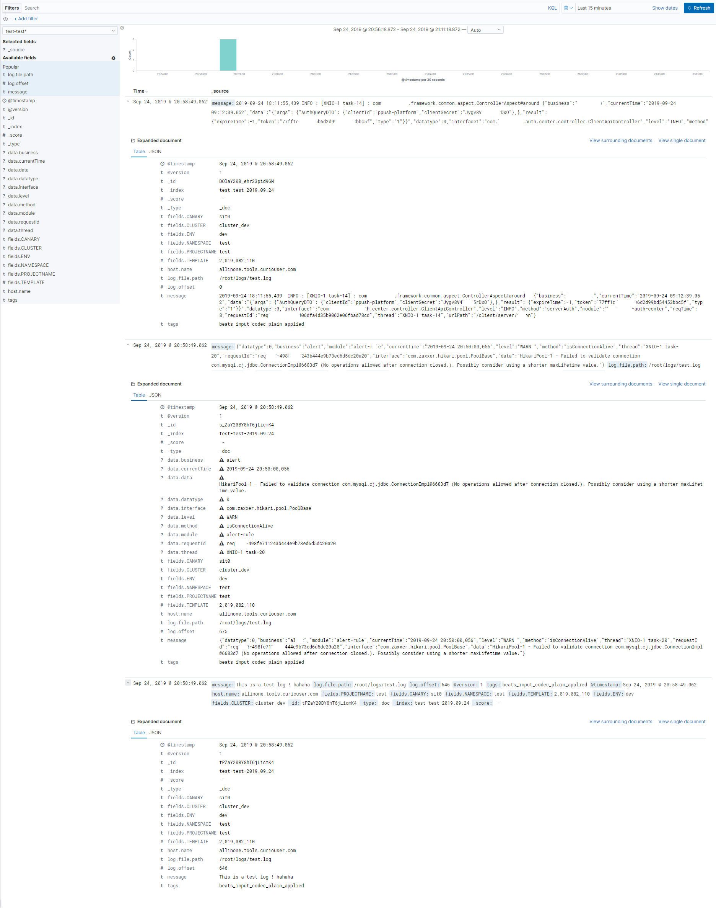

# 1、原始日志

```
2019-09-24 18:11:55,439  INFO : [XNIO-1 task-14] : com.curiouser.framework.common.aspect.ControllerAspect#around   {"business":"curiouser","currentTime":"2019-09-24 09:12:39.052","data":"{"args": {"AuthQueryDTO": {"clientId":"ppush-platform","clientSecret":"Jygv8V4TerC5rDxO"},},"result": {"expireTime":-1,"token":"77ff1cd2d1985b6d2d99bd54453bbc5f","type":"1"}}","datatype":0,"interface1":"com.curiouser.auth.center.controller.ClientApiController","level":"INFO","method":"serverAuth","module":"curiouser-auth-center","reqTime":8,"requestId":"req-bf1bcc406dfa4d35b9062e06fbad78cd","thread":"XNIO-1 task-14","urlPath":"/client/server/token"}

This is a test log ! hahaha

{"datatype":0,"business":"alert","module":"alert-rule","currentTime":"2019-09-24 20:50:00,056","level":"WARN ","method":"isConnectionAlive","thread":"XNIO-1 task-20","requestId":"req-498fe711243b444e9b73ed6d5dc20a20","interface":"com.zaxxer.hikari.pool.PoolBase","data":"HikariPool-1 - Failed to validate connection com.mysql.cj.jdbc.ConnectionImpl@6683d7 (No operations allowed after connection closed.). Possibly consider using a shorter maxLifetime value."}
```

# 2、经过Filebeat处理

```json
{"@timestamp":"2019-09-24T11:02:47.692Z","@metadata":{"beat":"filebeat","type":"_doc","version":"7.2.0"},"host":{"name":"allinone.tools.curiouser.com"},"log":{"offset":0,"file":{"path":"/root/logs/test.log"}},"message":"2019-09-24 18:11:55,439  INFO : [XNIO-1 task-14] : com.curiouser.framework.common.aspect.ControllerAspect#around   {\"business\":\"curiouser\",\"currentTime\":\"2019-09-24 09:12:39.052\",\"data\":\"{\"args\": {\"AuthQueryDTO\": {\"clientId\":\"ppush-platform\",\"clientSecret\":\"Jygv8V4TerC5rDxO\"},},\"result\": {\"expireTime\":-1,\"token\":\"77ff1cd2d1985b6d2d99bd54453bbc5f\",\"type\":\"1\"}}\",\"datatype\":0,\"interface1\":\"com.curiouser.auth.center.controller.ClientApiController\",\"level\":\"INFO\",\"method\":\"serverAuth\",\"module\":\"-auth-center\",\"reqTime\":8,\"requestId\":\"req-bf1bcc406dfa4d35b9062e06fbad78cd\",\"thread\":\"XNIO-1 task-14\",\"urlPath\":\"/client/server/token\"}","fields":{"ENV":"dev","CANARY":"sit0","TEMPLATE":2019082110,"NAMESPACE":"test","PROJECTNAME":"test","CLUSTER":"cluster_dev"}}
{"@timestamp":"2019-09-24T11:02:47.692Z","@metadata":{"beat":"filebeat","type":"_doc","version":"7.2.0"},"log":{"offset":645,"file":{"path":"/root/logs/test.log"}},"message":"This is a test log ! hahaha","fields":{"CLUSTER":"cluster_dev","ENV":"dev","CANARY":"sit0","TEMPLATE":2019082110,"NAMESPACE":"test","PROJECTNAME":"test"},"host":{"name":"allinone.tools.curiouser.com"}}
{"host":{"name":"allinone.tools.curiouser.com"},"message":"{\"datatype\":0,\"business\":\"alert\",\"module\":\"alert-rule\",\"currentTime\":\"2019-09-24 20:50:00,056\",\"level\":\"WARN \",\"method\":\"isConnectionAlive\",\"thread\":\"XNIO-1 task-20\",\"requestId\":\"req-498fe711243b444e9b73ed6d5dc20a20\",\"interface\":\"com.zaxxer.hikari.pool.PoolBase\",\"data\":\"HikariPool-1 - Failed to validate connection com.mysql.cj.jdbc.ConnectionImpl@6683d7 (No operations allowed after connection closed.). Possibly consider using a shorter maxLifetime value.\"}","@timestamp":"2019-09-24T12:58:49.062Z","log":{"offset":675,"file":{"path":"/root/logs/test.log"}},"tags":["beats_input_codec_plain_applied"],"@version":"1","fields":{"PROJECTNAME":"test","CANARY":"sit0","NAMESPACE":"test","TEMPLATE":2019082110,"ENV":"dev","CLUSTER":"cluster_dev"},"data":{"interface":"com.zaxxer.hikari.pool.PoolBase","method":"isConnectionAlive","currentTime":"2019-09-24 20:50:00,056","thread":"XNIO-1 task-20","module":"alert-rule","level":"WARN ","business":"alert","requestId":"req2fe711243b444e9b73ed6d5dc20a20","data":"HikariPool-1 - Failed to validate connection com.mysql.cj.jdbc.ConnectionImpl@6683d7 (No operations allowed after connection closed.). Possibly consider using a shorter maxLifetime value.","datatype":0}}
```

# 3、经过logstash处理

（内容没变，字段顺序变了，消息顺序变了）

```
{"fields":{"PROJECTNAME":"test","TEMPLATE":2019082110,"NAMESPACE":"test","CLUSTER":"cluster_dev","ENV":"dev","CANARY":"sit0"},"message":"This is a test log ! hahaha","@version":"1","@timestamp":"2019-09-24T11:24:50.336Z","log":{"offset":645,"file":{"path":"/root/logs/test.log"}},"tags":["beats_input_codec_plain_applied"],"host":{"name":"allinone.tools.curiouser.com"}}
{"fields":{"PROJECTNAME":"test","TEMPLATE":2019082110,"NAMESPACE":"test","CLUSTER":"cluster_dev","ENV":"dev","CANARY":"sit0"},"message":"2019-09-24 18:11:55,439  INFO : [XNIO-1 task-14] : com..framework.common.aspect.ControllerAspect#around   {\"business\":\"curiouserentTime\":\"2019-09-24 09:12:39.052\",\"data\":\"{\"args\": {\"AuthQueryDTO\": {\"clientId\":\"ppush-platform\",\"clientSecret\":\"Jygv8V4TerC5rDxO\"},},\"result\": {\"expireTime\":-1,\"token\":\"77ff1cd2d1985b6d2d99bd54453bbc5f\",\"type\":\"1\"}}\",\"datatype\":0,\"interface1\":\"com.curiouser.auth.cenoller.ClientApiController\",\"level\":\"INFO\",\"method\":\"serverAuth\",\"module\":\"curiouser-auth-center\",\"r8,\"requestId\":\"req-bf1bcc406dfa4d35b9062e06fbad78cd\",\"thread\":\"XNIO-1 task-14\",\"urlPath\":\"/client/server/token\"}","@version":"1","@timestamp":"2019-09-24T11:24:50.332Z","log":{"offset":0,"file":{"path":"/root/logs/test.log"}},"tags":["beats_input_codec_plain_applied"],"host":{"name":"allinone.tools.curiouser.com"}}
{"host":{"name":"allinone.tools.curiouser.com"},"message":"{\"datatype\":0,\"business\":\"alert\",\"module\":\"alert-rule\",\"currentTime\":\"2019-09-24 20:50:00,056\",\"level\":\"WARN \",\"method\":\"isConnectionAlive\",\"thread\":\"XNIO-1 task-20\",\"requestId\":\"req-498fe711243b444e9b73ed6d5dc20a20\",\"interface\":\"com.zaxxer.hikari.pool.PoolBase\",\"data\":\"HikariPool-1 - Failed to validate connection com.mysql.cj.jdbc.ConnectionImpl@6683d7 (No operations allowed after connection closed.). Possibly consider using a shorter maxLifetime value.\"}","@timestamp":"2019-09-24T12:58:49.062Z","log":{"offset":675,"file":{"path":"/root/logs/test.log"}},"tags":["beats_input_codec_plain_applied"],"@version":"1","fields":{"PROJECTNAME":"test","CANARY":"sit0","NAMESPACE":"test","TEMPLATE":2019082110,"ENV":"dev","CLUSTER":"cluster_dev"},"data":{"interface":"com.zaxxer.hikari.pool.PoolBase","method":"isConnectionAlive","currentTime":"2019-09-24 20:50:00,056","thread":"XNIO-1 task-20","module":"alert-rule","level":"WARN ","business":"alert","requestId":"reqfe711243b444e9b73ed6d5dc20a20","data":"HikariPool-1 - Failed to validate connection com.mysql.cj.jdbc.ConnectionImpl@6683d7 (No operations allowed after connection closed.). Possibly consider using a shorter maxLifetime value.","datatype":0}}
```

# 4、经过logstash-producer-->Kafka处理

(内容没变，字段顺序变了，消息顺序变了)

```json
{"message":"2019-09-24 18:11:55,439  INFO : [XNIO-1 task-14] : com..framework.common.aspect.ControllerAspect#around   {\"business\":\"curiouserentTime\":\"2019-09-24 09:12:39.052\",\"data\":\"{\"args\": {\"AuthQueryDTO\": {\"clientId\":\"ppush-platform\",\"clientSecret\":\"Jygv8V4TerC5rDxO\"},},\"result\": {\"expireTime\":-1,\"token\":\"77ff1cd2d1985b6d2d99bd54453bbc5f\",\"type\":\"1\"}}\",\"datatype\":0,\"interface1\":\"com.curiouser.auth.cencuriouseroller.ClientApiController\",\"level\":\"INFO\",\"method\":\"serverAuth\",\"module\":\"curiouser-auth-cencuriousereqTime\":8,\"requestId\":\"req-bf1bcc406dfa4d35b9062e06fbad78cd\",\"thread\":\"XNIO-1 task-14\",\"urlPath\":\"/client/server/token\"}","@timestamp":"2019-09-24T11:34:29.741Z","host":{"name":"allinone.tools.curiouser.com"},"@version":"1","fields":{"CANARY":"sit0","ENV":"dev","TEMPLATE":2019082110,"PROJECTNAME":"test","NAMESPACE":"test","CLUSTER":"cluster_dev"},"log":{"file":{"path":"/root/logs/test.log"},"offset":0},"tags":["beats_input_codec_plain_applied"]}
{"message":"This is a test log ! hahaha","@timestamp":"2019-09-24T11:34:29.741Z","host":{"name":"allinone.tools.curiouser.com"},"@version":"1","fields":{"CANARY":"sit0","ENV":"dev","TEMPLATE":2019082110,"PROJECTNAME":"test","NAMESPACE":"test","CLUSTER":"cluster_dev"},"log":{"file":{"path":"/root/logs/test.log"},"offset":645},"tags":["beats_input_codec_plain_applied"]}
{"host":{"name":"allinone.tools.curiouser.com"},"message":"{\"datatype\":0,\"business\":\"alert\",\"module\":\"alert-rule\",\"currentTime\":\"2019-09-24 20:50:00,056\",\"level\":\"WARN \",\"method\":\"isConnectionAlive\",\"thread\":\"XNIO-1 task-20\",\"requestId\":\"req-498fe711243b444e9b73ed6d5dc20a20\",\"interface\":\"com.zaxxer.hikari.pool.PoolBase\",\"data\":\"HikariPool-1 - Failed to validate connection com.mysql.cj.jdbc.ConnectionImpl@6683d7 (No operations allowed after connection closed.). Possibly consider using a shorter maxLifetime value.\"}","@timestamp":"2019-09-24T12:58:49.062Z","log":{"offset":675,"file":{"path":"/root/logs/test.log"}},"tags":["beats_input_codec_plain_applied"],"@version":"1","fields":{"PROJECTNAME":"test","CANARY":"sit0","NAMESPACE":"test","TEMPLATE":2019082110,"ENV":"dev","CLUSTER":"cluster_dev"},"data":{"interface":"com.zaxxer.hikari.pool.PoolBase","method":"isConnectionAlive","currentTime":"2019-09-24 20:50:00,056","thread":"XNIO-1 task-20","module":"alert-rule","level":"WARN ","business":"alert","requestId":"reqfe711243b444e9b73ed6d5dc20a20","data":"HikariPool-1 - Failed to validate connection com.mysql.cj.jdbc.ConnectionImpl@6683d7 (No operations allowed after connection closed.). Possibly consider using a shorter maxLifetime value.","datatype":0}}
```

# 5、经过Kafka-->logstash-consumer处理

(内容没变，字段顺序变了，消息顺序变了)

```json
{"@version":"1","host":{"name":"allinone.tools.curiouser.com"},"log":{"offset":0,"file":{"path":"/root/logs/test.log"}},"@timestamp":"2019-09-24T11:34:29.741Z","fields":{"PROJECTNAME":"test","TEMPLATE":2019082110,"CLUSTER":"cluster_dev","CANARY":"sit0","NAMESPACE":"test","ENV":"dev"},"message":"2019-09-24 18:11:55,439  INFO : [XNIO-1 task-14] : com.curiouser.framework.common.aspect.ControllerAspect#around   {\"business\":\"curiouser\",\"currentTime\":\"2019-09-24 09:12:39.052\",\"data\":\"{\"args\": {\"AuthQueryDTO\": {\"clientId\":\"ppush-platform\",\"clientSecret\":\"Jygv8V4TerC5rDxO\"},},\"result\": {\"expireTime\":-1,\"token\":\"77ff1cd2d1985b6d2d99bd54453bbc5f\",\"type\":\"1\"}}\",\"datatype\":0,\"interface1\":\"com.curiouser.auth.center.controller.ClientApiController\",\"level\":\"INFO\",\"method\":\"serverAuth\",\"module\":\"curiouser-auth-center\",\"reqTime\":8,\"requestId\":\"req-bf1bcc406dfa4d35b9062e06fbad78cd\",\"thread\":\"XNIO-1 task-14\",\"urlPath\":\"/client/server/token\"}","tags":["beats_input_codec_plain_applied"]}
{"@version":"1","host":{"name":"allinone.tools.curiouser.com"},"log":{"offset":645,"file":{"path":"/root/logs/test.log"}},"@timestamp":"2019-09-24T11:34:29.741Z","fields":{"PROJECTNAME":"test","TEMPLATE":2019082110,"CLUSTER":"cluster_dev","CANARY":"sit0","NAMESPACE":"test","ENV":"dev"},"message":"This is a test log ! hahaha","tags":["beats_input_codec_plain_applied"]}
{"host":{"name":"allinone.tools.curiouser.com"},"message":"{\"datatype\":0,\"business\":\"alert\",\"module\":\"alert-rule\",\"currentTime\":\"2019-09-24 20:50:00,056\",\"level\":\"WARN \",\"method\":\"isConnectionAlive\",\"thread\":\"XNIO-1 task-20\",\"requestId\":\"req-498fe711243b444e9b73ed6d5dc20a20\",\"interface\":\"com.zaxxer.hikari.pool.PoolBase\",\"data\":\"HikariPool-1 - Failed to validate connection com.mysql.cj.jdbc.ConnectionImpl@6683d7 (No operations allowed after connection closed.). Possibly consider using a shorter maxLifetime value.\"}","@timestamp":"2019-09-24T12:58:49.062Z","log":{"offset":675,"file":{"path":"/root/logs/test.log"}},"tags":["beats_input_codec_plain_applied"],"@version":"1","fields":{"PROJECTNAME":"test","CANARY":"sit0","NAMESPACE":"test","TEMPLATE":2019082110,"ENV":"dev","CLUSTER":"cluster_dev"},"data":{"interface":"com.zaxxer.hikari.pool.PoolBase","method":"isConnectionAlive","currentTime":"2019-09-24 20:50:00,056","thread":"XNIO-1 task-20","module":"alert-rule","level":"WARN ","business":"alert","requestId":"reqfe711243b444e9b73ed6d5dc20a20","data":"HikariPool-1 - Failed to validate connection com.mysql.cj.jdbc.ConnectionImpl@6683d7 (No operations allowed after connection closed.). Possibly consider using a shorter maxLifetime value.","datatype":0}}
```

经过`"原始日志+Filebeat--->logstash-producer--->Kafka--->logstash-consumer--->elasticsearch"`流程处理过的日志（将logstash-consumer发送的日志数据放在”_source“字段下，同时）

```json

# ===========================================================================
{
  "_index": "test-test-2019.09.24",
  "_type": "_doc",
  "_id": "s_ZaY20BY8hT6jLicmK4",
  "_version": 1,
  "_score": null,
  "_source": {
    "message": "{\"datatype\":0,\"business\":\"alert\",\"module\":\"alert-rule\",\"currentTime\":\"2019-09-24 20:50:00,056\",\"level\":\"WARN \",\"method\":\"isConnectionAlive\",\"thread\":\"XNIO-1 task-20\",\"requestId\":\"req-498fe711243b444e9b73ed6d5dc20a20\",\"interface\":\"com.zaxxer.hikari.pool.PoolBase\",\"data\":\"HikariPool-1 - Failed to validate connection com.mysql.cj.jdbc.ConnectionImpl@6683d7 (No operations allowed after connection closed.). Possibly consider using a shorter maxLifetime value.\"}",
    "log": {
      "file": {
        "path": "/root/logs/test.log"
      },
      "offset": 675
    },
    "@version": "1",
    "data": {
      "business": "alert",
      "interface": "com.zaxxer.hikari.pool.PoolBase",
      "method": "isConnectionAlive",
      "requestId": "reqfe711243b444e9b73ed6d5dc20a20",
      "data": "HikariPool-1 - Failed to validate connection com.mysql.cj.jdbc.ConnectionImpl@6683d7 (No operations allowed after connection closed.). Possibly consider using a shorter maxLifetime value.",
      "datatype": 0,
      "thread": "XNIO-1 task-20",
      "level": "WARN ",
      "module": "alert-rule",
      "currentTime": "2019-09-24 20:50:00,056"
    },
    "tags": [
      "beats_input_codec_plain_applied"
    ],
    "@timestamp": "2019-09-24T12:58:49.062Z",
    "host": {
      "name": "allinone.tools.curiouser.com"
    },
    "fields": {
      "PROJECTNAME": "test",
      "CANARY": "sit0",
      "NAMESPACE": "test",
      "TEMPLATE": 2019082110,
      "ENV": "dev",
      "CLUSTER": "cluster_dev"
    }
  },
  "fields": {
    "@timestamp": [
      "2019-09-24T12:58:49.062Z"
    ]
  },
  "sort": [
    1569329929062
  ]
}
# ===========================================================================
{
  "_index": "test-test-2019.09.24",
  "_type": "_doc",
  "_id": "1fUgY20BY8hT6jLiJAfF",
  "_version": 1,
  "_score": null,
  "_source": {
    "message": "This is a test log ! hahaha",
    "tags": [
      "beats_input_codec_plain_applied"
    ],
    "host": {
      "name": "allinone.tools.curiouser.com"
    },
    "@timestamp": "2019-09-24T11:34:29.741Z",
    "fields": {
      "CANARY": "sit0",
      "NAMESPACE": "test",
      "CLUSTER": "cluster_dev",
      "TEMPLATE": 2019082110,
      "ENV": "dev",
      "PROJECTNAME": "test"
    },
    "@version": "1",
    "log": {
      "file": {
        "path": "/root/logs/test.log"
      },
      "offset": 645
    }
  },
  "fields": {
    "@timestamp": [
      "2019-09-24T11:34:29.741Z"
    ]
  },
  "sort": [
    1569324869741
  ]
}
# ===========================================================================
{
  "_index": "test-test-2019.09.24",
  "_type": "_doc",
  "_id": "DOlaY20B_ehr23pid9GM",
  "_version": 1,
  "_score": null,
  "_source": {
    "message": "2019-09-24 18:11:55,439  INFO : [XNIO-1 task-14] : com.curiouser.framework.common.aspect.ControllerAspect#around   {\"business\":\"curiouser\",\"currentTime\":\"2019-09-24 09:12:39.052\",\"data\":\"{\"args\": {\"AuthQueryDTO\": {\"clientId\":\"ppush-platform\",\"clientSecret\":\"Jygv8V4TerC5rDxO\"},},\"result\": {\"expireTime\":-1,\"token\":\"77ff1cd2d1985b6d2d99bd54453bbc5f\",\"type\":\"1\"}}\",\"datatype\":0,\"interface1\":\"com.curiouser.auth.center.controller.ClientApiController\",\"level\":\"INFO\",\"method\":\"serverAuth\",\"module\":\"curiouser-auth-center\",\"reqTime\":8,\"requestId\":\"req-bf106dfa4d35b9062e06fbad78cd\",\"thread\":\"XNIO-1 task-14\",\"urlPath\":\"/client/server/token\"}",
    "log": {
      "file": {
        "path": "/root/logs/test.log"
      },
      "offset": 0
    },
    "@version": "1",
    "tags": [
      "beats_input_codec_plain_applied"
    ],
    "@timestamp": "2019-09-24T12:58:49.062Z",
    "host": {
      "name": "allinone.tools.curiouser.com"
    },
    "fields": {
      "PROJECTNAME": "test",
      "CANARY": "sit0",
      "NAMESPACE": "test",
      "ENV": "dev",
      "TEMPLATE": 2019082110,
      "CLUSTER": "cluster_dev"
    }
  },
  "fields": {
    "@timestamp": [
      "2019-09-24T12:58:49.062Z"
    ]
  },
  "sort": [
    1569329929062
  ]
}
```



# 附录

## 1、filebeat配置

   ```yaml
filebeat.inputs:
- type: log
  enabled: true
  paths:
  - /root/logs/test.log
  exclude_files: ["/root/logs/_filebeat", ".gz$"]
  recursive_glob.enabled: true
setup.template.settings:
  index.number_of_shards: 3
processors:
- decode_json_fields:
    fields: ["message"]
    process_array: false
    max_depth: 1
    target: "data"
    overwrite_keys: false
- drop_fields:
    fields: ["agent", "tags", "input", "ecs"]
fields:
  NAMESPACE: "test"
  PROJECTNAME: "test"
  CLUSTER: cluster_dev
  ENV: dev
  CANARY: sit0
  TEMPLATE: 2019082110
output.logstash:
  hosts: ["localhost:5044"]

#output.file:
#  path: "/root/logs/output"
#  filename: filebeat.log
   ```

## 2、logstash_producer配置

   ```json
input {
  beats {
    id => "logstash_producer_input_beats"
    port => 5044
  }
}
output {

  #file{
  #  path => "/root/logs/output/logstah-producer.log"
  #}

  kafka {
    id => "logstash_producer_output_kafka"
    codec => json
    topic_id => "logs"
    bootstrap_servers => "localhost:9092"
    compression_type => "snappy"
  }
}
   ```

## 3、logstash_consumer配置

   ```json
input {
  kafka {
    id => "logstash_consumer_input_kafka"
    bootstrap_servers => "localhost:9092"
    topics => "logs"
    group_id => "applications_logs_group"
    codec => "json"
    auto_offset_reset => "earliest"
  }
}
output {
  #file{
  #  path => "/root/logs/output/logstah-consumer.log"
  #}
  elasticsearch { 
    id => "logstash_consumer_output_elasticsearch"
    hosts => ["localhost:9092"] 
    index=>"%{[fields][NAMESPACE]}-%{[fields][PROJECTNAME]}-%{+YYYY.MM.dd}"
    document_type => "_doc"
    http_compression => true
    user => "logstash-pipeline"
    password => "logstash-pipeline"
   }
}
   ```
