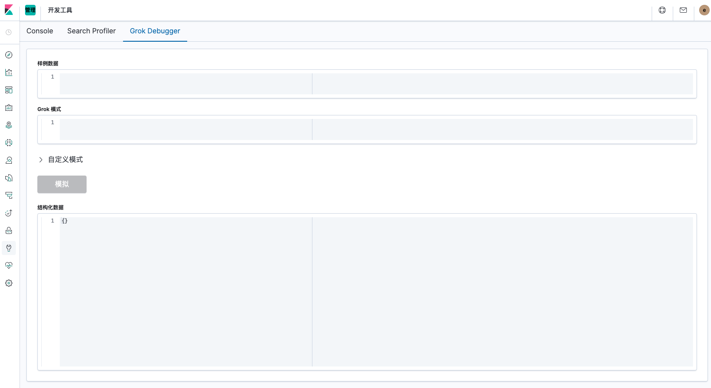

# Logstash Grok插件

# 一、简介

Logstash提供了一系列filter过滤插件来处理收集到的log event，根据log event的特征去切分所需要的字段，方便kibana做visualize和dashboard的data analysis。

官方文档：https://www.elastic.co/guide/en/logstash/current/plugins-filters-grok.html

插件Github：https://github.com/logstash-plugins/logstash-filter-grok

# 二、默认内置的匹配模式

Grok模块提供了默认内嵌了一些基本匹配模式。可使用以下方式查看支持的匹配模式

- https://github.com/logstash-plugins/logstash-patterns-core/blob/master/patterns/grok-patterns
- http://grokdebug.herokuapp.com/patterns
- **Logstash安装目录**：`/usr/share/logstash/vendor/bundle/jruby/2.5.0/gems/logstash-patterns-core-4.1.2/patterns/grok-patterns`

## 内置的匹配模式

```bash
USERNAME [a-zA-Z0-9._-]+
USER %{USERNAME}
EMAILLOCALPART [a-zA-Z][a-zA-Z0-9_.+-=:]+
EMAILADDRESS %{EMAILLOCALPART}@%{HOSTNAME}
INT (?:[+-]?(?:[0-9]+))
BASE10NUM (?<![0-9.+-])(?>[+-]?(?:(?:[0-9]+(?:\.[0-9]+)?)|(?:\.[0-9]+)))
NUMBER (?:%{BASE10NUM})
BASE16NUM (?<![0-9A-Fa-f])(?:[+-]?(?:0x)?(?:[0-9A-Fa-f]+))
BASE16FLOAT \b(?<![0-9A-Fa-f.])(?:[+-]?(?:0x)?(?:(?:[0-9A-Fa-f]+(?:\.[0-9A-Fa-f]*)?)|(?:\.[0-9A-Fa-f]+)))\b

POSINT \b(?:[1-9][0-9]*)\b
NONNEGINT \b(?:[0-9]+)\b
WORD \b\w+\b
NOTSPACE \S+
SPACE \s*
DATA .*?
GREEDYDATA .*
QUOTEDSTRING (?>(?<!\\)(?>"(?>\\.|[^\\"]+)+"|""|(?>'(?>\\.|[^\\']+)+')|''|(?>`(?>\\.|[^\\`]+)+`)|``))
UUID [A-Fa-f0-9]{8}-(?:[A-Fa-f0-9]{4}-){3}[A-Fa-f0-9]{12}
# URN, allowing use of RFC 2141 section 2.3 reserved characters
URN urn:[0-9A-Za-z][0-9A-Za-z-]{0,31}:(?:%[0-9a-fA-F]{2}|[0-9A-Za-z()+,.:=@;$_!*'/?#-])+

# Networking
MAC (?:%{CISCOMAC}|%{WINDOWSMAC}|%{COMMONMAC})
CISCOMAC (?:(?:[A-Fa-f0-9]{4}\.){2}[A-Fa-f0-9]{4})
WINDOWSMAC (?:(?:[A-Fa-f0-9]{2}-){5}[A-Fa-f0-9]{2})
COMMONMAC (?:(?:[A-Fa-f0-9]{2}:){5}[A-Fa-f0-9]{2})
IPV6 ((([0-9A-Fa-f]{1,4}:){7}([0-9A-Fa-f]{1,4}|:))|(([0-9A-Fa-f]{1,4}:){6}(:[0-9A-Fa-f]{1,4}|((25[0-5]|2[0-4]\d|1\d\d|[1-9]?\d)(\.(25[0-5]|2[0-4]\d|1\d\d|[1-9]?\d)){3})|:))|(([0-9A-Fa-f]{1,4}:){5}(((:[0-9A-Fa-f]{1,4}){1,2})|:((25[0-5]|2[0-4]\d|1\d\d|[1-9]?\d)(\.(25[0-5]|2[0-4]\d|1\d\d|[1-9]?\d)){3})|:))|(([0-9A-Fa-f]{1,4}:){4}(((:[0-9A-Fa-f]{1,4}){1,3})|((:[0-9A-Fa-f]{1,4})?:((25[0-5]|2[0-4]\d|1\d\d|[1-9]?\d)(\.(25[0-5]|2[0-4]\d|1\d\d|[1-9]?\d)){3}))|:))|(([0-9A-Fa-f]{1,4}:){3}(((:[0-9A-Fa-f]{1,4}){1,4})|((:[0-9A-Fa-f]{1,4}){0,2}:((25[0-5]|2[0-4]\d|1\d\d|[1-9]?\d)(\.(25[0-5]|2[0-4]\d|1\d\d|[1-9]?\d)){3}))|:))|(([0-9A-Fa-f]{1,4}:){2}(((:[0-9A-Fa-f]{1,4}){1,5})|((:[0-9A-Fa-f]{1,4}){0,3}:((25[0-5]|2[0-4]\d|1\d\d|[1-9]?\d)(\.(25[0-5]|2[0-4]\d|1\d\d|[1-9]?\d)){3}))|:))|(([0-9A-Fa-f]{1,4}:){1}(((:[0-9A-Fa-f]{1,4}){1,6})|((:[0-9A-Fa-f]{1,4}){0,4}:((25[0-5]|2[0-4]\d|1\d\d|[1-9]?\d)(\.(25[0-5]|2[0-4]\d|1\d\d|[1-9]?\d)){3}))|:))|(:(((:[0-9A-Fa-f]{1,4}){1,7})|((:[0-9A-Fa-f]{1,4}){0,5}:((25[0-5]|2[0-4]\d|1\d\d|[1-9]?\d)(\.(25[0-5]|2[0-4]\d|1\d\d|[1-9]?\d)){3}))|:)))(%.+)?
IPV4 (?<![0-9])(?:(?:[0-1]?[0-9]{1,2}|2[0-4][0-9]|25[0-5])[.](?:[0-1]?[0-9]{1,2}|2[0-4][0-9]|25[0-5])[.](?:[0-1]?[0-9]{1,2}|2[0-4][0-9]|25[0-5])[.](?:[0-1]?[0-9]{1,2}|2[0-4][0-9]|25[0-5]))(?![0-9])
IP (?:%{IPV6}|%{IPV4})
HOSTNAME \b(?:[0-9A-Za-z][0-9A-Za-z-]{0,62})(?:\.(?:[0-9A-Za-z][0-9A-Za-z-]{0,62}))*(\.?|\b)
IPORHOST (?:%{IP}|%{HOSTNAME})
HOSTPORT %{IPORHOST}:%{POSINT}

# paths
PATH (?:%{UNIXPATH}|%{WINPATH})
UNIXPATH (/([\w_%!$@:.,+~-]+|\\.)*)+
TTY (?:/dev/(pts|tty([pq])?)(\w+)?/?(?:[0-9]+))
WINPATH (?>[A-Za-z]+:|\\)(?:\\[^\\?*]*)+
URIPROTO [A-Za-z]([A-Za-z0-9+\-.]+)+
URIHOST %{IPORHOST}(?::%{POSINT:port})?
# uripath comes loosely from RFC1738, but mostly from what Firefox
# doesn't turn into %XX
URIPATH (?:/[A-Za-z0-9$.+!*'(){},~:;=@#%&_\-]*)+
#URIPARAM \?(?:[A-Za-z0-9]+(?:=(?:[^&]*))?(?:&(?:[A-Za-z0-9]+(?:=(?:[^&]*))?)?)*)?
URIPARAM \?[A-Za-z0-9$.+!*'|(){},~@#%&/=:;_?\-\[\]<>]*
URIPATHPARAM %{URIPATH}(?:%{URIPARAM})?
URI %{URIPROTO}://(?:%{USER}(?::[^@]*)?@)?(?:%{URIHOST})?(?:%{URIPATHPARAM})?

# Months: January, Feb, 3, 03, 12, December
MONTH \b(?:[Jj]an(?:uary|uar)?|[Ff]eb(?:ruary|ruar)?|[Mm](?:a|ä)?r(?:ch|z)?|[Aa]pr(?:il)?|[Mm]a(?:y|i)?|[Jj]un(?:e|i)?|[Jj]ul(?:y)?|[Aa]ug(?:ust)?|[Ss]ep(?:tember)?|[Oo](?:c|k)?t(?:ober)?|[Nn]ov(?:ember)?|[Dd]e(?:c|z)(?:ember)?)\b
MONTHNUM (?:0?[1-9]|1[0-2])
MONTHNUM2 (?:0[1-9]|1[0-2])
MONTHDAY (?:(?:0[1-9])|(?:[12][0-9])|(?:3[01])|[1-9])

# Days: Monday, Tue, Thu, etc...
DAY (?:Mon(?:day)?|Tue(?:sday)?|Wed(?:nesday)?|Thu(?:rsday)?|Fri(?:day)?|Sat(?:urday)?|Sun(?:day)?)

# Years?
YEAR (?>\d\d){1,2}
HOUR (?:2[0123]|[01]?[0-9])
MINUTE (?:[0-5][0-9])
# '60' is a leap second in most time standards and thus is valid.
SECOND (?:(?:[0-5]?[0-9]|60)(?:[:.,][0-9]+)?)
TIME (?!<[0-9])%{HOUR}:%{MINUTE}(?::%{SECOND})(?![0-9])
# datestamp is YYYY/MM/DD-HH:MM:SS.UUUU (or something like it)
DATE_US %{MONTHNUM}[/-]%{MONTHDAY}[/-]%{YEAR}
DATE_EU %{MONTHDAY}[./-]%{MONTHNUM}[./-]%{YEAR}
ISO8601_TIMEZONE (?:Z|[+-]%{HOUR}(?::?%{MINUTE}))
ISO8601_SECOND (?:%{SECOND}|60)
TIMESTAMP_ISO8601 %{YEAR}-%{MONTHNUM}-%{MONTHDAY}[T ]%{HOUR}:?%{MINUTE}(?::?%{SECOND})?%{ISO8601_TIMEZONE}?
DATE %{DATE_US}|%{DATE_EU}
DATESTAMP %{DATE}[- ]%{TIME}
TZ (?:[APMCE][SD]T|UTC)
DATESTAMP_RFC822 %{DAY} %{MONTH} %{MONTHDAY} %{YEAR} %{TIME} %{TZ}
DATESTAMP_RFC2822 %{DAY}, %{MONTHDAY} %{MONTH} %{YEAR} %{TIME} %{ISO8601_TIMEZONE}
DATESTAMP_OTHER %{DAY} %{MONTH} %{MONTHDAY} %{TIME} %{TZ} %{YEAR}
DATESTAMP_EVENTLOG %{YEAR}%{MONTHNUM2}%{MONTHDAY}%{HOUR}%{MINUTE}%{SECOND}

# Syslog Dates: Month Day HH:MM:SS
SYSLOGTIMESTAMP %{MONTH} +%{MONTHDAY} %{TIME}
PROG [\x21-\x5a\x5c\x5e-\x7e]+
SYSLOGPROG %{PROG:program}(?:\[%{POSINT:pid}\])?
SYSLOGHOST %{IPORHOST}
SYSLOGFACILITY <%{NONNEGINT:facility}.%{NONNEGINT:priority}>
HTTPDATE %{MONTHDAY}/%{MONTH}/%{YEAR}:%{TIME} %{INT}

# Shortcuts
QS %{QUOTEDSTRING}

# Log formats
SYSLOGBASE %{SYSLOGTIMESTAMP:timestamp} (?:%{SYSLOGFACILITY} )?%{SYSLOGHOST:logsource} %{SYSLOGPROG}:

# Log Levels
LOGLEVEL ([Aa]lert|ALERT|[Tt]race|TRACE|[Dd]ebug|DEBUG|[Nn]otice|NOTICE|[Ii]nfo|INFO|[Ww]arn?(?:ing)?|WARN?(?:ING)?|[Ee]rr?(?:or)?|ERR?(?:OR)?|[Cc]rit?(?:ical)?|CRIT?(?:ICAL)?|[Ff]atal|FATAL|[Ss]evere|SEVERE|EMERG(?:ENCY)?|[Ee]merg(?:ency)?)
```

## 使用语法

```bash
%{SYNTAX:SEMANTIC}    
# %{内置的匹配模式:存储该值的变量字段名:数值类型}

# 例如 %{NUMBER:row_id:int} 
# 如：3会被NUBER模式所匹配
```

# 三、自定义的匹配模式

## 方式一：直接在pipeline中定义使用

直接在pipeline中自定义匹配模式的语法规则

```bash
(?<field_name>the pattern here)
```

示例

```bash
filter {
  grok {
    patterns_dir => ["./patterns"]
    match => { "message" => "%{IP:client_id_address} %{WORD:method} %{URIPATHPARAM:request} %{NUMBER:bytes} %{NUMBER:http_response_time} (?<queue_id>[0-9A-F]{10,11})}" }
  }
}
```

## 方式二：创建自定义pattern文件

创建文件` ./patterns/postfix`

```bash
POSTFIX_QUEUEID [0-9A-F]{10,11}
```

在pipeline中使用

```bash
filter {
  grok {
    patterns_dir => ["./patterns"]
    match => { "message" => "%{IP:client_id_address} %{WORD:method} %{URIPATHPARAM:request} %{NUMBER:bytes} %{NUMBER:http_response_time} %{POSTFIX_QUEUEID:queue_id}" }
  }
}
```


# 四、Debug

- http://grokdebug.herokuapp.com/

- Kibana中的开发工具

  


# 五、示例

## 1、Filebeat采集多行MySQL慢查询日志到ES

### MySQL(5.6)慢查询日志

```bash
# Time: 200317 17:29:17
# User@Host: test[test] @  [192.168.1.1]  Id:     5
# Query_time: 9.717266  Lock_time: 0.000167 Rows_sent: 3  Rows_examined: 101693
use test;
SET timestamp=1584437357;
SELECT * FROM test WHERE name like 'aaa' ORDER BY id DESC LIMIT 1000;
# Time: 200317 17:32:08
# User@Host: test[test] @  [192.168.10.2]  Id:   97
# Query_time: 4.375731  Lock_time: 0.000151 Rows_sent: 25  Rows_examined: 6049071
SET timestamp=1584437528;
select * from test where uid='35001' limit 100;
```

### Filebeat配置

```bash
filebeat.inputs:
- type: log
  paths:
  - /data/mysql/log/slow.log
  exclude_files: ["_filebeat", ".gz$"]
  multiline.pattern: '^# Time:'
  multiline.negate: true
  multiline.match: after
  multiline.max_lines: 20000
```

### Filebeat采集发到logstash的日志格式

```bash
{
    "@timestamp": "2020-03-18T02:52:57.139Z",
    "@metadata":{
        "beat": "filebeat",
        "type": "_doc",
        "version": "7.5.1"
    },
    "host":{ "name": "test.mysql" },
    "log": {
        "offset": 525,
        "file": { "path": "/data/mysql/logs/slow.log" },
        "flags": ["multiline"]
    },
    "message": "# Time: 200317 17:29:17\n# User@Host: test[test] @  [192.168.1.1]  Id:     5\n# Query_time: 9.717266  Lock_time: 0.000167 Rows_sent: 3  Rows_examined: 101693\nuse test;\nSET timestamp=1584437357;\nSELECT * FROM test WHERE name like 'aaa' ORDER BY id DESC LIMIT 1000;"    
}
```

### Logstash filter grok配置

```bash
filter {
  grok {
    match => { "message" => "(?m)^#\s*Time:.*\s+#\s+User@Host:\s+%{USER:user}\[[^\]]+\]\s+@\s+(?:(?<clientip>\S*) )?\[(?:%{IPV4:clientip})?\]\s+Id:\s+%{NUMBER:row_id:int}\n#\s+Query_time:\s+%{NUMBER:Query_time:float}\s+Lock_time:\s+%{NUMBER:lock_time:float}\s+Rows_sent:\s+%{NUMBER:Row_sent:int}\s+Rows_examined:\s+%{NUMBER:Rows_examined:int}\n\s*(?:use %{DATA:database};\s*\n)?SET\s+timestamp=%{NUMBER:timestamp};\n\s*(?<sql>(?<action>\w+)\b.*)$" }

    remove_field => [ "message" ]
  }
  date {
    match => [ "timestamp", "UNIX" ]
    remove_field => [ "timestamp" ]
  }
}
```

### ES存储的数据格式

```bash
{
  "_index": "mysql-slowlog-2020-03-17",
  "_type": "_doc",
  "_id": "6nNo6HABfk0PUyuv",
  "_version": 1,
  "_score": null,
  "_source": {
    "lock_time": 0.000167,
    "action": "SELECT",
    "user": "test",
    "Row_sent": 3,
    "database": "test",
    "fields": {
      "env": "test"
    },
    "Rows_examined": 101693,
    "sql": "select * from test where uid='35001' limit 100",
    "@timestamp": "2020-03-17T09:29:17.000Z",
    "row_id": 5,
    "host": {
      "name": "test.mysql"
    },
    "clientip": "192.168.1.1",
    "tags": [
      "mysql-slow-log",
      "beats_input_codec_plain_applied"
    ],
    "Query_time": 9.717266,
    "@version": "1",
    "log": {
      "file": {
        "path": "/data/mysql/logs/slow.log"
      },
      "flags": [
        "multiline"
      ],
      "offset": 525
    }
  },
  "fields": {
    "@timestamp": [
      "2020-03-17T09:29:17.000Z"
    ]
  },
  "sort": [
    1584437357000
  ]
}
```


# 参考

1. https://www.elastic.co/guide/en/logstash/current/plugins-filters-grok.html
2. https://www.cnblogs.com/toSeek/p/6117845.html
3. https://www.jianshu.com/p/49ae54a411b8
4. https://blog.csdn.net/qq_21989939/article/details/79524640


