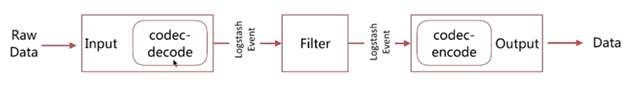
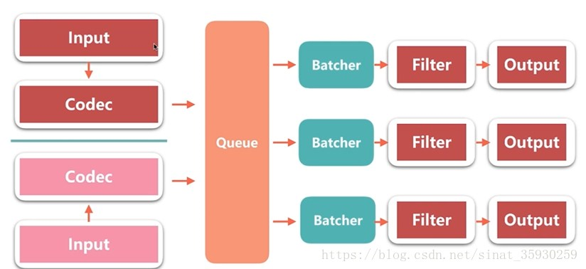
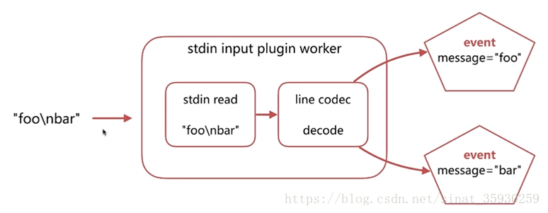
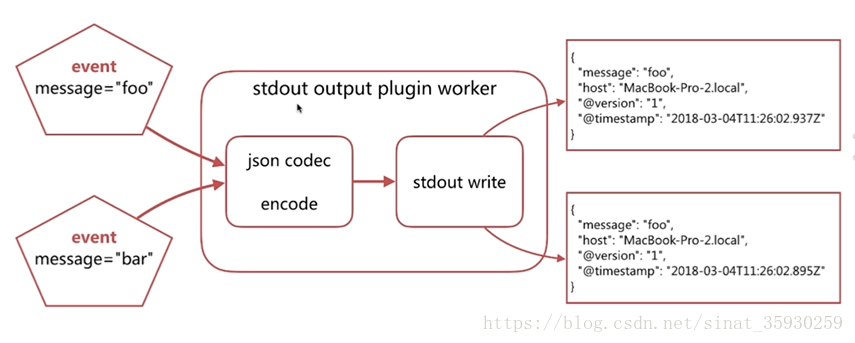

# Logstash的简介、安装、配置、Pipeline、插件


# 一. 简介

官方文档：https://www.elastic.co/guide/en/logstash/current/getting-started-with-logstash.html

- Logstash是一个开源数据收集引擎，具有实时管道功能。
- Logstash可以动态地将来自不同数据源的数据统一起来，并将数据标准化到你所选择的目的地
- Logstash 是一款强大的数据处理工具，它可以实现数据传输，格式处理，格式化输出，还有强大的插件功能，常用于日志处理。
- Logstash耗资源较大，运行占用CPU和内存高。另外没有消息队列缓存，存在数据丢失隐患
- Logstash使用Ruby语言编写的运行在Java虚拟机上的具有收集、分析和转发数据流功能的工具
- Logstash使用Pipeline方式进行日志的搜集，处理和输出

**Event**：logstash将数据流中的每一条数据在input处被转换为`event`，在output处`event`再被转换为目标格式的数据

- **Inputs**：用于从数据源获取Event。每个Input启动一个线程，从对应数据源获取数据，将数据写入一个队列
- **Filters**：用于过滤、修改Event
- **Outputs**：负责输出Event到其他系统中

Logstash使用Pipeline流水线的形式来处理数据Event事件，大致流程如下


**其中inputs和outputs支持codecs（coder&decoder）在1.3.0 版之前，logstash 只支持纯文本形式输入，然后用filter处理它。但现在，我们可以在输入期间处理不同类型的数据。所以现在的数据处理流程**






箭头代表数据流向。可以有多个input。中间的queue负责将数据分发到不通的pipline中，每个pipline由batcher，filter和output构成。batcher的作用是批量从queue中取数据（可配置）。

**logstash数据流历程**

1. 首先有一个输入数据，例如是一个web.log文件，其中每一行都是一条数据。file imput会从文件中取出数据，然后通过json codec将数据转换成logstash event。
2. 这条event会通过queue流入某一条pipline处理线程中，首先会存放在batcher中。当batcher达到处理数据的条件（如一定时间或event一定规模）后，batcher会把数据发送到filter中，filter对event数据进行处理后转到output，output就把数据输出到指定的输出位置。
3. 输出后还会返回ACK给queue，包含已经处理的event，queue会将已处理的event进行标记。





**queue分类**

- In Memory： 在内存中，固定大小，无法处理进程crash. 机器宕机等情况，会导致数据丢失。
- Persistent Queue：可处理进程crash情况，保证数据不丢失。保证数据至少消费一次；充当缓冲区，可代替kafka等消息队列作用。
- Dead Letter Queues：存放logstash因数据类型错误等原因无法处理的Event

**Persistent Queue（PQ）处理流程**

1. 一条数据经由input进入PQ，PQ将数据备份在disk，然后PQ响应input表示已收到数据；
2. 数据从PQ到达filter/output，其处理到事件后返回ACK到PQ；
3. PQ收到ACK后删除磁盘的备份数据；


# 二. 安装

## **1. 安装Java**环境

在一些Linux环境下，必须设置JAVA_HOME环境变量，否则Logstash在安装期间没有检测到JAVA_HOME环境变量，会报错并且启动不起来服务。如果JDK目录在/opt下，则  在/usr/bin/下建立软连接指向JAVA_HOME/bin路径下的java

## **2. 安装Logstash**

### YUM/RPM

```yaml
[elasticsearch-7.x]
name=Elasticsearch repository for 7.x packages
baseurl=https://artifacts.elastic.co/packages/7.x/yum
gpgcheck=1
gpgkey=https://artifacts.elastic.co/GPG-KEY-elasticsearch
enabled=1
autorefresh=1
type=rpm-md

yum install -y logstash-7.2.0
```

手动下载RPM安装，官方下载链接：https://www.elastic.co/downloads/logstash

```bash
yum localinstall -y logstash-7*.rpm
```

RPM包安装后各个配置文件的位置

| Type         | Description                                                  | Default Location              | Setting                           |
| ------------ | ------------------------------------------------------------ | ----------------------------- | --------------------------------- |
| **home**     | Home directory of the Logstash installation.                 | `/usr/share/logstash`         |                                   |
| **bin**      | Binary scripts including `logstash` to start Logstash and `logstash-plugin` to install plugins | `/usr/share/logstash/bin`     |                                   |
| **settings** | Configuration files, including `logstash.yml`, `jvm.options`, and `startup.options` | `/etc/logstash`               | `path.settings`                   |
| **conf**     | Logstash pipeline configuration files                        | `/etc/logstash/conf.d/*.conf` | `See /etc/logstash/pipelines.yml` |
| **logs**     | Log files                                                    | `/var/log/logstash`           | `path.logs`                       |
| **plugins**  | Local, non Ruby-Gem plugin files. Each plugin is contained in a subdirectory. Recommended for development only. | `/usr/share/logstash/plugins` | `path.plugins`                    |
| **data**     | Data files used by logstash and its plugins for any persistence needs. | `/var/lib/logstash`           | `path.data`                       |

### 二进制包

二进制包中各个配置文件的位置

| Type         | Description                                                  | Default Location                                             | Setting         |
| ------------ | ------------------------------------------------------------ | ------------------------------------------------------------ | --------------- |
| **home**     | Home directory of the Logstash installation.                 | `{extract.path}- Directory created by unpacking the archive` |                 |
| **bin**      | Binary scripts, including `logstash` to start Logstash and `logstash-plugin` to install plugins | `{extract.path}/bin`                                         |                 |
| **settings** | Configuration files, including `logstash.yml` and `jvm.options` | `{extract.path}/config`                                      | `path.settings` |
| **logs**     | Log files                                                    | `{extract.path}/logs`                                        | `path.logs`     |
| **plugins**  | Local, non Ruby-Gem plugin files. Each plugin is contained in a subdirectory. Recommended for development only. | `{extract.path}/plugins`                                     | `path.plugins`  |
| **data**     | Data files used by logstash and its plugins for any persistence needs. | `{extract.path}/data`                                        | `path.data`     |

## 3. 启动

`以服务形式或命令启动Logstash`

```bash
systemctl start logstash 
#后台会起一个名叫org.jruby.Main的Java后台进程，用jps -l查看
jps -l
```

`使用二进制执行文件启动`

```bash
/user/share/logstash/bin/logstash -f logstash.conf --config.reload.automatic

#-f 指定配置文件路径
#--config.reload.automatic 自动检测加载配置文件，该参数在有-e参数是不生效  
#--config.reload.interval <seconds> 设置多少秒检测一次配置文件  如果Logstash启动时没有配置自动加载配置文件，重启进程时加上。
```

## 4. 验证

```bash
/usr/share/logstash/bin/logstash -e 'input { stdin { } } output { stdout {} }'
#参数-e：直接从命令行定义配置信息
#配置从标准输入读取输入，然后输出到标准输出

stdin > hello world
stdout> 2013-11-21T01:22:14.405+0000 0.0.0.0 hello world

#Logstash会在消息上添加时间戳和IP地址
#Ctrl+D 退出Logstash
```

## 5. 命令行参数

| 参数                                         | 描述                                                         | 默认值                     |
| -------------------------------------------- | ------------------------------------------------------------ | -------------------------- |
| -r, --config.reload.automatic                | Monitor configuration changes and reload whenever it is changed.  NOTE: use SIGHUP to manually reload the config | false                      |
| -n, <br/>--node.name NAME                    | Specify the name of this logstash instance, if no value is given it will default to the current hostname. | 当前主机名                 |
| -f, <br/>--path.config CONFIG_PATH           | Load the logstash config from a specific file or directory.  If a directory is given, all files in that directory will be concatenated in lexicographical order and then parsed as a single config file. You can also specify wildcards (globs) and any matched files will be loaded in the order described above. |                            |
| -e, <br/>--config.string CONFIG_STRING       | Use the given string as the configuration data. Same syntax as the config file. If no input is pecified, then the following is  used as the default input: "input { stdin { type => stdin } }" and if no output is specified, then the following is used as the default output: "output { stdout { codec => rubydebug } }" If you wish to use both defaults, please use the empty string for the '-e' flag. | nil                        |
| --log.level LEVEL                            | Set the log level for logstash. Possible values are:  `fatal` `error` `warn` `info` `debug` `trace` (default: "info") |                            |
| -l, <br/>--path.logs PATH                    | Write logstash internal logs to the given file. Without this flag, logstash will emit  logs to standard output. | /usr/share/logstash/logs   |
| -t, <br/>--config.test_and_exit              | Check configuration for valid syntax and then exit.          | false                      |
| --config.reload.interval RELOAD_INTERVAL     | How frequently to poll the configuration location for changes, in seconds | 3000000000                 |
| --http.host HTTP_HOST                        | Web API binding host                                         | 127.0.0.1                  |
| --http.port HTTP_PORT                        | Web API http port                                            | 9600..9700                 |
| --log.format FORMAT                          | Specify if Logstash should write its own logs in JSON form (one event per line) or in plain text (using Ruby's Object#inspect) | plain                      |
| --path.settings SETTINGS_DIR                 | Directory containing logstash.yml file. This can also be set through the LS_SETTINGS_DIR environment variable | /usr/share/logstash/config |
| -p, <br/>--path.plugins PATH                 | A path of where to find plugins. This flag can be given multiple times to include multiple paths. Plugins are expected to be in a specific directory hierarchy: 'PATH/logstash/TYPE/NAME.rb' where TYPE is 'inputs' 'filters', 'outputs' or 'codecs' and NAME is the name of the plugin. | []                         |
| --path.data PATH                             | This should point to a writable directory. Logstash will use this directory whenever it needs to store data. Plugins will also have access to this path. | /usr/share/logstash/data   |
| -u, <br/>--pipeline.batch.delay DELAY_IN_MS  | When creating pipeline batches, how long to wait while polling for the next event. | 50                         |
| --pipeline.id ID                             | Sets the ID of the pipeline.                                 | main                       |
| -b, <br/>--pipeline.batch.size SIZE          | Size of batches the pipeline is to work in.                  | 125                        |
| -V, --version                                | Emit the version of logstash and its friends, then exit.     |                            |
| -M, <br/>--modules.variable MODULES_VARIABLE | Load variables for module template. Multiple instances of '-M' or '--modules.variable' are supported. Ignored if '--modules' flag is not used. Should be in the format of '-M "MODULE_NAME.var.PLUGIN_TYPE.PLUGIN_NAME.VARIABLE_NAME=VALUE"'                              as in '-M "example.var.filter.mutate.fieldname=fieldvalue"' |                            |
| --modules MODULES                            | Load Logstash modules. Modules can be defined using multiple instances                              '--modules module1 --modules module2', or comma-separated syntax                              '--modules=module1,module2' Cannot be used in conjunction with '-e' or '-f'                              Use of '--modules' will override modules declared in the 'logstash.yml' file. |                            |
| --setup                                      | Load index template into Elasticsearch, and saved searches, index-pattern, visualizations, and dashboards into Kibana when running modules. | false                      |
| -w, <br/>--pipeline.workers COUNT            | Sets the number of pipeline workers to run.                  | 20                         |
| --config.debug                               | Print the compiled config ruby code out as a debug log (you must also have --log.level=debug enabled). WARNING: This will include any 'password' options passed to plugin configs as plaintext, and may result in plaintext passwords appearing in your logs! | false                      |
| --pipeline.unsafe_shutdown                   | Force logstash to exit during shutdown even if there are still inflight events in memory. By default, logstash will refuse to quit until all received events have been pushed to the outputs. | false                      |
| --java-execution                             | Use Java execution engine.                                   | true                       |
| -i, --interactive SHELL                      | Drop to shell instead of running as normal. Valid shells are "irb" and "pry" |                            |
| --verbose                                    | Set the log level to info.                                   |                            |


# 三. Docker镜像

```bash
docker pull docker.elastic.co/logstash/logstash:7.4.0

docker pull logstash:7.4.0
```

**镜像中各个配置文件的位置**

| Type         | Description                                                  | Default Location               | Setting         |
| ------------ | ------------------------------------------------------------ | ------------------------------ | --------------- |
| **home**     | Home directory of the Logstash installation.                 | `/usr/share/logstash`          |                 |
| **bin**      | Binary scripts, including `logstash` to start Logstash and `logstash-plugin` to install plugins | `/usr/share/logstash/bin`      |                 |
| **settings** | Configuration files, including `logstash.yml` and `jvm.options` | `/usr/share/logstash/config`   | `path.settings` |
| **conf**     | Logstash pipeline configuration files                        | `/usr/share/logstash/pipeline` | `path.config`   |
| **plugins**  | Local, non Ruby-Gem plugin files. Each plugin is contained in a subdirectory. Recommended for development only. | `/usr/share/logstash/plugins`  | `path.plugins`  |
| **data**     | Data files used by logstash and its plugins for any persistence needs. | `/usr/share/logstash/data`     | `path.data`     |

Note：基于该镜像启动的容器，日志是直接输出到控制台的，无法直接输出到日志文件中

- docker镜像是基于.tar.gz格式的二进制包创建的

- 将pipeline文件挂载到/usr/share/logstash/pipeline/下启动

  ```bash
  docker run --rm -it \
  -v ./test.conf:/usr/share/logstash/pipeline/test.conf \
  docker.elastic.co/logstash/logstash:7.4.0
  ```

- 默认pipeline文件：/usr/share/logstash/pipeline/logstash.conf

  ```json
  input {
    beats {
      port => 5044
    }
  }
  output {
    stdout {
      codec => rubydebug
    }
  }
  ```

  也就是说如果不配置挂载pipeline文件就直接启动容器，logstash将启动一个最小化的pipeline：Beat Input ---> Stdout Output

- 可通过设置环境变量的形式配置logstash。

  `docker run --rm -it -e PIPELINE_WORKERS:2 docker.elastic.co/logstash/logstash:7.4.0 `。例如以下环境变量对应的logstash配置

| **Environment Variable**   | **Logstash Setting**       |
| -------------------------- | -------------------------- |
| `PIPELINE_WORKERS`         | `pipeline.workers`         |
| `LOG_LEVEL`                | `log.level`                |
| `XPACK_MONITORING_ENABLED` | `xpack.monitoring.enabled` |

- logstash docker 镜像中的默认配置

| `http.host`                            | `0.0.0.0`                   |
| -------------------------------------- | --------------------------- |
| `xpack.monitoring.elasticsearch.hosts` | `http://elasticsearch:9200` |

# 四. 配置

**Logstash配置文件中配置项的格式是基于YAML语法，例如：**

```yaml
pipeline:
  batch:
    size: 125
    delay: 50
```

**也可以使用平级格式**

```yaml
pipeline.batch.size: 125
pipeline.batch.delay: 50
```

配置项的值可以引用系统级别的环境变量

```yaml
pipeline.batch.size: ${BATCH_SIZE}
pipeline.batch.delay: ${BATCH_DELAY:50}
node.name: "node_${LS_NODE_NAME}"
path.queue: "/tmp/${QUEUE_DIR:queue}"
```

**如果设置多个自定义的配置项时，推荐使用以下格式**

```yaml
modules:
  - name: MODULE_NAME1
    var.PLUGIN_TYPE1.PLUGIN_NAME1.KEY1: VALUE
    var.PLUGIN_TYPE1.PLUGIN_NAME1.KEY2: VALUE
    var.PLUGIN_TYPE2.PLUGIN_NAME2.KEY1: VALUE
    var.PLUGIN_TYPE3.PLUGIN_NAME3.KEY1: VALUE
  - name: MODULE_NAME2
    var.PLUGIN_TYPE1.PLUGIN_NAME1.KEY1: VALUE
    var.PLUGIN_TYPE1.PLUGIN_NAME1.KEY2: VALUE
```

## 常见的logstash配置

| Setting                        | Description                                                  | Default value                                                |
| ------------------------------ | ------------------------------------------------------------ | ------------------------------------------------------------ |
| `node.name`                    | A descriptive name for the node.                             | Machine’s hostname                                           |
| `path.data`                    | The directory that Logstash and its plugins use for any persistent needs. | `LOGSTASH_HOME/data`                                         |
| `pipeline.id`                  | The ID of the pipeline.                                      | `main`                                                       |
| `pipeline.java_execution`      | Use the Java execution engine.                               | true                                                         |
| `pipeline.workers`             | The number of workers that will, in parallel, execute the filter and output stages of the pipeline. If you find that events are backing up, or that the CPU is not saturated, consider increasing this number to better utilize machine processing power. | Number of the host’s CPU cores                               |
| `pipeline.batch.size`          | The maximum number of events an individual worker thread will collect from inputs before attempting to execute its filters and outputs. Larger batch sizes are generally more efficient, but come at the cost of increased memory overhead. You may need to increase JVM heap space in the `jvm.options` config file. See [Logstash Configuration Files](https://www.elastic.co/guide/en/logstash/7.4/config-setting-files.html) for more info. | `125`                                                        |
| `pipeline.batch.delay`         | When creating pipeline event batches, how long in milliseconds to wait for each event before dispatching an undersized batch to pipeline workers. | `50`                                                         |
| `pipeline.unsafe_shutdown`     | When set to `true`, forces Logstash to exit during shutdown even if there are still inflight events in memory. By default, Logstash will refuse to quit until all received events have been pushed to the outputs. Enabling this option can lead to data loss during shutdown. | `false`                                                      |
| `pipeline.plugin_classloaders` | (Beta) Load Java plugins in independent classloaders to isolate their dependencies. | `false`                                                      |
| `path.config`                  | The path to the Logstash config for the main pipeline. If you specify a directory or wildcard, config files are read from the directory in alphabetical order. | Platform-specific. See [Logstash Directory Layout](https://www.elastic.co/guide/en/logstash/7.4/dir-layout.html). |
| `config.string`                | A string that contains the pipeline configuration to use for the main pipeline. Use the same syntax as the config file. | None                                                         |
| `config.test_and_exit`         | When set to `true`, checks that the configuration is valid and then exits. Note that grok patterns are not checked for correctness with this setting. Logstash can read multiple config files from a directory. If you combine this setting with `log.level: debug`, Logstash will log the combined config file, annotating each config block with the source file it came from. | `false`                                                      |
| `config.reload.automatic`      | When set to `true`, periodically checks if the configuration has changed and reloads the configuration whenever it is changed. This can also be triggered manually through the SIGHUP signal. | `false`                                                      |
| `config.reload.interval`       | How often in seconds Logstash checks the config files for changes. | `3s`                                                         |
| `config.debug`                 | When set to `true`, shows the fully compiled configuration as a debug log message. You must also set `log.level: debug`. WARNING: The log message will include any *password* options passed to plugin configs as plaintext, and may result in plaintext passwords appearing in your logs! | `false`                                                      |
| `config.support_escapes`       | When set to `true`, quoted strings will process the following escape sequences: `\n` becomes a literal newline (ASCII 10). `\r` becomes a literal carriage return (ASCII 13). `\t` becomes a literal tab (ASCII 9). `\\` becomes a literal backslash `\`. `\"` becomes a literal double quotation mark. `\'` becomes a literal quotation mark. | `false`                                                      |
| `modules`                      | When configured, `modules` must be in the nested YAML structure described above this table. | None                                                         |
| `queue.type`                   | The internal queuing model to use for event buffering. Specify `memory` for legacy in-memory based queuing, or `persisted` for disk-based ACKed queueing ([persistent queues](https://www.elastic.co/guide/en/logstash/7.4/persistent-queues.html)). | `memory`                                                     |
| `path.queue`                   | The directory path where the data files will be stored when persistent queues are enabled (`queue.type: persisted`). | `path.data/queue`                                            |
| `queue.page_capacity`          | The size of the page data files used when persistent queues are enabled (`queue.type: persisted`). The queue data consists of append-only data files separated into pages. | 64mb                                                         |
| `queue.max_events`             | The maximum number of unread events in the queue when persistent queues are enabled (`queue.type: persisted`). | 0 (unlimited)                                                |
| `queue.max_bytes`              | The total capacity of the queue in number of bytes. Make sure the capacity of your disk drive is greater than the value you specify here. If both `queue.max_events` and `queue.max_bytes` are specified, Logstash uses whichever criteria is reached first. | 1024mb (1g)                                                  |
| `queue.checkpoint.acks`        | The maximum number of ACKed events before forcing a checkpoint when persistent queues are enabled (`queue.type: persisted`). Specify `queue.checkpoint.acks: 0` to set this value to unlimited. | 1024                                                         |
| `queue.checkpoint.writes`      | The maximum number of written events before forcing a checkpoint when persistent queues are enabled (`queue.type: persisted`). Specify `queue.checkpoint.writes: 0` to set this value to unlimited. | 1024                                                         |
| `queue.checkpoint.retry`       | When enabled, Logstash will retry once per attempted checkpoint write for any checkpoint writes that fail. Any subsequent errors are not retried. This is a workaround for failed checkpoint writes that have been seen only on filesystems with non-standard behavior such as SANs and is not recommended except in those specific circumstances. | `false`                                                      |
| `queue.drain`                  | When enabled, Logstash waits until the persistent queue is drained before shutting down. | `false`                                                      |
| `dead_letter_queue.enable`     | Flag to instruct Logstash to enable the DLQ feature supported by plugins. | `false`                                                      |
| `dead_letter_queue.max_bytes`  | The maximum size of each dead letter queue. Entries will be dropped if they would increase the size of the dead letter queue beyond this setting. | `1024mb`                                                     |
| `path.dead_letter_queue`       | The directory path where the data files will be stored for the dead-letter queue. | `path.data/dead_letter_queue`                                |
| `http.host`                    | The bind address for the metrics REST endpoint.              | `"127.0.0.1"`                                                |
| `http.port`                    | The bind port for the metrics REST endpoint.                 | `9600`                                                       |
| `log.level`                    | 设置Logstash日志输出级别 可用值：`fatal error warn info debug trace` | `info`                                                       |
| `log.format`                   | The log format. Set to `json` to log in JSON format, or `plain` to use `Object#.inspect`. | `plain`                                                      |
| `path.logs`                    | The directory where Logstash will write its log to.          | `LOGSTASH_HOME/logs`                                         |
| `path.plugins`                 | Where to find custom plugins. You can specify this setting multiple times to include multiple paths. Plugins are expected to be in a specific directory hierarchy: `PATH/logstash/TYPE/NAME.rb` where `TYPE` is `inputs`, `filters`, `outputs`, or `codecs`, and `NAME` is the name of the plugin. | Platform-specific. See [Logstash Directory Layout](https://www.elastic.co/guide/en/logstash/7.4/dir-layout.html). |

# 五. Pipeline

## 1. 配置项结构

Logstash Pipeline文件的配置项分为三个部分：

```json
input{
  input插件{
      插件配置项
  }
}
filter{
  filter插件{
      插件配置项
  }
}
output{
  output插件{
      插件配置项
  }
}

```

**`Note:`**

1. 如果在filter中添加了多种处理规则，则按照它的顺序一一处理，但是有一些插件并不是线程安全的。

2. 如果在filter中指定了两个一样的的插件，这两个任务并不能保证准确的按顺序执行，因此官方也推荐避免在filter中重复使用插件。

## 2. 插件的条件控制

官方文档：https://www.elastic.co/guide/en/logstash/6.7/event-dependent-configuration.html#conditionals

有时需要在特定条件下过滤或输出事件。为此，您可以使用条件（conditional）来决定filter和output处理特定的事件。比如在elk系统中想要添加一个type类型的关键字来根据不同的条件赋值，最后好做统计。条件语支持if，else if和else语句并且可以嵌套。

### 条件语法

```json
if EXPRESSION {
  ...
} else if EXPRESSION {
  ...
} else {
  ...
}
```

### 操作符

- **比较操作**：
  - 相等: `==`, `!=`, `<`, `>`, `<=`, `>=`
  - 正则: ``=~`(匹配正则), `!~`(不匹配正则)
  - 包含:`in`(包含), `not in`(不包含)

- **布尔操作**：
  - `and`(与), `or`(或), `nand`(非与), `xor`(非或)

- **一元运算符**：
  - `!`(取反)
  - `()`(复合表达式), `!()`(对复合表达式结果取反)

### 示例

```json

filter {
  if [foo] in [foobar] {
    mutate { add_tag => "field in field" }
  }
  if [foo] in "foo" {
    mutate { add_tag => "field in string" }
  }
  if "hello" in [greeting] {
    mutate { add_tag => "string in field" }
  }
  if [foo] in ["hello", "world", "foo"] {
    mutate { add_tag => "field in list" }
  }
  if [missing] in [alsomissing] {
    mutate { add_tag => "shouldnotexist" }
  }
  if !("foo" in ["hello", "world"]) {
    mutate { add_tag => "shouldexist" }
  }
  if [message] =~ /\w+\s+\/\w+(\/learner\/course\/)/ {
    mutate {
      add_field => { "learner_type" => "course" }
    }
  }

  mutate { add_field => { "show" => "This data will be in the output" } }
  mutate { add_field => { "[@metadata][test]" => "Hello" } }
  mutate { add_field => { "[@metadata][no_show]" => "This data will not be in the output" } }
}

output {
  if "_grokparsefailure" not in [tags] {
    elasticsearch { ... }
  }
  if [@metadata][test] == "Hello" {
    stdout { codec => rubydebug }
  }
  if [loglevel] == "ERROR" and [deployment] == "production" {
    pagerduty {
    ...
    }
  }
}
```

**注意：**

如果`if[foo] in "String"`在执行这样的语句时无法把该字段值转化成String类型。所以最好要加field if exist判断

```bash
if ["foo"] {
  mutate {
    add_field => "bar" => "%{foo}"
  }
}
```

## 3. 引用event中的字段

- **直接引用字段，使用`[]`，嵌套字段使用多层`[][]`即可**

  ```json
  {
      "a": "1",
      "b": "2",
      "c": {
          "c1": "3"
      }
  }
  ----------Pipeline中引用Event中的字段--------------
  if [b] =~ "2" {
      ..........
  }
  if [c][c1] == "3" {
      ...........
  }
  ```

- **在字符串中以sprintf方式引用,使用`%{}`**

  ```json
  {
      "a": "1",
      "b": "2",
      "c": {
          "c1": "3"
      }
  }
  ----------Pipeline中引用Event中的字段--------------
  add_field => {
    "test" => "test: %{b}"
  }
  add_field => {
    "test" => "test: %{[c][c1]}"
  }
  ```


# 六. Input插件

## 插件一览表

| Plugin                                                       | Description                                                  | Github repository                                            |
| ------------------------------------------------------------ | ------------------------------------------------------------ | ------------------------------------------------------------ |
| [azure_event_hubs](https://www.elastic.co/guide/en/logstash/7.4/plugins-inputs-azure_event_hubs.html) | Receives events from Azure Event Hubs                        | [azure_event_hubs](https://github.com/logstash-plugins/logstash-input-azure_event_hubs) |
| [beats](https://www.elastic.co/guide/en/logstash/7.4/plugins-inputs-beats.html) | Receives events from the Elastic Beats framework             | [logstash-input-beats](https://github.com/logstash-plugins/logstash-input-beats) |
| [cloudwatch](https://www.elastic.co/guide/en/logstash/7.4/plugins-inputs-cloudwatch.html) | Pulls events from the Amazon Web Services CloudWatch API     | [logstash-input-cloudwatch](https://github.com/logstash-plugins/logstash-input-cloudwatch) |
| [couchdb_changes](https://www.elastic.co/guide/en/logstash/7.4/plugins-inputs-couchdb_changes.html) | Streams events from CouchDB’s `_changes` URI                 | [logstash-input-couchdb_changes](https://github.com/logstash-plugins/logstash-input-couchdb_changes) |
| [dead_letter_queue](https://www.elastic.co/guide/en/logstash/7.4/plugins-inputs-dead_letter_queue.html) | read events from Logstash’s dead letter queue                | [logstash-input-dead_letter_queue](https://github.com/logstash-plugins/logstash-input-dead_letter_queue) |
| [elasticsearch](https://www.elastic.co/guide/en/logstash/7.4/plugins-inputs-elasticsearch.html) | Reads query results from an Elasticsearch cluster            | [logstash-input-elasticsearch](https://github.com/logstash-plugins/logstash-input-elasticsearch) |
| [exec](https://www.elastic.co/guide/en/logstash/7.4/plugins-inputs-exec.html) | Captures the output of a shell command as an event           | [logstash-input-exec](https://github.com/logstash-plugins/logstash-input-exec) |
| [file](https://www.elastic.co/guide/en/logstash/7.4/plugins-inputs-file.html) | Streams events from files                                    | [logstash-input-file](https://github.com/logstash-plugins/logstash-input-file) |
| [ganglia](https://www.elastic.co/guide/en/logstash/7.4/plugins-inputs-ganglia.html) | Reads Ganglia packets over UDP                               | [logstash-input-ganglia](https://github.com/logstash-plugins/logstash-input-ganglia) |
| [gelf](https://www.elastic.co/guide/en/logstash/7.4/plugins-inputs-gelf.html) | Reads GELF-format messages from Graylog2 as events           | [logstash-input-gelf](https://github.com/logstash-plugins/logstash-input-gelf) |
| [generator](https://www.elastic.co/guide/en/logstash/7.4/plugins-inputs-generator.html) | Generates random log events for test purposes                | [logstash-input-generator](https://github.com/logstash-plugins/logstash-input-generator) |
| [github](https://www.elastic.co/guide/en/logstash/7.4/plugins-inputs-github.html) | Reads events from a GitHub webhook                           | [logstash-input-github](https://github.com/logstash-plugins/logstash-input-github) |
| [google_cloud_storage](https://www.elastic.co/guide/en/logstash/7.4/plugins-inputs-google_cloud_storage.html) | Extract events from files in a Google Cloud Storage bucket   | [logstash-input-google_cloud_storage](https://github.com/logstash-plugins/logstash-input-google_cloud_storage) |
| [google_pubsub](https://www.elastic.co/guide/en/logstash/7.4/plugins-inputs-google_pubsub.html) | Consume events from a Google Cloud PubSub service            | [logstash-input-google_pubsub](https://github.com/logstash-plugins/logstash-input-google_pubsub) |
| [graphite](https://www.elastic.co/guide/en/logstash/7.4/plugins-inputs-graphite.html) | Reads metrics from the `graphite` tool                       | [logstash-input-graphite](https://github.com/logstash-plugins/logstash-input-graphite) |
| [heartbeat](https://www.elastic.co/guide/en/logstash/7.4/plugins-inputs-heartbeat.html) | Generates heartbeat events for testing                       | [logstash-input-heartbeat](https://github.com/logstash-plugins/logstash-input-heartbeat) |
| [http](https://www.elastic.co/guide/en/logstash/7.4/plugins-inputs-http.html) | Receives events over HTTP or HTTPS                           | [logstash-input-http](https://github.com/logstash-plugins/logstash-input-http) |
| [http_poller](https://www.elastic.co/guide/en/logstash/7.4/plugins-inputs-http_poller.html) | Decodes the output of an HTTP API into events                | [logstash-input-http_poller](https://github.com/logstash-plugins/logstash-input-http_poller) |
| [imap](https://www.elastic.co/guide/en/logstash/7.4/plugins-inputs-imap.html) | Reads mail from an IMAP server                               | [logstash-input-imap](https://github.com/logstash-plugins/logstash-input-imap) |
| [irc](https://www.elastic.co/guide/en/logstash/7.4/plugins-inputs-irc.html) | Reads events from an IRC server                              | [logstash-input-irc](https://github.com/logstash-plugins/logstash-input-irc) |
| [java_generator](https://www.elastic.co/guide/en/logstash/7.4/plugins-inputs-java_generator.html) | Generates synthetic log events                               | [core plugin](https://github.com/elastic/logstash/blob/7.4/logstash-core/src/main/java/org/logstash/plugins/inputs/Generator.java) |
| [java_stdin](https://www.elastic.co/guide/en/logstash/7.4/plugins-inputs-java_stdin.html) | Reads events from standard input                             | [core plugin](https://github.com/elastic/logstash/blob/7.4/logstash-core/src/main/java/org/logstash/plugins/inputs/Stdin.java) |
| [jdbc](https://www.elastic.co/guide/en/logstash/7.4/plugins-inputs-jdbc.html) | Creates events from JDBC data                                | [logstash-input-jdbc](https://github.com/logstash-plugins/logstash-input-jdbc) |
| [jms](https://www.elastic.co/guide/en/logstash/7.4/plugins-inputs-jms.html) | Reads events from a Jms Broker                               | [logstash-input-jms](https://github.com/logstash-plugins/logstash-input-jms) |
| [jmx](https://www.elastic.co/guide/en/logstash/7.4/plugins-inputs-jmx.html) | Retrieves metrics from remote Java applications over JMX     | [logstash-input-jmx](https://github.com/logstash-plugins/logstash-input-jmx) |
| [kafka](https://www.elastic.co/guide/en/logstash/7.4/plugins-inputs-kafka.html) | Reads events from a Kafka topic                              | [logstash-input-kafka](https://github.com/logstash-plugins/logstash-input-kafka) |
| [kinesis](https://www.elastic.co/guide/en/logstash/7.4/plugins-inputs-kinesis.html) | Receives events through an AWS Kinesis stream                | [logstash-input-kinesis](https://github.com/logstash-plugins/logstash-input-kinesis) |
| [log4j](https://www.elastic.co/guide/en/logstash/7.4/plugins-inputs-log4j.html) | Reads events over a TCP socket from a Log4j `SocketAppender` object | [logstash-input-log4j](https://github.com/logstash-plugins/logstash-input-log4j) |
| [lumberjack](https://www.elastic.co/guide/en/logstash/7.4/plugins-inputs-lumberjack.html) | Receives events using the Lumberjack protocl                 | [logstash-input-lumberjack](https://github.com/logstash-plugins/logstash-input-lumberjack) |
| [meetup](https://www.elastic.co/guide/en/logstash/7.4/plugins-inputs-meetup.html) | Captures the output of command line tools as an event        | [logstash-input-meetup](https://github.com/logstash-plugins/logstash-input-meetup) |
| [pipe](https://www.elastic.co/guide/en/logstash/7.4/plugins-inputs-pipe.html) | Streams events from a long-running command pipe              | [logstash-input-pipe](https://github.com/logstash-plugins/logstash-input-pipe) |
| [puppet_facter](https://www.elastic.co/guide/en/logstash/7.4/plugins-inputs-puppet_facter.html) | Receives facts from a Puppet server                          | [logstash-input-puppet_facter](https://github.com/logstash-plugins/logstash-input-puppet_facter) |
| [rabbitmq](https://www.elastic.co/guide/en/logstash/7.4/plugins-inputs-rabbitmq.html) | Pulls events from a RabbitMQ exchange                        | [logstash-input-rabbitmq](https://github.com/logstash-plugins/logstash-input-rabbitmq) |
| [redis](https://www.elastic.co/guide/en/logstash/7.4/plugins-inputs-redis.html) | Reads events from a Redis instance                           | [logstash-input-redis](https://github.com/logstash-plugins/logstash-input-redis) |
| [relp](https://www.elastic.co/guide/en/logstash/7.4/plugins-inputs-relp.html) | Receives RELP events over a TCP socket                       | [logstash-input-relp](https://github.com/logstash-plugins/logstash-input-relp) |
| [rss](https://www.elastic.co/guide/en/logstash/7.4/plugins-inputs-rss.html) | Captures the output of command line tools as an event        | [logstash-input-rss](https://github.com/logstash-plugins/logstash-input-rss) |
| [s3](https://www.elastic.co/guide/en/logstash/7.4/plugins-inputs-s3.html) | Streams events from files in a S3 bucket                     | [logstash-input-s3](https://github.com/logstash-plugins/logstash-input-s3) |
| [salesforce](https://www.elastic.co/guide/en/logstash/7.4/plugins-inputs-salesforce.html) | Creates events based on a Salesforce SOQL query              | [logstash-input-salesforce](https://github.com/logstash-plugins/logstash-input-salesforce) |
| [snmp](https://www.elastic.co/guide/en/logstash/7.4/plugins-inputs-snmp.html) | Polls network devices using Simple Network Management Protocol (SNMP) | [logstash-input-snmp](https://github.com/logstash-plugins/logstash-input-snmp) |
| [snmptrap](https://www.elastic.co/guide/en/logstash/7.4/plugins-inputs-snmptrap.html) | Creates events based on SNMP trap messages                   | [logstash-input-snmptrap](https://github.com/logstash-plugins/logstash-input-snmptrap) |
| [sqlite](https://www.elastic.co/guide/en/logstash/7.4/plugins-inputs-sqlite.html) | Creates events based on rows in an SQLite database           | [logstash-input-sqlite](https://github.com/logstash-plugins/logstash-input-sqlite) |
| [sqs](https://www.elastic.co/guide/en/logstash/7.4/plugins-inputs-sqs.html) | Pulls events from an Amazon Web Services Simple Queue Service queue | [logstash-input-sqs](https://github.com/logstash-plugins/logstash-input-sqs) |
| [stdin](https://www.elastic.co/guide/en/logstash/7.4/plugins-inputs-stdin.html) | Reads events from standard input                             | [logstash-input-stdin](https://github.com/logstash-plugins/logstash-input-stdin) |
| [stomp](https://www.elastic.co/guide/en/logstash/7.4/plugins-inputs-stomp.html) | Creates events received with the STOMP protocol              | [logstash-input-stomp](https://github.com/logstash-plugins/logstash-input-stomp) |
| [syslog](https://www.elastic.co/guide/en/logstash/7.4/plugins-inputs-syslog.html) | Reads syslog messages as events                              | [logstash-input-syslog](https://github.com/logstash-plugins/logstash-input-syslog) |
| [tcp](https://www.elastic.co/guide/en/logstash/7.4/plugins-inputs-tcp.html) | Reads events from a TCP socket                               | [logstash-input-tcp](https://github.com/logstash-plugins/logstash-input-tcp) |
| [twitter](https://www.elastic.co/guide/en/logstash/7.4/plugins-inputs-twitter.html) | Reads events from the Twitter Streaming API                  | [logstash-input-twitter](https://github.com/logstash-plugins/logstash-input-twitter) |
| [udp](https://www.elastic.co/guide/en/logstash/7.4/plugins-inputs-udp.html) | Reads events over UDP                                        | [logstash-input-udp](https://github.com/logstash-plugins/logstash-input-udp) |
| [unix](https://www.elastic.co/guide/en/logstash/7.4/plugins-inputs-unix.html) | Reads events over a UNIX socket                              | [logstash-input-unix](https://github.com/logstash-plugins/logstash-input-unix) |
| [varnishlog](https://www.elastic.co/guide/en/logstash/7.4/plugins-inputs-varnishlog.html) | Reads from the `varnish` cache shared memory log             | [logstash-input-varnishlog](https://github.com/logstash-plugins/logstash-input-varnishlog) |
| [websocket](https://www.elastic.co/guide/en/logstash/7.4/plugins-inputs-websocket.html) | Reads events from a websocket                                | [logstash-input-websocket](https://github.com/logstash-plugins/logstash-input-websocket) |
| [wmi](https://www.elastic.co/guide/en/logstash/7.4/plugins-inputs-wmi.html) | Creates events based on the results of a WMI query           | [logstash-input-wmi](https://github.com/logstash-plugins/logstash-input-wmi) |
| [xmpp](https://www.elastic.co/guide/en/logstash/7.4/plugins-inputs-xmpp.html) | Receives events over the XMPP/Jabber protocol                | [logstash-input-xmpp](https://github.com/logstash-plugins/logstash-input-xmpp) |

## 插件通用配置项

| **参数**        | **参数值类型** | **必须** | **默认值** | **详解**                                                     |
| --------------- | -------------- | -------- | ---------- | ------------------------------------------------------------ |
| `add_field`     | hash           | No       | {}         | 向事件添加字段。                                             |
| `codec`         | codec          | No       | plain      | 用于输入数据的编解码器，在输入数据之前，输入编解码器是一种方便的解码方法，不需要在你的Logstash管道中使用单独的过滤器 |
| `enable_metric` | boolean        | No       | true       | 禁用或启用这个特定插件实例的指标日志，默认情况下，我们记录所有我们可以记录的指标，但是你可以禁用特定插件的指标集合。 |
| `id`            | string         | No       |            | 向插件配置添加唯一的ID，如果没有指定ID，则Logstash将生成一个，强烈建议在配置中设置此ID，当你有两个或多个相同类型的插件时，这一点特别有用。例如，如果你有两个log4j输入，在本例中添加一个命名ID将有助于在使用监视API时监视Logstash。input {  kafka {    id => "my_plugin_id"  }} |
| `tags`          | array          | No       |            | 向事件添加任意数量的标记，这有助于以后的处理。               |
| `type`          | string         | No       |            | 向该输入处理的所有事件添加type字段，类型主要用于过滤器激活，该type作为事件本身的一部分存储，因此你也可以使用该类型在Kibana中搜索它。如果你试图在已经拥有一个type的事件上设置一个type（例如，当你将事件从发送者发送到索引器时），那么新的输入将不会覆盖现有的type，发送方的type集在其生命周期中始终与该事件保持一致，甚至在发送到另一个Logstash服务器时也是如此。 |

# 七. Filter插件

## 插件一览表

| Plugin                                                       | Description                                                  | Github repository                                            |
| ------------------------------------------------------------ | ------------------------------------------------------------ | ------------------------------------------------------------ |
| [aggregate](https://www.elastic.co/guide/en/logstash/current/plugins-filters-aggregate.html) | Aggregates information from several events originating with a single task | [logstash-filter-aggregate](https://github.com/logstash-plugins/logstash-filter-aggregate) |
| [alter](https://www.elastic.co/guide/en/logstash/current/plugins-filters-alter.html) | Performs general alterations to fields that the `mutate` filter does not handle | [logstash-filter-alter](https://github.com/logstash-plugins/logstash-filter-alter) |
| [bytes](https://www.elastic.co/guide/en/logstash/current/plugins-filters-bytes.html) | Parses string representations of computer storage sizes, such as "123 MB" or "5.6gb", into their numeric value in bytes | [logstash-filter-bytes](https://github.com/logstash-plugins/logstash-filter-bytes) |
| [cidr](https://www.elastic.co/guide/en/logstash/current/plugins-filters-cidr.html) | Checks IP addresses against a list of network blocks         | [logstash-filter-cidr](https://github.com/logstash-plugins/logstash-filter-cidr) |
| [cipher](https://www.elastic.co/guide/en/logstash/current/plugins-filters-cipher.html) | Applies or removes a cipher to an event                      | [logstash-filter-cipher](https://github.com/logstash-plugins/logstash-filter-cipher) |
| [clone](https://www.elastic.co/guide/en/logstash/current/plugins-filters-clone.html) | Duplicates events                                            | [logstash-filter-clone](https://github.com/logstash-plugins/logstash-filter-clone) |
| [csv](https://www.elastic.co/guide/en/logstash/current/plugins-filters-csv.html) | Parses comma-separated value data into individual fields     | [logstash-filter-csv](https://github.com/logstash-plugins/logstash-filter-csv) |
| [date](https://www.elastic.co/guide/en/logstash/current/plugins-filters-date.html) | Parses dates from fields to use as the Logstash timestamp for an event | [logstash-filter-date](https://github.com/logstash-plugins/logstash-filter-date) |
| [de_dot](https://www.elastic.co/guide/en/logstash/current/plugins-filters-de_dot.html) | Computationally expensive filter that removes dots from a field name | [logstash-filter-de_dot](https://github.com/logstash-plugins/logstash-filter-de_dot) |
| [dissect](https://www.elastic.co/guide/en/logstash/current/plugins-filters-dissect.html) | Extracts unstructured event data into fields using delimiters | [logstash-filter-dissect](https://github.com/logstash-plugins/logstash-filter-dissect) |
| [dns](https://www.elastic.co/guide/en/logstash/current/plugins-filters-dns.html) | Performs a standard or reverse DNS lookup                    | [logstash-filter-dns](https://github.com/logstash-plugins/logstash-filter-dns) |
| [drop](https://www.elastic.co/guide/en/logstash/current/plugins-filters-drop.html) | Drops all events                                             | [logstash-filter-drop](https://github.com/logstash-plugins/logstash-filter-drop) |
| [elapsed](https://www.elastic.co/guide/en/logstash/current/plugins-filters-elapsed.html) | Calculates the elapsed time between a pair of events         | [logstash-filter-elapsed](https://github.com/logstash-plugins/logstash-filter-elapsed) |
| [elasticsearch](https://www.elastic.co/guide/en/logstash/current/plugins-filters-elasticsearch.html) | Copies fields from previous log events in Elasticsearch to current events | [logstash-filter-elasticsearch](https://github.com/logstash-plugins/logstash-filter-elasticsearch) |
| [environment](https://www.elastic.co/guide/en/logstash/current/plugins-filters-environment.html) | Stores environment variables as metadata sub-fields          | [logstash-filter-environment](https://github.com/logstash-plugins/logstash-filter-environment) |
| [extractnumbers](https://www.elastic.co/guide/en/logstash/current/plugins-filters-extractnumbers.html) | Extracts numbers from a string                               | [logstash-filter-extractnumbers](https://github.com/logstash-plugins/logstash-filter-extractnumbers) |
| [fingerprint](https://www.elastic.co/guide/en/logstash/current/plugins-filters-fingerprint.html) | Fingerprints fields by replacing values with a consistent hash | [logstash-filter-fingerprint](https://github.com/logstash-plugins/logstash-filter-fingerprint) |
| [geoip](https://www.elastic.co/guide/en/logstash/current/plugins-filters-geoip.html) | Adds geographical information about an IP address            | [logstash-filter-geoip](https://github.com/logstash-plugins/logstash-filter-geoip) |
| [grok](https://www.elastic.co/guide/en/logstash/current/plugins-filters-grok.html) | Parses unstructured event data into fields                   | [logstash-filter-grok](https://github.com/logstash-plugins/logstash-filter-grok) |
| [http](https://www.elastic.co/guide/en/logstash/current/plugins-filters-http.html) | Provides integration with external web services/REST APIs    | [logstash-filter-http](https://github.com/logstash-plugins/logstash-filter-http) |
| [i18n](https://www.elastic.co/guide/en/logstash/current/plugins-filters-i18n.html) | Removes special characters from a field                      | [logstash-filter-i18n](https://github.com/logstash-plugins/logstash-filter-i18n) |
| [java_uuid](https://www.elastic.co/guide/en/logstash/current/plugins-filters-java_uuid.html) | Generates a UUID and adds it to each processed event         | [core plugin](https://github.com/elastic/logstash/blob/7.4/logstash-core/src/main/java/org/logstash/plugins/filters/Uuid.java) |
| [jdbc_static](https://www.elastic.co/guide/en/logstash/current/plugins-filters-jdbc_static.html) | Enriches events with data pre-loaded from a remote database  | [logstash-filter-jdbc_static](https://github.com/logstash-plugins/logstash-filter-jdbc_static) |
| [jdbc_streaming](https://www.elastic.co/guide/en/logstash/current/plugins-filters-jdbc_streaming.html) | Enrich events with your database data                        | [logstash-filter-jdbc_streaming](https://github.com/logstash-plugins/logstash-filter-jdbc_streaming) |
| [json](https://www.elastic.co/guide/en/logstash/current/plugins-filters-json.html) | Parses JSON events                                           | [logstash-filter-json](https://github.com/logstash-plugins/logstash-filter-json) |
| [json_encode](https://www.elastic.co/guide/en/logstash/current/plugins-filters-json_encode.html) | Serializes a field to JSON                                   | [logstash-filter-json_encode](https://github.com/logstash-plugins/logstash-filter-json_encode) |
| [kv](https://www.elastic.co/guide/en/logstash/current/plugins-filters-kv.html) | Parses key-value pairs                                       | [logstash-filter-kv](https://github.com/logstash-plugins/logstash-filter-kv) |
| [memcached](https://www.elastic.co/guide/en/logstash/current/plugins-filters-memcached.html) | Provides integration with external data in Memcached         | [logstash-filter-memcached](https://github.com/logstash-plugins/logstash-filter-memcached) |
| [metricize](https://www.elastic.co/guide/en/logstash/current/plugins-filters-metricize.html) | Takes complex events containing a number of metrics and splits these up into multiple events, each holding a single metric | [logstash-filter-metricize](https://github.com/logstash-plugins/logstash-filter-metricize) |
| [metrics](https://www.elastic.co/guide/en/logstash/current/plugins-filters-metrics.html) | Aggregates metrics                                           | [logstash-filter-metrics](https://github.com/logstash-plugins/logstash-filter-metrics) |
| [mutate](https://www.elastic.co/guide/en/logstash/current/plugins-filters-mutate.html) | Performs mutations on fields                                 | [logstash-filter-mutate](https://github.com/logstash-plugins/logstash-filter-mutate) |
| [prune](https://www.elastic.co/guide/en/logstash/current/plugins-filters-prune.html) | Prunes event data based on a list of fields to blacklist or whitelist | [logstash-filter-prune](https://github.com/logstash-plugins/logstash-filter-prune) |
| [range](https://www.elastic.co/guide/en/logstash/current/plugins-filters-range.html) | Checks that specified fields stay within given size or length limits | [logstash-filter-range](https://github.com/logstash-plugins/logstash-filter-range) |
| [ruby](https://www.elastic.co/guide/en/logstash/current/plugins-filters-ruby.html) | Executes arbitrary Ruby code                                 | [logstash-filter-ruby](https://github.com/logstash-plugins/logstash-filter-ruby) |
| [sleep](https://www.elastic.co/guide/en/logstash/current/plugins-filters-sleep.html) | Sleeps for a specified time span                             | [logstash-filter-sleep](https://github.com/logstash-plugins/logstash-filter-sleep) |
| [split](https://www.elastic.co/guide/en/logstash/current/plugins-filters-split.html) | Splits multi-line messages into distinct events              | [logstash-filter-split](https://github.com/logstash-plugins/logstash-filter-split) |
| [syslog_pri](https://www.elastic.co/guide/en/logstash/current/plugins-filters-syslog_pri.html) | Parses the `PRI` (priority) field of a `syslog` message      | [logstash-filter-syslog_pri](https://github.com/logstash-plugins/logstash-filter-syslog_pri) |
| [threats_classifier](https://www.elastic.co/guide/en/logstash/current/plugins-filters-threats_classifier.html) | Enriches security logs with information about the attacker’s intent | [logstash-filter-threats_classifier](https://github.com/empow/logstash-filter-threats_classifier) |
| [throttle](https://www.elastic.co/guide/en/logstash/current/plugins-filters-throttle.html) | Throttles the number of events                               | [logstash-filter-throttle](https://github.com/logstash-plugins/logstash-filter-throttle) |
| [tld](https://www.elastic.co/guide/en/logstash/current/plugins-filters-tld.html) | Replaces the contents of the default message field with whatever you specify in the configuration | [logstash-filter-tld](https://github.com/logstash-plugins/logstash-filter-tld) |
| [translate](https://www.elastic.co/guide/en/logstash/current/plugins-filters-translate.html) | Replaces field contents based on a hash or YAML file         | [logstash-filter-translate](https://github.com/logstash-plugins/logstash-filter-translate) |
| [truncate](https://www.elastic.co/guide/en/logstash/current/plugins-filters-truncate.html) | Truncates fields longer than a given length                  | [logstash-filter-truncate](https://github.com/logstash-plugins/logstash-filter-truncate) |
| [urldecode](https://www.elastic.co/guide/en/logstash/current/plugins-filters-urldecode.html) | Decodes URL-encoded fields                                   | [logstash-filter-urldecode](https://github.com/logstash-plugins/logstash-filter-urldecode) |
| [useragent](https://www.elastic.co/guide/en/logstash/current/plugins-filters-useragent.html) | Parses user agent strings into fields                        | [logstash-filter-useragent](https://github.com/logstash-plugins/logstash-filter-useragent) |
| [uuid](https://www.elastic.co/guide/en/logstash/current/plugins-filters-uuid.html) | Adds a UUID to events                                        | [logstash-filter-uuid](https://github.com/logstash-plugins/logstash-filter-uuid) |
| [xml](https://www.elastic.co/guide/en/logstash/current/plugins-filters-xml.html) | Parses XML into fields                                       | [logstash-filter-xml](https://github.com/logstash-plugins/logstash-filter-xml) |

## 插件通用配置项

| Setting                                                      | Input type                                                   | Required |
| ------------------------------------------------------------ | ------------------------------------------------------------ | -------- |
| [`add_field`](https://www.elastic.co/guide/en/logstash/current/plugins-filters-mutate.html#plugins-filters-mutate-add_field) | [hash](http://www.elastic.co/guide/en/logstash/7.4/configuration-file-structure.html#hash) | No       |
| [`add_tag`](https://www.elastic.co/guide/en/logstash/current/plugins-filters-mutate.html#plugins-filters-mutate-add_tag) | [array](http://www.elastic.co/guide/en/logstash/7.4/configuration-file-structure.html#array) | No       |
| [`enable_metric`](https://www.elastic.co/guide/en/logstash/current/plugins-filters-mutate.html#plugins-filters-mutate-enable_metric) | [boolean](http://www.elastic.co/guide/en/logstash/7.4/configuration-file-structure.html#boolean) | No       |
| [`id`](https://www.elastic.co/guide/en/logstash/current/plugins-filters-mutate.html#plugins-filters-mutate-id) | [string](http://www.elastic.co/guide/en/logstash/7.4/configuration-file-structure.html#string) | No       |
| [`periodic_flush`](https://www.elastic.co/guide/en/logstash/current/plugins-filters-mutate.html#plugins-filters-mutate-periodic_flush) | [boolean](http://www.elastic.co/guide/en/logstash/7.4/configuration-file-structure.html#boolean) | No       |
| [`remove_field`](https://www.elastic.co/guide/en/logstash/current/plugins-filters-mutate.html#plugins-filters-mutate-remove_field) | [array](http://www.elastic.co/guide/en/logstash/7.4/configuration-file-structure.html#array) | No       |
| [`remove_tag`](https://www.elastic.co/guide/en/logstash/current/plugins-filters-mutate.html#plugins-filters-mutate-remove_tag) | [array](http://www.elastic.co/guide/en/logstash/7.4/configuration-file-structure.html#array) | No       |

# 八. Output插件

## 插件一览表

| Plugin                                                       | Description                                                  | Github repository                                            |
| ------------------------------------------------------------ | ------------------------------------------------------------ | ------------------------------------------------------------ |
| [boundary](https://www.elastic.co/guide/en/logstash/7.4/plugins-outputs-boundary.html) | Sends annotations to Boundary based on Logstash events       | [logstash-output-boundary](https://github.com/logstash-plugins/logstash-output-boundary) |
| [circonus](https://www.elastic.co/guide/en/logstash/7.4/plugins-outputs-circonus.html) | Sends annotations to Circonus based on Logstash events       | [logstash-output-circonus](https://github.com/logstash-plugins/logstash-output-circonus) |
| [cloudwatch](https://www.elastic.co/guide/en/logstash/7.4/plugins-outputs-cloudwatch.html) | Aggregates and sends metric data to AWS CloudWatch           | [logstash-output-cloudwatch](https://github.com/logstash-plugins/logstash-output-cloudwatch) |
| [csv](https://www.elastic.co/guide/en/logstash/7.4/plugins-outputs-csv.html) | Writes events to disk in a delimited format                  | [logstash-output-csv](https://github.com/logstash-plugins/logstash-output-csv) |
| [datadog](https://www.elastic.co/guide/en/logstash/7.4/plugins-outputs-datadog.html) | Sends events to DataDogHQ based on Logstash events           | [logstash-output-datadog](https://github.com/logstash-plugins/logstash-output-datadog) |
| [datadog_metrics](https://www.elastic.co/guide/en/logstash/7.4/plugins-outputs-datadog_metrics.html) | Sends metrics to DataDogHQ based on Logstash events          | [logstash-output-datadog_metrics](https://github.com/logstash-plugins/logstash-output-datadog_metrics) |
| [elastic_app_search](https://www.elastic.co/guide/en/logstash/7.4/plugins-outputs-elastic_app_search.html) | Sends events to the Elastic App Search solution              | [logstash-output-elastic_app_search](https://github.com/logstash-plugins/logstash-output-elastic_app_search) |
| [elasticsearch](https://www.elastic.co/guide/en/logstash/7.4/plugins-outputs-elasticsearch.html) | Stores logs in Elasticsearch                                 | [logstash-output-elasticsearch](https://github.com/logstash-plugins/logstash-output-elasticsearch) |
| [email](https://www.elastic.co/guide/en/logstash/7.4/plugins-outputs-email.html) | Sends email to a specified address when output is received   | [logstash-output-email](https://github.com/logstash-plugins/logstash-output-email) |
| [exec](https://www.elastic.co/guide/en/logstash/7.4/plugins-outputs-exec.html) | Runs a command for a matching event                          | [logstash-output-exec](https://github.com/logstash-plugins/logstash-output-exec) |
| [file](https://www.elastic.co/guide/en/logstash/7.4/plugins-outputs-file.html) | Writes events to files on disk                               | [logstash-output-file](https://github.com/logstash-plugins/logstash-output-file) |
| [ganglia](https://www.elastic.co/guide/en/logstash/7.4/plugins-outputs-ganglia.html) | Writes metrics to Ganglia’s `gmond`                          | [logstash-output-ganglia](https://github.com/logstash-plugins/logstash-output-ganglia) |
| [gelf](https://www.elastic.co/guide/en/logstash/7.4/plugins-outputs-gelf.html) | Generates GELF formatted output for Graylog2                 | [logstash-output-gelf](https://github.com/logstash-plugins/logstash-output-gelf) |
| [google_bigquery](https://www.elastic.co/guide/en/logstash/7.4/plugins-outputs-google_bigquery.html) | Writes events to Google BigQuery                             | [logstash-output-google_bigquery](https://github.com/logstash-plugins/logstash-output-google_bigquery) |
| [google_cloud_storage](https://www.elastic.co/guide/en/logstash/7.4/plugins-outputs-google_cloud_storage.html) | Uploads log events to Google Cloud Storage                   | [logstash-output-google_cloud_storage](https://github.com/logstash-plugins/logstash-output-google_cloud_storage) |
| [google_pubsub](https://www.elastic.co/guide/en/logstash/7.4/plugins-outputs-google_pubsub.html) | Uploads log events to Google Cloud Pubsub                    | [logstash-output-google_pubsub](https://github.com/logstash-plugins/logstash-output-google_pubsub) |
| [graphite](https://www.elastic.co/guide/en/logstash/7.4/plugins-outputs-graphite.html) | Writes metrics to Graphite                                   | [logstash-output-graphite](https://github.com/logstash-plugins/logstash-output-graphite) |
| [graphtastic](https://www.elastic.co/guide/en/logstash/7.4/plugins-outputs-graphtastic.html) | Sends metric data on Windows                                 | [logstash-output-graphtastic](https://github.com/logstash-plugins/logstash-output-graphtastic) |
| [http](https://www.elastic.co/guide/en/logstash/7.4/plugins-outputs-http.html) | Sends events to a generic HTTP or HTTPS endpoint             | [logstash-output-http](https://github.com/logstash-plugins/logstash-output-http) |
| [influxdb](https://www.elastic.co/guide/en/logstash/7.4/plugins-outputs-influxdb.html) | Writes metrics to InfluxDB                                   | [logstash-output-influxdb](https://github.com/logstash-plugins/logstash-output-influxdb) |
| [irc](https://www.elastic.co/guide/en/logstash/7.4/plugins-outputs-irc.html) | Writes events to IRC                                         | [logstash-output-irc](https://github.com/logstash-plugins/logstash-output-irc) |
| [java_sink](https://www.elastic.co/guide/en/logstash/7.4/plugins-outputs-java_sink.html) | Discards any events received                                 | [core plugin](https://github.com/elastic/logstash/blob/7.4/logstash-core/src/main/java/org/logstash/plugins/outputs/Sink.java) |
| [java_stdout](https://www.elastic.co/guide/en/logstash/7.4/plugins-outputs-java_stdout.html) | Prints events to the STDOUT of the shell                     | [core plugin](https://github.com/elastic/logstash/blob/7.4/logstash-core/src/main/java/org/logstash/plugins/outputs/Stdout.java) |
| [juggernaut](https://www.elastic.co/guide/en/logstash/7.4/plugins-outputs-juggernaut.html) | Pushes messages to the Juggernaut websockets server          | [logstash-output-juggernaut](https://github.com/logstash-plugins/logstash-output-juggernaut) |
| [kafka](https://www.elastic.co/guide/en/logstash/7.4/plugins-outputs-kafka.html) | Writes events to a Kafka topic                               | [logstash-output-kafka](https://github.com/logstash-plugins/logstash-output-kafka) |
| [librato](https://www.elastic.co/guide/en/logstash/7.4/plugins-outputs-librato.html) | Sends metrics, annotations, and alerts to Librato based on Logstash events | [logstash-output-librato](https://github.com/logstash-plugins/logstash-output-librato) |
| [loggly](https://www.elastic.co/guide/en/logstash/7.4/plugins-outputs-loggly.html) | Ships logs to Loggly                                         | [logstash-output-loggly](https://github.com/logstash-plugins/logstash-output-loggly) |
| [lumberjack](https://www.elastic.co/guide/en/logstash/7.4/plugins-outputs-lumberjack.html) | Sends events using the `lumberjack` protocol                 | [logstash-output-lumberjack](https://github.com/logstash-plugins/logstash-output-lumberjack) |
| [metriccatcher](https://www.elastic.co/guide/en/logstash/7.4/plugins-outputs-metriccatcher.html) | Writes metrics to MetricCatcher                              | [logstash-output-metriccatcher](https://github.com/logstash-plugins/logstash-output-metriccatcher) |
| [mongodb](https://www.elastic.co/guide/en/logstash/7.4/plugins-outputs-mongodb.html) | Writes events to MongoDB                                     | [logstash-output-mongodb](https://github.com/logstash-plugins/logstash-output-mongodb) |
| [nagios](https://www.elastic.co/guide/en/logstash/7.4/plugins-outputs-nagios.html) | Sends passive check results to Nagios                        | [logstash-output-nagios](https://github.com/logstash-plugins/logstash-output-nagios) |
| [nagios_nsca](https://www.elastic.co/guide/en/logstash/7.4/plugins-outputs-nagios_nsca.html) | Sends passive check results to Nagios using the NSCA protocol | [logstash-output-nagios_nsca](https://github.com/logstash-plugins/logstash-output-nagios_nsca) |
| [opentsdb](https://www.elastic.co/guide/en/logstash/7.4/plugins-outputs-opentsdb.html) | Writes metrics to OpenTSDB                                   | [logstash-output-opentsdb](https://github.com/logstash-plugins/logstash-output-opentsdb) |
| [pagerduty](https://www.elastic.co/guide/en/logstash/7.4/plugins-outputs-pagerduty.html) | Sends notifications based on preconfigured services and escalation policies | [logstash-output-pagerduty](https://github.com/logstash-plugins/logstash-output-pagerduty) |
| [pipe](https://www.elastic.co/guide/en/logstash/7.4/plugins-outputs-pipe.html) | Pipes events to another program’s standard input             | [logstash-output-pipe](https://github.com/logstash-plugins/logstash-output-pipe) |
| [rabbitmq](https://www.elastic.co/guide/en/logstash/7.4/plugins-outputs-rabbitmq.html) | Pushes events to a RabbitMQ exchange                         | [logstash-output-rabbitmq](https://github.com/logstash-plugins/logstash-output-rabbitmq) |
| [redis](https://www.elastic.co/guide/en/logstash/7.4/plugins-outputs-redis.html) | Sends events to a Redis queue using the `RPUSH` command      | [logstash-output-redis](https://github.com/logstash-plugins/logstash-output-redis) |
| [redmine](https://www.elastic.co/guide/en/logstash/7.4/plugins-outputs-redmine.html) | Creates tickets using the Redmine API                        | [logstash-output-redmine](https://github.com/logstash-plugins/logstash-output-redmine) |
| [riak](https://www.elastic.co/guide/en/logstash/7.4/plugins-outputs-riak.html) | Writes events to the Riak distributed key/value store        | [logstash-output-riak](https://github.com/logstash-plugins/logstash-output-riak) |
| [riemann](https://www.elastic.co/guide/en/logstash/7.4/plugins-outputs-riemann.html) | Sends metrics to Riemann                                     | [logstash-output-riemann](https://github.com/logstash-plugins/logstash-output-riemann) |
| [s3](https://www.elastic.co/guide/en/logstash/7.4/plugins-outputs-s3.html) | Sends Logstash events to the Amazon Simple Storage Service   | [logstash-output-s3](https://github.com/logstash-plugins/logstash-output-s3) |
| [sns](https://www.elastic.co/guide/en/logstash/7.4/plugins-outputs-sns.html) | Sends events to Amazon’s Simple Notification Service         | [logstash-output-sns](https://github.com/logstash-plugins/logstash-output-sns) |
| [solr_http](https://www.elastic.co/guide/en/logstash/7.4/plugins-outputs-solr_http.html) | Stores and indexes logs in Solr                              | [logstash-output-solr_http](https://github.com/logstash-plugins/logstash-output-solr_http) |
| [sqs](https://www.elastic.co/guide/en/logstash/7.4/plugins-outputs-sqs.html) | Pushes events to an Amazon Web Services Simple Queue Service queue | [logstash-output-sqs](https://github.com/logstash-plugins/logstash-output-sqs) |
| [statsd](https://www.elastic.co/guide/en/logstash/7.4/plugins-outputs-statsd.html) | Sends metrics using the `statsd` network daemon              | [logstash-output-statsd](https://github.com/logstash-plugins/logstash-output-statsd) |
| [stdout](https://www.elastic.co/guide/en/logstash/7.4/plugins-outputs-stdout.html) | Prints events to the standard output                         | [logstash-output-stdout](https://github.com/logstash-plugins/logstash-output-stdout) |
| [stomp](https://www.elastic.co/guide/en/logstash/7.4/plugins-outputs-stomp.html) | Writes events using the STOMP protocol                       | [logstash-output-stomp](https://github.com/logstash-plugins/logstash-output-stomp) |
| [syslog](https://www.elastic.co/guide/en/logstash/7.4/plugins-outputs-syslog.html) | Sends events to a `syslog` server                            | [logstash-output-syslog](https://github.com/logstash-plugins/logstash-output-syslog) |
| [tcp](https://www.elastic.co/guide/en/logstash/7.4/plugins-outputs-tcp.html) | Writes events over a TCP socket                              | [logstash-output-tcp](https://github.com/logstash-plugins/logstash-output-tcp) |
| [timber](https://www.elastic.co/guide/en/logstash/7.4/plugins-outputs-timber.html) | Sends events to the Timber.io logging service                | [logstash-output-timber](https://github.com/logstash-plugins/logstash-output-timber) |
| [udp](https://www.elastic.co/guide/en/logstash/7.4/plugins-outputs-udp.html) | Sends events over UDP                                        | [logstash-output-udp](https://github.com/logstash-plugins/logstash-output-udp) |
| [webhdfs](https://www.elastic.co/guide/en/logstash/7.4/plugins-outputs-webhdfs.html) | Sends Logstash events to HDFS using the `webhdfs` REST API   | [logstash-output-webhdfs](https://github.com/logstash-plugins/logstash-output-webhdfs) |
| [websocket](https://www.elastic.co/guide/en/logstash/7.4/plugins-outputs-websocket.html) | Publishes messages to a websocket                            | [logstash-output-websocket](https://github.com/logstash-plugins/logstash-output-websocket) |
| [xmpp](https://www.elastic.co/guide/en/logstash/7.4/plugins-outputs-xmpp.html) | Posts events over XMPP                                       | [logstash-output-xmpp](https://github.com/logstash-plugins/logstash-output-xmpp) |
| [zabbix](https://www.elastic.co/guide/en/logstash/7.4/plugins-outputs-zabbix.html) | Sends events to a Zabbix server                              | [logstash-output-zabbix](https://github.com/logstash-plugins/logstash-output-zabbix) |

## 插件通用配置项

| Setting                                                      | Input type                                                   | Required |
| ------------------------------------------------------------ | ------------------------------------------------------------ | -------- |
| [`codec`](https://www.elastic.co/guide/en/logstash/current/plugins-outputs-csv.html#plugins-outputs-csv-codec) | [codec](http://www.elastic.co/guide/en/logstash/7.4/configuration-file-structure.html#codec) | No       |
| [`enable_metric`](https://www.elastic.co/guide/en/logstash/current/plugins-outputs-csv.html#plugins-outputs-csv-enable_metric) | [boolean](http://www.elastic.co/guide/en/logstash/7.4/configuration-file-structure.html#boolean) | No       |
| [`id`](https://www.elastic.co/guide/en/logstash/current/plugins-outputs-csv.html#plugins-outputs-csv-id) | [string](http://www.elastic.co/guide/en/logstash/7.4/configuration-file-structure.html#string) | No       |

# 九. Codec插件

## 插件一览表

| Plugin                                                       | Description                                                  | Github repository                                            |
| ------------------------------------------------------------ | ------------------------------------------------------------ | ------------------------------------------------------------ |
| [avro](https://www.elastic.co/guide/en/logstash/current/plugins-codecs-avro.html) | Reads serialized Avro records as Logstash events             | [logstash-codec-avro](https://github.com/logstash-plugins/logstash-codec-avro) |
| [cef](https://www.elastic.co/guide/en/logstash/current/plugins-codecs-cef.html) | Reads the ArcSight Common Event Format (CEF).                | [logstash-codec-cef](https://github.com/logstash-plugins/logstash-codec-cef) |
| [cloudfront](https://www.elastic.co/guide/en/logstash/current/plugins-codecs-cloudfront.html) | Reads AWS CloudFront reports                                 | [logstash-codec-cloudfront](https://github.com/logstash-plugins/logstash-codec-cloudfront) |
| [cloudtrail](https://www.elastic.co/guide/en/logstash/current/plugins-codecs-cloudtrail.html) | Reads AWS CloudTrail log files                               | [logstash-codec-cloudtrail](https://github.com/logstash-plugins/logstash-codec-cloudtrail) |
| [collectd](https://www.elastic.co/guide/en/logstash/current/plugins-codecs-collectd.html) | Reads events from the `collectd` binary protocol using UDP.  | [logstash-codec-collectd](https://github.com/logstash-plugins/logstash-codec-collectd) |
| [dots](https://www.elastic.co/guide/en/logstash/current/plugins-codecs-dots.html) | Sends 1 dot per event to `stdout` for performance tracking   | [logstash-codec-dots](https://github.com/logstash-plugins/logstash-codec-dots) |
| [edn](https://www.elastic.co/guide/en/logstash/current/plugins-codecs-edn.html) | Reads EDN format data                                        | [logstash-codec-edn](https://github.com/logstash-plugins/logstash-codec-edn) |
| [edn_lines](https://www.elastic.co/guide/en/logstash/current/plugins-codecs-edn_lines.html) | Reads newline-delimited EDN format data                      | [logstash-codec-edn_lines](https://github.com/logstash-plugins/logstash-codec-edn_lines) |
| [es_bulk](https://www.elastic.co/guide/en/logstash/current/plugins-codecs-es_bulk.html) | Reads the Elasticsearch bulk format into separate events, along with metadata | [logstash-codec-es_bulk](https://github.com/logstash-plugins/logstash-codec-es_bulk) |
| [fluent](https://www.elastic.co/guide/en/logstash/current/plugins-codecs-fluent.html) | Reads the `fluentd` `msgpack` schema                         | [logstash-codec-fluent](https://github.com/logstash-plugins/logstash-codec-fluent) |
| [graphite](https://www.elastic.co/guide/en/logstash/current/plugins-codecs-graphite.html) | Reads `graphite` formatted lines                             | [logstash-codec-graphite](https://github.com/logstash-plugins/logstash-codec-graphite) |
| [gzip_lines](https://www.elastic.co/guide/en/logstash/current/plugins-codecs-gzip_lines.html) | Reads `gzip` encoded content                                 | [logstash-codec-gzip_lines](https://github.com/logstash-plugins/logstash-codec-gzip_lines) |
| [jdots](https://www.elastic.co/guide/en/logstash/current/plugins-codecs-jdots.html) | Renders each processed event as a dot                        | [core plugin](https://github.com/elastic/logstash/blob/7.4/logstash-core/src/main/java/org/logstash/plugins/codecs/Dots.java) |
| [java_line](https://www.elastic.co/guide/en/logstash/current/plugins-codecs-java_line.html) | Encodes and decodes line-oriented text data                  | [core plugin](https://github.com/elastic/logstash/blob/7.4/logstash-core/src/main/java/org/logstash/plugins/codecs/Line.java) |
| [java_plain](https://www.elastic.co/guide/en/logstash/current/plugins-codecs-java_plain.html) | Processes text data with no delimiters between events        | [core plugin](https://github.com/elastic/logstash/blob/7.4/logstash-core/src/main/java/org/logstash/plugins/codecs/Plain.java) |
| [json](https://www.elastic.co/guide/en/logstash/current/plugins-codecs-json.html) | Reads JSON formatted content, creating one event per element in a JSON array | [logstash-codec-json](https://github.com/logstash-plugins/logstash-codec-json) |
| [json_lines](https://www.elastic.co/guide/en/logstash/current/plugins-codecs-json_lines.html) | Reads newline-delimited JSON                                 | [logstash-codec-json_lines](https://github.com/logstash-plugins/logstash-codec-json_lines) |
| [line](https://www.elastic.co/guide/en/logstash/current/plugins-codecs-line.html) | Reads line-oriented text data                                | [logstash-codec-line](https://github.com/logstash-plugins/logstash-codec-line) |
| [msgpack](https://www.elastic.co/guide/en/logstash/current/plugins-codecs-msgpack.html) | Reads MessagePack encoded content                            | [logstash-codec-msgpack](https://github.com/logstash-plugins/logstash-codec-msgpack) |
| [multiline](https://www.elastic.co/guide/en/logstash/current/plugins-codecs-multiline.html) | Merges multiline messages into a single event                | [logstash-codec-multiline](https://github.com/logstash-plugins/logstash-codec-multiline) |
| [netflow](https://www.elastic.co/guide/en/logstash/current/plugins-codecs-netflow.html) | Reads Netflow v5 and Netflow v9 data                         | [logstash-codec-netflow](https://github.com/logstash-plugins/logstash-codec-netflow) |
| [nmap](https://www.elastic.co/guide/en/logstash/current/plugins-codecs-nmap.html) | Reads Nmap data in XML format                                | [logstash-codec-nmap](https://github.com/logstash-plugins/logstash-codec-nmap) |
| [plain](https://www.elastic.co/guide/en/logstash/current/plugins-codecs-plain.html) | Reads plaintext with no delimiting between events            | [logstash-codec-plain](https://github.com/logstash-plugins/logstash-codec-plain) |
| [protobuf](https://www.elastic.co/guide/en/logstash/current/plugins-codecs-protobuf.html) | Reads protobuf messages and converts to Logstash Events      | [logstash-codec-protobuf](https://github.com/logstash-plugins/logstash-codec-protobuf) |
| [rubydebug](https://www.elastic.co/guide/en/logstash/current/plugins-codecs-rubydebug.html) | Applies the Ruby Awesome Print library to Logstash events    | [logstash-codec-rubydebug](https://github.com/logstash-plugins/logstash-codec-rubydebug) |

# 十. 插件管理

Logstash 插件是使用 Ruby开发的，Logstash 从很早的1.5.0+版开始，其插件模块和核心模块便分开维护，其插件使用的是 RubyGems包管理器来管理维护。所以 Logstash插件本质上就是自包含的RubyGems。

RubyGems（简称 gems）是一个用于对 Ruby组件进行打包的 Ruby 打包系统。 它提供一个分发 Ruby 程序和库的标准格式，还提供一个管理程序包安装的工具。

插件的名字格式：`logstash-{input/output/filter}-插件名`     示例：filter中的date插件：logstash-filter-date

## 1. 安装插件

```bash
#以安装dissect插件为例
/usr/share/logstash/bin/logstash-plugin install 插件名
#参数详解：
--path.plugins  指定安装路径
```

## 2. 查看已安装的插件

```bash
/usr/share/logstash/bin/logstash-plugin list
#参数详解：
--verbose  查看插件的版本
--verbose  查看组（input, filter, codec, output）下面的所有插件。例如查看filter下的所有插件
```

## 3. 更新插件

```bash
#更新某个插件
/usr/share/logstash/bin/logstash-plugin update 插件名
#更新全部插件
/usr/share/logstash/bin/logstash-plugin update
```

## 4. 卸载插件

```bash
/usr/share/logstash/bin/logstash-plugin remove  插件名
```

## 5. 给插件管理器设置代理

```bash
export HTTP_PROXY=http://127.0.0.1:3128
```

## 6. 修改插件仓库地址

Logstash插件默认仓库地址是：http://rubygems.org

有一些开源的插件仓库：

- Geminabox：https://github.com/geminabox/geminabox
- Gemirro：https://github.com/PierreRambaud/gemirro
- Gemfury：https://gemfury.com/
- Artifactory：http://www.jfrog.com/open-source/

编辑/usr/share/logstash/Gemfile，将`source "https://rubygems.org"`改为`source "https://my.private.repository"`

# 十一. 其他操作

## 1、output-elasticsearch的template模板

```json
PUT _template/logstash
{
    "order" : 2,
    "version" : 60001,
    "index_patterns" : [
      "*"
    ],
    "settings" : {
      "index" : {
        "number_of_replicas" : "1",
        "number_of_shards" : "2",
        "refresh_interval" : "60s"
      }
    },
    "mappings" : {
      "dynamic_templates" : [
        {
          "message_field" : {
            "path_match" : "message",
            "mapping" : {
              "norms" : false,
              "type" : "text"
            },
            "match_mapping_type" : "string"
          }
        },
        {
          "string_fields" : {
            "mapping" : {
              "norms" : false,
              "type" : "text",
              "fields" : {
                "keyword" : {
                  "ignore_above" : 256,
                  "type" : "keyword"
                }
              }
            },
            "match_mapping_type" : "string",
            "match" : "*"
          }
        }
      ],
      "properties" : {
        "@timestamp" : {
          "type" : "date"
        },
        "geoip" : {
          "dynamic" : true,
          "properties" : {
            "ip" : {
              "type" : "ip"
            },
            "latitude" : {
              "type" : "half_float"
            },
            "location" : {
              "type" : "geo_point"
            },
            "longitude" : {
              "type" : "half_float"
            }
          }
        },
        "@version" : {
          "type" : "keyword"
        }
      }
    },
    "aliases" : { }
}
```

# 十二. 监控信息

## 1、查看pipeline运行监控信息

```bash
curl -XGET 'http://logstash实例地址:9600/_node/stats/pipelines/pipeline实例名?pretty'
```

