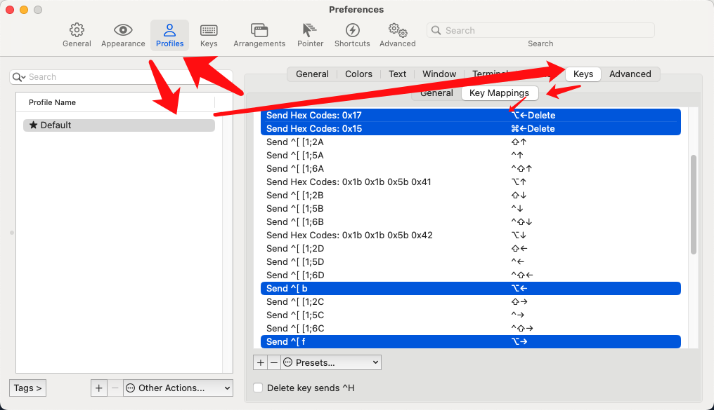
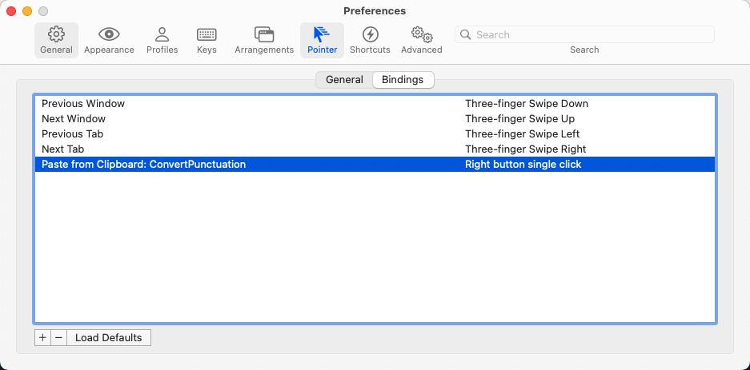
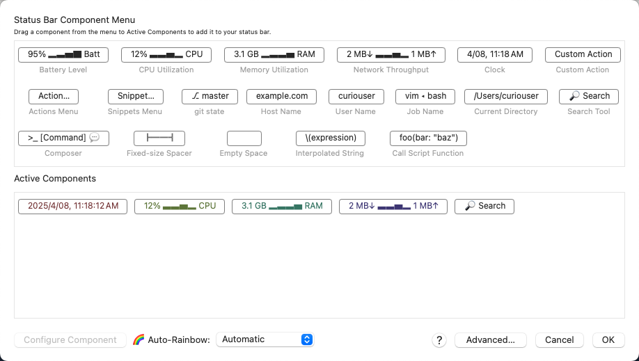
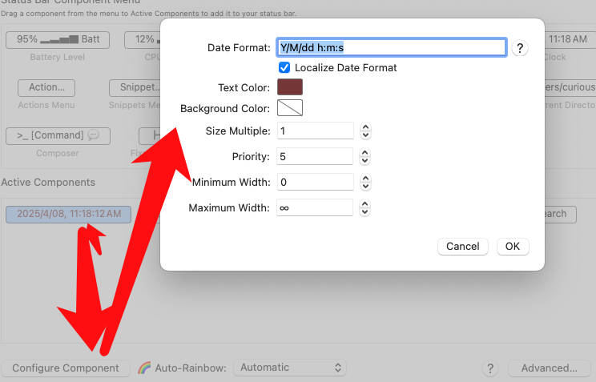
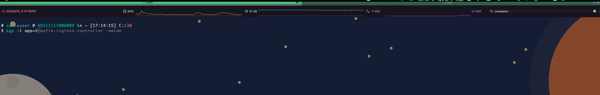

# Iterm2快捷调优

## 1、单词跳跃

`Profiles` -> `Default` -> `Keys` -> `Key Mapings`

Option + 右方向键 (单词向右跳跃移动）：Action => `（Send Keystrokes）Send Escape Sequence`   Esc+ => `f`

Option + 左方向键 (单词向右跳跃移动）：Action => `（Send Keystrokes）Send Escape Sequence`   Esc+ => `b`

Option + Delete键（单词跳跃删除）： Action => `（Send Keystrokes）Send Hex Codes: 0x17 或者 0x1b 0x08 `   

Command + Delete键（整行删除）： Action => `（Send Keystrokes）Send Hex Codes: 0x15`

## 2、右键粘贴

`Preferences` -> `Pointer` -> `Bindings`

## 3、显示系统监控状态

`Profiles` -> `Default` -> `Session` -> `Status bar enabled`

时间组件参数配置

## 4、导入配色方案

配色主题网站：https://iterm2colorschemes.com/

个人的配色方案：[Curiouser.itermcolors](../assets/Curiouser.itermcolors)

