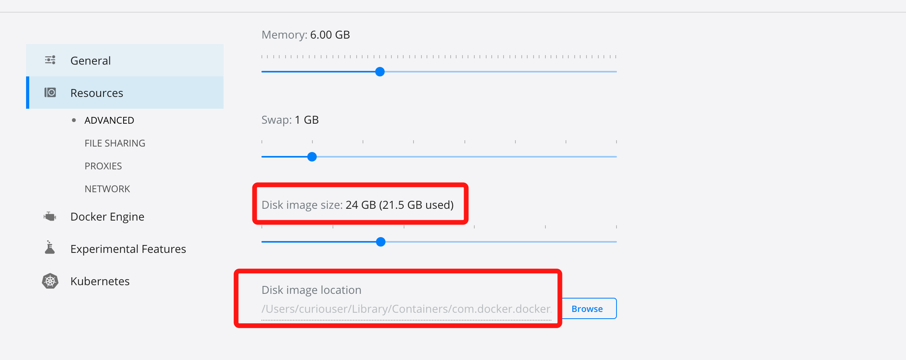
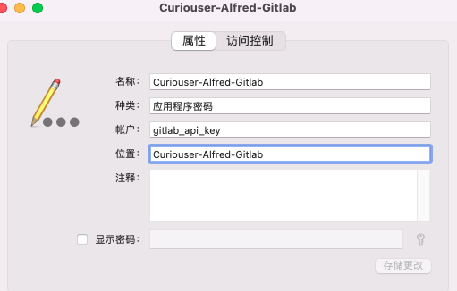

# MacOS小技巧

## 1、DMG 格式文件制作以及 ISO 转换互转

DMG 格式是 Mac OS X 中常用的打包格式

- 创建 DMG 格式的文件

```bash
$ hdiutil create -size 100M -stdinpass -format UDZO -srcfolder folder_to_compress archive_name.dmg

UDZO（压缩格式，默认）
UDRO（只读格式）
UDBZ（Better compressed image）
UDRW（可读写格式）
UDTO（DVD 格式）
```

- 修改 DMG 文件的大小

```bash
$ hdiutil resize 150M /path/to/the/diskimage
```

- 修改 DMG 格式中的加密口令

```bash
$ hdiutil chpass /path/to/the/diskimage
```

- 挂载 DMG 格式的文件

```bash
$ hdiutil attach archive_name.dmg
```

它的挂载点在 /Volumes 目录的同名目录下

```bash
$ ls -lah /Volumes/archive_name/
```

- 卸载 DMG 文件

```bash
$ hdiutil eject /Volumes/archive_name/
```

- 将 ISO 格式的文件转为 DMG 格式的文件

```bash
$ hdiutil convert /path/imagefile.iso -format UDRW -o /path/convertedimage.dmg
```

- 将 DMG 格式的文件转为 ISO 格式的文件

```bash
$ hdiutil convert /path/imagefile.dmg -format UDTO -o /path/convertedimage.cdr
$ hdiutil makehybrid /path/convertedimage.cdr -iso -joliet -o /path/convertedimage.iso
```

## 2、删除虚拟网络设备

```bash
sudo ifconfig utun3 delete
```

## 3、路由修改

```bash
# 删除路由
ip route delete 172.16.1.2/32 
# 添加路由
sudo route add 172.16.1.2/32 -interface utun2
```

## 4、HomeBrew安装使用

### ①简介

- **brew** 是从下载源码解压然后 `./configure && make install` 

- **formula**：定义了一个软件包。包括了这个软件的，依赖、源码位置及编译方法等

- **tap**：一个包含 formula 的 git 仓库

- **cask**：homebrew 的一个扩展仓库，用来安装 一些带界面的应用软件，下载好后会自动安装

- **bottle**：homebrew 提供的已经编译好的 formula。这些 bottle 可以在[这里](https://link.jianshu.com?t=https://bintray.com/homebrew/bottles)看到。在大部分的情况下，执行

- **Homebrew路径**

  ```bash
  cd "$(brew --repo)"
  ```

- **Cask仓库路径**

  ```bash
  cd "$(brew --repo)"/Library/Taps/homebrew/homebrew-cask
  ```

- **Core仓库路径**

  ```bash
  cd "$(brew --repo)/Library/Taps/homebrew/homebrew-core"
  ```

### ②安装

```bash
/bin/bash -c "$(curl -fsSL https://raw.githubusercontent.com/Homebrew/install/HEAD/install.sh)"
```

### ③使用

```bash
# 安装一个包
brew install <package_name>
# 搜索一个包
brew search <package_name>
brew search /正则表达式/ # 标准格式
brew search /^vi/   #规定了只能是vi开头
brew search /^vi\\w$/ 
# 查看这个包的信息
brew info <package_name>
# 安装图形化的软件
brew cask install <formula>
# 卸载对应包名字
brew uninstall <package_name>
# 列出哪些包需要更新
brew outdated
# 更新过时的包，不带包名就更新所有包
brew upgrade [ package_name ]
# 更新HomeBrew自身
brew update
# 清除缓存
brew cleanup [包名]
# 清理指定包的旧版本
brew cleanup $FORMULA   
# 查看可清理的旧版本包，不执行实际操作
brew cleanup -n          
# 列出已经安装的包
brew list
# 查看homebrew 的配置
brew config
# 添加或者删除仓库
brew [un]tap <github_userid/repo_name> 
# 锁定某个包不更新
brew pin $FORMULA    
# 取消锁定某个包不更新
brew unpin $FORMULA
```

### ④使用国内的镜像源

- 中科大

  ```bash
  # Homebrew 源代码仓库
  cd "$(brew --repo)"
  git remote set-url origin https://mirrors.ustc.edu.cn/brew.git
  
  # Homebrew 核心软件仓库
  cd "$(brew --repo)/Library/Taps/homebrew/homebrew-core"
  git remote set-url origin https://mirrors.ustc.edu.cn/homebrew-core.git
  
  # Homebrew cask 软件仓库，提供 macOS 应用和大型二进制文件
  cd "$(brew --repo)"/Library/Taps/homebrew/homebrew-cask
  git remote set-url origin https://mirrors.ustc.edu.cn/homebrew-cask.git
  
  # Homebrew cask 其他版本 (alternative versions) 软件仓库，提供使用人数多的、需要的版本不在 cask 仓库中的应用。
  cd "$(brew --repo)"/Library/Taps/homebrew/homebrew-cask-versions
  git remote set-url origin https://mirrors.ustc.edu.cn/homebrew-cask-versions.git
  
  # Homebrew 预编译二进制软件包
  echo 'export HOMEBREW_BOTTLE_DOMAIN=https://mirrors.ustc.edu.cn/homebrew-bottles' >> ~/.zshrc
  source ~/.zshrc
  ```

### ⑤直接从rb文件安装历史版本或官方仓库没有的版本

大部分情况下 homebrew 的仓库只会存在一份最新的软件版本, 有时可能也会同时存在多个版本, 在有些情况下我们可能需要安装某些软件的历史版本。对于 tap 中无多版本的软件, 我们可以通过在 tap 对应的 git 仓库中查看历史 formula 版本, 通过下载到本地进行安装。先通过 formulae.brew.sh找到RB文件的GitHub仓库。然后找到该RB文件历史版本。下载到本地，手动执行以下命令进行安装

```bash
brew install ./*.rb
```

参考：https://juejin.cn/post/7179202980191666233

## 5、HomeBrew的备份恢复

### ①简介

homebrew-bundle - https://github.com/Homebrew/homebrew-bundle

1. Mac 上非常常用的包管理器 Homebrew, 我们经常用它来安装其他的软件包
2. 还有 Homebrew-cask, 可以用来安装图形界面的 App
3. homebrew-bundle 类似 node 中的 package.json 或者 Cocoapods 中的 Podfile
4. 我们将需要的包和 App, 声明在一个 Brewfile 中, 然后执行 brew bundle 即可安装所有包

### ②备份内容

1. brew tap 中的软件库
2. brew 安装的命令行工具
3. brew cask 安装的 App
4. Mac App Store 安装的 App

### ③备份命令 

```bash
# 执行 brew bundle dump 
brew bundle dump --describe --force --file="~/Desktop/Brewfile"

# 参数说明 
--describe：为列表中的命令行工具加上说明性文字。
--force：直接覆盖之前生成的 Brewfile 文件。如果没有该参数，则询问你是否覆盖。
--file="~/Desktop/Brewfile"：在指定位置生成文件。如果没有该参数，则在当前目录生成 Brewfile 文件。
```

生成的Brewfile 文件内容

```bash
## 该部分是 brew 中的 tap，相当于一个个软件库 
tap "homebrew/bundle"
tap "homebrew/cask"
## 该部分是 brew 安装的命令行工具 
# Mac App Store command-line interface
brew "mas"
# UNIX shell (command interpreter)
brew "zsh"
# Fish shell like syntax highlighting for zsh
brew "zsh-syntax-highlighting"

## 该部分是 brew cask 安装的 app
cask "mounty"
cask "dteoh/sqa/slowquitapps"

## 该部分是 Mac App Store 安装的 app
mas "ting_en", id: 734383760
mas "Xcode", id: 497799835
```

### ④恢复命令

```bash
brew install mas
# 批量安装软件 
brew bundle --file="~/Desktop/Brewfile"
```

**参考：**

1. https://wsgzao.github.io/post/homebrew-bundle/

## 6、使用Brew安装的软件信息

### ①MySQL

- 配置文件：`/usr/local/etc/my.cnf`
- 日志和底层DB数据文件: `/usr/local/var/mysql`
- bin文件路径：`/usr/local/Cellar/mysql@mysql版本/mysql版本`
- brew 启动命令：`brew services restart mysql@mysql版本 `

### ②Nginx

- 主配置文件路径：`/usr/local/etc/nginx/nginx.conf`
- bin文件路径: `/usr/local/Cellar/nginx/nginx版本号/`

## 7、stat命令格式化输出

```bash
$ echo "stat -f "文件: %N%n%n  大小: %Z 字节  类型: %HT%n  所在磁盘分区: %Sd Block编号: %b  Inode: %i %n  权限: %Sp(%Mp%Lp) / %Su(%u)-%Sg(%g)%n%n  最近访问时间  :  %Sa%n  内容修改时间  :  %Sm%n  inode修改时间 :  %Sc%n  创建时间      :  %SB" -t "%Y-%m-%d %H:%M:%m"" >> ~/.zshrc
$ source ~/.zshrc
$ stat test.txt

文件: test.txt

  大小: 124875 字节  类型: Regular File
  所在磁盘分区: disk1s2 Block编号: 256  Inode: 55342799 
  权限: -rw-r--r--(0644) / curiouser(501)-staff(20)

  最近访问时间  :  2021-08-12 19:18:08
  内容修改时间  :  2021-08-12 18:47:08
  inode修改时间 :  2021-08-12 18:47:08
  创建时间      :  2021-07-15 10:19:0721
```

## 8、Docker Desktop For Mac

①启动容器报错“no space left on device”

因为MacOS下Docker Desktop的docker是基于虚拟机的。而docker虚拟机的原始存储RAW文件大小超过设置的值后会报上述错误

RAW文件路径：`~/Library/Containers/com.docker.docker/Data/vms/0/data/Docker.raw`



- 参考：https://forums.docker.com/t/no-space-left-on-device-error/10894

解决办法：

- 删除虚悬volumes释放空间：`docker volume rm $(docker volume ls -qf dangling=true)`

## 9、Mac 上的“磁盘工具”支持的文件系统格式：

- *Apple 文件系统 (APFS)：*macOS 10.13 或后续版本使用的文件系统。

  Apple 文件系统 (APFS) 是运行 macOS 10.13 或后续版本的 Mac 电脑所使用的默认文件系统，它具有强加密、空间共享、磁盘快照、快速目录大小统计等特性，以及改进的文件系统基础。虽然 APFS 最适合于新款 Mac 电脑中所用的闪存/SSD 储存，它也可以与使用传统硬盘驱动器 (HDD) 和外置直连储存设备的低版本系统配合使用。macOS 10.13 或后续版本支持 APFS 用于可引导启动的宗卷和数据宗卷。

  APFS 按照需求分配容器（分区）中的磁盘空间。单个 APFS 容器包含多个宗卷时，容器的可用空间会共享，并且会自动按需分配到任意单独的宗卷。如果需要，您可以指定每个宗卷的保留大小和配额大小。每个宗卷仅使用整体容器的一部分，这样一来，可用空间即容器的总大小减去该容器中所有宗卷的大小。

  为运行 macOS 10.13 或后续版本的 Mac 电脑选取以下其中一种 APFS 格式。

  - *APFS：*使用 APFS 格式。如果不需要加密或区分大小写格式，请选取此选项。
  - *APFS（加密）：*使用 APFS 格式且加密宗卷。
  - *APFS（区分大小写）：*使用 APFS 格式并区分文件和文件夹名称的大小写。例如，名称为“Homework”和“HOMEWORK”的文件夹是两个不同的文件夹。
  - *APFS（区分大小写，加密）：*使用 APFS 格式，区分文件和文件夹名称的大小写且加密宗卷。例如，名称为“Homework”和“HOMEWORK”的文件夹是两个不同的文件夹。

  您可以轻松[添加或删除 APFS 容器中的宗卷](https://support.apple.com/zh-cn/guide/disk-utility/dskua9e6a110/21.0/mac/12.0)。APFS 容器中的每个宗卷都可以拥有其 APFS 格式：APFS、APFS（加密）、APFS（区分大小写）或 APFS（区分大小写，加密）。

- *Mac OS 扩展：*macOS 10.12 或之前版本使用的文件系统。

  - *Mac OS 扩展（日志式）：*使用 Mac 格式（日志式 HFS Plus）来保护分层文件系统的完整性。如果不需要加密或区分大小写格式，请选取此选项。
  - *Mac OS 扩展（日志式，加密）：*使用 Mac 格式，要求密码，并加密分区。
  - *Mac OS 扩展（区分大小写，日志式）：*使用 Mac 格式并区分文件夹名称的大小写。例如，名称为“Homework”和“HOMEWORK”的文件夹是两个不同的文件夹。
  - *Mac OS 扩展（区分大小写，日志式，加密）：*使用 Mac 格式，区分文件夹名称的大小写，要求密码，并加密分区。

- *MS-DOS (FAT) 和 ExFAT：*与 Windows 兼容的文件系统。

  - *MS-DOS (FAT)：*用于 Windows 宗卷且大小为 32 GB 或不足 32 GB。
  - *ExFAT：*用于 Windows 宗卷且大小超过 32 GB。

## 10、挂载EFI分区

```bash
diskutil list
# /dev/disk0
# #: TYPE                     NAME          SIZE       IDENTIFIER
# 0: GUID_partition_scheme                  *251.0 GB  disk0
# 1: EFI                                    209.7 MB   disk0s1
# 2: Apple_HFS                Macintosh HD  250.1 GB   disk0s2
# 3: Apple_Boot               Recovery HD   650.0 MB   disk0s3
mkdir /Volumes/EFI
sudo mount -t msdos /dev/disk0s1 /Volumes/EFI
```

## 11、命令行设置网络代理

```bash
sudo networksetup -setwebproxy "Wi-Fi" 127.0.0.1 8001
sudo networksetup -setwebproxystate "Wi-Fi" on
sudo networksetup -setsecurewebproxy "Wi-Fi" 127.0.0.1 8001
sudo networksetup -setsecurewebproxystate "Wi-Fi" on
sudo networksetup -setsocksfirewallproxy "Wi-Fi" 127.0.0.1 8002
sudo networksetup -setsocksfirewallproxystate "Wi-Fi" on
```

## 12、清除 DNS 缓存

| MACOS 版本                   | 使用的命令                                                   |
| :--------------------------- | :----------------------------------------------------------- |
| macOS 12 (Monterey)          | `sudo dscacheutil -flushcache; sudo killall -HUP mDNSResponder` |
| macOS 11 (Big Sur)           | `sudo dscacheutil -flushcache; sudo killall -HUP mDNSResponder` |
| macOS 10.15 (Catalina)       | `sudo dscacheutil -flushcache; sudo killall -HUP mDNSResponder` |
| macOS 10.14 (Mojave)         | `sudo killall -HUP mDNSResponder`                            |
| macOS 10.13 (High Sierra)    | `sudo killall -HUP mDNSResponder`                            |
| macOS 10.12 (Sierra)         | `sudo killall -HUP mDNSResponder`                            |
| OS X 10.11 (El Capitan)      | `sudo killall -HUP mDNSResponder`                            |
| OS X 10.10 (Yosemite)        | `sudo discoveryutil udnsflushcaches`                         |
| OS X 10.9 (Mavericks)        | `sudo killall -HUP mDNSResponder`                            |
| OS X 10.8 (Mountain Lion)    | `sudo killall -HUP mDNSResponder`                            |
| Mac OS X 10.7 (Lion)         | `sudo killall -HUP mDNSResponder`                            |
| Mac OS X 10.6 (Snow Leopard) | `sudo dscacheutil -flushcache`                               |
| Mac OS X 10.5 (Leopard)      | `sudo lookupd -flushcache`                                   |
| Mac OS X 10.4 (Tiger)        | `lookupd -flushcache`                                        |

## 13、关掉mds、mds_stores进程

mds_stores是spotlight的后台进程。spotlight为了用户在查询数据的时候能够快速显示查找结果，所以需要对这些文件建立
索引等信息。在建立这些信息的时候，需要对这些文件进行读取分析，并且写入索引等导致磁盘读写非常大。

```bash
# 关闭
sudo mdutil -a -i off
# 开起
sudo mdutil -a -i on
```

## 14、Brew安装旧版软件

如果使用Brew安装指定版本的软件（例如brew install mysql5.6）时，报以下错误。说明该软件的这个版本已不再维护，无法直接安装。但是可通过之前可用的rb文件强制安装。

> mysql@5.6 has been disabled because it is not supported upstream!

**以下步骤以`macOS 12.6  brew 3.6.4`安装mysql 5.6版本为例**

- 在网上找到该软件最后可用版本的rb文件

  **在[Homebrew/homebrew-core](https://github.com/Homebrew/homebrew-core)仓库中查找该软件的最新rb文件。可拼接文件URI链接`https://github.com/Homebrew/homebrew-core/blob/master/Formula/软件名@版本号.rb`快速找到该文件。之后查看该文件的历史版本，找到最后可用版本的git commit id，之后再次拼接`https://github.com/Homebrew/homebrew-core/blob/<最后可用版本的git commit id>/Formula/软件名@版本号.rb`。例如mysql 5.6最后可用版本的rb文件URI：`https://github.com/Homebrew/homebrew-core/blob/60fa175e53f36e763315c3d9e66ebcaf1fa21d91/Formula/mysql%405.6.rb`**

  ```bash
  class MysqlAT56 < Formula
    desc "Open source relational database management system"
    homepage "https://dev.mysql.com/doc/refman/5.6/en/"
    url "https://dev.mysql.com/get/Downloads/MySQL-5.6/mysql-5.6.51.tar.gz"
    sha256 "262ccaf2930fca1f33787505dd125a7a04844f40d3421289a51974b5935d9abc"
    license "GPL-2.0-only"
  
    bottle do
      rebuild 1
      sha256 monterey:     "e3132c3b1381b6ea6a2298166866e637560b0be3223912d1512a150b096fa104"
      sha256 big_sur:      "30a530ddb785efe7542641366126d7b4afcce09bde0fa104b869814fa69fc9e2"
      sha256 catalina:     "a5309a985dccc02490ff9bd0be1575a4e8908ca3e15dcfaa77e7d2b2bd616cfd"
      sha256 mojave:       "1ba2347383b539258d1c0a29cbbee722c30e6c28446c22a669a8a7deabd5f53e"
      sha256 x86_64_linux: "91b24798f46a2bc7b616fb73fc47a5337acb5b8e0a6f9be1c657eade6fade45b"
    end
  
    keg_only :versioned_formula
  
    deprecate! date: "2021-02-01", because: :unsupported
  
    depends_on "cmake" => :build
    depends_on "openssl@1.1"
  
    uses_from_macos "libedit"
  
    def datadir
      var/"mysql"
    end
  
    # Fixes loading of VERSION file, backported from mysql/mysql-server@51675dd
    patch :DATA
  
    def install
      # Don't hard-code the libtool path. See:
      # https://github.com/Homebrew/homebrew/issues/20185
      inreplace "cmake/libutils.cmake",
        "COMMAND /usr/bin/libtool -static -o ${TARGET_LOCATION}",
        "COMMAND libtool -static -o ${TARGET_LOCATION}"
  
      # Fix loading of VERSION file; required in conjunction with patch
      File.rename "VERSION", "MYSQL_VERSION"
  
      # -DINSTALL_* are relative to `CMAKE_INSTALL_PREFIX` (`prefix`)
      args = %W[
        -DCOMPILATION_COMMENT=Homebrew
        -DDEFAULT_CHARSET=utf8
        -DDEFAULT_COLLATION=utf8_general_ci
        -DINSTALL_DOCDIR=share/doc/#{name}
        -DINSTALL_INCLUDEDIR=include/mysql
        -DINSTALL_INFODIR=share/info
        -DINSTALL_MANDIR=share/man
        -DINSTALL_MYSQLSHAREDIR=share/mysql
        -DMYSQL_DATADIR=#{datadir}
        -DSYSCONFDIR=#{etc}
        -DWITH_EDITLINE=system
        -DWITH_NUMA=OFF
        -DWITH_SSL=yes
        -DWITH_UNIT_TESTS=OFF
        -DWITH_EMBEDDED_SERVER=ON
        -DWITH_ARCHIVE_STORAGE_ENGINE=1
        -DWITH_BLACKHOLE_STORAGE_ENGINE=1
        -DENABLED_LOCAL_INFILE=1
        -DWITH_INNODB_MEMCACHED=ON
      ]
  
      system "cmake", ".", *std_cmake_args, *args
      system "make"
      system "make", "install"
  
      # Avoid references to the Homebrew shims directory
      inreplace bin/"mysqlbug", "#{Superenv.shims_path}/", ""
  
      (prefix/"mysql-test").cd do
        system "./mysql-test-run.pl", "status", "--vardir=#{Dir.mktmpdir}"
      end
  
      # Remove the tests directory
      rm_rf prefix/"mysql-test"
  
      # Don't create databases inside of the prefix!
      # See: https://github.com/Homebrew/homebrew/issues/4975
      rm_rf prefix/"data"
  
      # Link the setup script into bin
      bin.install_symlink prefix/"scripts/mysql_install_db"
  
      # Fix up the control script and link into bin.
      inreplace "#{prefix}/support-files/mysql.server",
                /^(PATH=".*)(")/,
                "\\1:#{HOMEBREW_PREFIX}/bin\\2"
      bin.install_symlink prefix/"support-files/mysql.server"
  
      libexec.install bin/"mysqlaccess"
      libexec.install bin/"mysqlaccess.conf"
  
      # Install my.cnf that binds to 127.0.0.1 by default
      (buildpath/"my.cnf").write <<~EOS
        # Default Homebrew MySQL server config
        [mysqld]
        # Only allow connections from localhost
        bind-address = 127.0.0.1
      EOS
      etc.install "my.cnf"
    end
  
    def post_install
      # Make sure the var/mysql directory exists
      (var/"mysql").mkpath
  
      # Don't initialize database, it clashes when testing other MySQL-like implementations.
      return if ENV["HOMEBREW_GITHUB_ACTIONS"]
  
      unless (datadir/"mysql/general_log.CSM").exist?
        ENV["TMPDIR"] = nil
        system bin/"mysql_install_db", "--verbose", "--user=#{ENV["USER"]}",
          "--basedir=#{prefix}", "--datadir=#{datadir}", "--tmpdir=/tmp"
      end
    end
  
    def caveats
      <<~EOS
        A "/etc/my.cnf" from another install may interfere with a Homebrew-built
        server starting up correctly.
        MySQL is configured to only allow connections from localhost by default
        To connect:
            mysql -uroot
      EOS
    end
  
    service do
      run [opt_bin/"mysqld_safe", "--datadir=#{var}/mysql"]
      keep_alive true
      working_dir var/"mysql"
    end
  
    test do
      (testpath/"mysql").mkpath
      (testpath/"tmp").mkpath
      system bin/"mysql_install_db", "--no-defaults", "--user=#{ENV["USER"]}",
        "--basedir=#{prefix}", "--datadir=#{testpath}/mysql", "--tmpdir=#{testpath}/tmp"
      port = free_port
      fork do
        system "#{bin}/mysqld", "--no-defaults", "--user=#{ENV["USER"]}",
          "--datadir=#{testpath}/mysql", "--port=#{port}", "--tmpdir=#{testpath}/tmp"
      end
      sleep 5
      assert_match "information_schema",
        shell_output("#{bin}/mysql --port=#{port} --user=root --password= --execute='show databases;'")
      system "#{bin}/mysqladmin", "--port=#{port}", "--user=root", "--password=", "shutdown"
    end
  end
  ```

- 本地安装

  ```bash
  brew install ./mysql@5.6.rb
  ```

## 15、钥匙串管理

Security是Mac系统中钥匙串和安全模块的命令行管理工具，（图形化工具为Keychain Access.app）。钥匙串（Keychain）实质上就是一个用于存放证书、密钥、密码等安全认证实体的仓库，在计算机中保存为一个.keychain的文件，默认存放在以下目录中（使用这几个目录中的钥匙串时不需要写路径，直接用文件名即可，Security工具会自动搜索）：

- ~/Library/Keychains/
- /Library/Keychains/
- /Network/Library/Keychains/

Security命令语法：**security   [-hilqv]   [-p prompt]  [command] [command options] [command args]**

```bash
-i    交互模式
-p <prompt>    进入交互模式，使用自定义提示符
-q      减少信息输出
-v      增加信息输出
-l      security退出前，调用/usr/bin/leaks -nocontext检查执行的命令是否有泄漏

子命令列表如下
create-keychain    创建钥匙串并加入搜索列表
list-keychains   显示或设置钥匙串搜索列表
default-keychain   显示或设置默认的钥匙串
login-keychain     显示或设置登录钥匙串
delete-keychain    删除钥匙串并从搜索列表移除
lock-keychain    锁定制定的钥匙串
unlock-keychain    解锁制定的钥匙串
set-keychain-settings    设置钥匙串配置
set-keychain-password   设置钥匙串密码
dump-keychain    显示一个或多个钥匙串的内容
create-keypair     创建非对称密钥对
add-generic-password    向钥匙串中添加通用密码项
find-generic-password    查找通用密码项
delete-generic-password   删除通用密码项
add-internet-password   向钥匙串中添加网络密码项
find-internet-password   查找网络密码项
delete-internet-password   删除网络密码项
add-certificates     向钥匙串种添加证书
find-certificate    查找证书
delete-certificate   从钥匙串种删除证书
find-identity     查找认证实体（证书+私钥）
set-identity-preference
get-identity-preference
create-db
export
import
cms     编码或解码CMS信息（PKCS#7）
install-mds    安装/重装MDS 数据库
add-trusted-cert    添加可信证书（只包含公钥，无私钥）
remove-trusted-cert  删除可信证书
dump-trusted-setting   显示信任配置
user-trust-settings-enable    显示或管理用户级别的信任配置
trust-settings-export   导出信任配置
trust-settings-import   导入信任配置
verify-cert    验证证书
authorize    授权操作
authorizationdb   变更授权策略数据库
execute-with-privileges   带特权执行工具
leaks     在本进程中运行/usr/bin/leaks
error     显示指定错误码的描述信息
create-filevaultmaster-keychain   创建一个带密钥对的钥匙串，用于FileVault恢复（FileVault是苹果系统里的一项保密机制，会自动透明地对主目录的内容进行实时加密和解密）
```

①添加应用程序密码

> 语法：security add-generic-password [-a account] [-s service] [-w password] [options...] [-A|-T appPath] [keychain]

```bash
-a  Specify account name (required)
-c  Specify item creator (optional four-character code)
-C  Specify item type (optional four-character code)
-D  Specify kind (default is "application password")
-G  Specify generic attribute (optional)
-j  Specify comment string (optional)
-l  Specify label (if omitted, service name is used as default label)
-s  Specify service name (required)
-p  Specify password to be added (legacy option, equivalent to -w)
-w  Specify password to be added
-X  Specify password data to be added as a hexadecimal string
-A  Allow any application to access this item without warning (insecure, not recommended!)
-T  Specify an application which may access this item (multiple -T options are allowed)
-U  Update item if it already exists (if omitted, the item cannot already exist)
```

```bash
security add-generic-password -a 账号 -s 名称 -w 密码
```




②查找账号信息

> 语法：security find-generic-password [-a account] [-s service] [options...] [-g] [keychain...]

```bash
-a  Match "account" string
-c  Match "creator" (four-character code)
-C  Match "type" (four-character code)
-D  Match "kind" string
-G  Match "value" string (generic attribute)
-j  Match "comment" string
-l  Match "label" string
-s  Match "service" string
-g  Display the password for the item found
-w  Display only the password on stdout
```

```bash
security find-generic-password -s 名称 -g
```

# 参考

- https://git.herrbischoff.com/awesome-macos-command-line/about/
