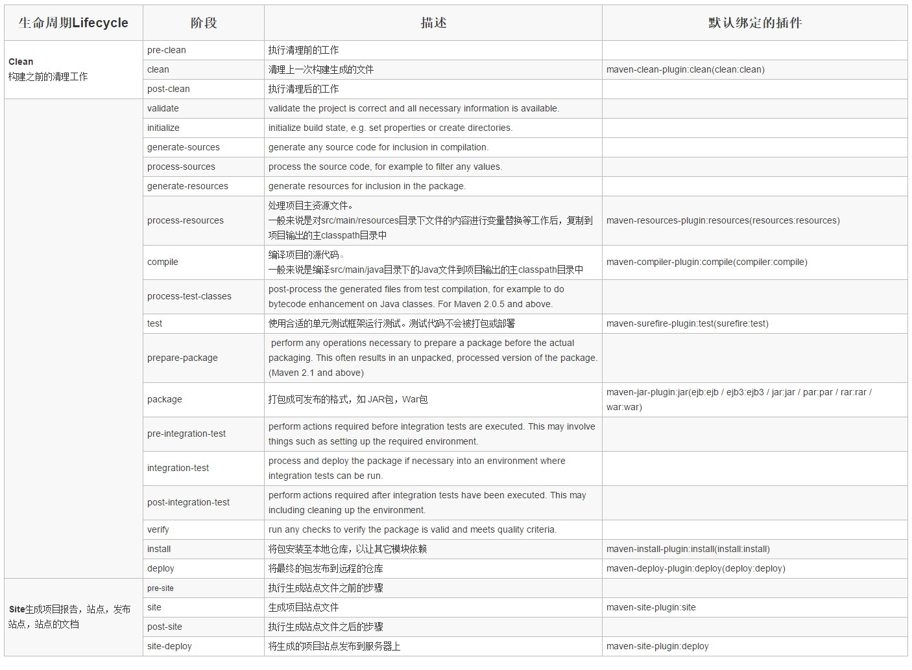

# Maven的生命周期以及阶段插件

- Maven拥有三个生命周期，每个生命周期包含一些阶段，这些阶段是有顺序的，并且后面的阶段依赖于前面的阶段。

- 运行任何一个阶段的时候，它前面的所有阶段都会被运行

- Maven三个生命周期只是定义了各个阶段要做的事情、但是不做任何实际工作、实际工作都是由插件的目标来完成的。插件以独立的形式存在、Maven会在需要的时候下载并使用插件
- 一个插件有可能有多个功能、每个功能就是一个目标。比如maven-dependency-plugin有十多个目标、每个目标对应了一个功能。插件的目标为dependency:analyze、dependency:tree和dependency:list。通用写法：`插件前缀:插件目标`。比如compiler:compile

# 一、Maven的生命周期阶段及插件绑定



上面三个生命周期中有很多原来的生命周期阶段没有默认绑定插件、也就意味着默认情况下他们没有任何意义。当然如果我们有自己特殊的处理、可以为他们绑定特殊的插件、比如下面会有提到的在打包的时候生成jar包的源码、可以在default生命周期的verify阶段绑定生成源码插件的生成源码的目标。

# 二、自定义插件绑定

自定义绑定允许我们自己掌控插件目标与生命周期的结合、下面以生成项目主代码的源码jar为例。使用到的插件和他的目标为：maven-source-plugin:jar-no-fork、将其绑定到default生命周期阶段verify上（可以任意指定三套生命周期的任意阶段）、在项目的POM配置中（也可以在父POM中配置、后面聚合与继承会有提到）

```xml
<build>  
    <plugins>  
        <plugin>  
            <groupId>org.apache.maven.plugins</groupId>  
            <artifactId>maven-source-plugin</artifactId>  
            <version>2.1.1</version>  
            <executions>  
                <execution>  
                    <id>attach-sources</id>  
                    <phase>verify</phase>  
                    <goals>  
                        <goal>jar-no-fork</goal>  
                    </goals>  
                </execution>  
            </executions>  
        </plugin>  
    </plugins>  
</build>

# build元素下的plugins子元素中声明插件的使用。使用的maven-source-plugin插件，其groupId为org.apache.maven.plugins（官方插件的groupId），version版本为2.1.1.对于自定义绑定的插件，应应指定一个非快照的版本，避免插件版本变化造成构件不稳定。
execution元素用来配置执行的任务。上面配置了一个id为attach-source的任务，通过phrase将其绑定到了verify生命周期阶段上，再通过goals配置指定要执行的插件目标（及插件功能）。

需要注意的是：
即使不通过phrase来配置生命周期阶段，有的插件也定义了默认的生命周期阶段。可使用maven-help-plugin来查看插件的详细信息。例如：
mvn help：describe-Dplugin=org.apache.maven.plugins:maven-source-plugin:2.1.1

```

上述配置有插件的坐标声明、还有excutions下面每个excution子元素配置的执行的一个个任务、通过phase指定与生命周期的那个阶段绑定、在通过goals指定执行绑定插件的哪些目标。

当插件的目标绑定到不同的生命周期阶段的时候、插件目标的执行顺序是有生命周期阶段的顺序决定的、当多个插件目标绑定到同一生命周期阶段的时候、顺序是按照插件声明的顺序来决定目标的执行顺序。

# 三、插件配置

有三种方式可配置插件功能目标执行任务时的参数

## 1、命令行

例如maven-surefire-Plugin提供了maven.test.skip参数，当值为true时就跳过单元测试。在命令行时，加上-D参数配置该插件的参数就能跳过单元测试

```bash
maven install -Dmaven.test.skip=true
参数-D是Java自带的，其功能就是通过命令行设置Java系统环境变量。
```

## 2、POM中设置插件的全局任务配置

例如在下面POM文件中配置了maven-source-plugin插件要编译什么java版本的源代码，生成什么java版本的字节码文件

```xml
<build>  
    <plugins>  
        <plugin>  
            <groupId>org.apache.maven.plugins</groupId>  
            <artifactId>maven-source-plugin</artifactId>  
            <version>2.1.1</version>  
            <configuration>
                <source>1.5</source>
                <target>1.5</target>
            </configuration>
        </plugin>  
    </plugins>  
</build>
```

这样，不管绑定到compile阶段的maven-source-plugin：compile任务，还是绑定到test-compile阶段的maven-source-plugin：testCompiler任务，就都能使用到该配置来基于Java 1.5版本来执行任务

## 3、POM中插件任务配置

用户还可以在POM文件中定义某插件的任务参数。例如以maven-antrun-plugin插件为例。他有一个run目标，可以用来在Maven中调用Ant任务。用户可以将maven-antrun-plugin的目标run绑定到多个生命周期阶段上，再加以不同的配置，就可以让Maven在不同的生命阶周期段执行不同的任务

```xml
<build>
    <plugins>  
        <plugin>  
            <groupId>org.apache.maven.plugins</groupId>  
            <artifactId>maven-antrun-plugin</artifactId>  
            <version>1.3</version>  
            <executions>  
                <execution>  
                    <id>ant-validate</id>  
                    <phase>validate</phase>  
                    <goals>  
                        <goal>run</goal>  
                    </goals>
                    <configuration>
                        <task>
                            <echo>HAHAHAHHAHAHAHHAHAHAHHAHAHA</echo>
                        </task>
                    </configuration>
                </execution>  
                <execution>  
                    <id>ant-verify</id>  
                    <phase>verify</phase>  
                    <goals>  
                        <goal>run</goal>  
                    </goals>
                    <configuration>
                        <task>
                            <echo>lalallalal</echo>
                        </task>
                    </configuration>
                </execution>  
            </executions>
        </plugin>  
    </plugins>  
</build>
```

# 参考链接

1. https://maven.apache.org/guides/introduction/introduction-to-the-lifecycle.html#Lifecycle_Reference
2. https://maven.apache.org/plugins/index.html
3. https://blog.csdn.net/zhaojianting/article/details/80321488