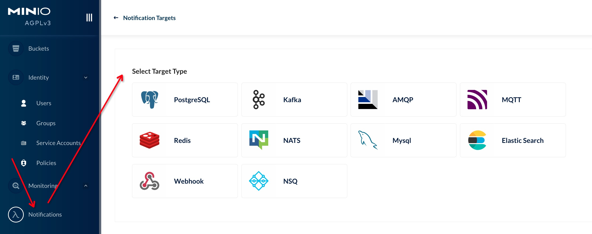
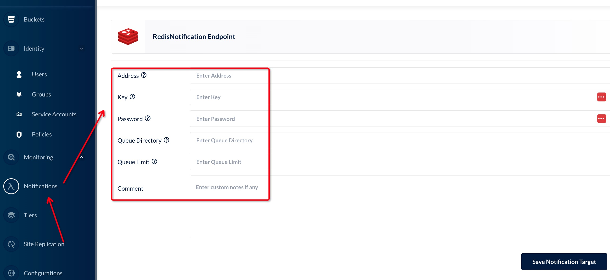
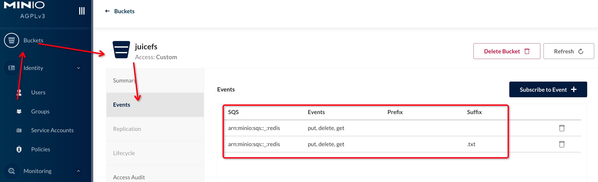
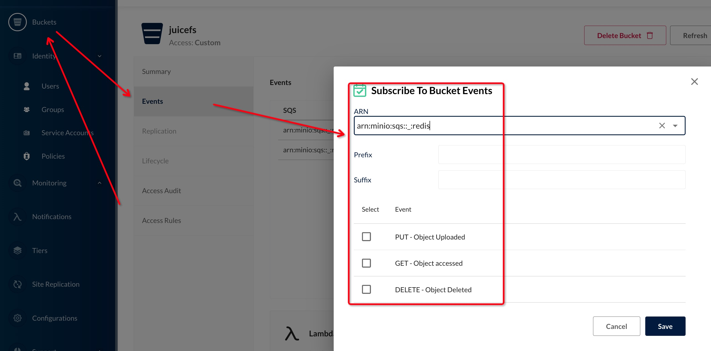
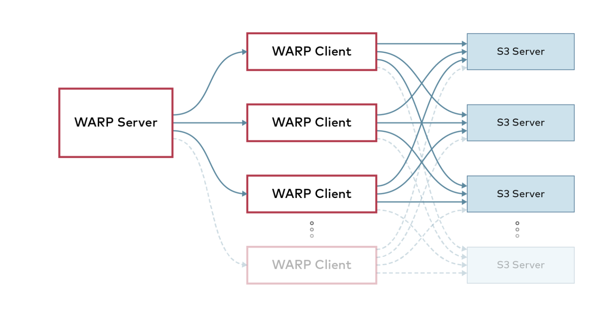

# Minio对象存储

# 一、简介

MinIO 是在 GNU Affero 通用公共许可证 v3.0 下发布的高性能对象存储。兼容与 Amazon S3 云存储服务的 API。

中文文档：http://minio.org.cn/

# 二、安装部署

- MinIO 部署开始使用默认的 root 凭据 `minioadmin:minioadmin`

## Docker

```bash
mkdir -p ~/minio/data

docker run \
   -p 9000:9000 \
   -p 9090:9090 \
   --name minio \
   -v ~/minio/data:/data \
   -e "MINIO_ACCESS_KEY=*****" \
   -e "MINIO_SECRET_KEY=*****" \
   quay.io/minio/minio server /data --console-address ":9090"
```

## Brew

```bash
brew install minio/stable/minio
minio server /data
```

## Unix

```bash
wget http://dl.minio.org.cn/server/minio/release/linux-amd64/minio
chmod +x minio
./minio server /data
```

## Windows

```bash
http://dl.minio.org.cn/server/minio/release/windows-amd64/minio.exe
minio.exe server D:\
```

# 三、mc命令

命令文档：https://min.io/docs/minio/linux/reference/minio-mc.html#

## 1、mc命令安装

> Linux
>
> ```
> curl https://dl.min.io/client/mc/release/linux-amd64/mc \
> --create-dirs \
> -o $HOME/minio-binaries/mc
> 
> chmod +x $HOME/minio-binaries/mc
> export PATH=$PATH:$HOME/minio-binaries/
> ```
>
> MacOS
>
> ```bash
> brew install minio/stable/mc
> ```
>
> WIndows
>
> ```bash
> https://dl.min.io/client/mc/release/windows-amd64/mc.exe
> ```
>
> Docker
>
> ```bash
> docker run -it --rm minio/mc --version
> ```

mc命令shell自动补全

```bash
wget https://raw.githubusercontent.com/minio/mc/master/autocomplete/bash_autocomplete -O /etc/bash_completion.d/mc
source /etc/bash_completion.d/mc
```

## 2、实例管理

```bash
# 添加minio实例配置
mc config host add synology-minio http://127.0.0.1:9000 用户名 密码
# 查看已配置的minio实例实例配置
mc config host list
# 删除minio实例实例配置
mc config host remove synology-minio
# 获取实例信息
mc admin info synology-minio
```

## 3、用户管理

```bash
# 列出所有用户
mc admin user list synology-minio
# 添加新用户
mc admin user add synology-minio 用户名 密码
# 禁用用户
mc admin user disable synology-minio 用户名
# 启用用户
mc admin user enable synology-minio 用户名
# 显示用户信息
mc admin user info synology-minio 用户名
```

## 4、用户组管理

```bash
# 列出所有组
mc admin group list synology-minio

# 获取组信息
mc admin group info synology-minio 用户组

# 将用户添加到组中。如果组不存在，则会创建该组。
mc admin group add synology-minio 用户组 用户1 用户2

# 删除组中用户
mc admin group remove synology-minio 用户组 用户1 用户2

# 删除组
mc admin group remove synology-minio 用户组

# 启用组
mc admin group enable synology-minio 用户组

# 禁用组
mc admin group disable synology-minio 用户组
```

## 5、Bucket管理

```bash
# 创建Bucket
mc mb synology-minio/juicefs

# 列出Bucket
mc ls synology-minio

# 删除没有文件的bucket
mc rb synology-minio/juicefs

# 删除有文件的bucket
mc rb synology-minio/juicefs --force
```

## 6、策略管理

> ```
> 命令格式：
>   mc admin policy 子命令
> 子命令:
>   add      添加新策略
>   remove   删除策略
>   list     列出所有策略
>   info     显示策略信息
>   set      在用户或组上设置策略
> ```

```bash
# 列出所有策略
mc admin policy list synology-minio

# 显示策略的信息
mc admin policy info synology-minio writeonly

# 创建策略
mc admin policy add synology-minio listbucketsonly ./listbucketsonly.json

# 删除策略
mc admin policy remove synology-minio listbucketsonly

# 在用户或组上设置策略
mc admin policy set synology-minio listbucketsonly user=用户
mc admin policy set synology-minio listbucketsonly group=用户组
```

```json
{
   "Version": "2012-10-17",
   "Statement": [
      {
         "Effect": "Allow",
         "Action": [
            "s3:myListBuckets"
         ],
         "Resource": [
            "arn:aws:s3:::*"
         ]
      }
   ]
}
```

策略模板

```json
{
   "Version" : "2012-10-17",
   "Statement" : [
      {
         "Effect" : "Allow",
         "Action" : [ "s3:<ActionName>", ... ],
         "Resource" : "arn:aws:s3:::*",
         "Condition" : { ... }
      },
      {
         "Effect" : "Deny",
         "Action" : [ "s3:<ActionName>", ... ],
         "Resource" : "arn:aws:s3:::*",
         "Condition" : { ... }
      }
   ]
}
```

## 7、文件管理

```bash
# 列出Bucket中的文件
mc ls synology-minio/<Bucket名字>

# 查看Bucket中的文件内容
mc cat synology-minio/<Bucket名字>/文件路径

# 删除文件
mc rm synology-minio/<Bucket名字>/文件路径

# 删除目录
mc rm synology-minio/<Bucket名字>/目录路径 --recursive --force
# --force       参数指定强制删除
# --recursive   递归删除

# 上传一个文件到bucket中
mc cp ./testfile synology-minio/<Bucket名字>/文件路径

# 使用pipe管道直接上传stdout内容到Bucket文件中
ls -al | mc pipe synology-minio/juicefs/aaa/test.txt

# 上传一个目录到bucket中
mc cp ./testdir synology-minio/<Bucket名字>/目录路径 --recursive
```

## 8、查找文件与对象

`find`命令通过指定参数查找文件，它只列出满足条件的数据。

```bash
用法：
  mc find PATH [参数]
参数:
  --help, -h                       显示帮助。
  --exec value                     为每个匹配对象生成一个外部进程（请参阅FORMAT）
  --name value                     查找匹配通配符模式的对象。
  ...
```

```bash
mc find synology-minio/test1/ --name "*.jpg"

# 持续从test1存储桶中查找所有jpeg图像，并复制到test2存储桶中
mc find synology-minio/test1/ --name "*.jpg" --watch --exec "mc cp {} synology-minio/test2/"
```

## 9、共享文件下载

`share download`命令生成不需要access key和secret key即可下载的URL，过期参数设置成最大有效期（不大于7天），过期之后权限自动回收。

>```
>用法：
>     mc share download [参数] TARGET [TARGET...]
>参数:
>  --help, -h               显示帮助。
>    --recursive, -r          递归共享所有对象。
>    --expire, -E "168h"      设置过期时限，NN[h|m|s]。
>  ```

```bash
mc share download --expire 4h synology-minio/<Bucket名字>/文件路径

# 列出先前共享的有下载权限的URL。
mc share list download
# 列出先前共享的有上传权限的URL。
mc share list upload
```

## 10、显示目录差异

`diff`命令计算两个目录之间的差异。它只列出缺少的或者大小不同的内容。

不比较内容，所以名称相同，大小相同但内容不同的对象没有被检测到。可以在不同站点或者大量数据的情况下快速比较。

```bash
用法：
  mc diff [FLAGS] 路径1 路径2
# 路径既可以是本地路径，又可以是minio bucket路径
```

```bash
# 比较一个本地文件夹和一个远程对象存储服务*
mc diff localdir synology-minio/juicefs
# localdir/notes.txt and https://play.min.io/mybucket/notes.txt - only in first.
```

## 11、共享文件上传

`share upload`命令生成不需要access key和secret key即可上传的URL。过期参数设置成最大有效期（不大于7天），过期之后权限自动回收。 Content-type参数限制只允许上传指定类型的文件。

> ```
> 用法：
>    mc share upload [FLAGS] TARGET [TARGET...]
> 参数:
>   --help, -h                   显示帮助。
>   --recursive, -r              递归共享所有对象。
>   --expire, -E "168h"          设置过期时限，NN[h|m|s].
> ```

```bash
mc share upload synology-minio/juicefs/aaa/test1.txt
# Expire: 7 days 0 hours 0 minutes 0 seconds
# Share: curl http://127.0.0.1:9000/test/ -F AWSAccessKeyId=**** -F signature=*** -F bucket=test -F policy=****= -F key=aa/test1.txt -F file=@待上传的文件

# 使用共享上传URL上传本地文件内容
echo "hahahhahhahah" > test.hh
curl http://127.0.0.1:9000/test/ -F AWSAccessKeyId=**** -F signature=*** -F bucket=test -F policy=****= -F key=aa/test1.txt -F file=@test.hh
```

## 12、显示服务端的http跟踪

```bash
mc admin trace synology-minio

# 2022-10-21T14:37:34.601 [0 ] s3.GetBucketLocation                0s           ↑ 0 B ↓ 0 B
# 2022-10-21T14:37:34.614 [0 ] s3.ListObjectsV2                    0s           ↑ 0 B ↓ 0 B
```

## 13、监听文件和对象存储事件

`watch`命令提供了一种方便监听对象存储和文件系统上不同类型事件的方式。

> ```
> 用法：
>   mc watch [参数] 0
> 参数:
>   --events value                   过滤不同类型的事件，默认是所有类型的事件 (默认： "put,delete,get")
>   --prefix value                   基于前缀过滤事件。
>   --suffix value                   基于后缀过滤事件。
>   --recursive                      递归方式监听事件。
>   --help, -h                       显示帮助。
> ```

```bash
mc watch synology-minio

# [2022-10-21T07:02:46.369Z]    7 B s3:ObjectCreated:Put http://127.0.0.1:9000/test/aaa/test1.txt
```

## 14、Prometheus监控

MinIO中的Prometheus端点默认需要身份验证。Prometheus支持使用承载令牌方法对Prometheus抓取请求进行身份验证

```bash
# 生成带有验证Token的Prometheus刮取minio监控数据的配置，将配置添加到Prometheus配置文件即可
mc admin prometheus generate synology-minio

#   - job_name: minio-job
#    bearer_token: ******
#    metrics_path: /minio/v2/metrics/cluster
#    scheme: http
#    static_configs:
#    - targets: ['127.0.0.1:9000']
```

| 指标 | 含义 |
| ---- | ---- |
| disk_storage_used  | 磁盘使用的磁盘空间。|
| disk_storage_available | 磁盘上剩余的可用磁盘空间。|
| disk_storage_total | 磁盘上的总磁盘空间。|
| minio_disks_offline | 当前MinIO实例中的脱机磁盘总数。|
| minio_disks_total | 当前MinIO实例中的磁盘总数。|
| s3_requests_total | 当前MinIO实例中s3请求的总数。|
| s3_errors_total | 当前MinIO实例中s3请求中的错误总数。|
| s3_requests_current | 当前MinIO实例中活动s3请求的总数。|
| internode_rx_bytes_total | 当前MinIO服务器实例接收到的节点间字节总数。|
| internode_tx_bytes_total | 当前MinIO服务器实例发送到其他节点的字节总数。|
| s3_rx_bytes_total | 当前MinIO服务器实例接收的s3字节总数。|
| s3_tx_bytes_total | 当前MinIO服务器实例发送的s3字节总数。|
| minio_version_info | 具有提交ID的当前MinIO版本。|
| s3_ttfb_seconds | 保存请求的延迟信息的直方图。|
| cache_data_served:cache_data_served | 从缓存提供的总字节数。|
| cache_hits_total:cache_hits_total | 缓存命中总数。|
| cache_misses_total:cache_misses_total | 缓存未命中总数。|
| gateway_<gateway_type>_requests | 向云后端发出的请求总数。此度量标准具有method标识GET，HEAD，PUT和POST请求的标签。|
| gateway_<gateway_type>_bytes_sent | 发送到云后端的总字节数（在PUT和POST请求中）。|
| gateway_<gateway_type>_bytes_received | 从云后端接收的字节总数（在GET和HEAD请求中）。|
| self_heal_time_since_last_activity | 自上一次自我修复相关活动以来经过的时间。|
| self_heal_objects_scanned | 在当前运行中由自愈线程扫描的对象数。重新开始自我修复运行时，它将重置。这用扫描的对象类型标记。|
| self_heal_objects_healed |  当前运行中通过自愈线程修复的对象数。重新开始自我修复运行时，它将重置。这用扫描的对象类型标记。|
| self_heal_objects_heal_failed | 当前运行中自愈失败的对象数。重新开始自我修复运行时，它将重置。这被标记为磁盘状态及其端点。|

# 四、Minio服务端管理

## 1、升级

- MinIO 服务器支持滚动升级，即可以在分布式集群中一次更新一个 MinIO 实例。
- 允许在不停机的情况下进行升级。
- 升级可以通过用最新版本替换二进制文件并以滚动方式重新启动所有服务器来手动完成
- 建议从客户端使用 `mc admin update`。 将同时更新集群中的所有节点并重新启动
- 某些版本可能不允许滚动升级，这总是在发行说明中提到，通常建议在升级前阅读发行说明
- `mc admin update` 仅在运行 MinIO 的用户对二进制文件所在的父目录具有写访问权限时才有效，例如，如果当前二进制文件位于 `/usr/local/bin/minio`，则需要写入访问`/usr/local/bin`。
- `mc admin update` 同时更新和重启所有服务器，应用程序会在升级后重试并继续各自的操作。
- `mc admin update` 在 kubernetes/container 环境中被禁用，容器环境提供自己的机制来推出更新。
- 在联合设置的情况下，`mc admin update` 应该单独针对每个集群运行。在所有集群成功更新之前，避免将 `mc` 更新为任何新版本。
- 如果使用 `kes` 作为 MinIO 的 KMS，只需替换二进制文件并重新启动 `kes` 有关 `kes` 的更多信息可以在 [here](https://github.com/minio/kes/wiki) 中找到
- 如果将 Vault 作为 KMS 与 MinIO 一起使用，请确保遵循Vault升级过程：https://www.vaultproject.io/docs/upgrading/index.html
- 如果将 etcd 与 MinIO 用于联合，请确保遵循etcd升级过程：https://github.com/etcd-io/etcd/blob/master/Documentation/upgrades/upgrading-etcd.md

## 2、重启

```bash
mc admin service restart synology-minio
```


# 五、Minio事件通知

存储桶（Bucket）如果发生改变,比如上传对象和删除对象，可以使用存储桶事件通知机制进行监控，并通过以下方式发布出去:



参考：http://docs.minio.org.cn/docs/master/minio-bucket-notification-guide

## 1、使用Redis存储事件通知

### ①配置Redis SQS

```bash
mc admin config set synology-minio notify_redis \
  address="127.0.0.1:6379" \
  password="redis密码" \
  key="event在redis中的key名" \
  format="namespace" \
  queue_dir="" \
  queue_limit=0 \
  comment="<string>"
```

| 参数       | 类型     | 描述                                                         |
| ---------- | -------- | ------------------------------------------------------------ |
| `format`   | *string* | (必须) 是 `namespace` 还是 `access`。<br />      如果是`namespace`格式的话，则存储到Redis的key的类型是一个hash。对于每一个条目，对应一个存储桶里的对象，其key都被设为"存储桶名称/对象名称"，value都是一个有关这个MinIO对象的JSON格式的事件数据。如果对象更新或者删除，hash中对象的条目也会相应的更新或者删除。；<br />       如果是`access`格式的话，则是一个list。list中又有两个元素，第一个元素是时间戳的字符串，第二个元素是一个含有在这个存储桶上进行操作的事件数据的JSON对象。在这种格式下，list中的元素不会更新或者删除。 |
| `address`  | *string* | (必须) Redis服务地址，比如: `localhost:6379`。无法选择DB，默认使用Redis的0 Database |
| `password` | *string* | (可选) Redis服务密码                                         |
| `key`      | *string* | (必须) 事件要存储到redis key的名称                           |



### ②重启Minio

```bash
mc admin service restart synology-minio
```

### ③查看SQS的资源标识ARN

```bash
mc admin info --json synology-minio | jq .info.sqsARN
# 会输出类似于arn:minio:sqs::_:redis的信息
```

### ④查看Bucket设置的SQS

```bash
mc event list synology-minio/juicefs
```



### ⑤查看Bucket设置的SQS信息

```bash
mc admin config get synology-minio/ notify_redis
```

### ⑥在Bucket上配置SQS规则

```bash
mc event add synology-minio/juicefs arn:minio:sqs::_:redis
# arn:minio:sqs::_:redis   s3:ObjectCreated:*,s3:ObjectRemoved:*,s3:ObjectAccessed:*   Filter:
  
mc event add synology-minio/juicefs arn:minio:sqs::_:redis --suffix=".txt"
# arn:minio:sqs::_:redis   s3:ObjectCreated:*,s3:ObjectRemoved:*,s3:ObjectAccessed:*   Filter: suffix=".txt"

mc event add synology-minio/juicefs arn:minio:sqs::_:redis --event delete
# arn:minio:sqs::_:redis   s3:ObjectRemoved:*   Filter:
```

> **--events**                                过滤不同类型的事件，默认是所有类型的事件 (默认： "put,delete,get")
>
> **--prefix **                                基于前缀过滤事件。
>
> **--suffix**                                 基于后缀过滤事件。
>
> **--ignore-existing, -p**         如果事件已经存在则忽略



### ⑦删除Bucket上设置的SQS规则

```bash
mc event remove synology-minio/juicefs arn:minio:sqs::_:redis
mc event remove synology-minio/juicefs arn:minio:sqs::_:redis --suffix=".txt"
```

### ⑧重置Redis SQS

```bash
mc admin config reset synology-minio/ notify_redis
# 重启Minio
mc admin service restart synology-minio
```

### ⑨event时间样本

> Key名：minio-events
>
> Key类型：hash

```json
{
  "Records": [
    {
      "eventVersion": "2.0",
      "eventSource": "minio:s3",
      "awsRegion": "",
      "eventTime": "2022-10-21T10:02:37.163Z",
      "eventName": "s3:ObjectCreated:Put",
      "userIdentity": {
        "principalId": "curiouser"
      },
      "requestParameters": {
        "principalId": "curiouser",
        "region": "",
        "sourceIPAddress": "10.8.0.9"
      },
      "responseElements": {
        "content-length": "0",
        "x-amz-request-id": "27200D52709D8C10",
        "x-minio-deployment-id": "5b27aw9c3-5ab2-4377-bebe-2a321143bdeb",
        "x-minio-origin-endpoint": "http://1237.0.0.1:9000"
      },
      "s3": {
        "s3SchemaVersion": "1.0",
        "configurationId": "Config",
        "bucket": {
          "name": "juicefs",
          "ownerIdentity": {
            "principalId": "curiouser"
          },
          "arn": "arn:aws:s3:::juicefs"
        },
        "object": {
          "key": "aaa%2F5.txt",
          "size": 331,
          "eTag": "9b6a60f5b7707b436a33afb280fd6d8a",
          "contentType": "text/x-c",
          "userMetadata": {
            "content-type": "text/x-c"
          },
          "sequencer": "17200D5D74683FBA"
        }
      },
      "source": {
        "host": "10.8.0.9",
        "port": "",
        "userAgent": "MinIO (darwin; amd64) minio-go/v7.0.27 mc/RELEASE.2022-06-26T18-51-48Z"
      }
    }
  ]
}
```


# 六、Minio性能测试

`mc support perf` 是一个易用的测试工具，它会先运行PUTS，然后运行GETS，通过增量的方式测试得到最大吞吐量。而warp则是一个完整的工具链，提供了很独立的测试项，能够测试GET;PUT;DELETE等都可以测试得到。同时通过cs的结构设计，更符合真实的使用场景，得到最贴近应用的性能结果，有利于性能分析。

## 1、mc support perf

`mc support per`f可以测试Minio的 S3 API（读/写）、网络 IO 和存储（驱动器读/写）性能

命令格式：`mc [全局参数] support 性能测试对象 参数 minio实例别名`

测试性能对象：

- **Drive：**测试驱动器的速度

  > mc [全局参数] support perf drive   \
  >                 [--concurrent <value>指定每个服务器要测试的并发请求数。默认32个]         \
  >                 [--verbose, -v]        \
  >                 [--filesize <value>指定要读取或写入每个驱动器的数据的总大小。默认1GiB，单位KiB, MiB,GiB]           \
  >                 [--blocksize <value>指定读/写块大小。默认4MiB，单位KiB, MiB,GiB]          \
  >                 [--serial，对驱动器逐个运行性能测试。]             \
  >                 minio实例别名

- **object：**测试对象的读写速度

  > mc [全局参数] support perf object  \
  >                 [--duration <value> 指定性能测试运行的持续时间。默认10s，单位s、m]           \
  >                 [--size]               \
  >                 [--concurrent <value>指定每个服务器要测试的并发请求数。默认32个]         \
  >                 [--verbose, -v]        \
  >                 minio实例别名

```bash
mc support perf object synology-minio
#    	THROUGHPUT	IOPS
# PUT	77 MiB/s  	1 objs/s
# GET	6.4 MiB/s 	0 objs/s
# Speedtest: MinIO 2022-10-08T20:11:00Z, 1 servers, 1 drives, 64 MiB objects, 9 threads

mc support perf drive synology-minio
# NODE                 	PATH          	READ     	WRITE
# http://127.0.0.1:9000	/volume2/minio	109 MiB/s	138 MiB/s
# Driveperf: ✔
```

## 2、warp

wrap是minio项目下的一个开源测试工具。wrap会上传一定随机数据到oss对象存储服务器上，统计过程消耗时间得出整个oss性能分析。

GitHub：https://github.com/minio/warp



### ①下载安装

- **二进制**

  下载连接：https://github.com/minio/warp/releases

- **Docker**

  ```bash
  docker run -it --rm --name minio-warp minio/warp:latest -h
  ```

### ②命令参数

命令格式

```bash
warp [全局参数] 子命令 [子命令参数] 
```

| 子命令 | 含义 |
| --- | --- |
|  mixed     | benchmark mixed objects |
|  get       | benchmark get objects |
|  put       | benchmark put objects |
|  delete    | benchmark delete objects |
|  list      | benchmark list objects |
|  stat      | benchmark stat objects (get file info) |
|  select    | benchmark select objects |
|  versioned | benchmark mixed versioned objects |
|  retention | benchmark PutObjectRetention |
|  multipart | benchmark multipart object |
|  analyze   | analyze existing benchmark data |
|  cmp       | compare existing benchmark data |
|  merge     | merge existing benchmark data |
|  client    | run warp in client mode, accepting connections to run benchmarks |


| 参数 | 含义 |
| ---- | ---- | 
| --no-color              | disable color theme |
| --debug                 | enable debug output |
| --insecure              | disable TLS certificate verification |
| --autocompletion        | install auto-completion for your shell |
| --host value            | host. Multiple hosts can be specified as a comma separated list. (默认: "127.0.0.1:9000") [$WARP_HOST] |
| --access-key value      | Specify access key [$WARP_ACCESS_KEY] |
| --secret-key value      | Specify secret key [$WARP_SECRET_KEY] |
| --tls                   | Use TLS (HTTPS) for transport [$WARP_TLS] |
| --region value          | Specify a custom region [$WARP_REGION] |
| --encrypt               | encrypt/decrypt objects (using server-side encryption with random keys) |
| --bucket value          | Bucket to use for benchmark data. ALL DATA WILL BE DELETED IN BUCKET! (默认: "warp-benchmark-bucket") |
| --host-select value     | Host selection algorithm. Can be "weighed" or "roundrobin" (默认: "weighed") |
| --concurrent value      | Run this many concurrent operations (默认: 20) |
| --noprefix              | Do not use separate prefix for each thread |
| --prefix value          | Use a custom prefix for each thread |
| --disable-multipart     | disable multipart uploads |
| --md5                   | Add MD5 sum to uploads |
| --storage-class value   | Specify custom storage class, for instance 'STANDARD' or 'REDUCED_REDUNDANCY'. |
| --objects value         | Number of objects to upload. (默认: 2500) |
| --obj.size value        | Size of each generated object. Can be a number or 10KiB/MiB/GiB. All sizes are base 2 binary. (默认:  "10MiB")|  
| --get-distrib value     | The amount of GET operations. (默认: 45) |
| --stat-distrib value    | The amount of STAT operations. (默认: 30) |
| --put-distrib value     | The amount of PUT operations. (默认: 15) |
| --delete-distrib value  | The amount of DELETE operations. Must be at least the same as PUT. (默认: 10) |
| --obj.generator value   | Use specific data generator (默认: "random") |
| --obj.randsize          | Randomize size of objects so they will be up to the specified size |
| --benchdata value       | Output benchmark+profile data to this file. By 默认 unique filename is generated. |
| --serverprof value      | Run MinIO server profiling during benchmark; possible values are 'cpu', 'mem', 'block', 'mutex' and 'trace'. | 
| --duration value        | Duration to run the benchmark. Use 's' and 'm' to specify seconds and minutes. (默认: 5m0s) |
| --autoterm              | Auto terminate when benchmark is considered stable. |
| --autoterm.dur value    | Minimum duration where output must have been stable to allow automatic termination. (默认: 10s) |
| --autoterm.pct value    | The percentage the last 6/25 time blocks must be within current speed to auto terminate. (默认: 7.5) |
| --noclear               | Do not clear bucket before or after running benchmarks. Use when running multiple clients. |
| --syncstart value       | Specify a benchmark start time. Time format is 'hh:mm' where hours are specified in 24h format, server TZ. |
| --warp-client value     | Connect to warp clients and run benchmarks there. |
| --analyze.dur value     | Split analysis into durations of this length. Can be '1s', '5s', '1m', etc. |
| --analyze.out value     | Output aggregated data as to file |
| --analyze.op value      | Only output for this op. Can be GET/PUT/DELETE, etc. |
| --analyze.host value    | Only output for this host. |
| --analyze.skip value    | Additional duration to skip when analyzing data. (默认: 0s) |
| --analyze.v             | Display additional analysis data. |
| --serve value           | When running benchmarks open a webserver to fetch results remotely, eg: localhost:7762 |
| --help, -h              | show help |

### ③测试实例

```bash
# 1千个测试对象，每个对象文件2kb(2048byte)
warp mixed  \
  --host=192.168.1.7:9000 \
  --objects=1000 \
  --obj.seze=2048 \
  --access-key=**** \
  --secret-key=**** \
  --autoterm
```

### ④分析测试结果数据

```bash
warp analyze --analyze.op=GET --analyze.v warp-mixed-2022-10-25[174035]-RQ0u.csv.zst

# 138 operations loaded... Done!
# ---------------------------------------
# Operation: GET (59). Ran 5m59s. Concurrency: 20.
# Requests considered: 43:
#  * Avg: 1m11.796s, 50%: 1m11.55s, 90%: 1m44.48s, 99%: 1m50.607s, Fastest: 29.335s, Slowest: 1m50.607s
#  * TTFB: Avg: 1.89s, Best: 22ms, 25th: 299ms, Median: 1.451s, 75th: 3s, 90th: 4.824s, 99th: 7.65s, Worst: 7.65s
#  * First Access: Avg: 1m18.361s, 50%: 1m25.648s, 90%: 1m45.163s, 99%: 2m0.957s, Fastest: 31.606s, Slowest: 2m0.957s
#  * First Access TTFB: Avg: 1.957s, Best: 22ms, 25th: 299ms, Median: 1.451s, 75th: 3.417s, 90th: 4.824s, 99th: 7.65s, Worst: 7.65s
#  * Last Access: Avg: 1m7.275s, 50%: 1m4.377s, 90%: 1m43.378s, 99%: 2m0.957s, Fastest: 31.606s, Slowest: 2m0.957s
#  * Last Access TTFB: Avg: 2.87s, Best: 85ms, 25th: 1.466s, Median: 3.107s, 75th: 4.008s, 90th: 6.056s, 99th: 7.65s, Worst: 7.65s

#  Throughput:
#  * Average: 1.68 MiB/s, 0.17 obj/s

# Throughput, split into 271 x 1s:
#  * Fastest: 1922.0KiB/s, 0.19 obj/s (1s, starting 17:42:48 CST)
#  * 50% Median: 1854.0KiB/s, 0.18 obj/s (1s, starting 17:42:28 CST)
#  * Slowest: 930.9KiB/s, 0.09 obj/s (1s, starting 17:44:16 CST)
```

# 七、Minio应用场景

## 1、同步备份MySQL物理文件

```bash
# 创建Bucket
mc mb synology-minio/mysql-backups

mc mirror --overwrite --watch /usr/local/var/mysql56 synology-minio/mysql-backups/20221024-15

```

# 八、不支持的S3  API

- **BucketAPI**
  - BucketACL (可以用 [bucket policies](http://docs.minio.org.cn/docs/master/minio-client-complete-guide#policy))
  
  - BucketCORS (所有HTTP方法的所有存储桶都默认启用CORS)
  
  - BucketLifecycle (Minio纠删码不需要)
  
  - BucketReplication (可以用 [`mc mirror`](http://docs.minio.org.cn/docs/master/minio-client-complete-guide#mirror))
  
  - BucketVersions, BucketVersioning (可以用 [`s3git`](https://github.com/s3git/s3git))
  
  - BucketWebsite (可以用 [`caddy`](https://github.com/mholt/caddy) or [`nginx`](https://www.nginx.com/resources/wiki/))
  
  - BucketAnalytics, BucketMetrics, BucketLogging (可以用 [bucket notification](http://docs.minio.org.cn/docs/master/minio-client-complete-guide#events) APIs)
  
  - BucketRequestPayment
  
  - BucketTagging
- **Object API**

  - ObjectACL (可以用 [bucket policies](http://docs.minio.org.cn/docs/master/minio-client-complete-guide#policy))
  - ObjectTorrent
