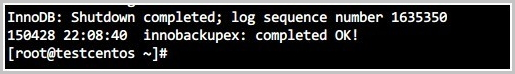

# MySQL的数据库备份与恢复

# 一、前言 

我们试着想一想, 在生产环境中什么最重要？如果我们服务器的硬件坏了可以维修或者换新, 软件问题可以修复或重新安装, 但是如果数据没了呢？这可能是最恐怖的事情了吧, 我感觉在生产环境中应该没有什么比数据跟更为重要. 那么我们该如何保证数据不丢失、或者丢失后可以快速恢复呢？只要看完这篇, 大家应该就能对MySQL中实现数据备份和恢复能有一定的了解。

# 二、为什么需要备份数据？ 

其实在前言中也大概说明了为什么要备份数据, 但是我们还是应该具体了解一下为什么要备份数据

在生产环境中我们数据库可能会遭遇各种各样的不测从而导致数据丢失, 大概分为以下几种.

- 硬件故障
- 软件故障
- 自然灾害
- 黑客攻击
- 误操作 (占比最大)

所以, 为了在数据丢失之后能够恢复数据, 我们就需要定期的备份数据, 备份数据的策略要根据不同的应用场景进行定制, 大致有几个参考数值, 我们可以根据这些数值从而定制符合特定环境中的数据备份策略

- 能够容忍丢失多少数据
- 恢复数据需要多长时间
- 需要恢复哪一些数据

# 三、数据的备份类型 

数据的备份类型根据其自身的特性主要分为以下几组

- 完全备份：指的是备份整个数据集( 即整个数据库 )
- 部分备份：指的是备份部分数据集(例如: 只备份一个表)
  - 增量备份：指的是备份自上一次备份以来(增量或完全)以来变化的数据; 特点: 节约空间、还原麻烦 
  - 差异备份：指的是备份自上一次完全备份以来变化的数据 特点: 浪费空间、还原比增量备份简单


# 四、MySQL备份数据的方式 

在MySQl中我们备份数据一般有几种方式

- 热备份：指的是当数据库进行备份时, 数据库的读写操作均不是受影响 
- 温备份：指的是当数据库进行备份时, 数据库的读操作可以执行, 但是不能执行写操作 
- 冷备份：指的是当数据库进行备份时, 数据库不能进行读写操作, 即数据库要下线

MySQL中进行不同方式的备份还要考虑存储引擎是否支持

|      | MyISAM | InnoDB |
| ---- | ------ | ------ |
| 热备 | ×      | √      |
| 温备 | √      | √      |
| 冷备 | √      | √      |

我们在考虑完数据在备份时, 数据库的运行状态之后还需要考虑对于MySQL数据库中数据的备份方式

物理备份一般就是通过tar,cp等命令直接打包复制数据库的数据文件达到备份的效果 

逻辑备份一般就是通过特定工具从数据库中导出数据并另存备份(逻辑备份会丢失数据精度)

- 物理备份
- 逻辑备份

# 五、备份需要考虑的问题 

一般情况下, 我们需要备份的数据分为以下几种

- 数据
- 二进制日志, InnoDB事务日志
- 代码(存储过程、存储函数、触发器、事件调度器)
- 服务器配置文件

# 六、备份工具 

这里我们列举出常用的几种备份工具 

- mysqldump : 逻辑备份工具, 适用于所有的存储引擎, 支持温备、完全备份、部分备份、对于InnoDB存储引擎支持热备 
- cp, tar 等归档复制工具: 物理备份工具, 适用于所有的存储引擎, 冷备、完全备份、部分备份 
- lvm2 snapshot: 几乎热备, 借助文件系统管理工具进行备份 
- mysqlhotcopy: 名不副实的的一个工具, 几乎冷备, 仅支持MyISAM存储引擎 
- xtrabackup: 一款非常强大的InnoDB/XtraDB热备工具, 支持完全备份、增量备份, 由percona提供

# 七、设计合适的备份策略 

针对不同的场景下, 我们应该制定不同的备份策略对数据库进行备份, 一般情况下, 备份策略一般为以下三种

- 直接cp,tar复制数据库文件
- mysqldump+复制BIN LOGS
- lvm2快照+复制BIN LOGS
- xtrabackup

以上的几种解决方案分别针对于不同的场景

1. 如果数据量较小, 可以使用第一种方式, 直接复制数据库文件
2. 如果数据量还行, 可以使用第二种方式, 先使用mysqldump对数据库进行完全备份, 然后定期备份BINARY LOG达到增量备份的效果
3. 如果数据量一般, 而又不过分影响业务运行, 可以使用第三种方式, 使用lvm2的快照对数据文件进行备份, 而后定期备份BINARY LOG达到增量备份的效果
4. 如果数据量很大, 而又不过分影响业务运行, 可以使用第四种方式, 使用xtrabackup进行完全备份后, 定期使用xtrabackup进行增量备份或差异备份

# 八、实战演练 

## 1、使用cp进行备份 

我们这里使用的是使用yum安装的mysql-5.1的版本, 使用的数据集为从网络上找到的一个员工数据库

查看数据库的信息

```
mysql> SHOW DATABASES;    #查看当前的数据库, 我们的数据库为employees
+--------------------+
| Database          |
+--------------------+
| information_schema |
| employees          |
| mysql              |
| test              |
+--------------------+
4 rows in set (0.00 sec)

mysql> USE employees;
Database changed
mysql> SHOW TABLES;        #查看当前库中的表
+---------------------+
| Tables_in_employees |
+---------------------+
| departments        |
| dept_emp            |
| dept_manager        |
| employees          |
| salaries            |
| titles              |
+---------------------+
6 rows in set (0.00 sec)

mysql> SELECT COUNT(*) FROM employees;  #由于篇幅原因, 我们这里只看一下employees的行数为300024
+----------+
| COUNT(*) |
+----------+
|  300024 |
+----------+
1 row in set (0.05 sec)
```

向数据库施加读锁

```
mysql> FLUSH TABLES WITH READ LOCK;    #向所有表施加读锁
Query OK, 0 rows affected (0.00 sec)
```

备份数据文件

```
mkdir /backup  #创建文件夹存放备份数据库文件
cp -a /var/lib/mysql/* /backup    #保留权限的拷贝源数据文件
ls /backup  #查看目录下的文件
employees  ibdata1  ib_logfile0  ib_logfile1  mysql  mysql.sock  test
```

模拟数据丢失并恢复 

```
rm -rf /var/lib/mysql/*    #删除数据库的所有文件
service mysqld restart  #重启MySQL, 如果是编译安装的应该不能启动, 如果rpm安装则会重新初始化数据库
mysql> SHOW DATABASES;    #因为我们是rpm安装的, 连接到MySQL进行查看, 发现数据丢失了！
+--------------------+
| Database          |
+--------------------+
| information_schema |
| mysql              |
| test              |
+--------------------+
3 rows in set (0.00 sec)

rm -rf /var/lib/mysql/*    #这一步可以不做
cp -a /backup/* /var/lib/mysql/    #将备份的数据文件拷贝回去
service mysqld restart  #重启MySQL

#重新连接数据并查看

mysql> SHOW DATABASES;    #数据库已恢复
+--------------------+
| Database          |
+--------------------+
| information_schema |
| employees          |
| mysql              |
| test              |
+--------------------+
4 rows in set (0.00 sec)

mysql> USE employees;      

mysql> SELECT COUNT(*) FROM employees;    #表的行数没有变化
+----------+
| COUNT(*) |
+----------+
|  300024 |
+----------+
1 row in set (0.06 sec)
```

## 2、使用mysqldump+复制BINARY LOG备份 

我们这里使用的是使用yum安装的mysql-5.1的版本, 使用的数据集为从网络上找到的一个员工数据库

我们通过mysqldump进行一次完全备份, 再修改表中的数据, 然后再通过binary log进行恢复 二进制日志需要在mysql配置文件中添加 log_bin=on 开启

### mysqldump命令介绍

mysqldump是一个客户端的逻辑备份工具, 可以生成一个重现创建原始数据库和表的SQL语句, 可以支持所有的存储引擎, 对于InnoDB支持热备

[官方文档介绍](http://dev.mysql.com/doc/refman/5.7/en/mysqldump.html)

```
#基本语法格式

shell> mysqldump [options] db_name [tbl_name ...]    恢复需要手动CRATE DATABASES
shell> mysqldump [options] --databases db_name ...  恢复不需要手动创建数据库
shell> mysqldump [options] --all-databases          恢复不需要手动创建数据库

其他选项:
    -E, --events: 备份事件调度器
    -R, --routines: 备份存储过程和存储函数
    --triggers: 备份表的触发器; --skip-triggers 
    --master-date[=value]  
        1: 记录为CHANGE MASTER TO 语句、语句不被注释
        2: 记录为注释的CHANGE MASTER TO语句
        基于二进制还原只能全库还原

    --flush-logs: 日志滚动
        锁定表完成后执行日志滚动
```

查看数据库的信息

```
mysql> SHOW DATABASES;    #查看当前的数据库, 我们的数据库为employees
+--------------------+
| Database          |
+--------------------+
| information_schema |
| employees          |
| mysql              |
| test              |
+--------------------+
4 rows in set (0.00 sec)

mysql> USE employees;
Database changed
mysql> SHOW TABLES;        #查看当前库中的表
+---------------------+
| Tables_in_employees |
+---------------------+
| departments        |
| dept_emp            |
| dept_manager        |
| employees          |
| salaries            |
| titles              |
+---------------------+
6 rows in set (0.00 sec)

mysql> SELECT COUNT(*) FROM employees;  #由于篇幅原因, 我们这里只看一下employees的行数为300024
+----------+
| COUNT(*) |
+----------+
|  300024 |
+----------+
1 row in set (0.05 sec)
```

### 使用mysqldump备份数据库 

```
mysql -uroot -p -e 'SHOW MASTER STATUS'  #查看当前二进制文件的状态, 并记录下position的数字
+------------------+----------+--------------+------------------+
| File            | Position | Binlog_Do_DB | Binlog_Ignore_DB |
+------------------+----------+--------------+------------------+
| mysql-bin.000003 |      106 |              |                  |
+------------------+----------+--------------+------------------+

mysqldump --all-databases --lock-all-tables  > backup.sql  #备份数据库到backup.sql文件中

mysql> CREATE DATABASE TEST1;  #创建一个数据库
Query OK, 1 row affected (0.00 sec)

mysql> SHOW MASTER STATUS;  #记下现在的position
+------------------+----------+--------------+------------------+
| File            | Position | Binlog_Do_DB | Binlog_Ignore_DB |
+------------------+----------+--------------+------------------+
| mysql-bin.000003 |      191 |              |                  |
+------------------+----------+--------------+------------------+
1 row in set (0.00 sec)

cp /var/lib/mysql/mysql-bin.000003 /root  #备份二进制文件
service mysqld stop  #停止MySQL
rm -rf /var/lib/mysql/*  #删除所有的数据文件
service mysqld start    #启动MySQL, 如果是编译安装的应该不能启动(需重新初始化), 如果rpm安装则会重新初始化数据库


mysql> SHOW DATABASES;  #查看数据库, 数据丢失!
+--------------------+
| Database          |
+--------------------+
| information_schema |
| mysql              |
| test              |
+--------------------+
3 rows in set (0.00 sec)

mysql> SET sql_log_bin=OFF;  #暂时先将二进制日志关闭  
Query OK, 0 rows affected (0.00 sec)


mysql> source backup.sql  #恢复数据，所需时间根据数据库时间大小而定

mysql> SET sql_log_bin=ON; 开启二进制日志

mysql> SHOW DATABASES;  #数据库恢复, 但是缺少TEST1
+--------------------+
| Database          |
+--------------------+
| information_schema |
| employees          |
| mysql              |
| test              |
+--------------------+
4 rows in set (0.00 sec)

mysqlbinlog --start-position=106 --stop-position=191 mysql-bin.000003 | mysql employees #通过二进制日志增量恢复数据

mysql> SHOW DATABASES;    #现在TEST1出现了！
+--------------------+
| Database          |
+--------------------+
| information_schema |
| TEST1              |
| employees          |
| mysql              |
| test              |
+--------------------+
5 rows in set (0.00 sec)

```

## 3、使用lvm2快照备份数据 

做实验之前我们先回顾一下lvm2-snapshot的知识

LVM快照简单来说就是将所快照源分区一个时间点所有文件的元数据进行保存，如果源文件没有改变，那么访问快照卷的相应文件则直接指向源分区的源文件，如果源文件发生改变，则快照卷中与之对应的文件不会发生改变。快照卷主要用于辅助备份文件。 这里只简单介绍，点击查看详细介绍

**部署lvm环境** 

```
添加硬盘; 这里我们直接实现SCSI硬盘的热插拔, 首先在虚拟机中添加一块硬盘, 不重启

ls /dev/sd*  #只有以下几块硬盘, 但是我们不重启可以让系统识别新添加的硬盘
/dev/sda  /dev/sda1  /dev/sda2

echo '- - -' > /sys/class/scsi_host/host0/scan 
echo '- - -' > /sys/class/scsi_host/host1/scan 
echo '- - -' > /sys/class/scsi_host/host2/scan 

ls /dev/sd*    #看！sdb识别出来了
/dev/sda  /dev/sda1  /dev/sda2  /dev/sdb

fdisk /dev/sdb  #分区,步骤省略

partx -a /dev/sdb  
BLKPG: Device or resource busy
error adding partition 1

##创建逻辑卷
pvcreate /dev/sdb1
  Physical volume "/dev/sdb1" successfully created
vgcreate myvg /dev/sdb1 
  Volume group "myvg" successfully created
lvcreate -n mydata -L 5G myvg 
  Logical volume "mydata" created.

mkfs.ext4 /dev/mapper/myvg-mydata  #格式化
mkdir /lvm_data
mount /dev/mapper/myvg-mydata /lvm_data  #挂载到/lvm_data


vim /etc/my.cnf    #修改mysql配置文件的datadir如下

datadir=/lvm_data

service mysqld restart  #重启MySQL

####重新导入employees数据库########略过####
```

**查看数据库的信息**

```
mysql> SHOW DATABASES;    #查看当前的数据库, 我们的数据库为employees
+--------------------+
| Database          |
+--------------------+
| information_schema |
| employees          |
| mysql              |
| test              |
+--------------------+
4 rows in set (0.00 sec)

mysql> USE employees;
Database changed
mysql> SHOW TABLES;        #查看当前库中的表
+---------------------+
| Tables_in_employees |
+---------------------+
| departments        |
| dept_emp            |
| dept_manager        |
| employees          |
| salaries            |
| titles              |
+---------------------+
6 rows in set (0.00 sec)

mysql> SELECT COUNT(*) FROM employees;  #由于篇幅原因, 我们这里只看一下employees的行数为300024
+----------+
| COUNT(*) |
+----------+
|  300024 |
+----------+
1 row in set (0.05 sec)
```

创建快照卷并备份

```
mysql> FLUSH TABLES WITH READ LOCK;    #锁定所有表
Query OK, 0 rows affected (0.00 sec)

[root@node1 lvm_data]# lvcreate -L 1G -n mydata-snap -p r -s /dev/mapper/myvg-mydata  #创建快照卷
  Logical volume "mydata-snap" created.

mysql> UNLOCK TABLES;  #解锁所有表
Query OK, 0 rows affected (0.00 sec)

[root@node1 lvm_data]# mkdir /lvm_snap  #创建文件夹
[root@node1 lvm_data]# mount /dev/myvg/mydata-snap /lvm_snap/  #挂载snap
mount: block device /dev/mapper/myvg-mydata--snap is write-protected, mounting read-only

[root@node1 lvm_data]# cd /lvm_snap/
[root@node1 lvm_snap]# ls
employees  ibdata1  ib_logfile0  ib_logfile1  mysql  mysql-bin.000001  mysql-bin.000002  mysql-bin.000003  mysql-bin.index  test
[root@node1 lvm_snap]# tar cf /tmp/mysqlback.tar *  #打包文件到/tmp/mysqlback.tar

umount /lvm_snap/  #卸载snap
lvremove myvg mydata-snap  #删除snap
```

恢复数据 

```
[root@node1 lvm_snap]# rm -rf /lvm_data/*
service mysqld start    #启动MySQL, 如果是编译安装的应该不能启动(需重新初始化), 如果rpm安装则会重新初始化数据库


mysql> SHOW DATABASES;  #查看数据库, 数据丢失!
+--------------------+
| Database          |
+--------------------+
| information_schema |
| mysql              |
| test              |
+--------------------+
3 rows in set (0.00 sec)

cd /lvm_data/
[root@node1 lvm_data]# rm -rf * #删除所有文件
[root@node1 lvm_data]# tar xf /tmp/mysqlback.tar    #解压备份数据库到此文件夹 
[root@node1 lvm_data]# ls  #查看当前的文件
employees  ibdata1  ib_logfile0  ib_logfile1  mysql  mysql-bin.000001  mysql-bin.000002  mysql-bin.000003  mysql-bin.index  test

mysql> SHOW DATABASES;  #数据恢复了
+--------------------+
| Database          |
+--------------------+
| information_schema |
| employees          |
| mysql              |
| test              |
+--------------------+
4 rows in set (0.00 sec)

##完成
```

## 4、使用Xtrabackup备份 

# 九、阿里云RDS MYSQL物理备份恢复

## 1、全量全库恢复

**以恢复RDS MySQL 5.6到ubuntu 18.04中为例**

### ①下载物理备份文件

在阿里云控制台RSD实例的备份与恢复页面下载要恢复的物理备份文件

### ②解压

**解压后文件很大，注意磁盘容量**

```bash
tar -izxvf <数据备份文件名>.tar.gz -C /data/mysql/data
```

### ③安装Percona XtraBackup

注意Percona XtraBackup版本

- MySQL 5.6及之前的版本需要安装 Percona XtraBackup 2.3，安装指导请参见官方文档[Percona XtraBackup 2.3](https://www.percona.com/doc/percona-xtrabackup/2.3/installation.html)。
- MySQL 5.7版本需要安装 Percona XtraBackup 2.4，安装指导请参见官方文档[Percona XtraBackup 2.4](https://www.percona.com/doc/percona-xtrabackup/2.4/installation.html)。
- MySQL 8.0版本需要安装 Percona XtraBackup 8.0，安装指导请参见官方文档[Percona XtraBackup 8.0](https://www.percona.com/doc/percona-xtrabackup/8.0/installation.html)。

```bash
# ubuntu 安装Percona XtraBackup2.3
wget https://repo.percona.com/apt/percona-release_0.1-6.$(lsb_release -sc)_all.deb
dpkg -i percona-release_0.1-6.bionic_all.deb
apt-get update
apt-get install percona-xtrabackup

# CentOS 安装Percona XtraBackup2.3
yum install -y perl rsync perl-Data-Dumper
wget https://www.percona.com/downloads/XtraBackup/Percona-XtraBackup-2.3.5/binary/redhat/7/x86_64/percona-xtrabackup-2.3.5-1.el7.x86_64.rpm
yum clean all 
yum repolist
yum localinstall percona-xtrabackup-2.3.2-1.el7.x86_64.rpm
```

### ④安装MySQL

Deb安装

```bash
# 安装MySQL 5.6 
wget https://downloads.mysql.com/archives/get/p/23/file/mysql-community-server_5.6.46-1debian8_amd64.deb
wget https://downloads.mysql.com/archives/get/p/23/file/mysql-community-client_5.6.46-1debian8_amd64.deb
wget https://downloads.mysql.com/archives/get/p/23/file/mysql-server_5.6.46-1debian8_amd64.deb
wget https://downloads.mysql.com/archives/get/p/23/file/mysql-client_5.6.46-1debian8_amd64.deb
dpkg -i mysql*
```

YUM 安装

```bash
bash -c 'cat > /etc/yum.repos.d/mysql.repo <<EOF
[MySQL-Community-5.6]
name=MySQL Community 5.6
baseurl=https://mirrors.ustc.edu.cn/mysql-repo/yum/mysql-5.6-community/el/7/x86_64/
enabled=1
gpgcheck=0
EOF' && \
yum clean all 
yum install mysql mysql-server
```

### ⑤恢复解压后的备份文件

```bash
## MySQL 5.6/5.7
innobackupex --defaults-file=/data/mysql/data/backup-my.cnf --apply-log /data/mysql/data
## MySQL 8.0
xtrabackup --prepare --target-dir=/data/mysql/data
xtrabackup --datadir=/var/lib/mysql --copy-back --target-dir=/home/mysql/data
```

若系统返回如下类似结果，则说明备份文件已成功恢复到自建数据库



修改解压后文件的权限

```bash
chown -R mysql.mysql /data/mysql/data
```

### ⑥修改配置参数

修改/data/mysql/data/backup-my.cnf中的配置参数，自建数据库不支持如下参数，需要注释掉。

```bash
#innodb_log_checksum_algorithm
#innodb_fast_checksum
#innodb_log_block_size
#innodb_doublewrite_file
#rds_encrypt_data
#innodb_encrypt_algorithm
#redo_log_version
#master_key_id
#server_uuid
```

修改过后的配置文件

```bash
[mysqld]
innodb_checksum_algorithm=innodb
#innodb_log_checksum_algorithm=innodb
innodb_data_file_path=ibdata1:200M:autoextend
innodb_log_files_in_group=2
innodb_log_file_size=524288000
#innodb_fast_checksum=false
innodb_page_size=16384
#innodb_log_block_size=512
innodb_undo_directory=.
innodb_undo_tablespaces=0
#rds_encrypt_data=false
#innodb_encrypt_algorithm=aes_128_ecb

skip-grant-tables
```

### ⑦启动

```bash
mysqld_safe --defaults-file=/data/mysql/data/backup-my.cnf --user=mysql --datadir=/data/mysql/data
```

启动的日志会放在`/data/mysql/data/主机名.err`文件中，如果没有“ERR”级别报错，即启动成功。

### ⑧修改root密码

- 由于上一步中MySQL配置文件中添加`skip-grant-tables`,此时，是可以不用输入密码就可以登录

- 如果原始数据库中，root用户没有远程登录权限，可在跳过密码验证阶段，使用navicat连接上后，直接在界面更新mysql.user的root用户localhost为root用户%的权限。或者使用以下SQL进行重置

  ```bash
  mysql -u root -p
  mysql > use mysql 
  mysql > update user set PASSWORD = PASSWORD('***新密码***') where user = 'root';
  mysql > flush privileges;
  ```

- 修改完成后，将配置文件中的`skip-grant-tables`删掉，禁止跳过密码登录，重新部署启动。

  ```bash
  mysql -u root -h127.0.0.1 -p
  mysql > GRANT ALL PRIVILEGES ON *.* TO root@"%" IDENTIFIED BY '**新密码***' WITH GRANT OPTION;
  mysql > flush privileges;
  ```

  

## 2、单表物理.ibd文件恢复

MySQL 5.6 版本引入了可传输表空间(transportable tablespace) 的方法，可以通过导出 + 导入表空间的方式，实现物理拷贝表的功能。

- **.frm文件**：保存了每个表的元数据，包括表结构的定义等，该文件与数据库引擎无关。

- **.ibd文件**：InnoDB引擎开启了独立表空间(my.ini中配置innodb_file_per_table = 1)产生的存放该表的数据和索引的文件

**以恢复到本地电脑MySQL 5.6中为例**

### ①解压要恢复的表.ibd文件

```bash
# 查看压缩文件中的内容
tar -tf 备份文件

# 解压指定库名表名的物理文件
tar -zxvf 备份文件 --occurrence 库名/表名.ibd
## --occurrence参数默认会在解压到第一次匹配的文件后不再处理后续解压。极大节省了解压时间
```

### ②安装MySQL 5.6

MacOS

```bash
# 安装
brew install mysql@5.6
# 启动
/usr/local/opt/mysql@5.6/bin/mysql.server start
# 登录
mysql -uroot
```

### ③新建相同表结构 

  ```bash
mysql> create database DB名（可随意）;
mysql> use DB名 ;

# 这个时候会生成 frm ， ibd 文件
  ```
### ④获取源表的创建语句并创建表
  ```bash
# 获取源表的创建语句并创建表
mysql> create table 表名 
  ```
### ⑤删除表空间

  ```bash
Alter table 表名  discard tablespace
  ```
### ⑥复制 ibd 文件到MySQL 文件目录下

  ```bash
mv 表名.ibd /usr/local/var/mysql/库名
  ```
### ⑦导入表空间

  ```
alter table 表名 import tablespace
  ```

>  **导入表时如果报`Error Code: 1808. Schema mismatch (Table has ROW_TYPE_DYNAMIC row format, .ibd file has ROW_TYPE_COMPACT row format.`的错误，则在建表语句后加上`ROW_FORMAT=COMPACT`重新来一遍上面的操作。**

### ⑧验证

登录本地数据库即可看到恢复的单个表的数据

# 十、总结

| 备份方法   | 备份速度 | 恢复速度 | 便捷性                           | 功能 | 一般用于           |
| ---------- | -------- | -------- | -------------------------------- | ---- | ------------------ |
| cp         | 快       | 快       | 一般、灵活性低                   | 很弱 | 少量数据备份       |
| mysqldump  | 慢       | 慢       | 一般、可无视存储引擎的差异       | 一般 | 中小型数据量的备份 |
| lvm2快照   | 快       | 快       | 一般、支持几乎热备、速度快       | 一般 | 中小型数据量的备份 |
| xtrabackup | 较快     | 较快     | 实现innodb热备、对存储引擎有要求 | 强大 | 较大规模的备份     |