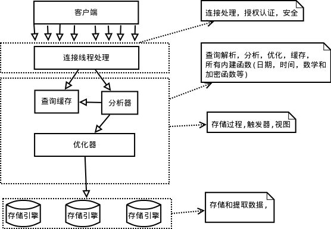
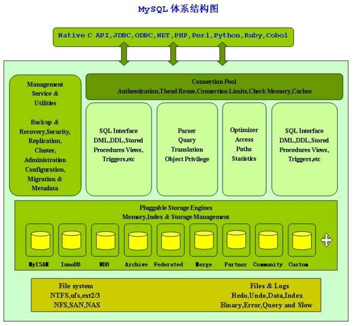
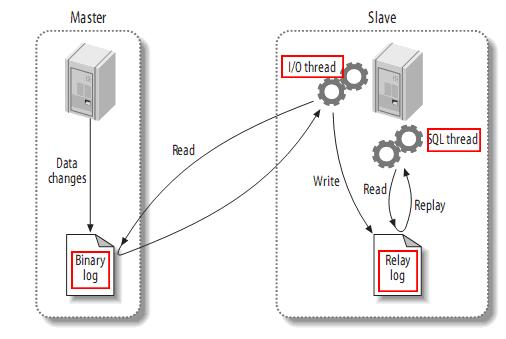
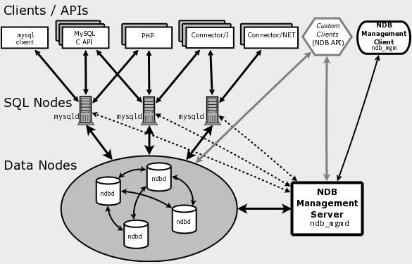

# MySQL

# 一、简介

## 逻辑架构图

**每个虚线框为一层，总共三层。**

**第一层，服务层(为客户端服务):为请求做连接处理，授权认证，安全等。**

**第二层，核心层:查询解析，分析，优化，缓存，提供内建函数（例如：日期，时间，数学和加密）;所有跨存储引擎的功能都在这一层实现：存储过程，触发器，视图。**

**第三层，存储引擎层，不光做存储和提取数据，而且针对特殊数据引擎还要做事务处理。第二层通过API与存储引擎通信，但存储引擎不会解析SQL，不同存储引擎之间不进行通信。**

**1、对于Select语句，在解析查询之前，服务器会先检查查询缓存。**

**2、通过读写锁实现并发控制。读写锁分为两类：共享锁（读锁）和排他锁（写锁）。读锁是共享的，多个客户端在同一时间可以同时读取同一资源。写锁是排他的的，也就是在一个写锁会阻塞读锁和写锁的，确保在给定的时间里，只有一个用户能写入，其他用户则禁止读和写。**

**3、锁粒度：表锁和行级锁。行级锁只能在存储引擎中实现。**

# 二、主从复制

MySQL内建的复制功能是构建大型，高性能应用程序的基础。将Mysql的数据分布到多个系统上去，这种分布的机制，是通过将Mysql的某一台主机的数据复制到其它主机（slaves）上，并重新执行一遍来实现的。复制过程中一个服务器充当主服务器，而一个或多个其它服务器充当从服务器。主服务器将更新写入二进制日志文件，并维护文件的一个索引以跟踪日志循环。这些日志可以记录发送到从服务器的更新。当一个从服务器连接主服务器时，它通知主服务器从服务器在日志中读取的最后一次成功更新的位置。从服务器接收从那时起发生的任何更新，然后封锁并等待主服务器通知新的更新。

请注意当你进行复制时，所有对复制中的表的更新必须在主服务器上进行。否则，你必须要小心，以避免用户对主服务器上的表进行的更新与对从服务器上的表所进行的更新之间的冲突。

## mysql支持的复制类型：

- **基于语句的复制**： 在主服务器上执行的SQL语句，在从服务器上执行同样的语句。MySQL默认采用基于语句的复制，效率比较高。 一旦发现没法精确复制时，  会自动选着基于行的复制。  
- **基于行的复制**：把改变的内容复制过去，而不是把命令在从服务器上执行一遍. 从mysql5.0开始支持
- **混合类型的复制**: 默认采用基于语句的复制，一旦发现基于语句的无法精确的复制时，就会采用基于行的复制。

## 复制解决的问题

MySQL复制技术有以下一些特点：

- 数据分布 (Data distribution )
- 负载平衡(load balancing)
- 备份(Backups) 
- 高可用性和容错行 (High availability and failover )

## 复制如何工作 

整体上来说，复制有3个步骤：  

1. master将改变记录到二进制日志(binary log)中（这些记录叫做二进制日志事件，binary log events）；
2. slave将master的binary log events拷贝到它的中继日志(relay log)；

3. slave重做中继日志中的事件，将改变反映它自己的数据。

​     该过程的第一部分就是master记录二进制日志。在每个事务更新数据完成之前，master在二日志记录这些改变。MySQL将事务串行的写入二进制日志，即使事务中的语句都是交叉执行的。在事件写入二进制日志完成后，master通知存储引擎提交事务。
​    下一步就是slave将master的binary log拷贝到它自己的中继日志。首先，slave开始一个工作线程——I/O线程。I/O线程在master上打开一个普通的连接，然后开始binlog dump process。Binlog dump process从master的二进制日志中读取事件，如果已经跟上master，它会睡眠并等待master产生新的事件。I/O线程将这些事件写入中继日志。
​    SQL slave thread（SQL从线程）处理该过程的最后一步。SQL线程从中继日志读取事件，并重放其中的事件而更新slave的数据，使其与master中的数据一致。只要该线程与I/O线程保持一致，中继日志通常会位于OS的缓存中，所以中继日志的开销很小。
​    此外，在master中也有一个工作线程：和其它MySQL的连接一样，slave在master中打开一个连接也会使得master开始一个线程。复制过程有一个很重要的限制——复制在slave上是串行化的，也就是说master上的并行更新操作不能在slave上并行操作。

## 复制配置

有两台**MySQL[数据库](http://lib.csdn.net/base/mysql)**服务器Master和slave，Master为主服务器，slave为从服务器，初始状态时，Master和slave中的数据信息相同，当Master中的数据发生变化时，slave也跟着发生相应的变化，使得master和slave的数据信息同步，达到备份的目的。

要点：
负责在主、从服务器传输各种修改动作的媒介是主服务器的二进制变更日志，这个日志记载着需要传输给从服务器的各种修改动作。因此，主服务器必须激活二进制日志功能。从服务器必须具备足以让它连接主服务器并请求主服务器把二进制变更日志传输给它的权限。

# 三、集群模式

MySQL Cluster 是MySQL 适合于分布式计算环境的高实用、可拓展、高性能、高冗余版本，其研发设计的初衷就是要满足许多行业里的最严酷应用要求，这些应用中经常要求数据库运行的可靠性要达到99.999%。MySQL Cluster允许在无共享的系统中部署“内存中”数据库集群，通过无共享体系结构，系统能够使用廉价的硬件，而且对软硬件无特殊要求。此外，由于每个组件有自己的内存和磁盘，不存在单点故障。

实际上，MySQL集群是把一个叫做NDB的内存集群存储引擎集成与标准的MySQL服务器集成。它包含一组计算机，每个都跑一个或者多个进程，这可能包括一个MySQL服务器，一个数据节点，一个管理服务器和一个专有的一个数据访问程序。

MySQL Cluster能够使用多种故障切换和负载平衡选项配置NDB存储引擎，但在Cluster 级别上的存储引擎上做这个最简单。以下为MySQL集群结构关系图，

MySQL从结构看，由3类节点(计算机或进程)组成，分别是：

- 管理节点:用于给整个集群其他节点提供配置、管理、仲裁等功能。理论上通过一台服务器提供服务就可以了。
- 数据节点:MySQL Cluster的核心，存储数据、日志，提供数据的各种管理服务。2个以上 时就能实现集群的高可用保证，DB节点增加时，集群的处理速度会变慢。
- SQL节点(API):用于访问MySQL Cluster数据，提供对外应用服务。增加 API 节点会提高整个集群的并发访问速度和整体的吞吐量，该节点 可以部署在Web应用服务器上，也可以部署在专用的服务器上，也开以和DB部署在 同一台服务器上。

## **NDB引擎**

MySQL Cluster 使用了一个专用的基于内存的存储引擎——NDB引擎，这样做的好处是速度快， 没有磁盘I/O的瓶颈，但是由于是基于内存的，所以数据库的规模受系统总内存的限制， 如果运行NDB的MySQL服务器一定要内存够大，比如4G, 8G, 甚至16G。NDB引擎是分布式的，它可以配置在多台服务器上来实现数据的可靠性和扩展性，理论上 通过配置2台NDB的存储节点就能实现整个数据库集群的冗余性和解决单点故障问题。

**缺陷**  

- 基于内存，数据库的规模受集群总内存的大小限制
- 基于内存，断电后数据可能会有数据丢失，这点还需要通过测试验证。
- 多个节点通过网络实现通讯和数据同步、查询等操作，因此整体性受网络速度影响，因此速度也比较慢

**2.2 优点**

- 多个节点之间可以分布在不同的地理位置，因此也是一个实现分布式数据库的方案 
- 扩展性很好，增加节点即可实现数据库集群的扩展。

- 冗余性很好，多个节点上都有完整的数据库数据，因此任何一个节点宕机都不会造成服务中断。

实现高可用性的成本比较低，不象传统的高可用方案一样需要共享的存储设备和专用的软件才能实现，NDB 只要有足够的内存就能实现。

# 四、存储引擎

1、在文件系统中，MySQL会将每一个数据库保存为数据目录下的一个子目录。创建表时，MySQL会在数据库子目录下创建一个和表同名的.frm文件保存表的定义。

2、MySQL使用文件系统的目录和文件来保存数据库和表的定义，大小写敏感和具体的平台密切相关。在Windows中，大小写是不敏感的；但在类Unix中则大小写敏感。

3、不同的存储引擎保存数据和索引的方式是不同的，但表的定义则是在MySQL的服务层统一处理的。

4、MySQL在5.1及之前的版本中，MyISAM是默认的存储引擎，之后默认的是InnoDB。MyISAM存储引擎不支持事务和行级锁。所以不要再默认使用MyISAM，而应默认使用InnoDB。

5、MySQL内建的其他存储引擎：

- Archive引擎，只支持Insert和Select操作。但支持行级锁和专用的缓冲区
- Blackhole引擎
- CSV引擎，可以将普通的CSV文件作为MySQL的表处理，但这种表不支持索引。CSV引擎可以在数据库运行时拷入或拷出文件。可以将Excel文件存储为CSV文件，然后复制到MySQL数据目录中，就能在MySQL中打开使用。同样，如果将数据写入到一个CSV引擎表，其他的外部程序也能立即从表的数据文件中读取CSV格式的数据。
- Federated引擎,是访问其他MySQL服务器的一个代理，它会创建一个到远程MySQL服务器的客户端连接，并将查询传输到远程服务器执行，然后提取或者发送需要的数据。
- Memory引擎。所有的数据都保存在内存中，Memory表的结构在重启后还是会保留，但数据会丢失。
- Merge引擎。MyISAM引擎的一个变种。Merge表是有多个MyISAM表合并而来的虚拟表
- NDB引擎。MySQL集群的存储引擎。

# 五、多版本并发控制MVCC

1、MVCC的实现是通过保存数据在某个时间点的快照来实现。

2、不同存储引擎的MVCC实现是不同的。典型的有乐观（optimistic）控制和悲观（pessimistic）控制

3、MVCC只在REPEATABLE READ 和READ COMMITTED两个隔离级别下工作。

   其他两个隔离级别都不和MVCC兼容。是因为，READ UNCOMMITED总是读取最新的数据行，而不是读取符合当前事务版本的数据行，而SERIALIZABLE则会在所有读取的行都加锁。

4、InnoDB的MVCC通过在每行记录后面保存两个隐藏的列来实现的，一列保存了行的创建时间，一列保存行的过期时间（或删除时间），存储的并不是实际的时间值，而是系统版本号（System Version Number）。没开始一个新的事务，系统版本号会自动递增。事务开始时刻的系统版本号会作为事务的版本号，用来和查询到的每行记录的版本号进行对比。

# 六、示例数据

| Title                                                        | DB Download                                                  | HTML Setup Guide                                    |
| :----------------------------------------------------------- | :----------------------------------------------------------- | :-------------------------------------------------- |
| employee data (large dataset, includes data and test/verification suite) | [GitHub](https://github.com/datacharmer/test_db)             | [View](https://dev.mysql.com/doc/employee/en/)      |
| world database                                               | [TGZ](https://downloads.mysql.com/docs/world-db.tar.gz) \| [Zip](https://downloads.mysql.com/docs/world-db.zip) | [View](https://dev.mysql.com/doc/world-setup/en/)   |
| world_x database                                             | [TGZ](https://downloads.mysql.com/docs/world_x-db.tar.gz) \| [Zip](https://downloads.mysql.com/docs/world_x-db.zip) | [View](https://dev.mysql.com/doc/world-x-setup/en/) |
| sakila database                                              | [TGZ](https://downloads.mysql.com/docs/sakila-db.tar.gz) \| [Zip](https://downloads.mysql.com/docs/sakila-db.zip) | [View](https://dev.mysql.com/doc/sakila/en/)        |
| airportdb database (large dataset, intended for MySQL on OCI and HeatWave) | [TGZ](https://downloads.mysql.com/docs/airport-db.tar.gz) \| [Zip](https://downloads.mysql.com/docs/airport-db.zip) | [View](https://dev.mysql.com/doc/airportdb/en/)     |
| menagerie database                                           | [TGZ](https://downloads.mysql.com/docs/menagerie-db.tar.gz) \| [Zip](https://downloads.mysql.com/docs/menagerie-db.zip) |                                                     |

https://dev.mysql.com/doc/index-other.html

