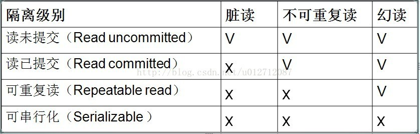

# MySQL的事务隔离级别

# 一、首先什么是事务？

事务是应用程序中一系列严密的操作，所有操作必须成功完成，否则在每个操作中所作的所有更改都会被撤消。也就是事务具有原子性，一个事务中的一系列的操作要么全部成功，要么一个都不做。

事务的结束有两种，当事务中的所以步骤全部成功执行时，事务提交。如果其中一个步骤失败，将发生回滚操作，撤消撤消之前到事务开始时的所以操作。

# 二、事务的 ACID

事务具有四个特征：原子性（ Atomicity ）、一致性（ Consistency ）、隔离性（ Isolation ）和持续性（ Durability ）。这四个特性简称为 ACID 特性。

   1 、原子性。事务是数据库的逻辑工作单位，事务中包含的各操作要么都做，要么都不做

   2 、一致性。事  务执行的结果必须是使数据库从一个一致性状态变到另一个一致性状态。因此当数据库只包含成功事务提交的结果时，就说数据库处于一致性状态。如果数据库系统  运行中发生故障，有些事务尚未完成就被迫中断，这些未完成事务对数据库所做的修改有一部分已写入物理数据库，这时数据库就处于一种不正确的状态，或者说是 不一致的状态。

   3 、隔离性。一个事务的执行不能其它事务干扰。即一个事务内部的操作及使用的数据对其它并发事务是隔离的，并发执行的各个事务之间不能互相干扰。

   4 、持续性。也称永久性，指一个事务一旦提交，它对数据库中的数据的改变就应该是永久性的。接下来的其它操作或故障不应该对其执行结果有任何影响。

# 三、Mysql的四种隔离级别

SQL标准定义了4类隔离级别，包括了一些具体规则，用来限定事务内外的哪些改变是可见的，哪些是不可见的。低级别的隔离级一般支持更高的并发处理，并拥有更低的系统开销。

- **Read Uncommitted（读取未提交内容）**

- - 在该隔离级别，所有事务都可以看到其他未提交事务的执行结果。本隔离级别很少用于实际应用，因为它的性能也不比其他级别好多少。读取未提交的数据，也被称之为脏读（Dirty Read）。

- **Read Committed（读取提交内容）**

- - 这是大多数数据库系统的默认隔离级别（但不是MySQL默认的）。它满足了隔离的简单定义：一个事务只能看见已经提交事务所做的改变。这种隔离级别 也支持所谓的不可重复读（Nonrepeatable  Read），因为同一事务的其他实例在该实例处理其间可能会有新的commit，所以同一select可能返回不同结果。

- **Repeatable Read（可重读）**

- - 这是MySQL的默认事务隔离级别，它确保同一事务的多个实例在并发读取数据时，会看到同样的数据行。不过理论上，这会导致另一个棘手的问题：幻读 （Phantom  Read）。简单的说，幻读指当用户读取某一范围的数据行时，另一个事务又在该范围内插入了新行，当用户再读取该范围的数据行时，会发现有新的“幻影”  行。InnoDB和Falcon存储引擎通过多版本并发控制（MVCC，Multiversion Concurrency  Control）机制解决了该问题。

- **Serializable（可串行化）**

- - 这是最高的隔离级别，它通过强制事务排序，使之不可能相互冲突，从而解决幻读问题。简言之，它是在每个读的数据行上加上共享锁。在这个级别，可能导致大量的超时现象和锁竞争。


这四种隔离级别采取不同的锁类型来实现，若读取的是同一个数据的话，就容易发生问题。例如：

- **脏读(Drity Read)**：某个事务已更新一份数据，另一个事务在此时读取了同一份数据，由于某些原因，前一个RollBack了操作，则后一个事务所读取的数据就会是不正确的。
- **不可重复读(Non-repeatable read)**:在一个事务的两次查询之中数据不一致，这可能是两次查询过程中间插入了一个事务更新的原有的数据。
- **幻读(Phantom Read):**在一个事务的两次查询中数据笔数不一致，例如有一个事务查询了几列(Row)数据，而另一个事务却在此时插入了新的几列数据，先前的事务在接下来的查询中，就会发现有几列数据是它先前所没有的。

​        

# 四、MySQL设置隔离级别

  **系统默认事务级别为：repeatable-read。**

   **查看事务隔离级别：**  

```
SELECT @@tx_isolation
```

**1、 服务器启动时设置级别。**

在MySQL配置文件/etc/my.cnf中设置，然后重启MySQL.

```
[mysqld]
transaction-isolation = [SERIALIZABLE |READ UNCOMMITTED | READ COMMITTED | REPEATABLE READ ]
```

**2、使用`SET TRANSACTION ISOLATION LEVEL`语句为正在运行的服务器设置。**

```bash
# 设置全局级别默认事务隔离级别，适用于从设置时起所有新建立的客户机连接。现有连接不受影响。
SET GLOBAL TRANSACTION ISOLATION LEVEL [SERIALIZABLE |READ UNCOMMITTED | READ COMMITTED | REPEATABLE READ ] ;
#设置会话级别默认事务隔离级别，如果没有显式指定，则事务隔离级别将按会话进行设置，应用于当前session内之后的所有事务。
SET SESSION TRANSACTION ISOLATION LEVEL [SERIALIZABLE |READ UNCOMMITTED | READ COMMITTED | REPEATABLE READ ];
#适用于当前session内的下一个还未开始的事务
SET TRANSACTION ISOLATION LEVEL [SERIALIZABLE |READ UNCOMMITTED | READ COMMITTED | REPEATABLE READ ];
```