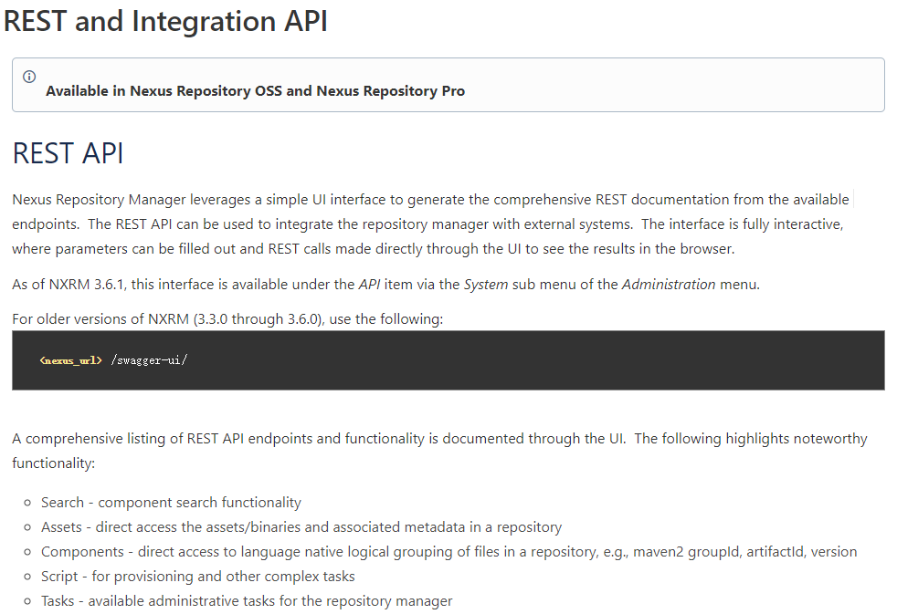
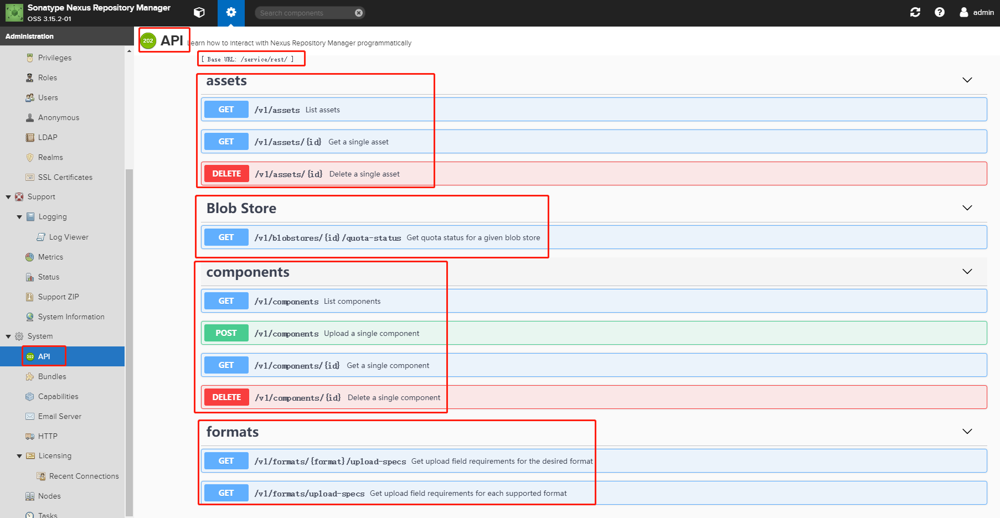
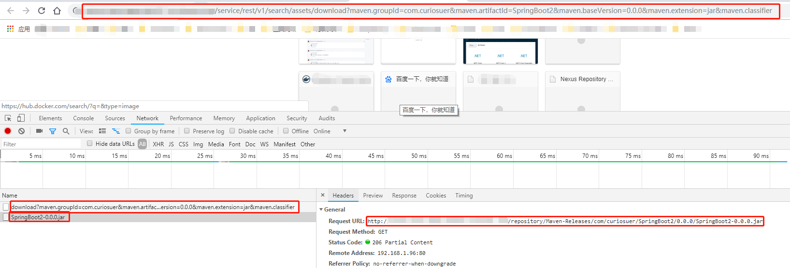
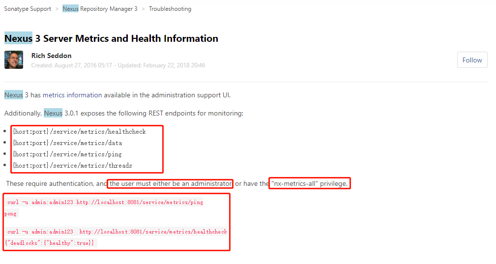
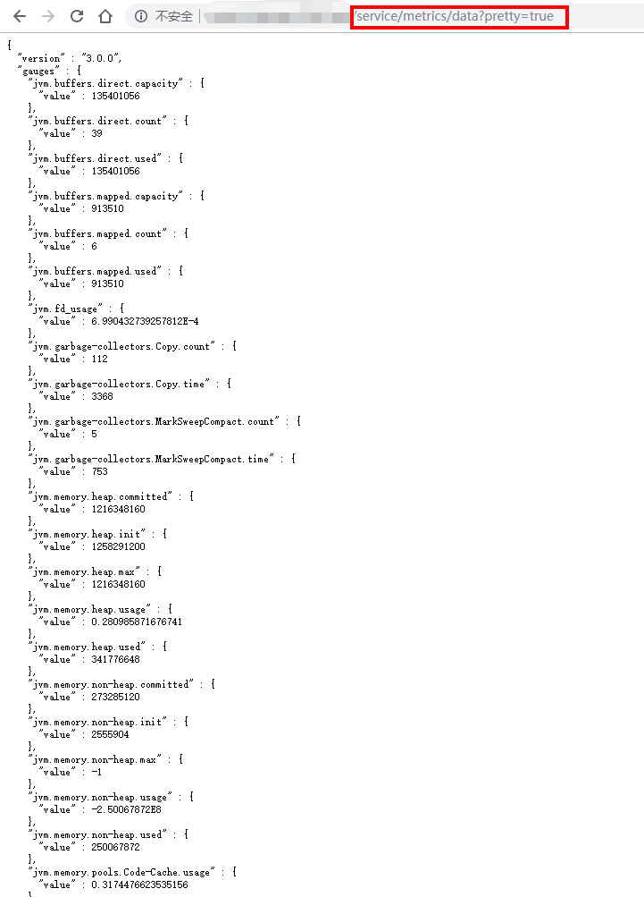

# Nexus API

# 一、Context

官网API文档：https://help.sonatype.com/repomanager3/rest-and-integration-api




# 二、Search API

Search API用于搜索component和asset。

    GET /service/rest/v1/search

## 1、Search Components

例如在maven-central仓库中搜索"group=org.osgi"的component

    $ curl -u admin:admin123 -X GET 'http://localhost:8081/service/rest/v1/search?repository=maven-central&group=org.osgi'
    
    {
    "items" : [ {
        "id" : "bWF2ZW4tY2VudHJhbDoyZTQ3ZGRhMGYxYjU1NWUwNzE1OWRjOWY5ZGQzZmVmNA",
        "repository" : "maven-central",
        "format" : "maven2",
        "group" : "org.osgi",
        "name" : "org.osgi.core",
        "version" : "4.3.1",
        "assets" : [ {
        "downloadUrl" : "http://localhost:8081/repository/maven-central/org/osgi/org.osgi.core/4.3.1/org.osgi.core-4.3.1-sources.jar",
        "path" : "org/osgi/org.osgi.core/4.3.1/org.osgi.core-4.3.1-sources.jar",
        "id" : "bWF2ZW4tY2VudHJhbDplMDE4OGVkMDcyOGZhNjhmNDExNzU2OGU1MjQ2NjZiYg",
        "repository" : "maven-central",
        "format" : "maven2",
        "checksum" : {
            "sha1" : "80bfafcf783988442b3a58318face1d2132db33d",
            "md5" : "87ee0258b79dc852626b91818316b9c3"
        }
        }, {
        "downloadUrl" : "http://localhost:8081/repository/maven-central/org/osgi/org.osgi.core/4.3.1/org.osgi.core-4.3.1.jar",
        "path" : "org/osgi/org.osgi.core/4.3.1/org.osgi.core-4.3.1.jar",
        "id" : "bWF2ZW4tY2VudHJhbDpkMDY0ODA0YThlZDVhZDZlNjhmZGU5MWNmM2NiZTgzMw",
        "repository" : "maven-central",
        "format" : "maven2",
        "checksum" : {
            "sha1" : "5458ffe2ba049e76c29f2df2dc3ffccddf8b839e",
            "md5" : "8053bbc1b55d51f5abae005625209d08"
        }
        }, {
        "downloadUrl" : "http://localhost:8081/repository/maven-central/org/osgi/org.osgi.core/4.3.1/org.osgi.core-4.3.1.pom",
        "path" : "org/osgi/org.osgi.core/4.3.1/org.osgi.core-4.3.1.pom",
        "id" : "bWF2ZW4tY2VudHJhbDo2NTRiYjdkMGE1OTIxMzg1OWZhMTVkMzNmYWU1ZmY3OA",
        "repository" : "maven-central",
        "format" : "maven2",
        "checksum" : {
            "sha1" : "79391fc69dd72ad1fd983d01b4572f93f644882b",
            "md5" : "3d87a59bcdb4b131d9a63e87e0ed924a"
        }
        } ]
    } ],
    "continuationToken" : null
    }

## 2、Search Assets

例如在maven-central仓库中搜索"group=org.osgi"的assets

    $ curl -u admin:admin123 -X GET 'http://localhost:8081/service/rest/v1/search../assets?repository=maven-central&group=org.osgi'
    
    {
    "items" : [ {
        "downloadUrl" : "http://localhost:8081/repository/maven-central/org/osgi/org.osgi.core/4.3.1/org.osgi.core-4.3.1-sources.jar",
        "path" : "org/osgi/org.osgi.core/4.3.1/org.osgi.core-4.3.1-sources.jar",
        "id" : "bWF2ZW4tY2VudHJhbDplMDE4OGVkMDcyOGZhNjhmNDExNzU2OGU1MjQ2NjZiYg",
        "repository" : "maven-central",
        "format" : "maven2",
        "checksum" : {
        "sha1" : "80bfafcf783988442b3a58318face1d2132db33d",
        "md5" : "87ee0258b79dc852626b91818316b9c3"
        }
    }, {
        "downloadUrl" : "http://localhost:8081/repository/maven-central/org/osgi/org.osgi.core/4.3.1/org.osgi.core-4.3.1.jar",
        "path" : "org/osgi/org.osgi.core/4.3.1/org.osgi.core-4.3.1.jar",
        "id" : "bWF2ZW4tY2VudHJhbDpkMDY0ODA0YThlZDVhZDZlNjhmZGU5MWNmM2NiZTgzMw",
        "repository" : "maven-central",
        "format" : "maven2",
        "checksum" : {
        "sha1" : "5458ffe2ba049e76c29f2df2dc3ffccddf8b839e",
        "md5" : "8053bbc1b55d51f5abae005625209d08"
        }
    }, {
        "downloadUrl" : "http://localhost:8081/repository/maven-central/org/osgi/org.osgi.core/4.3.1/org.osgi.core-4.3.1.pom",
        "path" : "org/osgi/org.osgi.core/4.3.1/org.osgi.core-4.3.1.pom",
        "id" : "bWF2ZW4tY2VudHJhbDo2NTRiYjdkMGE1OTIxMzg1OWZhMTVkMzNmYWU1ZmY3OA",
        "repository" : "maven-central",
        "format" : "maven2",
        "checksum" : {
        "sha1" : "79391fc69dd72ad1fd983d01b4572f93f644882b",
        "md5" : "3d87a59bcdb4b131d9a63e87e0ed924a"
        }
    } ],
    "continuationToken" : null
    }

## 3、Search and Download Asset

用于搜索一个资产，然后将请求重定向到该资产的downloadUrl

    GET /service/rest/v1/search../assets/download

例如获取一个maven坐标为"groupId=com.curiosuer，artifactId=SpringBoot2，version=0.0.0"Jar包的下载链接

    $ curl -v -u admin:admin123 -X GET 'http://localhost:8081/service/rest/v1/search../assets/download?maven.groupId=com.curiosuer&maven.artifactId=SpringBoot2&maven.baseVersion=0.0.0&maven.extension=jar&maven.classifier'

浏览器中



# 三、Repositories API

## 1、List Repositories

获取用户能访问到的Repository仓库列表

    GET /service/rest/v1/repositories
    $ curl -u admin:admin123 -X GET 'http://localhost:8081/service/rest/v1/repositories'
    
    [
    {
        "name" : "YUM-Hosted",
        "format" : "yum",
        "type" : "hosted",
        "url" : "http://localhost:8081/repository/YUM-Hosted"
    },
    ...
    ]

此endpoint返回所有存储库，并且不允许分页。

注意，存储库的顺序在多个查询之间是一致的，并且不是按字母顺序排列的。

# 四、Assets API

## 1、List Assets

列出指定Repository仓库中包含的Assets

    GET /service/rest/v1../assets

例如列出maven-central仓库中的Assets

    $ curl -u admin:admin123 -X GET 'http://localhost:8081/service/rest/v1../assets?repository=Maven-Releases'
    
    {
    "items" : [ {
        "downloadUrl" : "http://localhost:8081/repository/Maven-Releases/com/curiosuer/SpringBoot2/0.0.0/SpringBoot2-0.0.0.jar",
        "path" : "com/curiosuer/SpringBoot2/0.0.0/SpringBoot2-0.0.0.jar",
        "id" : "TWF2ZW4tUmVsZWFzZXM6MzZlM2RlYzhkZTUyOGM5YmRkYTdhZTNjZjlmYjFiNTY",
        "repository" : "Maven-Releases",
        "format" : "maven2",
        "checksum" : {
            "sha1" : "c1ab61e9f407cbabaa8f3b377a76afa1f8afa4f1",
            "md5" : "5474cd7fc95a581eb6b6a3319c8aa6ba"
        },
    ...
    ],
    "continuationToken" : "3f5cae01760233b6506547dc7be10e0b"
    }

该endpoint使用分页策略，如果需要，可以使用该策略遍历所有资产。

注意，资产的顺序在多个查询之间是一致的，并且不是按字母顺序排列的。

## 2、Get Asset

    GET /service/rest/v1../assets/{id}

This endpoint allows us to get the details of an individual asset.

    $ curl -u admin:admin123 -X GET 'http://localhost:8081/service/rest/v1../assets/bWF2ZW4tY2VudHJhbDozZjVjYWUwMTc2MDIzM2I2MjRiOTEwMmMwMmNiYmU4YQ'
    
    {
    "downloadUrl" : "http://localhost:8081/repository/maven-central/org/sonatype/nexus/buildsupport/nexus-buildsupport-metrics/2.9.1-02/nexus-buildsupport-metrics-2.9.1-02.pom",
    "path" : "org/sonatype/nexus/buildsupport/nexus-buildsupport-metrics/2.9.1-02/nexus-buildsupport-metrics-2.9.1-02.pom",
    "id" : "bWF2ZW4tY2VudHJhbDozZjVjYWUwMTc2MDIzM2I2MjRiOTEwMmMwMmNiYmU4YQ",
    "repository" : "maven-central",
    "format" : "maven2",
    "checksum" : {
        "sha1" : "a3bf672b3ea844575acba3b84790e76ed86a7c66",
        "md5" : "49e439c814c3098450dc4bbee952463f"
    }}
## 3、Delete Asset

    DELETE /service/rest/v1../assets/{id}

This endpoint can be used to delete an individual asset.

    $ curl -u admin:admin123 -X DELETE 'http://localhost:8081/service/rest/v1../assets/bWF2ZW4tY2VudHJhbDozZjVjYWUwMTc2MDIzM2I2MjRiOTEwMmMwMmNiYmU4YQ'
    
    HTTP/1.1 204 No Content
    Date: Fri, 19 Jan 2018 20:41:47 GMT
    ...

# 五、Components API

## 1、List Components

遍历仓库中的Components

    GET /service/rest/v1/components
    
    $ curl -u admin:admin123 -X GET 'http://localhost:8081/service/rest/v1/components?repository=Maven-Central'
    
    {
    "items" : [ {
        "id" : "bWF2ZW4tY2VudHJhbDo4ODQ5MWNkMWQxODVkZDEzNjMyNjhmMjIwZTQ1ZDdkZQ",
        "repository" : "maven-central",
        "format" : "maven2",
        "group" : "com.google.guava",
        "name" : "guava",
        "version" : "21.0",
        "assets" : [ {
        "downloadUrl" : "http://localhost:8081/repository/maven-central/com/google/guava/guava/21.0/guava-21.0.jar",
        "path" : "com/google/guava/guava/21.0/guava-21.0.jar",
        "id" : "bWF2ZW4tY2VudHJhbDozZjVjYWUwMTc2MDIzM2I2MzA4OThiZjZmZTFkOTE2NA",
        "repository" : "maven-central",
        "format" : "maven2",
        "checksum" : {
            "sha1" : "3a3d111be1be1b745edfa7d91678a12d7ed38709",
            "md5" : "ddc91fd850fa6177c91aab5d4e4d1fa6"
        }
        }, {
        "downloadUrl" : "http://localhost:8081/repository/maven-central/com/google/guava/guava/21.0/guava-21.0.jar.sha1",
        "path" : "com/google/guava/guava/21.0/guava-21.0.jar.sha1",
        "id" : "bWF2ZW4tY2VudHJhbDpmODk4YjM5MDNjYjk5YzU5MDc0MDFlYzRjNjVlNjU5OQ",
        "repository" : "maven-central",
        "format" : "maven2",
        "checksum" : {
            "sha1" : "a1ff60cb911e1f64801c03d03702044d10c9bdd3",
            "md5" : "e34b8695ede1677ba262411d757ea980"
        }
        }, {
        "downloadUrl" : "http://localhost:8081/repository/maven-central/com/google/guava/guava/21.0/guava-21.0.pom",
        "path" : "com/google/guava/guava/21.0/guava-21.0.pom",
        "id" : "bWF2ZW4tY2VudHJhbDpkMDY0ODA0YThlZDVhZDZlOWJjNDgzOGE1MzM2OGZlZg",
        "repository" : "maven-central",
        "format" : "maven2",
        "checksum" : {
            "sha1" : "fe4fa08a8c0897f9896c7e278fb397ede4a2feed",
            "md5" : "5c10f97af2ce9db54fa6c2ea6997a8d7"
        }
        }, {
        "downloadUrl" : "http://localhost:8081/repository/maven-central/com/google/guava/guava/21.0/guava-21.0.pom.sha1",
        "path" : "com/google/guava/guava/21.0/guava-21.0.pom.sha1",
        "id" : "bWF2ZW4tY2VudHJhbDplMDE4OGVkMDcyOGZhNjhmZDA3NDdkNjlhZDNmZjI5Nw",
        "repository" : "maven-central",
        "format" : "maven2",
        "checksum" : {
            "sha1" : "992b43ab7b3a061be47767e910cab58180325abc",
            "md5" : "33aed29aa0bb4e03ea7854066a5b4738"
        }
        } ]
    },
    ...
    ],
    "continuationToken" : "88491cd1d185dd136f143f20c4e7d50c"
    }

该endpoint使用分页策略，如果需要，可以使用该策略遍历所有资产。

注意，资产的顺序在多个查询之间是一致的，并且不是按字母顺序排列的。

## 2、Get Component

获取仓库中component的详细信息

    GET /service/rest/v1/components/{id}
    
    $ curl -u admin:admin123 -X GET 'http://localhost:8081/service/rest/v1/components/bWF2ZW4tY2VudHJhbDo4ODQ5MWNkMWQxODVkZDEzNjYwYmUwMjE1MjI2NGUwZQ'
    
    {
    "id" : "bWF2ZW4tY2VudHJhbDo4ODQ5MWNkMWQxODVkZDEzNjYwYmUwMjE1MjI2NGUwZQ",
    "repository" : "maven-central",
    "format" : "maven2",
    "group" : "org.apache.httpcomponents",
    "name" : "httpcomponents-client",
    "version" : "4.3.5",
    "assets" : [ {
        "downloadUrl" : "http://localhost:8081/repository/maven-central/org/apache/httpcomponents/httpcomponents-client/4.3.5/httpcomponents-client-4.3.5.pom",
        "path" : "org/apache/httpcomponents/httpcomponents-client/4.3.5/httpcomponents-client-4.3.5.pom",
        "id" : "bWF2ZW4tY2VudHJhbDozZjVjYWUwMTc2MDIzM2I2YTFhOGUxOGQxZmFkOGM3Mw",
        "repository" : "maven-central",
        "format" : "maven2",
        "checksum" : {
        "sha1" : "95d80a44673358a5dcbcc2f510770b9f93fe5eba",
        "md5" : "f4769c4e60799ede664414c26c6c5c9d"
        }
    }, {
        "downloadUrl" : "http://localhost:8081/repository/maven-central/org/apache/httpcomponents/httpcomponents-client/4.3.5/httpcomponents-client-4.3.5.pom.sha1",
        "path" : "org/apache/httpcomponents/httpcomponents-client/4.3.5/httpcomponents-client-4.3.5.pom.sha1",
        "id" : "bWF2ZW4tY2VudHJhbDpmODk4YjM5MDNjYjk5YzU5ZDU3YjFlYjE0MzM1ZTcwMQ",
        "repository" : "maven-central",
        "format" : "maven2",
        "checksum" : {
        "sha1" : "6b98f5cef5d7102f8f45215bdcf48dc843d060af",
        "md5" : "f3b3ac640853fcb887621d13029a1747"
        }
    } ]
    }

## 3、Upload Component

- 上传Component到指定仓库中，一些格式的仓库允许上传的Component中包含多个Assets。
- endpoint的上传参数取决于要上传Component到那个仓库的格式

    ```bash
    POST /service/rest/v1/components

    $ curl -v -u admin:admin123 \
    -X POST 'http://localhost:8081/service/rest/v1/components?repository=maven-releases' \
    -F maven2.groupId=com.google.guava \
    -F maven2.artifactId=guava \
    -F maven2.version=24.0-jre \
    -F maven2.asset1=@guava-24.0-jre.jar \
    -F maven2.asset1.extension=jar \
    -F maven2.asset2=@guava-24.0-jre-sources.jar \
    -F maven2.asset2.classifier=sources \
    -F maven2.asset2.extension=jar

    HTTP/1.1 204 No Content
    Date: Fri, 19 Jan 2018 20:26:13 GMT
    ...
    ```

①Maven

Maven format allows multiple assets to be uploaded as part of a single component. To upload multiple assets just follow the information from a table describing the given format and replace assetN with multiple instances of it (e.g. asset1, asset2, etc.):

| **Field name**           | **Field type** | Required?                                         | Description                                                  |
| ------------------------ | -------------- | ------------------------------------------------- | ------------------------------------------------------------ |
| maven2.groupId           | String         | Yes, unless a POM asset is included in the upload | Group ID of the component                                    |
| maven2.artifactId        | String         | Yes, unless a POM asset is included in the upload | Artifact ID of the component                                 |
| maven2.version           | String         | Yes, unless a POM asset is included in the upload | Version of the component                                     |
| maven2.generate-pom      | Boolean        | No                                                | Whether the Nexus Repository Manager should generate a POM file based on above component coordinates provided |
| maven2.packaging         | String         | No                                                | Define component packaging (e.g. jar, ear)                   |
| maven2.assetN            | File           | Yes, at least one                                 | Binary asset                                                 |
| maven2.assetN.extension  | String         | Yes                                               | Extension of the corresponding `assetN` asset                |
| maven2.assetN.classifier | String         | No                                                | Classifier of the corresponding `assetN` asset               |

Examples：Uploading a jar and Automatically Creating a pom File

    $ curl -v -u admin:admin123 \
    -F "maven2.generate-pom=true" \
    -F "maven2.groupId=com.example" \
    -F "maven2.artifactId=commercial-product" \
    -F "maven2.packaging=jar" \
    -F "version=1.0.0" \
    -F "maven2.asset1=@/absolute/path/to/the/local/file/product.jar;type=application/java-archive" \
    -F "maven2.asset1.extension=jar" \
    "http://localhost:8081/service/rest/v1/components?repository=maven-third-party"

Upload a POM and associated JAR File

    $ curl -v -u admin:admin123 \
    -F "maven2.generate-pom=false" \
    -F "maven2.asset1=@/absolute/path/to/the/local/file/pom.xml" \
    -F "maven2.asset1.extension=pom" \
    -F "maven2.asset2=@/absolute/path/to/the/local/file/product-1.0.0.jar;type=application/java-archive" \
    -F "maven2.asset2.extension=jar" \
    "http://localhost:8081/service/rest/v1/components?repository=maven-releases"

②Raw

Raw supports multiple assets within a single component.

| **Field name**      | **Field type** | Required?         | Description                                              |
| ------------------- | -------------- | ----------------- | -------------------------------------------------------- |
| raw.directory       | String         | Yes               | Destination for upload files (e.g. /path/to/files)       |
| raw.assetN          | File           | Yes, at least one | Binary asset                                             |
| raw.assetN.filename | String         | Yes               | Filename to be used for the corresponding `assetN` asset |

③PyPI

| **Field name** | **Field type** | **Required?** | **Description** |
| -------------- | -------------- | ------------- | --------------- |
| pypi.asset     | File           | Yes           | Binary asset    |

④RubyGems

| **Field name** | **Field type** | **Required?** | **Description** |
| -------------- | -------------- | ------------- | --------------- |
| rubygems.asset | File           | Yes           | Binary asset    |

⑤NuGet

| **Field name** | **Field type** | **Required?** | **Description** |
| -------------- | -------------- | ------------- | --------------- |
| nuget.asset    | File           | Yes           | Binary asset    |

⑥NPM

| **Field name** | **Field type** | **Required?** | **Description** |
| -------------- | -------------- | ------------- | --------------- |
| npm.asset      | File           | Yes           | Binary asset    |

## 4、Delete Component：删除仓库中的component

```bash
DELETE /service/rest/v1/components/{id}

$ curl -u admin:admin123 -X DELETE 'http://localhost:8081/service/rest/v1/components/bWF2ZW4tY2VudHJhbDo4ODQ5MWNkMWQxODVkZDEzNjYwYmUwMjE1MjI2NGUwZQ'

HTTP/1.1 204 No Content
Date: Fri, 19 Jan 2018 20:26:13 GMT
...
```

# 六、Metrics API




# 示例

https://raw.githubusercontent.com/OpenShiftDemos/nexus/master/scripts/nexus-functions

```bash
#################################################################
# Functions for Managing Sonatype Nexus                         #
#                                                               #
# Authors:                                                      #
# - Jorge Morales        https://github.com/jorgemoralespou     #
# - Siamak Sadeghianfar  https://github.com/siamaksade          #
#                                                               #
#################################################################
​
#
# add_nexus2_repo [repo-id] [repo-url] [nexus-username] [nexus-password] [nexus-url]
#
​
function add_nexus2_repo() {
  local _REPO_ID=$1
  local _REPO_URL=$2
  local _NEXUS_USER=$3
  local _NEXUS_PWD=$4
  local _NEXUS_URL=$5
​
  read -r -d '' _REPO_JSON << EOM
{
   "data": {
      "repoType": "proxy",
      "id": "$_REPO_ID",
      "name": "$_REPO_ID",
      "browseable": true,
      "indexable": true,
      "notFoundCacheTTL": 1440,
      "artifactMaxAge": -1,
      "metadataMaxAge": 1440,
      "itemMaxAge": 1440,
      "repoPolicy": "RELEASE",
      "provider": "maven2",
      "providerRole": "org.sonatype.nexus.proxy.repository.Repository",
      "downloadRemoteIndexes": true,
      "autoBlockActive": true,
      "fileTypeValidation": true,
      "exposed": true,
      "checksumPolicy": "WARN",
      "remoteStorage": {
         "remoteStorageUrl": "$_REPO_URL",
         "authentication": null,
         "connectionSettings": null
      }
   }
}
EOM
​
  $ curl -v -f -X POST -H "Accept: application/json" -H "Content-Type: application/json" -d "$_REPO_JSON" -u "$_NEXUS_USER:$_NEXUS_PWD" "$_NEXUS_URL/service/local/repositories"
​
}
​
#
# add_nexus2_group_repo [repo-id] [group-id] [nexus-username] [nexus-password] [nexus-url]
#
function add_nexus2_group_repo() {
  local _REPO_ID=$1
  local _GROUP_ID=$2
  local _NEXUS_USER=$3
  local _NEXUS_PWD=$4
  local _NEXUS_URL=$5
​
  GROUP_JSON=$($ curl -s -H "Accept: application/json" -H "Content-Type: application/json" -f -X GET -u "$_NEXUS_USER:$_NEXUS_PWD" "$_NEXUS_URL/service/local/repo_groups/$_GROUP_ID")
  GROUP_JSON_WITH_REPO=$(echo $GROUP_JSON | sed "s/\"repositories\":\[/\"repositories\":[{\"id\": \"$_REPO_ID\"},/g")
  $ curl -v -f -X PUT -H "Accept: application/json" -H "Content-Type: application/json" -d "$GROUP_JSON_WITH_REPO" -u "$_NEXUS_USER:$_NEXUS_PWD" "$_NEXUS_URL/service/local/repo_groups/$_GROUP_ID"
}
​
​
#
# add_nexus2_redhat_repos [nexus-username] [nexus-password] [nexus-url]
#
function add_nexus2_redhat_repos() {
  local _NEXUS_USER=$1
  local _NEXUS_PWD=$2
  local _NEXUS_URL=$3
​
  add_nexus2_repo redhat-ga https://maven.repository.redhat.com/ga/ $_NEXUS_USER $_NEXUS_PWD $_NEXUS_URL
  add_nexus2_repo redhat-ea https://maven.repository.redhat.com/earlyaccess/all/ $_NEXUS_USER $_NEXUS_PWD $_NEXUS_URL
  add_nexus2_repo redhat-techpreview https://maven.repository.redhat.com/techpreview/all $_NEXUS_USER $_NEXUS_PWD $_NEXUS_URL
  add_nexus2_repo jboss-ce https://repository.jboss.org/nexus/content/groups/public/ $_NEXUS_USER $_NEXUS_PWD $_NEXUS_URL
​
  add_nexus2_group_repo jboss-ce public $_NEXUS_USER $_NEXUS_PWD $_NEXUS_URL
  add_nexus2_group_repo redhat-ga public $_NEXUS_USER $_NEXUS_PWD $_NEXUS_URL
  add_nexus2_group_repo redhat-ea public $_NEXUS_USER $_NEXUS_PWD $_NEXUS_URL
  add_nexus2_group_repo redhat-techpreview public $_NEXUS_USER $_NEXUS_PWD $_NEXUS_URL
}
​
​
#
# add_nexus3_repo [repo-id] [repo-url] [nexus-username] [nexus-password] [nexus-url]
#
function add_nexus3_repo() {
  local _REPO_ID=$1
  local _REPO_URL=$2
  local _NEXUS_USER=$3
  local _NEXUS_PWD=$4
  local _NEXUS_URL=$5
​
  read -r -d '' _REPO_JSON << EOM
{
  "name": "$_REPO_ID",
  "type": "groovy",
  "content": "repository.createMavenProxy('$_REPO_ID','$_REPO_URL')"
}
EOM
​
  # Pre Nexus 3.8
  $ curl -v -H "Accept: application/json" -H "Content-Type: application/json" -d "$_REPO_JSON" -u "$_NEXUS_USER:$_NEXUS_PWD" "${_NEXUS_URL}/service/siesta/rest/v1/script/"
  $ curl -v -X POST -H "Content-Type: text/plain" -u "$_NEXUS_USER:$_NEXUS_PWD" "${_NEXUS_URL}/service/siesta/rest/v1/script/$_REPO_ID/run"
​
  # Post Nexus 3.8
  $ curl -v -H "Accept: application/json" -H "Content-Type: application/json" -d "$_REPO_JSON" -u "$_NEXUS_USER:$_NEXUS_PWD" "${_NEXUS_URL}/service/rest/v1/script/"
  $ curl -v -X POST -H "Content-Type: text/plain" -u "$_NEXUS_USER:$_NEXUS_PWD" "${_NEXUS_URL}/service/rest/v1/script/$_REPO_ID/run"
}
​
#
# add_nexus3_group_repo [comma-separated-repo-ids] [group-id] [nexus-username] [nexus-password] [nexus-url]
#
function add_nexus3_group_repo() {
  local _REPO_IDS=$1
  local _GROUP_ID=$2
  local _NEXUS_USER=$3
  local _NEXUS_PWD=$4
  local _NEXUS_URL=$5
​
  read -r -d '' _REPO_JSON << EOM
{
  "name": "$_GROUP_ID",
  "type": "groovy",
  "content": "repository.createMavenGroup('$_GROUP_ID', '$_REPO_IDS'.split(',').toList())"
}
EOM
​
  # Pre Nexus 3.8
  $ curl -v -H "Accept: application/json" -H "Content-Type: application/json" -d "$_REPO_JSON" -u "$_NEXUS_USER:$_NEXUS_PWD" "${_NEXUS_URL}/service/siesta/rest/v1/script/"
  $ curl -v -X POST -H "Content-Type: text/plain" -u "$_NEXUS_USER:$_NEXUS_PWD" "${_NEXUS_URL}/service/siesta/rest/v1/script/$_GROUP_ID/run"
​
  # Post Nexus 3.8
  $ curl -v -H "Accept: application/json" -H "Content-Type: application/json" -d "$_REPO_JSON" -u "$_NEXUS_USER:$_NEXUS_PWD" "${_NEXUS_URL}/service/rest/v1/script/"
  $ curl -v -X POST -H "Content-Type: text/plain" -u "$_NEXUS_USER:$_NEXUS_PWD" "${_NEXUS_URL}/service/rest/v1/script/$_GROUP_ID/run"
}
​
#
# add_nexus3_redhat_repos [nexus-username] [nexus-password] [nexus-url]
#
function add_nexus3_redhat_repos() {
  local _NEXUS_USER=$1
  local _NEXUS_PWD=$2
  local _NEXUS_URL=$3
​
  add_nexus3_repo redhat-ga https://maven.repository.redhat.com/ga/ $_NEXUS_USER $_NEXUS_PWD $_NEXUS_URL
  add_nexus3_repo redhat-ea https://maven.repository.redhat.com/earlyaccess/all/ $_NEXUS_USER $_NEXUS_PWD $_NEXUS_URL
  add_nexus3_repo redhat-techpreview https://maven.repository.redhat.com/techpreview/all $_NEXUS_USER $_NEXUS_PWD $_NEXUS_URL
  add_nexus3_repo jboss-ce https://repository.jboss.org/nexus/content/groups/public/ $_NEXUS_USER $_NEXUS_PWD $_NEXUS_URL
​
  add_nexus3_group_repo maven-central,maven-releases,maven-snapshots,jboss-ce,redhat-ga,redhat-ea,redhat-techpreview maven-all-public $_NEXUS_USER $_NEXUS_PWD $_NEXUS_URL
}
```
