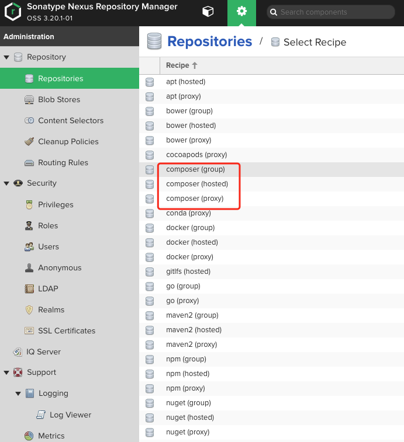
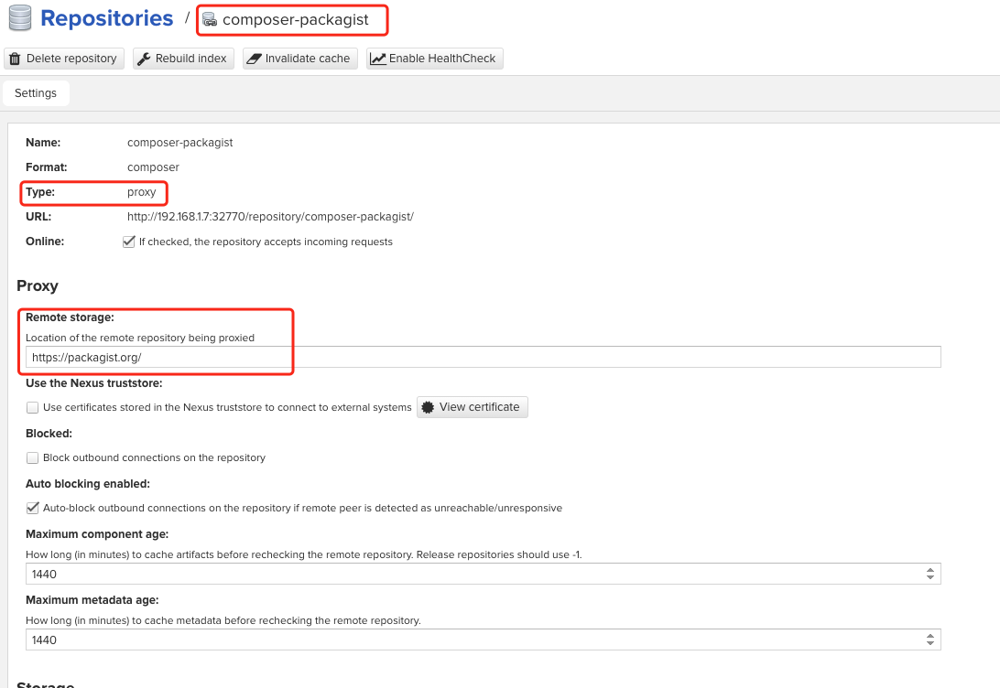
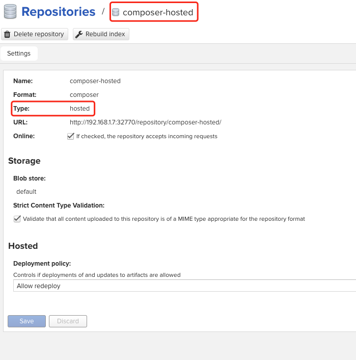
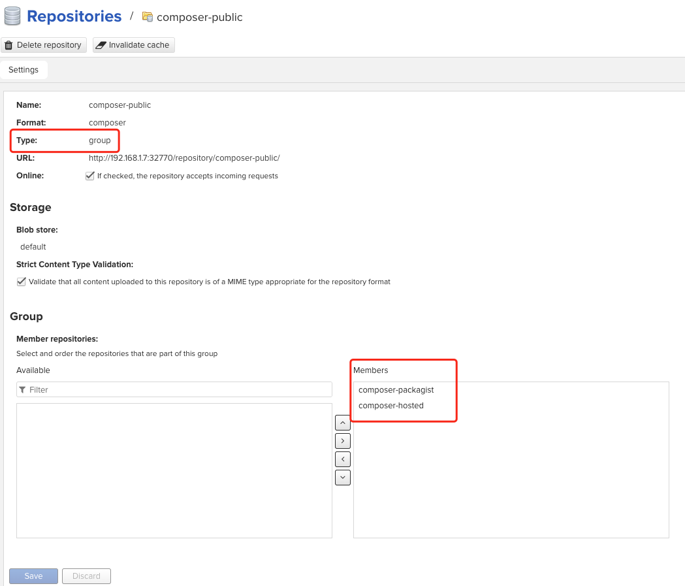
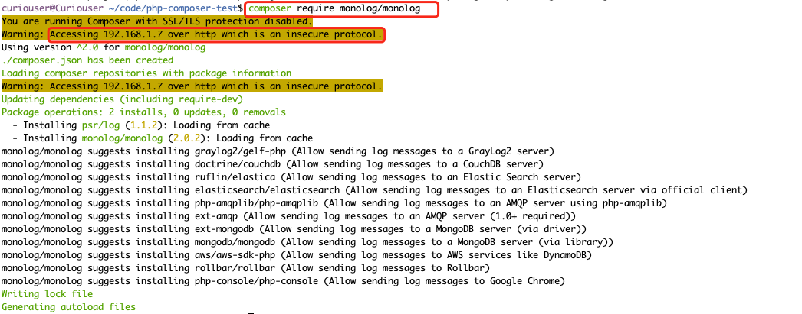
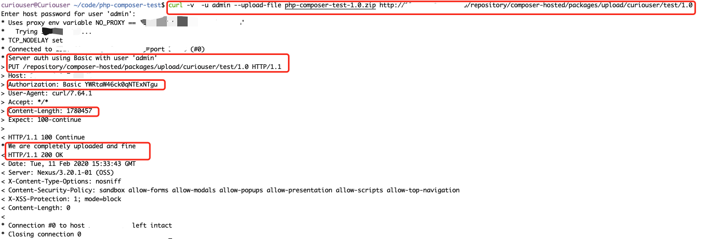
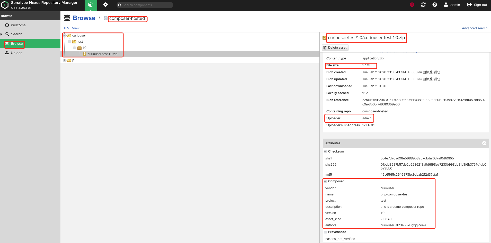
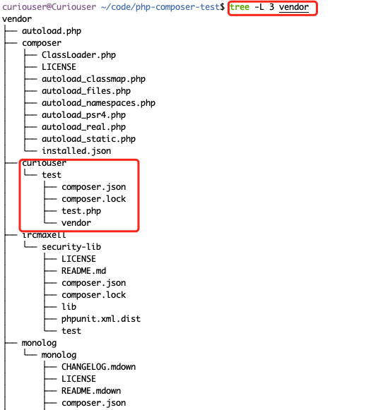

# Nexus支持Composer仓库

# 一、简介

Nexus 3 默认暂不支持PHP Composer仓库，但是可以通过第三方插件支持

插件Github地址：https://github.com/sonatype-nexus-community/nexus-repository-composer

- **Group类型仓库**
  - `composer-public`
    - `composer-packagist`
    - `composer-hosted`
- **Proxy类型仓库**
  - `composer-packagist`：https://packagist.org/
- **Hosted类型仓库**
  - `composer-hosted`

# 二、编译、安装插件

```bash
git clone  https://github.com/sonatype-nexus-community/nexus-repository-composer.git
mvn clean package
# 编译成功后，生成的Jar包在nexus-repository-composer/target下
```

1. 将插件jar包放到`<nexus_dir>/system/org/sonatype/nexus/plugins/nexus-repository-composer/0.0.2/nexus-repository-composer-0.0.2.jar`

2. 编辑`<nexus_dir>/system/org/sonatype/nexus/assemblies/nexus-core-feature/3.x.y/nexus-core-feature-3.x.y-features.xml`，添加

   ```xml
     <feature prerequisite="false" dependency="false">nexus-repository-rubygems</feature>
   + <feature prerequisite="false" dependency="false">nexus-repository-composer</feature>
     <feature prerequisite="false" dependency="false">nexus-repository-gitlfs</feature>
   </feature>
   ```

   ```xml
   + <feature name="nexus-repository-composer" description="org.sonatype.nexus.plugins:nexus-repository-composer" version="0.0.2">
   +     <details>org.sonatype.nexus.plugins:nexus-repository-composer</details>
   +     <bundle>mvn:org.sonatype.nexus.plugins/nexus-repository-composer/0.0.2</bundle>
   + </feature>
   </features>
   ```

3. 重启Nexus，看是否支持创建Composer仓库了

   


# 三、仓库配置







# 四、使用

## 1、安装Composer

   ```bash
curl -sS https://getcomposer.org/installer | php
mv composer.phar /usr/local/bin/composer
composer --version
   ```

## 2、Composer配置使用私有源

### 方式一：配置Composer全局使用私有源

#### ①手动

   ```bash
composer config -g repo.packagist composer http://Neuxs-IP:8081/repository/composer-public/   # Composer默认使用ssl连接代理源，使用私有仓库源时，使用的HTTP，需要关闭SSL
composer config -g -- disable-tls true
composer config -g -- secure-http false
   ```

#### ②使用crm工具

```bash
#安装
composer global require slince/composer-registry-manager ^2.0

# 添加公司内部的私有源
composer repo:add synology-nxus http://Neuxs-IP:8081/repository/composer-public/

# 查看所有的私有源
composer repo:ls

# 切换到私有源
composer repo:use synology-nxus
```


### 方式二：配置项目级别配置使用私有源

编写项目根目录下的composer.json

```bash
{
  "packagist.org": false ,
  "repositories": {
     "packagist": {
       "type": "composer",
       "url": "http://Neuxs-IP:8081/repository/composer-public/"
     }
  },
  "config": {
    "secure-http": false
  },
  "require": {
    "monolog/monolog": "1.0.*",
    "pugx/shortid-php":"v0.5.1"
  }
}
```

## 3、安装依赖

composer会根据当前路径下composer.json中写的下载依赖

```bash
composer install
# 依赖会被下载当前目录下的vendor文件夹中
```

手动添加依赖

   ```bash
composer require monolog/monolog
   ```



## 4、上传包到Hosted类型的仓库中

- 编辑composer.json，添加项目包的信息，像名字，描述，版本号，维护者等信息。

  ```bash
  {
    "version": "1.0",
    "name": "php-composer-test",
    "description": "this is a demo composer repo",
    "authors": [{
      "name": "curiouser",
      "email": "12345678@qq.com"
    }],
    "packagist.org": false ,
    "repositories": {
       "packagist": {
         "type": "composer",
         "url": "http://Neuxs-IP:8081/repository/composer-public/"
       }
    },
    "config": {
      "secure-http": false
    },
    "require": {
      "monolog/monolog": "1.0.*",
      "pugx/shortid-php":"v0.5.1"
    }
  }
  ```

- 归档项目

  ```bash
  composer archive --format=zip
  ```

- 上传归档项目包

  ```bash
  curl -v --user 'user:pass' --upload-file example.zip http://Neuxs-IP:8081/repository/composer-hosted/packages/upload/项目名/组件名/版本号
  ```
  
   
  
- 查看项目包是否已上传到Nexus中

  

- 下载引用上传的包

  ```bash
  composer require curiouser/test:1.0 
  ```

  