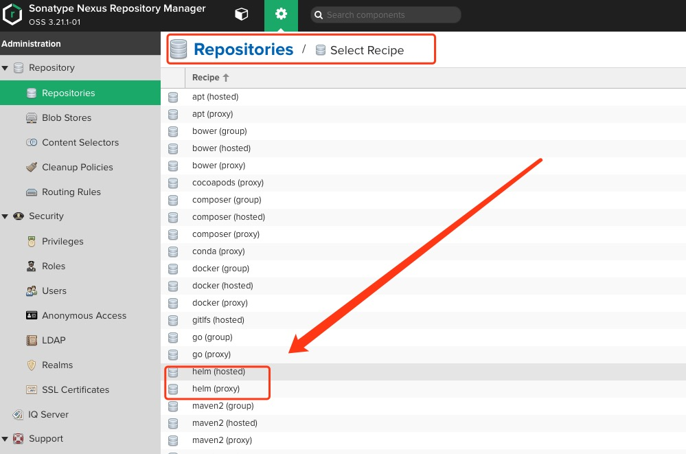
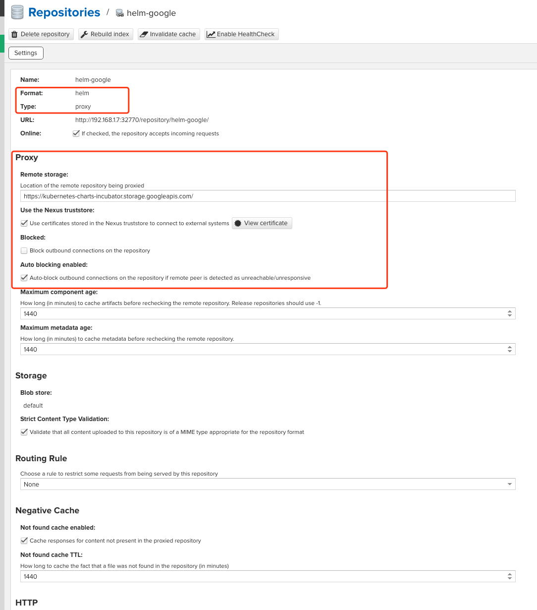
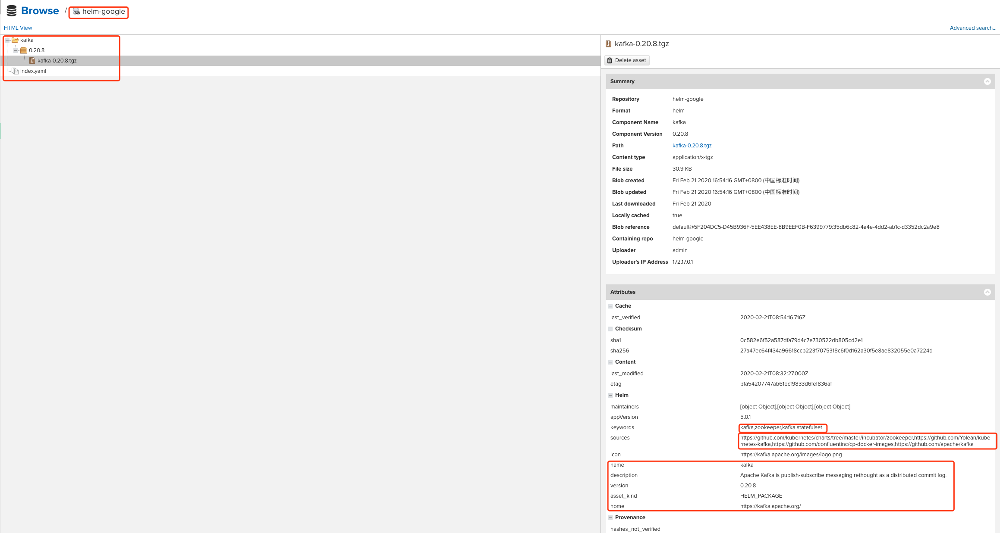
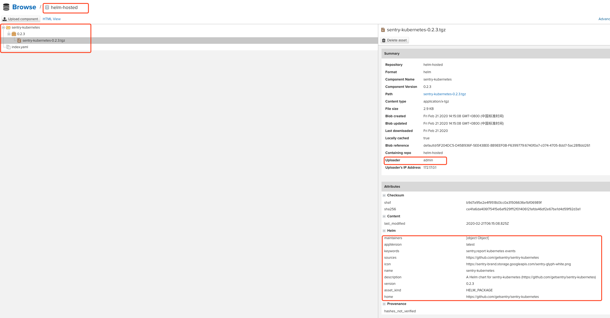
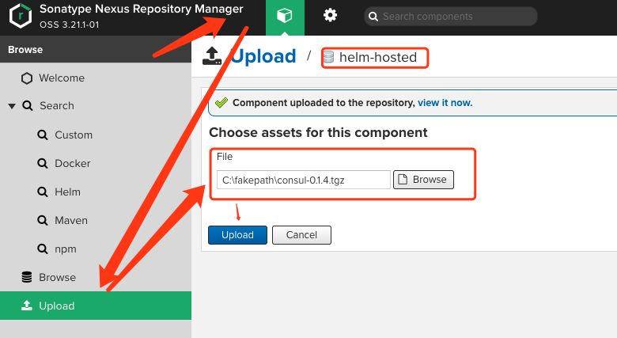

# Nexus Helm的配置与使用


# 一、简介

Nexus从3.21.1开始正式支持Helm charts仓库的管理。之前一直是使用第三方插件的形式支持的。



目前暂时支持Hosted和Proxy类型的Helm仓库

# 二、配置

**Proxy**

- helm-google

  - https://kubernetes-charts-incubator.storage.googleapis.com/

    

**Hosted**

- helm-hosted

# 三、使用

## 1、Helm客户端添加Nexus上Proxy类型的远程charts仓库

### 添加Nexus上的Helm代理类型的仓库

```bash
helm repo add 远程Charts仓库别名 http://nexus-ip:8081/repository/helm-google/ --username admin --password="*****"
```

### 查看添加的远程仓库

```bash
 helm repo list
```

### 搜索远程仓库

```bash
helm search repo 
```

### 从远程仓库中下载charts到本地，并解压

```bash
helm pull 远程Charts仓库别名/chart名 --untar
```



### 从远程仓库中下载指定版本的charts到本地

```bash
helm fetch 远程Charts仓库别名/chart名  --version 1.3.0
```

## 2、上传Helm charts到Nexus上Hosted类型的仓库

```bash
curl -u 用户名:密码 http://nexus-ip:8081/repository/helm-hosted/ --upload-file sentry-kubernetes-0.2.3.tgz
```



## 3、手动在Nexus UI界面上传`.gz`格式的Chart到Helm Hosted仓库

