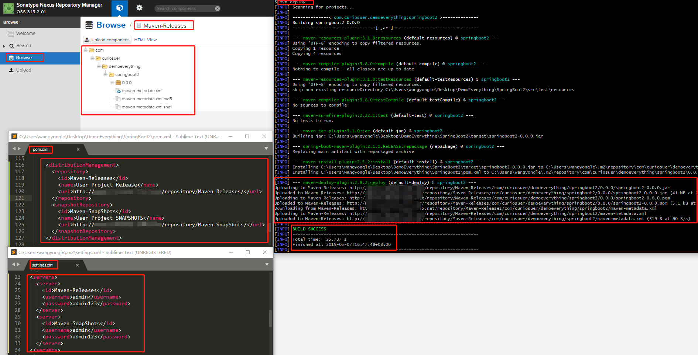
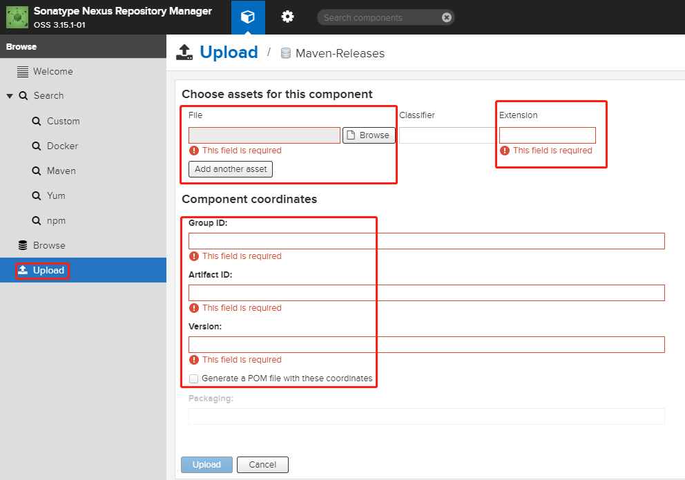
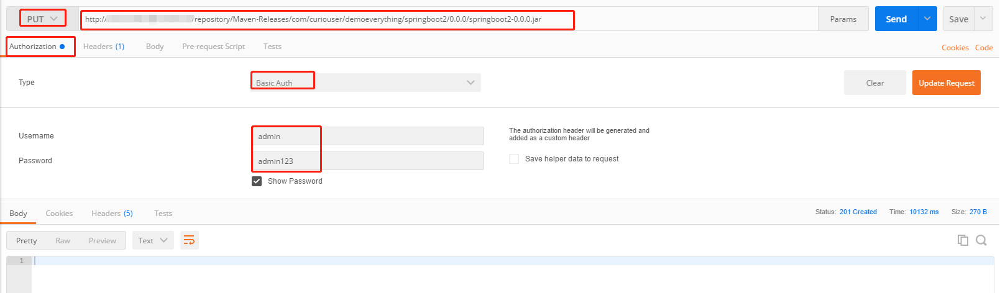
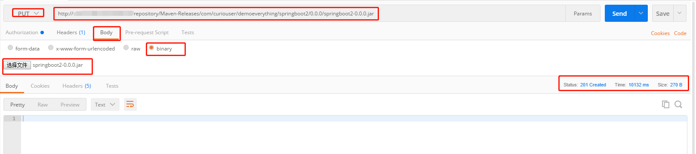
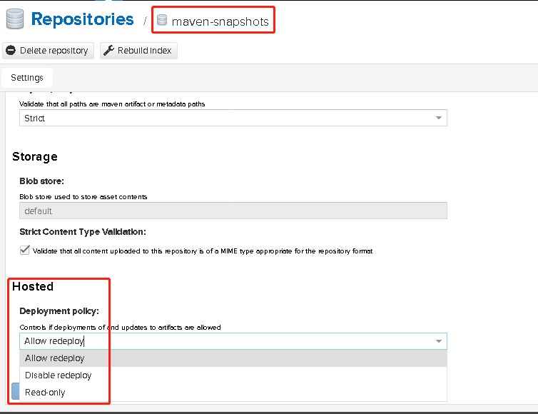
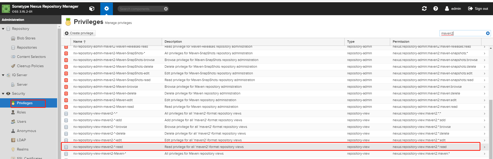
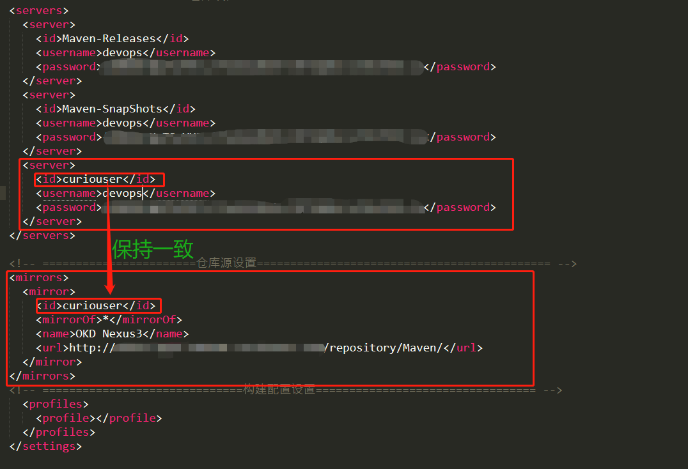

# Maven仓库的配置与使用

# 一、Overview

有了Maven仓库之后，当Maven需要下载构件时，直接请求Nexus，Maven仓库上存在则下载到本地仓库；Maven仓库上不存在的话，Nexus请求外部的远程仓库，将构件下载到Maven仓库，再提供给本地仓库下载。

Maven格式制品仓库配置

- **Group类型仓库**
  - `maven`
    - maven-aliyun
    - maven-central
    - maven-releases
    - maven-snapshots
- **Proxy类型仓库**
  - `maven-central`：https://repo1.maven.org/maven2/
  - `maven-aliyun`：http://maven.aliyun.com/nexus/content/groups/public
- **Hosted类型仓库**
  - `maven-snapshots`
  - `maven-releases`

maven格式的仓库有两种典型的使用场景，一个是顺序拉取group组仓库中组合仓库里的制品，一个是上传制品到hosted类型的仓库中，例如maven-snapshots仓库。而maven配置nexus中的仓库有三个地方，配置最终生效的顺序为全局配置文件--->用户配置文件---->POM文件：

- maven的全局配置文件settings.xml中,该配置文件在maven安装目录conf文件夹下
- maven的用户配置文件settings.xml中,该配置文件在用户目录.m2文件夹下
- 项目的POM文件

# 二、代理仓库的使用


1. 在Maven用户配置文件setting.xml中添加maven格式group仓库的地址

    ```xml
    .....上文省略......
    <servers>
        <server>
            <!-- id要与下方mirror仓库的id保持一致 -->
            <id>curiouser-maven</id>
            <!-- 这里设置的用户要有拉取group仓库下组合仓库的权限 -->
            <username>microservices</username>
            <password>microservices用户的密码</password>
        </server>
    </servers>
    <mirrors>
        <mirror>
            <id>curiouser-maven</id>
            <mirrorOf>*</mirrorOf>
            <name>The Maven repository of curiouser </name>
            <url>http://nexus-ip地址:8081/repository/maven/</url>
        </mirror>
    </mirrors>
    .....下文省略......
    ```


# 三、发布制品到Maven的Hosted仓库

## 1、mvn deploy

在Maven用户配置文件setting.xml中添加snapshot、release仓库的id

```xml
 .....上文省略......
 <servers>
 <server>
     <id>maven-releases</id>
     <username>microservices</username>
     <password>microservices用户的密码</password>
 </server>
 <server>
     <id>maven-snapshots</id>
     <username>microservices</username>
     <password>microservices用户的密码</password>
 </server>
 </servers>
 .....下文省略......
```

在项目POM.xml文件中添加Snapshots仓库或Release仓库的地址

```xml
  .....上文省略......
  <distributionManagement>
     <repository>
         <!-- id要与setting.xml文件中配置的releases仓库id保持一致 -->
         <id>maven-releases</id>
         <name>User Project Release</name>
         <url>http://nexus-ip地址:8081/repository/maven-releases/</url>
     </repository>
     <snapshotRepository>
         <!-- id要与setting.xml文件中配置的snapshots仓库id保持一致 -->
         <id>maven-snapshots</id>
         <name>User Project SNAPSHOTS</name>
         <url>http://nexus-ip地址:8081/repository/maven-snapshots/</url>
     </snapshotRepository>
  </distributionManagement>
  .....下文省略......
```

然后mvn deploy



## 2、Curl手动上传

```bash
 curl -v -u microservices:microservices用户的密码 --upload-file springboot2-0.0.0.jar http://nexus-ip地址:8081/repository/maven-releases/com/curiouser/demoeverything/springboot2/0.0.0/springboot2-0.0.0.jar
 curl -v -u microservices:microservices用户的密码 --upload-file pom.xml http://nexus-ip地址:8081/repository/maven-releases/com/curiouser/demoeverything/springboot2/0.0.0/springboot2-0.0.0.pom
```

## 3、mvn命令手动上传

前提是Maven用户配置文件setting.xml中已经添加了snapshot、release仓库的id

**Linux**

```bash
 mvn deploy:deploy-file \
 #要上传的Jar包路径 \
 -Dfile=/root/websocket-server-9.4.11.v20180605.jar \
 #Jar包Maven坐标的GroupID \
 -DgroupId=org.eclipse.jetty.websocket \
 #Jar包Maven坐标的ArtifactID \
 -DartifactId=websocket-server \
 #Jar包Maven坐标的Version \
 -Dversion=9.4 \
 #要上传到仓库的制品类型，该值还可以是pom
 -Dpackaging=jar \
 #maven私服hosted类型仓库的地址
 -Durl=http://nexus-ip地址:8081/repository/maven-releases/ \
 #maven私服hosted类型仓库的repositoryid
 -DrepositoryId=maven-releases
```

**Windows**

```bash
 mvn deploy:deploy-file ^
 -Dfile=D:\websocket-server-9.4.11.v20180605.jar ^
 -DgroupId=org.eclipse.jetty.websocket ^
 -DartifactId=websocket-server ^
 -Dversion=9.4 ^
 -Dpackaging=jar ^
 -Durl=http://nexus-ip地址:8081/repository/maven-releases/ ^
 -DrepositoryId=maven-releases
```

## 4、UI界面上传



## 5、使用Postman上传




# 注意事项

1. Jar包上传只能上传hosted类型的仓库中，Proxy和Group类型的无法上传。同时，注意有些仓库设置禁止了上传

   

2. hosted类型的Snapshot仓库默认设置的上传版本控制为只能上传以“-snapshot”结尾版本的制品。所以版本为非“-snapshot”结尾的Jar包无法上传到snapshot仓库中
3. 如果Nexus禁止匿名用户访问时，匿名用户是被禁止拉取maven仓库的Jar包。所以可以创建一个对maven仓库类型有读取权限的用户，在settings.xml文件进行配置。

   
   

# 附录：如何在maven的配置文件settings.xml中使用加密过的用户密码

在Maven的settings.xml中，往往要配置访问远程库所在的服务器的username/password。但是明文的密码总是显得那么扎眼，必欲除之而后快。Apache Maven项目提供了便捷的密码加密机制，该机制的最近更新时间为2018-03-06。该机制目前只支持在命令行下的操作，如生成密码的密文。此外，用户还需要在${user.home}/.m2目录下配置settings-security.xml文件，其中包含：

- 用以加密其他密码的master password（此处也是密文）
- 或指向另一个保密文件的完整路径

在该加密机制中有两个概念，一个是master password，即用以加密其他密码的密码，另一个就是实际使用的服务器访问密码password。master password的密文配置在settings-security.xml文件中，而服务器访问密码password的密文就可以大大方方地配置在settings.xml中。具体用法如下：

1. 生成Master password的密文

    ```bash
    mvn --encrypt-master-password
    根据提示输入Master password:
    就可以生成密文{iENT44//TgwH46wJQ0Go3et0u9PRZivf7LcAA9mY4LA=}
    ```

2. 配置${user.home}/.m2/settings-security.xml文件(如果没有就手动创建)

    ```xml
    <settingsSecurity>
        <master>{iENT44//TgwH46wJQ0Go3et0u9PRZivf7LcAA9mY4LA=}</master>
    </settingsSecurity>

    # 如果settings-security.xml文件被保存到U盘，则配置${user.home}/.m2/settings-security.xml文件如下：
    <settingsSecurity>
        <master>/my_u_volume/my_path/settings-security.xml</master>
    </settingsSecurity>
    ```

3. 加密访问服务器的密码

    ```bash
    mvn --encrypt-password
    根据提示输入Password:
    ​
    就可以生成密文{rZhmW6UmQw0HhRTeqSBchuMAgAoH6owP/hJjV3a/9Eg=}
    ```

4. 配置settings.xml文件

    ```xml
    <server>
        <id>my.server</id>
        <username> myfoo </username>
        <password> add_any_comment or \{\{rZhmW6UmQw0HhRTeqSBchuMAgAoH6owP/hJjV3a/9Eg=\}\} add_any_comment </password>
    </server>
    ```

# 参考链接

1. https://blog.csdn.net/taiyangdao/article/details/79500507
