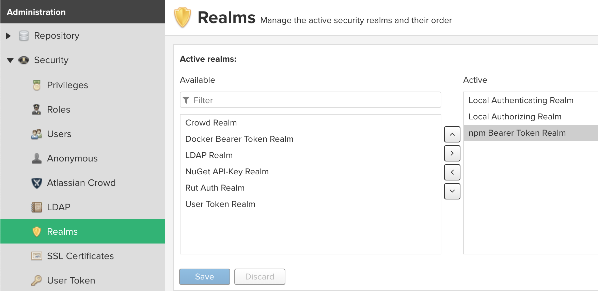

# NPM仓库的配置与使用

# 一、npm仓库的配置信息

- **Group类型仓库**
    - `npm-taobao`
    - `npm-cnpm`
    - `npm-hosted`
- **Proxy类型仓库**
    - `npm-taobao`：http://registry.npm.taobao.org/
    - `npm-cnpm`：http://registry.cnpmjs.org/
- **Hosted类型仓库**
    - `npm-hosted`

# 二、使用NPM仓库

```bash
npm config set registry http://nexus-ip-address:8081/repository/npm/
```

# 三、发布制品到NPM的Hosted仓库

当使用 `npm login` 或`npm adduser` 等NPM客户端使用Token进行登录认证到Nexus的NPM仓库时，Nexus默认仅支持`Local Authenticating Realm` ,认证不了NPM相关token。所以配置Nexus添加npm的认证域。



```bash
echo "hello" >> test
npm init
#   package name: (test) sadsada
#   version: (1.0.0)
#   description:
#   entry point: (index.js) test
#   test command:
#   git repository:
#   keywords:
#   author:
#   license: (ISC)
#   About to write to /root/test/package.json:
#   {
#     "name": "sadsada",
#     "version": "1.0.0",
#     "description": "",
#     "main": "f",
#     "scripts": {
#       "test": "echo \"Error: no test specified\" && exit 1"
#     },
#     "author": "",
#     "license": "ISC"
#   }
npm login -registry http://nexus-ip-address:8081/repository/npm-hosted/
# Username: admin
#Password: *****
# Email: (this IS public) asdad@sada.com
npm publish -registry http://nexus-ip-address:8081/repository/npm-hosted/
```

# 四、使用nrm工具切换npm仓库

Github地址：https://github.com/Pana/nrm
帮助快速切换npm仓库源。默认已经配置了npm、yarn、taobao、cnpm、nj、npmMirror、edunpm等常见的仓库源。

## 1. 安装

```bash
npm install nrm -g
```

## 2. 命令详解

```bash
$ nrm -h
Usage: nrm [options] [command]
Options:
  -V, --version output the version number
  -h, --help output usage information
Commands:
  ls List all the registries
  current Show current registry name
  use <registry> Change registry to registry
  add <registry> <url> [home] Add one custom registry
  set-auth [options] <registry> [value] Set authorize information for a custom registry with a base64 encoded string or username and pasword
  set-email <registry> <value> Set email for a custom registry
  set-hosted-repo <registry> <value> Set hosted npm repository for a custom registry to publish packages
  del <registry> Delete one custom registry
  home <registry> [browser] Open the homepage of registry with optional browser
  publish [options] [<tarball>|<folder>] Publish package to current registry if current registry is a custom registry.
   if you're not using custom registry, this command will run npm publish directly
  test [registry] Show response time for specific or all registries
  help Print this help
```

## 3. 常用命令

查看默认支持的npm 仓库

```bash
$ nrm ls
* npm -------- https://registry.npmjs.org/
  yarn ------- https://registry.yarnpkg.com/
  cnpm ------- http://r.cnpmjs.org/
  taobao ----- https://registry.npm.taobao.org/
  nj --------- https://registry.nodejitsu.com/
  npmMirror -- https://skimdb.npmjs.com/registry/
  edunpm ----- http://registry.enpmjs.org/
# "*"编注的仓库代表当前使用的仓库
```

添加私有的npm仓库

```bash
nrm add okd-nexus http://nexus-ip-address:8081/repository/npm-hosted/
```

切换npm仓库

```bash
 nrm use 仓库名
```

删除仓库

```bash
 nrm del 仓库名
```

测试仓库速度

```bash
nrm test
```
