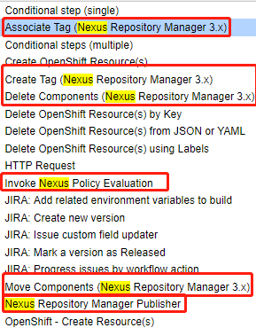
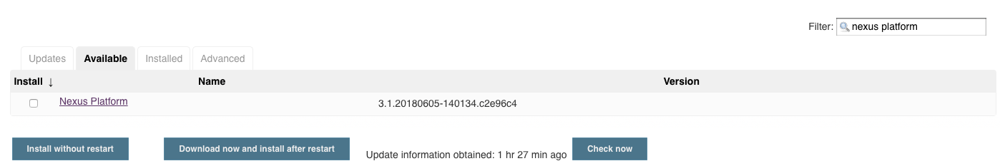
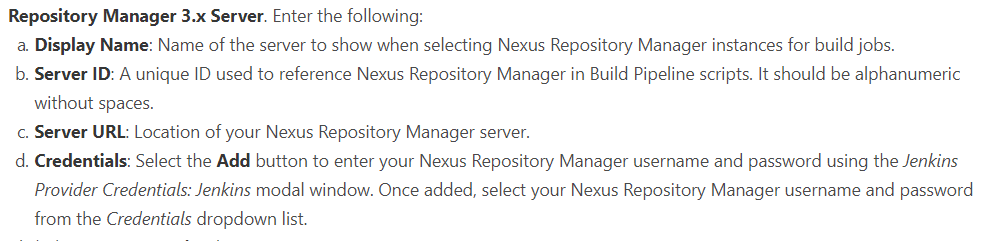
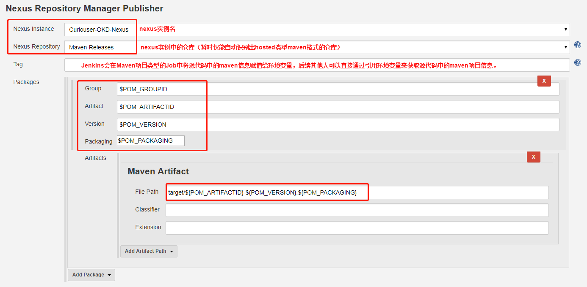

# 使用jenkins插件上传CI流程制品到Nexus仓库

# 一、Overviews

现在Nexus各个格式仓库中的制品大多数都是在Jenkins的持续集成CI流水线中生成的，每次流水线构建都需要其制品上传到Nexus中进行管理。Nexus针对Jenkins有Nexus Platform的插件来简化上传步骤，该插件主要用来上传Maven格式制品到Hosted类型的仓库中。同时，Jenkins CI Pipeline中除了可以使用该插件来上传Maven制品到Maven格式仓库，原始Curl也是可以的。

插件Github：https://github.com/jenkinsci/nexus-platform-plugin




# 二、Jenkins使用Nexus Platform上传maven格式制品

## 1、安装



## 2、配置

系统管理--> 系统设置--> Sonatype Nexus




## 3、Jenkins Job



## 4、Jenkins Pipeline

```groovy
.....上文省略......
stage ('上传制品') {
  steps {
    script{
      //读取源代码中的POM文件，获取生成制品的maven坐标信息（Jenkins需要安装pipeline-utility-steps插件）
      def pomfile = readMavenPom file: 'pom.xml'
      //使用Nexus Platform插件上传maven制品到Nexus的maven格式release仓库
      nexusPublisher nexusInstanceId: 'curiouser-okd-nexus', \
                     nexusRepositoryId: 'Maven-Releases', \
                     packages: [[$class: 'MavenPackage', \
                                 mavenAssetList: [[classifier: '', extension: '', \
                                 filePath: "target/${pomfile.artifactId}-${pomfile.version}.${pomfile.packaging}"]], \
                                 mavenCoordinate: [artifactId: "${pomfile.artifactId}", \
                                                   groupId: "${pomfile.groupId}", \
                                                   packaging: "${pomfile.packaging}", \
                                                   version: "${pomfile.version}"]]]
      //拼接maven制品的搜索链接,该链接是以源代码POM文件中的maven制品坐标信息参数对nexus api进行搜索，返回的response会重定向到制品的下载链接
      echo "The Jar Format Asset of Maven have been pushed to Hosted Repository: Maven-Release. The Download URL of the Asset: http://Nexus-IP地址:8081/service/rest/v1/search../assets/download?maven.groupId=${pomfile.groupId}&maven.artifactId=${pomfile.artifactId}&maven.baseVersion=${pomfile.version}&maven.extension=jar&maven.classifier"
    }
  }
}
.....下文省略......
```

# 5、Jenkins使用Curl命令手动上传maven制品到Nexus仓库中

```groovy
stage("上传制品"){
  steps{
    script{
      //读取源代码中的POM文件，获取生成制品的maven坐标信息（Jenkins需要安装pipeline-utility-steps插件）    
      def pomfile = readMavenPom file: 'pom.xml'
      //使用curl命令通过Nexus API接口上传制品到RAW仓库。下载URL既是上传URL
      sh "curl -sL -w 'Upload the jar to the repository status code: %{http_code}\n' -u admin:****** " +
         "--upload-file target/${pomfile.artifactId}-${pomfile.version}.${pomfile.packaging} " +
         "http://Nexus-IP地址:8081/repository/jenkins-product-repository/${pomfile.artifactId}-${pomfile.version}-${params.BUILD_VERSION}-${params.BUILD_ID}.${pomfile.packaging}"
    }
  }
}
```
