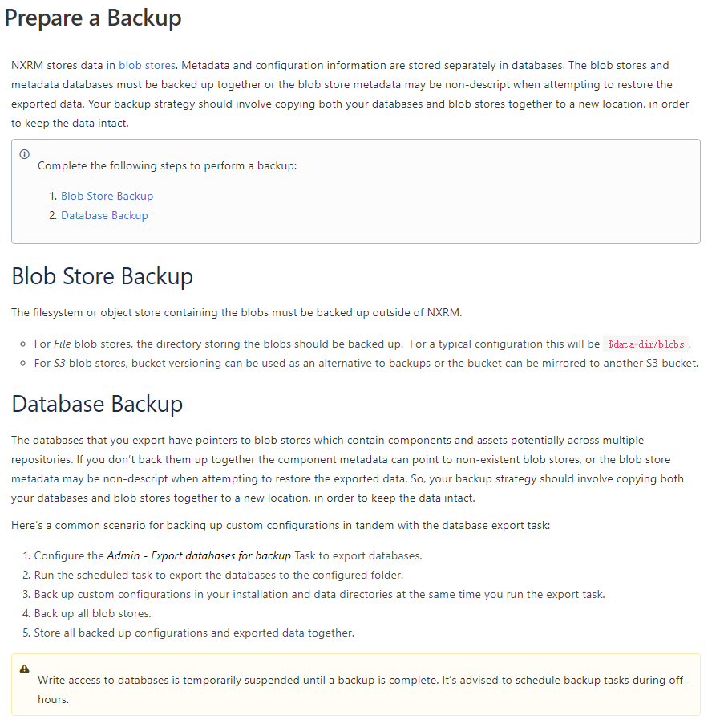
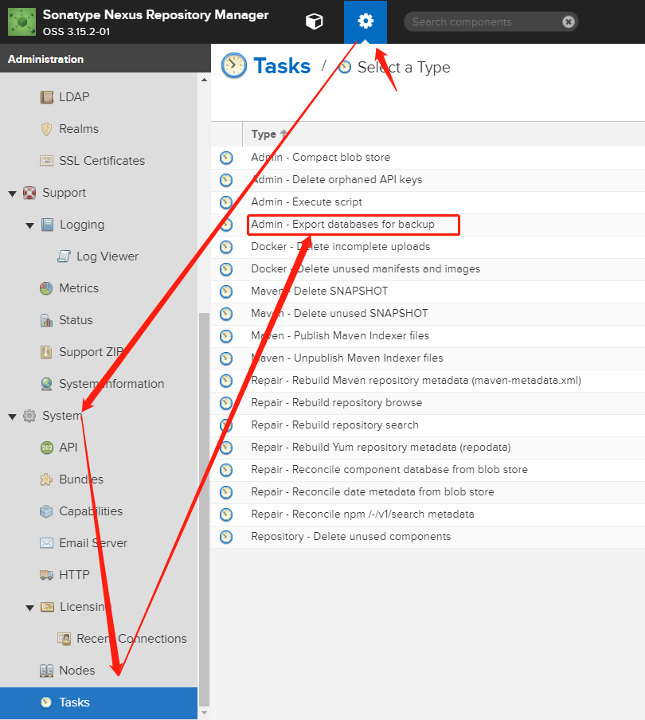
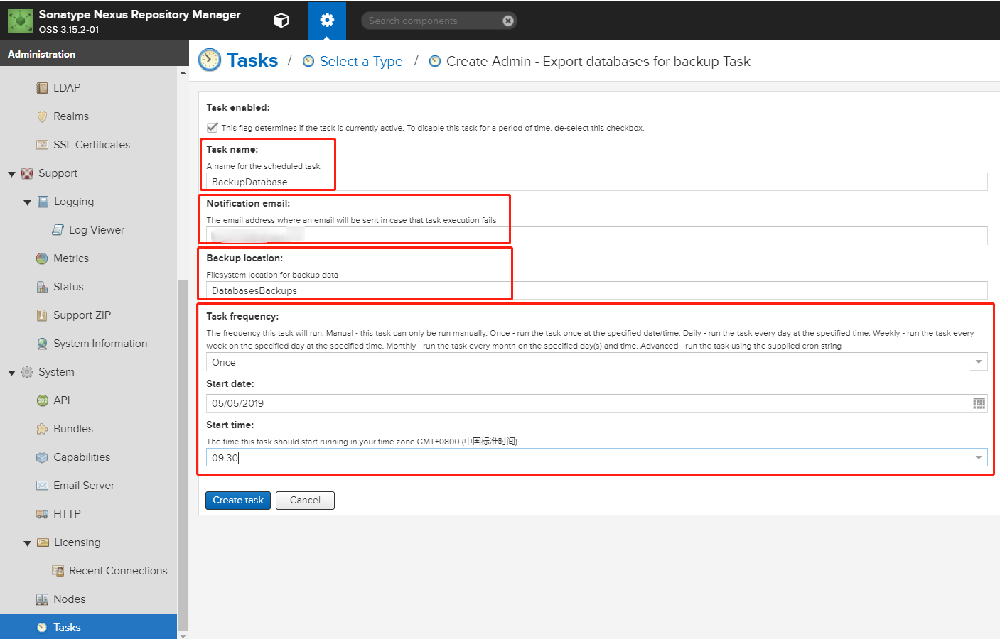
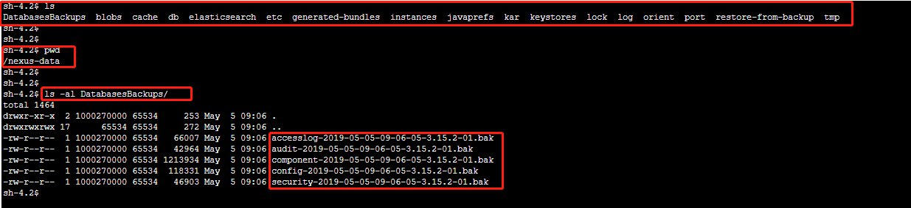
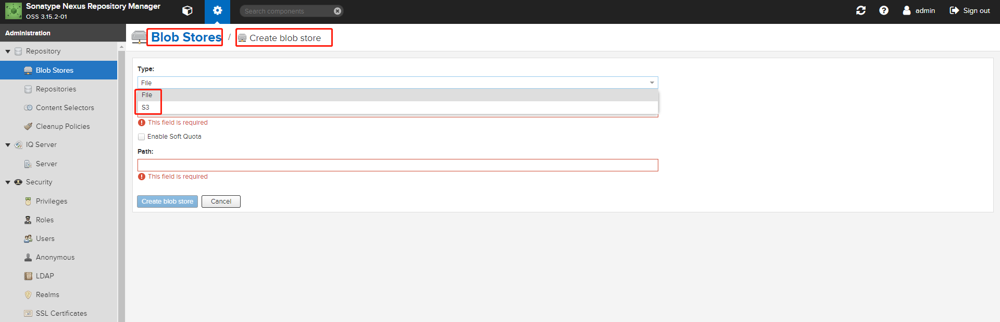
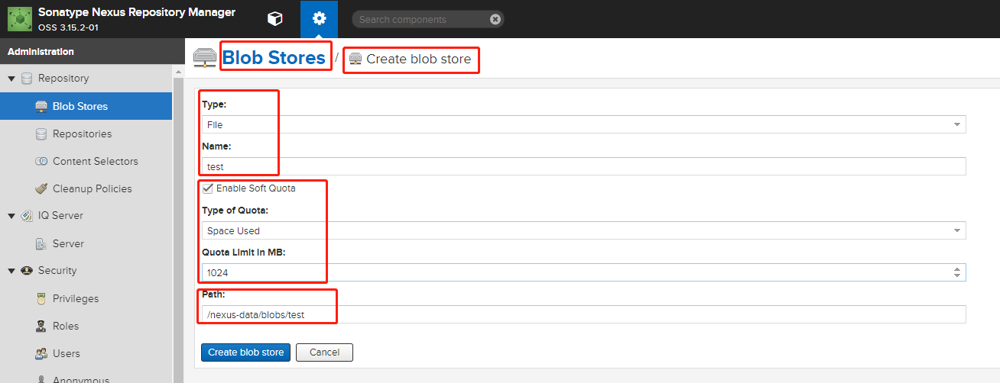
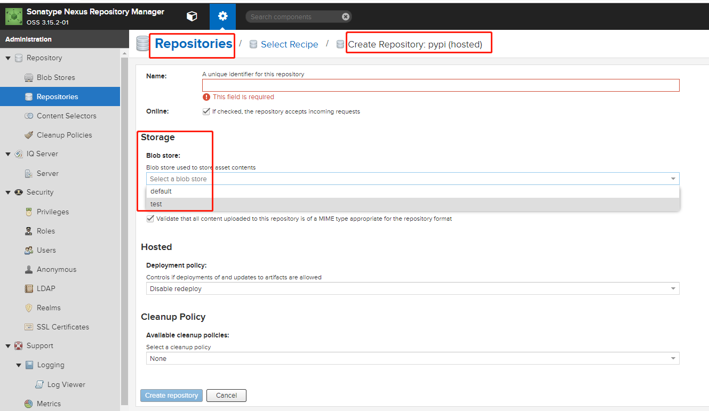
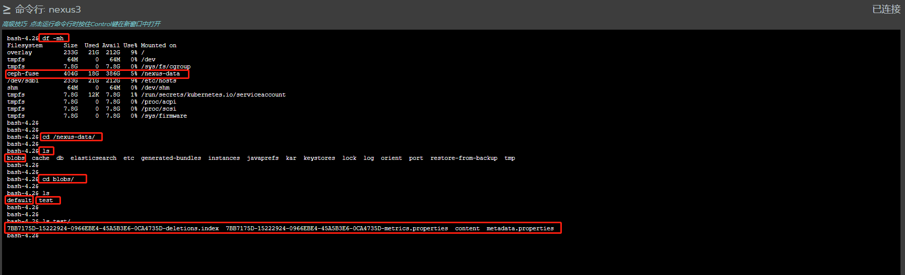
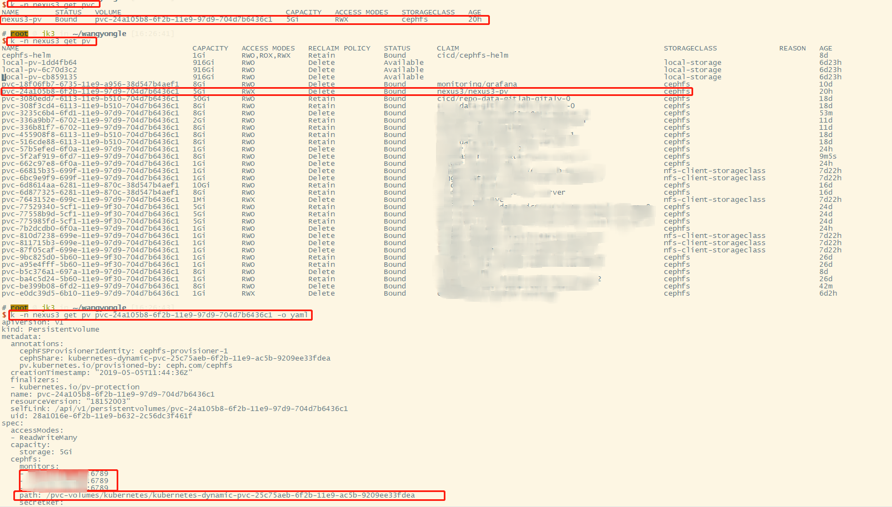
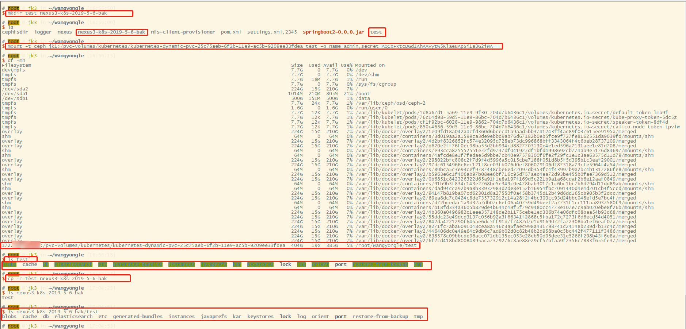

# Nexus的数据备份与恢复

Nexus的备份分为两个部分。一个是元信息和配置信息数据库的备份，一个是Blob存储的备份



# 一、配置DB的备份操作





# 二、Blob存储的备份操作

Nexus的blob stores可以简单的理解为一个文件夹，存放着各种制品的原始文件，例如原始的Java制品Jar包，POM文件，War包等文件。Blob的类型可以是文件系统的一个文件夹，也可以是S3对象存储的一个存储Buckets。（默认是文件系统类型，仅支持S3对象存储）一个blob存储可以被一个或者多个仓库组使用






# 三、Kubernetes上Nexus的数据备份

由于nexus在Kubernetes上的实例使用了CephFS类型的PVC存储作为Volume挂载在到数据目录下。所以，只要将Nexus容器持久化卷的PV对应Ceph路径挂载到某个目录下，拷贝其中的数据库DB目录和Blob目录进行数据备份。



```bash
mkdir test nexus3-k8s-2019-5-6-bak
mount -t ceph jk1:/pvc-volumes/kubernetes/kubernetes-dynamic-pvc-25c75aeb-6f2b-11e9-ac5b-9209ee33fdea test -o name=admin,secret=AQCxFKtcDGd1AhAAvytw5KlaeuApSi1a3G2iwA== 
cp -r test/db test/blob nexus3-k8s-2019-5-6-bak
umount test
```



# 四、数据恢复操作

数据恢复时使用的版本与旧版本的差异仅限于小版本号

1. 暂停旧的Nexus POD
2. 挂载旧的Nexus CephFS PV 到本地目录
3. 将备份提拷贝新的CephFS PV中
4. 修改备份目录的权限
5. 重启新的Nexus POD

# 五、备份策略优化

1. hosted类型的仓库可使用单独的Blob存储，备份时只备份该Blob。Proxy类型的仓库可不用备份。
2. 可添加执行脚本类型的定时任务做备份，将新增Blob同步到其他Nexus实例中
