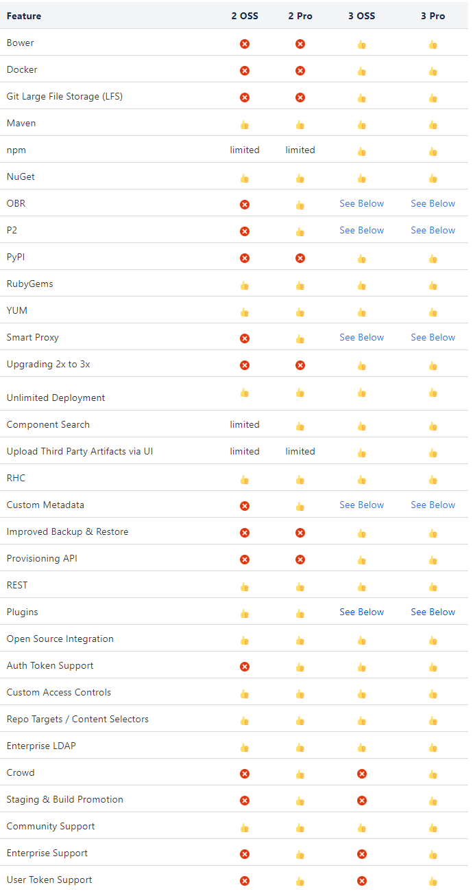
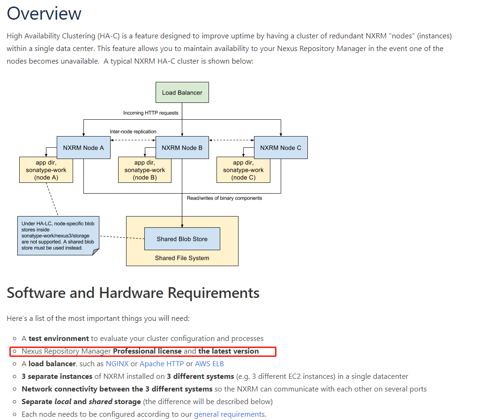

# 一、Nexus简介

Nexus是Sonatype公司出的一款目前最为流程的构件仓库管理软件，主要用于局域网内部的构件管理，代理访问外部仓库等。例如对于公司私有的Java制品Jar包，可上传至Nexus的Maven类型仓库中进行集中管理；代理访问阿里云Maven仓库，缓存加速获取互联网上的Java制品。Nexus使用Lucene提供了强大的构件搜索功能，拥有丰富的RestFul API接口用于管理控制，支持WebDAV和LDAP安全身份认证，基于RBAC的权限访问控制等功能。市面上同类产品有Apache的Archiva和JFrog的Artifatory。

Nexus分为免费开源版OSS和收费商业版Professional




# 二、仓库类型

- **`Proxy`** 类型仓库主要用于代理缓存访问外网上其他公开的仓库，将每次从代理仓库拉取的制品缓存到nexus文件系统中，下次再拉取相同版本制品时就不需再次从外网拉取，起到代理访问缓存的功能
- **`Hosted`** 类型的仓库主要用于存放各个项目组产出的、用于共享、不能放到公网上、私有的制品。有两种版本策略，一种是Snapshots版本策略类型的，对于相同版本制品的上传，nexus会自动追加时间戳加以区分；一种是Release版本策略类型的，对于相同的制品，要明确版本，不能存放相同版本。可以理解为snapshots仓库存放一些内容变更频繁的制品，这样不管上传还是使用时不用频繁变更版本号就能拉取到最新版本。而release仓库存放一些内容稳定变更少的制品，使用时指定好版本就行，无需经常变动
- **`Group`** 类型仓库主要用于组合其他仓库，统一对外使用方式。可设置组仓库组合其他仓库的顺序。例如组合顺序为先拉取maven格式aliyun代理仓库中的制品，如果其中没有想要的制品，再去拉取maven格式Central代理仓库中的制品。如果还没有，就去maven格式hosted类型仓库中拉取，直到遍历完所有的组合仓库。同时，拉取使用时不需要配置那么多的仓库地址，只需要配置group仓库地址就行

# 三、官方高可用方案

官方收费版的高可用方案



# 四、Kubernetes部署

```yaml
---
apiVersion: apps/v1
kind: Deployment
metadata:
  labels:
    app: nexus3
  name: nexus3
  namespace: nexus3
spec:
  replicas: 1
  selector:
    matchLabels:
      app: nexus3
  strategy:
    type: Recreate
  template:
    metadata:
      labels:
        app: nexus3
    spec:
      imagePullSecrets:
      - name: harbor-secrets
      initContainers:
      - name: init-scheduler
        image: busybox:latest
        imagePullPolicy: IfNotPresent
        command: ['sh', '-c', 'chmod -R 777 /nexus-data']
        volumeMounts:
        - name: nexus3-data
          mountPath: /nexus-data
      containers:
      - env:
        - name: CONTEXT_PATH
          value: /
        - name: TZ
          value: 'Asia/Shanghai'
        image: docker.io/sonatype/nexus3:3.15.2
        imagePullPolicy: IfNotPresent
        readinessProbe:
          failureThreshold: 1
          initialDelaySeconds: 100
          periodSeconds: 60
          successThreshold: 1
          tcpSocket:
            port: 8081
          timeoutSeconds: 1
        livenessProbe:
          failureThreshold: 1
          initialDelaySeconds: 100
          periodSeconds: 60
          successThreshold: 1
          tcpSocket:
            port: 8081
          timeoutSeconds: 1
        name: nexus3
        ports:
        - containerPort: 8081
          protocol: TCP
        resources:
          limits:
            memory: 4096Mi
          requests:
            memory: 2048Mi
        terminationMessagePath: /dev/termination-log
        volumeMounts:
        - mountPath: /nexus-data
          name: nexus3-data
      dnsPolicy: ClusterFirst
      restartPolicy: Always
      securityContext: {}
      terminationGracePeriodSeconds: 30
      volumes:
      - name: nexus3-data
        persistentVolumeClaim:
          claimName: nexus3-pv
---
apiVersion: v1
kind: PersistentVolumeClaim
metadata:
  annotations:
    volume.beta.kubernetes.io/storage-class: cephfs
  labels:
    app: nexus3
  name: nexus3-pv
        namespace: nexus3
        spec:
          accessModes:
            - ReadWriteMany
          resources:
            requests:
              storage: 1000Gi
---
apiVersion: v1
kind: Service
metadata:
  labels:
    app: nexus3
  name: nexus3
  namespace: nexus3
spec:
  ports:
  - name: 8081-tcp
    port: 8081
    protocol: TCP
    targetPort: 8081
  selector:
    app: nexus3
  sessionAffinity: None
  type: ClusterIP
---
apiVersion: extensions/v1beta1
kind: Ingress
metadata:
  name: nexus3
  namespace: nexus3
spec:
  rules:
  - host: nexus.curiouser.com
    http:
      paths:
      - path: /
        backend:
          serviceName: nexus3
          servicePort: 8081
```

# 五、常见仓库配置

- **YUM格式制品**
  - `Group类型仓库`
    - yum
      - yum-ustc
      - yum-ansible
      - yum-cloudera5
  - `Proxy类型仓库`
    - yum-ansible：https://releases.ansible.com/ansible/rpm/release/epel-7-x86_64/
    - yum-ustc： http://mirrors.ustc.edu.cn/
    - yum-cloudera5：https://archive.cloudera.com/cdh5/
  - `Hosted类型仓库`
    - yum-hosted
- **Maven格式制品**
  - `Group类型仓库`
    - maven
      - maven-aliyun
      - maven-central
      - maven-releases
      - maven-snapshots
  - `Proxy类型仓库`
    - maven-central：https://repo1.maven.org/maven2/
    - maven-aliyun：http://maven.aliyun.com/nexus/content/groups/public
  - `Hosted类型仓库`
    - maven-snapshots
    - maven-releases
- **NPM格式制品**
  - `Group类型仓库`
    - npm
      - npm-taobao
      - npm-cnpm
      - npm-hosted
  - `Proxy类型仓库`
    - npm-taobao：http://registry.npm.taobao.org/
    - npm-cnpm：http://registry.cnpmjs.org/
  - `Hosted类型仓库`
    - npm-hosted（上传权限需修改realms)
- **Docker格式制品**
  - `Group类型仓库`
    - docker（设置http-port:8082）
  - `Proxy类型仓库`
    - docker-io： https://registry-1.docker.io
  - `Hosted类型仓库`
    - docker-hosted（设置http-port:8083）
