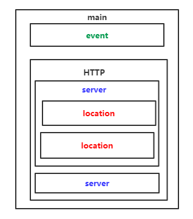

# Nginx安装配置及基础

# 一、简介

官网：http://nginx.org/ 

nginx是一款自由的、开源的、高性能的HTTP服务器和反向代理服务器；同时也是一个IMAP、POP3、SMTP代理服务器；nginx可以作为一个HTTP服务器进行网站的发布处理，另外nginx可以作为反向代理进行负载均衡的实现。

- 反向代理
- 负载均衡

## 负载均衡调度算法

- **weight轮询（默认）**：接收到的请求按照顺序逐一分配到不同的后端服务器，即使在使用过程中，某一台后端服务器宕机，nginx会自动将该服务器剔除出队列，请求受理情况不会受到任何影响。 这种方式下，可以给不同的后端服务器设置一个权重值（weight），用于调整不同的服务器上请求的分配率；权重数据越大，被分配到请求的几率越大；该权重值，主要是针对实际工作环境中不同的后端服务器硬件配置进行调整的。
- **ip_hash**：每个请求按照发起客户端的ip的hash结果进行匹配，这样的算法下一个固定ip地址的客户端总会访问到同一个后端服务器，这也在一定程度上解决了集群部署环境下session共享的问题。
- **fair**：智能调整调度算法，动态的根据后端服务器的请求处理到响应的时间进行均衡分配，响应时间短处理效率高的服务器分配到请求的概率高，响应时间长处理效率低的服务器分配到的请求少；结合了前两者的优点的一种调度算法。但是需要注意的是nginx默认不支持fair算法，如果要使用这种调度算法，请安装upstream_fair模块
- **url_hash**：按照访问的url的hash结果分配请求，每个请求的url会指向后端固定的某个服务器，可以在nginx作为静态服务器的情况下提高缓存效率。同样要注意nginx默认不支持这种调度算法，要使用的话需要安装nginx的hash软件包

# 二、进制安装

## 1、DEB(apt)

```bash
release_name=$(lsb_release -c | awk '{print $2}')
echo -e "deb https://nginx.org/packages/ubuntu/ $release_name nginx" >> /etc/apt/sources.list.d/nginx.list
echo -e "deb-src https://nginx.org/packages/ubuntu/ $release_name nginx" >> /etc/apt/sources.list.d/nginx.list
curl -o /tmp/nginx_signing.key https://nginx.org/keys/nginx_signing.key
gpg --dry-run --quiet --import --import-options import-show /tmp/nginx_signing.key
mv /tmp/nginx_signing.key /etc/apt/trusted.gpg.d/nginx_signing.asc
apt update
apt install nginx
nginx -V
```

## 2、RPM(yum)

- **以RPM方式安装的配置文件在/etc/nginx/目录下**
- **二进制安装自带的模块**
- **二进制安装(例如YUM)的nginx不支持动态的安装和新加载模块的，新增模块需要重新编译安装了nginx** 

```bash
#To set up the yum repository for RHEL/CentOS, create the file named /etc/yum.repos.d/nginx.repo with the following contents:
[nginx]
name=nginx repo
baseurl=http://nginx.org/packages/OS/OSRELEASE/$basearch/
gpgcheck=0
enabled=1
#Replace “OS” with “rhel” or “centos”, depending on the distribution used, and “OSRELEASE” with “6” or “7”, for 6.x or 7.x versions, respectively.

$ bash -c 'cat > /etc/yum.repos.d/nginx.repo <<EOF
[nginx]
name=nginx repo
baseurl=http://nginx.org/packages/centos/7/\$basearch/    #'$'符号需要转义
gpgcheck=0
enabled=1
EOF' && \
  yum clean all && \
  yum repolist && \
  yum list nginx --showduplicates | sort -r && \
  yum install -y nginx
```

# 三、源码编译

## 1、安装编译工具

```bash
yum install -y gcc gc++ perl gcc-c++
```

##  2、安装编译必备库

- [PCRE](http://pcre.org/) ：required by NGINX [Core](https://nginx.org/en/docs/ngx_core_module.html) and [Rewrite](https://nginx.org/en/docs/http/ngx_http_rewrite_module.html) modules and provides support for regular expressions

  - pcre是一个正则库，nginx使用正则进行重写要用到，必须安装

  - pcre库有两个版本：pcre、pcre2(新版的库)。推荐下载pcre，pcre2是编译是通不过的。

  - 编译pcre就必须用到c++编译器，使用pcre2就使用gcc编译器。

  ```bash
  # yum安装
  $ rpm -qa pcre pcre-devel
  $ yum install pcre pcre-devel
  
  # 源码编译安装
  $ version=8.43 && \
    wget ftp://ftp.pcre.org/pub/pcre/pcre-$version.tar.gz && \
    tar -zxf pcre-$version.tar.gz&& \
    cd pcre-$version && \
    ./configure && \
    make && \
    make install
  ```

- [zlib](http://www.zlib.net/)： required by NGINX [Gzip](https://nginx.org/en/docs/http/ngx_http_gzip_module.html) module for headers compression:

  ```bash
  # yum安装
  $ rpm -qa zlib zlib-devel
  $ yum install zlib zlib-devel
  
  # 源码编译安装
  
  $ version=1.2.11 && \
    wget http://zlib.net/zlib-$version.tar.gz && \
    tar -zxf zlib-$version.tar.gz && \
    cd zlib-$version && \
    ./configure && \
    make && \
    make install
  ```

-  [OpenSSL](https://www.openssl.org/)：required by NGINX SSL modules to support the HTTPS protocol

  OpenSSL 是一个强大的安全套接字层密码库，囊括主要的密码算法、常用的密钥和证书封装管理功能及 SSL 协议，并提供丰富的应用程序供测试或其它目的使用。nginx 不仅支持 http 协议，还支持 https（即在ssl协议上传输http），所以需要在 Centos 安装 OpenSSL 库 
  
  ```bash
  # yum安装
  $ rpm -qa openssl openssl-devel
  $ yum install openssl openssl-devel
  
  # 源码编译安装
  $ version=3.0.5 && \
    wget http://www.openssl.org/source/openssl-$version.tar.gz && \
    tar -zxf openssl-$version.tar.gz && \
    cd openssl-$version && \
    ./config && \
    make && \
    make install
    
  # 如果是在MacOS下源码编译，配置时手动指定OS平台
  ./Configure darwin64-x86_64-cc && \
  make  && \
  sudo make install
  ```

## 3、下载解压源码包

```bash
version=1.18.0 && \
mkdir nginx-source && \
cd nginx-source && \
curl -s -# https://www.openssl.org/source/openssl-1.1.1.tar.gz | tar zxvf - -C ./ && \
curl -s -# https://nginx.org/download/nginx-$version.tar.gz | tar zxvf - -C ./ && \
cd nginx-$version
```

##  4、查看Nginx默认开起的模块

```bash
cat ./auto/options | grep YES
```

##  5、编译常用模块

| 模块           | 详解                     | 模块编译参数                    | **依赖** |
| -------------- | ------------------------ | ------------------------------- | -------- |
| auth模块       | 基于用户名密码的访问控制 | --with-http_auth_request_module |          |
| 访问限制模块   | 连接频率限制             | 默认集成                        |          |
| 请求频率模块   | 请求频率限制             | 默认集成                        |          |
| 状态监控模块   | nginx状态监控            |                                 |          |
| access模块     | 基于ip的访问控制         |                                 |          |
| **gzip模块**   |                          |                                 |          |
| **gunzip模块** |                          |                                 |          |
|                |                          |                                 |          |

##  6、配置编译参数 

**创建nginx用户----->创建相关目录------>配置编译参数**

**编译参数文档**：http://nginx.org/en/docs/configure.html

```bash
$ ./configure --help  #查看编译配置参数
--with开头的，默认是禁用的(没启动的，想使用的话需要在编译的时候加上)
--without开头的，默认是启用的(不想启用此模块时，可以在编译的时候加上这个参数)
#  --help                             print this message
#  --prefix=PATH                      指定安装目录
#  --sbin-path=PATH                   指定二进制执行程序文件存放位置。
#  --modules-path=PATH                指定第三方模块的存放路径
#  --conf-path=PATH                   指定配置文件nginx.conf存放位置
#  --error-log-path=PATH              指定错误日志存放位置
#  --pid-path=PATH                    指定nginx.pid文件存放位置
#  --lock-path=PATH                   指定nginx.lock文件存放位置
#  --user=USER                        指定程序运行时的非特权用户
#  --group=GROUP                      指定程序运行时的非特权用户组
#  --build=NAME                       set build name
#  --builddir=DIR                     指定编译目录
#  --with-select_module               enable select module
#  --without-select_module            disable select module
#  --with-poll_module                 enable poll module
#  --without-poll_module              disable poll module
#  --with-threads                     enable thread pool support
#  --with-file-aio                    enable file AIO support
#  --with-http_ssl_module             enable ngx_http_ssl_module
#  --with-http_v2_module              enable ngx_http_v2_module
#  --with-http_realip_module          enable ngx_http_realip_module
#  --with-http_addition_module        enable ngx_http_addition_module
#  --with-http_xslt_module            enable ngx_http_xslt_module
#  --with-http_xslt_module=dynamic    enable dynamic ngx_http_xslt_module
#  --with-http_image_filter_module    enable ngx_http_image_filter_module
#  --with-http_image_filter_module=dynamic    enable dynamic ngx_http_image_filter_module
#  --with-http_geoip_module           enable ngx_http_geoip_module
#  --with-http_geoip_module=dynamic   enable dynamic ngx_http_geoip_module
#  --with-http_sub_module             enable ngx_http_sub_module
#  --with-http_dav_module             enable ngx_http_dav_module
#  --with-http_flv_module             enable ngx_http_flv_module
#  --with-http_mp4_module             enable ngx_http_mp4_module
#  --with-http_gunzip_module          enable ngx_http_gunzip_module
#  --with-http_gzip_static_module     enable ngx_http_gzip_static_module
#  --with-http_auth_request_module    enable ngx_http_auth_request_module
#  --with-http_random_index_module    enable ngx_http_random_index_module
#  --with-http_secure_link_module     enable ngx_http_secure_link_module
#  --with-http_degradation_module     enable ngx_http_degradation_module
#  --with-http_slice_module           enable ngx_http_slice_module
#  --with-http_stub_status_module     enable ngx_http_stub_status_module
#  --without-http_charset_module      disable ngx_http_charset_module
#  --without-http_gzip_module         disable ngx_http_gzip_module
#  --without-http_ssi_module          disable ngx_http_ssi_module
#  --without-http_userid_module       disable ngx_http_userid_module
#  --without-http_access_module       disable ngx_http_access_module
#  --without-http_auth_basic_module   disable ngx_http_auth_basic_module
#  --without-http_autoindex_module    disable ngx_http_autoindex_module
#  --without-http_geo_module          disable ngx_http_geo_module
#  --without-http_map_module          disable ngx_http_map_module
#  --without-http_split_clients_module disable ngx_http_split_clients_module
#  --without-http_referer_module      disable ngx_http_referer_module
#  --without-http_rewrite_module      disable ngx_http_rewrite_module
#  --without-http_proxy_module        disable ngx_http_proxy_module
#  --without-http_fastcgi_module      disable ngx_http_fastcgi_module
#  --without-http_uwsgi_module        disable ngx_http_uwsgi_module
#  --without-http_scgi_module         disable ngx_http_scgi_module
#  --without-http_memcached_module    disable ngx_http_memcached_module
#  --without-http_limit_conn_module   disable ngx_http_limit_conn_module
#  --without-http_limit_req_module    disable ngx_http_limit_req_module
#  --without-http_empty_gif_module    disable ngx_http_empty_gif_module
#  --without-http_browser_module      disable ngx_http_browser_module
#  --without-http_upstream_hash_module   disable ngx_http_upstream_hash_module
#  --without-http_upstream_ip_hash_module  disable ngx_http_upstream_ip_hash_module
#  --without-http_upstream_least_conn_module  disable ngx_http_upstream_least_conn_module
#  --without-http_upstream_keepalive_module   disable ngx_http_upstream_keepalive_module
#  --without-http_upstream_zone_module      disable ngx_http_upstream_zone_module
#  --with-http_perl_module            enable ngx_http_perl_module
#  --with-http_perl_module=dynamic    enable dynamic ngx_http_perl_module
#  --with-perl_modules_path=PATH      set Perl modules path
#  --with-perl=PATH                   set perl binary pathname
#  --http-log-path=PATH               set http access log pathname
#  --http-client-body-temp-path=PATH  set path to store http client request body temporary files
#  --http-proxy-temp-path=PATH        set path to store http proxy temporary files
#  --http-fastcgi-temp-path=PATH      set path to store http fastcgi temporary files
#  --http-uwsgi-temp-path=PATH        set path to store http uwsgi temporary files
#  --http-scgi-temp-path=PATH         set path to store http scgi temporary files
#  --without-http                     disable HTTP server
#  --without-http-cache               disable HTTP cache
#  --with-mail                        enable POP3/IMAP4/SMTP proxy module
#  --with-mail=dynamic                enable dynamic POP3/IMAP4/SMTP proxy module
#  --with-mail_ssl_module             enable ngx_mail_ssl_module
#  --without-mail_pop3_module         disable ngx_mail_pop3_module
#  --without-mail_imap_module         disable ngx_mail_imap_module
#  --without-mail_smtp_module         disable ngx_mail_smtp_module
#  --with-stream                      enable TCP/UDP proxy module
#  --with-stream=dynamic              enable dynamic TCP/UDP proxy module
#  --with-stream_ssl_module           enable ngx_stream_ssl_module
#  --with-stream_realip_module        enable ngx_stream_realip_module
#  --with-stream_geoip_module         enable ngx_stream_geoip_module
#  --with-stream_geoip_module=dynamic enable dynamic ngx_stream_geoip_module
#  --with-stream_ssl_preread_module   enable ngx_stream_ssl_preread_module
#  --without-stream_limit_conn_module disable ngx_stream_limit_conn_module
#  --without-stream_access_module     disable ngx_stream_access_module
#  --without-stream_geo_module        disable ngx_stream_geo_module
#  --without-stream_map_module        disable ngx_stream_map_module
#  --without-stream_split_clients_module   disable ngx_stream_split_clients_module
#  --without-stream_return_module     disable ngx_stream_return_module
#  --without-stream_upstream_hash_module   disable ngx_stream_upstream_hash_module
#  --without-stream_upstream_least_conn_module   disable ngx_stream_upstream_least_conn_module
#  --without-stream_upstream_zone_module  disable ngx_stream_upstream_zone_module
#  --with-google_perftools_module     enable ngx_google_perftools_module
#  --with-cpp_test_module             enable ngx_cpp_test_module
#  --add-module=PATH                  enable external module
#  --add-dynamic-module=PATH          enable dynamic external module
#  --with-compat                      dynamic modules compatibility
#  --with-cc=PATH                     set C compiler pathname
#  --with-cpp=PATH                    set C preprocessor pathname
#  --with-cc-opt=OPTIONS              set additional C compiler options
#  --with-ld-opt=OPTIONS              set additional linker options
#  --with-cpu-opt=CPU                 build for the specified CPU, valid values:pentium, pentiumpro, pentium3, pentium4,athlon, opteron, sparc32, sparc64, ppc64
#  --without-pcre                     disable PCRE library usage
#  --with-pcre                        force PCRE library usage
#  --with-pcre=DIR                    设置pcre源码目录路径
#  --with-pcre-opt=OPTIONS            set additional build options for PCRE
#  --with-pcre-jit                    build PCRE with JIT compilation support
#  --with-zlib=DIR                    set path to zlib library sources
#  --with-zlib-opt=OPTIONS            set additional build options for zlib
#  --with-zlib-asm=CPU                use zlib assembler sources optimized for the specified CPU, valid values:pentium, pentiumpro
#  --with-libatomic                   force libatomic_ops library usage
#  --with-libatomic=DIR               set path to libatomic_ops library sources
#  --with-openssl=DIR                 set path to OpenSSL library sources
#  --with-openssl-opt=OPTIONS         set additional build options for OpenSSL
#  --with-debug                       enable debug logging

$ groupadd nginx && \
  useradd nginx -s /sbin/nologin -M -g nginx && \
  mkdir -p /opt/nginx-1.17.6/logs
```

## 7、编译安装

```bash
# make命令将源代码编译为二进制文件
$ make
# 根据配置阶段指定的路径和功能将软件以特定的方式安装到指定位置
$ make install
```

## 8、设置环境变量

```bash
ln -s /opt/nginx-1.17.6/nginx /usr/bin/nginx
```

## 9、启动 

手动控制Nginx的生命周期

```bash
$ nginx -t  #启动测试
$ nginx     #启动
```

托管给Systemd

```bash
$ bash -c 'cat > /usr/lib/systemd/system/nginx.service << EOF 
[Unit]
Description=The nginx HTTP and reverse proxy server
After=syslog.target network.target remote-fs.target nss-lookup.target
[Service]
Type=forking
PIDFile=/opt/nginx-1.17.6/nginx.pid
ExecStartPre=/opt/nginx-1.17.6/nginx -t
ExecStart=/opt/nginx-1.17.6/nginx
ExecReload=/bin/kill -s HUP /opt/nginx-1.17.6/nginx.pid
ExecStop=/bin/kill -s QUIT /opt/nginx-1.17.6/nginx.pid
PrivateTmp=true
[Install]
WantedBy=multi-user.target
EOF' && \
  systemctl daemon-reload && \
  systemctl enable nginx.service && \
  systemctl start nginx.service
```

## 10、验证

```bash
# 查看监听的端口
$ lsof -i :80
$ netstat -lanp |grep 80
# 使用命令行工具访问页面
$ curl 127.0.0.1
$ wget 127.0.0.1
# 查看进程
$ ps -ef | grep nginx
# root 2564 1  0 23:21 ? 00:00:00 nginx: master process /opt/nginx-1.17.6/nginx
# nginx 2565 2564 0 23:21 ? 00:00:00 nginx: worker process
```


# 四、Nginx目录结构

 编译安装的目录结构 

```bash
#由于编译时指定了相关路径
$ tree /opt/nginx-1.17.6
/opt/nginx-1.17.6
├── 3party_module
├── client_body_temp
├── fastcgi.conf
├── fastcgi.conf.default
├── fastcgi_params
├── fastcgi_params.default
├── fastcgi_temp
├── html                                  # 站点目录
│   ├── 50x.html                          # 错误页
│   └── index.html                        # 首页
├── koi-utf
├── koi-win
├── logs                                  # 日志目录
│   ├── access.log                        # nginx访问日志
│   └── error.log                         # Nginx的错误日志
├── mime.types                            # 媒体类型
├── mime.types.default
├── nginx                                 # Nginx的二进制启动命令脚本
├── nginx.conf                            # Nginx的主要配置文件
├── nginx.conf.default
├── nginx.pid                             # Nginx所有的进程号文件
├── nginx-rtmp-module
├── proxy_temp                            # 临时目录
├── scgi_params                
├── scgi_params.default
├── scgi_temp
├── uwsgi_params
├── uwsgi_params.default
├── uwsgi_temp
└── win-utf
```

# 五、命令行参数

```bash
$ nginx -s signal
#    stop — fast shutdown
#    quit — graceful shutdown
#    reload — 重新加载配置文件
#    reopen — reopening the log files

Nginx重新加载配置文件的过程：主进程接受到加载信号后：
1、首先会校验配置的语法，然后生效新的配置，
2、如果成功，则主进程会启动新的工作进程，同时发送终止信号给旧的工作进程。
3、否则主进程回退配置，继续工作。
在第二步，旧的工作进程收到终止信号后，会停止接收新的连接请求，知道所有现有的请求处理完，然后退出。

$ nginx -t # 检查配置文件语法是否错误，并尝试启动
$ nginx -q # suppress non-error messages during configuration testing. 
$ nginx -T # same as -t, but additionally dump configuration files to standard output (1.9.2).
$ nginx    #启动Nginx
$ nginx -v #查看nginx的版本
$ nginx -V #查看nginx的版本，编译器版本，编译时的参数等
$ nginx -p prefix # set nginx path prefix, i.e. a directory that will keep server files (default value is /usr/local/nginx).
$ nginx -c file  # 指定配置文件（不使用默认路径下的配置文件）
$ nginx -? | -h  # print help for command-line parameters.
$ nginx -g directives # set global configuration directives, for example,                            #nginx -g "pid /var/run/nginx.pid; worker_processes `sysctl -n hw.ncpu`;" 
```

# 六、配置文件结构




- **全局配置**：用来设置影响Nginx服务器整体运行的配置，作用于全局。（从文件开始到events块的内容）
  - **作用**：通常包括服务器的用户组，允许生成的worker process、Nginx进程PID的存放路径、日志的存放路径和类型以及配置文件引入等
- **事件配置**：涉及的指令主要影响Nginx服务器和用户的网络连接。
  - **作用**：常用到的设置包括是否开启多worker process下的网络连接进行序列化，是否允许同时接收多个网络连接，选择何种时间驱动模型处理连接请求，每个worker process可以同时支持的最大连接数等
- **模块配置**
  - HTTP模块
    - HTTP模块的全局配置
    - 虚拟主机的配置

```bash
# Nginx全局配置
user  nobody;						   # 指定Nginx的worker进程运行用户以及用户组，默认由nobody nobody运行
worker_processes  1;		   # 指定Nginx要开启的进程数，默认为1
error_log  logs/error.log  # 全局错误日志文件路径。日志级别：debug/info/notice/warn/error/crit
pid        logs/nginx.pid; # 指定进程PID文件的路径

# 事件配置，设定nginx的工作模式及连接数上限
events {
  accept_mutex on; # 设置网路连接序列化，防止惊群现象发生，默认为on
  multi_accept on; # 设置一个进程是否同时接受多个网络连接，默认为off
	use epoll; # 指定nginx的工作模式。支持的工作模式有select ,poll,kqueue,epoll,rtsig,/dev/poll
						 # epoll是多路复用IO(I/O Multiplexing)中的一种方式，
						 # select和poll都是标准的工作模式，kqueue和epoll是高效的工作模式，
						 # 对于linux系统，epoll是首选。
  worker_connections  1024; # 设置nginx每个进程最大的连接数，默认是1024，所以nginx最大的连接数
  													# max_client=worker_processes * worker_connections。
  													# 进程最大连接数受到系统最大打开文件数的限制，需要设置ulimit。
}

# HTTP模块配置
http {
    include       mime.types; # 配置处理前端请求的MIME类型
    default_type  application/octet-stream;
    log_format  main  '$remote_addr - $remote_user [$time_local] "$request" '
                      '$status $body_bytes_sent "$http_referer" '
                      '"$http_user_agent" "$http_x_forwarded_for"';

    access_log  logs/access.log  main;
    
    sendfile        on; # 开启高效文件传输模式（zero copy 方式），避免内核缓冲区数据和用户缓冲区数据之间的拷贝。sendfile 参数和I/O有关，当上传文件时，内核首先缓冲数据，然后将数据发送到应用应用程序缓冲区。 应用程序反过来将数据发送到目的地。Sendfile方法是一种改进的数据传输方法，其中数据在操作系统内核空间内的文件描述符之间复制，而不将数据传输到应用程序缓冲区。由于没有了用户态和内核态之间的切换，也没有内核缓冲区和用户缓冲区之间的拷贝，大大提升了传输性能。
    tcp_nopush     on;
    keepalive_timeout  65;    # 设置客户端连接超时时间
    gzip  on;								  # 设置是否开启gzip模块
		
		# 虚拟主机 
    server {
        listen       80;			# 虚拟主机的服务端口
        server_name  localhost;
				server_tokens off;		# 隐藏响应头中的有关操作系统和Nginx服务器版本号的信息，保障安全性
        charset koi8-r;
        access_log  logs/host.access.log  main;

        location / {
            root   html;
            index  index.html index.htm;
        }

        #error_page  404              /404.html;

        # redirect server error pages to the static page /50x.html
        #
        error_page   500 502 503 504  /50x.html;
        location = /50x.html {
            root   html;
        }

        # proxy the PHP scripts to Apache listening on 127.0.0.1:80
        #
        #location ~ \.php$ {
        #    proxy_pass   http://127.0.0.1;
        #}

        # pass the PHP scripts to FastCGI server listening on 127.0.0.1:9000
        #
        #location ~ \.php$ {
        #    root           html;
        #    fastcgi_pass   127.0.0.1:9000;
        #    fastcgi_index  index.php;
        #    fastcgi_param  SCRIPT_FILENAME  /scripts$fastcgi_script_name;
        #    include        fastcgi_params;
        #}

        # deny access to .htaccess files, if Apache's document root
        # concurs with nginx's one
        #
        #location ~ /\.ht {
        #    deny  all;
        #}
    }
    #server {
    #    listen       443 ssl;
    #    server_name  localhost;
    #    ssl_certificate      cert.pem;
    #    ssl_certificate_key  cert.key;
    #    ssl_session_cache    shared:SSL:1m;
    #    ssl_session_timeout  5m;
    #    ssl_ciphers  HIGH:!aNULL:!MD5;
    #    ssl_prefer_server_ciphers  on;

    #    location / {
    #        root   html;
    #        index  index.html index.htm;
    #    }
    #}
}
```

# 七、nginx内置变量

| 变量 | 含义 |
| ---- | ---- |
|$args  / $query_string                  | 请求中的参数，两个指令等同，表示HTTP请求的查询字符串列表 |
|$binary_remote_addr    | 二进制格式的客户端地址，四个字节。 |
|$body_bytes_sent       | 发送给客户端的消息体字节数 |
|$content_length        | HTTP请求信息里的"Content-Length" |
|$content_type          | 请求信息里的"Content-Type" |
|$document_root         | 针对当前请求的根路径设置值 |
|$document_uri          | 与$uri相同 |
|$host                  | 请求信息中的"Host"，如果请求中没有Host行，则等于设置的服务器名;     |
|$http_cookie           | cookie 信息，HTTP请求中cookie列表信息 |
|$http_referer          | 来源地址 |
|$http_user_agent       | 客户端代理信息，HTTP请求中“userAgent”信息 |
|$http_via              | 最后一个访问服务器的Ip地址 |
|$http_x_forwarded_for  | 相当于网络访问路径。     |
|$limit_rate            | 对连接速率的限制           |
|$remote_addr           | 客户端地址 |
|$remote_port           | 客户端端口号 |
|$remote_user           | 客户端用户名，认证用 |
|$request               | 用户请求信息 |
|$request_body          | 用户请求主体 |
|$request_body_file     | 发往后端的本地文件名称       |
|$request_filename      | 当前请求的文件路径名 |
|$request_method        | 请求的方法，比如"GET"、"POST"等 |
|$request_uri           | 请求的URI，带参数    |
|$server_addr           | 服务器地址，如果没有用listen指明服务器地址，使用这个变量将发起一次系统调用以取得地址(造成资源浪费) |
|$server_name           | 请求到达的服务器名 |
|$server_port           | 请求到达的服务器端口号 |
|$server_protocol       | 请求的协议版本，"HTTP/1.0"或"HTTP/1.1" |
|$uri                   | 请求的URI，可能和最初的值有不同，比如经过重定向之类的 |

# 八、location匹配规则

- nginx的location指令是配置的核心，用于匹配client请求uri的path部分，然后对不同的请求提供不同的静态内容，或者通过反向代理重定向到内部的server。

- 对于client的request， nginx会进行预处理，nginx首先对采用 ’%XX’(uri采用%+十六进制格式用于在浏览器和插件中显示非标准的字母和字符) 格式文本编码的uri进行解码。然后处理path中的相对路径符号’.’和‘..’，然后对于含有两个及以上的’/’压缩成一个’/’。 这样处理完后会得到一个干净的path，然后会用这个path会在server的location指令的参数进行匹配。

-  location匹配的过程

  - 首先nginx会把request的uri在location正常字符串参数中匹配出符合的最长字符串，并保存这个结果； 

  - 如果最长前缀匹配结果前面有 ”^~”修饰符，那么停止继续搜索； 

  - 如果最长匹配结果前有”=”修饰符，也会停止继续搜索； 

  - 接下来，去匹配参数为正则表达式的所有location，根据location的配置顺序，在匹配到第一个正则表达式时，即停止搜索其他的正则表达式； 
  
- 如果有多个location指令块匹配到，nginx的选择策略是the longest prefix最长前缀匹配原则。

- location 大致可以分为三类：

  - 精准匹配：`location = / {}`
  - 一般匹配：`location / {}`
  - 正则匹配：`location ~ / {}`
  
- location 语法：

  ```bash
  location 参数修饰符/变量/无参数修饰符 uri { 指令 }
  location [ = | ~ | ~* | ^~ ] uri { .. }  ——————>'='
  location @name {  .. }
  ```

- location 常用的匹配规则

  | 字符 | 涵义                                                         |
  | ---- | ------------------------------------------------------------ |
  | =    | 进行普通字符精确匹配，也就是完全匹配                         |
  | ^~   | 表示普通字符匹配。使用前缀匹配。如果匹配成功，则不再匹配其它 location |
  | ~    | 区分大小写的匹配                                             |
  | ~\*   | 不区分大小写的匹配                                           |
  | !\~   | 区分大小写的匹配取非                                         |
  | !~\*  | 不区分大小写的匹配取非                                       |

- 官网的匹配示例：

  ```nginx
  location = / {
      [ configuration A ]
   }
  location / {
      [ configuration B ]
   }
  location /documents/ {
      [ configuration C ]
   }
  location ^~ /images/ {
      [ configuration D ]
  }
  location ~* \.(gif|jpg|jpeg)$ {
      [ configuration E ]
  }
  ```

  - 当请求”/”时，匹配到A
  - 当请求”/index.html”，会匹配到B；
  - 当请求”/documens/document.html”，会匹配到C；
  - 请求”/images/1.gif”，会匹配到D；匹配流程：首先会匹配到D，由于D的location的参数含有修饰符”^~”，当匹配到D后，不会再搜索参数为正则表达式的location；
  - 当请求”/documents/1.jpg”，会匹配到E；匹配流程：首先会匹配到C，此时会保存C的匹配结果，然后继续搜索参数为正则的location，结果发现E匹配上了，那么会丢弃之前匹配到的C


# 九、Nginx添加模块并不停服升级

不管Nginx是用YUM二进制还是源码编译方式安装的，后续如果有新需求是现有Nginx模块无法满足，需要添加新模块才能完成的情况时，都是要对Nginx进行重新编译安装，然后不停服，不能影响现有的业务地平滑升级 （该操作有风险，需在开发环境测试通过再在生产环境进行操作）

**① 查看现有的nginx编译参数**

```bash
nginx -V
# 或者
/opt/nginx1.17.6/nginx -V
```

**② 备份旧版本的nginx可执行文件** 

期间nginx不会停止服务

```bash
mv /opt/nginx1.17.6/nginx /opt/nginx1.17.6/nginx.bak
```

**③ 安装编译必备组件**

**④ 下载相同版本的nginx源码包**

**⑤ 下载第三方模块**

**⑥ 配置编译参数**

要加上原有的编译参数

**⑦ 编译新的Nginx**

 只make, 不要make install，不然会覆盖原来已安装的nginx

**⑧ 替换Nginx文件**

**⑨ 修改新配置文件， 并检查配置文件语法****

**⑩ 新配置的平滑升级**

```bash
$ kill -USR2 旧Nginx主进程号或进程文件路径
# 此时旧的Nginx主进程将会把自己的进程文件改名为.oldbin，然后执行新版Nginx。新旧Nginx会同时运行，共同处理请求。
这时要逐步停止旧版 Nginx
$ kill -WINCH 旧Nginx主进程号
# 慢慢旧Nginx进程就都会随着任务执行完毕而退出，新的Nginx进程会逐渐取代旧进程。
```

# 十、常见问题

- **启动Nginx时报“nginx: [emerg] getpwnam("nginx") failed”**

   **原因**：nginx用户没有创建成功 

- **浏览器，curl、wget等访问不了nginx页面**

​		 **原因**：可能是没有关闭SELinux和防火墙 ，检查一下

- **访问资源403的问题排查**

  通过yum安装的nginx一切正常，但是访问时报403，于是查看nginx日志，路径为`/var/log/nginx/error.log`。打开日志发现报错Permission denied，详细报错如下：

  ```bash
  open() "/data/www/1.txt" failed (13: Permission denied), client: 192.168.1.194, server: www.web1.com, request: "GET /1.txt HTTP/1.1", host: "www.web1.com"
  ```

  - **原因：**

    - 由于启动用户和nginx工作用户不一致所致

      查看nginx的启动用户，发现是nobody，而为是用root启动的

      ```bash
      ps aux | grep "nginx: worker process" | awk'{print $1}'
      ```

      **解决方案：**将nginx.config中的user改为和启动用户一致

    - 配置文件中指定的文件

      例如配置文件中index index.html index.htm这行中的指定的文件。

      ```bash
        server {  
           listen 80;  
           server_name localhost;  
           index index.php index.html;  
           root /data/www/;
        }
      ```

       如果在/data/www/下面没有index.php,index.html的时候，直接访问文件会报403 forbidden

      **解决方案：**创建一下相应的文件

    - 权限问题，如果nginx启动用户没有web目录的操作权限，也会出现403错误。
      **解决办法：**修改web目录的读写权限，或者是把nginx的启动用户改成目录的所属用户，重启Nginx即可解决

    - SELinux设置为开启状态（enabled）的原因。

      ```bash
      getenforce
      # Enforcing 为开启状态
      ```

      **解决方案：**

      ```bash
      # 临时关闭Selinux
      setenforce 0
      ```

      

# 参考

- https://juejin.cn/post/7166943522531049486
