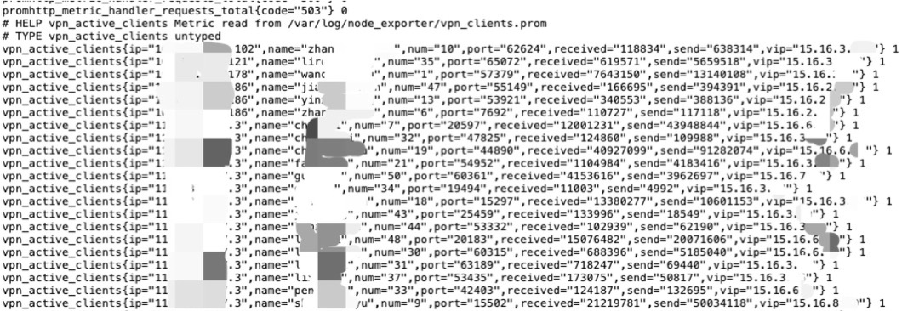

# 通过NodeExporter添加拓展指标

# 一、简介

NodeExporter的textfile Collector，可以通过定时脚本生成 .prom 文件，让 node_exporter 读取进而扩展 node_exporter的指标。

## 注意事项

为了使监控数据更有实时性，注意

- 生成指标的脚本尽量简单，不要过多步骤，涉及复杂运算
- 指标尽量简短，减少 Prometheus 刮取数据量
- 尽量使用多指标携带数据，而非多标签。不是必须，例如以下示例中，信息大多为非数值型，都需要通过指标的标签来，后期可以在grafana中进行数据转换。

# 二、操作

## 0、指标格式

Prometheus标准的指标格式

> 指标名{标签1=标签1值,标签2=标签2值,标签3=标签3值, }  指标值

自定义指标

> vpn_clientinfo{ip="客户来源IP",name="客户端用户名",num="用户编号",port="客户端端口",received="接收的字节数",send="发送的字节数",vip="隧道 VIP",ts="登录时长"} 指标值

## 1、脚本

例如采集openvpn在线状态日志文件中的在线客户端信息

> /opt/test.sh

```bash
#!/bin/bash

# OpenVPN 状态文件路径
STATUS_FILE="/opt/openvpn/server/logs/openvpn-status.log"
METRICS_FILE="/var/log/node_exporter/vpn_clients.prom"

# 临时文件，防止写入过程中 node_exporter 读取不完整数据
TMP_FILE=$(mktemp)
num=0

# 解析 OpenVPN 连接信息（获取 IP 和用户名）
awk -F'[,:]' '/^CLIENT_LIST/ {print $2, $3, $4, $5, $7, $8, $12}' "$STATUS_FILE" | while read -r username ip port vip received send ts; do
    # 写入 Prometheus 格式数据
    lts=$(( $(date +%s) - $ts ))
    ((num++))
    echo "vpn_active_clients{num=\"$num\",name=\"$username\",ip=\"$ip\",port=\"$port\",vip=\"$vip\",received=\"$received\",send=\"$send\",ts=\"$lts\"} 1" >> "$TMP_FILE"
done

# 覆盖写入 metrics 文件
mv "$TMP_FILE" "$METRICS_FILE"
```

## 2、node_exporter启动参数

```bash
nohup node_exporter --web.listen-address=":9100" --no-collector.softnet --collector.textfile.directory=/var/log/node_exporter/ > /var/log/node_exporter/node_exporter.log 2>&1 &!
```

## 3、使用systemd实现秒级定时

Linux 的 `cron` 任务调度默认最小时间间隔是 **1 分钟**，不支持直接在 `crontab` 中配置秒级任务。但可以使用`systemd.timer`实现秒级定时任务。

### ①创建任务service

> /etc/systemd/system/extra_nodeexporter.service

```ini
[Unit]
Description=Extra node_exporter Service

[Service]
Type=oneshot
ExecStart=/opt/test.sh
```

### ②创建定时timer

> /etc/systemd/system/extra_nodeexporter.timer

```ini
[Unit]
Description=Run task every 5 seconds

[Timer]
; 指定系统启动后的延迟时间（单位：秒），例如 OnBootSec=30 表示系统启动后 30 秒开始第一次执行。
OnBootSec=5
; 指定前一个任务完成后，多久再次执行（单位：秒）
OnUnitActiveSec=5
; 指定要执行的服务单元文件
Unit=extra_nodeexporter.service

[Install]
WantedBy=timers.target
```

### ③ 启动并启用定时任务

```bash
systemctl daemon-reload
systemctl enable --now extra_nodeexporter.timer
```

检查timer状态

```bash
systemctl list-timers extra_nodeexporter.timer
```

## 4、查看Metrics

