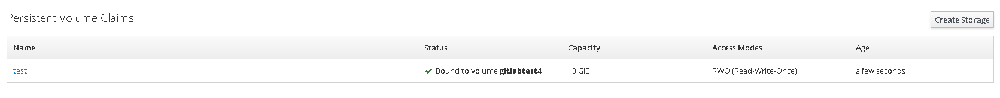

# 一、获取ceph client admin用户的密钥环keyring

查看Ceph集群Admin节点的集群配置文件夹my-cluster下的ceph.client.admin.keyring文件来获取key值

```bash
$> cat ceph.client.admin.keyring 
[client.admin]
    key = AQBUilha86ufLhAA2BxJn7sG8qVYndokVwtvyA==
    caps mds = "allow *"
    caps mon = "allow *"
    caps osd = "allow *"

$ ceph auth list #获取所有客户端用户
$ ceph auth get client.admin #获取客户端指定用户
```


# 二、使用admin的keyring在openshift上创建secret

**CLI**

```bash
$> oc  create secret generic ceph-secret --type="kubernetes.io/rbd" --from-literal=key='AQAil11anEPOORAArxzRkH9iS1IOGKQfK87+Ag==' --namespace=default
```

**YAML**


```yaml
kind: Secret
apiVersion: v1
metadata:
  name: ceph-secret
  namespace: default
  selfLink: /api/v1/namespaces/default/secrets/ceph-secret
data:
  key: QVFDcFNlMWJ0Y3VxSFJBQWlST25zY1VDMWpnTWRwZkRJMFd0THc9PQ==
type: kubernetes.io/rbd
```

# 三、创建storageclass 

```yaml
apiVersion: storage.k8s.io/v1
kind: StorageClass
metadata:
  name: ceph-rbd-sc
provisioner: kubernetes.io/rbd
parameters:
  monitors: 192.168.0.26:6789
  adminId: admin
  adminSecretName: ceph-secret
  adminSecretNamespace: default
  pool: rbd
  userId: admin
  userSecretName: ceph-secret
#说明:adminId默认值为admin,pool默认值为rbd, userId默认值与adminId一样.所以这三个值可以不填写。
```

# 四、可以在console界面创建，也可以通过PVC的YAML配置文件中指定使用Ceph

```yaml
kind: PersistentVolumeClaim
apiVersion: v1
metadata:
  name: myclaim
spec:
  accessModes:
    - ReadWriteOnce
  resources:
    requests:
      storage: 8Gi
  storageClassName: ceph-rbd-sc
```

结果如下图：

