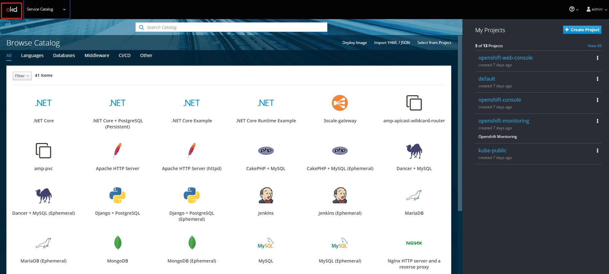
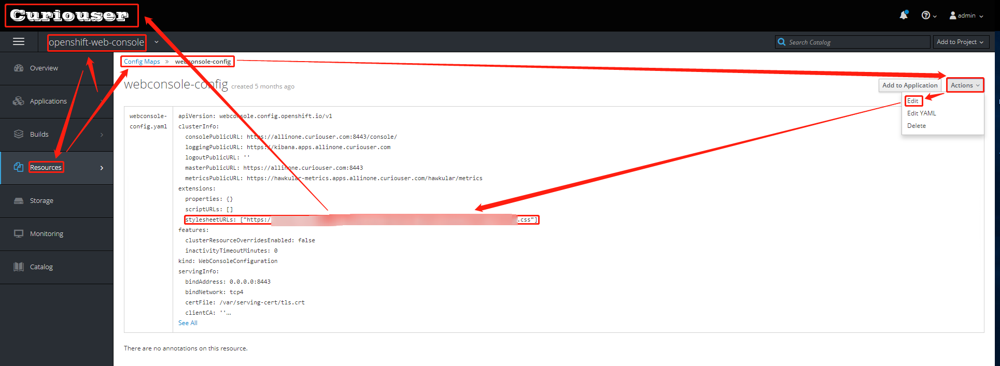
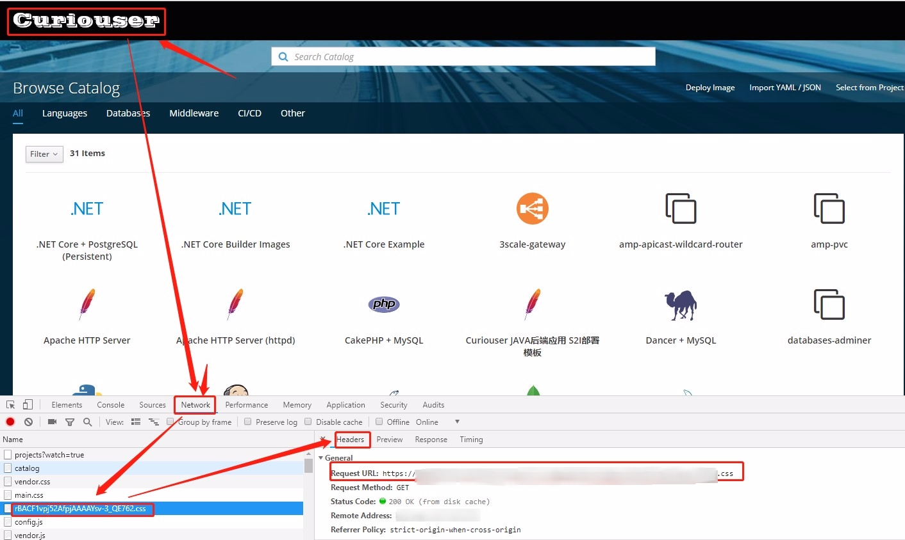
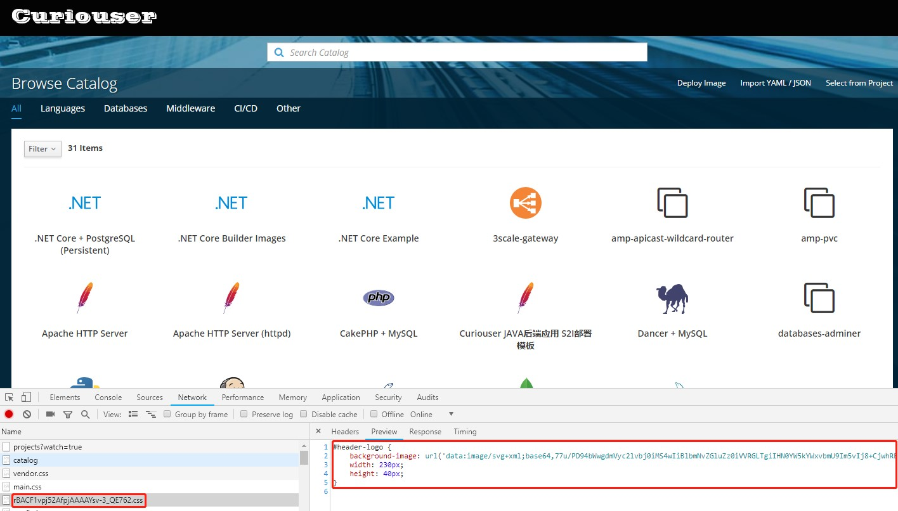
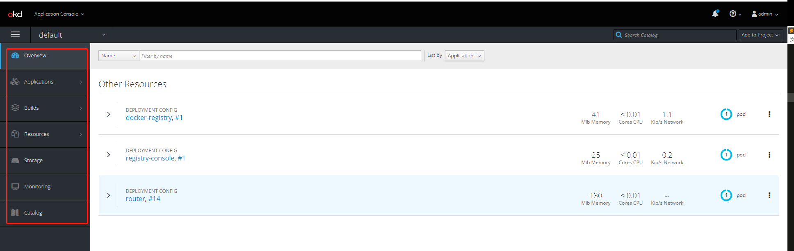
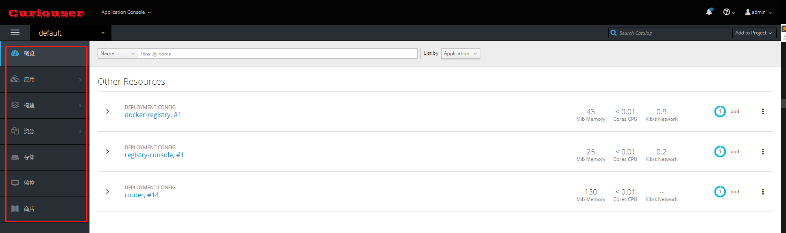

# 一、定制WebConsole中左上角的logo

1. 制作图标
使用Windows 10自带的Paint 3D。制作高度40pixel，宽度为logo字体宽的透明画布（建议logo字体宽度为100-300pixel之间）。保存为PNG格式。
2. 将PNG图片转成SVG格式
   
    http://www.bejson.com/convert/image_to_svg/

3. 将SVG文件进行Base64加密
   
    https://www.css-js.com/tools/base64.html

4. 将下面CSS文件上传到一个HTTPS的静态资源服务器上

        #header-logo {
            background-image: url('data:image/svg+xml;base64,base64加过密的SVG图片源码');
            width: 230px;
            height: 40px;
        }
        # 参考
        #header-logo{
            background-image:url('data:image/svg+xml;base64,77u/PD******');
            width: 230px;
            height: 40px;
        }

    或者

        #header-logo{
            background-image: url("logo图片的访问UTRL（必须是HTTPS）");
            width: 300px;
            height: 40px;
        }

5. 修改WebConsole的配置文件
    

    待Webconsole的容器重启过后（等待约5分钟），再次刷新页面可见修改过后的效果。可使用F12调出浏览器开发者模式，查看页面渲染的元素。

    
    

# 二、汉化项目左侧导航栏

创建js

    (function() {
        window.OPENSHIFT_CONSTANTS.PROJECT_NAVIGATION[0].label="概览"
        window.OPENSHIFT_CONSTANTS.PROJECT_NAVIGATION[1].label="应用"
        window.OPENSHIFT_CONSTANTS.PROJECT_NAVIGATION[2].label="构建"
        window.OPENSHIFT_CONSTANTS.PROJECT_NAVIGATION[3].label="资源"
        window.OPENSHIFT_CONSTANTS.PROJECT_NAVIGATION[4].label="存储"
        window.OPENSHIFT_CONSTANTS.PROJECT_NAVIGATION[5].label="监控"
        window.OPENSHIFT_CONSTANTS.PROJECT_NAVIGATION[6].label="商店"
        window.OPENSHIFT_CONSTANTS.APP_LAUNCHER_NAVIGATION = [
        {
        title: "Sharing Videos",
        iconClass: "fa fa-video-camera",
        href: "https://yun.baidu.com/s/1xIwYILHQebEHZOcW4yvsAw",
        tooltip: "一键部署Openshift相关视频"
        }];
    }());
上传到https服务器上

修改WebConsole的配置文件

# 三、定制登陆页面

1. 导出login模板文件

        oc adm create-login-template > login.html

2. 修改该HTML文件，然后放到master节点上的/etc/origin/master/login-template/路径下（示例可见[附件](../assets/openshift-webconsole-login.html)）

3. 修改Master节点的/etc/origin/master/master-config.yaml文件

        oauthConfig:
        ...
        templates:
            login: login-template/login.html
        #login-template/login.html是相对于/etc/origin/master/master-config.yaml文件路径的相对位置
        
4. 重启master节点上的OKD的api进程

        # 使用okd3.11新命令：master-restart
        master-restart api
