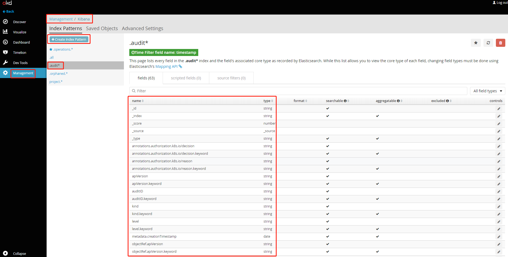
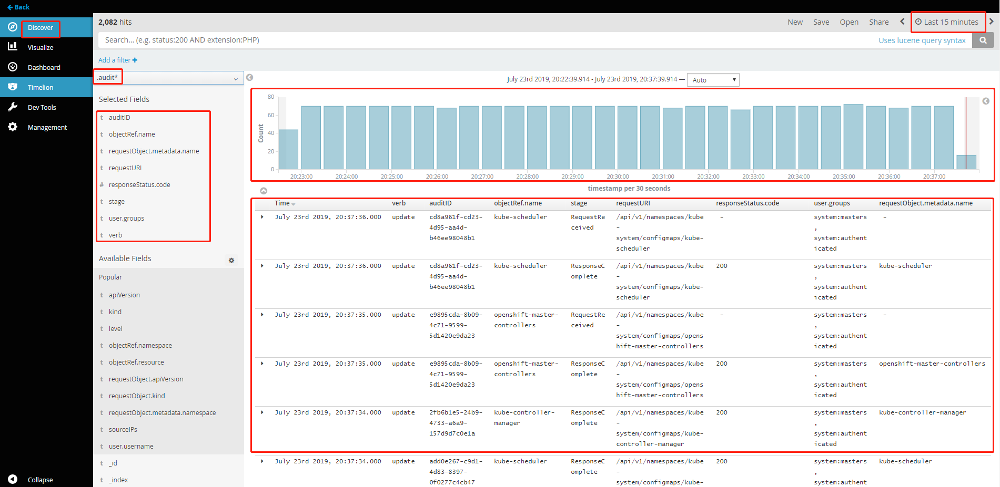

# 一、Overviews

kubernetes 在 v1.7 中支持了日志审计功能（Alpha），在 v1.8 中为 Beta 版本，v1.12 为 GA 版本。  

## 审计的目的

Kubernetes 审计功能提供了与安全相关的按时间顺序排列的记录集，记录单个用户、管理员或系统其他组件影响系统的活动顺序。 它能帮助集群管理员处理以下问题：

* **发生了什么**？
* **什么时候发生的**？
* **谁触发的**？
* **活动发生在哪个（些）对象上**？
* **在哪观察到的**？
* **它从哪触发的**？
* **活动的后续处理行为是什么**？

## 产生的阶段

kube-apiserver 是负责接收及相应用户请求的一个组件，每一个请求都会有几个阶段，每个阶段都有对应的日志，当前支持的阶段有：

* **RequestReceived** ：apiserver 在接收到请求后且在将该请求下发之前会生成对应的审计日志。
* **ResponseStarted** ：在响应 header 发送后并在响应 body 发送前生成日志。这个阶段仅为长时间运行的请求生成（例如 watch）。
* **ResponseComplete** ：当响应 body 发送完并且不再发送数据。
* **Panic**：内部服务器出错，请求未完成。

也就是说对 apiserver 的每一个请求理论上会有三个阶段的审计日志生成


## 审计记录日志级别

当前支持的日志记录级别有：

* **None**:  符合这条规则的日志将不会记录。
* **Metadata**:  记录请求的 metadata（请求的用户、timestamp、resource、verb 等等），但是不记录请求或者响应的消息体。
* **Request**:  记录事件的 metadata 和请求的消息体，但是不记录响应的消息体。这不适用于非资源类型的请求。
* **RequestResponse**:  记录事件的 metadata，请求和响应的消息体。这不适用于非资源类型的请求。


## 日志记录策略

在记录日志的时候尽量只记录所需要的信息，不需要的日志尽可能不记录，避免造成系统资源的浪费。

- 一个请求不要重复记录，每个请求有三个阶段，只记录其中需要的阶段
- 不要记录所有的资源，不要记录一个资源的所有子资源
- 系统的请求不需要记录，kubelet、kube-proxy、kube-scheduler、kube-controller-manager 等对 kube-apiserver 的请求不需要记录
- 对一些认证信息（secerts、configmaps、token 等）的 body 不记录


## 审计日志格式

* **json**
  ```json
  {
  "kind": "Event",
  "apiVersion": "audit.k8s.io/v1beta1",
  "metadata": {
      "creationTimestamp": "2019-07-23T09:02:19Z"
  },
  "level": "Request",
  "timestamp": "2019-07-23T09:02:19Z",
  "auditID": "eb481add-fdac-48a3-a302-1c33d73bfdbf",
  "stage": "RequestReceived",
  "requestURI": "/api/v1/namespaces/kube-system/configmaps/openshift-master-controllers",
  "verb": "update",
  "user": {
      "username": "system:openshift-master",
      "groups": [
          "system:masters",
          "system:authenticated"
      ]
  },
  "sourceIPs": [
      "192.168.1.96"
  ],
  "objectRef": {
      "resource": "configmaps",
      "namespace": "kube-system",
      "name": "openshift-master-controllers",
      "apiVersion": "v1"
  },
  "requestReceivedTimestamp": "2019-07-23T09:02:19.148057Z",
  "stageTimestamp": "2019-07-23T09:02:19.148057Z"
  }
  ```
* **legacy**

  ```yaml
  2019-07-23T23:50:06.223368641+08:00 AUDIT: id="3574e2e0-06b1-44d8-bc6c-5983c402d55e" stage="ResponseComplete" ip="192.168.1.96" method="update" user="system:openshift-master" groups="\"system:masters\",\"system:authenticated\"" as="<self>" asgroups="<lookup>" namespace="kube-system" uri="/api/v1/namespaces/kube-system/configmaps/openshift-master-controllers" response="200"
  ```

## 支持的审计日志存储后端

审计后端可以将审计事件导出到外部存储。 Kube-apiserver 提供两个后端：

* **Log 后端**:  将事件写入文件，落到磁盘。如果有多个api-server，审计日志文件会分散，无法集中分析。此时可以使用logstash或fluend进行日志采集汇聚到elsticsearch中

* **Webhook 后端**:  将事件发送到外部存储系统的API接口中。例如可以将审计日志发生到logstash监听的http接口中进行处理并吐到elsticsearch中进行汇聚查看

  

## 注意 

1. 审计日志记录功能会增加 API server 的内存消耗，因为需要为每个请求存储审计所需的某些上下文。 此外，内存消耗取决于审计日志记录的配置。


# 二、openshift开启自定义策略的审计功能

创建审计日志的存储路径

```bash
mkdir /etc/origin/master/audit
# 注意：审计日志文件的存储路径必须是kube-system命名空间下apiservser pod挂载目录下的子路径。
# ocp 3.11版本的apiserver是以pod的形式运行在kube-system命名空间下的，它所需要的配置文件等Volume资源都是以hostpath的形式挂载上去的，例如ocp节点上的/etc/origin/master目录
```

编辑/etc/origin/master/master-config.yaml

```yaml
****省略********
auditConfig:
  auditFilePath: "/etc/origin/master/audit/audit-ocp.log"        # 指定审计日志文件的存储路径
  enabled: true                                                                      # 开启审计功能
  logFormat: "json"                                                                # 指定输出审计日志的格式。可指定为"json"或"legacy"
  maximumFileRetentionDays: 10                                        # 指定审计日志文件的保留天数
  maximumFileSizeMegabytes: 100                                     # 指定审计日志文件的最大Byte
  maximumRetainedFiles: 5                                                 # 指定审计日志文件的保留个数
  policyConfiguration: null                                                     # 是否使用默认的审计策略
  policyFile: "/etc/origin/master/audit-policy.yaml"                # 自定义的审计策略配置文件
****省略********
```

创建自定义的审计策略配置文件

```yaml
kind: Policy
omitStages:
  - "ResponseStarted"
rules:
  - level: None 
    users: ["system:kube-proxy"] 
    verbs: ["watch"] 
    resources: 
    - group: ""
      resources: ["endpoints", "services"]

  - level: None
    userGroups: ["system:authenticated"] 
    nonResourceURLs: 
    - "/api*" # Wildcard matching.
    - "/version"

  - level: Request
    verbs: ["update"]
    resources:
    - group: "" # core API group
      resources: ["configmaps","secrets"]
    # This rule only applies to resources in the "kube-system" namespace.
    # The empty string "" can be used to select non-namespaced resources.
    namespaces: ["kube-system"] 

  # Log configmap and secret changes in all other namespaces at the metadata level.
  - level: None
    verbs: ["update"]
    resources:
    - group: "" # core API group
      resources: ["secrets", "configmaps"]

  # Log all other resources in core and extensions at the request level.
  - level: None
    resources:
    - group: "" # core API group
    - group: "extensions" # Version of group should NOT be included.

  # Log login failures from the web console or CLI. Review the logs and refine your policies.
  - level: Metadata
    nonResourceURLs:
    - /login* 
    - /oauth* 
  - level: Metadata
    userGroups: ["system:authenticated:oauth"]
    verbs: ["create", "delete"]
    resources:
      - group: "project.openshift.io"
        resources: ["projectrequests", "projects"]
    omitStages:
      - RequestReceived
```

重启APIServer和Controller

```bash
#对于OCP版本大于3.9的
/usr/local/bin/master-restart api
/usr/local/bin/master-restart controllers
# 对于OCP版本小于3.9的
 systemctl restart atomic-openshift-master-api 
 systemctl restart atomic-openshift-master-controllers
```

# 三、使用openshift集群的Fluentd收集审计日志到集群内的elasticsearch

配置OCP集群中的Fluentd挂载审计日志的存储目录\(OCP集群中日志系统的fluentd是以DaemonSet形式收集节点上容器的日志到elasticsearch的，它是将节点的/var/lib/docker目录以hostpath形式挂载到容器中的\)

```bash
oc set volume ds/logging-fluentd --add --mount-path=/etc/origin/master/audit --name=audit --type=hostPath --path=/etc/origin/master/audit -n openshift-logging
```

配置OCP集群中的Fluentd监控审计日志目录下的日志

```bash
oc edit cm/logging-fluentd -n openshift-logging
```

```yaml
*****省略*******
## sources
*****省略*******
@include configs.d/user/input-audit.conf
*****省略*******
  input-audit.conf: |
    <source>
      @type tail
      @id audit-ocp
      path /etc/origin/master/audit/audit-ocp.log
      pos_file /etc/origin/master/audit/audit.pos
      tag audit.requests
      format json
    </source>
    <match audit**>
      @type copy
      <store>
        @type elasticsearch
        log_level debug
        host "#{ENV['OPS_HOST']}"
        port "#{ENV['OPS_PORT']}"
        scheme https
        ssl_version TLSv1_2
        index_name .audit

        user fluentd
        password changeme

        client_key "#{ENV['OPS_CLIENT_KEY']}"
        client_cert "#{ENV['OPS_CLIENT_CERT']}"
        ca_file "#{ENV['OPS_CA']}"

        type_name com.redhat.ocp.audit

        reload_connections "#{ENV['ES_RELOAD_CONNECTIONS'] || 'false'}"
        reload_after "#{ENV['ES_RELOAD_AFTER'] || '100'}"
        sniffer_class_name "#{ENV['ES_SNIFFER_CLASS_NAME'] || 'Fluent::ElasticsearchSimpleSniffer'}"
        reload_on_failure false
        flush_interval "#{ENV['ES_FLUSH_INTERVAL'] || '5s'}"
        max_retry_wait "#{ENV['ES_RETRY_WAIT'] || '300'}"
        disable_retry_limit true
        buffer_type file
        buffer_path '/var/lib/fluentd/buffer-output-es-auditlog'
        buffer_queue_limit "#{ENV['BUFFER_QUEUE_LIMIT'] || '1024' }"
        buffer_chunk_limit "#{ENV['BUFFER_SIZE_LIMIT'] || '1m' }"
        buffer_queue_full_action "#{ENV['BUFFER_QUEUE_FULL_ACTION'] || 'exception'}"

        request_timeout 2147483648
      </store>
    </match>
*****省略*******
```

重启Fluentd

```bash
oc delete po -l component=fluentd -n openshift-logging
```

在ocp集群系统的Kibana上添加".audit\*"的Index Pattern,并在"Discover"查看、筛选审计日志



# 四、将审计日志通过WebHook

# 发送到OCP外部的Logstash或者Fluentd 接收后端

可使用Logstash或者Fluentd作为后端来接收Api-Server通过web hook方式发送的审计日志。Logstash和Fluentd可以是ocp集群外二进制方式安装运行的，也可以是原生Docker运行的，甚至可以是另外一个集群中容器化的。一个原则就是不要放到审计日志产生集群的内部。防止apiserver启动起来了，有了一些操作，logstash还没有启动起来，丢失审计日志。再者审计日志后端最好选择适合自己的，审计日志落一份，重复记录也没多大意义。

### 方式一：使用OCP集群外二进制方式安装的Logstash来接收ApiServer通过web hook方式发送过来的审计日志并过滤、存储到本地文件中

安装logstash

```bash
bash -c 'cat > /etc/yum.repos.d/elasticsearch.repo <<EOF
[elasticsearch-7.x]
name=Elasticsearch repository for7.x packages
baseurl=https://artifacts.elastic.co/packages/7.x/yum
gpgcheck=1
gpgkey=https://artifacts.elastic.co/GPG-KEY-elasticsearch
enabled=1
autorefresh=1
type=rpm-md
EOF' ;\
  yum clean all && \
  yum install logstash -y
```

设置logstash，/etc/logstash/logstash.yml

```yaml
# ------------ Pipeline Configuration Settings --------------
# Where to fetch the pipeline configuration for the main pipeline
path.config: /etc/logstash/conf.d/
*************************省略******************************
# ------------ Data path ------------------
# Which directory should be used by logstash and its plugins for any persistent needs. Defaults to LOGSTASH_HOME/data
path.data: /data/logs/logstash/data/
*************************省略******************************
# ------------ Debugging Settings -------------
# Options for log.level:  fatal/error/warn/info (default)/debug/trace
log.level: info
path.logs: /data/logs/logstash/logs
```

创建监听HTTP 8081端口的pipeline

```bash
cat <<EOF >  /etc/logstash/conf.d/accept-audit-log.conf 
input{
    http{
        host => "0.0.0.0"
        port => 8081
    }
}
filter{
    split{
        # Webhook audit backend sends several events together with EventList
        # split each event here.
        field=>[items]
        # We only need event subelement, remove others.
        remove_field=>[headers, metadata, apiVersion, kind, "@version", host]
    }
    mutate{
        rename => {items=>event}
    }
}
output{
    file{
        # Audit events from different users will be saved into different files.
        path=>"/data/logs/logstash/ocp-audit-logs/ocp-audit-%{[event][user][username]}/audit-%{+YYYY-MM-dd}.log"
    }
}
EOF
```

启动logstash

```bash
mkdir -p /data/logs/logstash/{data,logs,ocp-audit-logs}
chown -R logstash:logstash /data/logs/logstash
system start logstash
# 或者
/usr/share/logstash/bin/logstash -f /etc/logstash/config --path.settings /etc/logstash/
```

测试logstash的联通性。一是看logstash pipeline监听的HTTP端口是否开启。二是尝试发送一个带有模拟数据的POST请求，看其是否会pipeline指定的数据目录生成日志文件

```bash
ss -ntl |grep 8081
```

```bash
curl -X POST \
  http://192.168.1.96:8081 \
  -H 'Accept: */*' \
  -H 'Cache-Control: no-cache' \
  -H 'Connection: keep-alive' \
  -H 'Content-Type: application/json' \
  -H 'accept-encoding: gzip, deflate' \
  -d '{"kind":"Event","apiVersion":"audit.k8s.io/v1beta1","metadata":{"creationTimestamp":"2019-07-23T14:27:54Z"},"level":"Request","timestamp":"2019-07-23T14:27:54Z","auditID":"29bf32ba-4bea-4b4f-a1fb-cd091b2188ff","stage":"ResponseComplete","requestURI":"/api/v1/namespaces/kube-system/configmaps/openshift-master-controllers","verb":"update","user":{"username":"system:openshift-master","groups":["system:masters","system:authenticated"]},"sourceIPs":["192.168.1.96"],"objectRef":{"resource":"configmaps","namespace":"kube-system","name":"openshift-master-controllers","uid":"d54578ea-425e-11e9-b1bd-000c2976c04e","apiVersion":"v1","resourceVersion":"8285989"},"responseStatus":{"metadata":{},"code":200},"requestObject":{"kind":"ConfigMap","apiVersion":"v1","metadata":{"name":"openshift-master-controllers","namespace":"kube-system","selfLink":"/api/v1/namespaces/kube-system/configmaps/openshift-master-controllers","uid":"d54578ea-425e-11e9-b1bd-000c2976c04e","resourceVersion":"8285989","creationTimestamp":"2019-03-09T11:31:08Z","annotations":{"control-plane.alpha.kubernetes.io/leader":"{\"holderIdentity\":\"allinone.okd311.curiouser.com\",\"leaseDurationSeconds\":15,\"acquireTime\":\"2019-03-09T11:31:01Z\",\"renewTime\":\"2019-07-23T14:27:54Z\",\"leaderTransitions\":0}"}}},"requestReceivedTimestamp":"2019-07-23T14:27:54.894767Z","stageTimestamp":"2019-07-23T14:27:54.899643Z","annotations":{"authorization.k8s.io/decision":"allow","authorization.k8s.io/reason":""}}'
```

创建audit的webhook配置文件/etc/origin/master/audit-policy.yaml

```yaml
cat <<EOF > /etc/origin/master/audit-policy.yaml
apiVersion: v1
clusters:
- cluster:
    server: http://192.168.1.96:8081
  name: logstash
contexts:
- context:
    cluster: logstash
    user: ""
  name: default-context
current-context: default-context
kind: Config
preferences: {}
users: []
EOF
```

编辑/etc/origin/master/master-config.yaml，添加webhook相关的参数

```yaml
****省略********
auditConfig:
  auditFilePath: "/etc/origin/master/audit/audit-ocp.log"        # 指定审计日志文件的存储路径
  enabled: true                                                                      # 开启审计功能
  logFormat: "json"                                                                # 指定输出审计日志的格式。可指定为"json"或"legacy"
  maximumFileRetentionDays: 10                                        # 指定审计日志文件的保留天数
  maximumFileSizeMegabytes: 100                                     # 指定审计日志文件的最大Byte
  maximumRetainedFiles: 5                                                 # 指定审计日志文件的保留个数
  policyConfiguration: null                                                     # 是否使用默认的审计策略
  policyFile: "/etc/origin/master/audit-policy.yaml"                # 自定义的审计策略配置文件
  #==========以下配置项为添加的webhook参数===========================================================================
  webHookKubeConfig: /etc/origin/master/audit-webhook-config.yaml   # 指定WebHook的配置文件（同样路径要指定在ApiServer POD已挂载的路径下）
  webHookMode: batch                                                                            # 可选参数"batch"和"blocking"
****省略********
```

重启APIServer和Controller

```bash
#对于OCP版本大于3.9的
/usr/local/bin/master-restart api
/usr/local/bin/master-restart controllers
# 对于OCP版本小于3.9的
 systemctl restart atomic-openshift-master-api 
 systemctl restart atomic-openshift-master-controllers
```

验证，用除"system:admin"用户外的其他用户创建project，然后再删除project，最后查看logstash配置的审计日志存储目录下是否生成对应的文件

```bash
oc login -u admin -p
oc new-project test
oc delete project test
```

```bash
$ tree -L 2 /data/logs/logstash/ocp-audit-logs/
/data/logs/logstash/ocp-audit-logs/
├── ocp-audit-admin
│ └── audit-2019-07-23.log
└── ocp-audit-system:openshift-master
    └── audit-2019-07-23.log
$ cat /data/logs/logstash/ocp-audit-logs/ocp-audit-admin/audit-2019-07-23.log
```

产生以下内容。显示一次创建成功，另一次创建失败，原因是project已经存在（特意测试），一次删除project等日志。

```json
{"event":{"metadata":{"creationTimestamp":"2019-07-23T14:45:03Z"},"stageTimestamp":"2019-07-23T14:45:03.019249Z","level":"Metadata","timestamp":"2019-07-23T14:45:02Z","sourceIPs":["192.168.1.96"],"objectRef":{"apiGroup":"project.openshift.io","resource":"projectrequests","name":"test","apiVersion":"v1"},"responseStatus":{"metadata":{},"code":201},"user":{"extra":{"scopes.authorization.openshift.io":["user:full"]},"uid":"7775eba0-426e-11e9-b1bd-000c2976c04e","groups":["system:authenticated:oauth","system:authenticated"],"username":"admin"},"stage":"ResponseComplete","requestReceivedTimestamp":"2019-07-23T14:45:02.964347Z","auditID":"eec24884-b70a-4b27-80c1-431111d2f4f5","verb":"create","annotations":{"authorization.k8s.io/reason":"RBAC: allowed by ClusterRoleBinding \"cluster-admin-0\" of ClusterRole \"cluster-admin\" to User \"admin\"","authorization.k8s.io/decision":"allow"},"requestURI":"/apis/project.openshift.io/v1/projectrequests"}}
{"event":{"metadata":{"creationTimestamp":"2019-07-23T14:45:10Z"},"stageTimestamp":"2019-07-23T14:45:10.842999Z","level":"Metadata","timestamp":"2019-07-23T14:45:10Z","sourceIPs":["192.168.1.96"],"objectRef":{"apiGroup":"project.openshift.io","resource":"projectrequests","name":"test","apiVersion":"v1"},"responseStatus":{"metadata":{},"status":"Failure","reason":"AlreadyExists","code":409},"user":{"extra":{"scopes.authorization.openshift.io":["user:full"]},"uid":"7775eba0-426e-11e9-b1bd-000c2976c04e","groups":["system:authenticated:oauth","system:authenticated"],"username":"admin"},"stage":"ResponseComplete","requestReceivedTimestamp":"2019-07-23T14:45:10.836487Z","auditID":"a7b64f47-94eb-4723-b101-24e112cd0735","verb":"create","annotations":{"authorization.k8s.io/reason":"RBAC: allowed by ClusterRoleBinding \"self-provisioners\" of ClusterRole \"self-provisioner\" to Group \"system:authenticated:oauth\"","authorization.k8s.io/decision":"allow"},"requestURI":"/apis/project.openshift.io/v1/projectrequests"}}
{"event":{"metadata":{"creationTimestamp":"2019-07-23T14:45:19Z"},"stageTimestamp":"2019-07-23T14:45:19.813911Z","level":"Metadata","timestamp":"2019-07-23T14:45:19Z","sourceIPs":["192.168.1.96"],"objectRef":{"apiGroup":"project.openshift.io","resource":"projects","namespace":"test","name":"test","apiVersion":"v1"},"responseStatus":{"metadata":{},"status":"Success","code":200},"user":{"extra":{"scopes.authorization.openshift.io":["user:full"]},"uid":"7775eba0-426e-11e9-b1bd-000c2976c04e","groups":["system:authenticated:oauth","system:authenticated"],"username":"admin"},"stage":"ResponseComplete","requestReceivedTimestamp":"2019-07-23T14:45:19.805940Z","auditID":"9d3260ca-3bff-49da-9fe9-346043a29991","verb":"delete","annotations":{"authorization.k8s.io/reason":"RBAC: allowed by ClusterRoleBinding \"cluster-admin-0\" of ClusterRole \"cluster-admin\" to User \"admin\"","authorization.k8s.io/decision":"allow"},"requestURI":"/apis/project.openshift.io/v1/projects/test"}}
```


# 五、审计策略配置详解

```bash
apiVersion: audit.k8s.io/v1
kind: Policy
omitStages:
  - "RequestReceived"  				# 审计阶段
rules: 											  # rule按顺序匹配
  - level: Request  				  # 审计级别
    verbs:					
    - create
    - delete
    resources:
    - group: ""
      resources:
      - pods
```


# 参考链接

[https://austindewey.com/2018/10/17/integrating-advanced-audit-with-aggregated-logging-in-openshift-3-11/\#test-it-out](https://austindewey.com/2018/10/17/integrating-advanced-audit-with-aggregated-logging-in-openshift-3-11/#test-it-out)  
[https://www.outcoldsolutions.com/docs/monitoring-openshift/v4/audit/](https://www.outcoldsolutions.com/docs/monitoring-openshift/v4/audit/)  
[https://docs.openshift.com/container-platform/3.11/install\_config/master\_node\_configuration.html\#master-node-config-advanced-audit](https://docs.openshift.com/container-platform/3.11/install_config/master_node_configuration.html#master-node-config-advanced-audit)  
[https://docs.openshift.com/container-platform/3.11/security/monitoring.html](https://docs.openshift.com/container-platform/3.11/security/monitoring.html)  
[https://kubernetes.io/docs/tasks/debug-application-cluster/audit/](https://kubernetes.io/docs/tasks/debug-application-cluster/audit/)  
[https://medium.com/@noqcks/kubernetes-audit-logging-introduction-464a34a53f6c](https://medium.com/@noqcks/kubernetes-audit-logging-introduction-464a34a53f6c)  
[https://www.jianshu.com/p/8117bc2fb966](https://www.jianshu.com/p/8117bc2fb966)  
[https://cloud.google.com/kubernetes-engine/docs/concepts/audit-policy?hl=zh-cn](https://cloud.google.com/kubernetes-engine/docs/concepts/audit-policy?hl=zh-cn)  
[https://github.com/rbo/openshift-examples/tree/master/efk-auditlog](https://github.com/rbo/openshift-examples/tree/master/efk-auditlog)  
[https://github.com/openshift/origin-aggregated-logging/issues/1226](https://github.com/openshift/origin-aggregated-logging/issues/1226)

