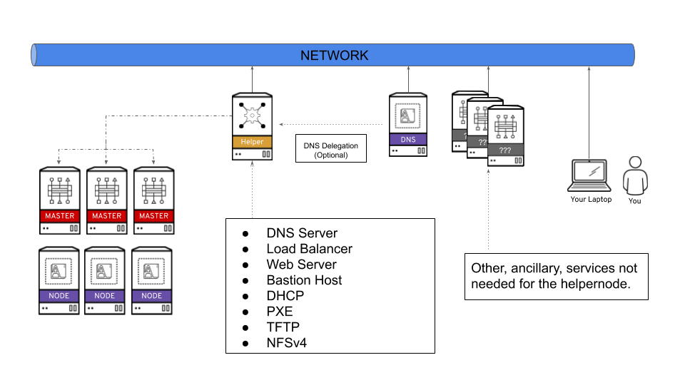

# OCP 4.3集群安装

# 一、简介

Openshift从4.0时代从`OKD(Openshift Kubernetes Distribution)`更名为`OCP（openshift container platform)`


# 二、安装操作

## 1、安装架构



| VM Name         | 硬件配置        | OS                                                          | IP地址       | 服务                                                   |
| --------------- | --------------- | ----------------------------------------------------------- | ------------ | ------------------------------------------------------ |
| ocp43-tools     | 4C8G100G系统盘  | CentOS 7.7                                                  | 192.168.1.80 | PXE、DHCP 、DNS、Web Server、TFTP、NFSv4、Load Balance |
| ocp43-bootstrap | 4C8G100G系统盘  | 暂不安装OS<br>后续会使用辅助节点上的PXE安装上Readhat CoreOS | 192.168.1.55 | 临时K8S集群，用来安装OCP、安装完后可以弃用             |
| ocp43-master1   | 8C16G100G系统盘 | 暂不安装OS<br/>后续会使用PXE安装上Readhat CoreOS            | 192.168.1.81 | OCP集群Master节点                                      |
| ocp43-worker1   | 8C16G100G系统盘 | 暂不安装OS<br/>后续会使用PXE安装上Readhat CoreOS            | 192.168.1.91 | OCP集群Worker节点                                      |

## 2、需预先提供的事项

### 2.1、在ESXI中创建以上配置的虚拟机

- 可使用govc命令快速创建，[参考链接](../origin/vsphere-govc.md)

- ocp43-bootstrap、ocp43-master1、ocp43-worker1虚拟机创建后先关机
- ocp43-bootstrap、ocp43-master1、ocp43-worker1虚拟机的网卡Mac地址，获取方式可使用govc命令：`govc device.info -vm ocp4-worker1 |grep "MAC Address:"`

### 2.2、辅助节点安装PXE/DHCP/DNS/LB

可使用红帽大神开源的Ansible部署脚本，github地址：https://github.com/RedHatOfficial/ocp4-helpernode

### 2.3、拉取镜像的pull secret

- 安装过程中需要从红帽镜像仓库拉取镜像时使用的pull secret。

- 可在https://cloud.redhat.com/openshift/install/metal/user-provisioned中获取（需要注册登录RedHat账号）

- 注意：pull secret的有效期只有一天，尽快在一天时间内安装好集群
- 后续安装过程中可通过`echo | openssl s_client -connect api-int.ocp43.curiouser.com:6443 | openssl x509 -noout -text`查看有效期

## 3、辅助节点准备

### 3.1、基础环境准备

- 开启SELinux
- 固定IP地址
- 生成SSH密钥
- 设置代理
- 设置主机名
- 开启ssh-agent
- 安装ansible、git等基础软件

```bash
sed -i 's/SELINUX=disabled/SELINUX=enforcing/g' /etc/selinux/config

echo 'export HTTP_PROXY="http://192.168.1.7:8001"' >> ~/.zshrc
echo 'export HTTPS_PROXY="http://192.168.1.7:8001"' >> ~/.zshrc
echo 'export NO_PROXY="mirrors.ustc.edu.cn,api.ocp43.curiouser.com"' >> ~/.zshrc
source ~/.zshrc

hostnamectl set-hostname --static tools.ocp43.curiouser.com

echo "PREFIX=24\nIPADDR=192.168.1.80\nGATEWAY=192.168.1.1" >> /etc/sysconfig/network-scripts/ifcfg-ens32
sed -i 's/dhcp/static/g' /etc/sysconfig/network-scripts/ifcfg-ens32

yum -y install ansible git

ssh-keygen -t rsa -b 4096 -N "" -f ~/.ssh/id_rsa
eval "$(ssh-agent -s)"
ssh-add ~/.ssh/id_rsa
```

由于主机名修改需要重启才能生效，所以该节点需要重启（虽然也可以不重启修改主机名、但是修改的地方较多、以防万一留下隐患、保险起见重启吧）

### 3.2、下载Ansible脚本

```bash
git clone https://github.com/RedHatOfficial/ocp4-helpernode
```

### 3.3、创建配置文件

```bash
bash -c 'cat > ~/ocp4-helpernode/vars.yaml << EOF
---
# 集群节点虚拟机磁盘要挂载的系统盘符
disk: sda
helper:
	# 辅助节点HostName
  name: "helper"
	# 辅助节点的IP地址
  ipaddr: "192.168.1.80"
dns:
	# 集群节点FQDN的域名
  domain: "curiouser.com"
  # OCP集群的标识ID,最后集群内节点的主机名FQDN会设置为“maste1.ocp43.curiouser.com”
  clusterid: "ocp43"
  # 辅助节点DNS的上游DNS服务器
  forwarder1: "8.8.8.8"
  forwarder2: "8.8.4.4"
dhcp:
	# 网关地址
  router: "192.168.1.1"
  # 广播域
  bcast: "192.168.1.255"
  # IP地址掩码
  netmask: "255.255.255.0"
  # DHCP预分配的起始IP地址
  poolstart: "192.168.1.50"
  # DHCP预分配的结束IP地址
  poolend: "192.168.1.100"
  ipid: "192.168.1.0"
  netmaskid: "255.255.255.0"
bootstrap:
  name: "bootstrap"
  # bootstrap节点准备要设置的IP地址
  ipaddr: "192.168.1.55"
  # bootstrap节点虚拟机的网卡MAC地址
  macaddr: "00:0c:29:b5:a0:8e"
masters:
  - name: "master1"
  	# master1节点准备要设置的IP地址
    ipaddr: "192.168.1.81"
    # master1节点虚拟机的网卡MAC地址
    macaddr: "00:0c:29:2c:96:41"
workers:
  - name: "worker1"
  	# worker1节点准备要设置的IP地址
    ipaddr: "192.168.1.91"
    # worker1节点虚拟机的网卡MAC地址
    macaddr: "00:0c:29:56:2e:af"
EOF'
```

### 3.4、预下载安装OCP/RedHat CoreOS的二进制文件

辅助节点上的PXE服务需要给集群其他节点提供安装OCP和基础OS的二进制文件。在Ansilbe脚本执行时会去联网下载、我们可以收到先下载下来放到指定的文件夹下，加速Ansible执行速度。这些文件的下载地址可以在Ansible脚本文件中查看。

```bash
cat ~/ocp4-helpernode/vars/main.yml
---
ocp_bios: "https://mirror.openshift.com/pub/openshift-v4/dependencies/rhcos/4.3/4.3.8/rhcos-4.3.8-x86_64-metal.x86_64.raw.gz"

ocp_initramfs: "https://mirror.openshift.com/pub/openshift-v4/dependencies/rhcos/4.3/4.3.8/rhcos-4.3.8-x86_64-installer-initramfs.x86_64.img"

ocp_install_kernel: "https://mirror.openshift.com/pub/openshift-v4/dependencies/rhcos/4.3/4.3.8/rhcos-4.3.8-x86_64-installer-kernel-x86_64"

ocp_client: "https://mirror.openshift.com/pub/openshift-v4/clients/ocp/4.3.8/openshift-client-linux-4.3.8.tar.gz"

ocp_installer: "https://mirror.openshift.com/pub/openshift-v4/clients/ocp/4.3.8/openshift-install-linux-4.3.8.tar.gz"
```

手动下载完后、需要将它们重名并放到指定路径下

```bash
cp openshift-client-linux-4.3.8.tar.gz /usr/local/src/openshift-client-linux.tar.gz
cp openshift-install-linux-4.3.8.tar.gz /usr/local/src/openshift-install-linux.tar.gz
mkdir -p /var/www/html/install/ /var/lib/tftpboot/rhcos/ /var/lib/tftpboot/rhcos/
cp rhcos-4.3.8-x86_64-metal.raw.gz /var/www/html/install/bios.raw.gz
cp rhcos-4.3.8-x86_64-installer-initramfs.img /var/lib/tftpboot/rhcos/initramfs.img
cp rhcos-4.3.8-x86_64-installer-kernel /var/lib/tftpboot/rhcos/kernel

# 因为后续会使用到openshift安装工具openshift-instsall，所以在辅助节点也解压一份命令到可执行路径下
tar -zxvf ~/openshift-install-linux-4.3.8.tar.gz -C /usr/local/bin/
rm -rf /usr/local/bin/README.md
```

### 3.5、执行Ansible脚本

```bash
cd ~/ocp4-helpernode
ansible-playbook -e @vars.yaml tasks/main.yml
```

### 3.6、检查辅助节点上安装的服务状况

```bash
/usr/local/bin/helpernodecheck
		{dns-masters|dns-workers|dns-etcd|dns-other|install-info|haproxy|services|nfs-info}

```

## 4、创建安装OCP配置文件

### 4.1、创建配置文件的定义信息文件

```bash
mkdir ~/ocp43
bash -c 'cat > ~/ocp43/install-config.yaml << EOF
apiVersion: v1
# 要与～/ocp4-helpernode/vars.yaml的dns.domain保持一致
baseDomain: curiouser.com
compute:
- hyperthreading: Enabled
  name: worker
  replicas: 0
controlPlane:
  hyperthreading: Enabled
  name: master
  replicas: 1
metadata:
	# 要与～/ocp4-helpernode/vars.yaml的clusterid保持一致
  name: ocp43
networking:
  clusterNetwork:
  - cidr: 10.128.0.0/14
    hostPrefix: 23
  networkType: OpenShiftSDN
  serviceNetwork:
  - 172.30.0.0/16
platform:
  none: {}
fips: false
pullSecret: '2.3章节在红帽官网生成的pull secret'
sshKey: 'ssh密钥的公钥'
EOF'
```

### 4.2、使用openshift-install工具命令生成配置文件

```bash
./openshift-install create manifests --dir=ocp43
```

### 4.3、使用openshift-install工具命令生成PXE安装CoreOS的ignition文件

```bash
./openshift-install create ignition-configs --dir=ocp43

# 上述命令会在～/ocp43路径下生成以下文件
auth
bootstrap.ign
master.ign
metadata.json
worker.ign
```

将ign文件拷贝到/var/www/html/ignition目录下，并修改权限

```bash
cd ocp43
cp bootstrap.ign master.ign worker.ign /var/www/html/ignition
chmod 775 /var/www/html/ignition/*
cd ..
```

## 5、将集群节点虚拟机开机

要是辅助节点上所有的服务准备就绪了、此时将ocp43-bootstrap、ocp43-master1、ocp43-worker1节点虚拟机开机。它们就会发现局域网内辅助节点上的DHCP、TFTP、PXE服务，自动从网卡启动，然后在PXE服务的引导下拉取OS镜像文件安装操作系统。

## 6、执行等待安装完成命令

```bash
openshift-install --dir=ocp43 wait-for bootstrap-complete --log-level=info
```

## 7、注意事项！等待、等待、等待

- 在安装过程中，由于Bootstrap、Master、Worker节点默认时区是UTC时区，而pull secret的有效期是一天，申请完后立即安装的话。安装过程中安装组件式时报证书无效，需要等到8小时，让系统时间等到pull secret有效期。

- 可通过`echo | openssl s_client -connect api-int.ocp43.curiouser.com:6443 | openssl x509 -noout -text`查看pull secret相关证书的有效期

- 疑问待后续解决的：集群节点为什么会出现时区设置不一致的？为什么手动设置时区后，系统层面生效但POD没有及时生效？是不是需要改动tool节点上某个服务的配置？

  

## 8、验证

```bash
tar -zxvf ~/openshift-client-linux-4.3.8.tar.gz -C /usr/local/bin/
export KUBECONFIG=~/ocp43/auth/kubeconfig
oc get node

# ./openshift-install --dir=ocp43  wait-for install-complete
INFO Waiting up to 30m0s for the cluster at https://api.ocp43.curiouser.com:6443 to initialize...
INFO Waiting up to 10m0s for the openshift-console route to be created...
INFO Install complete!
INFO To access the cluster as the system:admin user when using 'oc', run 'export KUBECONFIG=/root/ocp43/auth/kubeconfig'
INFO Access the OpenShift web-console here: https://console-openshift-console.apps.ocp43.curiouser.com
INFO Login to the console with user: kubeadmin, password: *****
```

## 9、集群外访问

**相关自带服务Web界面**

- 本地hosts中配置访问的服务域名与tools节点IP地址的映射

  ```bash
  192.168.1.80 api.ocp43.curiouser.com
  192.168.1.80 oauth-openshift.apps.ocp43.curiouser.com
  # OCP的WebConsole
  192.168.1.80 console-openshift-console.apps.ocp43.curiouser.com
  # OCP的用户认证服务地址
  192.168.1.80 oauth-openshift.apps.ocp43.curiouser.com
  # OCP的HTTP WEB服务地址
  192.168.1.80 downloads-openshift-console.apps.ocp43.curiouser.com
  # OCP的Prometheus
  192.168.1.80 alertmanager-main-openshift-monitoring.apps.ocp43.curiouser.com
  192.168.1.80 grafana-openshift-monitoring.apps.ocp43.curiouser.com
  192.168.1.80 prometheus-k8s-openshift-monitoring.apps.ocp43.curiouser.com
  192.168.1.80 thanos-querier-openshift-monitoring.apps.ocp43.curiouser.com
  ```

**oc/kubectl命令远程访问操作集群**

- kubeconfig配置文件在tools节点ocp安装配置目录下的auth路径下，拷贝出来配置在本地管理员电脑的kubectlconfig即可
- oc/kubectl客户端可在OCP自带的HTTP服务中下载（[https://downloads-openshift-console.apps.ocp43.curiouser.com](https://downloads-openshift-console.apps.ocp43.curiouser.com))


# 三、节点扩容


# 参考

1. https://www.jianshu.com/p/72a981aec92a （非常感谢少坡同学予以的指导！）
2. https://docs.openshift.com/container-platform/4.1/installing/installing_bare_metal/installing-bare-metal.html