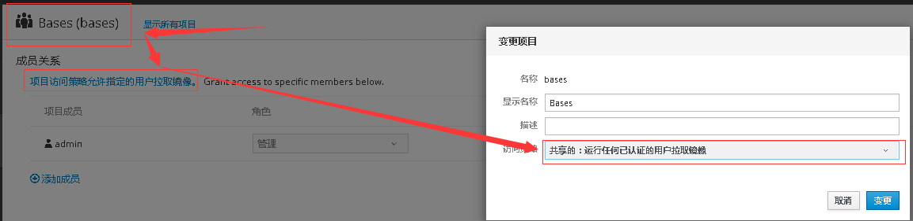
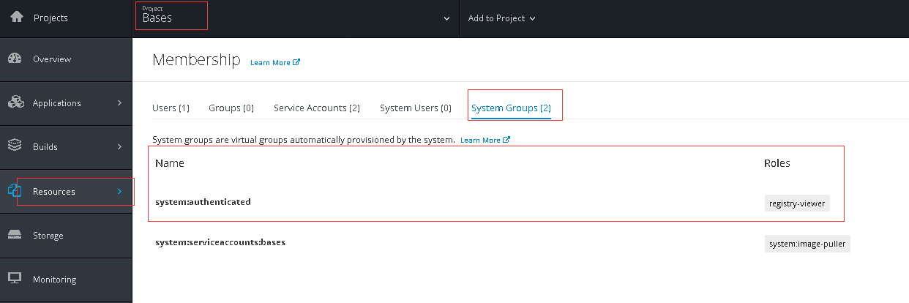
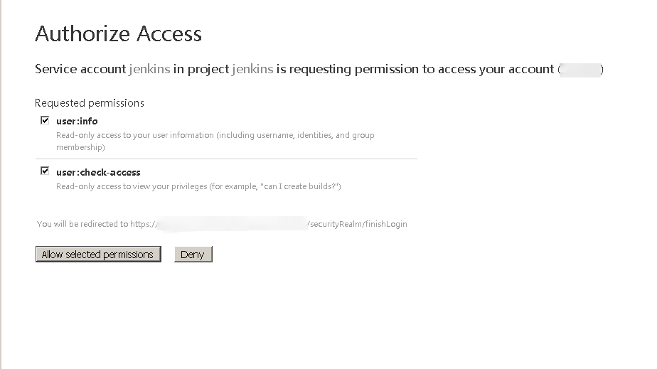

# Openshift用户权限管理实例

由于公司的日常项目开发测试环境都迁移到openshift上了。有众多开发测试人员需要登陆到openshift上进行操作，如果直接给admin权限，肯定是不行的。而openshift是支持多租户的权限管理。所以，就在创建普通用户的基础上赋予各种不同的权限限制来自控制对openshift上project的操作。

# 一、Prerequisite
1. 开发人员对CI环境有操作权限，对SIT、UAT环境只有查看权限
2. 测试人员对SIT环境有操作权限，对CI环境只有查看权限
3. 所有人员有自己的登录账户，均可见openshift上所有的业务项目，不可见系统项目

# 二、实现过程

1. 创建登录用户
   
        ansible masters -m shell -a "htpasswd -b /etc/origin/master/htpasswd dev1 dev1"
        ansible masters -m shell -a "htpasswd -b /etc/origin/master/htpasswd dev2 dev2"
        ansible masters -m shell -a "htpasswd -b /etc/origin/master/htpasswd dev3 dev3"
        ansible masters -m shell -a "htpasswd -b /etc/origin/master/htpasswd tester1 tester1"
        ansible masters -m shell -a "htpasswd -b /etc/origin/master/htpasswd tester2 tester2"
        ansible masters -m shell -a "htpasswd -b /etc/origin/master/htpasswd tester3 tester3"
2. 创建用户组

        oc adm groups new developer
        oc adm groups new tester
3. 将用户添加到用户组中

        oc adm groups add-users developer dev1 dev2 dev3
        oc adm groups add-users tester tester1 tester2 tester3
4. 针对项目，给用户组赋予系统角色

        oc adm policy add-role-to-group edit developer -n aci
        oc adm policy add-role-to-group edit developer -n bci
        oc adm policy add-role-to-group edit developer -n cci
        oc adm policy add-role-to-group view developer -n asit
        oc adm policy add-role-to-group view developer -n auat
        oc adm policy add-role-to-group view developer -n bsit
        oc adm policy add-role-to-group view developer -n buat
        oc adm policy add-role-to-group view developer -n csit
        oc adm policy add-role-to-group view developer -n cuat
        ​
        oc adm policy add-role-to-group edit tester -n asit
        oc adm policy add-role-to-group edit tester -n auat
        oc adm policy add-role-to-group edit tester -n bsit
        oc adm policy add-role-to-group edit tester -n buat
        oc adm policy add-role-to-group edit tester -n csit
        oc adm policy add-role-to-group edit tester -n cuat
        oc adm policy add-role-to-group view tester -n aci
        oc adm policy add-role-to-group view tester -n bci
        oc adm policy add-role-to-group view tester -n cci

实际操作过程中，在以某以开发人员登录过程openshift过程中，依旧会看到openshift 其他一些项目的namespace。例如base namespace，该namespace项目是在registry镜像注册仓库中创建镜像项目时自动创建的openshift namespace（在registry镜像注册仓库中创建base镜像项目是为了存放一些自定义的s2i镜像）。为了使其他openshift namespace使用其中的s2i镜像，特别在registry镜像注册仓库中是镜像项目的访问策略设置为共享的。种种以上，导致openshift上的base namespace是能被所有的已认证的用户查看到。

在openshift中查看base项目的membership

可以发现，凡是在registry镜像注册仓库中设置问访问策略设置为共享的，都会在openshift 项目中添加一个系统用户system:authenticated 。这个系统用户上绑定的是这个角色registry-viewer。在openshift后台查看该角色的详细信息

        # oc describe clusterrole registry-viewer
        Name:                   registry-viewer
        Created:                About an hour ago
        Labels:                 <none>
        Annotations:            authorization.openshift.io/system-only=true
                                openshift.io/reconcile-protect=false
        Verbs                   Non-Resource URLs       Resource Names  API Groups              Resources
        [get list watch]        []                      []              [ image.openshift.io]   [imagestreamimages imagestreammappings imagestreams imagestreamtags]
        [get]                   []                      []              [ image.openshift.io]   [imagestreams/layers]
        [get]                   []                      []              []                      [namespaces]
        [get]                   []                      []              [project.openshift.io ] [projects]

发现该角色有对namespace资源拥有get动作。仔细想想，该system:authenticated用户只是让openshift其他项目的系统用户能够拉取其下的镜像流。而在Kubernetes中使用命名空间的概念来分隔资源。在同一个命名空间中，某一个对象的名称在其分类中必须唯一，但是分布在不同命名空间中的对象则可以同名。OpenShift中继承了Kubernetes命名空间的概念，而且在其之上定义了Project对象的概念。每一个Project会和一个Namespace相关联，甚至可以简单地认为，Project就是Namespace。所以，该用户对project资源有获取权限，那就把对namespace的权限给去掉试试。
先导出角色registry-viewer的bindding配置文件

    oc export clusterrole registry-viewer  > registry-viewer.yml
然后修改配置文件，注释掉get namespace的动作

    apiVersion: v1
    kind: ClusterRole
    metadata:
    annotations:
        authorization.openshift.io/system-only: "true"
        openshift.io/reconcile-protect: "false"
    creationTimestamp: null
    name: registry-viewer
    rules:
    - apiGroups:
    - ""
    - image.openshift.io
    attributeRestrictions: null
    resources:
    - imagestreamimages
    - imagestreammappings
    - imagestreams
    - imagestreamtags
    verbs:
    - get
    - list
    - watch
    - apiGroups:
    - ""
    - image.openshift.io
    attributeRestrictions: null
    resources:
    - imagestreams/layers
    verbs:
    - get
    #- apiGroups:
    #  - ""
    #  attributeRestrictions: null
    #  resources:
    #  - namespaces
    #  verbs:
    #  - get
    - apiGroups:
    - project.openshift.io
    - ""
    attributeRestrictions: null
    resources:
    - projects
    verbs:
    - get

再将集群中角色删掉（此时特别注意:从集群中删掉registry-viewer角色后会导致已有镜像注册仓库中镜像的访问策略从共有变成私有,base项目的membership中会删掉system:authenticated该用户）

    oc delete clusterrole registry-viewer
接着再从配置文件中创建角色
        
    oc create -f registry-viewer.yml
最后再次修改镜像注册仓库中镜像的访问策略从私有变成共有。再次查看base项目中membership.

最有再以测试人员账户登录查看。不再显示base项目。测试其他项目去拉取base项目中的镜像，看去掉registry-viewer角色中role是否有影响。

实际使用过程中，测试人员需要以openshift上的用户名密码登录openshift上的jenkins，还要对jenkins做操作，比如在jenkins上做构建操作，查看构建日志等。需要对测试人员分组tester赋予对jenkins的编辑权限。初步思路是直接给tester分组服务系统角色clusterrole edit（oc adm policy add-cluster-role-to-group edit tester）。但是再以测试人员登录时还是能看到jenkins的项目，甚至能操作openshift上jenkins pod的重新部署。这是不可接受的。

那就换个思路。自己创建一个集群角色clusterrole，在角色上绑定若干规则，再将这个集群角色赋予测试组，相应的测试组成员能登录jenkins，并对jenkins做操作。
具体过程如下：
1. 先查看集群角色edit的配置，看edit都对那些资源都有什么动作

        oc describe clusterrole edit
        ​
        Name:                                                           edit
        Created:                                                        7 months ago
        Labels:                                                         <none>
        Annotations:                                                    openshift.io/description=A user that can create and edit most objects in a project, but can not update the project's membership.
        Verbs                                                           Non-Resource URLs       Resource Names  API Groups                      Resources
        [create delete deletecollection get list patch update watch]    []                      []              []                              [pods pods/attach pods/exec pods/portforward pods/proxy]
        [create delete deletecollection get list patch update watch]    []                      []              []                              [configmaps endpoints persistentvolumeclaims replicationcontrollers replicationcontrollers/scale secrets serviceaccounts services services/proxy]
        [get list watch]                                                []                      []              []                              [bindings events limitranges namespaces namespaces/status pods/log pods/status replicationcontrollers/status resourcequotas resourcequotas/status]
        [impersonate]                                                   []                      []              []                              [serviceaccounts]
        [create delete deletecollection get list patch update watch]    []                      []              [autoscaling]                   [horizontalpodautoscalers]
        [create delete deletecollection get list patch update watch]    []                      []              [batch]                         [cronjobs jobs scheduledjobs]
        [create delete deletecollection get list patch update watch]    []                      []              [extensions]                    [deployments deployments/rollback deployments/scale horizontalpodautoscalers jobs replicasets replicasets/scale replicationcontrollers/scale]
        [get list watch]                                                []                      []              [extensions]                    [daemonsets]
        [create delete deletecollection get list patch update watch]    []                      []              [apps]                          [deployments deployments/scale deployments/status statefulsets]
        [create delete deletecollection get list patch update watch]    []                      []              [build.openshift.io ]           [buildconfigs buildconfigs/webhooks builds]
        [get list watch]                                                []                      []              [build.openshift.io ]           [builds/log]
        [create]                                                        []                      []              [build.openshift.io ]           [buildconfigs/instantiate buildconfigs/instantiatebinary builds/clone]
        [update]                                                        []                      []              [build.openshift.io ]           [builds/details]
        [edit view]                                                     []                      []              [build.openshift.io]            [jenkins]
        [create delete deletecollection get list patch update watch]    []                      []              [apps.openshift.io ]            [deploymentconfigs deploymentconfigs/scale generatedeploymentconfigs]
        [create]                                                        []                      []              [apps.openshift.io ]            [deploymentconfigrollbacks deploymentconfigs/instantiate deploymentconfigs/rollback]
        [get list watch]                                                []                      []              [apps.openshift.io ]            [deploymentconfigs/log deploymentconfigs/status]
        [create delete deletecollection get list patch update watch]    []                      []              [image.openshift.io ]           [imagestreamimages imagestreammappings imagestreams imagestreams/secrets imagestreamtags]
        [get list watch]                                                []                      []              [image.openshift.io ]           [imagestreams/status]
        [get update]                                                    []                      []              [image.openshift.io ]           [imagestreams/layers]
        [create]                                                        []                      []              [image.openshift.io ]           [imagestreamimports]
        [get]                                                           []                      []              [project.openshift.io ]         [projects]
        [get list watch]                                                []                      []              [quota.openshift.io ]           [appliedclusterresourcequotas]
        [create delete deletecollection get list patch update watch]    []                      []              [route.openshift.io ]           [routes]
        [create]                                                        []                      []              [route.openshift.io ]           [routes/custom-host]
        [get list watch]                                                []                      []              [route.openshift.io ]           [routes/status]
        [create delete deletecollection get list patch update watch]    []                      []              [template.openshift.io ]        [processedtemplates templateconfigs templateinstances templates]
        [create delete deletecollection get list patch update watch]    []                      []              [build.openshift.io ]           [buildlogs]
        [get list watch]                                                []                      []              []                              [resourcequotausages]

2. 导出集群角色edit的配置文件到本地文件，在其上做修改

        oc export clusterrole edit > jenkins-clusterrole.yml
3. 编辑 jenkins-clusterrole.yml（只保留相重要的，其他的都删掉）

        apiVersion: v1
        kind: ClusterRole
        metadata:
        annotations:
            openshift.io/description: A user that can view jenkins project, and edit jenkins job. #添加clusterrole角色的说明简介
        creationTimestamp: null
        name: jenkins  #修改clusterrole名字为jenkins
        rules:
        - apiGroups:
        - ""
        attributeRestrictions: null
        resources:      #clusterrole edit中有好多对其他资源的操作。例persistentvolumeclaims、replicationcontrollers、replicationcontrollersscale。对这些资源没有什么用处，就可以删掉啦。
        - configmaps
        - endpoints
        - secrets
        - serviceaccounts
        - services
        - services/proxy
        verbs:
        - get
        - list
        - apiGroups:
        - ""
        attributeRestrictions: null
        resources:
        - serviceaccounts
        verbs:
        - impersonate
        - apiGroups:
        - build.openshift.io
        attributeRestrictions: null
        resources:
        - jenkins
        verbs:
        - edit
        - view
4. 导入jenkins clusterrole

        oc create -f jenkins-clusterrole.yml
5. 将jenkins clusterrole赋予测试组

        oc adm policy add-cluster-role-to-group jenkins tester
6. 以测试组成员登录openshift，jenkins项目不可见了。再以测试组成员登录jenkins，发现登录

    出现以下界面

    

    点击"Allow selected permissions"，发现也能正常登录jenkins。然后进行一次构建触发。发现一切正常。Bazinga！Everything is ok !