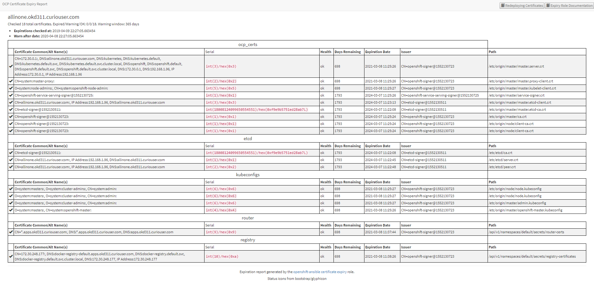

# Openshift组件:Master、Node、Etcd、Router、Registry之间的TLS证书管理

# 一、安装时指定证书的有效期

默认情况下，etcd证书、openshift证书的有效期为5年，kubelet证书、私有镜像仓库registry证书、Route证书的有效期为2年。在集群安装时可以通过设置ansible/hosts中的参数来指定证书的有效期

```yaml
[OSEv3:vars]
openshift_hosted_registry_cert_expire_days=730
openshift_ca_cert_expire_days=1825
openshift_node_cert_expire_days=730
openshift_master_cert_expire_days=730
etcd_ca_default_days=1825
```

# 二、使用openshift的ansible playbook查看当前集群所有证书的有效期

在/etc/ansible/hosts中添加变量

```yaml
[OSEv3:vars]
...
openshift_is_atomic=false
ansible_distribution=centos
openshift_certificate_expiry_config_base=/etc/origin
openshift_certificate_expiry_warning_days=30
openshift_certificate_expiry_show_all=no
# 可选项
# openshift_certificate_expiry_generate_html_report=no
# openshift_certificate_expiry_html_report_path=$HOME/cert-expiry-report.yyyymmddTHHMMSS.html 
# openshift_certificate_expiry_save_json_results=no
# openshift_certificate_expiry_json_results_path=$HOME/cert-expiry-report.yyyymmddTHHMMSS.json
...
```

检查

```yaml
$ ansible-playbook playbooks/openshift-checks/certificate_expiry/easy-mode.yaml
#执行完成后可在roles/openshift_certificate_expiry/defaults/main.yml中的openshift_certificate_expiry_html_report_path变量指定路径下看到证书检查报告文件。分别是HTML格式和JSON格式的文件。
# （默认证书检查报告文件路径是：当前用户家目录下~/cert-expiry-report.时间戳.html和cert-expiry-report.时间戳.JSON）查看所有证书的过期时间
```

它将会展示出所有Master oc证书、etcd证书、kube证书、router默认证书、私有镜像仓库registry证书的过期时间



# 三、更新证书

更新证书方法可以只针对Master oc证书、etcd证书、kube证书、router默认证书、私有镜像仓库registry证书中的一种进行更新，也可以全部进行更新。

1. 确保ansible/hosts中的参数有如下信息

        openshift_master_cluster_hostname=master.example.com
        openshift_master_cluster_public_hostname=master.example.com

2. 重新生成证书进行更新
    ①全部一次性更新

        ansible-playbook playbooks/redeploy-certificates.yml

    ②只更新master CA证书

        ansible-playbook playbooks/openshift-master/redeploy-openshift-ca.yml
    
    ③只更新etcd CA证书

        ansible-playbook playbooks/openshift-etcd/redeploy-ca.yml
    
    ④只更新master Certificates证书

        ansible-playbook playbooks/openshift-master/redeploy-certificates.yml

    ⑤只更新etcd Certificates证书

        ansible-playbook playbooks/openshift-etcd/redeploy-certificates.yml
    
    ⑥只更新node Certificates证书
        
        ansible-playbook playbooks/openshift-node/redeploy-certificates.yml

    ⑦只更新私有镜像仓库Rgistry Certificates证书

        ansible-playbook playbooks/openshift-hosted/redeploy-registry-certificates.yml
    
    ⑧只更新Router Certificates证书

        ansible-playbook playbooks/openshift-hosted/redeploy-router-certificates.yml
    
# 四、安装时使用自定义Master CA证书（以Master的CA证书为例）

将证书的路径写在inventory的配置参数中

```yaml
...
[OSEv3.vars]
...
openshift_master_ca_certificate={'certfile': '</path/to/ca.crt>', 'keyfile': '</path/to/ca.key>'}
...
```

执行正常部署

    ansible-playbook playbooks/deploy_cluster.yml

# 五、已运行的集群，更新自定义证书
同步骤四，将证书的路径写在inventory的配置参数中，运行更新Master CA证书的playbook

    ansible-playbook playbooks/openshift-master/redeploy-openshift-ca.yml

# 六、更新完成后可能遇到的问题

* The installer detected the wrong host names and the issue was identified too late
* The certificates are expired and you need to update them
* You have a new CA and want to create certificates using it instead
* allinone的集群下更新所有证书时，在重启docker那一步中，容易卡住


# 参考连接
1. https://docs.openshift.com/container-platform/3.11/install/configuring_inventory_file.html#advanced-install-custom-certificates
2. https://docs.openshift.com/container-platform/3.11/install_config/redeploying_certificates.html#install-config-cert-expiry
3. https://www.jianshu.com/p/ffc4d6369d4e