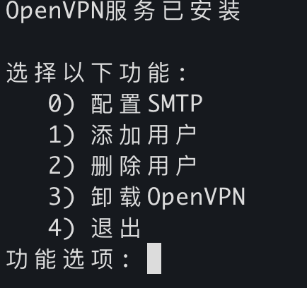
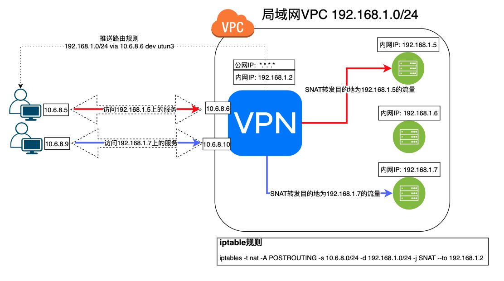
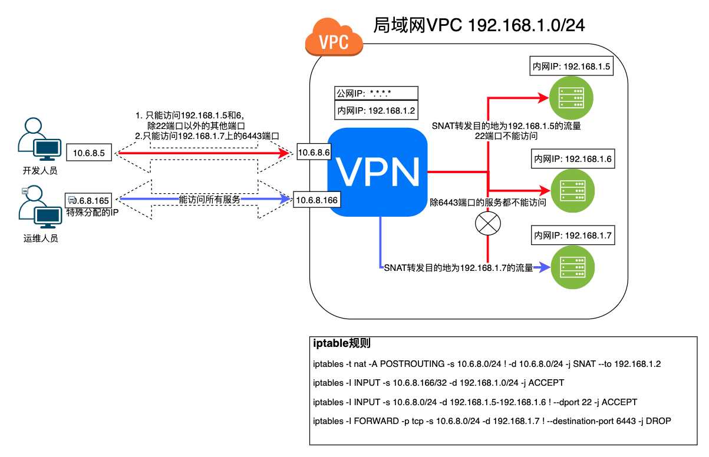

# OpenVPN

# 一、简介

OpenVPN 是一个基于 OpenSSL 库的应用层 VPN 实现。和传统 VPN 相比，它的优点是简单易用。 [1] 

OpenVPN允许参与建立VPN的单点使用共享金钥，电子证书，或者用户名/密码来进行身份验证。它大量使用了OpenSSL加密库中的SSLv3/TLSv1 协议函式库。OpenVPN能在Solaris、Linux、OpenBSD、FreeBSD、NetBSD、Mac OS X与Windows 2000/XP/Vista上运行，并包含了许多安全性的功能。它并不是一个基于Web的VPN软件，也不与IPsec及其他VPN软件包兼容。

- OpenVPN2.0后引入了用户名/口令组合的身份验证方式，它可以省略客户端证书，但是仍有一份服务器证书需要被用作加密。 OpenVPN所有的通信都基于一个单一的IP端口， 默认且推荐使用UDP协议通讯，同时TCP也被支持。OpenVPN连接能通过大多数的代理服务器，并且能够在NAT的环境中很好地工作。服务端具有向客 户端“推送”某些网络配置信息的功能，这些信息包括：IP地址、路由设置等。
- OpenVPN提供了两种虚拟网络接口：通用Tun/Tap驱动，通过它们， 可以建立三层IP隧道，或者虚拟二层以太网，后者可以传送任何类型的二层以太网络数据。传送的数据可通过LZO算法压缩。在选择协议时候，需要注意2个加密隧道之间的网络状况，
- 如有高延迟或者丢包较多的情况下，请选择TCP协议作为底层协议，UDP协议由于存在无连接和重传机制，导致要隧道上层的协议进行重传，效率非常低下。


# 二、安装

## 1、在Synology上安装部署OpenVPN


## 2、使用脚本在Linux服务器搭建

GitHub有个脚本项目专门安装OpenVPN server，地址：https://github.com/Nyr/openvpn-install ，但是功能过少。为了便于管理openvpn,基于此脚本进行了功能优化，github地址：https://github.com/RationalMonster/install-manage-openvpn ，以下为优化的功能点：

- 汉化

- 增加选择客户端分配IP地址池网段的功能

- 增加用户名密码验证脚本
- 增加配置SMTP发送邮件的功能
- 增加创建用户后将用户名密码及配置文件等信息通过SMTP邮件服务发送到用户邮箱
- 去除不必要的脚本代码

首次运行该脚本是安装openvpn服务，再次运行可执行其他服务。



### 注意

所有的iptables规则配置都是由systemD服务openvpn-iptables.service`(/etc/systemd/system/openvpn-iptables.service)`进行配置的。

```bash
[Unit]
Before=network.target
[Service]
Type=oneshot
ExecStart=/sbin/iptables -t nat -A POSTROUTING -s 10.8.6.0/24 ! -d 10.8.6.0/24 -j SNAT --to 192.168.1.2
ExecStart=/sbin/iptables -I INPUT -p udp -d 192.168.1.2 --dport 30668 -j ACCEPT
ExecStart=/sbin/iptables -I INPUT -p tcp -s 10.8.6.0/24 -d 192.168.1.2 --dport 9092 -j ACCEPT
ExecStart=/sbin/iptables -I FORWARD -p tcp -s 10.8.6.0/24 -d 192.168.1.3 ! --destination-port 6443 -j DROP
ExecStart=/sbin/iptables -A INPUT -s 10.8.6.0/24 -d 192.168.1.2 -j DROP
ExecStart=/sbin/iptables -I INPUT -p tcp -s 10.8.6.166/32 -d 192.168.1.2 --dport 22 -j ACCEPT

ExecStop=/sbin/iptables -D FORWARD -p tcp -s 10.8.6.0/24 -d 192.168.1.3 ! --destination-port 6443 -j DROP
ExecStop=/sbin/iptables -t nat -D POSTROUTING -s 10.8.6.0/24 ! -d 10.8.6.0/24 -j SNAT --to 192.168.1.2
ExecStop=/sbin/iptables -D INPUT -p udp -d 192.168.1.2 --dport 30668 -j ACCEPT
ExecStop=/sbin/iptables -D INPUT -p tcp -s 10.8.6.0/24 -d 192.168.1.2 --dport 9092 -j ACCEPT
ExecStop=/sbin/iptables -D INPUT -p tcp -s 10.8.6.166/32 -d 192.168.1.2 --dport 22 -j ACCEPT
ExecStop=/sbin/iptables -D INPUT -s 10.8.6.0/24 -d 192.168.1.2 -j DROP

RemainAfterExit=yes
[Install]
WantedBy=multi-user.target
```

# 三、Openvpn Access Server

OpenVPN 的商业收费版本 OpenVPN Access Server，其免费的 license 可以支持2个 VPN 用户的同时在线，

## 1、Ubuntu/Debian

**①APT**

```bash
apt update && apt -y install ca-certificates wget net-tools gnupg
wget -qO - https://as-repository.openvpn.net/as-repo-public.gpg | apt-key add -
echo "deb http://as-repository.openvpn.net/as/debian bionic main">/etc/apt/sources.list.d/openvpn-as-repo.list
apt update && apt -y install openvpn-as
```

**②Deb包（推荐）**

使用APT安装时、服务器可能需要能翻墙。deb包手动下载地址：

https://openvpn.net/downloads/openvpn-as-latest-ubuntu18.amd_64.deb

https://openvpn.net/downloads/openvpn-as-bundled-clients-latest.deb

```bash
apt update
apt install -y liblzo2-2 bridge-utils net-tools python-pyrad python-serial libsasl2-2 iproute2 sqlite3 libsqlite3-0 iptables liblz4-1 python-pkg-resources python-mysqldb libmariadbclient18 libssl1.1
dpkg -i openvpn-as-bundled-clients-11.deb openvpn-as_2.8.5-f4ad562b-Ubuntu18_amd64.deb
```

## 2、CentOS/Redhat

```bash
yum -y install https://as-repository.openvpn.net/as-repo-centos7.rpm
# 或者
yum -y install https://as-repository.openvpn.net/as-repo-centos8.rpm
yum -y install openvpn-as
```

## 3、使用OVA模版在ESXI上部署

- 官方文档：https://openvpn.net/vpn-server-resources/deploying-the-access-server-appliance-on-vmware-esxi/

- 最新ESXI OVA部署模板下载地址：https://openvpn.net/downloads/openvpn-as-latest-vmware.ova

- 支持在ESXI 5.0+ 上部署。直接使用vSphere Client客户端导入OVA文件创建虚拟机，步骤省略。

- 使用OVA部署OpenVPN Server的License只支持两个用户同时在线
- 默认使用sqlite存储数据，支持将数据转换存储到MySQL中
- 支持对接LDAP认证

**虚拟机基本信息**

- 1vCPU 1GB内存 512MB交换内存
- OS版本：Ubuntu 18.04.3 Server LTS x64
- 默认SSH用户密码：root / openvpnas
- 软件根路径：/usr/local/openvpn_as
- 日志目录：/usr/local/openvpn_as/init.log
- 重新配置命令：/usr/local/openvpn_as/bin/ovpn-init
- 已安装VM Tools，未安装curl

**安装后注意**

- 修改时区为CST。默认时区为US(Pacific - Los Angeles)

  ```bash
  timedatectl set-timezone "Asia/Shanghai"
  # 设置时区
  timedatectl status 
  # 查看当前的时区状态
  date -R
  # 查看时区
  ```

- 设置openvpn用户密码（默认没有设置）

  ```bash
  passwd openvpn
  ```

- (可选)设置静态IP地址（默认DHCP）

  ```bash
  nano /etc/netplan/01-netcfg.yaml
  # 配置模板
  network:
    version: 2
    renderer: networkd
    ethernets:
      eth0:
       dhcp4: no
       # ip设置为192.168.79.2
       addresses: [192.168.70.2/24] 
       gateway4: 192.168.70.254
       nameservers:
         addresses: [192.168.70.254]
         
  netplan apply
  ```

- Web UI访问地址

  - 普通用户访问地址：https://openvpnas-ip:943 

  - 管理员访问地址 ：https://openvpnas-ip:943/admin （默认用户openvpn，密码初始没有，需设置）


# 四、OpenVPN服务端配置

```bash
push "route 192.168.1.0 255.255.255.0"
push "route 10.8.0.0 255.255.255.0"
push "dhcp-option DNS 192.168.1.7"
dev tun
management 127.0.0.1 1195
server 10.8.0.0 255.255.255.0
client-config-dir ccd
dh keys/ca..pm
ca keys/ca.crt
cert keys/server.crt
key keys/server.key
max-clients 5
comp-lzo
persist-tun
persist-key
verb 3 #1~4:正常使用范围 5:每个数据包读写时将R和W字符输出到控制台,大写用于TCP/UDP数据包,小写用于 TUN/TAP 数据包。6~11:显示数据包中源/目标地址的转换。
#log-append /var/log/openvpn.log
keepalive 10 60
reneg-sec 0
plugin /var/packages/VPNCenter/target/lib/radiusplugin.so /var/packages/VPNCenter/target/etc/openvpn/radiusplugin.cnf
client-cert-not-required
username-as-common-name
duplicate-cn
status /tmp/ovpn_status_2_result 30
status-version 2
proto tcp6-server
port 19382
cipher AES-256-CBC
auth RSA-SHA256
```

## 1、可执行脚本的阶段与参数

OpenVPN 可以在 OpenVPN 进程生命周期的各个阶段执行外部脚本。

 - **--up：**在 TCP/UDP 套接字绑定和 TUN/TAP 打开后执行。
 - **--tls-verify：**有一个不受信任的远程对等点时执行
 - **--ipchange：**连接认证或远程IP地址改变后执行。
 - **--client-connect：**端身份验证后立即在 --mode 服务器模式下执行。
 - **--route-up：**连接身份验证后执行，可以立即执行，也可以在 --route-delay 选项定义的几秒后执行。
 - **--route-pre-down：**删除路由之前执行。
 - **--client-disconnect：**客户端实例关闭时以 --mode 服务器模式执行。
 - **--down：**TCP/UDP 和 TUN/TAP 关闭后执行。
 - **--learn-address：**当 IPv4 地址/路由或 MAC 地址添加到 OpenVPN 的内部路由表时，都会在 --mode 服务器模式下执行。
 - **--auth-user-pass-verify cmd method：**客户端仍然不受信任时，在新客户端连接上以 --mode 服务器模式执行。

   - **cmd**

     - cmd 由脚本（或可执行程序）的路径组成，后面可以选择跟随参数。路径和参数可以是单引号或双引号和/或使用反斜杠转义，并且应该用一个或多个空格分隔。
     - 该脚本应检查用户名和密码，如果要接受客户端的身份验证请求，则返回成功退出代码 (0)，如果要拒绝客户端，则返回失败代码 (1)。

       该指令旨在启用插件式接口来扩展 OpenVPN 的身份验证功能。

       为了防止客户端传递恶意形成的用户名或密码字符串，用户名字符串必须仅包含以下字符：字母数字、下划线 ('_')、破折号 ('-')、点 ('.') 或 at ( '@'）。密码字符串可以包含除 CR 或 LF 之外的任何可打印字符。用户名或密码字符串中的任何非法字符都将转换为下划线 ('_')。

   - **method: **

     - **via-env：**该方法会将用户名、密码等信息以环境变量的形式传递给调用的脚本
     - **via-file：**该方法会将用户名、密码等信息写入临时文件的前两行。临时文件名将作为参数传递给脚本，脚本返回后 OpenVPN 将自动删除该文件。临时文件的位置由 `--tmp-dir` 选项控制，如果未指定，则默认为当前目录。为了安全起见，请考虑将 `--tmp-dir` 设置为易失性存储介质，例如 `/dev/shm`（如果可用），以防止用户名/密码文件接触硬盘驱动器。

## 2、脚本中可以使用变量

- bytes_received：
- bytes_sent：
- client_connect_config_file：

## 3、可支持内联文件内容的参数

对于客户端或服务端配置文件中相关参数指定的文件，可以直接将文件内容直接写在配置文件。以下是支持的参数。格式为：`<参数>文件内容</参数>`

`--ca`, `--cert`, `--dh`, `--extra-certs`, `--key`, `--pkcs12`, `--secret`, `--crl-verify`, `--http-proxy-user-pass`, `--tls-auth`, `--auth-gen-token-secret`, `--tls-crypt`, `--tls-crypt-v2`

## 4、状态信息格式

`--status-version n`可以指定在管理端口和status日志文件中显示用户信息数据的格式，默认以逗号分割。`n`可以是`1(默认)、2、3`。`1` 只会显示前四个。`2`显示下表中的所有字段，但多了以`CLIENT_LIST`开头的字段。`3`显示的字段与 `2`一样，只不过是以tab制表符分隔。

| CLIENT_LIST             | Common Name | Real Address      | Virtual Address | Virtual IPv6 Address | Bytes Received | Bytes Sent   | Connected Since      | Connected Since (time_t) | Username | Client ID | Peer ID       | Data Channel Cipher    |
| ----------------------- | ----------- | ----------------- | --------------- | -------------------- | -------------- | ------------ | -------------------- | ------------------------ | -------- | --------- | ------------- | ---------------------- |
| 2、3 级别特有的开头标识 | 用户名      | 客户端 IP\:port   | 虚拟ipv4地址    | 虚拟ipv6地址         | 收到的字节数   | 发送的字节数 | 连接时间             | 连接时间戳               | 用户名   | 客户端ID  | 客户端Peer ID | 加密数据通道的密码算法 |
| CLIENT_LIST             | test        | 192.168.1.1:51434 | 10.1.1.2        | none                 | 4562           | 5665465      | 2024-04-11  13:28:35 | 1712813315               | test     | 5         | 0             | AES-256-GCM            |

## 5、客户端推送额外信息

当客户端配置文件中添加`push-peer-info`参数时，可向服务器推送以下表格中的信息。例如可根据`IV_HWADDR` 变量的有无判断客户端配置`push-peer-info`有没有，进而判断客户端配置有没有被修改。`IV_HWADDR`变量可以用以表示同一个出口公网下的唯一标识，进而进行其他操作

| 信息变量                     | 信息内容                                                     |
| ---------------------------- | ------------------------------------------------------------ |
| **IV_HWADDR=\<string>**      | 这是客户端的唯一且持久的 ID。字符串值可以是任何最多 64 个字节的可读 ASCII 字符串。 OpenVPN 2.x 和其他一些实现使用**客户端接口的 MAC 地址**来访问默认网关。如果该字符串是由客户端生成的，则它应该在独立会话中保持一致并保留 |
| **IV_SSL=\<version string>** | 客户端使用的OpenSSL 版本                                     |
| **IV_PLAT_VER=x.y**          | 操作系统的版本，例如6.1 适用于 Windows 7。                   |
| **UV_\<name>=\<value>**      |                                                              |


## 6、开起管理socket套接字

socket套接字常常用于进程间的通信。有Unix域套接字、TCP套接字、UDP套接字、链路层套接字等等。最常用的是TCP套接字。

OpenVPN 管理接口允许通过 TCP 或 Unix 域套接字从外部程序对 OpenVPN 进行管理控制，可在 OpenVPN 作为客户端或服务器运行时使用。参数management支持以下两种方式：

- **Unix域套接字**（推荐）

  - Unix域套接字是比网络套接字轻量且高效的多，因为它不涉及网络通信，不需要监听连接，不需要绑定地址，不需要关心协议类型。
  - 仅限于本地主机不同进程间的通信

  - 创建Unix域套接字后返回两个文件描述符，这两个文件描述符均对套接字可读、可写，从而实现全双工的双向通信。同样的，为了避免使用单个文件描述符同时读、写造成的数据错乱，Unix域套接字也有两个内核空间的buffer。一个buffer用于写，称为recv buffer。一个buffer用于读，称为send buffer，它们统称为socket buffer。

  - 通信过程

    > 用户空间-进程 1 <----------> 内核空间-写缓存Recv Buffer  <----------> 用户空间-进程 2
    >
    > 用户空间-进程 1 <----------> 内核空间-读缓存Send Buffer  <----------> 用户空间-进程 2

  ```bash
  management socket-name unix    
  # 使用--management-client-user和--management-client-group参数对Unix域套接字限制访问
  management socket-name unix pw-file  
  
  # 例如：management /dev/openvpn unix management-psw-file
  ```

  **Unix域套接字连接工具socat：**`socat - UNIX-CONNECT:/dev/openvpn`

- **TCP Socket**

  - TCP套接字是基于TCP/IP网络协议的套接字
  
  - TCP套接字可通过网络用于不同主机之间的进程进行双向通信
  
  - 通信过程
  
    > 用户空间-进程1 -----> 内核空间-写缓存Recv Buffer  -----> 网卡 ------> 网络  ----> 网卡----> 内核空间-读缓存Send Buffer -----> 用户空间-进程2
    >
    > 用户空间-进程1 <----- 内核空间-读缓存Send Buffer  <----- 网卡 <------ 网络  <---- 网卡<---- 内核空间-写缓存Recv Buffer <----- 用户空间-进程2
  
  ```bash
  management IP port
  # 使用pw-file对管理socket加密码验证。因为任何可以连接到此 TCP IP端口的用户都将能够管理和控制OpenVPN进程。
  # pw-file（如果指定）是密码文件，其中密码必须位于第一行。它可以使用关键字 stdin 代替文件名，将在 OpenVPN 启动时提示用户输入密码。
  # 建议将 IP 设置为 127.0.0.1 (localhost)，以限制本地客户端对管理服务器的访问
  management IP port pw-file
  
  # 例如: management 127.0.0.1 25354 management-psw-file
  ```
  
  TCP连接工具Telnet：`telnet 127.0.0.1 25354`

**Socket套接字中的管理命令**

```bash
auth-retry t           : Auth failure retry mode (none,interact,nointeract).
bytecount n            : Show bytes in/out, update every n secs (0=off).
echo [on|off] [N|all]  : Like log, but only show messages in echo buffer.
exit|quit              : 退出当前会话
forget-passwords       : Forget passwords entered so far.
help                   : 打印帮助信息
hold [on|off|release]  : Set/show hold flag to on/off state, or release current hold and start tunnel.
kill cn                : 杀掉通用名为cn的客户端
kill IP:port           : 杀掉来自指定ip和端口的客户端。
load-stats             : 显示全局状态信息
log [on|off] [N|all]   : 打开/关闭时实的日志显示 + 显示最后N条或者'所有' 历史日志.
mute [n]               : Set log mute level to n, or show level if n is absent.
needok type action     : Enter confirmation for NEED-OK request of 'type',where action = 'ok' or 'cancel'.
needstr type action    : Enter confirmation for NEED-STR request of 'type',where action is reply string.
net                    : (Windows only) Show network info and routing table.
password type p        : Enter password p for a queried OpenVPN password.
remote type [host port] : Override remote directive, type=ACCEPT|MOD|SKIP.
proxy type [host port flags] : Enter dynamic proxy server info.
pid                    : 显示openvpn的进程号
pkcs11-id-count        : Get number of available PKCS#11 identities.
pkcs11-id-get index    : Get PKCS#11 identity at index.
client-auth CID KID    : Authenticate client-id/key-id CID/KID (MULTILINE)
client-auth-nt CID KID : Authenticate client-id/key-id CID/KID
client-deny CID KID R [CR] : Deny auth client-id/key-id CID/KID with log reason text R and optional 
															client reason text CR
client-kill CID [M]    : Kill client instance CID with message M (def=RESTART)
env-filter [level]     : Set env-var filter level
client-pf CID          : Define packet filter for client CID (MULTILINE)
rsa-sig                : Enter an RSA signature in response to >RSA_SIGN challenge
                         Enter signature base64 on subsequent lines followed by END
certificate            : Enter a client certificate in response to >NEED-CERT challenge
                         Enter certificate base64 on subsequent lines followed by END
signal s               : 发送信号给openvpn进程, s = SIGHUP|SIGTERM|SIGUSR1|SIGUSR2.
                           SIGUSR1 – 有条件的重启，非root用户重启OpenVPN进程
                           SIGHUP – 重启
                           SIGUSR2 – 输出连接状态到log文件或者系统log
                           SIGTERM, SIGINT – 退出
state [on|off] [N|all] : 跟log一样,但是静态显示。
status [n]             : 显示现在进程的状态信息。格式：#n.
test n                 : Produce n lines of output for testing/debugging.
username type u        : Enter username u for a queried OpenVPN username.
verb [n]               : Set log verbosity level to n, or show if n is absent.
version                : 显示openvpn版本信息
```

https://openvpn.net/community-resources/reference-manual-for-openvpn-2-5/management-interface/

# 五、生成服务端证书

| openvpn服务端参数  | 作用                                                         | 备注                                                         |
| ------------------ | ------------------------------------------------------------ | ------------------------------------------------------------ |
| ca ca.crt          | 指定证书颁发机构（CA）的证书文件。这个文件包含CA的公钥，用于验证客户端证书的有效性。 |                                                              |
| cert server.crt    | 指定OpenVPN服务器的证书文件。这个证书用于验证服务器的身份。  |                                                              |
| key server.key     | 指定OpenVPN服务器的私钥文件。这个私钥用于对通信进行加密和解密 |                                                              |
| dh dh.pem          | 指定Diffie-Hellman参数文件。这个文件包含Diffie-Hellman密钥交换的参数，用于生成加密密钥。 |                                                              |
| tls-crypt tc.key   | 指定TLS加密密钥文件。这个文件用于对控制通道进行加密，增强安全性。 |                                                              |
| crl-verify crl.pem | 指定证书吊销列表（CRL）文件。这个文件包含已被CA吊销的证书列表，用于在连接建立时验证证书的有效性。 | 该文件为吊销证书的名单，配合index.txt识别客户端是否可用。<br>若未在配置文件中配置该行，则即使使用指令注销客户端后仍可以正常连接。 |

查看crl.pem中哪些证书被吊销

```bash
openssl crl -in crl.pem -text -noout
```


```bash
easyrsa revoke ${Serial Number}
```


Index.txt文件格式

```ini
V       331126083443Z           D14FCBE7DBAF76752D36DABE081D2B9F        unknown /CN=jian
V       331208070531Z           FC6AD1BDE3E8DABF3BC49B4A26C68658        unknown /CN=ya
V       331210055718Z           BC3E6327A9FBCDBBE9EB4C1032DFF15A        unknown /CN=zha
V       331216013445Z           7106760A35D7752E65AFC222E7B35060        unknown /CN=xue
V       331223031425Z           4F13B8A7C11EE6397B59A6F493A92A0D        unknown /CN=fan
V       331226093347Z           68903DC7E48730D71E07941E5B736655        unknown /CN=luw
R       331231023015Z   240124065851Z   60E9E3C0C86064E8614D211B037136A1        unknown /CN=chen
V       331231060110Z           246B65CD91F3FF17BCCE337668A423C5        unknown /CN=maqi
V       340109020252Z           09AABA5CAAD15A795ECD7A7BEBA0B58F        unknown /CN=taow
V       340112095201Z           90497B799E239AB60CD7E71AD8F65ACD        unknown /CN=che
V       340127035810Z           EF6E5E38C62155CCE03FB1D2D4BAA350        unknown /CN=houl
```

- 第一列字段表示：证书的状态
  - **V：有效（Valid）**
  - **R：吊销（Revoked）**
  - **E：过期（Expired）**
  - **S：挂起（Suspended）**
  - **C：已撤销（Ceased）**
- 第二列字段表示：证书的序列号，通常为十六进制格式。
- 第三列字段表示：证书的吊销日期

查询Index.txt记录的用户名

```bash
tail -n +2 index.txt | grep "^V" | cut -d '=' -f 2
```


/opt/easyrsa3/server/pki/index.txt文件

```bash
可理解为openvpn 客户端的数据库，所有生成的openvpn 客户端包括可用的以及注销的都会在这里看到记录。文件中通过第一列标志识别是否为注销状态，V为可用，R为注销。
```


# 六、客户端连接配置

不管是在Synology还是ESXI上安装的OpenVPN Server，都提供下载配置文件的连接。下载好配置文件后，可直接使用各个平台下的客户端直接导入打开


官方提供了各种平台下的客户端程序并提供了对应的文档说明

各客户端官方文档：https://openvpn.net/vpn-server-resources/connecting/


## MacOS客户端tunnelblick

MacOS上有好多客户端可以连接OpenVPN，功能大同小异。同时官方也有自己的macOS客户端`OpenVPN Connect Client`。但是推荐tunnelblick（官方也推荐），可同时连接多个OpenVPN Server

官方客户端文档：https://openvpn.net/vpn-server-resources/connecting-to-access-server-with-macos/

OpenVPN Connect Client for MacOS下载地址：https://openvpn.net/downloads/openvpn-connect-v3-macos.dmg

Tunnelblick下载地址：https://github.com/Tunnelblick/Tunnelblick/releases

## Windows客户端OpenVPN GUI

OpenVPN官网提供Windows平台客户端OpenVPN GUI。

只需将配置文件放在`C:\Users\当前用户\OpenVPN\config`文件下即可。(`~\OpenVPN\config`需手动创建)

官方客户端一次只能连一个服务端，如果有连接多个服务端的话，需要来回切换。

官方文档：https://openvpn.net/vpn-server-resources/connecting-to-access-server-with-windows/

下载地址：https://openvpn.net/community-downloads/

## Android

安卓手机平台官方虽说也提供客户端，但是只能在Google Play Store商店中下载，同时还一次只能连一个服务端。所以我们只好使用第三方客户端[ics-openvpn](https://github.com/schwabe/ics-openvpn)

GitHub地址：https://github.com/schwabe/ics-openvpn

APK下载地址：http://plai.de/android/ 

## IOS

对于Apple IOS手机客户端，官方APP名为`OpenVPN Connect`。而且一次只能连一个服务端。同时国内App Store还下不到。你说气不气。其他第三方客户端大多收费。幸好手机不是Iphone。这个就不管了！

## Linux

OpenVPN协议不是Linux内置的协议。因此，需要一个客户端程序，该程序可以处理捕获OpenVPN隧道发送的流量，并将其加密并将其传递给OpenVPN服务器。当然，反之亦然，解密返回的流量。因此，需要一个客户端程序。在大多数Linux发行版中该软件包简称为 **openvpn**(OpenVPN 服务端的程序包为 **openvpnas**或 **openvpn-as**)。

```bash
# CentOS
yum install -y openvpn
# Ubuntu
apt-get install -y openvpn
```

openvpn支持同时连接多个OpenVPN服务器，并且还带有一个服务组件，该组件可以自动和静默地启动在**/etc/openvpn中**找到的任何自动登录配置文件。可以将该服务组件设置为使用Linux发行版中提供的工具在启动时自动启动。在Ubuntu和Debian上，当您安装 **openvpn**软件包时，它会自动配置为在引导时启动。将**client.ovpn**配置文件放在 **/etc/openvpn/中**并重命名该文件。它必须以**.conf**结尾 作为文件扩展名。确保重新启动后可以运行服务守护程序，然后再重新启动系统即可。自动登录类型配置文件将自动被提取，并且连接将自动启动。您可以通过检查例如**ifconfig**命令的输出来验证这一点 ，然后您将在列表中看到 **tun0**网络适配器。

手动指定配置文件：

```bash
openvpn --config client.ovpn --auth-user-pass --daemon
```

命令行客户端缺少的一项主要功能是能够自动实现VPN服务器推送的DNS服务器，但是需要您安装DNS管理程序，例如resolvconf或openresolv，并且它可能与操作系统中的现有网络管理软件冲突，也可能不冲突。但在Ubuntu和Debian上，openvpn软件包随附了 **/etc/openvpn/update-resolv-conf** 脚本，该脚本处理这些操作系统的DNS实现。只需要在客户端配置文件中设置连接建立断开时执行它。

```bash
# 编辑客户端配置文件 vi client.ovpn
script-security 2
# 设置执行额外的脚本
up /etc/openvpn/update-resolv-conf
# 设置在连接建立时要执行的脚本路径
down /etc/openvpn/update-resolv-conf
# 设置在连接断开时要执行的脚本路径
```

# 六、openvpn功能设置

## 1、分配指定IP地址给客户端用户

### ①OpenVPN服务端配置文件添加

```bash
client-config-dir ccd
```

### ②新建ccd目录及客户端文件

新建ccd目录，在ccd目录下新建以用户名命名的文件。并且通过ifconfig-push分配地址，注意这里需要分配两个地址，一个是客户端本地地址，另一个是服务器的ip端点。

```bash
mkdir ccd
echo ”ifconfig-push 10.8.0.9 10.8.0.10" >> ccd/vpn_test_user
```

每个端点的IP地址对的最后8位字节必须取自下面的集合

```
[1, 2]  [5, 6]  [9, 10]  [13, 14]  [17, 18] [21, 22]  [25, 26]  [29, 30]  [33, 34]  [37, 38] [41, 42]  [45, 46]  [49, 50]  [53, 54]  [57, 58] [61, 62]  [65, 66]  [69, 70]  [73, 74]  [77, 78] [81, 82]  [85, 86]  [89, 90]  [93, 94]  [97, 98] [101,102]  [105,106]  [109,110]  [113,114]  [117,118] [121,122]  [125,126]  [129,130]  [133,134]  [137,138] [141,142]  [145,146]  [149,150]  [153,154]  [157,158] [161,162]  [165,166]  [169,170]  [173,174]  [177,178] [181,182]  [185,186]  [189,190]  [193,194]  [197,198] [201,202]  [205,206]  [209,210]  [213,214]  [217,218] [221,222]  [225,226]  [229,230]  [233,234]  [237,238] [241,242]  [245,246]  [249,250]  [253,254]
```

客户端连接验证地址分配

```
utun2: flags=8051<UP,POINTOPOINT,RUNNING,MULTICAST> mtu 1500
	inet 10.8.0.9 --> 10.8.0.10/32 utun2
```

## 2、设置用户名密码加证书的方式登录认证

### ①增加openvpn服务端配置

在`/etc/openvpn/server/server.conf`中追加一下内容

```bash
# ....省略
auth-user-pass-verify /etc/openvpn/server/checkpsw.sh via-env
username-as-common-name
script-security 3
client-config-dir ccd
```

### ②创建用户名密码验证脚本

`/etc/openvpn/server/checkpsw.sh`

```bash
#!/bin/sh
PASSFILE="/etc/openvpn/server/psw-file"
LOG_FILE="/etc/openvpn/server/logs/openvpn-all-$(date "+%Y-%m-%d").log"
TIME_STAMP=`date "+%Y-%m-%d %T"`

swap_seconds ()
{
    SEC=$1
    [ "$SEC" -le 60 ] && echo "$SEC秒"
    [ "$SEC" -gt 60 ] && [ "$SEC" -le 3600 ] && echo "$(( SEC / 60 ))分钟$(( SEC % 60 ))秒"
    [ "$SEC" -gt 3600 ] && echo "$(( SEC / 3600 ))小时$(( (SEC % 3600) / 60 ))分钟$(( (SEC % 3600) % 60 ))秒"
}

if [ $script_type = 'user-pass-verify' ] ; then
	if [ ! -r "${PASSFILE}" ]; then
		echo "${TIME_STAMP}: Could not open password file "${PASSFILE}" for reading." >> ${LOG_FILE}
		exit 1
	fi
	CORRECT_PASSWORD=`cat ${PASSFILE} | grep -w "${username}" | awk '{print $3}' `
	userchinesename=`cat ${PASSFILE} | grep -w "${username}" | awk '{print $1}' `
	if [ "${CORRECT_PASSWORD}" = "" ]; then
		echo "${TIME_STAMP}: User does not exist: username="${username}", password="${password}"." >> ${LOG_FILE}
		exit 1
	fi
	if [ "${password}" = "${CORRECT_PASSWORD}" ]; then
		echo "${TIME_STAMP}: ${username}:${userchinesename} 成功通过了密码验证. " >> ${LOG_FILE}
		exit 0
	fi
	echo "${TIME_STAMP}: Incorrect password: username="${username}", password="${password}"." >> ${LOG_FILE}
	exit 1
fi

case  "$IV_PLAT" in
  os )
    device_type=ios
  ;;
  win )
    device_type=Windows
  ;;
  linux )
    device_type=Linux
  ;;
  solaris )
    device_type=Solaris
  ;;
  openbsd )
    device_type=OpenBSD
  ;;
  mac )
    device_type=Mac
  ;;
  netbsd )
    device_type=NetBSD
  ;;
  freebsd )
    device_type=FreeBSD
  ;;
  * )
    device_type=None
  ;;
esac

if [ $script_type = 'client-connect' ] ; then
  echo "${TIME_STAMP}: $common_name 连接了OpenVPN. 设备: $device_type IP端口: $trusted_ip:$trusted_port 端对端IP: $ifconfig_pool_remote_ip <===> $ifconfig_local" >> ${LOG_FILE}
fi
if [ $script_type = 'client-disconnect' ]; then
	duration_time=`swap_seconds $time_duration`
  echo "${TIME_STAMP}: $common_name 断开了OpenVPN. 设备: $device_type IP端口: $trusted_ip:$trusted_port 端对端IP: $ifconfig_pool_remote_ip <===> $ifconfig_local 持续时间: $duration_time " >> ${LOG_FILE}
fi
```

### ③创建用户密码文件

新增`/etc/openvpn/server/psw-file`

```bash
# 一行一个账号
用户中文 用户名 密码
```

```bash
$ chmod 400 /etc/openvpn/server/psw-file
$ chown nobody.nobody /etc/openvpn/server/psw-file
```

### ④(可选)客户端openvpn配置文件追加配置

```bash
auth-user-pass
```

## 3、使用iptables限制用户的访问

在客户端连接到openvpn服务端后，针对哪些客户端用户可以访问哪些网段的服务，一般是使用openvpn服务端所在服务器的iptables进行控制。有以下两种重要的常见场景都是使用iptables进行实现的：

### ①场景一：作为局域网的网络入口跳板机，SNAT转发流量到其他内网服务器

例如在一些公有云的服务器，由于公网IP太贵，不可能给每一台服务都分配，同时也不安全。只要给安装openvpn的服务器分配一个公网IP地址，然后就可以使用iptables的SNAT功能进行网络流量转发，就能访问openvpn所在内网其他服务器上的服务

**第一步**：VPN服务器设置iptables进行SNAT流量转发

```bash
iptables -t nat -A POSTROUTING -s 10.6.8.0/24 -d 192.168.1.0/24 -j SNAT --to 192.168.1.2
# 上述配置通俗地解释为: 
#   所有分配了IP地址为10.8.6.0/24的客户端用户要想访问192.168.1.0/24的地址，都将其访问网络包中的源地址转换为192.168.1.2，这样用户的访问流量将以192.168.1.2的名义发出。进而能让192.168.1.2能访问的网段主机，客户端也能访问
```

**第二步**：配置vpn服务端给客户端推送路由

在`/etc/openvpn/server/server.conf`中添加

```bash
push "route 192.168.1.0 255.255.255.0"
```

这样客户端就会在连接到vpn服务端后自动在本机路由表中添加一条路由

```bash
$ ip a
# ...省略...
utun3: flags=8051<UP,POINTOPOINT,RUNNING,MULTICAST> mtu 1500
	inet 10.6.8.5 --> 10.6.8.6/32 utun3

$ ip route show 
# ...省略...
192.168.1.0/24 via 10.6.8.6 dev utun3
```




### ②场景二：细分指定用户只能访问特定的服务

默认配置下，所有客户端都可以访问服务端配置中的指定网络段。但是在实际使用场景中，需要限制指定客户端访问指定网络，限制其访问某些服务。例如：只允许开发人员访问开发网络段中的服务器，测试人员只能访问测试网络段的服务器资源等等。

```bash
iptables -t nat -A POSTROUTING -s 10.6.8.0/24 ! -d 10.6.8.0/24 -j SNAT --to 192.168.1.2
iptables -I INPUT -s 10.6.8.166/32 -d 192.168.1.0/24 -j ACCEPT
iptables -I INPUT -s 10.6.8.0/24 -d 192.168.1.5-192.168.1.6 ! --dport 22 -j ACCEPT
iptables -I FORWARD -p tcp -s 10.6.8.0/24 -d 192.168.1.7 ! --destination-port 6443 -j DROP  
```





## 4、iptables规则的维护

### ①查看规则

以number的方式查看规则，一条一条的出来，然后我们根据号码来删除哪一条规则

```bash
iptables -L FORWARD --line-numbers
iptables -L INPUT --line-numbers
# 查看POSTROUTING链nat表中的规则
iptables -L POSTROUTING -t nat
```

### ②删除指定的规则

```bash
iptables -D FORWARD 1
#删除指定链指定表中的规则
iptables  -D POSTROUTING -t nat -s 10.8.6.0/24 ! -d 10.8.6.0/24 -j SNAT --to 192.168.1.2
```

### ③删除所有规则

```
iptables -F
```

## 5、客户端连接状态钉钉通知

openvpn服务端配置文件`/etc/openvpn/server/server.conf`中追加以下内容，然后重启openvpn服务。

```bash
-----省略-------
auth-user-pass-verify openvpn-utils.sh via-env
-----省略-------
client-connect openvpn-utils.sh
client-disconnect openvpn-utils.sh
```

此时客户连接或断开了openvpn服务端都会执行对应的脚本，可在脚本中通过`curl`命令发送信息到对应webhook的钉钉机器人。由于已经有一个用于验证用户名密码的脚本(`/etc/openvpn/server/server.conf`中的`auth-user-pass-verify openvpn-utils.sh via-env`)，可在其中通过判断调用脚本时的openvpn指令类型来添加功能。示例：

在`/etc/openvpn/server/openvpn-utils.sh`添加用于发送钉钉通知的逻辑。至于脚本中要使用到的变量，当客户端连接或断开进而触发执行脚本时会将此时客户端所处的信息放至进程作用域的环境变量中，可以直接在脚本中引用。具体哪些变量可用，参考：https://openvpn.net/community-resources/reference-manual-for-openvpn-2-4/ (由于篇幅较长，网页搜索“environmental variables”)。

> 注意有些环境变量只有在对应指令调用时才有。

```sh
#!/bin/sh
PASSFILE="/etc/openvpn/server/psw-file"
LOG_FILE="/etc/openvpn/server/openvpn-authorized.log"
TIME_STAMP=`date "+%Y-%m-%d %T"`
Ding_Webhook_Token=
Ding_Webhook="https://oapi.dingtalk.com/robot/send?access_token="$Ding_Webhook_Token
swap_seconds ()
{
    SEC=$1
    [ "$SEC" -le 60 ] && echo "$SEC秒"
    [ "$SEC" -gt 60 ] && [ "$SEC" -le 3600 ] && echo "$(( SEC / 60 ))分钟$(( SEC % 60 ))秒"
    [ "$SEC" -gt 3600 ] && echo "$(( SEC / 3600 ))小时$(( (SEC % 3600) / 60 ))分钟$(( (SEC % 3600) % 60 ))秒"
}

if [ $script_type = 'user-pass-verify' ] ; then
	if [ ! -r "${PASSFILE}" ]; then
		echo "${TIME_STAMP}: Could not open password file "${PASSFILE}" for reading." >> ${LOG_FILE}
		exit 1
	fi
	CORRECT_PASSWORD=`awk '!/^;/&&!/^#/&&$1=="'${username}'"{print $2;exit}' ${PASSFILE}`
	if [ "${CORRECT_PASSWORD}" = "" ]; then
		echo "${TIME_STAMP}: User does not exist: username="${username}", password="${password}"." >> ${LOG_FILE}
		exit 1
	fi
	if [ "${password}" = "${CORRECT_PASSWORD}" ]; then
		echo "${TIME_STAMP}: Successful authentication: username="${username}"." >> ${LOG_FILE}
		exit 0
	fi
	echo "${TIME_STAMP}: Incorrect password: username="${username}", password="${password}"." >> ${LOG_FILE}
	exit 1
fi
if [ $script_type = 'client-connect' ] ; then
	curl -s "$Ding_Webhook" \
        -H 'Content-Type: application/json' \
        -d '
        {   
            "msgtype": "markdown",
            "markdown": {
                "title": "'$common_name'连接到了OpenVPN",
                "text": "## '$common_name'连接到了OpenVPN\n> ####    **连接时间**:  '"$TIME_STAMP"'\n> ####    **IP + 端口**:  '$trusted_ip':'$trusted_port'\n> ####    **端对端IP**:  '$ifconfig_pool_remote_ip' <===> '$ifconfig_local'"
            },
            "at": {
                "isAtAll": true
            }
        }'
fi
if [ $script_type = 'client-disconnect' ]; then
	duration_time=`swap_seconds $time_duration`
    curl -s "$Ding_Webhook" \
        -H 'Content-Type: application/json' \
        -d '
        {   
            "msgtype": "markdown",
            "markdown": {
                "title": "'$common_name'断开了OpenVPN",
                "text": "## '$common_name'断开了OpenVPN\n> ####    **断开时间**:  '"$TIME_STAMP"'\n> ####    **IP + 端口**:  '$trusted_ip':'$trusted_port'\n> ####    **端对端IP**:  '$ifconfig_pool_remote_ip' <===> '$ifconfig_local'\n> ####    **持续时间**: '$duration_time'"
            },
            "at": {
                "isAtAll": true
            }
        }'
fi
```

## 6、客户端间进行互联

如果需要客户端进行互联，openvpn服务端配置文件`/etc/openvpn/server/server.conf`中追加以下内容，然后重启openvpn服务。

```bash
client-to-client
```

此时，openvpn服务端等同路由器在维护路由表。客户端之间就可以通过各自分配的虚拟IP进行通信了。比如有两个客户端, 各自使用不同的网络途径连接到服务端，各自分配VIP地址分别为`10.8.0.6`和`10.8.0.10`。此时两者就可以通过虚拟IP进行通信了

**注意** 在客户端可能会在TUN设备上看到两个地址, 其中一个是客户端面的VIP, 另外一个是网关. 比如下例中

```
utun3: flags=8051<UP,POINTOPOINT,RUNNING,MULTICAST> mtu 1500
inet 10.8.0.6 --> 10.8.0.5/32 utun3
```

`10.8.0.6`是VIP, 而`10.8.0.5`是网关. 在互联时, 需要使用VIP而不是网关地址.


# 七、问题总结

## 1、Windows客户端OpenVPN GUI问题总结

### ①Windows下使用Tun虚拟网络设备

当OpenVPN Server服务端已配置使用TUN进行连接时，在Windows下OpenVPN GUI客户端安装时安装的设备是Win-tun。所以客户端配置文件需要修改

```bash
dev tun
windows-driver wintun
```

###  ②手动添加路由

在OpenVPN客户端配置文件中添加以下配置

```
route 172.18.1.55 255.255.255.255 gateway
```

### ③CMD下OpenVPN GUI的虚拟网络设备管理

```bash
# 查看网络虚拟设备
openvpn --show-adapters

# 查看网络虚拟设备的详细信息
tapinstall.exe hwids <id>

# 卸载网络虚拟设备
tapinstall.exe remove <id>

# 安装网络虚拟设备
tapinstall.exe install <something.inf> <id>

# 更新网络虚拟设备
tapinstall.exe update <something.inf> <id>

# <id> 指的是 OpenVPN 2.2+ 的 tap0901 驱动程序标识符，但在较旧/较新的 OpenVPN 版本中可能不同。
# <something.inf> 通常是 OemWin2k.inf（旧的抽头驱动程序）或 OemVista.inf（新的抽头驱动程序）。您需要指定此文件的完整路径，例如 C:\Program Files\TAP-Windows\driver\OemVista.inf。
```

参考：https://community.openvpn.net/openvpn/wiki/ManagingWindowsTAPDrivers

## 2、客户端连接之后无法添加路由

- **表象**：客户端连接之后，没有分配到IP地址。日志报错无法添加路由。内网中的服务无法访问

- **排查**：

  - 排查OpenVPN服务端配置文件

    ```bash
    server 192.168.10.0 255.255.255.0
    ```

  - 排查OpenVPN服务端日志`/etc/openvpn/openvpn.log`显示

    ```bash
    ULTI: no free --ifconfig-pool addresses are available
    MULTI: no dynamic or static remote --ifconfig address is available for sumy /192.168.10.88:6458
    ```

- **原因**：

  - 客户端达到上限，服务器端IP地址的IP被分配完了。
  - 每个用户会占用4个ip位，导致一个网段只能有60多个用户同时连接

- **解决**：

  - 将网段扩大，改成`server 192.168.10.0 255.255.0.0`
  - 修改将iptables中的规则

- **参考**：

  - https://forums.openvpn.net/viewtopic.php?t=18869
  - https://blog.51cto.com/wenni/2477426
  

## 3、OpenVPN 2.3版本不支持的参数

- **表象**：客户端连接时无法通过TLS握手建立连接
- **原因**：`block-outside-dns`和 `tls-crypt` 参数只在`OpenVPN 2.4.x`
- **解决**：升级客户端版本
- **参考**：https://unix.stackexchange.com/questions/548980/openvpn-missing-parameter-tls-crypt-config-problem


# 附录

## 1. OpenSSL的证书管理文件`index.txt`格式

OpenSSL的`index.txt`文件是一个包含证书信息的文本文件，通常用于证书管理。每一行表示一个证书条目，包含以下字段：

1. **状态（Status）**：表示证书的状态，通常有以下几种值：
   - `V`：有效（Valid）
   - `R`：吊销（Revoked）
   - `E`：过期（Expired）
   - `S`：挂起（Suspended）
   - `C`：已撤销（Ceased）
2. **序列号（Serial Number）**：证书的序列号，通常为十六进制格式。
3. **发布日期（Revocation Date）**：证书的吊销日期，格式为YYMMDDHHMMSSZ。
4. **撤销原因（Revocation Reason）**：证书的吊销原因，可以是以下几种之一：
   - `keyCompromise`：密钥被泄露或者威胁到了密钥的安全性
   - `CACompromise`：证书颁发机构的私钥被泄露或者威胁到了私钥的安全性
   - `affiliationChanged`：证书的持有者隶属关系发生了变化
   - `superseded`：证书被新证书替代
   - `cessationOfOperation`：证书的持有者停止了运营
   - `certificateHold`：证书被暂时挂起
   - `removeFromCRL`：从撤销列表中移除
5. **撤销日期（Last Update Date）**：最后更新的日期，格式为YYMMDDHHMMSSZ。
6. **证书主题（Certificate Subject）**：证书的主题。
7. **证书颁发者（Certificate Issuer）**：颁发证书的机构。
8. **文件名（Filename）**：证书文件的文件名。

## 2. easyrsa3的证书管理文件index.txt格式

1. **状态（Status）**：表示证书的状态，通常有以下几种值：
   - `V`：有效（Valid）
   - `R`：吊销（Revoked）
   - `E`：过期（Expired）
   - `U`：未知（Unknown）
2. **生效日期（Effective Date）**：证书的生效日期，格式为YYYY-MM-DD HH:MM:SS。
3. **过期日期（Expiration Date）**：证书的过期日期，格式为YYYY-MM-DD HH:MM:SS。
4. **撤销日期（Revocation Date）**：证书的吊销日期，格式为YYYY-MM-DD HH:MM:SS。
5. **序列号（Serial Number）**：证书的序列号，通常为十六进制格式。
6. **撤销原因（Revocation Reason）**：证书的吊销原因，与OpenSSL的格式相同。
7. **证书主题（Certificate Subject）**：证书的主题。
8. **证书颁发者（Certificate Issuer）**：颁发证书的机构。
9. **文件名（Filename）**：证书文件的文件名。

# 参考

1. http://www.fblinux.com/?p=1181
2. http://www.linuxfly.org/post/86/
3. https://www.aikaiyuan.com/11839.html
4. https://www.hotbak.net/key/32f744eec5330289d21a981ecf2d595a_29.html
5. https://lesca.me/archives/iptables-examples.html
5. https://blog.51cto.com/90xpy/5745957
5. https://blog.csdn.net/weixin_43690636/article/details/125635215
