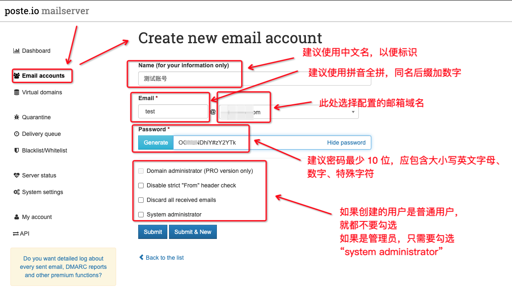

# 使用 Poste自建邮件服务

# 一、简介

Poste 是一款基于 Web 的邮件服务软件，支持多用户和多域名，可以用于搭建自己的邮件服务器，提供完整的 SMTP、IMAP、POP3 等协议支持，支持 SSL/TLS 和 STARTTLS 安全连接，同时还提供了丰富的 Web 邮件客户端界面。Poste 具有配置简单、易于使用和部署等特点，同时还提供了灵活的扩展和自定义功能，可满足各种邮件服务需求。

Poste 的主要特点包括：

- 多用户和多域名支持，可在一个服务器上管理多个邮件域名和用户账号。
- 基于 Web 的邮件客户端，可以通过 Web 浏览器访问邮件。
- 支持 SMTP、IMAP、POP3 等协议，可与其他邮件客户端和邮件服务商互通。
- 提供 SSL/TLS 和 STARTTLS 安全连接，保障邮件传输安全。
- 提供丰富的邮件过滤和垃圾邮件过滤功能，减少垃圾邮件的干扰。
- 支持多种语言界面，包括英语、法语、西班牙语、德语、俄语、葡萄牙语等。
- 易于部署和维护，提供简单的配置界面和日志记录。
- 开源免费，可自由使用和修改。

文档地址：https://poste.io/doc/

## Poste使用的端口

| 端口 | 用途                                                         |
| ---- | ------------------------------------------------------------ |
| 25   | 使用 25 端口来传输邮件。这是 SMTP 协议的默认端口，主要用于从远程邮件服务器接收邮件。 |
| 80   | 提供 Web 界面来管理邮件和日历服务。默认情况下，Poste 使用 80 端口提供 Web 界面 |
| 110  | 使用 110 端口接收 POP3 邮件。POP3 是一种用于从远程邮件服务器接收邮件的标准协议。 |
| 143  | 使用 143 端口接收 IMAP 邮件。IMAP 是一种用于在远程邮件服务器上管理邮件的标准协议。 |
| 443  | 默认情况下，Poste 使用 443 端口提供安全的 HTTPS Web 界面     |
| 465  | 使用 465 端口传输安全的邮件。这是 SMTPS 协议的默认端口，主要用于传输加密的邮件。 |
| 587  | 提供用于发送邮件的 SMTP 端口。该端口通常用于邮件客户端程序发送邮件。 |
| 993  | 提供加密的 IMAP 访问。这是 IMAPS 协议的默认端口，主要用于在远程邮件服务器上加密地访问和管理邮件。 |
| 995  | 提供加密的 POP3 访问。这是 POP3S 协议的默认端口，主要用于在远程邮件服务器上加密地访问和管理邮件。 |
| 4190 | 提供远程筛选器设置的端口。Sieve 是一种脚本语言，可用于自动处理电子邮件。通过使用 4190 端口，用户可以设置远程筛选器以自动处理邮件。 |

# 二、部署操作

## 1、部署

### ①Docker部署

创建 Docker Compose 配置文件 `docker-compose.yml`，内容如下：

```
version: "3"
services:
  postemailserver:
    image: analogic/poste.io
    container_name: postemailserver
    restart: always
    ports:
      - "80:80"
      - "443:443"
      - "25:25"
      - "110:110"
      - "143:143"
      - "465:465"
      - "587:587"
      - "993:993"
      - "995:995"
      - "4190:4190"
    environment:
      TZ: Asia/Shanghai
    volumes:
      - ./data:/data
```

还可以支持的变量或端口
| 环境变量与端口 | 用途 |
| --- | --- |
| HTTPS=OFF | 禁用所有重定向到加密HTTP的操作，适用于使用某种反向代理的情况（将此参数放在镜像名称之前！） |
| HTTP_PORT=8080 | 自定义HTTP端口。请注意，您需要在端口80上处理Let's Encrypt请求，因此如果您正在使用反向代理设置，则需要将“/.well-known/”文件夹转发到此端口。 |
| HTTPS_PORT=4433 | 自定义HTTPS端口。 |
| DISABLE_CLAMAV=TRUE | 禁用ClamAV，这对于低内存使用很有用。 |
| DISABLE_RSPAMD=TRUE | 禁用Rspamd，这对于低内存使用很有用。 |
| DISABLE_ROUNDCUBE=TRUE | 禁用Roundcube webmail。 |
| ELASTICSEARCH=123.123.123.123:9200 | Elasticsearch集成。 |
| 4190:4190 | 如果您想要使用具有外部管理Sieve过滤器功能的客户端，则还需要打开端口4190。|

## 2、域名配置

在配置 Poste 邮件服务器前，需要在域名服务商处进行如下操作（以下详细操作是以域名 example.com，IP 地址为 1.2.3.4 为例）

### ①添加 A 记录或 AAA 记录

将域名解析到你的邮件服务器的 IP 地址或域名。需要添加一个 A 记录或 AAAA 记录，并将记录值指向你的邮件服务器的 IP 地址或域名。例如 mail.example.com，在 “记录值” 中输入你的服务器 IP 地址。

```yaml
记录类型: A
主机记录: mail
记录值: 1.2.3.4
```

- `A 记录`：将域名解析到一个 IPv4 地址
- `AAAA 记录`：将域名解析到一个 IPv6 地址

### ②添加 MX 记录

MX 记录是邮件交换记录，用于指定邮件服务器的优先级。在添加 MX 记录之前，你需要先创建一个邮件服务子域名

```yaml
记录类型: MX
主机记录: @
记录值: mail.example.com
Priority: 10
TTL: 3600
```

- `@` 表示域名本身
- `mail.example.com` 是你的域名
- `Priority` 为 MX 记录的优先级
- `TTL` 表示 DNS 解析的缓存时间

### ③SPF 记录

SPF 记录是发送者策略框架记录，用于指定哪些邮件服务器有权发送特定域名的邮件。你需要在你的域名服务商处添加一个 SPF 记录，将发送者策略框架指向你的 Poste 服务器 IP 地址。

```yaml
Name: @
Type: TXT
Value: v=spf1 a mx ip4:1.2.3.4 ~all
TTL: 3600
```

- `a` 表示允许域名的 A 记录解析出的 IP 地址发送邮件
- `mx` 表示允许 MX 记录解析出的邮件服务器发送邮件
- `ip4:1.2.3.4` 表示允许指定 IP 地址发送邮件
- `~all` 表示除了上述规则之外的邮件都标记为失败。

### ④DKIM 记录

DKIM 记录是域键身份验证记录，用于对邮件进行签名，防止伪造和篡改。你需要在你的域名服务商处添加一个 DKIM 记录，将域键身份验证指向你的 Poste 服务器。

```
Name: dkim._domainkey
Type: TXT
Value: v=DKIM1; k=rsa; p=[公钥]
TTL: 3600
```

其中，`dkim._domainkey` 是 DKIM 记录的默认名称，`rsa` 是加密算法，`[your_public_key_here]` 是你的公钥。

### ⑤DMARC 记录

DMARC 记录是域消息身份验证记录，用于对邮件进行策略控制，指定对未通过 SPF 或 DKIM 验证的邮件的处理方式。你需要在你的域名服务商处添加一个 DMARC 记录，将域消息身份验证指向你的 Poste 服务器。

```
Name: _dmarc
Type: TXT
Value: v=DMARC1; p=reject; rua=mailto:[your_email_address_here]; ruf=mailto:[your_email_address_here]; fo=1
TTL: 3600
```

- `_dmarc` 是 DMARC 记录的默认名称
- `v`：指定使用的协议版本，这里是 DMARC1。
- `p`：指定邮件是仅报告（none）、拒绝（reject）或标记（quarantine）的。
  - `reject` 表示对未通过 SPF 或 DKIM 验证的邮件直接拒绝
- `rua` 和 `ruf` 分别指定将邮件报告发送到的邮件地址
- `fo` 表示将邮件中的 DKIM 失败标记为拒绝。


## 3、防护墙放行

参照下文第4 小节的`iptables加固网络`

## 4、Poste服务器安全加固

### ① iptables加固网络

```bash
# 允许已经建立的连接的流量通过
iptables -A INPUT -m conntrack --ctstate ESTABLISHED,RELATED -j ACCEPT
iptables -A OUTPUT -m conntrack --ctstate ESTABLISHED -j ACCEPT

# 设置默认策略
iptables -P INPUT DROP
iptables -P FORWARD DROP
iptables -P OUTPUT ACCEPT

# 入站防火墙设置
iptables -A INPUT -p tcp -m multiport --dports 22,25,80,110,143,443,465,993 -j ACCEPT

# 出站防火墙设置
iptables -A OUTPUT -p tcp -m multiport --dports 22,25,80,443,465 -j ACCEPT
iptables -A OUTPUT -p udp -m multiport --dports 53 -j ACCEPT
```

### ②Poste用户密码复杂度加固

密码应长度最少 10 位，应包含大小写英文字母、特殊字符、数字等


# 三、验证测试

我们可以使用其他邮件服务商（例如 Gmail、Hotmail 等）来测试 Poste 是否能够正常发送和接收邮件。

## 1、Web 页面收发邮件

**使用其他邮件服务商发送邮件给 Poste**

- 使用 `163邮箱` 或 `QQ邮箱` 等邮件服务商写邮件发送至你在 Poste 中创建的账户，例如 `user@example.com`。

- 在 Poste 的 Web 界面中，查看邮件日志，确认是否接收到了该邮件。

**使用Poste 发送邮件给其他邮件服务商**

- 在 Poste 的 Web 界面中写一封邮件发送至你在  `163邮箱` 或 `QQ邮箱`  等邮件服务商中的账户。

- 在 `163邮箱` 或 `QQ邮箱`  等邮件服务商中，查看你的收件箱，确认是否收到了该邮件。

如果以上两个测试都能够正常运行，说明 Poste 已经成功配置，并且能够正常发送和接收邮件。

## 2、使用邮件客户端收发邮件

参考第四章节

# 四、Poste 管理

## 1、域名管理

## 2、用户管理

- 创建用户



- 删除用户、修改用户密码、修改用户地址、设置用户存储配额等操作，进入用户的详情即可操作

## 3、Poste 系统管理

## 4、Poste备份

如果是 docker 部署的，直接备份 data 目录和 docker-compose.yaml即可

# 五、邮件客户端进行收发邮件

Poste 支持常见的邮件客户端，如 Microsoft Outlook、Apple Mail、Mozilla Thunderbird 等，以及 Android 和 iOS 设备的内置邮件客户端。你可以使用 SMTP 和 POP3 等协议进行收发邮件。

## 1、配置 SMTP

在配置 SMTP 时，需要填写以下信息：

- SMTP 服务器地址：邮件服务器的主机名或 IP 地址。
- SMTP 端口号：邮件服务器的 SMTP 端口号，默认为 25 或 587。
- SMTP 安全连接：选择 SSL/TLS 或 STARTTLS。

以 Microsoft Outlook 为例，配置 SMTP 如下：

1. 打开 Outlook，点击 “文件” > “账户设置” > “账户设置”。
2. 选择要配置的邮件账户，点击 “更改” 按钮。
3. 在 “互联网电子邮件设置” 窗口中，点击 “更多设置” 按钮。
4. 在 “高级” 选项卡中，配置 SMTP 服务器信息。
5. 点击 “确定” 按钮，完成 SMTP 配置。

## 2、配置 POP3

在配置 POP3 时，需要填写以下信息：

- POP3 服务器地址：邮件服务器的主机名或 IP 地址。
- POP3 端口号：邮件服务器的 POP3 端口号，默认为 110 或 995。
- POP3 安全连接：选择 SSL/TLS 或 STARTTLS。

以 Mozilla Thunderbird 为例，配置 POP3 如下：

1. 打开 Thunderbird，点击 “文件” > “新建” > “现有邮件账户”。
2. 输入你的姓名、邮件地址和密码，点击 “继续” 按钮。
3. 在 “配置电子邮件账户” 窗口中，选择 “POP3”。
4. 配置 POP3 服务器信息。
5. 点击 “完成” 按钮，完成 POP3 配置。

注意：在配置邮件客户端时，请使用正确的邮件服务器地址、端口号和安全连接方式。如果无法连接到邮件服务器，请检查你的网络连接和账户信息是否正确。