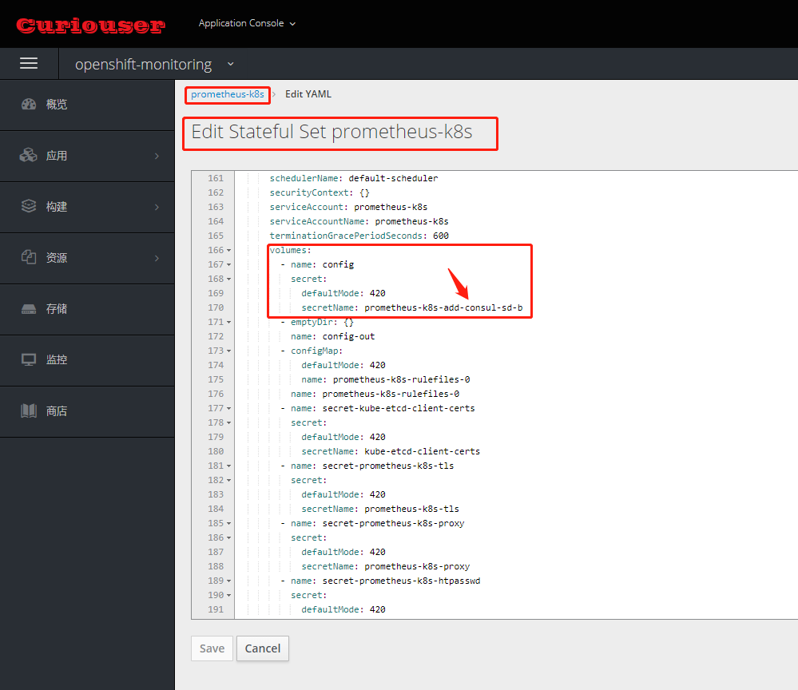
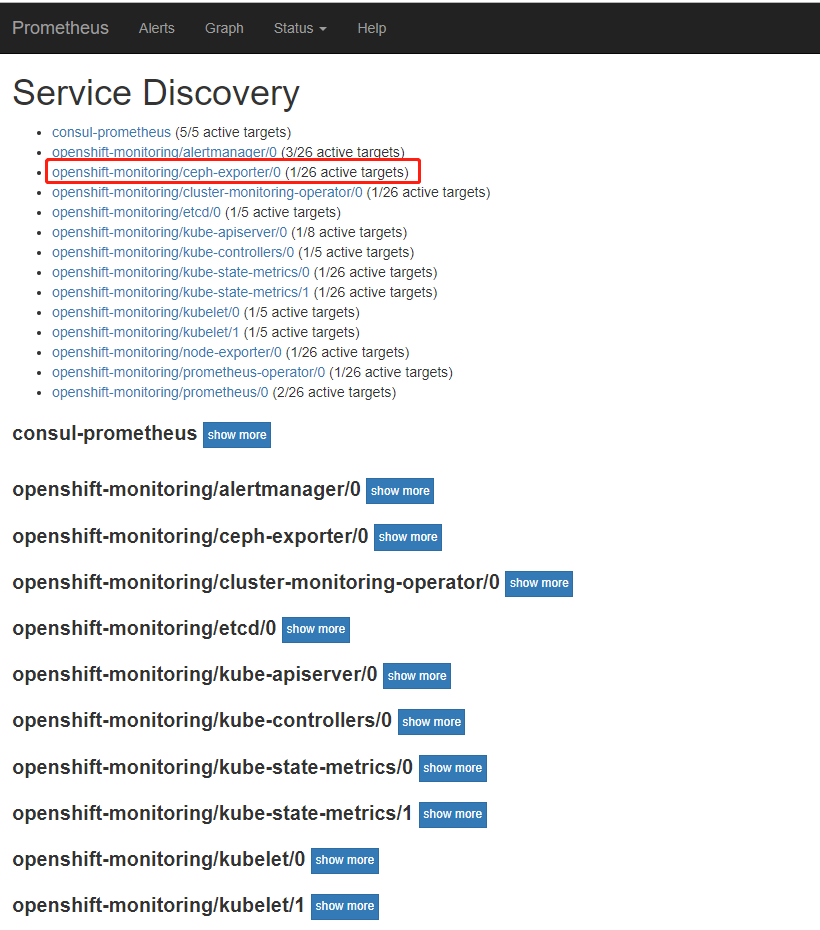
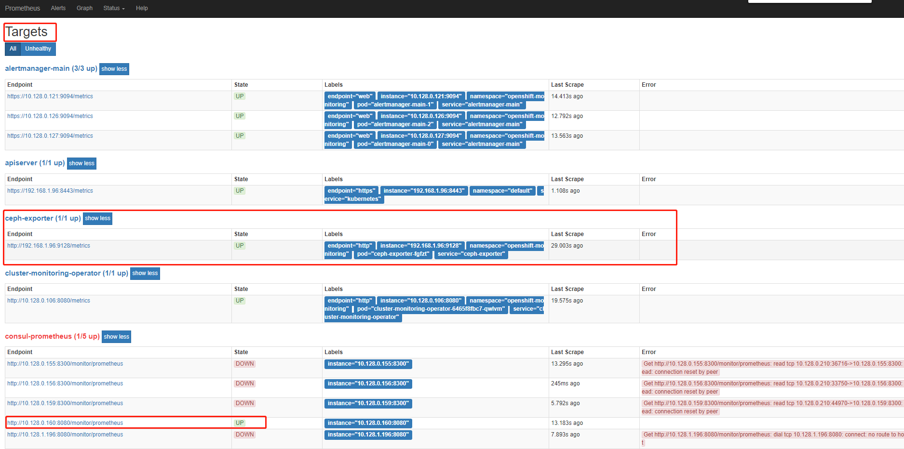
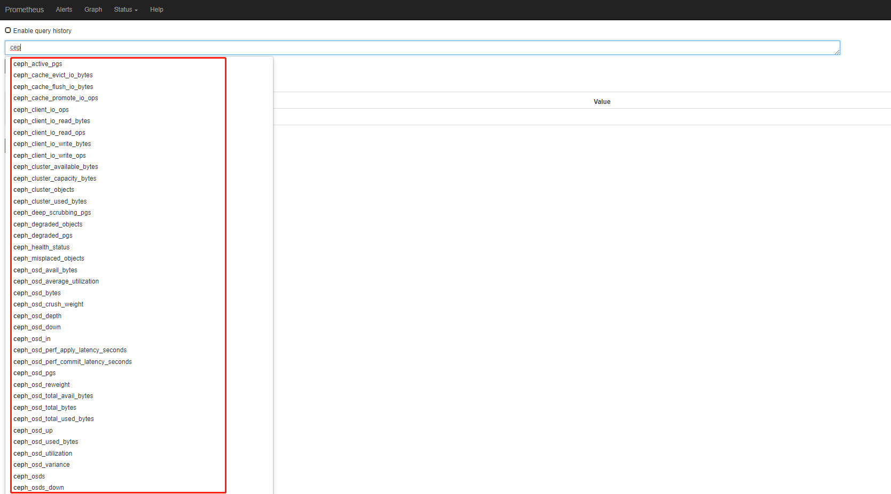
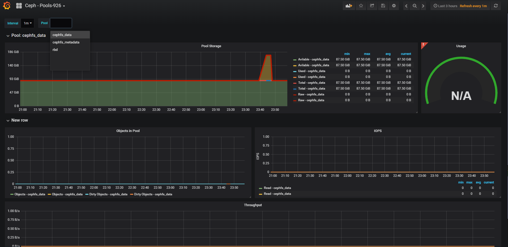
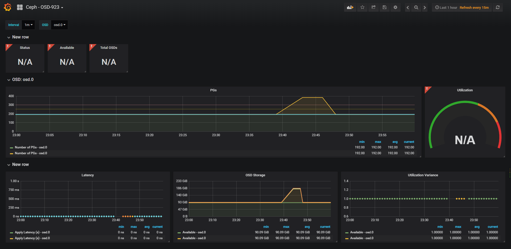
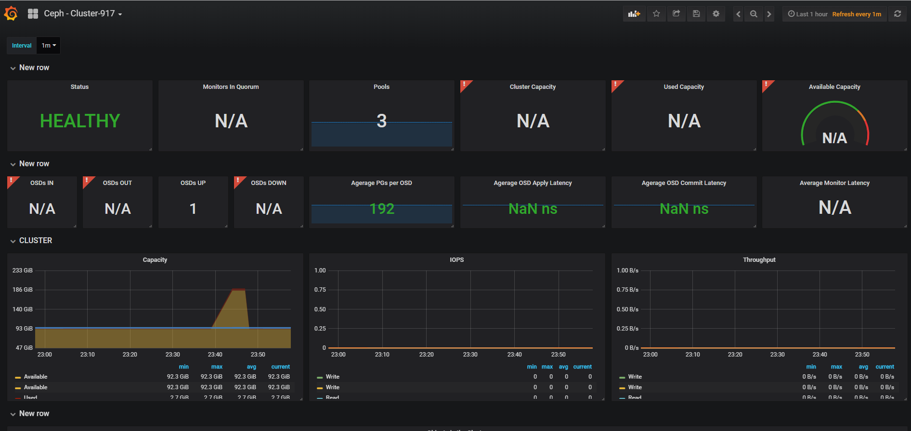

# 一、Overview

由于在Openshift集群外使用了Ceph RBD和Ceph Filesystem作为PV的后端动态存储文件系统，所以ceph的集群监控也可使用Prometheus体系中的Ceph Exporter，接入到Openshift集群中的Prometheus。
* 


# 二、以DaemonSet的形式部署Ceph Exporter

  ```yaml
  ---
  apiVersion: extensions/v1beta1
  kind: DaemonSet
  metadata:
    labels:
      app: ceph-exporter
    name: ceph-exporter
  spec:
    selector:
      matchLabels:
        app: ceph-exporter
    template:
      metadata:
        labels:
          app: ceph-exporter
      spec:
        containers:
        - image: digitalocean/ceph_exporter
          imagePullPolicy: IfNotPresent
          name: ceph-exporter
          ports:
            - containerPort: 9128
              hostPort: 9128
              name: http
              protocol: TCP
          resources: {}
          terminationMessagePath: /dev/termination-log
          terminationMessagePolicy: File
          volumeMounts:
          - mountPath: /etc/ceph
            name: ceph-confdir
        resources:
          limits:
            cpu: 200m
            memory: 400Mi
          requests:
            cpu: 100m
            memory: 200Mi 
        dnsPolicy: ClusterFirst
        hostNetwork: true
        hostPID: true
        nodeSelector:
          beta.kubernetes.io/os: linux
        restartPolicy: Always
        schedulerName: default-scheduler
        securityContext: {}
        serviceAccount: node-exporter　#使用Node-Exporter创建的ServiceAccount
        serviceAccountName: node-exporter
        terminationGracePeriodSeconds: 30
        tolerations:
        - effect: NoSchedule
          key: node-role.kubernetes.io/master
        volumes:
        - hostPath:
            path: /etc/ceph           #将ceph节点的配置文件路径暴露给exporter
            type: ""
          name: ceph-confdir
    templateGeneration: 1
    updateStrategy:
      rollingUpdate:
        maxUnavailable: 1
      type: RollingUpdate
  ---
  apiVersion: v1
  kind: Endpoints
  metadata:
    labels:
      k8s-app: ceph-exporter
    name: ceph-exporter
  subsets:
    - addresses:
        - ip: 192.168.1.96
          nodeName: allinone.okd311.curiouser.com
          targetRef:
            kind: Pod
      ports:
        - name: http
          port: 9128
          protocol: TCP
  ---
  apiVersion: v1
  kind: Service
  metadata:
    annotations:
      prometheus.io/port: '9128'
      prometheus.io/scrape: 'true'
    labels:
      k8s-app: ceph-exporter
    name: ceph-exporter
  spec:
    clusterIP: None
    ports:
      - name: http
        port: 9128
        protocol: TCP
        targetPort: http
    selector:
      app: ceph-exporter
    sessionAffinity: None
    type: ClusterIP
  ---
  apiVersion: route.openshift.io/v1
  kind: Route
  metadata:
    annotations:
      openshift.io/host.generated: 'true'
    labels:
      k8s-app: ceph-exporter
    name: ceph-exporter
  spec:
    port:
      targetPort: http
    to:
      kind: Service
      name: ceph-exporter
      weight: 100
    wildcardPolicy: None
  ```

# 三、Ceph Exporter对接Prometheus 

1. 备份Prometheus原配置文件secret
  [Prometheus原始配置secret文件](../assets/prometheus-Openshift集群Prometheus原始配置secret文件)

2. 创建新的Prometheus配置secret

  在原Prometheus配置文件中添加consul 服务发现和ceph-exporter相关的配置

  ```yaml
  ...省略...
  - job_name: consul-prometheus
    metrics_path: /monitor/prometheus
    scrape_interval: 20s
    scheme: http
    scrape_timeout: 5s
    consul_sd_configs:
      - server: consul-server.consul.svc:8500
        services: []
        scheme: http
        allow_stale: true
        refresh_interval: 20s
  - job_name: openshift-monitoring/ceph-exporter/0
    honor_labels: false
    kubernetes_sd_configs:
    - role: endpoints
      namespaces:
        names:
        - openshift-monitoring
    scrape_interval: 30s
    scheme: http
    relabel_configs:
    - action: keep
      source_labels:
      - __meta_kubernetes_service_label_k8s_app
      regex: ceph-exporter
    - action: keep
      source_labels:
      - __meta_kubernetes_endpoint_port_name
      regex: http
    - source_labels:
      - __meta_kubernetes_namespace
      target_label: namespace
    - source_labels:
      - __meta_kubernetes_pod_name
      target_label: pod
    - source_labels:
      - __meta_kubernetes_service_name
      target_label: service
    - source_labels:
      - __meta_kubernetes_service_name
      target_label: job
      replacement: ${1}
    - source_labels:
      - __meta_kubernetes_service_label_k8s_app
      target_label: job
      regex: (.+)
      replacement: ${1}
    - target_label: endpoint
      replacement: http
  ...省略...
  ```

3. 替换Prometheus的POD secret


# 四、验证







