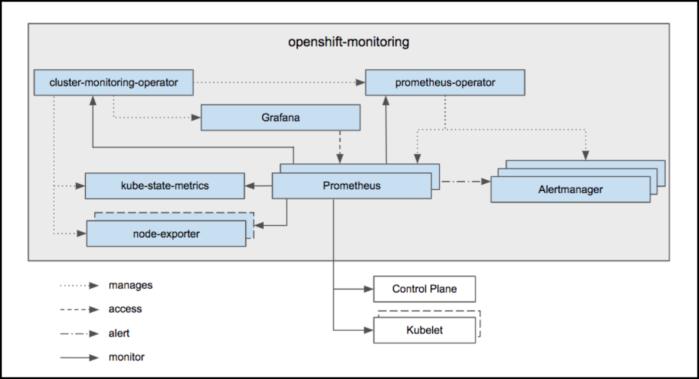
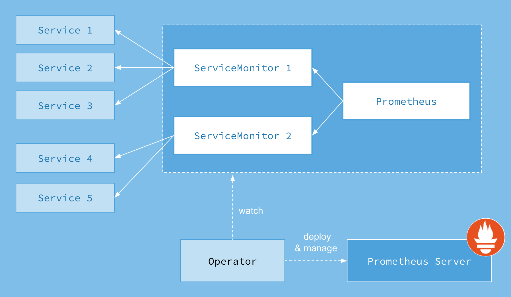
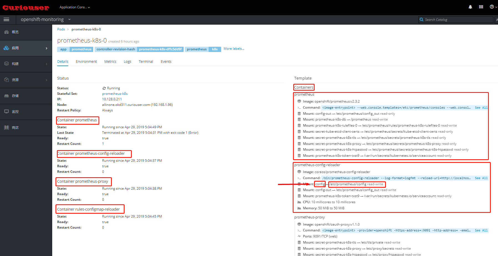
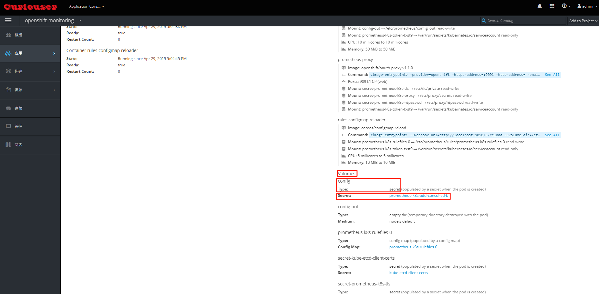
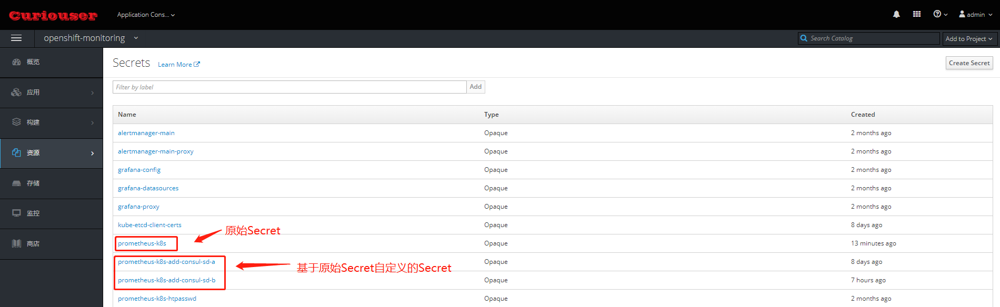

# Kubernetes或Openshift的Prometheus监控体系

# 一、Overview

在早期，也就是 1.10 以前的 K8s 版本。大家都会使用类似像 Heapster 这样的组件来去进行监控的采集。那为什么 Kubernetes 会将 Heapster 放弃掉而转换到 metrics-service 呢？其实这个主要的一个动力来源是由于 Heapster 在做监控数据接口的标准化。为什么要做监控数据接口标准化呢？

- 第一点在于客户的需求是千变万化的，比如说今天用 Heapster 进行了基础数据的一个资源采集，那明天的时候，我想在应用里面暴露在线人数的一个数据接口，放到自己的接口系统里进行数据的一个展现，以及类似像 HPA 的一个数据消费。那这个场景在 Heapster 下能不能做呢？答案是不可以的，所以这就是 Heapster 自身扩展性的弊端；

- 第二点是 Heapster 里面为了保证数据的离线能力，提供了很多的 sink，而这个 sink 包含了类似像 influxdb、sls、钉钉等等一系列 sink。这个 sink 主要做的是把数据采集下来，并且把这个数据离线走，然后很多客户会用 influxdb 做这个数据离线，在 influxdb 上去接入类似像 grafana 监控数据的一个可视化的软件，来实践监控数据的可视化。

但是后来社区发现，这些 sink 很多时候都是没有人来维护的。这也导致整个 Heapster 的项目有很多的 bug，这个 bug 一直存留在社区里面，是**没有人修复**的，这个也是会给社区的项目的活跃度包括项目的稳定性带来了很多的挑战。

基于这两点原因，K8s 把 Heapster 抛弃掉了，然后做了一个精简版的监控采集组件，叫做 metrics-server。

上图是 Heapster 内部的一个架构。大家可以发现它分为几个部分，第一个部分是 core 部分，然后上层是有一个通过标准的 http 或者 https 暴露的这个 API。然后中间是 source 的部分，source 部分相当于是采集数据暴露的不同的接口，然后 processor 的部分是进行数据转换以及数据聚合的部分。最后是 sink 部分，sink 部分是负责数据离线的，这个是早期的 Heapster 的一个应用的架构。那到后期的时候呢，K8s 做了这个监控接口的一个标准化，逐渐就把 Heapster 进行了裁剪，转化成了 metrics-server。

目前版本的 metrics-server 大致的一个结构就变成了上图这样，是非常简单的：有一个 core 层、中间的 source 层，以及简单的 API 层，额外增加了 API Registration 这层。这层的作用就是它可以把相应的数据接口注册到 K8s 的 API server 之上，以后客户不再需要通过这个 API 层去访问 metrics-server，而是可以通过这个 API 注册层，通过 API server 访问 API 注册层，再到 metrics-server。这样的话，真正的数据消费方可能感知到的并不是一个 metrics-server，而是说感知到的是实现了这样一个 API 的具体的实现，而这个实现是 metrics-server。这个就是 metrics-server 改动最大的一个地方。

## Kubernetes 的监控接口标准

在 K8s 里面针对于监控，有三种不同的接口标准。它将监控的数据消费能力进行了标准化和解耦，实现了一个与社区的融合，社区里面主要分为三类。

### 第一类 Resource Metrice

对应的接口是 metrics.k8s.io，主要的实现就是 metrics-server，它提供的是资源的监控，比较常见的是节点级别、pod 级别、namespace 级别、class 级别。这类的监控指标都可以通过 metrics.k8s.io 这个接口获取到。

### 第二类 Custom Metrics

对应的 API 是 custom.metrics.k8s.io，主要的实现是 Prometheus。它提供的是资源监控和自定义监控，资源监控和上面的资源监控其实是有覆盖关系的，而这个自定义监控指的是：比如应用上面想暴露一个类似像在线人数，或者说调用后面的这个数据库的 MySQL 的慢查询。这些其实都是可以在应用层做自己的定义的，然后并通过标准的 Prometheus 的 client，暴露出相应的 metrics，然后再被 Prometheus 进行采集。

而这类的接口一旦采集上来也是可以通过类似像 custom.metrics.k8s.io 这样一个接口的标准来进行数据消费的，也就是说现在如果以这种方式接入的 Prometheus，那你就可以通过 custom.metrics.k8s.io 这个接口来进行 HPA，进行数据消费。

### 第三类 External Metrics

External Metrics 其实是比较特殊的一类，因为我们知道 K8s 现在已经成为了云原生接口的一个实现标准。很多时候在云上打交道的是云服务，比如说在一个应用里面用到了前面的是消息队列，后面的是 RBS 数据库。那有时在进行数据消费的时候，同时需要去消费一些云产品的监控指标，类似像消息队列中消息的数目，或者是接入层 SLB 的 connection 数目，SLB 上层的 200 个请求数目等等，这些监控指标。

那怎么去消费呢？也是在 K8s 里面实现了一个标准，就是 external.metrics.k8s.io。主要的实现厂商就是各个云厂商的 provider，通过这个 provider 可以通过云资源的监控指标。在阿里云上面也实现了阿里巴巴 cloud metrics adapter 用来提供这个标准的 external.metrics.k8s.io 的一个实现。

# 二、Kube-State-Metrics

监听 Kubernetes API server 并自动生成相关对象的metrics信息(并不修改相关对象的配置)，在80端口(默认)暴露出HTTP的endpoint /metric

- GIthub：https://github.com/kubernetes/kube-state-metrics

## kube-state-metrics VS metrics-server

# 三、Metrics-Server

# 四、OpenShfit cluster-monitoring-operator

- **cluster-monitoring-operator** ：负责在 OpenShfit 环境中部署基于 Prometheus 的监控系统
    - GIthub：https://github.com/openshift/cluster-monitoring-operator
    - 部署基于 Prometheus 监控系统中的组件
        - Prometheus Operator
        - Prometheus
        - Alertmanager cluster for cluster and application level alerting
        - kube-state-metrics
        - node_exporter

# 五、Prometheus Operator

**prometheus operator**：使用operator部署、配置、管理Prometheus和Alertmanager 

- GIthub： https://github.com/coreos/prometheus-operator
- 相关博客：https://blog.csdn.net/ygqygq2/article/details/83655552
- 功能：
  - Create/Destroy: 在Kubernetes namespace中更容易启动一个Prometheus实例，一个特定的应用程序或团队更容易使用Operator。
  - Simple Configuration: 配置Prometheus的基础东西，比如在Kubernetes的本地资源versions, persistence, retention policies, 和replicas。
  - Target Services via Labels: 基于常见的Kubernetes label查询，自动生成监控target 配置；不需要学习普罗米修斯特定的配置语言。
- 架构

- **node-exporter**：以Daemonset的形式部署在Openshift集群的各个节点上，采集OS级别的metrics信息
- **监控的Target**
  - Prometheus itself
  - Prometheus-Operator
  - cluster-monitoring-operator
  - Alertmanager cluster instances
  - Kubernetes apiserver
  - kubelets (the kubelet embeds cAdvisor for per container metrics)
  - kube-controllers
  - kube-state-metrics
  - node-exporter
  - etcd (if etcd monitoring is enabled) 

**Note:**
1. Prometheus Pod 中，除了 Prometheus 容器外，还有一个 prometheus-config-reloader 容器。它负责导入在需要的时候让Prometheus 重新加载配置文件。
    
    
2. 配置文件被以 Secret 形式创建并挂载给 prometheus-config-reloader Pod。一旦配置有变化，它会调用 Prometheus 的接口，使其重新加载配置文件。
    

# 相关链接

1. https://docs.okd.io/3.11/install_config/prometheus_cluster_monitoring.html#prometheus-cluster-monitoring
2. http://www.cnblogs.com/sammyliu/p/10155442.html