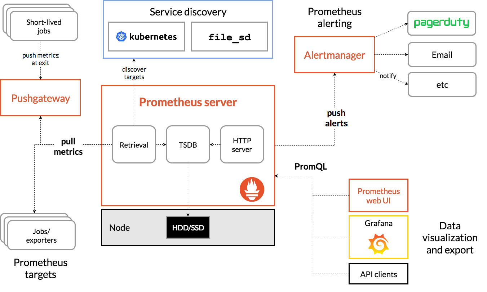

# Prometheus基础概念及PromSQL

# 一、简介

1. prometheus 是一个开源的系统监控和告警的工具包，其采用pull方式采集时间序列，通过http协议传输。

2. prometheus的优势在于，它是一个基于服务的告警系统，针对不同的服务，有不同的exporter，可以实现不一样的效果。

3. 最初由SoundCloud发布。它通过HTTP协议从远程的机器收集数据并存储在本地的时序数据库上。它提供了一个简单的网页界面、一个功能强大的查询语言以及HTTP接口等等。

4. Prometheus可以通过安装在远程机器上的exporter来收集监控数据。

官网：https://prometheus.io/ 
Github：https://github.com/prometheus/prometheus

# 二、架构



- **prometheus的核心是一个时间序列数据库，我们可以通过它抓取并存储数据，并通过prometheus定义的一些查询语句来获取我们需要的数据**
- **exporter的核心是一个静态web，通过不断更新的静态web暴露metric值**
- **alertmanager是一个报警接口，接收prometheus推送的告警，并通过自己定义的一些规则去进行告警**
- **Pushgateway 程序，主要是实现接收由Client push过来的指标数据，在指定的时间间隔，由主程序来抓取**


# 三、存储方式

 Prometheus提供了两种存储方式，分别是本地存储和远端存储

## Prometheus本地存储简介

Prometheus的本地存储被称为Prometheus TSDB，目前是V3版本，根据官方介绍其有着非常高效的时间序列数据存储方法，每个采样数据仅占3.5byte左右空间，上百万条时间序列，30s间隔，保存60天，仅占200多G空间

默认情况下，Prometheus将采集到的数据保存在本地的TSDB数据库中，默认目录为Prometheus安装目录下的data目录。数据写入过程为先把数据写入wal日志并放在内存中，然后2个小时后将内存数据放入一个新的block块，同时再把新的数据写入内存并在2小时后再保存至一个新的block块，依次类推

涉及到两个组成部分：block和wal

- block
  Prometheus TSD将存储的监控数据按时间分割为block，block的大小并不固定，默认最小的block保存2h的数据，随着数据量的不断增加，TSDB会将小的block合并为大的block，例如将3个2h的block合并为一个6h的block，这样不仅可以减少数据存储，还可以减少block个数，便于对数据进行检索。

  在实际存储中，block就是Prometheus TSDB数据目录下那些以01开头的存储目录。block主要包含4个部分：chunks、index、meta.josn、tombstones

  - chunks，主要用于保存压缩后的时序数据。每个chunk的大小为512M，如果超过，则会被分割为多个chunk保存，且以数字编号命名

  - index，是为了对时序数据进行快速检索和查询而设计，主要用来记录chunk中时序的偏移位置

  - meta.json，记录block的元数据信息，主要包括一个数据块记录样本的起始时间、截至时间、样本数、时序数和数据源等信息，这些元数据信息在后期对block进行维护（删除过期block、合并block等）时会用到。

  - tombstones，用于对数据进行软删除。TSDB在删除block数据块时会将整个目录删除，但如果只删除一部分数据块的内容，则可以通过 tombstones进行软删除

- WAL
  WAL（write-ahead logging，预写日志）是关系型数据库中利用日志来实现事务性和持久性的一种技术，即在进行某个操作之前先将这件事情记录下来，以便之后对数据进行回滚、重试等操作并保证数据可靠性。

  Prometheus为了防止丢失暂存在内存中的还未被写入磁盘的监控数据’、引入了WAL机制。WAL被分割为默认大小为128M的文件段，文件段以数字命名，例如00000001、00000002等，以此类推。

  按照每种对象设定的采集周期，Prometheus会将周期性采集的监控数据先写入head-block中，但这些数据没有被持久化，TSDB通过WAL将提交的数据先保存到磁盘中，在TSDB宕机重启后，会首先启动多协程读取WAL，从而恢复之前的状态。

  另外从Prometheus v2.19.0开始，Prometheus引入了内存映射，将head-block中已填充的完整的chunk，刷新到磁盘（即保存在chunks_head目录下的数据）并从磁盘进行内存映射，同时仅将引用存储在内存中。通过内存映射，可以在需要时使用该引用将chunk动态加载到内存中。这是操作系统提供的功能。通过引入内存映射，减少了Prometheus的内存消耗，虽然填充完毕的chunk会被刷到磁盘上，但是对于该部分的操作预写入日志不会被删除，直到该chunk所属的block完整落盘

# 四、Metrics数据模型

Prometheus 中存储的数据为时间序列，是由 metric 的名字和一系列的标签（键值对）唯一标识的，不同的标签则代表不同的时间序列

- **metric** ：该名字应该具有语义，一般用于表示 metric 的功能，例如：http_requests_total, 表示 http 请求的总数。

  ```
  metric 名字由 ASCII字符，数字，下划线，以及冒号组成，且必须满足正则表达式 [a-zA-Z_:][a-zA-Z0-9_:]*
  ```

- **标   签**：使同一个时间序列有了不同维度的识别。例如 http_requests_total{method="Get"} 表示所有 http 请求中的 Get 请求。当 method="post" 时，则为新的一个 metric。

  ```
  标签中的键由 ASCII字符，数字，以及下划线组成，且必须满足正则表达式 [a-zA-Z_:][a-zA-Z0-9_:]*。
  ```

- **样  本**：实际的时间序列，每个序列包括一个 float64 的值和一个毫秒级的时间戳。

  ```
  格式：<metric name>{<label name>=<label value>, …}，
  
  例如：http_requests_total{method="POST",endpoint="/api/tracks"}。
  ```

# 五、Metrics类型

- **Counter：**只增不减的计数器
  - 计数器可以用于记录只会增加不会减少的指标类型。比如记录应用请求的总量，cpu使用时间等
  - 对于Counter类型的指标，只包含一个inc()方法，用于计数器+1
  - 一般而言，Counter类型的metrics指标在命名中我们使用_total结束，如http_requests_total

- **Gauge：**可增可减的仪表盘
  - 对于这类可增可减的指标，可以用于反应应用的当前状态。例如在监控主机时，主机当前空闲的内存大小，可用内存大小。或者容器当前的cpu使用率,内存使用率。
  - 对于Gauge指标的对象则包含两个主要的方法inc()以及dec(),用户添加或者减少计数。

- **Histogram：**自带buckets区间用于统计分布统计图
  - 主要用于在指定分布范围内(Buckets)记录大小或者事件发生的次数。

- **Summary**:：客户端定义的数据分布统计图
  - Summary和Histogram非常类型相似，都可以统计事件发生的次数或者大小，以及其分布情况。
  - Summary和Histogram都提供了对于事件的计数_count以及值的汇总_sum。 因此使用_count,和_sum时间序列可以计算出相同的内容，例如http每秒的平均响应时间：rate(basename_sum[5m]) /rate(basename_count[5m])。
  - 同时Summary和Histogram都可以计算和统计样本的分布情况，比如中位数，9分位数等等。其中 0.0<= 分位数Quantiles <= 1.0。
  - 不同在于Histogram可以通过histogram_quantile函数在服务器端计算分位数。 而Sumamry的分位数则是直接在客户端进行定义。
  - 因此对于分位数的计算。 Summary在通过PromQL进行查询时有更好的性能表现，而Histogram则会消耗更多的资源。相对的对于客户端而言Histogram消耗的资源更少。

# 六、PromSQL查询语法

## 1、查询语法规则

```bash
```

## 2、时间范围查询

- **查询瞬时向量**

  ```bash
  # 瞬时向量表达式，选择当前最新的数据
  node_uname_info
  # 瞬时向量表达式，选择当前最新的数据
  node_uname_info{}
  ```

- **查询范围向量**

  ```bash
  # 查询以当前时间为基准，5分钟内的数据
  node_uname_info [5m]
  ```

- **查询位移时间的向量**

  ```bash
  # 查询以当前时间为基准，1小时前的瞬时样本数据
  node_uname_info offset 1h
  ```
  
- **综合查询**

  ```bash
  # 查询以当前时间为基准，1小时前1小时内的数据
  node_uname_info [1h] offset 1h
  ```

时间范围查询支持的时间单位：

- `ms` ： 毫秒
- `s` ：秒
- `m` ：分支
- `h` ：小时
- `d`： 天（24小时）
- `w` ：周（7天）
- `y` ：年（365天）

# 七、配置

## 1、配置Prometheus

### ①检查配置文件语法

```bash
promtool check config /etc/prometheus/prometheus.yml
```

### ②在运行时重载配置文件

在启动prometheus时添加参数：

```bash
prometheus \
    --config.file=/opt/prometheus/prometheus.yml \
    --storage.tsdb.path=/data/prometheus/data \
    --web.enable-lifecycle
```

然后通过Reastful接口触发重载配置文件

```bash
curl -XPOST http://127.0.0.1:9090/-/reload
```

或者给prometheus进程发送SIGHUP信号

```bash
kill -HUP prometheus进程号
```

如果变更后的配置文件语法有错误，则不会重载生效。触发重载前，可使用`promtool check`检查配置文件语法。

参考：https://prometheus.io/docs/prometheus/latest/configuration/configuration/#%3Cscrape_config%3E

## 2、配置node_exporter

参考文档：https://prometheus.io/docs/guides/node-exporter/

```yaml
scrape_configs:
  - job_name: 'node'
    static_configs:
    - targets:
      - 部署node_exporter主机IP地址:9100
      - 部署node_exporter主机IP地址:9100
```

## 3、配置blackbox_exporter

参考文档：https://github.com/prometheus/blackbox_exporter#prometheus-configuration

```yaml
scrape_configs:
  - job_name: "blackbox"
    scrape_interval: 10s
    scrape_timeout: 5s
    metrics_path: /probe
    params:
      module: [http_2xx]
    static_configs:
    - targets:
      - http://代探测的URL
    relabel_configs:
    - source_labels: [__address__]
      target_label: __param_target
    - source_labels: [__param_target]
      target_label: instance
    - target_label: __address__
      replacement: 部署blackbox_exporter主机IP地址:9115
```

# 八、API

目前，Prometheus API 的稳定版本为V1，针对该API的访问路径为 /api/v1。API支持的请求模式有GET和POST两种，当正常响应时，会返回2xx的状态码。当API正常响应后，将返回如下的Json数据格式。反之，当API调用失败时，则可能返回以下几种常见的错误提示码：

- 400 Bad Request  参数丢失或不正确时出现。
- 422 Unprocessable Entity 当表达无法被执行时。
- 503 Service Unavailiable 查询超时或中止时。

请求参数格式

- query=<string>: Prometheus expression query string.
- time=<rfc3339 | unix_timestamp>: Evaluation timestamp. Optional.
- timeout=<duration>: Evaluation timeout. Optional. Defaults to and is capped by the value of the -query.timeout flag.

## 1、admin api

默认情况下，管理时间序列 API 是被禁用的，在 Prometheus 的启动参数中添加`--web.enable-admin-api`参数启用

### ①删除时间序列指标

```bash
PUT /api/v1/admin/tsdb/delete_series

参数：
  match[]=<series_selector> : Metrics的名称
  start=<rfc3339 | unix_timestamp> : 开始的时间戳
  end=<rfc3339 | unix_timestamp> : 结束的时间戳
  
# 删除某个标签匹配的数据
$ curl -X POST -w "%{http_code}" 'http://localhost:9090/api/v1/admin/tsdb/delete_series?match[]={instance=".*"}'
# 删除某个指标数据
$ curl -X POST -w "%{http_code}" 'http://localhost:9090/api/v1/admin/tsdb/delete_series?match[]={node_load1=".*"}'
# 根据时间删除
$ curl -X POST -w "%{http_code}" 'http://localhost:9090/api/v1/admin/tsdb/delete_series?match[]={node_load1=".*"}&start<2023-08-23T05:33:24.637Z&end=2023-08-23T05:33:35.637Z'
```

### ②删除软删除的数据

从磁盘中删除已删除的数据，并清理现有的逻辑删除。还可以在删除操作后释放空间。

```bash
POST /api/v1/admin/tsdb/clean_tombstones
PUT /api/v1/admin/tsdb/clean_tombstones

# 成功则返回 204 的请求状态码
$ curl -s  -XPOST -w "%{http_code}" http://localhost:9090/api/v1/admin/tsdb/clean_tombstones
```

## 2、resource api

### ①查询某一时刻的metrics数据

```bash
GET /api/v1/query
POST /api/v1/query

参数：
	query=<string>: Prometheus 表达式查询字符串。
	time=<rfc3339 | unix_timestamp>: 时间戳，可选参数。
	timeout=<duration>:  查询超时设置，可选参数，默认将使用-query.timeout的全局参数。
	
$ curl -s 'http://localhost:9090/api/v1/query?' \
    -d 'query=up{instance="localhost:9090"}' \
    -d 'time=2023-08-23T08:01:00.001Z' | jq -r '.'
```

### ②查询metrics时间范围内的数据

```bash
GET /api/v1/query_range
POST /api/v1/query_range

参数：
	query=<string>: Prometheus 表达式查询字符串。
	start=<rfc3339 | unix_timestamp>: 开始时间戳，可选参数
	end=<rfc3339 | unix_timestamp>: 结束时间戳，可选参数
	step=<duration | float>: 查询解析步长，采用持续时间格式或浮点秒数
	timeout=<duration>: 查询超时设置，可选参数，默认将使用-query.timeout的全局参数。

$ curl -s 'http://localhost:9090/api/v1/query_range?' \
		-d 'query=up' \
		-d 'start=2023-08-23T08:01:00.001Z' \
		-d 'end=2023-08-23T08:30:00.001Z' \
		-d 'step=15s' | jq -r '.'
```

### ③格式化查询metrics数据

```bash
GET /api/v1/format_query
POST /api/v1/format_query

参数：
	query=<string>: Prometheus 表达式查询字符串。
	
$ curl -s 'http://localhost:9090/api/v1/format_query?query=foo/bar' | jq -r '.'
```

### ④根据标签查询metrics数据

```bash
GET /api/v1/series
POST /api/v1/series

参数：
  match[]=<series_selector>: 至少提供一个 match[]
  start=<rfc3339 | unix_timestamp>: 开始时间戳，可选参数
  end=<rfc3339 | unix_timestamp>: 结束时间戳，可选参数

$ curl -s 'http://localhost:9090/api/v1/series?' \
		-d 'match[]=up' \
		-d 'match[]=node_disk_io_now{job="node_exporter"}' | jq -r '.'
```

### ⑤查询metrics的标签

```bash
GET /api/v1/labels
POST /api/v1/labels

参数：
  match[]=<series_selector>: 可选
  start=<rfc3339 | unix_timestamp>: 开始时间戳，可选参数
  end=<rfc3339 | unix_timestamp>: 结束时间戳，可选参数

$ curl -s 'http://localhost:9090/api/v1/labels?' | jq -r '.' 
$ curl -s 'http://localhost:9090/api/v1/labels?' \
		-d 'match[]=up' | jq -r '.' 
```

### ⑥查询标签的值

```bash
GET /api/v1/label/<label_name>/values

参数：
  match[]=<series_selector>: 可选
  start=<rfc3339 | unix_timestamp>: 开始时间戳，可选参数
  end=<rfc3339 | unix_timestamp>: 结束时间戳，可选参数
  
$ curl -s 'http://localhost:9090/api/v1/label/job/values' | jq -r '.'
```

### ⑦查询 Target

```bash
GET /api/v1/targets
参数:
  state=<any | active | dropped>: target的状态
	scrapePool==<string>: 
$ curl -s http://localhost:9090/api/v1/targets?state=active | jq -r '.'
```

### ⑧查询配置文件

```bash
GET /api/v1/status/config

$ curl -s http://localhost:9090/api/v1/status/config | jq -r '.'
```

### ⑨查询启动的参数

```bash
GET /api/v1/status/flags

$ curl -s http://localhost:9090/api/v1/status/flags | jq -r '.'
```

### ⑩查询TSDB的状态

```bash
$ curl -s http://localhost:9090/api/v1/status/tsdb | jq -r '.'
```

### ⑪查询 WAL 重放状态

```bash
GET /api/v1/status/walreplay

$ curl -s http://localhost:9090/api/v1/status/walreplay | jq -r '.'
```
