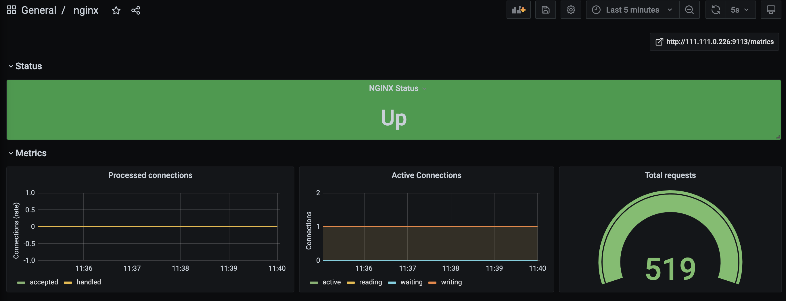

# 收集Nginx内置Metrics到Prometheus

# 一、简介

Nginx的ngx_http_stub_status_module模块可以暴露出来nginx的一些性能信息。但是这些信息不是prometheus的metrics信息格式。所以需要一个第三方服务用于转换这些数据，然后才能让prometheus拉取信息。

# 二、配置

## 1、Nginx

文档：http://nginx.org/en/docs/http/ngx_http_stub_status_module.html#variables

`ngx_http_stub_status_module`模块没有内置到nginx。如果需要开起，在编译Nginx时添加`--with-http_stub_status_module`参数

```bash
server {
	listen 8080;
  location /basic_status {
      stub_status;
  }
}
```

访问http://localhost:8080/basic_status

```bash
Active connections: 2 
server accepts handled requests
 37 37 519 
Reading: 0 Writing: 1 Waiting: 1 
```

## 2、Nginx Exporter

文档：https://github.com/nginxinc/nginx-prometheus-exporter

```bash
docker run -d \
	--name nginx-prometheus-exporter \
	-p 9113:9113 \
  nginx/nginx-prometheus-exporter:0.9.0 -nginx.scrape-uri=http://localhost:8080/basic_status
```

访问http://localhost:9113/metrics

```bash
# HELP nginx_connections_accepted Accepted client connections
# TYPE nginx_connections_accepted counter
nginx_connections_accepted 37
# HELP nginx_connections_active Active client connections
# TYPE nginx_connections_active gauge
nginx_connections_active 2
# HELP nginx_connections_handled Handled client connections
# TYPE nginx_connections_handled counter
nginx_connections_handled 37
# HELP nginx_connections_reading Connections where NGINX is reading the request header
# TYPE nginx_connections_reading gauge
nginx_connections_reading 0
# HELP nginx_connections_waiting Idle client connections
# TYPE nginx_connections_waiting gauge
nginx_connections_waiting 1
# HELP nginx_connections_writing Connections where NGINX is writing the response back to the client
# TYPE nginx_connections_writing gauge
nginx_connections_writing 1
# HELP nginx_http_requests_total Total http requests
# TYPE nginx_http_requests_total counter
nginx_http_requests_total 519
# HELP nginx_up Status of the last metric scrape
# TYPE nginx_up gauge
nginx_up 1
# HELP nginxexporter_build_info Exporter build information
# TYPE nginxexporter_build_info gauge
nginxexporter_build_info{commit="5f88afbd906baae02edfbab4f5715e06d88538a0",date="2021-03-22T20:16:09Z",version="0.9.0"} 1
```

## 3、Prometheus

```bash
# ...省略...
scrape_configs:
	- job_name: 'nginx_exporter'
   static_configs:
     - targets: ['localhost:9113']   
```

## 4、Grafana

Grafana仪表盘：https://grafana.com/grafana/dashboards/11280/reviews

优化修改后的仪表盘JSON文件：[nginx-exporter-dashboard.json](grafana-nginx-exporter-dashboard.json)



# 三、总结

暴露出来的Nginx信息太少，没有监控价值


**参考**：

1. https://cloud.tencent.com/document/product/1416/56039


