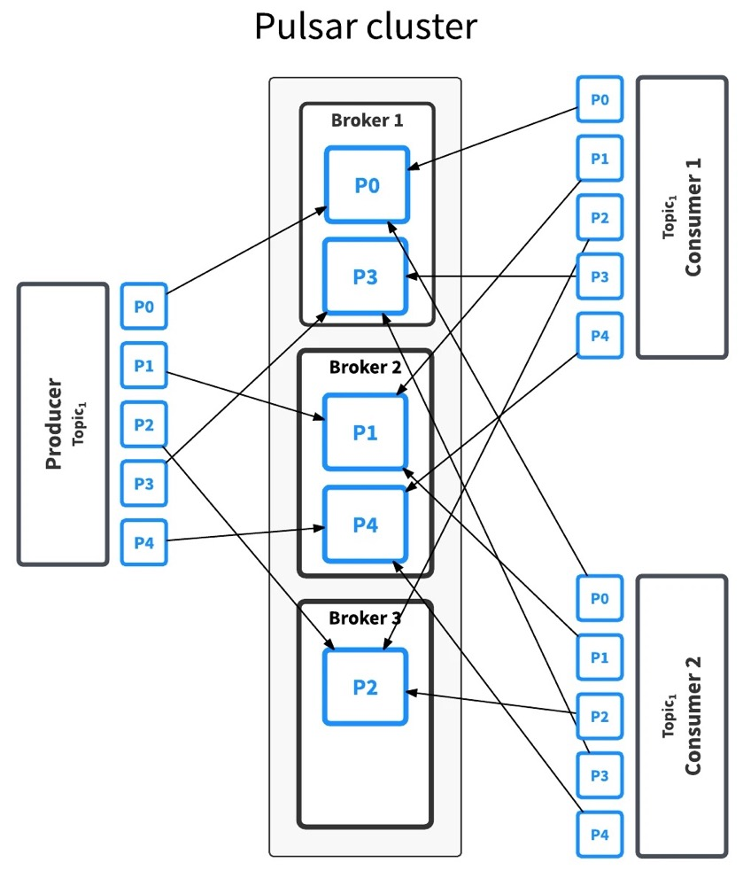
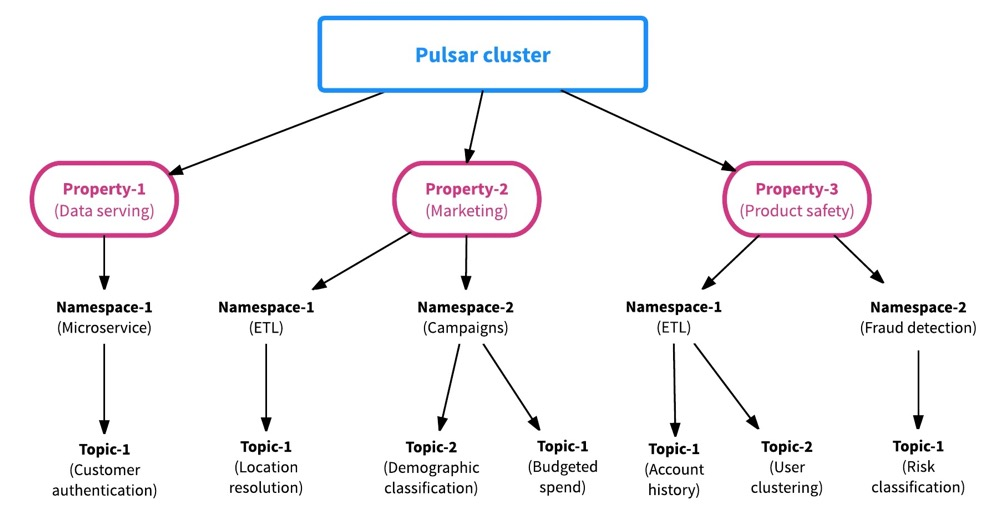
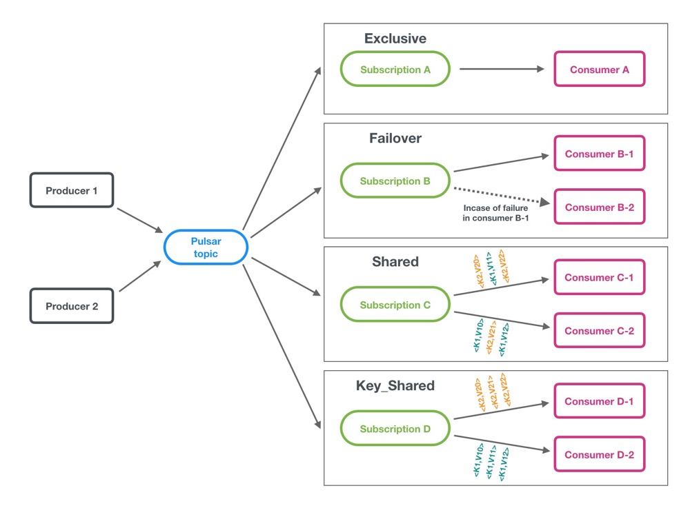
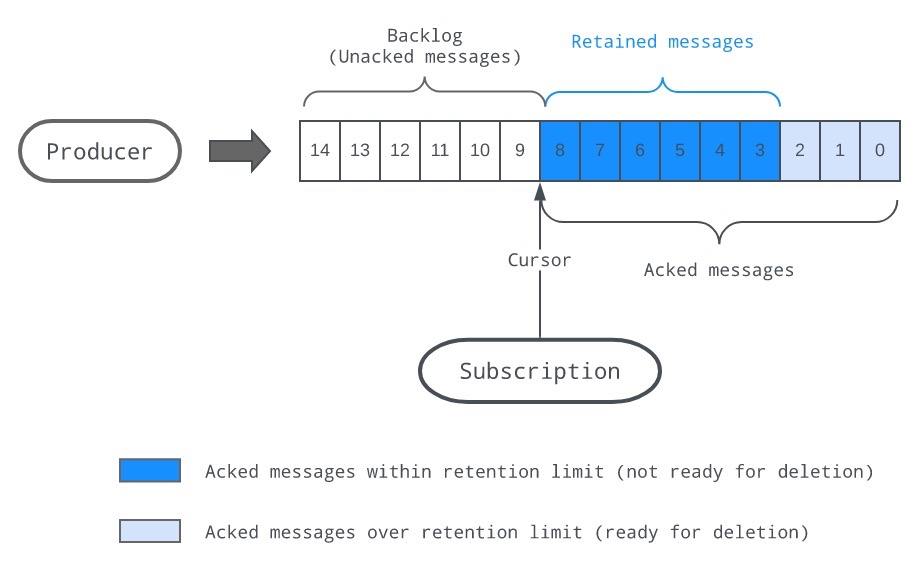
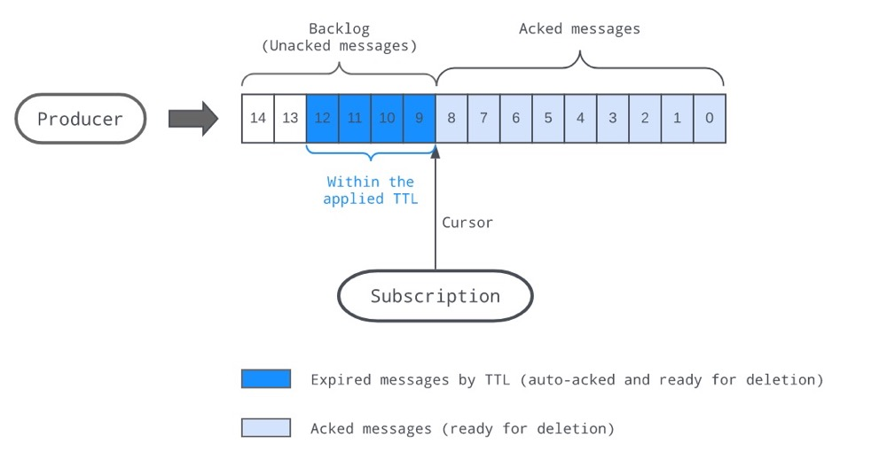

# Pulsar

# 一、简介

## 1、功能特性

## 2、Pulsar架构

- **Broker**
    - 一个或多个Broker
    - 处理和负载接受到的生产者发送的消息数据
    - 调度消息发送给消费者
    - 与Zookeeper进行通信以处理各种协调任务，
    - 将消息存储在BookKeeper实例（又称为bookies）中
    - 依赖于ZooKeeper集群来执行某些任务，
    - 等等
- **Apache Zookeeper（Standby/Cluster）**
    - Pulsar使用ZK存储元数据、集群配置，还有协调各Broker
    - 协调由那个Broker响应数据处理
    - 存储Topic主题的元数据
- **Apache BookKeeper（又称为bookies）**
    - 由一个或多个bookies组成的BookKeeper集群来存储需要持久化的消息数据，和消费者消费消息的游标offset
    - Apache BookKeeper是一个分布式的WAL(write-ahead log)系统






# 二、基础概念

## 1、namespace

- namespace是Pulsar中最基本的管理单元，

- 可以在namespace中进行设置权限、调整副本设置，管理跨集群的消息复制，控制消息策略等关键操作。

- 一个主题topic可以继承其所对应的namespace的属性，因此我们只需对namespace的属性进行设置，就可以一次性设置该namespace中所有主题topic的属性。

## 2、namespace分类

namespace有本地namespace和全局namespace两种

- 本地namespace仅对定义它的集群可见

- 全局namespace跨集群可见，可以使同一个数据中心的集群，也可以是跨地域中心的集群，这取决于namespace中是否设置了跨集群拷贝数据功能

- 本地和全局namespace都可以通过一定设置进行跨团队和跨组织共享。一旦生产者获得了namespace的写入权限，那么它就可以向namespace中的所有topic主题写入数据。若主题不存在，则在第一次写入时动态创建。

## 3、Topic Schema

```bash
{persistent|non-persistent}://tenant/namespace/topic
{持久化|非持久化}://租户/命名空间/主题
```

## 4、Topic主题类型

- **持久化的：**`persistent://tenant/namespace/topic-name`

  默认情况下，Pulsar将所有未确认的消息持久存储在多个 BookKeeper（存储节点）上。因此，持久主题上的消息数据可以在broker重新启动和订阅者故障切换后继续存在。Pulsar 在收到消息之后，将消息发送给多个 BookKeeper 节点（具体由复制系数来定），节点将数据写入预写式日志（write ahead log），同时在内存里也保存一份。节点在对消息进行确认之前，强制将日志写入到持久化的存储上，因此即使出现电力故障，数据也不会丢失。

- **非持久化的：**`non-persistent://tenant/namespace/topic-name`

  消息不会持久化到磁盘，而只存在于内存中。当使用非持久性主题时，停止Pulsar Broker或断开主题订阅者的连接，意味着该（非持久性）主题上所有传输中的消息都会丢失，同时客户端可能会看到消息丢失。

## 5、支持的消息压缩格式：

- LZ4
- ZLIB
- ZSTD
- SNAPPY

## 6、生产者发送消息模式

- 同步：发送每条消息后，生产者将等待Broker的确认。如果未收到确认，则生产者将发送操作视为失败
- 异步：将把消息放于阻塞队列中，并立即返回。然后，客户端将在后台将消息发送给 broker
       如果队列已满(最大大小可配置)，则调用 API 时，producer 可能会立即被阻止或失败，具体取决于传递给 producer 的参数。

## 7、消费者接受消息模式

- 同步
- 异步

## 8、订阅模式



- **exclusive(独家)**：只允许有一个消费者
- **shared（共享**）：允许多个消费者，消费者间机会均等。消息通过轮询机制分发给不同的消费者，并且每个消息仅会被分发给一个消费者。当消费者断开连接，所有发送给他，但没有被确认的消息将被重新安排，分发给其它存活的消费者。
- **failover(灾备)**：允许多个消费者，消费者有主从之分，主消费者负责接受数据，主消费者挂掉以后，从消费者代替主消费者接着接受数据
- **key_shared**：允许多个消费者，具有相同key或相同订阅key的消息仅传递给一个使用者。
              不管消息被重新发送多少次，它都会被发送到同一使用者。当消费者连接或断开连接时，将导致服务的消费者更改某些消息键。

## 9、多主题订阅

- 当consumer订阅pulsar的主题时，它默认指定订阅了一个主题，例如：`persistent://public/default/my-topic`。
- 从Pulsar的1.23.0-incubating的版本开始，Pulsar消费者可以同时订阅多个topic
- 多主题订阅方式：
  - 正则匹配：persistent://public/default/finance-.*
  - 明确指定的topic列表

非持久化主题内的数据处理速度比持久化主题快

消息的默认保留，过期处理方式
- 立即删除消费者已确认的所有消息
- 以消息backlog的形式，持久保存所有的未被确认消息

Pulsar 支持保证一条消息只能在broker服务端被持久化一次的特性，即消息去重功能

## 10、消息路由策略

- **单独分区（SinglePartition）：**生产者随机挑选一个分区，并将数据写入该分区。该策略与非分区主题提供的保证是一样的，不过如果有多个生产者向同一个主题写入数据，该策略就会很有用。
- **轮询分区（RoundRobinPartition）：**生产者通过轮询的方式将数据平均地分布到各个分区上。比如，第一个消息写入第一个分区，第二个消息写入第二个分区，并以此类推。
- **哈希分区（hash）：**每个消息会带上一个键，要写入哪个分区取决于它所带的键。这种分区方式可以保证次序。
- **自定义分区：**生产者使用自定义函数生成分区对应的数值，然后根据这个数值将消息写入对应的分区。

## 11、消息保留策略

- **消息存留策略**

  

  存留规则会被用于某`namespace`下所有的`topic`，指明哪些消息会被持久存储，即使已经被确认过。 没有被留存规则覆盖的消息将会被删除。

- **消息过期策略**

  

  设置在`namespace`上的`TTL`，消息即使没有被确认消费，也会被删除掉。

# 参考

1. https://jack-vanlightly.com/blog/2018/10/2/understanding-how-apache-pulsar-works
1. https://www.infoq.cn/article/2017/11/apache-pulsar-brief-introduction
