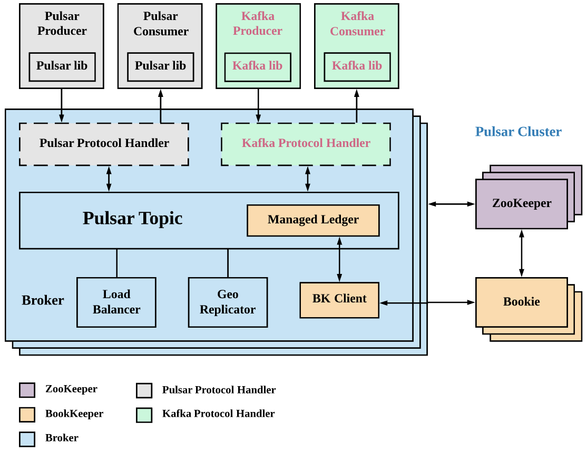

# Pulsar的Kafka协议适配器KoP

# 一、简介

为了能平滑、不改写代码、无侵入地迁移应用使用pulsar，KoP以插件形式支持Kafka协议。

Github地址：https://github.com/streamnative/kop



# 二、部署配置

从Pulsar的2.6.2.0开始，`KoP x.y.z.m`基于`Pulsar x.y.z`，而m是补丁版本号。

## 1、下载KoP

下载KoP的nar包到各个Broker节点

```bash
mkdir /opt/pulsar/protocol-handler && \
wget https://github.com/streamnative/kop/releases/download/v2.7.1.5/pulsar-protocol-handler-kafka-2.7.1.5.nar -P /opt/pulsar/protocol-handler
```

## 2、配置Broker的配置文件

```bash
pulsar_broker_config_file=/opt/pulsar/conf/broker.conf
sed -i '/allowAutoTopicCreationType=non-partitioned/d' $pulsar_broker_config_file
echo "### --- KoP Configuration----" >> $pulsar_broker_config_file
echo "messagingProtocols=kafka" >> $pulsar_broker_config_file
echo "protocolHandlerDirectory=./protocol-handler" >> $pulsar_broker_config_file
echo "kafkaListeners=PLAINTEXT://$(ip a |grep eth0|grep inet|awk '{print $2}'|awk -F"/" '{print $1}'):9092" >> $pulsar_broker_config_file
echo "allowAutoTopicCreationType=partitioned" >> $pulsar_broker_config_file
echo "brokerEntryMetadataInterceptors=org.apache.pulsar.common.intercept.AppendIndexMetadataInterceptor" >> $pulsar_broker_config_file
echo "advertisedAddress=$(ip a |grep eth0|grep inet|awk '{print $2}'|awk -F"/" '{print $1}')" >> $pulsar_broker_config_file
```

## 3、重启Pulsar Broker节点

```bash
kill -9 `jps -l |grep "org.apache.pulsar.PulsarBrokerStarter" |awk '{print $1}'` ;
sleep 3 && \
pulsar-daemon start broker && \
tail -f /data/pulsar/logs/pulsar-broker-$(hostname -s).pulsar.prod.log
```

## 4、验证

### ①验证Broker节点是否开起9092端口

```bash
netstat -lanp|grep 9092 && \
jps -l | grep "org.apache.pulsar.PulsarBrokerStarter"
```

### ②使用kaf工具

```bash
kaf config add-cluster prod-pulsar -b pulsar_broker_ip:9092
kaf config select-cluster -c kaf config select-cluster
kaf topic create kop1 -p 10 -r 1
echo "hello pulsar kop" | kaf produce kop1
kaf consume kop1 -f
```

### ③使用kafka原生客户端

**创建Topic**

```bash
kafka-topics.sh --bootstrap-server pulsar_broker_ip:9092 --create --replication 1 --partitions 5 --topic kop
```

**创建生产者**

```bash
kafka-console-producer.sh --bootstrap-server pulsar_broker_ip:9092 --topic kop
```

**创建消费者**

```bash
kafka-console-consumer.sh --bootstrap-server pulsar_broker_ip:9092 --topic kop --from-beginning
```

# 三、KoP的配置详解

其他配置项参考：https://github.com/streamnative/kop/blob/master/docs/configuration.md

| 配置项                       | 含义                                                         | 默认值          |
| ---------------------------- | ------------------------------------------------------------ | --------------- |
| `messagingProtocols`         | kafka                                                        | null            |
| `protocolHandlerDirectory`   | KoP NAR文件相对于安装路径所处的目录路径                      | ./protocols     |
| `allowAutoTopicCreationType` | KoP仅支持分区的Topic。因此，最好设置为partitioned。如果默认情况下将其设置为未分区，则KoP自动创建的主题仍为分区主题。但是，由Pulsar Broker自动创建的主题是未分区的主题。 | non-partitioned |

