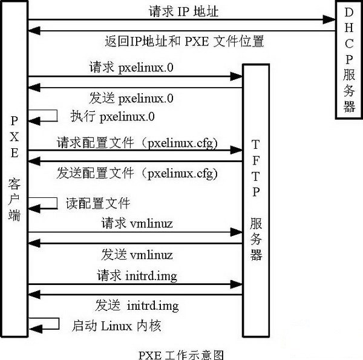
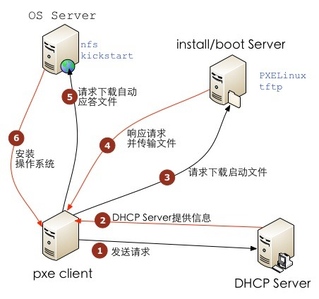
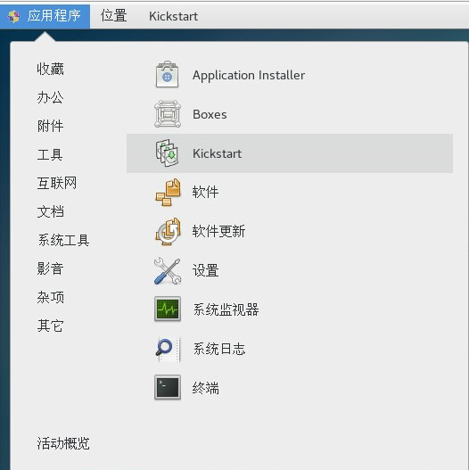
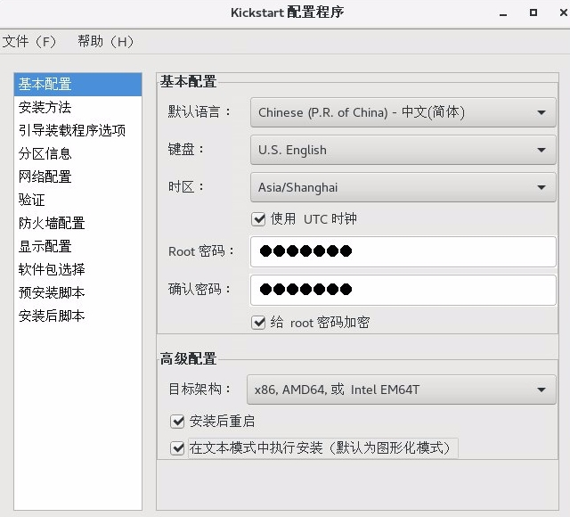

# PXE Kickstart网络引导无人值守部署主机

# 一. 简介

## 1、PXE

PXE(Pre-boot Execution Environment，预启动执行环境)是由Intel公司开发的最新技术，工作于Client/Server的网络模式，支持工作站通过网络从远端服务器下载映像，并由此支持通过网络启动作系统，在启动过程中，终端要求服务器分配IP地址，再用TFTP（trivial file transfer protocol）或MTFTP(multicast trivial file transfer protocol)协议下载一个启动软件包到本机内存中执行，由这个启动软件包完成终端基本软件设置，从而引导预先安装在服务器中的终端操作系统。

严格来说，PXE 并不是一种安装方式，而是一种引导方式。进行 PXE 安装的必要条件是在要安装的计算机中必须包含一个 PXE 支持的网卡（NIC），即网卡中必须要有 PXE Client。PXE 协议可以使算机通过网络启动。此协议分为 Client端和 Server 端，而PXE Client则在网卡的 ROM 中。当计算机引导时，BIOS 把 PXE Client 调入内存中执行，然后由 PXE Client 将放置在远端的文件通过网络下载到本地运行。运行 PXE 协议需要设置 DHCP 服务器和 TFTP 服务器。DHCP 服务器会给 PXE Client（将要安装系统的主机）分配一个 IP 地址，由于是给 PXE Client 分配 IP 地址，所以在配置 DHCP 服务器时需要增加相应的 PXE 设置。此外，在 PXE Client 的 ROM 中，已经存在了 TFTP Client，那么它就可以通过 TFTP 协议到 TFTP Server 上下载所需的文件了。

## 2、PXE工作流程

① PXE Client 从自己的PXE网卡启动，向本网络中的DHCP服务器索取IP

② DHCP 服务器返回分配给客户机的IP 以及PXE文件的放置位置(该文件一般是放在一台TFTP服务器上)

③ PXE Client 向本网络中的TFTP服务器索取pxelinux.0 文件

④ PXE Client 取得pxelinux.0 文件后之执行该文件

⑤ 根据pxelinux.0 的执行结果，通过TFTP服务器加载内核和文件系统

⑥ 进入安装画面, 此时可以通过选择HTTP、FTP、NFS 方式之一进行安装

详细工作流程，请参考下面这幅图：



## 3. Kickstart简介

Kickstart是一种无人值守的安装方式。它的工作原理是在安装过程中记录典型的需要人工干预填写的各种参数，并生成一个名为ks.cfg的文件。如果在安装过程中（不只局限于生成Kickstart安装文件的机器）出现要填写参数的情况，安装程序首先会去查找Kickstart生成的文件，如果找到合适的参数，就采用所找到的参数；如果没有找到合适的参数，便需要安装者手工干预了。所以，如果Kickstart文件涵盖了安装过程中可能出现的所有需要填写的参数，那么安装者完全可以只告诉安装程序从何处取ks.cfg文件，然后就去忙自己的事情。等安装完毕，安装程序会根据ks.cfg中的设置重启系统，并结束安装。

## 4、工作流程



# 二、PXE服务端配置引导CentOS

**PXE主机：**

| 主机名 | IP地址 | OS | 路由器 |
| ----- | ---- | ---- | ------ |
| pk.tools.curiouser.com | 192.168.1.80 | CentOS 7.9.2009 | 192.168.1.1 |

## 1、基础准备

上传ISO文件并挂载，关闭Firewall和SELinux

```bash
OS_distribution=CentOS && \
OS_arch=x86_64 && \
OS_version=7.9.2009 && \
OS_mod=Everything && \
Local_ip=$(ip -4 addr | grep inet | grep -E '192(\.[0-9]{1,3}){3}' | cut -d '/' -f 1 | grep -oE '[0-9]{1,3}(\.[0-9]{1,3}){3}') && \
ISO_filename=$OS_distribution-${OS_version%%.*}-$OS_arch-$OS_mod-${OS_version##*.}.iso && \
yum install -y wget && \
mkdir -p /mnt/{cdrom/$OS_distribution/$OS_version,iso/$OS_distribution} && \
echo "/mnt/iso/$OS_distribution/$ISO_filename /mnt/cdrom/$OS_distribution/$OS_version iso9660 defaults,loop  0 0" >> /etc/fstab && \
mount -a && \
df -mh && \
setenforce 0 && \
sed -i "s/SELINUX=enforcing/SELINUX=disabled/" /etc/selinux/config && \
systemctl stop firewalld && \
systemctl disable firewalld && \
systemctl stop firewalld
```

## 2、配置HTTD服务

安装服务

```bash
yum install -y httpd 
```

配置服务

```bash
OS_distribution=CentOS && \
OS_version=7.9.2009 && \
ln -s /mnt/cdrom/$OS_distribution/$OS_version /var/www/html/$OS_distribution$OS_version
```

启动验证服务，服务端口tcp:80

```bash
systemctl start httpd && \
systemctl enable httpd && \
systemctl status httpd && \
ss -tnl | grep 80
```

## 3、配置DHCP服务

安装服务

```bash
yum install -y dhcp
```

配置服务`/etc/dhcp/dhcpd.conf`

```bash
Local_ip=$(ip -4 addr | grep inet | grep -E '192(\.[0-9]{1,3}){3}' | cut -d '/' -f 1 | grep -oE '[0-9]{1,3}(\.[0-9]{1,3}){3}') && \
bash -c 'cat >/etc/dhcp/dhcpd.conf << EOF
default-lease-time 600;
max-lease-time 7200;
log-facility local7;
subnet 192.168.1.0 netmask 255.255.255.0 {
        option routers                  192.168.1.1;                  # 给 client 的默认网关
        option subnet-mask              255.255.255.0;                # 给 client 的子网掩码
        option domain-name              "curiouser.com";              # 给 client 的搜索域
        option domain-name-servers      192.168.1.1;                  # 给 client 的域名服务器
        range dynamic-bootp             192.168.1.100 192.168.1.120;  # 可供分配的IP范围
        default-lease-time 21600;
        max-lease-time 43200;
        next-server '$Local_ip';                                     # TFTP Server 的IP地址   
        filename "pxelinux.0";                                        # pxelinux启动文件位置;
}
EOF'
```

启动验证服务,服务端口为67

```bash
systemctl start dhcpd  && \
systemctl enable dhcpd && \
systemctl status dhcpd && \
ss -nulp | grep dhcpd
```

## 4、配置TFTP服务

安装服务

```bash
yum install -y tftp-server tftp xinetd net-tools 
```

配置服务`/etc/xinetd.d/tftp`

```bash
bash -c 'cat >/etc/xinetd.d/tftp << EOF
service tftp
{
        socket_type             = dgram
        protocol                = udp
        wait                    = yes
        user                    = root
        server                  = /usr/sbin/in.tftpd
        server_args             = -s /var/lib/tftpboot
        #默认disable是yes的，把它改为no即可
        disable                 = no
        per_source              = 11
        cps                     = 100 2
        flags                   = IPv4
}
EOF'
```

启动验证服务,服务端口为UDP:69

```bash
systemctl start xinetd && \
systemctl enable xinetd && \
systemctl status xinetd && \
ss -unlp | grep 69 && \
netstat -a | grep tftp && \
netstat -tunap | grep :69
```

## 5、准备pxelinux等相关文件

安装服务

```bash
yum install -y syslinux tree
```

拷贝文件

```bash
OS_distribution=CentOS && \
OS_version=7.9.2009 && \
cp /usr/share/syslinux/pxelinux.0  /var/lib/tftpboot/ && \
cp /mnt/cdrom/$OS_distribution/$OS_version/images/pxeboot/vmlinuz /var/lib/tftpboot/vmlinuz-${OS_version%.*} && \
cp /mnt/cdrom/$OS_distribution/$OS_version/images/pxeboot/initrd.img /var/lib/tftpboot/initrd-${OS_version%.*}.img && \
cp /mnt/cdrom/$OS_distribution/$OS_version/isolinux/{vesamenu.c32,boot.msg,splash.png} /var/lib/tftpboot/ && \
cp /usr/share/syslinux/{chain.c32,mboot.c32,menu.c32,memdisk} /var/lib/tftpboot/ && \
mkdir /var/lib/tftpboot/pxelinux.cfg
```

`/var/lib/tftpboot/`目录结构

```bash
tree -phL 2 /var/lib/tftpboot/
├── [-rw-r--r--   84]  boot.msg       # 窗口提示信息文件,提示信息在菜单出现前出现，显示时间较短，可以添加些艺术字之类的信息。
├── [-rw-r--r--  20K]  chain.c32
├── [-rw-r--r--  50M]  initrd-7.5.img # 这是一个初始化文件，一个最小的系统镜像
├── [-rw-r--r--  33K]  mboot.c32
├── [-rw-r--r--  26K]  memdisk
├── [-rw-r--r--  54K]  menu.c32		  # 系统自带的两种图形模块之一，不能自定义背景图片
├── [-rw-r--r--  26K]  pxelinux.0
├── [drwxr-xr-x   21]  pxelinux.cfg   # 启动菜单目录
├── [-rw-r--r--  186]  splash.png     # 背景图片
├── [-rw-r--r-- 149K]  vesamenu.c32   # 系统自带的两种图形模块之一
└── [-rwxr-xr-x 5.9M]  vmlinuz-7.5    # CentOS 7.5.1804的内核文件
```

创建`/var/lib/tftpboot/pxelinux.cfg/default` （default文件参数详见：[PXE引导配置文件参数详解](pxe-引导配置文件参数详解.md)）

```bash
OS_distribution=CentOS && \
OS_version=7.9.2009 && \
OS_arch=x86_64 && \
bash -c 'cat >/var/lib/tftpboot/pxelinux.cfg/default << EOF
DEFAULT vesamenu.c32
prompt 0
timeout 60
display boot.msg
menu background splash.jpg
menu title #### Curiouser PXE Boot Menus ####

label '$OS_distribution${OS_version}'
  menu label ^1> Install '$OS_distribution' '${OS_version}' '$OS_arch'
  menu default
  kernel vmlinuz-'${OS_version%.*}'
  append initrd=initrd-'${OS_version%.*}'.img text ks=http://'$Local_ip'/'$OS_distribution''${OS_version}'.cfg
EOF'
```

## 6、准备安装过程使用到的文件

①内核升级文件

```bash
mkdir -p /var/www/html/tools && \
yum install -y yum-plugin-downloadonly && \
rpm --import https://www.elrepo.org/RPM-GPG-KEY-elrepo.org && \
rpm -Uvh http://www.elrepo.org/elrepo-release-7.0-3.el7.elrepo.noarch.rpm && \
yum makecache && \
yum --enablerepo=elrepo-kernel install --downloadonly --downloaddir=/var/www/html/tools kernel-ml
```

②安装oh-my-zsh的脚本

```bash
wget https://raw.githubusercontent.com/ohmyzsh/ohmyzsh/master/tools/install.sh -P /var/www/html/tools
chmod +x /var/www/html/tools/install.sh
```

## 7、创建KS文件

 ```bash
 OS_distribution=CentOS && \
 OS_version=7.9.2009 && \
 touch /var/www/html/${OS_distribution}${OS_version}.cfg
 ```

- 方式一：手动编写(KS文件具体参数详情见笔记：[Kickstart文件参数详解](pxe-kickstart文件参数详解.md))

- 方式二：使用system-config-kickstart图形化界面配置

  - 安装：system-config-kickstart

    ```bash
    yum install -y system-config-kickstart
    ```

    

    

## 8、验证KS文件的语法正确性

```bash
yum install -y pykickstart
ksvalidator  /var/www/html/CentOS7.5.1804.cfg
```

## 9、样板KS文件

[pxe-kickstart-CentOS7.cfg](../assets/pxe-kickstart-CentOS7.cfg)

```bash
install
text
lang en_US.UTF-8
keyboard us
auth  --useshadow  --passalgo=sha512
url --url="http://192.168.1.102/CentOS7.9.2009"
rootpw --iscrypted $1$6/87AF3n$eczKeiNRBv7H.GXnur1Ld/
selinux --disabled
firewall --disabled
network  --bootproto=dhcp --device=ens192 --ipv6=auto --activate
network  --hostname=test
reboot
timezone Asia/Shanghai --isUtc --nontp
bootloader --location=mbr --boot-drive=sda
clearpart --all --drives=sda
services --enabled=NetworkManager,sshd
firstboot --enable
ignoredisk --only-use=sda
#(可选)autopart --type=lvm --fstype=xfs
part /boot --fstype="xfs" --ondisk=sda --size=200
part / --fstype="xfs" --ondisk=sda --size=30720
part /opt --fstype="xfs" --ondisk=sda --size=10240
part /var --fstype="xfs" --grow --ondisk=sda --size=1
%packages
@^minimal
@core
wget
curl
zsh
tree
git
vim
nc
unzip
net-tools
bind-utils
%end

%post --interpreter=/bin/bash --log=/tmp/post-install.log --erroronfail

echo "====prepare to optimize system parameter===="  >> /tmp/post-install.log
sysctl -w fs.inotify.max_user_watches=81920
echo "fs.inotify.max_user_watches=81920" >> /etc/sysctl.conf

echo "====prepare to replace yum mirror to ustc====" >> /tmp/post-install.log
mkdir /etc/yum.repos.d/bak
mv /etc/yum.repos.d/C* /etc/yum.repos.d/bak
cat >> /etc/yum.repos.d/ustc.repo << EOF
[base]
name=CentOS-\$releasever - Base
#mirrorlist=http://mirrorlist.centos.org/?release=\$releasever&arch=\$basearch&repo=os
baseurl=https://mirrors.ustc.edu.cn/centos/\$releasever/os/\$basearch/
gpgcheck=1
gpgkey=file:///etc/pki/rpm-gpg/RPM-GPG-KEY-CentOS-7
#released updates
[updates]
name=CentOS-\$releasever - Updates
# mirrorlist=http://mirrorlist.centos.org/?release=\$releasever&arch=\$basearch&repo=updates
baseurl=https://mirrors.ustc.edu.cn/centos/\$releasever/updates/\$basearch/
gpgcheck=1
gpgkey=file:///etc/pki/rpm-gpg/RPM-GPG-KEY-CentOS-7
#additional packages that may be useful
[extras]
name=CentOS-\$releasever - Extras
# mirrorlist=http://mirrorlist.centos.org/?release=\$releasever&arch=\$basearch&repo=extras
baseurl=https://mirrors.ustc.edu.cn/centos/\$releasever/extras/\$basearch/
gpgcheck=1
gpgkey=file:///etc/pki/rpm-gpg/RPM-GPG-KEY-CentOS-7
#additional packages that extend functionality of existing packages
[centosplus]
name=CentOS-\$releasever - Plus
# mirrorlist=http://mirrorlist.centos.org/?release=\$releasever&arch=\$basearch&repo=centosplus
baseurl=https://mirrors.ustc.edu.cn/centos/\$releasever/centosplus/\$basearch/
gpgcheck=1
enabled=0
gpgkey=file:///etc/pki/rpm-gpg/RPM-GPG-KEY-CentOS-7
EOF
yum clean all > /dev/null
yum makecache > /dev/null
yum install -y epel-release > /dev/null
yum install -y jq > /dev/null

echo "====prepare to update kernel====" >> /tmp/post-install.log
rpm --import https://www.elrepo.org/RPM-GPG-KEY-elrepo.org && rpm -Uvh http://www.elrepo.org/elrepo-release-7.0-3.el7.elrepo.noarch.rpm &&  rpm -Uvh http://192.168.1.102/kernel-ml-5.17.6-1.el7.elrepo.x86_64.rpm && upgrage_kernel=`awk -F \' '$1=="menuentry " {print $2}' /etc/grub2.cfg | head -n 1` && grub2-set-default 0

echo "====prepare to install zsh and oh-my-zsh====" >> /tmp/post-install.log
chsh -s /bin/zsh root > /dev/null
git config --global http.proxy http://192.168.1.102:1088
git config --global https.proxy http://192.168.1.102:1088
sh -c "$(wget --timeout=1 --tries=5 --retry-connrefused -O- http://192.168.1.102/install.sh) --skip-chsh"
git clone https://github.com/zsh-users/zsh-autosuggestions ${ZSH_CUSTOM-~/.oh-my-zsh/custom}/plugins/zsh-autosuggestions
git clone https://github.com/zsh-users/zsh-syntax-highlighting.git ${ZSH_CUSTOM:-~/.oh-my-zsh/custom}/plugins/zsh-syntax-highlighting
cat >> /root/.zshrc << EOF
export ZSH="/root/.oh-my-zsh"
ZSH_THEME="ys"
CASE_SENSITIVE="true"
ENABLE_CORRECTION="false"
HISTSIZE=100000000
SAVEHIST=100000000
# HYPHEN_INSENSITIVE="true"
# DISABLE_AUTO_UPDATE="true"
# DISABLE_UPDATE_PROMPT="true"
# export UPDATE_ZSH_DAYS=13
# DISABLE_MAGIC_FUNCTIONS=true
# DISABLE_LS_COLORS="true"
# DISABLE_AUTO_TITLE="true"
# COMPLETION_WAITING_DOTS="true"
# DISABLE_UNTRACKED_FILES_DIRTY="true"
# HIST_STAMPS="mm/dd/yyyy"
# ZSH_CUSTOM=/path/to/new-custom-folder
plugins=(
  git
  zsh-syntax-highlighting
  zsh-autosuggestions
  docker
  docker-compose
  sudo
  extract
  wd
  history
)
source /etc/profile
source \$ZSH/oh-my-zsh.sh
alias szr='source ~/.zshrc'
EOF

echo "====prepare to add ip and hostname to /etc/hosts===="
ipaddr=$(ip addr | awk '/^[0-9]+: / {}; /inet.*global/ {print gensub(/(.*)\/(.*)/, "\\1", "g", $2)}'| sed -n '1p')
echo $ipaddr $HOSTNAME >> /etc/hosts

echo "    #######################" >> /etc/motd
echo "    # Keep Your Curiosity #" >> /etc/motd
echo "    #######################" >> /etc/motd
%end
```

# 四、自动安装配置脚本

**前提**：`CentOS-7-x86_64-Everything-1804.iso`已经放置在`/mnt/iso`文件夹下

```bash
mkdir /mnt/cdrom && \
echo "/mnt/iso/CentOS-7-x86_64-Everything-1804.iso /mnt/cdrom iso9660 defaults,loop  0 0" >> /etc/fstab && \
mount -a && \
df -mh && \
setenforce 0 && \
sed -i "s/SELINUX=enforcing/SELINUX=disabled/" /etc/selinux/config && \
systemctl stop firewalld && \
systemctl disable firewalld && \
systemctl stop firewalld && \
yum install -y httpd dhcp tftp-server tftp xinetd net-tools syslinux tree && \
ln -s /mnt/cdrom/ /var/www/html/CentOS7 && \
systemctl start httpd && \
systemctl enable httpd && \
systemctl status httpd && \
ss -tnl | grep 80 && \
bash -c 'cat >> /etc/dhcp/dhcpd.conf << EOF
default-lease-time 600;
max-lease-time 7200;
log-facility local7;
subnet 192.168.1.0 netmask 255.255.255.0 {
        option routers                  192.168.1.1;
        option subnet-mask              255.255.255.0;
        option domain-name-servers      192.168.1.1;
        option time-offset              -18000; # Eastern Standard Time
        range dynamic-bootp 192.168.1.100 192.168.1.120;
        default-lease-time 21600;
        max-lease-time 43200;
        next-server 192.168.1.80;     ##TFTP Server 的IP地址   
        filename "pxelinux.0";           #pxelinux启动文件位置;
}
EOF' && \
systemctl start dhcpd  && \
systemctl enable dhcpd && \
systemctl status dhcpd && \
ss -nulp | grep dhcpd && \
rm -rf /etc/xinetd.d/tftp && \
bash -c 'cat >/etc/xinetd.d/tftp << EOF
{
        socket_type             = dgram
        protocol                = udp
        wait                    = yes
        user                    = root
        server                  = /usr/sbin/in.tftpd
        server_args             = -s /var/lib/tftpboot
        #默认disable是yes的，把它改为no即可
        disable                 = no
        per_source              = 11
        cps                     = 100 2
        flags                   = IPv4
}
EOF' && \
systemctl start xinetd && \
systemctl enable xinetd && \
systemctl status xinetd && \
netstat -a | grep tftp && \
netstat -tunap | grep :69 && \
cp /usr/share/syslinux/pxelinux.0  /var/lib/tftpboot/ && \
cp /mnt/cdrom/images/pxeboot/{vmlinuz,initrd.img} /var/lib/tftpboot/ && \
cp /mnt/cdrom/isolinux/{vesamenu.c32,boot.msg,splash.png} /var/lib/tftpboot/ && \
cp /usr/share/syslinux/{chain.c32,mboot.c32,menu.c32,memdisk} /var/lib/tftpboot/ && \
mkdir /var/lib/tftpboot/pxelinux.cfg && \
tree -phL 2 /var/lib/tftpboot/ && \
bash -c 'cat >/var/lib/tftpboot/pxelinux.cfg/default << EOF
prompt 0
timeout 60
display boot.msg
default linux
label linux
kernel vmlinuz
append initrd=initrd.img text ks=http://192.168.1.80/CentOS7.cfg
EOF'

#然后上传kick start配置文件到/var/www/html/目录下
```

# 五、测试安装

自动化安装过程中还可以进入一个临时Shell，而postinstall相关命令脚本路径在`/mnt/sysimage/tmp`路径下

# 参考

1. https://blog.csdn.net/yanghua1012/article/details/80426659
2. https://access.redhat.com/documentation/zh-cn/red_hat_enterprise_linux/6/html/installation_guide/ch-boot-x86#sn-boot-menu-x86
3. http://www.178linux.com/99307
4. https://blog.51cto.com/lzhnb/2117618
5. https://marclop.svbtle.com/creating-an-automated-centos-7-install-via-kickstart-file
6. https://docs.centos.org/en-US/centos/install-guide/Kickstart2/#sect-kickstart-file-create
7. https://www.cnblogs.com/cloudos/p/8143929.html
8. http://bbs.51cto.com/thread-621450-1.html
9. https://wiki.centos.org/zh/HowTos/PXE/PXE_Setup/Menus