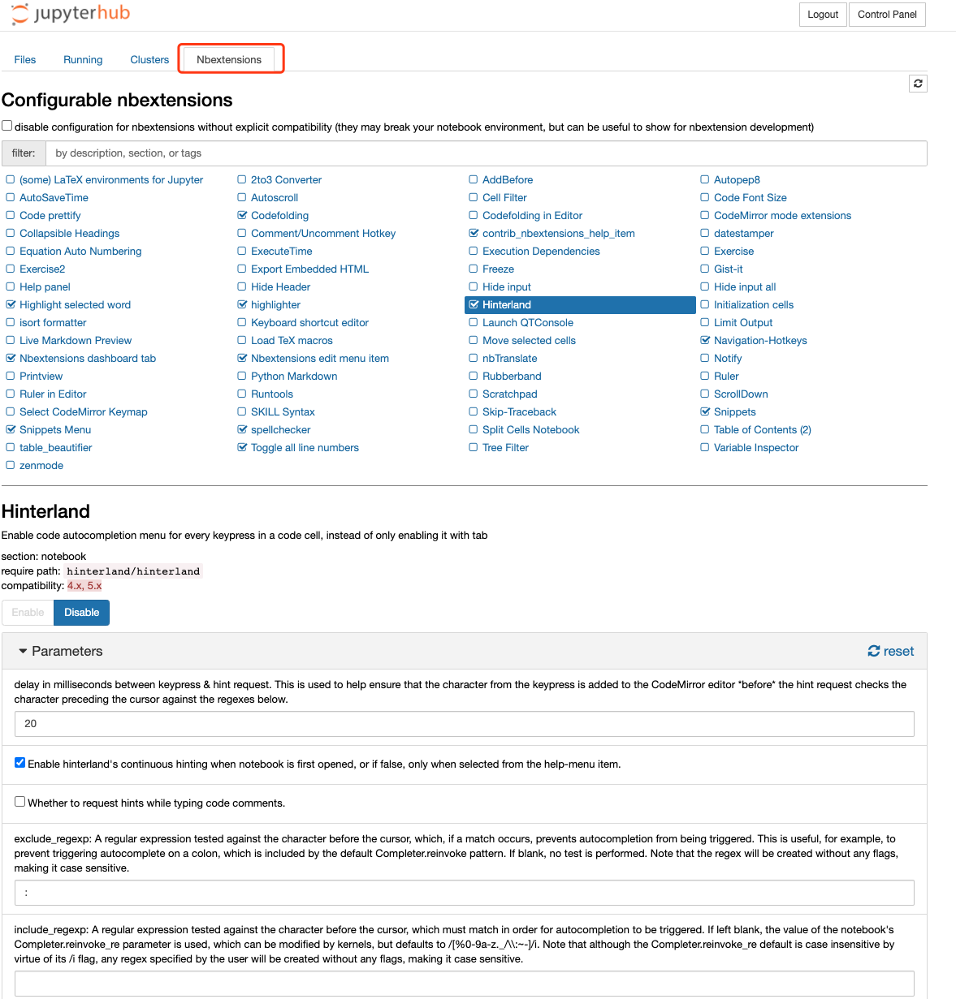

# Python/R语言多用户工作台JupyterHub/RStuido

# 一、简介

Jupyter是一款基于python的web notebook服务，目前有大多python数据挖掘与机器学习爱好者使用这款服务，其特性其实与Ipytohn Notebook差不多，准确说Ipython Notebook是一款提供增强型交互的功能的shell，而Jupyter除了Ipython的功能，还加入了普通编辑器的通用功能，是一款带代码交互的动态文档web编辑器

# 二、安装及命令详解

## 1、各种方式安装

### 二进制安装

以Ubuntu为例

```bash
apt-get install npm python3-pip
npm config set registry https://registry.npm.taobao.org --global
mkdir ~/.pip
echo -e "[global]\nindex-url = https://mirrors.aliyun.com/pypi/simple/\n[install]\ntrusted-host=mirrors.aliyun.com\n" > ~/.pip/pip.conf
python3 -m pip install jupyterhub notebook
npm install -g configurable-http-proxy
```

生成默认配置文件

```bash
jupyterhub --generate-config
```

修改配置文件`~/jupyterhub_config.py`并启动jupyterhub

```	bash
nohup jupyterhub -f ~/jupyterhub_config.py 2>&1 >> /var/log/jupyterhub.log &
echo $! > /var/log/jupyterhub.pid

# 或者
nohup jupyterhub  -f ~/jupyterhub_config.py 2>&1 >> /var/log/jupyterhub.log &!
echo $! > /var/log/jupyterhub.pid
```

### docker安装

### kubernetes安装

```bash
helm repo add jupyterhub https://jupyterhub.github.io/helm-chart/ && \
helm repo update

RELEASE=jhub
NAMESPACE=jhub
helm upgrade --cleanup-on-fail \
  --install $RELEASE jupyterhub/jupyterhub \
  --namespace $NAMESPACE \
  --create-namespace \
  --version=0.9.0 \
  --values config.yaml
```


## 2、jupyterhub 命令详解

### 命令格式

```bash
jupyterhub cmd [args]
```

### 全局命令参数

```bash
--debug
    set log level to logging.DEBUG (maximize logging output)
--generate-config
    generate default config file
--generate-certs
    generate certificates used for internal ssl
--no-db
    disable persisting state database to disk
--upgrade-db
    Automatically upgrade the database if needed on startup.

    Only safe if the database has been backed up.
    Only SQLite database files will be backed up automatically.
--no-ssl
    [DEPRECATED in 0.7: does nothing]
--base-url=<URLPrefix> (JupyterHub.base_url)
    Default: '/'
    The base URL of the entire application.
    Add this to the beginning of all JupyterHub URLs. Use base_url to run
    JupyterHub within an existing website.
    .. deprecated: 0.9
        Use JupyterHub.bind_url
-y <Bool> (JupyterHub.answer_yes)
    Default: False
    Answer yes to any questions (e.g. confirm overwrite)
--ssl-key=<Unicode> (JupyterHub.ssl_key)
    Default: ''
    Path to SSL key file for the public facing interface of the proxy
    When setting this, you should also set ssl_cert
--ssl-cert=<Unicode> (JupyterHub.ssl_cert)
    Default: ''
    Path to SSL certificate file for the public facing interface of the proxy
    When setting this, you should also set ssl_key
--url=<Unicode> (JupyterHub.bind_url)
    Default: 'http://:8000'
    The public facing URL of the whole JupyterHub application.
    This is the address on which the proxy will bind. Sets protocol, ip,
    base_url
--ip=<Unicode> (JupyterHub.ip)
    Default: ''
    The public facing ip of the whole JupyterHub application (specifically
    referred to as the proxy).
    This is the address on which the proxy will listen. The default is to listen
    on all interfaces. This is the only address through which JupyterHub should
    be accessed by users.
    .. deprecated: 0.9
        Use JupyterHub.bind_url
--port=<Int> (JupyterHub.port)
    Default: 8000
    The public facing port of the proxy.
    This is the port on which the proxy will listen. This is the only port
    through which JupyterHub should be accessed by users.
    .. deprecated: 0.9
        Use JupyterHub.bind_url
--pid-file=<Unicode> (JupyterHub.pid_file)
    Default: ''
    File to write PID Useful for daemonizing JupyterHub.
--log-file=<Unicode> (JupyterHub.extra_log_file)
    Default: ''
    DEPRECATED: use output redirection instead, e.g.
    jupyterhub &>> /var/log/jupyterhub.log
--log-level=<Enum> (Application.log_level)
    Default: 30
    Choices: (0, 10, 20, 30, 40, 50, 'DEBUG', 'INFO', 'WARN', 'ERROR', 'CRITICAL')
    Set the log level by value or name.
-f <Unicode> (JupyterHub.config_file)
    Default: 'jupyterhub_config.py'
    The config file to load
--config=<Unicode> (JupyterHub.config_file)
    Default: 'jupyterhub_config.py'
    The config file to load
--db=<Unicode> (JupyterHub.db_url)
    Default: 'sqlite:///jupyterhub.sqlite'
    url for the database. e.g. `sqlite:///jupyterhub.sqlite`
```

### 子命令

#### token：生成用户API token

命令格式

```bash
jupyterhub token [username]
```

命令参数

```bash
--log-level=<Enum> (Application.log_level)
    Default: 30
    Choices: (0, 10, 20, 30, 40, 50, 'DEBUG', 'INFO', 'WARN', 'ERROR', 'CRITICAL')
    Set the log level by value or name.
-f <Unicode> (JupyterHub.config_file)
    Default: 'jupyterhub_config.py'
    The config file to load
--config=<Unicode> (JupyterHub.config_file)
    Default: 'jupyterhub_config.py'
    The config file to load
--db=<Unicode> (JupyterHub.db_url)
    Default: 'sqlite:///jupyterhub.sqlite'
    url for the database. e.g. `sqlite:///jupyterhub.sqlite`
 
# 示例
$> jupyterhub token kaylee
ab01cd23ef45
```
## 3、其他命令

### Jupyter kernel的管理

```bash
jupyter-kernelspec  list
jupyter-kernelspec install
jupyter-kernelspec uninstall
jupyter-kernelspec remove
```

# 三、Jupyter功能扩展

## 1、使用LDAP进行用户认证

Github：https://github.com/jupyterhub/ldapauthenticator

```bash
pip3 install jupyterhub-ldapauthenticator
```


```bash
c.JupyterHub.authenticator_class = 'ldapauthenticator.LDAPAuthenticator'
#c.LDAPAuthenticator.server_address = '192.168.1.7'
c.LDAPAuthenticator.server_hosts = ['ldap://192.168.1.7:389']
c.LDAPAuthenticator.bind_user_dn = 'uid=root,cn=users,dc=ldap,dc=synology,dc=curiouser,dc=com'
c.LDAPAuthenticator.bind_user_password = 'jL6u49t5A9P5'
c.LDAPAuthenticator.user_search_base = 'cn=users,dc=ldap,dc=synology,dc=curiouser,dc=com'
c.LDAPAuthenticator.user_search_filte = '(&(memberOf=cn=jupyterhub,cn=groups,dc=ldap,dc=synology,dc=curiouser,dc=com)(cn={0}))'
c.LDAPAuthenticator.user_attribute = 'cn'
c.LDAPAuthenticator.create_user_home_dir = True
c.LDAPAuthenticator.create_user_home_dir_cmd = ['mkhomedir_helper']


c.LDAPAuthenticator.lookup_dn = True
c.LDAPAuthenticator.lookup_dn_search_filter = '({login_attr}={login})'
c.LDAPAuthenticator.lookup_dn_search_user = 'ldap_search_user_technical_account'
c.LDAPAuthenticator.lookup_dn_search_password = 'secret'
c.LDAPAuthenticator.user_search_base = 'ou=people,dc=wikimedia,dc=org'
c.LDAPAuthenticator.user_attribute = 'sAMAccountName'
c.LDAPAuthenticator.lookup_dn_user_dn_attribute = 'cn'
c.LDAPAuthenticator.escape_userdn = False
c.LDAPAuthenticator.bind_dn_template = '{username}'
```

## 2、添加扩展插件管理器

```bash
pip3 install jupyter_contrib_nbextensions
# 安装完之后需要配置 nbextension，注意配置的时候要确保已关闭Jupyter Notebook
jupyter contrib nbextension install --skip-running-check
# 命令执行完后，会生成配置文件/usr/local/etc/jupyter/jupyter_nbconvert_config.json
```

重新启动 Jupyterhub后，上面选项栏会出现 Nbextensions 的选项。




## 3、支持R语言kernel

安装R语言

```bash
apt-get install r-base r-base-core r-base-dev
pip3 install jupyterlab
```

R安装基础工具

```R
R > install.packages(c('pbdZMQ', 'repr', 'devtools', 'IRkernel'))
R > IRkernel::installspec(user = FALSE)
# 安装完成后会在目录/root/.local/share/jupyter/kernels/ir生成一份配置信息

jupyter labextension install @techrah/text-shortcuts
# 刷新页面就可以看到R的kernel了！
```

参考：https://irkernel.github.io/installation/

# 四、R语言

## 1、安装

以`Ubuntu 18.04 bionic`安装R `4.x.x`版本 为例（包管理器默认仓库的R版本大多是3.x.x）

```bash
echo "deb https://mirrors.tuna.tsinghua.edu.cn/CRAN/bin/linux/ubuntu bionic-cran40/">> /etc/apt/sources.list.d/r-tuna.list
apt-key adv --keyserver keyserver.ubuntu.com --recv-keys E298A3A825C0D65DFD57CBB651716619E084DAB9
apt-get update
apt-get install r-base-dev
```

## 2、包的管理

### 包的安装

从镜像源仓库安装

```R
# 在R CLI中
install.packages("rjson",repos="https://mirrors.ustc.edu.cn/CRAN") 
install.packages("ape")
# 在linux命令行
su - -c "R -e \"install.packages('shiny', repos='https://cran.rstudio.com/')\""
```

从包文件安装

```bash
# 在R CLI中
install.packages("/root/mgcv_1.8-29.tar.gz", repos = NULL,type="source")
	# 或者
packageurl <- "https://cran.rstudio.com/bin/macosx/contrib/4.0/mgcv_1.8-23.tgz"
install.packages(packageurl, repos=NULL, type="source")
# 在linux命令行
R CMD INSTALL package.tar.gz
```

### 包的查看

```R
installed.packages()
```

### 包的删除

```R
remove. packages(c("pkg1","pkg2") , lib = file .path("path", "to", "library"))

# shili
remove.packages("mgcv", lib="/usr/lib/R/library")
```

### 包的清除

```R
detach("package:rjson")
```

### 包的加载

```R
library(rjson)
require(rjson)---便于写脚本特性
```

## 3、升级R 3.x.x到4.x.x

### Windows下

```R
# 安装包，如果已经有此包可跳过此步骤
install.packages("installr")
 
# 加载包，升级
library(installr)
updateR()
```

### Ubuntu下

参考：https://cloud.r-project.org/bin/linux/ubuntu/#get-5000-cran-packages

```bash
apt update -qq
apt install --no-install-recommends software-properties-common dirmngr
apt-key adv --keyserver keyserver.ubuntu.com --recv-keys E298A3A825C0D65DFD57CBB651716619E084DAB9

# 添加CRAN的R 4.0仓库
add-apt-repository "deb https://cloud.r-project.org/bin/linux/ubuntu $(lsb_release -cs)-cran40/"
apt-get install r-base-dev
```

# 五、RStudio Server

## 1、简介

RStudio分为桌面版、Web服务端版。这种两种类型都有开源和商业版本

官方文档：https://docs.rstudio.com/ide/server-pro/1.2.1293-1/index.html

## 2、安装

### ①YUM（ RedHat / CentOS 6+）

参考：https://cran.rstudio.com/bin/linux/redhat/

```bash
yum install -y epel-release
yum install <rstudio-server-package.rpm>
# 或者
gpg --keyserver keys.gnupg.net --recv-keys 3F32EE77E331692F
gpg --armor --export 3F32EE77E331692F > rstudio-code-signing.key
rpm --import rstudio-code-signing.key
rpm -K <rstudio-server-package.rpm>
```

### ②APT（ Debian 8+ / Ubuntu 12.04+）

文档：https://cran.rstudio.com/bin/linux/ubuntu/

```bash
apt-get install r-base

# 或者
gpg --keyserver keys.gnupg.net --recv-keys 3F32EE77E331692F
dpkg-sig --verify <rstudio-server-package.deb>
```

