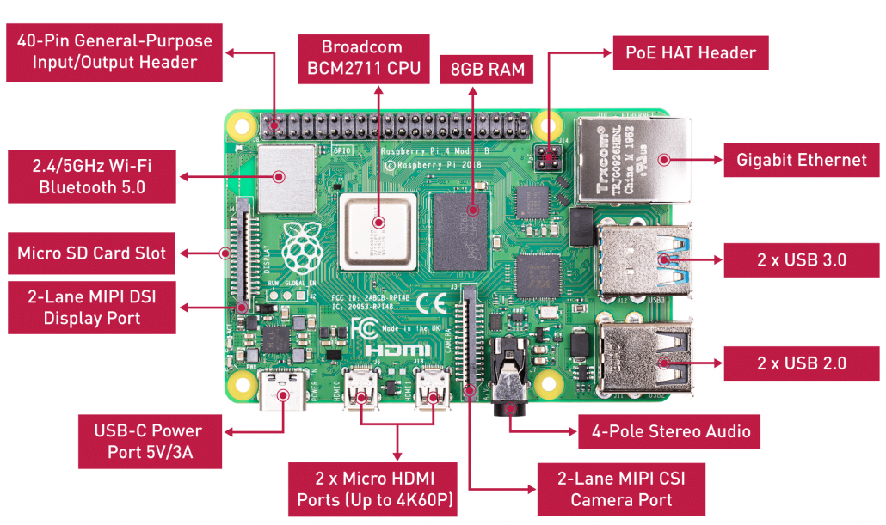

# 树莓派Raspberry Pi 4

# 一、简介

## 硬件配置




## GPIO引脚定义


在实际使用中，我们应该熟悉树莓派接口的两种命名方案:

- **WiringPi 编号**：功接线的引脚号（如TXD、PWM0等等）
- **BCM编号**：是 Broadcom 针脚号，也即是通常称的GPIO
- **物理编号**（Physical – Number）：PCB板上针脚的物理位置对应的编号（1~40）

### I2C接口

I2C是由Philips公司开发的一种简单、双向二线制同步串行总线。它只需要两根线即可在连接于总线上的器件之间传送信息。树莓派通过I2C接口可控制多个传感器和组件。它们的通信是通过SDA(数据引脚)和SCL(时钟速度引脚)来完成的。每个从设备都有一个唯一的地址，允许与许多设备间快速通信。ID_EEPROM引脚也是I2C协议，它用于与HATs通信。

### SPI接口

SPI是串行外设接口，用于控制具有主从关系的组件，采用从进主出和主进从出的方式工作，树莓派上SPI由SCLK、MOSI、MISO接口组成，SCLK用于控制数据速度，MOSI将数据从树莓派发送到所连接的设备，而MISO则相反。

### UART接口

有使用Arduino的朋友一定听说过UART或Serial，通用异步收/发器接口用于将Arduino连接到为其编程的计算机上，也用于其他设备与 RX 和 TX 引脚之间的通信。如果树莓派在 raspi-config 中启用了串口终端，则可以使用这些引脚通过电脑来控制树莓派，也可以直接用于控制Arduino。

### PWM接口

在树莓派上，所有的引脚都可以实现软件PWM，而GPIO12、GPIO13、GPIO18、GPIO19可以实现硬件脉宽调制。

## 各型号配置对比


部分电子元件电路图：https://www.dazhuanlan.com/2019/12/26/5e043f4a96380/

# 二、基础配置

## 1、安装系统

树莓派官方出了一个快速在树莓派上安装OS的软件**NOOBS（ New Out Of Box Software）**，只需要将该软件刻录到SD卡上并在树莓派上启动，可在线或离线安装以下OS到您的树莓派上。

- **官方OS**：[Raspbian](http://raspbian.org/)

- **第三方OS**

  

**NOOBS下载地址**：https://www.raspberrypi.org/downloads/noobs/

**NOOBS刻录操作文档**：https://www.raspberrypi.org/documentation/installation/noobs.md

**NOOBS分为两个版本**：全功能版和轻量版Lite。全功能班可在线可离线安装OS。Lite只能在线安装OS

## 2、连接操作

- **直接通过HDMI外界显示进行操作**

- **通过SSH连接进行CLI操作**

- **通过VNC连接远程桌面进行操作**

  - 树莓派开启VNC服务，然后重启

    

  - chrome安装VNC Viewer插件进行连接，插件地址：https://www.realvnc.com/en/connect/download/viewer/chrome/


## 3、基础配置

### ①连接隐藏wifi

- 编辑`/etc/wpa_supplicant/wpa_supplicant.conf `

  ```bash
  network={ 
    ssid=”wifi_name” 
    scan_ssid=1 
    psk=”wifi_password” 
  }
  # network：是一个连接WiFi网络的配置，可以有多个，wpa_supplicant会按照priority指定的优先级（数字越大越先连接）来连接，当然，在这个列表里面隐藏WiFi不受priority的影响，隐藏WiFi总是在可见WiFi不能连接时才开始连接。
  # ssid:网络的ssid
  # psk:密码
  # priority:连接优先级，越大越优先
  # scan_ssid:连接隐藏WiFi时需要指定该值为1
  ```

### ②CLI下配置Respbian

```bash
sudo raspi-config
```


### ③设置chromium浏览器代理

```bash
sudo echo -e 'export http_proxy="http://代理服务器地址:端口"\nexport https_proxy="https://代理服务器地址:端口"\nexport no_proxy="*.taobao.com,192.168.1.0/16"' >> /etc/environment
```

然后重启，打开chromium浏览器，安装`Proxy SwitchyOmega`插件。在`Proxy SwitchyOmega`插件中配置代理服务器。然后删除`/etc/environment`中新增的代理配置，重启。

### ④设置apt镜像源为阿里云镜像源

raspbian

```bash
mv /etc/apt/sources.list /etc/apt/sources.list.bak
echo -e "deb https://mirrors.aliyun.com/raspbian/raspbian/ buster main non-free contrib\ndeb-src https://mirrors.aliyun.com/raspbian/raspbian/ buster main non-free contrib" > /etc/apt/sources.list
apt update
```

Ubuntu 20.04

```bash
mv /etc/apt/sources.list /etc/apt/sources.list.bak
echo "deb https://mirrors.aliyun.com/ubuntu-ports focal main restricted" >> /etc/apt/sources.list
echo "deb https://mirrors.aliyun.com/ubuntu-ports focal-updates main restricted"  >>  /etc/apt/sources.list
echo "deb https://mirrors.aliyun.com/ubuntu-ports focal universe" >> /etc/apt/sources.list
echo "deb https://mirrors.aliyun.com/ubuntu-ports focal-updates universe" >> /etc/apt/sources.list
echo "deb https://mirrors.aliyun.com/ubuntu-ports focal multiverse" >> /etc/apt/sources.list
echo "deb https://mirrors.aliyun.com/ubuntu-ports focal-updates multiverse" >> /etc/apt/sources.list
echo "deb https://mirrors.aliyun.com/ubuntu-ports focal-backports main restricted universe multiverse" >> /etc/apt/sources.list
echo "deb https://mirrors.aliyun.com/ubuntu-ports focal-security main restricted" >> /etc/apt/sources.list
echo "deb https://mirrors.aliyun.com/ubuntu-ports focal-security universe" >> /etc/apt/sources.list
echo "deb https://mirrors.aliyun.com/ubuntu-ports focal-security multiverse" >> /etc/apt/sources.list
apt update
```

## 4、播放音频

```bash
apt install mpg123
mpg123 音频文件
mpg123 音频文件 </dev/null &
# 或者
apt-get install sox libsox-fmt-all
play 音频文件

# 或者
apt-get install cmus
cmus
```

## 5、调节音频输出音量大小

```bash
apt install alsa-utils
alsamixer # 指令会出现一个调节音量的界面。调节完成后按“ESC”退出
amixer set PCM 116%
```


# 三、安装特殊软件

## 1、安装RStudio Server

```bash
apt-get install -y git r-recommended python-dev
cd /home/pi/Downloads/
git clone https://github.com/rstudio/rstudio.git
cd /home/pi/Downloads/rstudio/dependencies/common/
./install-common
cd /home/pi/Downloads/rstudio/dependencies/linux/
./install-dependencies-debian

#saw java 6 was not installed. installed v7
apt-get install -y openjdk-7-jdk

#tried to make install, got an error about dictionaries not installed and rerun install-dependencies
cd /home/pi/Downloads/rstudio/dependencies/common/
./install-common

#tried to make install, hangs at "ext:" so I tried manually installing pandoc, which should have been installed earlier, but apparently was not
apt-get install -y pandoc

#tried to make install, hangs at "ext:" so I tried installing the latest GWT compiler
cd /home/pi/Downloads
wget http://dl.google.com/closure-compiler/compiler-latest.zip
unzip compiler-latest.zip
rm COPYING README.md compiler-latest.zip
mv closure-compiler-v20170218.jar /home/pi/Downloads/rstudio/src/gwt/tools/compiler/compiler.jar

#build and install works!
cd /home/pi/Downloads/rstudio/
#remove build if exists
rm -r ./build
mkdir build
cd build
cmake .. -DRSTUDIO_TARGET=Server -DCMAKE_BUILD_TYPE=Release
make install
```