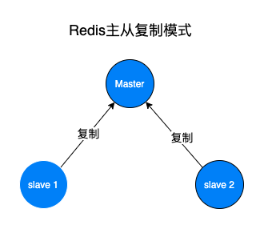
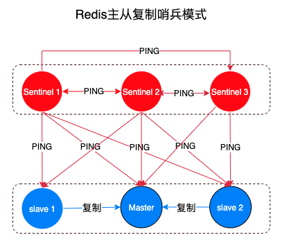

# Redis基础概念

# 一、简介

Redis 是一个开源（BSD许可）的，内存中的数据结构存储系统，它可以用作数据库、缓存和消息中间件。 它支持多种类型的数据结构，如 [字符串（strings）](http://www.redis.cn/topics/data-types-intro.html#strings)， [散列（hashes）](http://www.redis.cn/topics/data-types-intro.html#hashes)， [列表（lists）](http://www.redis.cn/topics/data-types-intro.html#lists)， [集合（sets）](http://www.redis.cn/topics/data-types-intro.html#sets)， [有序集合（sorted sets）](http://www.redis.cn/topics/data-types-intro.html#sorted-sets) 与范围查询， [bitmaps](http://www.redis.cn/topics/data-types-intro.html#bitmaps)， [hyperloglogs](http://www.redis.cn/topics/data-types-intro.html#hyperloglogs) 和 [地理空间（geospatial）](http://www.redis.cn/commands/geoadd.html) 索引半径查询。 Redis 内置了 [复制（replication）](http://www.redis.cn/topics/replication.html)，[LUA脚本（Lua scripting）](http://www.redis.cn/commands/eval.html)， [LRU驱动事件（LRU eviction）](http://www.redis.cn/topics/lru-cache.html)，[事务（transactions）](http://www.redis.cn/topics/transactions.html) 和不同级别的 [磁盘持久化（persistence）](http://www.redis.cn/topics/persistence.html)， 并通过 [Redis哨兵（Sentinel）](http://www.redis.cn/topics/sentinel.html)和自动 [分区（Cluster）](http://www.redis.cn/topics/cluster-tutorial.html)提供高可用性（high availability）。

Redis是一个使用ANSI C编写的开源、包含多种数据结构、支持网络、基于内存、可选持久性的键值对存储数据库，其具备如下特性：

- 基于内存运行，性能高效
- 支持分布式，理论上可以无限扩展
- key-value存储系统
- 开源的使用ANSI C语言编写、遵守BSD协议、支持网络、可基于内存亦可持久化的日志型、Key-Value数据库，并提供多种语言的API

相比于其他数据库类型，Redis具备的特点是：

- C/S通讯模型
- 单进程单线程模型
- 丰富的数据类型
- 操作具有原子性
- 持久化
- 高并发读写
- 支持lua脚本

官网：https://redis.io/

中文官网：http://www.redis.cn/

教程：https://www.runoob.com/redis/redis-intro.html

# 二、基础概念

## 1、数据结构

Redis支持五种数据类型：

- **string（字符串）**

  二进制安全的字符串，意味着它不仅能够存储字符串、还能存储图片、视频等多种类型, 最大长度支持512M。操作命令如下：

  - GET/MGET
  - SET/SETEX/MSET/MSETNX
  - INCR/DECR
  - GETSET
  - DEL

- **hash（哈希）**

  该类型是由field和关联的value组成的map。其中，field和value都是字符串类型的。Hash的操作命令如下：

  - HGET/HMGET/HGETALL
  - HSET/HMSET/HSETNX
  - HEXISTS/HLEN
  - HKEYS/HDEL
  - HVALS

- **list（列表）**

  该类型是一个插入顺序排序的字符串元素集合, 基于双链表实现。List的操作命令如下：

  - LPUSH/LPUSHX/LPOP/RPUSH/RPUSHX/RPOP/LINSERT/LSET
  - LINDEX/LRANGE
  - LLEN/LTRIM

- **set（集合）**

  Set类型是一种无顺序集合, 它和List类型最大的区别是：集合中的元素没有顺序, 且元素是唯一的。Set类型的底层是通过哈希表实现的，其操作命令为：

  - SADD/SPOP/SMOVE/SCARD
  - SINTER/SDIFF/SDIFFSTORE/SUNION

- **zset(sorted set：有序集合)**

  ZSet是一种有序集合类型，每个元素都会关联一个double类型的分数权值，通过这个权值来为集合中的成员进行从小到大的排序。与Set类型一样，其底层也是通过哈希表实现的。

  ZSet命令：

  - ZADD/ZPOP/ZMOVE/ZCARD/ZCOUNT
  - ZINTER/ZDIFF/ZDIFFSTORE/ZUNION

## 2、DB

在 Redis 下，默认有16个数据库，数据库是由一个整数索引标识（**就是说数据库名是 0-15**），而不是由一个数据库名称。默认情况下，一个客户端连接到数据库 0。

# 三、Redis 高可用

在 `Redis` 中，实现 **高可用** 的技术主要包括 **持久化**、**复制**、**哨兵** 和 **集群**：

- **持久化**：持久化是 **最简单的** 高可用方法。它的主要作用是 **数据备份**，即将数据存储在 **硬盘**，保证数据不会因进程退出而丢失。
- **复制**：复制是高可用 `Redis` 的基础，**哨兵** 和 **集群** 都是在 **复制基础** 上实现高可用的。复制主要实现了数据的多机备份以及对于读操作的负载均衡和简单的故障恢复。缺陷是故障恢复无法自动化、写操作无法负载均衡、存储能力受到单机的限制。
- **哨兵**：在复制的基础上，哨兵实现了 **自动化** 的 **故障恢复**。缺陷是 **写操作** 无法 **负载均衡**，**存储能力** 受到 **单机** 的限制。
- **集群**：通过集群，解决 **写操作** 无法 **负载均衡** 以及 **存储能力** 受到 **单机限制** 的问题，实现了较为 **完善** 的 **高可用方案**。

## 1、主从模式

`Redis` **主从复制** 可将 **主节点** 数据同步给 **从节点**，从节点此时有两个作用：

1. 一旦 **主节点宕机**，**从节点** 作为 **主节点** 的 **备份** 可以随时顶上来。
2. 扩展 **主节点** 的 **读能力**，分担主节点读压力。

**主从复制** 同时存在以下几个问题：

1. 一旦 **主节点宕机**，**从节点** 晋升成 **主节点**，同时需要修改 **应用方** 的 **主节点地址**，还需要命令所有 **从节点** 去 **复制** 新的主节点，整个过程需要 **人工干预**。
2. **主节点** 的 **写能力** 受到 **单机的限制**。
3. **主节点** 的 **存储能力** 受到 **单机的限制**。
4. **原生复制** 的弊端在早期的版本中也会比较突出，比如：`Redis` **复制中断** 后，**从节点** 会发起 `psync`。此时如果 **同步不成功**，则会进行 **全量同步**，**主库** 执行 **全量备份** 的同时，可能会造成毫秒或秒级的 **卡顿**。

## 2、主从哨兵模式Sentinel

`Sentinel` 的主要功能包括 **主节点存活检测**、**主从运行情况检测**、**自动故障转移** （`failover`）、**主从切换**。`Redis` 的 `Sentinel` 最小配置是 **一主一从**。

`Redis` 的 `Sentinel` 系统可以用来管理多个 `Redis` 服务器，该系统可以执行以下四个任务：

- **监控**：`Sentinel` 会不断的检查 **主服务器** 和 **从服务器** 是否正常运行。

- **通知**：当被监控的某个 `Redis` 服务器出现问题，`Sentinel` 通过 `API` **脚本** 向 **管理员** 或者其他的 **应用程序** 发送通知。

- **自动故障转移**：当 **主节点** 不能正常工作时，`Sentinel` 会开始一次 **自动的** 故障转移操作，它会将与 **失效主节点** 是 **主从关系** 的其中一个 **从节点** 升级为新的 **主节点**，并且将其他的 **从节点** 指向 **新的主节点**。

- **配置提供者**：在 `Redis Sentinel` 模式下，**客户端应用** 在初始化时连接的是 `Sentinel` **节点集合**，从中获取 **主节点** 的信息。

### Redis Sentinel的工作原理

- 每个 `Sentinel` 以 **每秒钟** 一次的频率，向它所知的 **主服务器**、**从服务器** 以及**其他 `Sentinel`** **实例** 发送一个 `PING` 命令。
- 如果一个 **实例**（`instance`）距离 **最后一次** 有效回复 `PING` 命令的时间超过 `down-after-milliseconds` 所指定的值，那么这个实例会被 `Sentinel` 标记为 **主观下线**。
- 如果一个 **主服务器** 被标记为 **主观下线**，那么正在 **监视** 这个 **主服务器** 的所有 `Sentinel` 节点，要以 **每秒一次** 的频率确认 **主服务器** 的确进入了 **主观下线** 状态。
- 如果一个 **主服务器** 被标记为 **主观下线**，并且有 **足够数量** 的 `Sentinel`（至少要达到 **配置文件** 指定的数量）在指定的 **时间范围** 内同意这一判断，那么这个 **主服务器** 被标记为 **客观下线**。
- 当一个 **主服务器** 被 `Sentinel` 标记为 **客观下线** 时，`Sentinel` 向 **下线主服务器** 的所有 **从服务器** 发送 `INFO` 命令的频率，会从 `10` 秒一次改为 **每秒一次**。
- `Sentinel` 和其他 `Sentinel` 协商 **主节点** 的状态，如果 **主节点** 处于 `SDOWN` 状态，则投票自动选出新的 **主节点**。将剩余的 **从节点** 指向 **新的主节点** 进行 **数据复制**。
- 当没有足够数量的 `Sentinel` 同意 **主服务器** 下线时， **主服务器** 的 **客观下线状态** 就会被移除。当 **主服务器** 重新向 `Sentinel` 的 `PING` 命令返回 **有效回复** 时，**主服务器** 的 **主观下线状态** 就会被移除。

> 注意：一个有效的 `PING` 回复可以是：`+PONG`、`-LOADING` 或者 `-MASTERDOWN`。如果 **服务器** 返回除以上三种回复之外的其他回复，又或者在 **指定时间** 内没有回复 `PING` 命令， 那么 `Sentinel` 认为服务器返回的回复 **无效**（`non-valid`）

### 哨兵模式下客户端的连接过程

1、遍历哨兵集合获取到一个可用的哨兵节点。因为哨兵节点之间是共享数据的，任意节点都可以获取到主节点的信息。

2、通过 `sentinel get-master-addr-by-name master-name`API 来获取对应主节点的信息。

3、验证获取到的主节点是不是真正的主节点，防止故障转移期间主节点的变化。

4、保持和哨兵节点集合的联系，时刻获取关于主节点的相关信息。

## 3、集群Cluster

# 参考：

1. https://juejin.cn/post/6844903663362637832