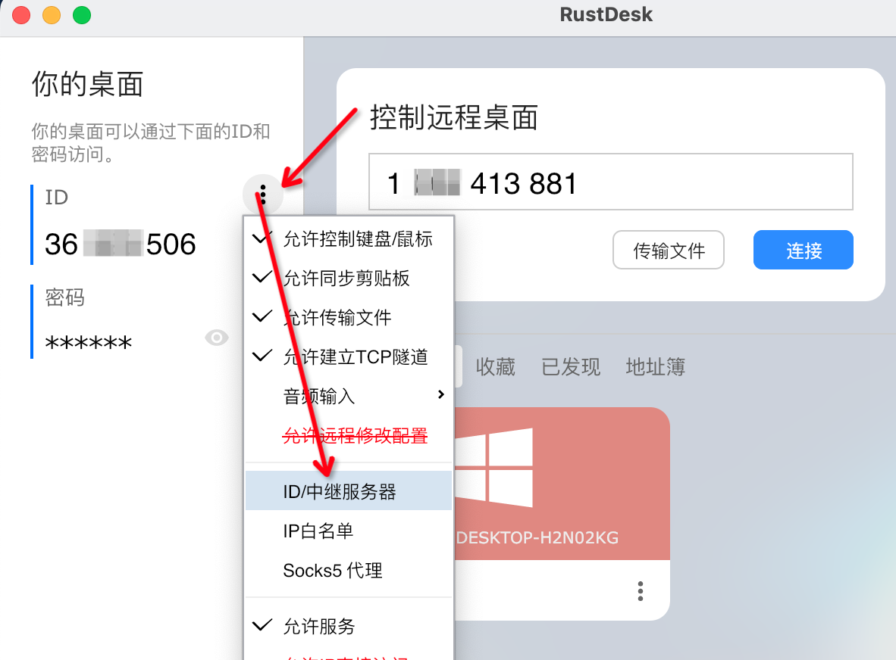
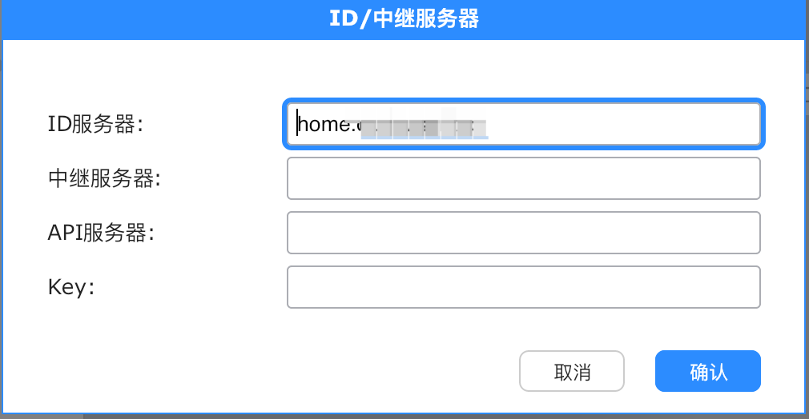

# RustDesk 远程控制软件

# 一、简介

`RustDesk` 是一款开源，用 Rust 编写的远程桌面软件，开箱即用，无需任何配置。

与 [TeamViewer](https://so.csdn.net/so/search?q=TeamViewer&spm=1001.2101.3001.7020) 和 AnyDesk 不同，不仅提供客户端桌面软件程序，还提供服务器端程序，可以设置自己的云服务器和中继。个人使用和商业都是免费的，没有任何限制。

## 主要特性

1. 自定义画面质量
2. 加密直连，先尝试打洞直连，不行再由服务器转发
3. 内置文件传输和TCP隧道功能
4. 支持自建中继服务器

## 主要组件

| 组件 | 功能                  | 使用的端口                                                   |
| ---- | --------------------- | ------------------------------------------------------------ |
| hbbs | RustDesk ID注册服务器 | 21115(tcp)：用作NAT类型测试<br>21116(udp)：用作ID注册与心跳服务<br/>21116(tcp)：用作TCP打洞与连接服务 |
| hbbr | RustDesk 中继服务器   | 21117(tcp)：用作中继服务                                     |

如果不需要网页客户端，则21118，21119端口可以不用开起


GitHub：https://github.com/rustdesk/rustdesk

官网：https://rustdesk.com/

文档：https://rustdesk.com/docs/en/

中文文档：https://rustdesk.com/docs/zh-cn/

# 二、自建服务端

## Windows-NSSM

NSSM相关参考：https://gitbook.curiouser.top/origin/windows-nssm.html?h=nssm

服务端下载：https://github.com/rustdesk/rustdesk-server/releases

```bash
# nssm install <Desired hbbs servicename> <RustDesk hbbs binary path> <RustDesk hbbs arguments>
# nssm install <Desired hbbr servicename> <RustDesk hbbr binary path> <RustDesk hbbr arguments>

nssm install "RustDesk hbbs service" "C:\Program Files\RustDesk Server\hbbs.exe" -r 0.0.0.0 -k _
nssm install "RustDesk hbbr Service" "C:\Program Files\RustDesk Server\hbbr.exe" -k _

nssm start "RustDesk hbbs service"
nssm start "RustDesk hbbr service"
```

## Docker

```bash
hbbs:
  image: 'rustdesk/rustdesk-server'
  restart: always
  container_name: hbbs
  command: hbbs -r home.******.com:21117
  ports:
    - '21115:21115'
    - '21116:21116'
    - '21116:21116/udp'
    - '21118:21118'
  volumes:
    - '/data/rustdesk/data:/root'
hbbr:
  image: 'rustdesk/rustdesk-server'
  restart: always
  container_name: hbbr
  command: hbbr
  ports:
    - '21117:21117'
    - '21119:21119'
  volumes:
    - '/data/rustdesk/data:/root'
```


# 三、客户端配置





# 参考

- https://rustdesk.com/docs/zh-cn/self-host/
- https://rustdesk.com/docs/en/self-host/windows/