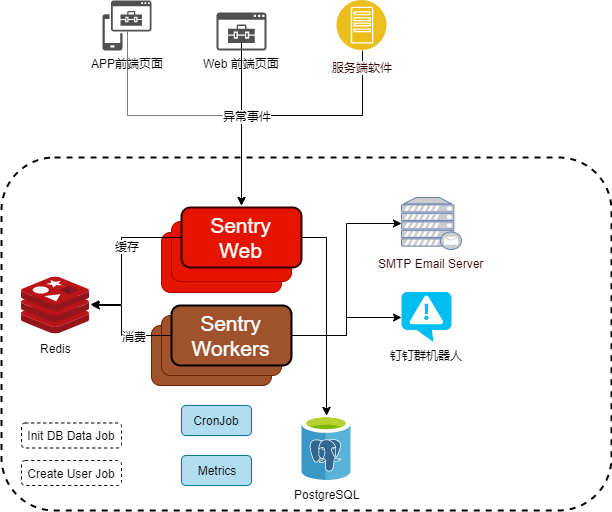
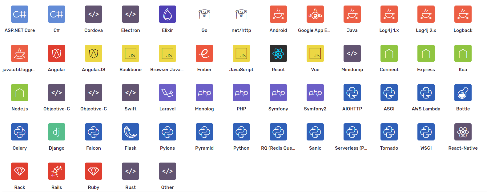
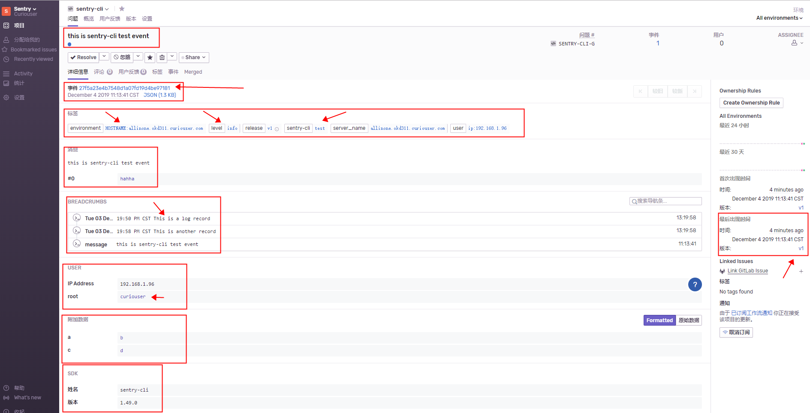

# 一、简介

虽然我们有很多工具可以让开发工作变得更容易，但是发现和排查线上问题的过程仍然在很多时候让我们觉得很痛苦。当生产系统中产生了一个bug时，我们如何快速地得到报警？如何评估它的影响和紧迫性？如何快速地找到问题的根源？当hotfix完修复程序后，又如何知道它是否解决了问题？

Sentry在帮助我们与现有流程集成时回答了这些问题。例如，线上有一个bug，代码的某处逻辑的NullPointerException造成了这个问题，Sentry会立即发现错误，并通过邮件或其他基于通知规则的集成通知到相关责任人员，这个通知可以把我们引入到一个指示板，这个指示板为我们提供了快速分类问题所需的上下文，如：频率、用户影响、代码那一部分受到影响以及那个团队可能是问题的所有者。

Sentry是一个实时事件的日志聚合平台。

Sentry 的目的是为了让我们专注于系统与程序的异常信息，目的是提高排查问题的效率，日志事件的量到达一个限制时甚至丢弃一些内容。官方也提倡正确设置 Sentry 接收的日志 level 的同时，用户也能继续旧的日志备份

Sentry 是带有一定策略的问题分析工具，以样本的形式展示部分原始日志的信息。信息不全面的同时，使用过程中也可能出现 Sentry 聚合所带来的负面影响，特别是日志记录质量不够的情况下。

与传统的监控系统相比，Sentry 更依赖于发出的日志报告，而另外一些隐藏的逻辑问题或者业务问题很可能是不会得到反馈的。不能作为日志的替代品。
 sentry主要是为让我们专注于系统和程序的异常信息，提高排查效率，日志事件的量达到一个限制值的时候可能还会丢弃一些内容。官方也提倡正确设置sentry接收的日志level的等级时，也能继续旧的日志备份。

不是排查的万能工具
 sentry是带有问题聚合功能的分析工具，所以如果样本提供的内容不全面。日志记录的质量不高的情况，对于错误的快速排查，可能没有实质性的帮助。

不能作为传统监控的替代品
 与传统监控系统相比，sentry更依赖发出的日志报告，而另外一些隐藏的逻辑问题或者业务问题可能不会得到反馈的。

那么Sentry是如何实现实时日志监控报警的呢？

首先，Sentry是一个C/S架构，分为服务端和客户端 。SDK我们需要在自己应用中集成Sentry的SDK才能在应用发生错误是将错误信息发送给Sentry服务端。根据语言和框架的不同，我们可以选择自动或自定义设置特殊的错误类型报告给Sentry服务端。

而Sentry的服务端分为web、cron、worker这几个部分，应用（客户端）发生错误后将错误信息上报给web，web处理后放入消息队列或Redis内存队列，worker从队列中消费数据进行处理。




官方文档：https://docs.sentry.io/

GitHub：https://github.com/getsentry/sentry

Sentry支持的客户端SDK：




# 二、部署

Sentry 本身是基于 Django 开发的，需要`PostgreSQL`、 `Redis`存储数据。

9.1.2之前可以使用一个镜像，通过不同的启动参数直接部署各个组件。之后10版本以上，官方推荐`on-premise`方式部署（添加了好多组件来优化性能，各个组件的镜像也分开了）参考：https://docs.sentry.io/server/installation

9.1.2版本的镜像：https://hub.docker.com/_/sentry/

## **Kubernetes Helm Charts**

- **Redis Charts**: https://github.com/helm/charts/tree/master/stable/redis
- **Postgresql Charts**: https://github.com/helm/charts/tree/master/stable/postgresql
- **Sentry Charts**: https://github.com/helm/charts/tree/master/stable/sentry

## **OpenShift 资源声明文件部署**

[资源声明文件](https://github.com/RationalMonster/OKD/tree/master/MiddlewareOpenshiftTemplates/Sentry)

## Docker部署9.1.2以下版本

### 1、部署Redis和PostgreSQL步骤省略

需要注意的是在PostgreSQL中创建`EXTENSION`表

```bash
postgres=# \c sentry
		You are now connected to database "sentry" as user "postgres".
sentry=# CREATE EXTENSION IF NOT EXISTS citext;
```

### 2、定制镜像、修改配置文件

- **定制镜像细节参考第四章第一节**

- **创建配置文件`sentry.conf.py`**

```bash
from sentry.conf.server import *  # NOQA
from sentry.utils.types import Bool, Int
import os
import os.path
import six

CONF_ROOT = os.path.dirname(__file__)

postgres = env('SENTRY_POSTGRES_HOST') or (env('POSTGRES_PORT_5432_TCP_ADDR') and 'postgres')
if postgres:
    DATABASES = {
        'default': {
            'ENGINE': 'sentry.db.postgres',
            'NAME': (
                env('SENTRY_DB_NAME')
                or env('POSTGRES_ENV_POSTGRES_USER')
                or 'postgres'
            ),
            'USER': (
                env('SENTRY_DB_USER')
                or env('POSTGRES_ENV_POSTGRES_USER')
                or 'postgres'
            ),
            'PASSWORD': (
                env('SENTRY_DB_PASSWORD')
                or env('POSTGRES_ENV_POSTGRES_PASSWORD')
                or ''
            ),
            'HOST': postgres,
            'PORT': (
                env('SENTRY_POSTGRES_PORT')
                or ''
            ),
        },
    }

# You should not change this setting after your database has been created unless you have altered all schemas first
SENTRY_USE_BIG_INTS = True

# If you're expecting any kind of real traffic on Sentry, we highly recommend
# configuring the CACHES and Redis settings

###########
# General #
###########

# Instruct Sentry that this install intends to be run by a single organization
# and thus various UI optimizations should be enabled.
SENTRY_SINGLE_ORGANIZATION = env('SENTRY_SINGLE_ORGANIZATION', True)

#########
# Redis #
#########

# Generic Redis configuration used as defaults for various things including:
# Buffers, Quotas, TSDB

redis = env('SENTRY_REDIS_HOST') or (env('REDIS_PORT_6379_TCP_ADDR') and 'redis')
if not redis:
    raise Exception('Error: REDIS_PORT_6379_TCP_ADDR (or SENTRY_REDIS_HOST) is undefined, did you forget to `--link` a redis container?')

redis_password = env('SENTRY_REDIS_PASSWORD') or ''
redis_port = env('SENTRY_REDIS_PORT') or '6379'
redis_db = env('SENTRY_REDIS_DB') or '0'

SENTRY_OPTIONS.update({
    'redis.clusters': {
        'default': {
            'hosts': {
                0: {
                    'host': redis,
                    'password': redis_password,
                    'port': redis_port,
                    'db': redis_db,
                },
            },
        },
    },
})

#########
# Cache #
#########

# Sentry currently utilizes two separate mechanisms. While CACHES is not a
# requirement, it will optimize several high throughput patterns.

memcached = env('SENTRY_MEMCACHED_HOST') or (env('MEMCACHED_PORT_11211_TCP_ADDR') and 'memcached')
if memcached:
    memcached_port = (
        env('SENTRY_MEMCACHED_PORT')
        or '11211'
    )
    CACHES = {
        'default': {
            'BACKEND': 'django.core.cache.backends.memcached.MemcachedCache',
            'LOCATION': [memcached + ':' + memcached_port],
            'TIMEOUT': 3600,
        }
    }

# A primary cache is required for things such as processing events
SENTRY_CACHE = 'sentry.cache.redis.RedisCache'

#########
# Queue #
#########

# See https://docs.getsentry.com/on-premise/server/queue/ for more
# information on configuring your queue broker and workers. Sentry relies
# on a Python framework called Celery to manage queues.

rabbitmq = env('SENTRY_RABBITMQ_HOST') or (env('RABBITMQ_PORT_5672_TCP_ADDR') and 'rabbitmq')

if rabbitmq:
    BROKER_URL = (
        'amqp://' + (
            env('SENTRY_RABBITMQ_USERNAME')
            or env('RABBITMQ_ENV_RABBITMQ_DEFAULT_USER')
            or 'guest'
        ) + ':' + (
            env('SENTRY_RABBITMQ_PASSWORD')
            or env('RABBITMQ_ENV_RABBITMQ_DEFAULT_PASS')
            or 'guest'
        ) + '@' + rabbitmq + '/' + (
            env('SENTRY_RABBITMQ_VHOST')
            or env('RABBITMQ_ENV_RABBITMQ_DEFAULT_VHOST')
            or '/'
        )
    )
else:
    BROKER_URL = 'redis://:' + redis_password + '@' + redis + ':' + redis_port + '/' + redis_db


###############
# Rate Limits #
###############

# Rate limits apply to notification handlers and are enforced per-project
# automatically.

SENTRY_RATELIMITER = 'sentry.ratelimits.redis.RedisRateLimiter'

##################
# Update Buffers #
##################

# Buffers (combined with queueing) act as an intermediate layer between the
# database and the storage API. They will greatly improve efficiency on large
# numbers of the same events being sent to the API in a short amount of time.
# (read: if you send any kind of real data to Sentry, you should enable buffers)

SENTRY_BUFFER = 'sentry.buffer.redis.RedisBuffer'

##########
# Quotas #
##########

# Quotas allow you to rate limit individual projects or the Sentry install as
# a whole.

SENTRY_QUOTAS = 'sentry.quotas.redis.RedisQuota'

########
# TSDB #
########

# The TSDB is used for building charts as well as making things like per-rate
# alerts possible.

SENTRY_TSDB = 'sentry.tsdb.redis.RedisTSDB'

###########
# Digests #
###########

# The digest backend powers notification summaries.

SENTRY_DIGESTS = 'sentry.digests.backends.redis.RedisBackend'

##############
# Web Server #
##############

# If you're using a reverse SSL proxy, you should enable the X-Forwarded-Proto
# header and set `SENTRY_USE_SSL=1`

if env('SENTRY_USE_SSL', False):
    SECURE_PROXY_SSL_HEADER = ('HTTP_X_FORWARDED_PROTO', 'https')
    SESSION_COOKIE_SECURE = True
    CSRF_COOKIE_SECURE = True
    SOCIAL_AUTH_REDIRECT_IS_HTTPS = True

SENTRY_WEB_HOST = '0.0.0.0'
SENTRY_WEB_PORT = 9000
SENTRY_WEB_OPTIONS = {
    'http': '%s:%s' % (SENTRY_WEB_HOST, SENTRY_WEB_PORT),
    'protocol': 'uwsgi',
    # This is need to prevent https://git.io/fj7Lw
    'uwsgi-socket': None,
    'http-keepalive': True,
    'memory-report': False,
    # 'workers': 3,  # the number of web workers
}

###############
# Mail Server #
###############

email = env('SENTRY_EMAIL_HOST') or (env('SMTP_PORT_25_TCP_ADDR') and 'smtp')
if email:
    SENTRY_OPTIONS['mail.backend'] = 'smtp'
    SENTRY_OPTIONS['mail.host'] = email
    SENTRY_OPTIONS['mail.from'] = env('SENTRY_SERVER_EMAIL')
    SENTRY_OPTIONS['mail.username'] = env('SENTRY_EMAIL_USER') or ''
    SENTRY_OPTIONS['mail.password'] = env('SENTRY_EMAIL_PASSWORD') or ''
    SENTRY_OPTIONS['mail.port'] = int(env('SENTRY_EMAIL_PORT') or 25)
    SENTRY_OPTIONS['mail.use-tls'] = env('SENTRY_EMAIL_USE_TLS', False)
    SENTRY_OPTIONS['mail.list-namespace'] = env('SENTRY_EMAIL_LIST_NAMESPACE') or 'localhost'
else:
    SENTRY_OPTIONS['mail.backend'] = 'dummy'

# The email address to send on behalf of
SENTRY_OPTIONS['mail.from'] = env('SENTRY_SERVER_EMAIL') or 'root@localhost'
# If you're using mailgun for inbound mail, set your API key and configure a
# route to forward to /api/hooks/mailgun/inbound/
SENTRY_OPTIONS['mail.mailgun-api-key'] = env('SENTRY_MAILGUN_API_KEY') or ''
# If you specify a MAILGUN_API_KEY, you definitely want EMAIL_REPLIES
if SENTRY_OPTIONS['mail.mailgun-api-key']:
    SENTRY_OPTIONS['mail.enable-replies'] = True
else:
    SENTRY_OPTIONS['mail.enable-replies'] = env('SENTRY_ENABLE_EMAIL_REPLIES', False)
if SENTRY_OPTIONS['mail.enable-replies']:
    SENTRY_OPTIONS['mail.reply-hostname'] = env('SENTRY_SMTP_HOSTNAME') or ''

##########
# Docker #
##########

# Docker's environment configuration needs to happen
# prior to anything that might rely on these values to
# enable more "smart" configuration.

ENV_CONFIG_MAPPING = {
    'SENTRY_SECRET_KEY': 'system.secret-key',
    'SENTRY_SLACK_CLIENT_ID': 'slack.client-id',
    'SENTRY_SLACK_CLIENT_SECRET': 'slack.client-secret',
    'SENTRY_SLACK_VERIFICATION_TOKEN': 'slack.verification-token',
    'SENTRY_GITHUB_APP_ID': ('github-app.id', Int),
    'SENTRY_GITHUB_APP_CLIENT_ID': 'github-app.client-id',
    'SENTRY_GITHUB_APP_CLIENT_SECRET': 'github-app.client-secret',
    'SENTRY_GITHUB_APP_WEBHOOK_SECRET': 'github-app.webhook-secret',
    'SENTRY_GITHUB_APP_PRIVATE_KEY': 'github-app.private-key',
    'SENTRY_VSTS_CLIENT_ID': 'vsts.client-id',
    'SENTRY_VSTS_CLIENT_SECRET': 'vsts.client-secret',
    'GOOGLE_CLIENT_ID': 'auth-google.client-id',
    'GOOGLE_CLIENT_SECRET': 'auth-google.client-secret',
}

def bind_env_config(config=SENTRY_OPTIONS, mapping=ENV_CONFIG_MAPPING):
    """
    Automatically bind SENTRY_OPTIONS from a set of environment variables.
    """
    for env_var, item in six.iteritems(mapping):
        # HACK: we need to check both in `os.environ` and `env._cache`.
        # This is very much an implementation detail leaking out
        # due to assumptions about how `env` would be used previously.
        # `env` will pop values out of `os.environ` when they are seen,
        # so checking against `os.environ` only means it's likely
        # they won't exist if `env()` has been called on the variable
        # before at any point. So we're choosing to check both, but this
        # behavior is different since we're trying to only conditionally
        # apply variables, instead of setting them always.
        if env_var not in os.environ and env_var not in env._cache:
            continue
        if isinstance(item, tuple):
            opt_key, type_ = item
        else:
            opt_key, type_ = item, None
        config[opt_key] = env(env_var, type=type_)

# If this value ever becomes compromised, it's important to regenerate your
# SENTRY_SECRET_KEY. Changing this value will result in all current sessions
# being invalidated.
secret_key = env('SENTRY_SECRET_KEY')
if not secret_key:
    raise Exception('Error: SENTRY_SECRET_KEY is undefined, run `generate-secret-key` and set to -e SENTRY_SECRET_KEY')

if 'SENTRY_RUNNING_UWSGI' not in os.environ and len(secret_key) < 32:
    print('!!!!!!!!!!!!!!!!!!!!!!!!!!!!!!!!!!!!!!!!!!!!!!!!!!!!!!')
    print('!!                    CAUTION                       !!')
    print('!! Your SENTRY_SECRET_KEY is potentially insecure.  !!')
    print('!!    We recommend at least 32 characters long.     !!')
    print('!!     Regenerate with `generate-secret-key`.       !!')
    print('!!!!!!!!!!!!!!!!!!!!!!!!!!!!!!!!!!!!!!!!!!!!!!!!!!!!!!')

# Grab the easy configuration first - these are all fixed
# key=value with no logic behind them
bind_env_config()

# If you specify a MAILGUN_API_KEY, you definitely want EMAIL_REPLIES
if SENTRY_OPTIONS.get('mail.mailgun-api-key'):
    SENTRY_OPTIONS.setdefault('mail.enable-replies', True)

if 'GITHUB_APP_ID' in os.environ:
    GITHUB_EXTENDED_PERMISSIONS = ['repo']
    GITHUB_APP_ID = env('GITHUB_APP_ID')
    GITHUB_API_SECRET = env('GITHUB_API_SECRET')

if 'BITBUCKET_CONSUMER_KEY' in os.environ:
    BITBUCKET_CONSUMER_KEY = env('BITBUCKET_CONSUMER_KEY')
    BITBUCKET_CONSUMER_SECRET = env('BITBUCKET_CONSUMER_SECRET')

SENTRY_METRICS_BACKEND = 'sentry.metrics.statsd.StatsdMetricsBackend'
SENTRY_METRICS_OPTIONS = {
    'host': '127.0.0.1',
    'port': 9125,
}

####################
# LDAP settings ##
####################
SENTRY_USE_LDAP = env('SENTRY_USE_LDAP', False)
if SENTRY_USE_LDAP:
    import ldap
    from django_auth_ldap.config import LDAPSearch, GroupOfUniqueNamesType
    AUTH_LDAP_SERVER_URI = env('LDAP_SERVER', 'ldap://localhost 389')
    AUTH_LDAP_BIND_DN = env('LDAP_BIND_DN', '')
    AUTH_LDAP_BIND_PASSWORD = env('LDAP_BIND_PASSWORD', '')
    AUTH_LDAP_USER_SEARCH = LDAPSearch(
        env('LDAP_USER_DN'),
        ldap.SCOPE_SUBTREE,
        env('LDAP_USER_FILTER', '(&(objectClass=inetOrgPerson)(cn=%(user)s))')
    )
    #AUTH_LDAP_GROUP_SEARCH = LDAPSearch(
    #    env('LDAP_GROUP_DN', ''),
    #    ldap.SCOPE_SUBTREE,
    #    env('LDAP_GROUP_FILTER', '(objectClass=groupOfUniqueNames)')
    #)

    if env('LDAP_GROUP_TYPE', '') == 'groupOfUniqueNames':
        AUTH_LDAP_GROUP_TYPE = GroupOfUniqueNamesType()
    elif env('LDAP_GROUP_TYPE', '') == 'groupOfNames':
        AUTH_LDAP_GROUP_TYPE = GroupOfNamesType()
    elif env('LDAP_GROUP_TYPE', '') == 'posixGroup':
        AUTH_LDAP_GROUP_TYPE = PosixGroupType()
    elif env('LDAP_GROUP_TYPE', '') == 'nestedGroupOfNames':
        AUTH_LDAP_GROUP_TYPE = NestedGroupOfNamesType()

    AUTH_LDAP_REQUIRE_GROUP = None
    AUTH_LDAP_DENY_GROUP = None

    AUTH_LDAP_USER_ATTR_MAP = {
        'username': env('LDAP_SENTRY_USER_FIELD', 'cn'),
        'name': env('LDAP_MAP_FULL_NAME', 'sn'),
        'email': env('LDAP_MAP_MAIL', 'mail')
    }

    AUTH_LDAP_FIND_GROUP_PERMS = env('LDAP_FIND_GROUP_PERMS', False)
    AUTH_LDAP_CACHE_GROUPS = env('LDAP_CACHE_GROUPS', True)
    AUTH_LDAP_GROUP_CACHE_TIMEOUT = env('LDAP_GROUP_CACHE_TIMEOUT', 3600)

    AUTH_LDAP_DEFAULT_SENTRY_ORGANIZATION = env('LDAP_DEFAULT_SENTRY_ORGANIZATION','sentry')
    AUTH_LDAP_SENTRY_ORGANIZATION_ROLE_TYPE = 'manager'
    AUTH_LDAP_SENTRY_SUBSCRIBE_BY_DEFAULT = False
    AUTH_LDAP_SENTRY_ORGANIZATION_GLOBAL_ACCESS = True
    AUTH_LDAP_SENTRY_USERNAME_FIELD = env('LDAP_SENTRY_USERNAME_FIELD', 'cn')
    AUTHENTICATION_BACKENDS = AUTHENTICATION_BACKENDS + ('sentry_ldap_auth.backend.SentryLdapBackend',)
    ldap_is_active    = env('LDAP_GROUP_ACTIVE', '')
    ldap_is_superuser = env('LDAP_GROUP_SUPERUSER', '')
    ldap_is_staff     = env('LDAP_GROUP_STAFF', '')

    if ldap_is_active or ldap_is_superuser or ldap_is_staff:
        AUTH_LDAP_USER_FLAGS_BY_GROUP = {
            'is_active': ldap_is_active,
            'is_superuser': ldap_is_superuser,
            'is_staff': ldap_is_staff,
    }
    import logging
    logger = logging.getLogger('django_auth_ldap')
    logger.addHandler(logging.StreamHandler())
    ldap_loglevel = getattr(logging, env('LDAP_LOGLEVEL', 'DEBUG'))
    logger.setLevel(ldap_loglevel)
    LOGGING['overridable'] = ['sentry', 'django_auth_ldap']
    LOGGING['loggers']['django_auth_ldap'] = {'handlers': ['console'],'level': env('LDAP_LOGLEVEL','DEBUG')}
```

### 3、初始化PostgreSQL数据库

```bash
docker run -it \
-e TZ='Asia/Shanghai' \
-e SENTRY_SECRET_KEY='TGQ3RzNUM0lkSVRlcWZBTzczZUtPeW40ZkpPbjlhbnpRVTJjYXdESQ==' \
-e SENTRY_SERVER_EMAIL='*****@163.com' \
-e SENTRY_EMAIL_USE_TLS=False \
-e SENTRY_EMAIL_PASSWORD=***** \
-e SENTRY_EMAIL_USER='*****@163.com' \
-e SENTRY_EMAIL_PORT=25 \
-e SENTRY_EMAIL_HOST='smtp.163.com' \
-e SENTRY_REDIS_HOST='192.168.1.67' \
-e SENTRY_POSTGRES_PORT=5432 \
-e SENTRY_POSTGRES_HOST=192.168.1.67 \
-e SENTRY_DB_PASSWORD=sentry \
-e SENTRY_DB_USER=sentry \
-e SENTRY_DB_NAME=sentry \
--name sentry-db-init \
sentry-9.1.2-ldap-dingtalk:v1 sentry upgrade --noinput
```

### 4、初始化用户信息

```bash
docker run -it \
-e TZ='Asia/Shanghai' \
-e SENTRY_SECRET_KEY='TGQ3RzNUM0lkSVRlcWZBTzczZUtPeW40ZkpPbjlhbnpRVTJjYXdESQ==' \
-e SENTRY_SERVER_EMAIL='*****@163.com' \
-e SENTRY_EMAIL_USE_TLS=False \
-e SENTRY_EMAIL_PASSWORD=***** \
-e SENTRY_EMAIL_USER='*****@163.com' \
-e SENTRY_EMAIL_PORT=25 \
-e SENTRY_EMAIL_HOST='smtp.163.com' \
-e SENTRY_REDIS_HOST='192.168.1.67' \
-e SENTRY_POSTGRES_PORT=5432 \
-e SENTRY_POSTGRES_HOST=192.168.1.676\
-e SENTRY_DB_PASSWORD=sentry \
-e SENTRY_DB_USER=sentry \
-e SENTRY_DB_NAME=sentry \
--name sentry-user-init \
sentry-9.1.2-ldap-dingtalk:v1 sentry createuser --no-input --email '*****@163.com' --superuser --password 18526
```

### 5、部署Worker

```bash
docker run -d \
-p 30276:9000 \
--privileged \
--restart=always \
-v ./worker-data:/var/lib/sentry/files/ \
-e SENTRY_USE_LDAP=True \
-e TZ='Asia/Shanghai' \
-e SENTRY_SECRET_KEY='TGQ3RzNUM0lkSVRlcWZBTzczZUtPeW40ZkpPbjlhbnpRVTJjYXdESQ==' \
-e SENTRY_SERVER_EMAIL='****@163.com' \
-e SENTRY_EMAIL_USE_TLS=False \
-e SENTRY_EMAIL_PASSWORD=**** \
-e SENTRY_EMAIL_USER='****@163.com' \
-e SENTRY_EMAIL_PORT=25 \
-e SENTRY_EMAIL_HOST='smtp.163.com' \
-e SENTRY_REDIS_HOST='192.168.1.67' \
-e SENTRY_POSTGRES_PORT=5432 \
-e SENTRY_POSTGRES_HOST=192.168.1.67 \
-e SENTRY_DB_PASSWORD=sentry \
-e SENTRY_DB_USER=sentry \
-e SENTRY_DB_NAME=sentry \
--name sentry-worker \
sentry-9.1.2-ldap-dingtalk:v1 run worker
```

### 6、部署Web

```bash
docker run -d \
-p 30275:9000 \
--privileged \
--restart=always \
-v ./web-data:/var/lib/sentry/files/ \
-v ./sentry.conf.py:/etc/sentry/sentry.conf.py \
-e LDAP_LOGLEVEL=INFO \
-e LDAP_SENTRY_USERNAME_FIELD=cn \
-e LDAP_FIND_GROUP_PERMS=False \
-e LDAP_CACHE_GROUPS=True \
-e LDAP_GROUP_CACHE_TIMEOUT=3600 \
-e LDAP_GROUP_TYPE=groupOfUniqueNames \
-e LDAP_MAP_FULL_NAME=gecos \
-e LDAP_USER_FILTER='(&(memberOf=cn=sentry,cn=groups,dc=ldap,dc=synology,dc=curiouser,dc=com)(cn=%(user)s))' \
-e LDAP_USER_DN='cn=users,dc=ldap,dc=synology,dc=curiouser,dc=com' \
-e LDAP_BIND_PASSWORD=jL6u49t5A9P5 \
-e LDAP_BIND_DN='uid=root,cn=users,dc=ldap,dc=synology,dc=curiouser,dc=com' \
-e LDAP_SERVER='ldap://192.168.1.67:389' \
-e SENTRY_USE_LDAP=True \
-e TZ='Asia/Shanghai' \
-e SENTRY_SECRET_KEY='TGQ3RzNUM0lkSVRlcWZBTzczZUtPeW40ZkpPbjlhbnpRVTJjYXdESQ==' \
-e SENTRY_SERVER_EMAIL='****@163.com' \
-e SENTRY_EMAIL_USE_TLS=False \
-e SENTRY_EMAIL_PASSWORD=**** \
-e SENTRY_EMAIL_USER='****@163.com' \
-e SENTRY_EMAIL_PORT=25 \
-e SENTRY_EMAIL_HOST='smtp.163.com' \
-e SENTRY_REDIS_HOST='192.168.1.67' \
-e SENTRY_POSTGRES_PORT=5432 \
-e SENTRY_POSTGRES_HOST=192.168.1.67 \
-e SENTRY_DB_PASSWORD=sentry \
-e SENTRY_DB_USER=sentry \
-e SENTRY_DB_NAME=sentry \
--name sentry-web \
sentry-9.1.2-ldap-dingtalk:v1
```

# 三、配置

在Sentry完成一个项目的设置后，您将获得一个我们称之为DSN或数据源名称的值.它看起来很像一个标准的URL，但它实际上只是Sentry SDK所需的配置的标识.它由几个部分组成，包括协议，公共密钥和密钥，服务器地址和项目标识符。

```bash
'{PROTOCOL}://{PUBLIC_KEY}:{SECRET_KEY}@{HOST}/{PATH}{PROJECT_ID}'
```

# 四、Sentry集成LDAP认证登陆和钉钉群机器人

- 由于Sentry没有集成LDAP认证的官方插件，所以推荐了第三方插件sentry-ldap-auth来实现。

- 仅只是使用邮件的方式进行通知，这是不够的。Sentry默认的通知方式中是不支持钉钉的，它并没有直接集成钉钉。而是集成一个Webhook，这个Webhook发送的数据格式与钉钉群机器人回调地址接受的数据格式不一致，无法直接回调钉钉群机器人通知。所以只能集成第三方插件来支持。目前有两个

官方说明文档：https://docs.sentry.io/server/plugins/#rd-party-plugins

Sentry-ldap-auth插件地址：https://github.com/Banno/getsentry-ldap-auth

Sentry-Dingtalk插件地址：https://github.com/anshengme/sentry-dingding

第三方制作集成Sentry-ldap-auth插件Docker镜像的GitHub：https://github.com/locaweb/docker-sentry-ldap

相关文章：https://www.cnblogs.com/cjsblog/p/10585213.html

## 1、修改默认镜像，添加插件

Dockerfile

```bash
FROM docker.io/sentry:9.1.2

RUN apt-get -qq update && DEBIAN_FRONTEND=noninteractive apt-get install -y -q libxslt1-dev libxml2-dev libpq-dev libldap2-dev libsasl2-dev libssl-dev

RUN echo "sentry-ldap-auth\npython-decouple==3.0\ndjango-auth-ldap <=1.2.17\nsentry-dingding" > /tmp/req.txt && \
    pip install -r /tmp/req.txt && \
    apt-get remove -y -q libxslt1-dev libxml2-dev libpq-dev libldap2-dev libsasl2-dev libssl-dev && \
    rm -rf /var/lib/apt/lists/* /tmp/req.txt
```

Makefile

```bash
IMAGE_BASE = harbor.curiouser.cn
IMAGE_NAME = tools/sentry-9.1.2-ldap-dingtalk
IMAGE_VERSION = v1
all: build
build:
        docker build --rm -f Dockerfile -t ${IMAGE_BASE}/${IMAGE_NAME}:${IMAGE_VERSION} .
push:
        docker push ${IMAGE_BASE}/${IMAGE_NAME}:${IMAGE_VERSION}
```

## 2、修改部署charts中的configmap，添加插件认证代码

Sentry Charts目录下templates/configmap.yaml

```yaml
apiVersion: v1
kind: ConfigMap
metadata:
# .....上文省略......
data:
  # .....上文省略......
  sentry.conf.py: |-
  # .....上文省略......
    ####################
    # LDAP settings ##
    ####################
    SENTRY_USE_LDAP = env('SENTRY_USE_LDAP', False)
    if SENTRY_USE_LDAP:
        import ldap
        from django_auth_ldap.config import LDAPSearch, GroupOfUniqueNamesType
 
        AUTH_LDAP_SERVER_URI = env('LDAP_SERVER', 'ldap://localhost：389')
        AUTH_LDAP_BIND_DN = env('LDAP_BIND_DN', '')
        AUTH_LDAP_BIND_PASSWORD = env('LDAP_BIND_PASSWORD', '')
 
        # 设置搜索用户配置
        AUTH_LDAP_USER_SEARCH = LDAPSearch(
            env('LDAP_USER_DN'),
            ldap.SCOPE_SUBTREE,
            env('LDAP_USER_FILTER', '(&(objectClass=inetOrgPerson)(cn=%(user)s))')
        )
 
        # 设置搜索用户组配置
        #AUTH_LDAP_GROUP_SEARCH = LDAPSearch(
        #    env('LDAP_GROUP_DN', ''),
        #    ldap.SCOPE_SUBTREE,
        #    env('LDAP_GROUP_FILTER', '(objectClass=groupOfUniqueNames)')
        #)
 
        if env('LDAP_GROUP_TYPE', '') == 'groupOfUniqueNames':
            AUTH_LDAP_GROUP_TYPE = GroupOfUniqueNamesType()
        elif env('LDAP_GROUP_TYPE', '') == 'groupOfNames':
            AUTH_LDAP_GROUP_TYPE = GroupOfNamesType()
        elif env('LDAP_GROUP_TYPE', '') == 'posixGroup':
            AUTH_LDAP_GROUP_TYPE = PosixGroupType()
        elif env('LDAP_GROUP_TYPE', '') == 'nestedGroupOfNames':
            AUTH_LDAP_GROUP_TYPE = NestedGroupOfNamesType()
 
        AUTH_LDAP_REQUIRE_GROUP = None
        AUTH_LDAP_DENY_GROUP = None
 
        # 用户属性Mapping
        AUTH_LDAP_USER_ATTR_MAP = {
            'username': env('LDAP_SENTRY_USER_FIELD', 'cn'),
            'name': env('LDAP_MAP_FULL_NAME', 'sn'),
            'email': env('LDAP_MAP_MAIL', 'mail')
        }
 
        # 用户搜索缓存
        AUTH_LDAP_FIND_GROUP_PERMS = env('LDAP_FIND_GROUP_PERMS', False)
        AUTH_LDAP_CACHE_GROUPS = env('LDAP_CACHE_GROUPS', True)
        AUTH_LDAP_GROUP_CACHE_TIMEOUT = env('LDAP_GROUP_CACHE_TIMEOUT', 3600)
 
        # 用户在Sentry中的对应关系
        AUTH_LDAP_DEFAULT_SENTRY_ORGANIZATION = env('LDAP_DEFAULT_SENTRY_ORGANIZATION','sentry')
        AUTH_LDAP_SENTRY_ORGANIZATION_ROLE_TYPE = 'manager'
        AUTH_LDAP_SENTRY_SUBSCRIBE_BY_DEFAULT = False
        AUTH_LDAP_SENTRY_ORGANIZATION_GLOBAL_ACCESS = True
        AUTH_LDAP_SENTRY_USERNAME_FIELD = env('LDAP_SENTRY_USERNAME_FIELD', 'cn')
        AUTHENTICATION_BACKENDS = AUTHENTICATION_BACKENDS + ('sentry_ldap_auth.backend.SentryLdapBackend',)
        ldap_is_active    = env('LDAP_GROUP_ACTIVE', '')
        ldap_is_superuser = env('LDAP_GROUP_SUPERUSER', '')
        ldap_is_staff     = env('LDAP_GROUP_STAFF', '')
 
        if ldap_is_active or ldap_is_superuser or ldap_is_staff:
            AUTH_LDAP_USER_FLAGS_BY_GROUP = {
                'is_active': ldap_is_active,
                'is_superuser': ldap_is_superuser,
                'is_staff': ldap_is_staff,
            }
        # django_auth_ldap日志输出
        import logging
        logger = logging.getLogger('django_auth_ldap')
        logger.addHandler(logging.StreamHandler())
        ldap_loglevel = getattr(logging, env('LDAP_LOGLEVEL', 'DEBUG'))
        logger.setLevel(ldap_loglevel)
        LOGGING['overridable'] = ['sentry', 'django_auth_ldap']
        LOGGING['loggers']['django_auth_ldap'] = {'handlers': ['console'],'level': env('LDAP_LOGLEVEL','DEBUG')}
 # .....下文省略......
```

## 3、在Values文件中添加Web组件部署时的环境变量

values-dev.yaml

```yaml
...
web:
  ...
  env:
    ...
    - name: TZ
      value: Asia/Shanghai
    - name: SENTRY_USE_LDAP
      value: 'True'
    - name: LDAP_SERVER
      value: 'ldap://openldap.openldap.svc:389'
    - name: LDAP_BIND_DN
      value: 'cn=readonly,dc=curiouser,dc=com'
    - name: LDAP_BIND_PASSWORD
      value: readonly
    - name: LDAP_USER_DN
      value: 'ou=employee,dc=curiouser,dc=com'
    - name: LDAP_USER_FILTER
      value: >-
        (&(memberOf=cn=sentry,ou=apps,dc=curiouser,dc=com)(cn=%(user)s))
    - name: LDAP_SENTRY_USER_FIELD
      value: 'cn'
    - name: LDAP_MAP_FULL_NAME
      value: 'sn'
    - name: LDAP_MAP_MAIL
      value: 'mail'
    - name: LDAP_GROUP_TYPE
      value: groupOfUniqueNames
    - name: LDAP_GROUP_CACHE_TIMEOUT
      value: '3600'
    - name: LDAP_CACHE_GROUPS
      value: 'True'
    - name: LDAP_DEFAULT_SENTRY_ORGANIZATION
      value: sentry
    - name: LDAP_FIND_GROUP_PERMS
      value: 'False'
    - name: LDAP_SENTRY_USERNAME_FIELD
      value: 'cn'
    - name: LDAP_LOGLEVEL
      value: INFO
```


# 五、Kubernetes event 客户端

Github 地址：https://github.com/getsentry/sentry-kubernetes

```bash
helm repo add googleapis-incubator  https://kubernetes-charts-incubator.storage.googleapis.com

helm upgrade --install sentry-kubernetes-events googleapis-incubator/sentry-kubernetes \
--namespace tools \
--set sentry.dsn=<your-dsn> \
--set sentry.environment=test \
--set sentry.release=test 
```

# 六、Sentry-cli客户端

Sentry命令行客户端，作为为一个独立于代码SDK之外的客户端，通常可以用于发送一些自定义事件到服务端。例如在一些定时任务Bash脚本中集成，将一些自定义的事件同步到Sentry服务端，做到自定义事件监控。

官方文档：https://docs.sentry.io/cli/

GitHub地址：https://github.com/getsentry/sentry-cli

## 1. 下载安装

- 手动下载安装

  - github下载地址：https://github.com/getsentry/sentry-cli/releases/

- 脚本下载安装

  ```bash
  curl -sL https://sentry.io/get-cli/ | bash
  ```

- NPM下载安装

  ```bash
  # 全局安装
  npm install -g @sentry/cli --unsafe-perm 
  ```

- Docker Image

  ```bash
  $ docker pull getsentry/sentry-cli
  $ docker run --rm -v $(pwd):/work getsentry/sentry-cli --help
  ```

## 2. 配置

- **全局配置文件**：~/.sentryclirc

  - INI语法格式

  ```properties
  [auth]
  token=your-auth-token
  ```

- **环境变量**

  - 默认会读取当前`.env` 文件加载环境变量。可设置`SENTRY_LOAD_DOTENV=0`禁止

  ```bash
  export SENTRY_AUTH_TOKEN=your-auth-token
  ```

- **命令行参数**

  ```bash
  sentry-cli --auth-token your-auth-token
  ```

- **项目配置文件**

  - 支持加载`.properties`，也可通过环境变量`SENTRY_PROPERTIES`指定项目配置文件路径 

| 环境变量的形式                  | 配置文件中的形式          | 描述                                                         |
| ------------------------------- | ------------------------- | ------------------------------------------------------------ |
| **SENTRY_AUTH_TOKEN**           | **auth.token**            | 与Sentry服务端通信用的认证Token                              |
| **SENTRY_API_KEY**              | **auth.api_key**          | The legacy API key for authentication if you have one.       |
| **SENTRY_URL**                  | **defaults.url**          | The URL to use to connect to sentry. This defaults to `https://sentry.io/`. |
| **SENTRY_ORG**                  | **defaults.org**          | The slug of the organization to use for a command.           |
| **SENTRY_PROJECT**              | **defaults.project**      | The slug of the project to use for a command.                |
|                                 | **http.keepalive**        | This ini only setting is used to control the behavior of the SDK with regards to HTTP keepalives. The default is *true* but it can be set to *false* to disable keepalive support. |
| **http_proxy**                  | **http.proxy_url**        | The URL that should be used for the HTTP proxy. The standard `http_proxy` environment variable is also honored. Note that it is lowercase. |
|                                 | **http.proxy_username**   | This ini only setting sets the proxy username in case proxy authentication is required. |
|                                 | **http.proxy_password***  | This ini only setting sets the proxy password in case proxy authentication is required. |
|                                 | **http.verify_ssl**       | This can be used to disable SSL verification when set to false. You should never do that unless you are working with a known self signed server locally. |
|                                 | **http.check_ssl_revoke** | If this is set to false then SSL revocation checks are disabled on Windows. This can be useful when working with a corporate SSL MITM proxy that does not properly implement revocation checks. Do not use this unless absolutely necessary. |
| **SENTRY_HTTP_MAX_RETRIES**     | **http.max_retries**      | Sets the maximum number of retry attempts for upload operations (e.g., uploads of release files and debug symbols). The default is `5`. |
|                                 | **ui.show_notifications** | If this is set to false some operating system notifications are disabled. This currently primarily affects xcode builds which will not show notifications for background builds. |
| **SENTRY_LOG_LEVEL**            | **log.level**             | Configures the log level for the SDK. The default is `warning`. If you want to see what the library is doing you can set it to `info` which will spit out more information which might help to debug some issues with permissions. |
|                                 | **dsym.max_upload_size**  | Sets the maximum upload size in bytes (before compression) of debug symbols into one batch. The default is 35MB or 100MB (depending on the version of sentry-cli) which is suitable for sentry.io but if you are using a different sentry server you might want to change this limit if necessary. |
| **SENTRY_NO_PROGRESS_BAR**      |                           | If set to `1`, then `sentry-cli` will not display progress bars for any operations. |
| **SENTRY_DISABLE_UPDATE_CHECK** | **update.disable_check**  | If set to `true`, then the automatic update check in sentry-cli is disabled. This was introduced in 1.17. Versions before that did not include an update check. The update check is also not enabled for npm based installations of sentry-cli at the moment. |
| **DEVICE_FAMILY**               | **device.family**         | Device family value reported to Sentry.                      |
| **DEVICE_MODEL**                | **device.model**          | Device model value reported to Sentry.                       |

## 3. 获取Auth Token


## 4. 获取并设置项目DSN

创建项目，获取DSN


设置DSN环境变量

```bash
export SENTRY_DSN=https://<key>:<secret>@sentry.io/<project>
```

## 5. 验证配置文件

```bash
$ sentry-cli info
Sentry Server: http://sentry-web-sentry.apps.okd311.curiouser.com
Default Organization: Sentry
Default Project: sentry-cli

Authentication Info:
  Method: Auth Token
  User: ***
  Scopes:
    - event:admin
    - event:read
    - member:read
    - org:read
    - project:read
    - project:releases
    - team:read
```

## 6. Sentry-cli命令行参数

```bash
$ sentry-cli <子命令>

OPTIONS:
        --api-key <API_KEY>          指定Sentry API key.
        --auth-token <AUTH_TOKEN>    指定Sentry auth token.
    -h, --help                       打印帮助信息
        --log-level <LOG_LEVEL>      设置日志输出级别(日志级别:TRACE、DEBUG、INFO、WARN、ERROR)         --url <URL>                  指定Sentry服务端地址.[默认：https://sentry.io/]
    -V, --version                    打印版本信息

子命令：
    bash-hook          Prints out a bash script that does error handling.
    difutil            Locate or analyze debug information files.
    help               显示帮助信息
    info               打印Sentry服务端信息
    issues             Manage issues in Sentry.
    login              Authenticate with the Sentry server.
    projects           管理sentry项目Manage projects on Sentry.
    react-native       Upload build artifacts for react-native projects.
    releases           Manage releases on Sentry.
    repos              Manage repositories on Sentry.
    send-event         Send a manual event to Sentry.
    uninstall          Uninstall the sentry-cli executable.
    update             Update the sentry-cli executable.
    upload-dif         Upload debugging information files.
    upload-proguard    Upload ProGuard mapping files to a project.
```

## 7. 手动发送事件

### 命令行参数

```bash
$ sentry-cli  send-event [选项]

选项:
    -d, --dist <DISTRIBUTION>            Set the distribution.
    -E, --env <ENVIRONMENT>              发送事件时一起发送指定的环境变量
    -e, --extra <KEY:VALUE>...           给事件添加额外信息
    -f, --fingerprint <FINGERPRINT>...   修改事件指纹.
    -h, --help                           打印帮助信息
    -l, --level <LEVEL>                  设置事件的严重程度或日志级别(默认error)
        --log-level <LOG_LEVEL>          设置日志数据级别(TRACE, DEBUG, INFO, WARN, ERROR]
        --logfile <PATH>                 从日志文件中读取日志作为事件消息的补充内容(只读取文件中最近的100条数据)
    -m, --message <MESSAGE>...           设置事件消息
    -a, --message-arg <MESSAGE_ARG>...   设置事件参数
        --no-environ                     设置发送事件时不一起发送系统环境变量
    -p, --platform <PLATFORM>            设置事件所处平台。默认是'other'
    -r, --release <RELEASE>              指定事件版本
    -t, --tag <KEY:VALUE>...             给事件添加标签
    -u, --user <KEY:VALUE>...  		     给事件添加用户信息
        --with-categories                Parses off a leading category for breadcrumbs from the logfile
```

### 示例

```bash
 sentry-cli send-event \
 -m "this is sentry-cli test event" \
 -t sentry-cli:test \
 --no-environ \
 -l info \
 -p centos \
 -e a:b \
 -e c:d \
 -u root:curiouser \
 --log-level DEBUG\
 -a hahha \
 -E HOSTNAME:$HOSTNAME \
 --logfile output.log \
 -r v1
```


事件发送成功后，命令行会返回事件编号

## 8. 事件信息显示



## 9. Bash脚本执行异常监控

对于bash脚本，可以通过使用sentry-cli bash钩子自动发送错误异常到sentry服务端，并定位出异常所在行。

- sentry-cli实际上只在启用set -e时才有效(在默认情况下，它将为您启用set -e)。

- sentry-cli会注册EXIT和ERR Trap。

只需要在你的bash脚本开头添加

```bash
#!/bin/bash
export SENTRY_DSN=<your dsn here>
eval "$(sentry-cli bash-hook)"
```


