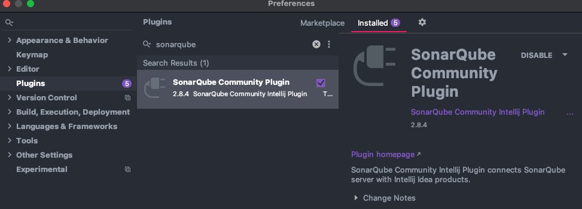
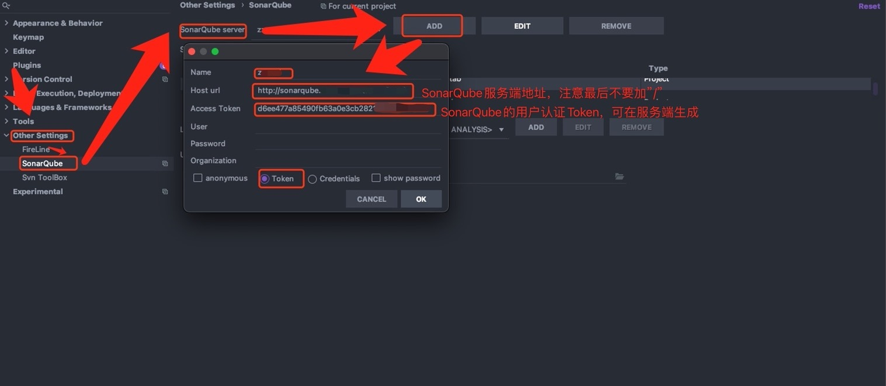
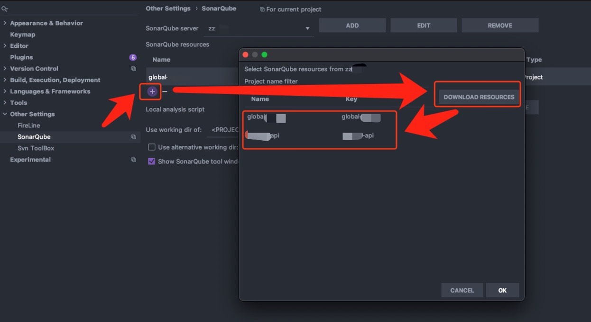
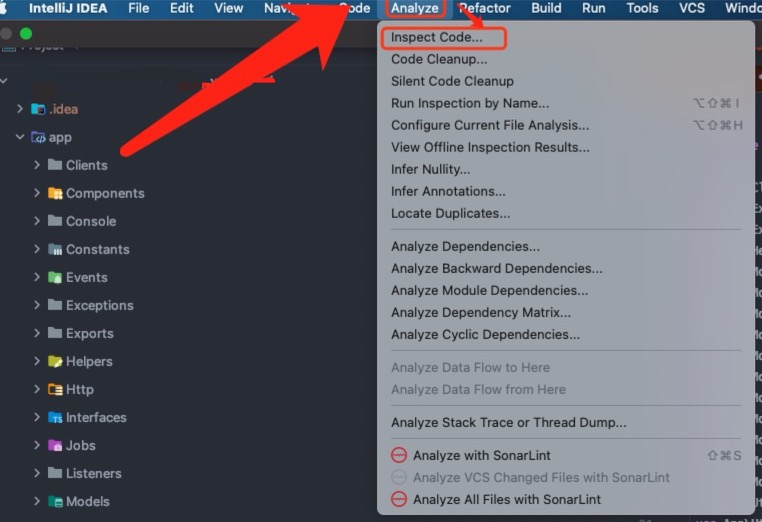
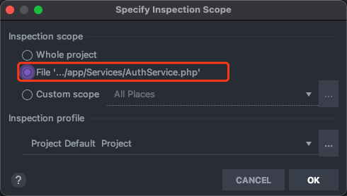
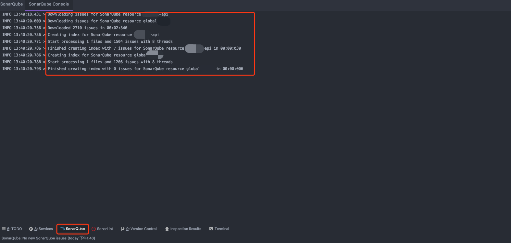
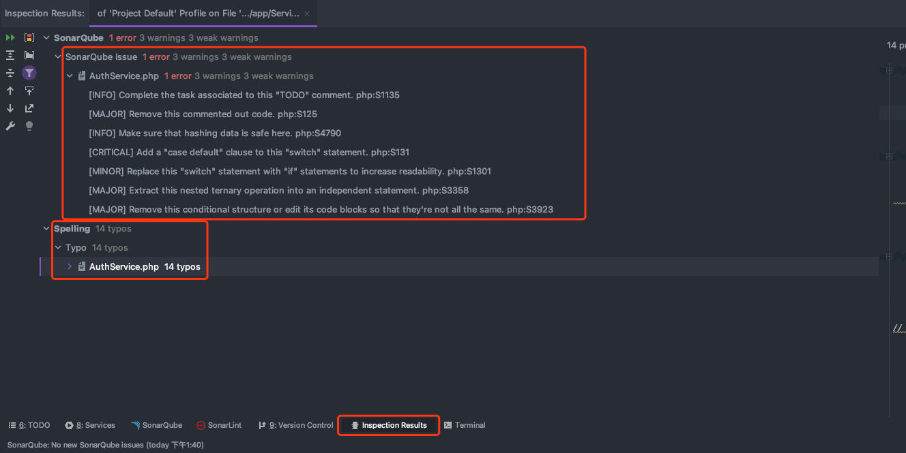

# SonarQube本地IDE插件扫描

# 一、简介

SonarQube扫描代码的步骤是：不管是使用Maven插件还是通用的SonarScanner命令行工具，都是将项目的代码发送到SonarQube服务端进行处理的。由于SonarQube底层组件会用到ElasticSearch服务，如果服务器性能不够好或同时多个项目同时进行了扫描，会造成SonarQube服务端的后台处理任务加重，耗时严重，降低CICD流水线中集成扫描步骤的效率。所以有以下可建议的措施：

- 提高服务器性能

- 减少扫描无用的代码（例如服务端客户端进行exclude配置，只扫关注程度高的代码）

- 在合适的CICD环节再加入代码，增加代码扫描结果的重视程度

  例如在发布到STG环境的CI流水线中加入代码扫描。如果是加在发布到生产环境的CI流水线中，会影响发版上线计划，开发人员来不及修改。如果是加在发布到测试环境的CI流水线中，会因为代码修改频繁，降低代码自动集成效果。而STG环境代码更新没那么频繁，离上线计划时间还有缓存进行修改代码。

- 开发人员在本地开发时先扫描一遍，提前规避掉大部分的代码错误

所以以Jetbrains公司的系列IDE IntelliJIDEA为例进行本地代码扫描。

# 二、IDEA安装配置插件

在IDE的插件管理中心安装名为"`SonarQube Community Plugin`"的插件，然后重启IDE。

插件GitHub地址：https://github.com/sonar-intellij-plugin/sonar-intellij-plugin

## 1、插件中心安装插件

## 2、配置插件添加sonarqueb服务端地址

扫描添加SonarQube服务端已有的项目

# 三、扫描代码（以扫描单个源代码文件为例）

扫描前会先从服务端下载服务端项目中配置的代码规则

会得到以下扫描结果

