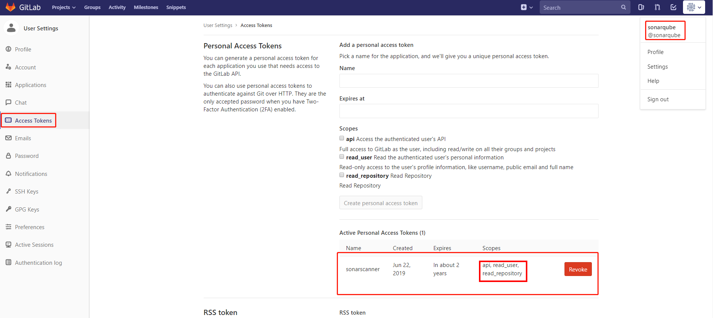

# SonarScanner使用Sonarqube的Gitlab插件将扫描结果以gitlab comment的形式回写到Gitlab

# 一、Context

在Jenkins中做CI过程中,有一个步骤是代码编译完,使用sonar scanner扫描代码,检查静态代码中的语法错误等,然后将扫描结果发送到sonarqube,供项目经理查看代码质量.
sonarqube可以安装插件gitlab,让sonarscanner扫描完代码,将结果以gitlab注释的方式回写到提交的commit中.方便开发人员排查代码.  

以下操作过程各组件的版本
- **sonarqube**: 7.3 (build 15553)
- **sonarscanner**: 3.3.0.1492
- **sonarqube gitlab插件**: 4.0.0
  
    
- **gitlab**: 10.8.4 ce
- **jenkins**:  2.150.2

Jenkins CI流水线是在使用Jenkins Slave(Kubernetes插件动态生成Slave POD)节点中来运行的,所以Sonarscanner,Maven等工具都是在Kubernetes Jenkins Slave镜像中已经安装好的.

# 二、操作

## 1、安装sonar-gitlab-plugin插件

   插件Github:https://github.com/gabrie-allaigre/sonar-gitlab-plugin/
   

## 2、生成用户访问Token

该Token用于客户端调用SonarQube API上传扫描代码时使用


## 3、gitlab创建sonarscanner的用户,并生成AccessKey

在sonarqube 服务端分析生成结果后，会使用该用户的身份在对应代码下以评论的形式显示扫描结果。所以需要该用户的AccessKey有访问Gitlab API的权限。



## 4、在gitlab中将sonarqube加入到对应项目仓库的Members中

设置sonarqube用户在该仓库的角色起码是**开发者**


## 5、Sonarqube中编辑gitlab插件的全局配置

扫描项目时，扫描参数生效优先级如下：

1. UI界面中的全局参数配置
   
2. 项目UI界面中的参数配置
   
3. 项目分析客户端全局配置文件中的参数（例如sonar scanner的全局配置文件/opt/sonarscanner/conf/sonar.properties中的参数）
4. 项目分析客户端命令行中配置的参数

所以可以在UI界面全局配置中配置一些通用、不经常变动的、由管理员控制的参数。例如：gitlab插件的通用配置、gitlab地址等参数


## 6、Jenkins Pipeline中使用sonarscanner扫描代码

```groovy
stage("代码扫描"){
    steps{
        sh "sonar-scanner \
                -Dsonar.host.url=http://sonarqube.apps.okd311.curiouser.com \
                -Dsonar.login=6a6fa6f1702ae42f8d0a0fe14166d9a2 \
                -Dsonar.projectName=demo-springboot2-$GITLABSOURCEBRANCH \
                -Dsonar.projectKey=demo-springboot2-$GITLABSOURCEBRANCH \
                -Dsonar.projectVersion=$GIT_COMMIT \
                -Dsonar.sourceEncoding=UTF-8 \
                -Dsonar.sources=src/main \
                -Dsonar.test=src/test \
                -Dsonar.java.binaries=target/classes \
                -Dsonar.java.test.binaries='target/test-classes/*/*.class' \
                -Dsonar.java.source=8 \
                -Dsonar.gitlab.project_id=1 \
                -Dsonar.gitlab.commit_sha=$GIT_COMMIT \
                -Dsonar.gitlab.ref_name=$GIT_BRANCH \
                -Dsonar.java.coveragePlugin=jacoco \
                -Dsonar.dynamicAnalysis=reuseReports "
    }
}
```

# 三、效果


# 四、Soanarscanner Gitlab插件参数详解

| Variable                                 | Comment                                                      | Type                              | Version  |
| ---------------------------------------- | ------------------------------------------------------------ | --------------------------------- | -------- |
| sonar.gitlab.url                         | GitLab url                                                   | Administration, Variable          | >= 1.6.6 |
| sonar.gitlab.max_global_issues           | Maximum number of anomalies to be displayed in the global comment | Administration, Variable          | >= 1.6.6 |
| sonar.gitlab.user_token                  | Token of the user who can make reports on the project, either global or per project | Administration, Project, Variable | >= 1.6.6 |
| sonar.gitlab.project_id                  | Project ID in GitLab or internal id or namespace + name or namespace + path or url http or ssh url or url or web | Project, Variable                 | >= 1.6.6 |
| sonar.gitlab.commit_sha                  | SHA of the commit comment                                    | Variable                          | >= 1.6.6 |
| sonar.gitlab.ref                         | Branch name or reference of the commit                       | Variable                          | < 3.0.0  |
| sonar.gitlab.ref_name                    | Branch name or reference of the commit                       | Variable                          | >= 1.6.6 |
| sonar.gitlab.max_blocker_issues_gate     | Max blocker issue for build failed (default 0). Note: only for preview mode | Project, Variable                 | >= 2.0.0 |
| sonar.gitlab.max_critical_issues_gate    | Max critical issues for build failed (default 0). Note: only for preview mode | Project, Variable                 | >= 2.0.0 |
| sonar.gitlab.max_major_issues_gate       | Max major issues for build failed (default -1 no fail). Note: only for preview mode | Project, Variable                 | >= 2.0.0 |
| sonar.gitlab.max_minor_issues_gate       | Max minor issues for build failed (default -1 no fail). Note: only for preview mode | Project, Variable                 | >= 2.0.0 |
| sonar.gitlab.max_info_issues_gate        | Max info issues for build failed (default -1 no fail). Note: only for preview mode | Project, Variable                 | >= 2.0.0 |
| sonar.gitlab.ignore_certificate          | Ignore Certificate for access GitLab, use for auto-signing cert (default false) | Administration, Variable          | >= 2.0.0 |
| sonar.gitlab.comment_no_issue            | Add a comment even when there is no new issue (default false) | Administration, Variable          | >= 2.0.0 |
| sonar.gitlab.disable_inline_comments     | Disable issue reporting as inline comments (default false)   | Administration, Variable          | >= 2.0.0 |
| sonar.gitlab.only_issue_from_commit_file | Show issue for commit file only (default false)              | Variable                          | >= 2.0.0 |
| sonar.gitlab.only_issue_from_commit_line | Show issue for commit line only (default false)              | Variable                          | >= 2.1.0 |
| sonar.gitlab.build_init_state            | State that should be the first when build commit status update is called (default pending) | Administration, Variable          | >= 2.0.0 |
| sonar.gitlab.disable_global_comment      | Disable global comment, report only inline (default false)   | Administration, Variable          | >= 2.0.0 |
| sonar.gitlab.failure_notification_mode   | Notification is in current build (exit-code) or in commit status (commit-status) (default commit-status) | Administration, Variable          | >= 2.0.0 |
| sonar.gitlab.global_template             | Template for global comment in commit                        | Administration, Variable          | >= 2.0.0 |
| sonar.gitlab.ping_user                   | Ping the user who made an issue by @ mentioning. Only for default comment (default false) | Administration, Variable          | >= 2.0.0 |
| sonar.gitlab.unique_issue_per_inline     | Unique issue per inline comment (default false)              | Administration, Variable          | >= 2.0.0 |
| sonar.gitlab.prefix_directory            | Add prefix when create link for GitLab                       | Variable                          | >= 2.1.0 |
| sonar.gitlab.api_version                 | GitLab API version (default `v4` or `v3`)                    | Administration, Variable          | >= 2.1.0 |
| sonar.gitlab.all_issues                  | All issues new and old (default false, only new)             | Administration, Variable          | >= 2.1.0 |
| sonar.gitlab.json_mode                   | Create a json report in root for GitLab EE (codeclimate.json or gl-sast-report.json) | Project, Variable                 | >= 3.0.0 |
| sonar.gitlab.query_max_retry             | Max retry for wait finish analyse for publish mode           | Administration, Variable          | >= 3.0.0 |
| sonar.gitlab.query_wait                  | Max retry for wait finish analyse for publish mode           | Administration, Variable          | >= 3.0.0 |
| sonar.gitlab.quality_gate_fail_mode      | Quality gate fail mode: error, warn or none (default error)  | Administration, Variable          | >= 3.0.0 |
| sonar.gitlab.issue_filter                | Filter on issue, if MAJOR then show only MAJOR, CRITICAL and BLOCKER (default INFO) | Administration, Variable          | >= 3.0.0 |
| sonar.gitlab.load_rules                  | Load rules for all issues (default false)                    | Administration, Variable          | >= 3.0.0 |
| sonar.gitlab.disable_proxy               | Disable proxy if system contains proxy config (default false) | Administration, Variable          | >= 4.0.0 |
| sonar.gitlab.merge_request_discussion    | Allows to post the comments as discussions (default false)   | Project, Variable                 | >= 4.0.0 |
| sonar.gitlab.ci_merge_request_iid        | The IID of the merge request if it’s pipelines for merge requests | Project, Variable                 | >= 4.0.0 |

# 五、问题

## 1、当项目是私有仓库时


## 2、获取项目仓库的ProjectID


## 3、gitlab插件4.0.0无法兼容Sonarqube 7.6-community至7.9-community的版本

   报错如下！插件GIthub的原始Issue：https://github.com/gabrie-allaigre/sonar-gitlab-plugin/issues/213

```bash
[ERROR] Failed to execute goalorg.sonarsource.scanner.maven:sonar-maven-plugin:3.6.0.1398:sonar(default-cli) on project egsdloen-bc-facade:com.talanlabs.sonar.plugins.gitlab.CommitPublishPostJob hasunsatisfied dependency 'classcom.talanlabs.sonar.plugins.gitlab.ReporterBuilder' for constructor'public com.talanlabs.sonar.plugins.gitlab.CommitPublishPostJo(com.talanlabs.sonar.plugins.gitlab.GitLabPluginConfigurationcom.talanlabs.sonar.plugins.gitlab.SonarFacadecom.talanlabs.sonar.plugins.gitlab.CommitFacadecom.talanlabs.sonar.plugins.gitlab.ReporterBuilder)' fromorg.sonar.core.platformComponentContainer$ExtendedDefaultPicoContainer@7615666e:512[Immutable:org.sonar.core.platform.ComponentContainer$ExtendedDefaultPicoContaner@364adb24:56<| -> [Help 1]
org.apache.maven.lifecycle.LifecycleExecutionException: Failed toexecute goalorg.sonarsource.scanner.maven:sonar-maven-plugin:3.6.0.1398:sonar(default-cli) on project egsdloen-bc-facade:com.talanlabs.sonar.plugins.gitlab.CommitPublishPostJob hasunsatisfied dependency 'classcom.talanlabs.sonar.plugins.gitlab.ReporterBuilder' for constructor'public com.talanlabs.sonar.plugins.gitlab.CommitPublishPostJo(com.talanlabs.sonar.plugins.gitlab.GitLabPluginConfigurationcom.talanlabs.sonar.plugins.gitlab.SonarFacadecom.talanlabs.sonar.plugins.gitlab.CommitFacadecom.talanlabs.sonar.plugins.gitlab.ReporterBuilder)' fromorg.sonar.core.platformComponentContainer$ExtendedDefaultPicoContainer@7615666e:512[Immutable:org.sonar.core.platform.ComponentContainer$ExtendedDefaultPicoContaner@364adb24:56<|
    at org.apache.maven.lifecycle.internal.MojoExecutor.execute (MojoExecutor.java:215)
    at org.apache.maven.lifecycle.internal.MojoExecutor.execute (MojoExecutor.java:156)
    at org.apache.maven.lifecycle.internal.MojoExecutor.execute (MojoExecutor.java:148)
    at org.apache.maven.lifecycle.internal.LifecycleModuleBuilder.buildProject (LifecycleModuleBuilder.java:117)
    at org.apache.maven.lifecycle.internal.LifecycleModuleBuilder.buildProject (LifecycleModuleBuilder.java:81)
    at org.apache.maven.lifecycle.internal.builder.singlethreaded.SingleThreadedBuilder.build (SingleThreadedBuilder.java:56)
    at org.apache.maven.lifecycle.internal.LifecycleStarter.execute (LifecycleStarter.java:128)
    at org.apache.maven.DefaultMaven.doExecute (DefaultMaven.java:305)
    at org.apache.maven.DefaultMaven.doExecute (DefaultMaven.java:192)
    at org.apache.maven.DefaultMaven.execute (DefaultMaven.java:105)
    at org.apache.maven.cli.MavenCli.execute (MavenCli.java:956)
    at org.apache.maven.cli.MavenCli.doMain (MavenCli.java:288)
    at org.apache.maven.cli.MavenCli.main (MavenCli.java:192)
    at jdk.internal.reflect.NativeMethodAccessorImpl.invoke0 (Native Method)
    at jdk.internal.reflect.NativeMethodAccessorImpl.invoke (NativeMethodAccessorImpl.java:62)
    at jdk.internal.reflect.DelegatingMethodAccessorImpl.invoke (DelegatingMethodAccessorImpl.java:43)
    at java.lang.reflect.Method.invoke (Method.java:564)
    at org.codehaus.plexus.classworlds.launcher.Launcher.launchEnhanced (Launcher.java:289)
    at org.codehaus.plexus.classworlds.launcher.Launcher.launch (Launcher.java:229)
    at org.codehaus.plexus.classworlds.launcher.Launcher.mainWithExitCode (Launcher.java:415)
    at org.codehaus.plexus.classworlds.launcher.Launcher.main (Launcher.java:356)
Caused by: org.apache.maven.plugin.MojoExecutionException:com.talanlabs.sonar.plugins.gitlab.CommitPublishPostJob hasunsatisfied dependency 'classcom.talanlabs.sonar.plugins.gitlab.ReporterBuilder' for constructor'public com.talanlabs.sonar.plugins.gitlab.CommitPublishPostJo(com.talanlabs.sonar.plugins.gitlab.GitLabPluginConfigurationcom.talanlabs.sonar.plugins.gitlab.SonarFacadecom.talanlabs.sonar.plugins.gitlab.CommitFacadecom.talanlabs.sonar.plugins.gitlab.ReporterBuilder)' fromorg.sonar.core.platformComponentContainer$ExtendedDefaultPicoContainer@7615666e:512[Immutable:org.sonar.core.platform.ComponentContainer$ExtendedDefaultPicoContaner@364adb24:56<|
    at org.sonarsource.scanner.maven.bootstrap.ScannerBootstrapper.execute (ScannerBootstrapper.java:67)
    at org.sonarsource.scanner.maven.SonarQubeMojo.execute (SonarQubeMojo.java:104)
    at org.apache.maven.plugin.DefaultBuildPluginManager.executeMojo (DefaultBuildPluginManager.java:137)
    at org.apache.maven.lifecycle.internal.MojoExecutor.execute (MojoExecutor.java:210)
    at org.apache.maven.lifecycle.internal.MojoExecutor.execute (MojoExecutor.java:156)
    at org.apache.maven.lifecycle.internal.MojoExecutor.execute (MojoExecutor.java:148)
    at org.apache.maven.lifecycle.internal.LifecycleModuleBuilder.buildProject (LifecycleModuleBuilder.java:117)
    at org.apache.maven.lifecycle.internal.LifecycleModuleBuilder.buildProject (LifecycleModuleBuilder.java:81)
    at org.apache.maven.lifecycle.internal.builder.singlethreaded.SingleThreadedBuilder.build (SingleThreadedBuilder.java:56)
    at org.apache.maven.lifecycle.internal.LifecycleStarter.execute (LifecycleStarter.java:128)
    at org.apache.maven.DefaultMaven.doExecute (DefaultMaven.java:305)
    at org.apache.maven.DefaultMaven.doExecute (DefaultMaven.java:192)
    at org.apache.maven.DefaultMaven.execute (DefaultMaven.java:105)
    at org.apache.maven.cli.MavenCli.execute (MavenCli.java:956)
    at org.apache.maven.cli.MavenCli.doMain (MavenCli.java:288)
    at org.apache.maven.cli.MavenCli.main (MavenCli.java:192)
    at jdk.internal.reflect.NativeMethodAccessorImpl.invoke0 (Native Method)
    at jdk.internal.reflect.NativeMethodAccessorImpl.invoke (NativeMethodAccessorImpl.java:62)
    at jdk.internal.reflect.DelegatingMethodAccessorImpl.invoke (DelegatingMethodAccessorImpl.java:43)
    at java.lang.reflect.Method.invoke (Method.java:564)
    at org.codehaus.plexus.classworlds.launcher.Launcher.launchEnhanced (Launcher.java:289)
    at org.codehaus.plexus.classworlds.launcher.Launcher.launch (Launcher.java:229)
    at org.codehaus.plexus.classworlds.launcher.Launcher.mainWithExitCode (Launcher.java:415)
    at org.codehaus.plexus.classworlds.launcher.Launcher.main (Launcher.java:356)
[ERROR] 
[ERROR] 
[ERROR] For more information about the errors and possible solutions please read the following articles:
[ERROR] [Help 1] http://cwiki.apache.org/confluence/display/MAVENMojoExecutionException
```

**原因**


**解决方案**


已经修改编译好的插件Jar包：https://github.com/gabrie-allaigre/sonar-gitlab-plugin/releases/download/4.1.0-SNAPSHOT/sonar-gitlab-plugin-4.1.0-SNAPSHOT.jar

# 参考链接

1. https://gitlab.com/gitlab-org/gitlab-ce/issues/28342
2. https://www.cnblogs.com/amyzhu/p/8988519.html
