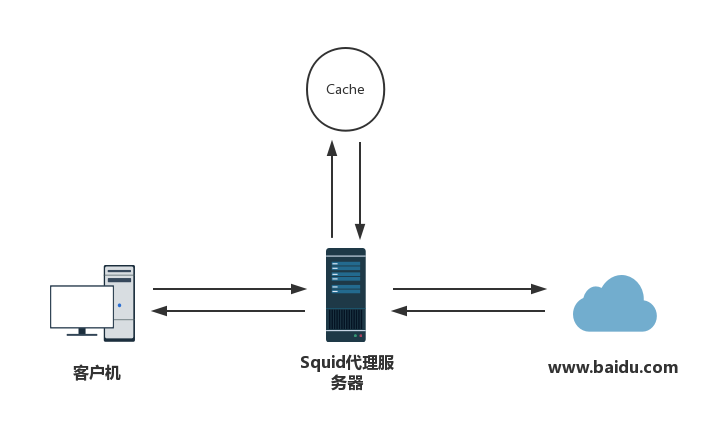

# 正向代理服务Squid

# 一、简介

Squid是一个高性能的正向代理缓存服务器，支持FTP、gopher、HTTPS、HTTP等协议，主要提供了缓存加速、应用层过滤的功能。和一般的代理缓存软件不同，Squid用一个单独的、非模块化的、I/O驱动的进程来处理所有的客户端请求。

squid代理服务器的工作机制：



代理服务器（Proxy Server）是个人网络和Internet服务商之间的中间代理机构，负责转发合法的网络信息，对转发进行控制和登记。其最基本的功能就是连接，此外还包括安全性、缓存，内容过滤，访问控制管理等功能。当客户机通过代理请求Web页面时，执行的代理服务器会先检查自己的缓存，当缓存中有客户机需要访问的页面，则直接将缓存服务器中的页面内容反馈给客户机；如果缓存中没有客户机需要访问的页面，则由代理服务器想Internet发送访问请求，当获得返回的Web页面以后，将页面数据保存到缓存中并发送给客户机。
由于客户机的web访问请求实际上代理服务器来代替完成的，所以隐藏了用户的真实IP地址，从而起到一定的保护作用。

Squid可以基于访问控制列表（ACL）和访问权限列表（ARL）执行内容过滤与权限管理功能，还可以基于多种条件禁止用户访问存在威胁或不适宜的网站资源。

根据实现的方式不同，正向代理模式可以分为：

- **`传统代理`**：也就是普通的代理服务，需要我们客户端在浏览器、聊天工具等一些程序中设置代理服务器的地址和端口，然后才能使用代理来访问网络，这种方式相比较而言比较麻烦，因为客户机还需手动指定代理服务器，所以一般用于Internet环境。

- **`透明代理`**：与传统代理实现的功能是一样的，区别在于客户机不需要手动指定代理服务器的地址和端口，而是通过默认路由、防火墙策略将web访问重定向，实际上仍然交给代理服务器来处理，重定向的过程完全是由squid服务器进行的，所以对于客户机来说，甚至不知道自己使用了squid代理服务，因此呢，我们称之为透明模式。透明代理多用于局域网环境，如在Linux网关中启用透明代理后，局域网主机无须进行额外设置就能享受更好的上网速度。

# 二、安装

**YUM**

```bash
yum install squid -y; \
systemctl enable squid; \
systemctl start squid
```

# 三、传统代理服务配置

配置文件/etc/squid/squid.conf

```bash
acl localnet src 10.0.0.0/8     # RFC1918 possible internal network
acl localnet src 172.16.0.0/12  # RFC1918 possible internal network
acl localnet src 192.168.0.0/16 # RFC1918 possible internal network
acl localnet src fc00::/7       # RFC 4193 local private network range
acl localnet src fe80::/10      # RFC 4291 link-local (directly plugged) machines
acl SSL_ports port 443
acl Safe_ports port 80          # http
acl Safe_ports port 21          # ftp
acl Safe_ports port 443         # https
acl Safe_ports port 70          # gopher
acl Safe_ports port 210         # wais
acl Safe_ports port 1025-65535  # unregistered ports
acl Safe_ports port 280         # http-mgmt
acl Safe_ports port 488         # gss-http
acl Safe_ports port 591         # filemaker
acl Safe_ports port 777         # multiling http
acl CONNECT method CONNECT
http_access allow Safe_ports
http_access deny CONNECT !SSL_ports
http_access allow localhost manager
http_access deny manager
http_access allow localnet
http_access allow localhost
http_access deny all
http_port 3128                  # Squid代理服务监听端口
cache_dir ufs /data/squid 100 16 256
coredump_dir /data/squid
refresh_pattern ^ftp:           1440    20%     10080
refresh_pattern ^gopher:        1440    0%      1440
refresh_pattern -i (/cgi-bin/|\?) 0     0%      0
refresh_pattern .               0       20%     4320
```

# 四、常用命令

## 1、启动等命令

```bash
squid reload            #不重启服务，生效配置
squid –z                #初始化缓存空间  初始化你在 squid.conf 里配置的 cache 目录,只需要第一次的时候执行就可以了
squid -k parse          #验证squid.conf的语法和配置
squid -N -d1            #在前台启动squid，并输出启动过程
squid -s                #后台运行squid。
squid -k shutdown       #停止 squid
squid -k reconfigure    #载入新的配置文件
squid -k rotate         #轮循日志 
```

## 2、squid命中率分析

```bash
# 获取squid运行状态信息
squidclient -p 3128 mgr:info
squidclient -p 3128 mgr:5min
# 可以看到详细的性能情况,其中PORT是你的proxy的端口，5min可以是60min

#获取squid内存使用情况
squidclient -p 3128 mgr:mem

#获取squid已经缓存的列表
squidclient -p 3128 mgr:objects
use it carefully,it may crash

#获取squid的磁盘使用情况
 squidclient -p 3128 mgr:diskd

#强制更新某个url
squidclient -p 3128 -m PURGE http://www.xxx.com/xxx.php

#更多的请查看
squidclient -h 或者 squidclient -p 3128 mgr:

#查命中率：
squidclient -h(具体侦听IP) -p80(具体侦听端口)  mgr:info
```

## 3、定期清除swap.state内无效数据

当squid应用运行了一段时间以后，cache_dir对应的swap.state文件就会变得越来越大，里面的无效接口数据越来越多，这可能影响squid的响应时间，因此需要使用rotate命令来使squid清理swap.state里面的无效数据，减少swap.state的大小

```bash
squid -k rotate -f /path/to/squid/conf_file

#添加定时清理任务

vi /etc/crontab
0        0       *       *       *       root    /usr/local/sbin/squid -k rotate -f /usr/local/etc/squid/squid1.conf
```

## 4、统计客户端个数

```bash
netstat -lanp|grep 3128|grep "ESTABLISHED"|awk '{print $5}'|awk -F':' '{print $1}'|sort -u|wc -l
```

## 5、统计客户端的连接总数

```bash
netstat -lanp|grep 3128|grep "ESTABLISHED"|wc -l
```

## 6、显示传输数据大于指定大小的访问

```bash
 tailf /var/log/squid/access.log | awk '{if($5>1000)print}'|awk '{print $3 " " $5 " " $7}'
```

# 五、日志默认输出格式

squid日志配置项是在/etc/squid/squid.conf中配置的，默认日志输出文件路径/var/log/squid/access.log

默认的日志输出格式

```bash
#1:时间戳 2:响应时间 3:客户端IP 4:结果/状态码 5:传输大小 6:请求方式 7:客户端请求的URL 8:客户端身份 9:对端编码/对端主机 10:内容类型
1531077064.951 81 10.248.2.67 TCP_MISS/200 6277 GET http://bbs.talkop.com/forum.php? - HIER_DIRECT/180.76.184.69 text/xml
```

- **`时间戳（%tl %ts）`**: 请求完成时间，以 Unix 时间来记录的（UTC 1970-01-01 00:00:00 开始的时间）它是毫秒级的。squid使用这种格式而不是人工可读的时间格式，是为了简化某些日志处理程序的工作
- **`响应时间（%6tr）`**: 对HTTP响应来说，该域表明squid花了多少时间来处理请求。在squid接收到HTTP请求时开始计时，在响应完全送出后计时终止。响应时间是毫秒级的。尽管时间值是毫秒级的，但是精度可能是10毫秒。在squid负载繁重时，计时变得没那么精确
- **`客户端地址（%>a）`**: 该域包含客户端的IP地址，或者是主机名
- **`结果/状态码（%Ss/%03Hs）`**: 该域包含2个 token，以斜杠分隔。第一个token叫结果码，它把协议和响应结果（例如TCP_HIT或UDP_DENIED）进行归类。这些是squid专有的编码，以TCP_开头的编码指HTTP请求，以UDP_开头的编码指ICP查询。第2个token是HTTP响应状态码（例如200,304,404等）。状态码通常来自原始服务器。在某些情形下，squid可能有义务自己选择状态码
- **`传输size（%<st）`**: 该域指明传给客户端的字节数。严格的讲，它是squid告诉TCP/IP协议栈去发送给客户端的字节数。这就是说，它不包括TCP/IP头部的overhead。也请注意，传输size正常来说大于响应的Content-Length。传输size包括了HTTP响应头部，然而Content- Length不包括
- **`请求方式（%rm）`**: 该域包含请求方式
- **`URI（%ru）`**: 该域包含来自客户端请求的URI。大多数记录下来的URI实际是URL（例如，它们有主机名）。在记日志时，squid删掉了在第一个问号(?)之后的所有URI字符，除非禁用了strip_query_terms指令
- **`客户端身份`**: 无
- **`对端编码/对端主机`**: 对端信息包含了2个token，以斜杠分隔。它仅仅与cache 不命中的请求有关。第一个token指示如何选择下一跳，第二个token是下一跳的地址。当squid发送一个请求到邻居cache时，对端主机地址是邻居的主机名。假如请求是直接送到原始服务器的，则squid会写成原始服务器的IP地址或主机名–假如禁用了log_ip_on_direct。NONE/-这个值指明squid不转发该请求到任何其他服务器
- **`内容类型（%mt）`**: 原始access.log的默认的最后一个域，是HTTP响应的内容类型。 squid从响应的Content-Type头部获取内容类型值。假如该头部丢失了，squid使用一个横杠(-)代替

假如激活了 log_mime_hdrs 指令，squid在每行追加2个附加的域：

- **`HTTP请求头部`**: Squid 编码HTTP请求头部，并且在一对方括号之间打印它们。方括号是必须的，因为squid不编码空格字符。编码方案稍许奇怪。回车（ASCII 13）和换行（ASCII 10）分别打印成\r和\n。其他不可打印的字符以RFC 1738风格来编码，例如Tab（ASCII 9）变成了%09。
- **`HTTP响应头部`**: Squid编码HTTP响应头部，并且在一对方括号之间打印它们。注意这些是发往客户端的头部，可能不同于从原始服务器接收到的头部。

# 参考链接

1. http://www.squid-cache.org/
2. https://blog.51cto.com/10693404/2149207
3. https://blog.51cto.com/14154700/2406060
